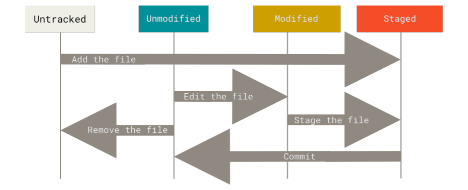

# Clone & Git Basics Sum

### Git Workflow 개념


Git이 적용되는 과정은 크게 세 단계다.

1. Working directory(.git이 들어있는 폴더)내 자료 수정
2. 수정한 파일 중 server에 올리고 싶은 파일 선택 Staging Area로 넘어감
3. commit하면 repository로 넘어감. 수정 기록은 .git에 저장

### Git Basic Chapter 요약

- git init
  버전 체크를 하고 싶은 폴더에 들어가 git init을 쓰면 해당 폴더는 버전 관리가 된다.
  해당폴더 내에 숨김폴더로 .git이 새로 생성된다.
- git add \*.c → git commit -m ‘commit 내용’
  - 폴더 내 버전 관리가 필요한 파일 또는 폴더를 고르고 commit한다. 최초로 commit 된 후 관련 자료들에 대한 version check이 지속된다.
- git clone <url> filename(옵션 = 바꾸고 싶은 폴더명)
  clone은 말그대로 server에 올라가 있는 모든 자료를 받는다. 다른 버전관리 프로그램과 다르게 History도 다 가지고 온다. 모든 버전이 Pull down 된다고 한다. 서버에 있는 자료(기존에 수정된 모든 내역 포함)를 가지고 오는 것을 Clone이라고 하고 서버에서 필요한 자료만 가지고 오는 것을 pull이라고 한다.(Pull 공부해서 수정하기)
  Untracked files와 Tracked files가 있음. Tracked files는 Last snapshot에 있다고함.
  - 용어정리
    Modified: 수정은 했으나 서버에 commit하지 않은 자료들
    Staged: 수정했고 서버에 commit한 자료들
    Committed: Staged 자료들을 저장한 것.
    
    Tracked Files의 4단계
  - Untracked 버전 관리가 필요없는 자료
  - Unmodified 최신버전에서 수정이 되지 않은 자료
  - Modified 최신버전에서 수정된 자료
  - Staged(=Tracked) git add에 포함된 자료를 말하는 듯
- git status

  ```markup
  $ git status
  On branch master
  Your branch is up-to-date with 'origin/master'.
  nothing to commit, working tree clean
  ```

  Status를 확인했을 때 위와 같은 결과가 나온다면 어떤 Tracked Files도 수정되지 않았음을 설명하는 것임.

  ```markdown
  $ git status
  On branch master
  Your branch is up-to-date with 'origin/master'.

  **Changes to be committed: Untracked File이 추가 됐을때**
  (use "git reset HEAD <file>..." to unstage)

  new file: README

  **Changes not staged for commit: Tracked file이 수정 됐을때**

  (use "git add <file>..." to update what will be committed)
  (use "git checkout -- <file>..." to discard changes in working directory)

  modified: [CONTRIBUTING.md](http://contributing.md/)
  ```

  Tracked file과 Untracked file이 동시에 존재하는 경우 위와 같은 결과가 나온다.
  해당 파일들을 어떻게 처리해야할지 친절하게 코드도 알려준다.

- .gitignore
  프로그램을 실행하거나 정리하다보면 log 파일이나 Temp 파일 build 파일들이 자동으로 생성된다. 이러한 자료들이 원치않게 Stage되지 않도록 막기 위해 사용한다.

  ```markdown
  $ cat .gitignore <= cat이 뭐지
  _.[oa] <= .o or .a 확장자 들어있는 파일 무시
  _~ <= ~ 포함 파일 무시

  #### 이외에도 # / !는 자동으로 제외됨 Git guide 30page(pdf 37)참조
  ```

- git commit

  git commit은 staged된 자료를 commit된 자료로 변경하는 과정임.

  > _Remember that the commit records the snapshot you set up in your staging area. Anything you didn’t stage is still sitting there modified; you can do another commit to add it to your history. Everytime you perform a commit, you’re recording a snapshot of your project that you can revert to or compare to later. Git guide 35page(pdf 41)_

  - Snapshot은 변경된 내용을 표시해주는 방식을 말함
  - modified files를 add하면 Staged files로 바뀜 개념으로만 알고 있으면 됨.

    <aside>
    💡 Git commit **-a** -m ‘commit내용’ 할 경우 git. add 필요 없이 commit 가능 
    **But** -a는 모든 files를 add하는 것과 같아서 원치않은 자료를 포함할수 있음.

    </aside>

- git rm

  tracked file을 지우기 위한 코드이다. 실제 파일도 지워버린다. 지우고 나서도 commit을 해야한다. 만약 modifed된 파일이거나 git add한 뒤 특정 파일을 지우고 싶다면 git rm -f로 적어야 한다.

  git rm -- cached 는 git에서만 지우고 자료는 남겨둔다.

  ```markdown
  $ git rm log/\*.log <= log folder에 있는 .log 확장자 파일들 전부 삭제

  ### \*로 쓰는 이유는

  "Git does its own filename expansion
  in addition to your shell’s filename expansion"
  라는데 무슨말인지 모르겠다.
  ```

- git mv <file_name>(현재) <file_name>(바꿀)
  git 문법이 아닌 폴더로 들어가 파일 이름을 바꾸고나서 Commit 하더라도 업데이트가 되지 않음. mv 문법은 파일 이름을 바꾸기 위한 용도로 사용됨.
  mv는 moving을 의미하지만 자료의 rename 용도로 쓰는 이유는 git mv가 아래의 기능을 수행하기 때문임.
  ```bash
  $ mv README.md README
  $ git rm README.md
  $ git add README
  ```
- git log
  commit history를 보고 싶을때 사용함. git log -patch(or -p)를 쓸 경우 차이점을 여줌 → 이 기능은 깃허브에서 보는게 더 좋으니 안쓸 것 같음.
- git commit -- amend
  commit을 하고나서 파일을 다시 수정해야한다거나 commit message를 다시 작성해야할 경우, 모든 수정을 다 마친 뒤 해당 명령어를 입력하면 이전 commit을 완전히 대체함. 최신버전의 Minor한 수정을 지원하기 위한 용도임. 만약 수정 없이 commit message만 바꾸고 싶을때도 사용가능하다. 이때 이전 message를 덮어쓰기함
- git reset HEAD
  Staging area에 있는 파일(git add에 넣은 파일)을 다시 modified 파일로 옮겨줌. 개념을 표현한 것이라 말이 어렵긴 하지만 쉽게말하면 git add를 취소하는 명령어다.
  Git guide 255p를 보면 git reset을 자세히 공부 할 수 있음
- git checkout -- <file_name>
  수정한 파일을 다시 최신 commit에 있는 파일로 다시 바꾸고 싶을 때 활용함. v2를 작성하던 중 다시 원본파일로 바꾸려면 git checkout을 하면 됨.
  Git Data Recovery관련 사항
  > _Remember, anything that is committed in Git can almost always be recovered. Even commits that were on branches that were deleted or commits that were overwritten with an --amend commit can be recovered (see Data Recovery for data recovery). However, anything you lose that was never committed is likely never to be seen again. git guide 48p_
- git restore --staged <file_name>
  Staging area에 있는 file을 골라서 working directory로 옮길 수 있음. git reset HEAD는 staging area 내 모든 파일을 없애는거라면 해당 커맨드는 불필요한 파일을 골라서 빼낼 수 있음.
  ! git restore<file_name>은 checkout과 기능이 똑같음.
- Remote Repository 적용
    <aside>
    💡 Remote repository는 꼭 물리적으로 분리되어있을 필요 없음. 내 컴퓨터 안에서도 구현 가능
    
    </aside>

- git remote
  ```markup
  $ git clone https://github.com/schacon/ticgit
  Cloning into 'ticgit'...
  remote: Reusing existing pack: 1857, done.
  remote: Total 1857 (delta 0), reused 0 (delta 0)
  Receiving objects: 100% (1857/1857), 374.35 KiB | 268.00 KiB/s, done.
  Resolving deltas: 100% (772/772), done.
  Checking connectivity... done.
  $ git remote
  **origin < = Clone한 Server name을 origin으로 부름**
  ```
  git remote -v는 연결 된 url을 보여줌
- git remote add <short_name> <url>
  연결된 remote repository 이름을 바꿀 수 있음. <short_name>은 <url>주소를 대체함.
- git fetch <short_name>
  해당 remote repository에서 local에 없는 자료를 가지고 오는 명령어임. git fetch origin은 clone 이후 remote repository에 반영 된 내용들을 다운받음. 다운 받은 파일들은 local에서 수정중인 파일을 건들지 않고 별도로 저장됨. 따라서 수정한 파일과 다운 받은 파일을 나중에 merge해야함.
- git pull
  해당 커맨드는 remote repository 변경사항을 자동으로 fetch해주고 merge까지 수행한다. git clone을 할 경우 자동으로 remote repo의 내용을 받아오게 되어 있음.
  > _Running git pull generally fetches data from the server you originally cloned from and automatically tries to merge it into the code you’re currently working on. - Git guide 52p_
- git push <remote_repository> <branch>
  git push origin master ⇒ origin이라 불려지는 remote repository에 local에 있는 master라는 이름의 branch를 push하라는 말임(origin은 clone한 remote repository를 말함)
- git remote show <remote>
  Remote Repository관련 정보를 불러옴
- git remote rename <repo_name(전)> <repo_name(후)>
- git remote remove <remote repo name>
  remote repository와 연결 해제
  

### 궁금함

- Check out 그리고 checkout 용어가 뭐지?
- Snapshot
- Metadata
- Hash
- SHA-1 checksum
- fetch
  파일을 가지고 오는 것
