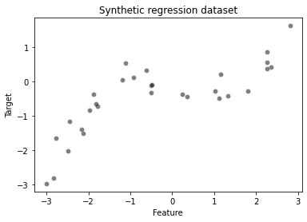
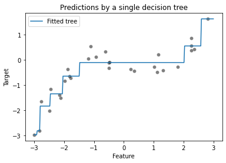
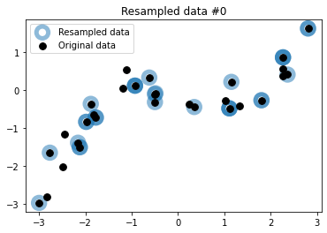
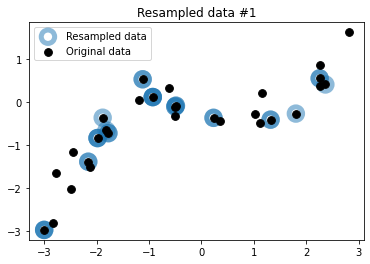
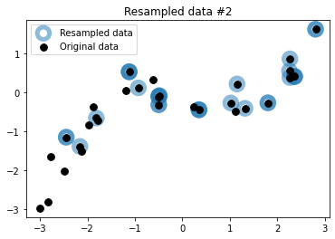
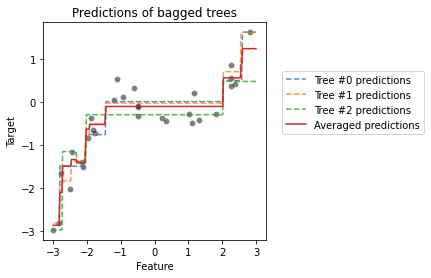
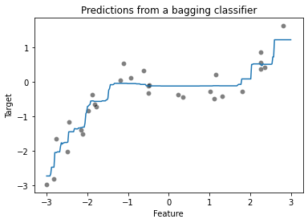
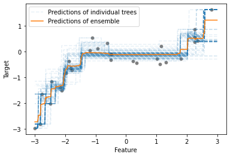
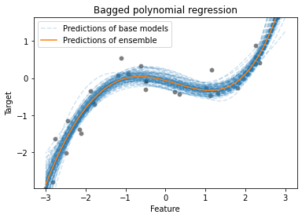

```python
import pandas as pd
import numpy as np

# create a random number generator that will be used to set the randomness
rng = np.random.RandomState(1)


def generate_data(n_samples=30):
    """Generate synthetic dataset. Returns `data_train`, `data_test`,
    `target_train`."""
    x_min, x_max = -3, 3
    x = rng.uniform(x_min, x_max, size=n_samples)
    noise = 4.0 * rng.randn(n_samples)
    y = x ** 3 - 0.5 * (x + 1) ** 2 + noise
    y /= y.std()

    data_train = pd.DataFrame(x, columns=["Feature"])
    data_test = pd.DataFrame(
        np.linspace(x_max, x_min, num=300), columns=["Feature"])
    target_train = pd.Series(y, name="Target")

    return data_train, data_test, target_train
```

It uses bootstrap resampling (random sampling with replacement) to learn several models on random variations of the training set.

At predict time, the predictions of each learner are aggregated to give the final predictions.

```python
import matplotlib.pyplot as plt
import seaborn as sns

data_train, data_test, target_train = generate_data(n_samples=30)
sns.scatterplot(x=data_train["Feature"], y=target_train, color="black",
                alpha=0.5)
_ = plt.title("Synthetic regression dataset")
```



### Bootstrap 사용 전

```python
from sklearn.tree import DecisionTreeRegressor

tree = DecisionTreeRegressor(max_depth=3, random_state=0)
tree.fit(data_train, target_train)
y_pred = tree.predict(data_test)
```

```python
sns.scatterplot(x=data_train["Feature"], y=target_train, color="black",
                alpha=0.5)
plt.plot(data_test["Feature"], y_pred, label="Fitted tree")
plt.legend()
_ = plt.title("Predictions by a single decision tree")
```



### Bootstrap resampling

Bootstrapping is a resampling “with replacement” of the original dataset. It corresponds to sampling n out of n data points with replacement uniformly at random from the original dataset.

```python
def bootstrap_sample(data, target):
    # Indices corresponding to a sampling with replacement of the same sample
    # size than the original data
    bootstrap_indices = rng.choice(
        np.arange(target.shape[0]), size=target.shape[0], replace=True,
    )
    # In pandas, we need to use `.iloc` to extract rows using an integer
    # position index:
    data_bootstrap = data.iloc[bootstrap_indices]
    target_bootstrap = target.iloc[bootstrap_indices]
    return data_bootstrap, target_bootstrap
```

```python
n_bootstraps = 3
for bootstrap_idx in range(n_bootstraps):
    # draw a bootstrap from the original data
    data_bootstrap, target_bootstrap = bootstrap_sample(
        data_train, target_train,
    )
    plt.figure()
    plt.scatter(data_bootstrap["Feature"], target_bootstrap,
                color="tab:blue", facecolors="none",
                alpha=0.5, label="Resampled data", s=180, linewidth=5)
    plt.scatter(data_train["Feature"], target_train,
                color="black", s=60,
                alpha=1, label="Original data")
    plt.title(f"Resampled data #{bootstrap_idx}")
    plt.legend()
```







- Some of the points are randomly resampled several times and appear as darker blue circles.

- bootstrap은 진짜 무작위로 뽑는듯 심지어 중복 되더라도 상관 없음

```python
data_train_huge, data_test_huge, target_train_huge = generate_data(
    n_samples=100_000)
data_bootstrap_sample, target_bootstrap_sample = bootstrap_sample(
    data_train_huge, target_train_huge)

ratio_unique_sample = (np.unique(data_bootstrap_sample).size /
                       data_bootstrap_sample.size)
print(
    f"Percentage of samples present in the original dataset: "
    f"{ratio_unique_sample * 100:.1f}%")
```

    Percentage of samples present in the original dataset: 63.2%

```python
bag_of_trees = []
for bootstrap_idx in range(n_bootstraps):
    tree = DecisionTreeRegressor(max_depth=3, random_state=0)

    data_bootstrap_sample, target_bootstrap_sample = bootstrap_sample(
        data_train, target_train)
    tree.fit(data_bootstrap_sample, target_bootstrap_sample)
    bag_of_trees.append(tree)
```

```python
sns.scatterplot(x=data_train["Feature"], y=target_train, color="black",
                alpha=0.5)
for tree_idx, tree in enumerate(bag_of_trees):
    tree_predictions = tree.predict(data_test)
    plt.plot(data_test["Feature"], tree_predictions, linestyle="--", alpha=0.8,
             label=f"Tree #{tree_idx} predictions")

plt.legend()
_ = plt.title("Predictions of trees trained on different bootstraps")
```


### Aggregating

the most straightforward way to combine those predictions is just to average them: for a given test data point, we feed the input feature values to each of the n trained models in the ensemble and as a result compute n predicted values for the target variable.

```python
plt.figure(figsize=(4,4))
sns.scatterplot(x=data_train["Feature"], y=target_train, color="black",
                alpha=0.5)

bag_predictions = []
for tree_idx, tree in enumerate(bag_of_trees):
    tree_predictions = tree.predict(data_test)
    plt.plot(data_test["Feature"], tree_predictions, linestyle="--", alpha=0.8,
             label=f"Tree #{tree_idx} predictions")
    bag_predictions.append(tree_predictions)

bag_predictions = np.mean(bag_predictions, axis=0)
plt.plot(data_test["Feature"], bag_predictions, label="Averaged predictions",
         linestyle="-")
plt.legend(bbox_to_anchor=(1.05, 0.8), loc="upper left")
_ = plt.title("Predictions of bagged trees")
```



- The unbroken red line shows the averaged predictions, which would be the final predictions given by our ‘bag’ of decision tree regressors.

- Note that the predictions of the ensemble is more stable because of the averaging operation.

### Sklearn에서 Bagging

- Because we use 100 trees in the ensemble, the average prediction is indeed slightly smoother but very similar to our previous average plot.

```python
from sklearn.ensemble import BaggingRegressor

bagged_trees = BaggingRegressor(
    base_estimator=DecisionTreeRegressor(max_depth=3),
    n_estimators=100,
)
_ = bagged_trees.fit(data_train, target_train)

sns.scatterplot(x=data_train["Feature"], y=target_train, color="black",
                alpha=0.5)

bagged_trees_predictions = bagged_trees.predict(data_test)
plt.plot(data_test["Feature"], bagged_trees_predictions)

_ = plt.title("Predictions from a bagging classifier")
```



```python
for tree_idx, tree in enumerate(bagged_trees.estimators_):
    label = "Predictions of individual trees" if tree_idx == 0 else None
    # we convert `data_test` into a NumPy array to avoid a warning raised in scikit-learn
    tree_predictions = tree.predict(data_test.to_numpy())
    plt.plot(data_test["Feature"], tree_predictions, linestyle="--", alpha=0.1,
             color="tab:blue", label=label)

sns.scatterplot(x=data_train["Feature"], y=target_train, color="black",
                alpha=0.5)

bagged_trees_predictions = bagged_trees.predict(data_test)
plt.plot(data_test["Feature"], bagged_trees_predictions,
         color="tab:orange", label="Predictions of ensemble")
_ = plt.legend()
```



### Pipeline과 Bagging 사용하기

- This pipeline first scales the data to the 0-1 range with MinMaxScaler.
- Note that we intentionally use a small value for the regularization parameter `alpha` as we expect the bagging ensemble to work well with slightly overfit base models.

```python
from sklearn.linear_model import Ridge
from sklearn.preprocessing import PolynomialFeatures
from sklearn.preprocessing import MinMaxScaler
from sklearn.pipeline import make_pipeline

polynomial_regressor = make_pipeline(MinMaxScaler(), PolynomialFeatures(degree=4),Ridge(alpha=1e-10))
```

```python
bagging = BaggingRegressor(
    base_estimator=polynomial_regressor,
    n_estimators=100,
    random_state=0,
)
_ = bagging.fit(data_train, target_train)
```

```python
for i, regressor in enumerate(bagging.estimators_):
    # we convert `data_test` into a NumPy array to avoid a warning raised in scikit-learn
    regressor_predictions = regressor.predict(data_test.to_numpy())
    base_model_line = plt.plot(
        data_test["Feature"], regressor_predictions, linestyle="--", alpha=0.2,
        label="Predictions of base models" if i == 0 else None,
        color="tab:blue"
    )

sns.scatterplot(x=data_train["Feature"], y=target_train, color="black",
                alpha=0.5)
bagging_predictions = bagging.predict(data_test)
plt.plot(data_test["Feature"], bagging_predictions,
         color="tab:orange", label="Predictions of ensemble")
plt.ylim(target_train.min(), target_train.max())
plt.legend()
_ = plt.title("Bagged polynomial regression")
```



- The predictions of this bagged polynomial regression model looks qualitatively better than the bagged trees. This is somewhat expected since the base model better reflects our knowledge of the true data generating process.

### Exercise

```python
from sklearn.datasets import fetch_california_housing
from sklearn.model_selection import train_test_split

data, target = fetch_california_housing(as_frame=True, return_X_y=True)
target *= 100  # rescale the target in k$
data_train, data_test, target_train, target_test = train_test_split(
    data, target, random_state=0, test_size=0.5)
```

```python
from sklearn.ensemble import BaggingRegressor
from sklearn.tree import DecisionTreeRegressor
from sklearn.metrics import mean_absolute_error

bagging = BaggingRegressor(base_estimator=DecisionTreeRegressor(),n_jobs=2)
bagging.fit(data_train, target_train)
target_predicted = bagging.predict(data_test)
print(mean_absolute_error(target_test, target_predicted))
```

    37.09032378875969

```python
# solution
from sklearn.metrics import mean_absolute_error
from sklearn.tree import DecisionTreeRegressor
from sklearn.ensemble import BaggingRegressor

tree = DecisionTreeRegressor()
bagging = BaggingRegressor(base_estimator=tree, n_jobs=2)
bagging.fit(data_train, target_train)
target_predicted = bagging.predict(data_test)
print(f"Basic mean absolute error of the bagging regressor:\n"
      f"{mean_absolute_error(target_test, target_predicted):.2f} k$")
```

    Basic mean absolute error of the bagging regressor:
    36.31 k$

```python
from scipy.stats import randint
from sklearn.model_selection import RandomizedSearchCV

param_grid = {
    "n_estimators": randint(10, 30),
    "max_samples": [0.5, 0.8, 1.0],
    "max_features": [0.5, 0.8, 1.0],
    "base_estimator__max_depth": randint(3, 10),
}
search = RandomizedSearchCV(
    bagging, param_grid, n_iter=20, scoring="neg_mean_absolute_error"
)
_ = search.fit(data_train, target_train)
```

```python
import pandas as pd

columns = [f"param_{name}" for name in param_grid.keys()]
columns += ["mean_test_error", "std_test_error"]
cv_results = pd.DataFrame(search.cv_results_)
cv_results["mean_test_error"] = -cv_results["mean_test_score"]
cv_results["std_test_error"] = cv_results["std_test_score"]
cv_results[columns].sort_values(by="mean_test_error")
```

<div>
<style scoped>
    .dataframe tbody tr th:only-of-type {
        vertical-align: middle;
    }

    .dataframe tbody tr th {
        vertical-align: top;
    }

    .dataframe thead th {
        text-align: right;
    }

</style>
<table border="1" class="dataframe">
  <thead>
    <tr style="text-align: right;">
      <th></th>
      <th>param_n_estimators</th>
      <th>param_max_samples</th>
      <th>param_max_features</th>
      <th>param_base_estimator__max_depth</th>
      <th>mean_test_error</th>
      <th>std_test_error</th>
    </tr>
  </thead>
  <tbody>
    <tr>
      <th>9</th>
      <td>27</td>
      <td>1.0</td>
      <td>0.8</td>
      <td>9</td>
      <td>39.061624</td>
      <td>1.533453</td>
    </tr>
    <tr>
      <th>3</th>
      <td>19</td>
      <td>1.0</td>
      <td>1.0</td>
      <td>9</td>
      <td>39.551358</td>
      <td>1.204508</td>
    </tr>
    <tr>
      <th>16</th>
      <td>25</td>
      <td>0.5</td>
      <td>1.0</td>
      <td>8</td>
      <td>41.313819</td>
      <td>1.087585</td>
    </tr>
    <tr>
      <th>5</th>
      <td>15</td>
      <td>0.5</td>
      <td>1.0</td>
      <td>8</td>
      <td>41.427153</td>
      <td>1.194120</td>
    </tr>
    <tr>
      <th>19</th>
      <td>15</td>
      <td>1.0</td>
      <td>1.0</td>
      <td>7</td>
      <td>42.765630</td>
      <td>1.197458</td>
    </tr>
    <tr>
      <th>0</th>
      <td>27</td>
      <td>0.8</td>
      <td>0.5</td>
      <td>9</td>
      <td>44.825439</td>
      <td>1.712152</td>
    </tr>
    <tr>
      <th>10</th>
      <td>23</td>
      <td>0.8</td>
      <td>1.0</td>
      <td>6</td>
      <td>45.308168</td>
      <td>1.283697</td>
    </tr>
    <tr>
      <th>2</th>
      <td>27</td>
      <td>1.0</td>
      <td>1.0</td>
      <td>6</td>
      <td>45.558016</td>
      <td>1.091826</td>
    </tr>
    <tr>
      <th>15</th>
      <td>23</td>
      <td>1.0</td>
      <td>0.5</td>
      <td>7</td>
      <td>47.079450</td>
      <td>1.058232</td>
    </tr>
    <tr>
      <th>18</th>
      <td>28</td>
      <td>0.8</td>
      <td>0.5</td>
      <td>6</td>
      <td>49.455947</td>
      <td>1.740856</td>
    </tr>
    <tr>
      <th>11</th>
      <td>23</td>
      <td>0.8</td>
      <td>0.5</td>
      <td>6</td>
      <td>49.998548</td>
      <td>1.665449</td>
    </tr>
    <tr>
      <th>7</th>
      <td>29</td>
      <td>0.5</td>
      <td>1.0</td>
      <td>4</td>
      <td>51.447134</td>
      <td>1.119559</td>
    </tr>
    <tr>
      <th>12</th>
      <td>29</td>
      <td>0.8</td>
      <td>1.0</td>
      <td>4</td>
      <td>51.619076</td>
      <td>1.121054</td>
    </tr>
    <tr>
      <th>17</th>
      <td>27</td>
      <td>0.8</td>
      <td>1.0</td>
      <td>4</td>
      <td>51.650113</td>
      <td>1.323406</td>
    </tr>
    <tr>
      <th>13</th>
      <td>26</td>
      <td>1.0</td>
      <td>1.0</td>
      <td>4</td>
      <td>51.889076</td>
      <td>1.282961</td>
    </tr>
    <tr>
      <th>6</th>
      <td>19</td>
      <td>1.0</td>
      <td>0.8</td>
      <td>4</td>
      <td>53.206875</td>
      <td>1.053839</td>
    </tr>
    <tr>
      <th>8</th>
      <td>22</td>
      <td>0.8</td>
      <td>0.5</td>
      <td>4</td>
      <td>55.038417</td>
      <td>0.889990</td>
    </tr>
    <tr>
      <th>14</th>
      <td>20</td>
      <td>1.0</td>
      <td>0.5</td>
      <td>4</td>
      <td>55.128542</td>
      <td>1.346416</td>
    </tr>
    <tr>
      <th>1</th>
      <td>15</td>
      <td>1.0</td>
      <td>1.0</td>
      <td>3</td>
      <td>56.812281</td>
      <td>0.929715</td>
    </tr>
    <tr>
      <th>4</th>
      <td>29</td>
      <td>1.0</td>
      <td>0.8</td>
      <td>3</td>
      <td>57.751372</td>
      <td>0.816513</td>
    </tr>
  </tbody>
</table>
</div>

Mean absolute error after tuning of the bagging regressor:40.82 k$

### We see that the predictor provided by the bagging regressor does not need much hyperparameter tuning compared to a single decision tree.
