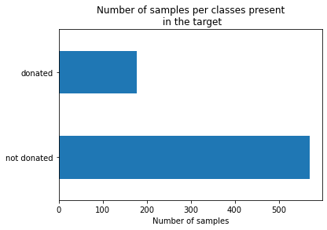
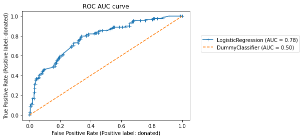

```python
import numpy as np
import pandas as pd
```

```python
blood_transfusion = pd.read_csv("data/blood_transfusion.csv")
data = blood_transfusion.drop(columns="Class")
target = blood_transfusion["Class"]
```

```python
import matplotlib.pyplot as plt

target.value_counts().plot.barh()
plt.xlabel("Number of samples")
_ = plt.title("Number of samples per classes present\n in the target")
```



```python
from sklearn.model_selection import train_test_split

data_train, data_test, target_train, target_test = train_test_split(
    data, target, shuffle=True, random_state=0, test_size=0.5)
```

```python
from sklearn.linear_model import LogisticRegression

classifier = LogisticRegression()
classifier.fit(data_train, target_train)
```

    LogisticRegression()

```python
from sklearn.metrics import accuracy_score

target_predicted = classifier.predict(data_test)

accuracy = accuracy_score(target_test, target_predicted)

## 둘다 같은 결과를 보여줌

np.mean(target_test == target_predicted)

print(f"Accuracy: {accuracy:.3f}")
```

    Accuracy: 0.778

### Confusion matrix and derived metrics

```python
from sklearn.metrics import ConfusionMatrixDisplay

_ = ConfusionMatrixDisplay.from_estimator(classifier, data_test, target_test)
```


TP / FN

-

FP /TN

### Precision_score, recall_score

- precision_score => 예측 label 을 기반으로 계산 11/16

- recall_score => 실제 label을 기준으로 계산 11/89

```python
from sklearn.metrics import precision_score, recall_score

precision = precision_score(target_test, target_predicted, pos_label="donated")
recall = recall_score(target_test, target_predicted, pos_label="donated")

print(f"Precision score: {precision:.3f}")
print(f"Recall score: {recall:.3f}")
```

    Precision score: 0.688
    Recall score: 0.124

- we could ask ourself a reasonable question. While the accuracy did not look bad (i.e. 77%), the recall score is relatively low (i.e. 12%).

```python
from sklearn.dummy import DummyClassifier

dummy_classifier = DummyClassifier(strategy="most_frequent")
dummy_classifier.fit(data_train, target_train)
print(f"Accuracy of the dummy classifier: "
      f"{dummy_classifier.score(data_test, target_test):.3f}")
```

    Accuracy of the dummy classifier: 0.762

### balanced_accuracy

- When the classes are imbalanced, `accuracy should not be used`. In this case, one should either use the precision and recall as presented above or the balanced accuracy score instead of accuracy.

```python
from sklearn.metrics import balanced_accuracy_score

balanced_accuracy = balanced_accuracy_score(target_test, target_predicted)
print(f"Balanced accuracy: {balanced_accuracy:.3f}")
```

    Balanced accuracy: 0.553

### Sample에 대한 개별 평가 결과를 볼 수 있다.

- classifier.predict_proba

```python
target_proba_predicted = pd.DataFrame(classifier.predict_proba(data_test),
                                      columns=classifier.classes_)
target_proba_predicted
```

<div>
<style scoped>
    .dataframe tbody tr th:only-of-type {
        vertical-align: middle;
    }

    .dataframe tbody tr th {
        vertical-align: top;
    }

    .dataframe thead th {
        text-align: right;
    }

</style>
<table border="1" class="dataframe">
  <thead>
    <tr style="text-align: right;">
      <th></th>
      <th>donated</th>
      <th>not donated</th>
    </tr>
  </thead>
  <tbody>
    <tr>
      <th>0</th>
      <td>0.271820</td>
      <td>0.728180</td>
    </tr>
    <tr>
      <th>1</th>
      <td>0.451764</td>
      <td>0.548236</td>
    </tr>
    <tr>
      <th>2</th>
      <td>0.445211</td>
      <td>0.554789</td>
    </tr>
    <tr>
      <th>3</th>
      <td>0.441577</td>
      <td>0.558423</td>
    </tr>
    <tr>
      <th>4</th>
      <td>0.870583</td>
      <td>0.129417</td>
    </tr>
    <tr>
      <th>...</th>
      <td>...</td>
      <td>...</td>
    </tr>
    <tr>
      <th>369</th>
      <td>0.178359</td>
      <td>0.821641</td>
    </tr>
    <tr>
      <th>370</th>
      <td>0.361963</td>
      <td>0.638037</td>
    </tr>
    <tr>
      <th>371</th>
      <td>0.069163</td>
      <td>0.930837</td>
    </tr>
    <tr>
      <th>372</th>
      <td>0.325326</td>
      <td>0.674674</td>
    </tr>
    <tr>
      <th>373</th>
      <td>0.043835</td>
      <td>0.956165</td>
    </tr>
  </tbody>
</table>
<p>374 rows × 2 columns</p>
</div>

```python
equivalence_pred_proba = (
    target_proba_predicted.idxmax(axis=1).to_numpy() == target_predicted)
np.all(equivalence_pred_proba)
```

    True

```python
from sklearn.metrics import PrecisionRecallDisplay

disp = PrecisionRecallDisplay.from_estimator(
    classifier, data_test, target_test, pos_label='donated',
    marker="+"
)
plt.legend(bbox_to_anchor=(1.05, 0.8), loc="upper left")
_ = disp.ax_.set_title("Precision-recall curve")
```


```python
from sklearn.metrics import RocCurveDisplay

disp = RocCurveDisplay.from_estimator(
    classifier, data_test, target_test, pos_label='donated',
    marker="+")
disp = RocCurveDisplay.from_estimator(
    dummy_classifier, data_test, target_test, pos_label='donated',
    color="tab:orange", linestyle="--", ax=disp.ax_)
plt.legend(bbox_to_anchor=(1.05, 0.8), loc="upper left")
_ = disp.ax_.set_title("ROC AUC curve")
```



```python

```
