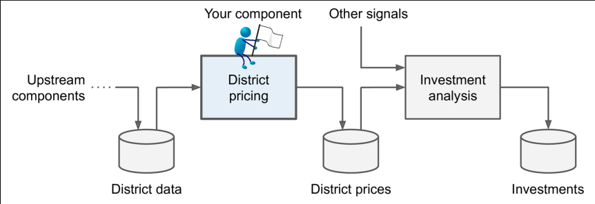
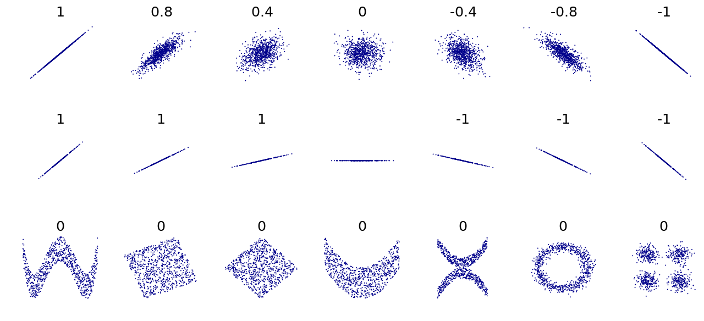
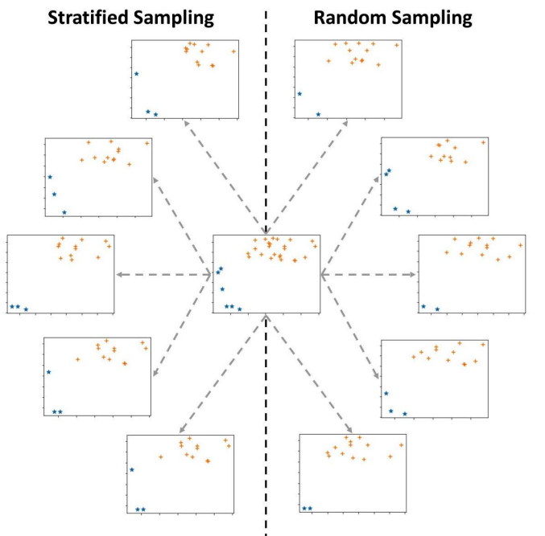
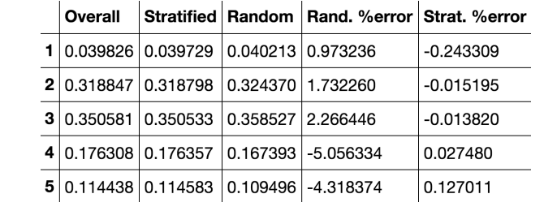

## Frame the Problem and Look at the Big Picture

---

### Frame the problem

- **Median housing price in any district 예측**
- **Pipeline**
  

### Select a performance measure

빅피쳐 단계에서 performance measure을 하는 이유를 모르겠다.

## Get the data

---

### Take a Quick Look at the Data Structure

데이터 구성을 전반적으로 뜯어보고 이해하는 과정. column 별로 categorical 또는 numerical인지 검토하고 feature scaling이 필요한 요소는 없을지 확인한다.

### Create a Test SET

지금 단계에서 Test set과 training set을 구분하는 이유는 snooping bias를 방지하기 위함이다. 쉽게 말해 model을 만들때 부터 실제 상황을 가정하고 만들어야 한다는 말이다. 우리가 모델을 만들기 위함이 예측하는 것인 만큼 data 전체를 본다거나 test set을 들여다 보면 기본 가정에 위배된다. 그리고 test set을 분석하면서 파악한 패턴을 학습에 반영한다면 더 좋은 결과를 생성할 수는 있겠으나 우리가 이미 test-set의 특성을 파악했기에 부풀려진 예측값이 발생할 수 있다.

## Discover and visualize the Data to gain insights

---

데이터 양이 크면 sampling해서 데이터를 살펴본다. 데이터 양이 크지 않으면 원본을 활용한다.

### Looking for Correlation

- **DataFrame.corr()**

Attribute간 correlation을 확인하는 방법은 pearson’s 계수(Standard correlation coefficient)를 사용하는 것이다. 값은 -1 ~ 1 사이이고 1에 가까울수록 양의 상관관계를, -1에 가까울수록 음의 상간관계를 의미한다.

**pearson 계수는 선형관계(비례관계)에 대한 correlation만을 보여주며 선형관계의 강도를 표현하지는 않는다. 아래 도형같은 분포는 비선형 관계로 이를 다루는 분야가 따로 있다.(이것도 공부해야겠지..)**



- **DataFrame.scatter_matrix()**
  numerical attribute에 대한 선형관계는 scatter plot으로 보면 직관적으로 이해 가능하다. corr 매소드와 함께 사용하면 데이터 간 관계를 이해하는데 도움이 된다. mdeian_house_value와 가장 선형 관계가 있어보이는 attribute는 median_income으로 보인다. 관련 없어 보이는 attribute로는 housing_median_age가 있다.
  

### Experimenting with Attribute Combinations

몇몇 데이터는 그 자체로는 의미 없으나 약간의 변형을 가하면 의미 있는 데이터로서 가치를 할 수 있다. 가령 total_rooms, population과 같은 attribute는 그 자체로는 median_house_value와는 관련성이 없지만 household attribute로 나눈 값과 median_house_value를 비교하니 관련성이 생겼다.

물론 이런식으로 데이터를 가공하려면 사전에 지금 다루고 있는 데이터를 공부하고 잘 알아야 한다.

그렇다고 데이터를 분석하는데 오랜 시간을 들일 필요는 없다. 어느정도 파악한 후 proto type을 만든 다음 계속해서 CRISP cycle을 수행하면서 데이터를 만지게 될것이기 때문이다.

## Prepare the data for machine learning algorithms

---

CRISP cycle을 돌면서 계속해서 데이터를 가공하고 학습시킬 것이므로 이러한 과정을 차근차근 자동화 해놓는 것을 추천한다.고 한다.

### Data Cleaning

<aside>
💡  **Hands-on preprocessing 내용을 추가했다.**

</aside>

- **Data cleaning level 1 - cleaning up the table**
  - column명 다루기 쉽게 바꾸기, 필요하면 dict로 만들어서 참고할 수 있도록 하기
- **Data cleaning level 2 - Unpacking, Restructuring, and reformulating the table**

  - Unpacking
    하나의 column에 여러 정보가 묶여있는 경우가 있다. 대표적으로 시계열 데이터가 그러하다. 시계열 데이터는 연,월,일, 시간 등으로 나눌 수 있는데, 개별 column으로 설정한 뒤 목표 값과 비교하면 유의미한 관련성을 발견하기도 한다.

  - Reformulate
    활용중인 데이터셋에서 의미있는 데이터를 추출하는 과정임. 필요한 value를 위해 새로운 열을 만들거나 아에 새로운 테이블을 만드는 과정이다.
  - Restructure
    분석에 필요한 데이터를 model에 적용할 수 있도록 모양을 가공하는 과정을 말한다.

- **Data cleaning level 3 - Missing values, Outlier, and Errors**

  - Missing Values

    - missing value 찾기 .infro() and .isna()

      ```python
      for col in air_df.columns :
          n_mv = sum(air_df[col].isna())
          print('{} : {}'.format(col,n_mv))

      => Wind_Direction : 0
      NO2_Location_A : 120
      NO2_Location_B : 580
      NO2_Location_C : 132
      ```

    - Types of Missing Values
      - MCAR(Missing completely at random)
        결측값이 우연에 의해 발생되는 경우를 말한다. 불안정한 인터넷 상태로 원래 전송되어야 할 자료가 들어오지 않는 경우가 해당된다.
      - MAR(Missing at random)
        알지못하는 어떤 오류로 인해 결측값이 발생되는 경우이다. 기계가 노후화 되면서 측정할 수 있는 범위가 점점 감소하다보니 원래라면 들어오는 값이 들어오지 않게 된다.
      - MNAR(Missing not at random)
        결측값이 발생한 배경에는 어떤 의도가 존재하는 경우이다. 때로는 데이터가 노출되면 발생할 손해가 예상돼 의도적으로 공개하지 않는 경우도 있다.
    - Missing value와 not missing value를 비교해서 Type of Missing Value 찾기 \*모든 Attribute를 일일히 missing, not missing으로 구분하여 차이를 확인해야한다**\*.**
      - Numerical attribute
        - Visualization
          numerical attribute의 경우 boxplot과 histogram을 사용한다. missing value와 not missing value의 분포 차이를 비교해서 missing value가 발생한 원인이 MCAR인지 MAR인지 MNAR인지 검토해야한다.
        - Hypothesis testing
          numerical attribute에는 t-test를 활용해 missing value와 not missing value 차이가 natural variation안에 있는지 아니면 어떤 추세가 있는지를 검정할 수 있다.
          - scipy.stats.ttest_ind 사용
          - openintro 7.3.2 Hypothesis tests for the difference of two means(270p)
      - Categorical attribute
        - Visualization
          Categorical attribute는 bar plot을 그려서 missing value와 not missing value간 차이를 확인한다.
        - Hypothesis testing
          Chi-square distribution을 활용해 두 분포가 natural variation에 있는지 검토한다.
          - scipy.stats.chi2_contingency
          - openintro 6.4. Testing for independence in two-way tables(241p)
    - Missing value 다루기
      - Keep it as is
        결측값이 없어도 실행 가능한 모델(예로들어 KNN)일 경우 데이터를 따로 제거하거나 대체하지 않는다. Tree 모델도 그러한듯?
      - Remove data objects with missing values
        부득이한 경우(모든 방법이 적용되지 않는 경우) 행을 삭제하는 방법이다. 최종적으로 사용하자..
      - Remove the attributes with missing values
        결측값이 15%이상 있다면 해당 열은 제거하는게 차라리 더 낫다.
      - Estimate and impute missing values
        결측값을 대체한다. 세부적으로 4가지 방법이 존재한다. **다만 결측값을 포함하는 이유는 오류를 최소화 하기 위함이지 예측 정확도를 올리기 위해서가 아니다.**
        - MCAR인 경우 Central tendency(Mean,Mode,Median)을 활용한다. Data_Series이라면 Interpolation을 사용한다.
          - sklearn.impute.SimpleImputer를 사용하면 결측값이 있는 모든 column에 대해 원하는 값(Mean, Mode, Median) 등을 일괄적으로 입력할 수 있다. 이때 Mean과 Median은 Numerical value에만 해당한다는 사실을 염두에두자.
        - MAR인 경우 Central tendency를 쓰되 가장 가까운 값을 가지는(?) 것으로 사용한다. (센서나 기계에 의한 결측값이기 때문에 가장 연관성 있는 데이터가 근처라고 가정할 수 있다.)
        - MNAR인 경우 이상적인 방법은 아니지만 Regression Analysis를 사용한다. (의도적으로 제거됐기 때문이다.)

  - Outlier
    - Outlier 찾기
      Outlier은 주로 Numerical Value에 해당한다. Categorical attribute도 unique별로 빈도를 파악해서 outlier를 제거하는 경우도 있지만 특별한 이유가 있지 않는 이상 굳이 제거할 필요가 없다.
      box plot이나 scatter plot을 활용하면 Variable의 Outlier를 금방 파악할 수 있다. 변수 값에 예민한 모델들은 outlier의 존재로 인해 예측 오류가 크게 발생할 수 있다.
      극소수의 사례를 포함해 모델의 정확도를 감소시키는 것보다 차라리 outlier 값을 변경하거나 제거함으로서 모델이 전반적인 현상을 학습하여 예측하는 것이 더 바람직한 선택일 수 있다.
      - 변수 하나일 때
        - Numerical : box plot, histogram
        - Categorical : bar chart
      - 변수 둘 일 때
        - Numerical-Numerical : scatter plot
        - Numerical-Categorical : box plot
        - Categorical-Categorical : Contingency table or heat map
      - 변수 셋 이상일 때
        - kmeans를 사용한다는데.. 아직 kmeans를 모르다보니 어째서 outlier를 발견할 수 있는지는 이해하지 못하겠다.
    - Outlier 다루기
      - 분석 목적별 Outlier를 어떻게 다뤄야 하는지를 나타낸다.
        
      - Do nothing
        표를 보면 알 수 있듯 굳이 Outlier를 건드리지 않아도 되는 경우가 있다.
      - Replace with the upper cap or lower cap
      - Perform a log transforamtion
      - Remove data objects with outliers
  - Errors
    Data = True Signal + Error
    - type of error
      - Random error : 장비 성능의 한계 등으로 어쩔 수 없이 발생하는 에러
      - systematic error : bias를 말하는듯 data collection 중에 실수로 인해 발생하는 에러
    - Dealing with errors
      데이터 시각화를 통해 outlier라고 보기 힘들정도로 이상한 데이터를 찾는다. 정말 특이한 값이 에러인지 아니면 outlier인지 검증하는 과정을 거쳐야한다. 무조건 에러라고 단정지을 수는 없다. 만약 에러로 판정될 경우 missing value로 취급해 다룬다.
      

### Handling Text and Categorical Attribute

대부분 모델 알고리즘은 텍스트 데이터는 인식하지 못한다. 그래서 텍스트를 수로 바꾸는 과정을 거쳐야한다. Categorical attribute는 세부적으로 Ordinal과 Nominal로 구분되고 이를 수로 바꾸는 방법이 다르다.

- Ordinal Encoder
  순서가 중요시 되는 categorical attribute가 있다. ex) 순위, 성적(수,우,미,양,가) 등
  순서가 있다는 말은 대상끼리 연관성이 있다는 말이다. 대상과 연관성에 해당한다면 ordinal encoder를 사용하자.
  tree model에서 사용한다. OneHotEncoder는 column이 많이 생기기 때문에 tree 모델 계산에 드는 비용이 늘어나게 된다. 따라서 nominal인 attribute에도 ordinalencoder를 추천한다.
- Nominal Encoder(OneHotEncoder)
  반대로 대상끼리 연관성이 없는 경우가 있다. ex) 혈액형, 성별, 등
  OneHotEncoder는 class별로 column을 생성하기 때문에 unique membership이 많다면 column 개수도 그만큼 증가하게 되고 performance cost를 증가시킨다.
  Linear model에서 사용한다. attribute가 ordinal이라면 linear model도 ordinal encoder를 쓴다. 대신 class와 변환된 수가 정확하게 배열 됐는지를 잘 확인해야한다.

<aside>
⛔ OneHotEncoder와 OrdinalEncoder에서 `handle_unknown` arguement

train_set과 test_set을 따로 encoding 하다보면 train_set에는 없고 test_set에는 있는 value가 존재하게 된다. 그렇게 되면 train_set에서 encoding한 목록에 없는 새로운 value에 대해선 오류가 발생할 수 밖에 없다. `handle_unknown`은 이러한 경우가 일어났을 때 어떻게 대처해야 하는지를 선택하는 argument이다.

</aside>

### Feature Scaling

numerical variable은 데이터의 특성에 따라 scale이 다르다. 토익 성적은 0 ~ 990점으로 끝나는 반면에 연봉은 0원 ~ 무한대인 것 처럼 어떤 내용을 담느냐에 따라 다르다. 하지만 컴퓨터는 이 숫자들이 의미하는 가치를 알지 못하고 그대로 숫자로 받아들일 뿐이다. 그러기에 scale을 하나로 통일 시키지 않고 모델을 학습시킬 경우 특정 column의 중요도를 매우 높게 인식 할 수 있다. 당연히 그렇게 된다면 실제 결과와 예측값 사이에 괴리가 엄청나게 크게 발생할 것이다.

Regression 모델을 학습시킬 때는 scailing이 중요한 반면 tree 모델을 학습시킬 때에는 수행하지 않아도 된다.

- Min-max scaling(Normalizaiton)
  값의 범위를 0~1 사이로 만든다. 개별 값을 상대적 위치로 표현한다, min인 value는 0이 되고 max인 value는 1을 부여받는다.
  $Feature\;\;Scaling = \frac{value-min}{max-min}$
- Standardization
  개별 값들을 sigma($\sigma$)로 표현한다. normalization과 다르게 범위의 제한이 없다. 장점으로는 $\sigma$로 표현되기 때문에 outlier라 할지라도 값 차이가 별로 나지 않는다.
  $standardization = \frac{value-mean}{std}$

<aside>
⛔ Target Value에는 scailing을 하지 않는다.  따라서 목표값이 들어가 있는 column을 따로 추출한 다음 scaling을 진행해야한다.

</aside>

### column Transformer

encoding과 scaling을 자동으로 수행하도록 설정한다. sklearn에는 columntransformer라는 매소드가 있다. `ColumnTransformer([('column 제목', 'preprocessor', 'column 명 ')])` 로 사용하면 된다. 앞에서 배운 encoder와 scaler 모두 사용해서 만들어도 된다.


### Transformation Pipelines

Data cleaning + transformer + algorithm을 한 번에 손쉽게 수행하도록 도와주는 도구이다. pipeline으로 절차를 만들어 놓은 뒤 데이터를 학습시키면 절차에 따라 자동적으로 진행되서 최종적으로 학습완료 된 모델을 산출한다. pipeline과 gridsearch는 model 학습 뿐만아니라 imputer, scaler 등 데이터 처리 전체에 활용되는 매소드들에 전부 쓰일 수 있다. (물론 gridsearch는 hyperparameter를 찾는 목적이므로 일단 메소드와 모델이 선정된 다음 세부 조정을 하는 용도로 사용된다.)

## Select and Train a Model

---

### Training and Evaluating on the Training Set

데이터를 정리했다면 데이터에 잘 맞는 algorithm이 무엇일지 찾는 과정을 거친다. 지금 과정은 모델 fit을 맞추는 수준이므로 세부적인 parameter를 건드리거나 하지 않고 기본 세팅으로만 모델을 학습시킨다. _이번 단계에서는 사용할만한 모델을 2~5개 정도로 찾는데 의의를 두자._

### Better Evaluation Using Cross-validation

Cross-validation을 사용하면 모델의 일반적인 성능을 파악할 수 있다.

- K-Fold
  
- Shuffle Split

  

- Stratified

  Samlping 할때 표본의 비율과 맞게 뽑는 방법임. k-fold와 함께 쓰이기도 한다.

  

## Fine-Tune Your model

---

모델을 2~5개 정도 추렸다면 hyperparameter를 조정해 모델의 성능을 끌여올려 보자. Grid Search와 Randmomized Search는 모델 튜닝을 쉽게 수행하도록 돕는 매소드이다.

### Grid Search

param_grid를 사용해서 여러개의 hyperparameter를 조정하거나 아니면 아예 새롭게 구성한 hyperparameter를 여러개 설정해서 돌릴 수도 있다. 다만 hyperparameter가 많아질수록 모델을 만드는데 드는 computational cost가 올라가기 때문에 무작정 많이 설정해서는 안된다. 그리고 조정하는 hyperparameter가 많다고 더 나은 결과를 발생시키는 것도 아니다.

<aside>
⛔ 분석을 마쳤면 최적의 hyperparameter를 찾았다는 것에 만족하지 말고 parameter 설정이 들어간 모델의 결과도 확인하자. 결과를 분석하다보면 hyperparamter를 수정해서 다시 돌려본다거나, 연산 비용을 줄이기 위해 굳이 영향이 크지 않는 변수를 제거할 수 있는 힌트를 찾을 수 있다.

</aside>

### Randomized Search

조정하려는 hyperparameter의 범위가 넓고 그 갯수도 다양하다면 grid search 보다 randomized search를 권장한다. grid search 작동 방식과 Randomized 방식은 크게 다르지 않다. 다만 randomized search는 hyperparameter를 범위 내에서 랜덤으로 추출한뒤 돌릴 뿐이다.

### Tip

The reciprocal distribution is useful when you have no idea what the scale of the hyperparameter should be (indeed, as you can see on the figure on the right, all scales are equally likely, within the given range), whereas the exponential distribution is best when you know (more or less) what the scale of the hyperparameter should be.

만약 reciprocal 또는 exponential을 써서 randomized search를 해보고 싶다면 책에서 제공하는 ch2.ipynb의 exercise를 확인하자.

### Ensemble Methods

boost나 bootstrap 같은 방식도 모델의 성능을 향상시키는 좋은 방법이다. ch7에서 제대로 다룬다.

### Analyze the Best Models and Their Errors

grid_search로 얻은 값들을 분석하고 불필요한 category도 지우는 단게이다. 아직 grid_search에서 원하는 값을 추출하는 방법에 대해서 모르니 나중에 배우게 되고나서 이곳에 정리를 해야겠다.

### Evaluate Your system on the test set

Test set을 가지고 완성된 모델의 성능을 확인하는 단계이다. 좀더 정확한 모델의 성능을 알고 싶다면 confidence interval을 사용하자. 모델의 성능이 train set보다 낮게 나온다면 해당 모델이 training_set에 overfit 된거니까 parameter를 줄이는 작업이 필요하다.

## Launch, Monitor, and Maintain your System

---

모델을 만들었다고 끝이 아니다. 사용할 수 있도록 서버에 올리고 성능이 계속 유지되는지 검토하고 장비 노후화나 sensor 교체로 인한 성능 상승 등으로 input 되는 데이터가 달라질 수 있으므로 이에 맞게 모델을 재학습 시켜야하기도 한다. 이런 과정들은 지난하게 길고 복잡하므로 아예 script로 짜서 자동 업데이트되게 만들어 놓거나 성능이 떨어질 때 관리자에게 경고 신호를 보낼 수 있도록 설정해놓아서 유지비용을 줄이도록 해야한다.

## 용어정리

1. **Unique identifier**

   instance 간 구분하는 value ex) customer_id

2. **Scoring function(cost function과 Utility function)**
   1. cost function : 점수가 낮은게 더 좋은 모델이다
   2. Utility function : 점수가 높은게 더 좋은 모델이다
3. **snooping bias**

   row data에는 미래의 test-set이 포함되어있다. 그래서 test-set과 row data를 분석한 결과를 모델에 반영한다면 test-set으로 확인한 모델 성능은 좋을 수 있지만 실제 데이터를 예측하는 과정에서는 성능이 떨어지게 된다. 이는 모델을 test-set에 맞춰서 학습시켰기에 발생하게 된다. 이러한 인적 오류를 snooping bias라고 한다.

4. s**tratified sampling 과 sampling bias**

   1000명을 대상으로 설문조사를 한다. 이때 대한민국의 남녀 비율은 51.3 : 48.7이다. 집단을 특정 기준(예시에서는 성별)로 구분한 다음 개별 집단에서 비율에 맞게 random sampling을 수행한다.

   만약 sample의 남녀 비율이 natural variation을 넘어서게 된다면 sampling bias가 된다. /끝

   - 모집단(Overall)에 대한 random Sampling과 Stratified Sampling 차이



5. **sparse matrix**

행열에 포함된 0이 많은 경우, 데이터 공간을 아끼기 위해 필요한 정보만 수록한 행렬을 말한다.


