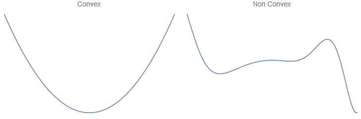
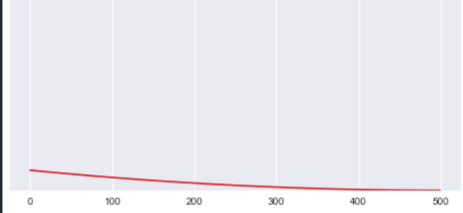
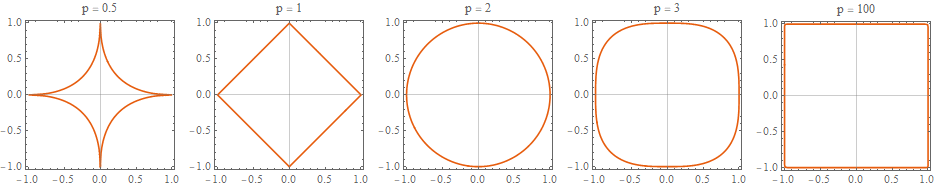
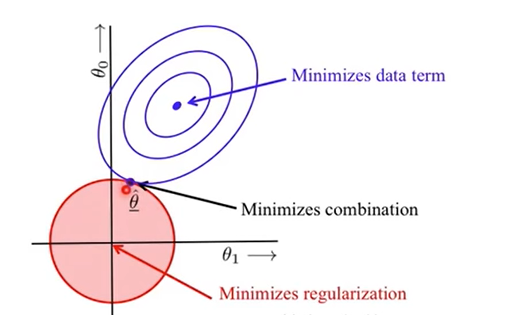

## 목표

1. 모델 훈련방식 이해
2. linear 베이스 훈련방식 소개
   - cost function을 최소화하는 방법 : closed form과 gradient descent
   - non-linear distribution을 학습하는 방법 : polynomial **way?**
   - polynomial의 overfiting 방지하는 방법 : regularization
   - logistic regression 이해

## 용어 정리

모델 훈련 방식을 설명하기 앞서 용어를 통일하고 넘어가겠다.

### Vectors

**요소별 위치 표현방법**


- $x_j^i =$행렬$(i,j)$값
- $x^i$ = $i$번째 행

**행렬 계산**

- (a,b) \* (b,c) = (a,c)
- $XI = IX = X$, $I$는 1과 같은 존재
- $X\theta = \theta^TX$
- $A \cdot B$ = scalar값을 표현ex) (1,3)\*(3,1) = 1

## 최적의 weight $(\theta)$ 구하기

### 용어정리

Weight을 표현하는 용어는 매우 다양하다. 다음의 용어는 모두 weight을 의미한다.

- $\theta_0,\theta_1,\cdots,\theta_n$
- $w_0,w_1, \cdots, w_n$
- $\beta_0,\beta_1, \cdots, \beta_n$
- coefficient
- weight

### 들어가기 전

이 장에서 설명할 closed form과 gradient descent는 모델 내부에서 일어난다. Closed form과 gradient descent는 모델을 학습시키기 전 최적의 hyper parameter를 찾기 위한 목적으로 배우는게 아니다. 해당 공식은 최적의 weight를 계산하는데 활용된다. 우리가 linear regression 모델을 활용할 때면 데이터에 튜닝된 weight를 바로 얻게 된다. 이는 모델 내부에서 closed form 또는 gradient descent를 사용해 weight를 계산하기 때문이다.

만약 최적의 hyper parameter를 찾기위함이라면 grid search나 random search를 사용해야한다.

모델 내부에서 일어나는 일이라 할지라도 모델이 어떠한 방식으로 최적의 weight을 산출하는지 이해하는 건 당연한 일이다. 모델이 어떤 식에 의해 작동하는지 이해해야만 모델을 빠르게 최적화 할 수 있기 때문이다.

### 최적에 대한 기준찾기

우리는 $x^1,x^2\cdots x^n$값을 가지고 $y$를 예측하고 싶어한다. 예측값 $\hat{y}$가 실제값인 $y$와 같은게 우리의 이상적인 목표이다. 모델이 얼마나 성능이 좋은지 알고 싶으면 예측한 값과 실제 값이 얼마나 차이가 발생하는지, 평균적으로 어느정도 차이가 나는지 확인하면된다.

예측값과 실제 차이가 작을수록 모델의 성능은 좋다. 성능과 실제 차이를 앞으로 error라는 용어로 사용 하겠다. error가 0에 가까울수록 좋다는 사실을 마음속에 생각해두자.

$error = \hat{y}- y$

error를 가지고 성능을 측정하는 방법에는 몇가지가 있다. 그중 MSE와 MAE가 대표적으로 쓰인다. MAE는 error가 평균 얼마정도 발생하는지를 가지고 모델을 평가한다면 MSE는 error를 제곱한 값의 평균을 가지고 평가한다. error를 제곱하는 이유는 차이가 작을때는 더 작아지게, 차이가 클때는 더 크게 가중치를 부여하기 위함이다.

- **MAE(Mean Absolute Error)**

  $MAE = \frac{1}{n}\sum_{i=1}^{n}{\left| \hat{y}-y \right|}$

- **MSE(Mean Squared Error)**

  $MSE = \frac{1}{n}\sum_{i=1}^{n}{(\hat{y}-y)}^2$

두 방법 모두 모델의 성능을 파악하는데 활용되지만 대부분은 MSE를 활용한다. 모든 에러를 공평하게 다루는 MAE보다는 에러가 적을때는 우대하고 에러가 많을때는 천대하는 MSE 방식이 더욱 효율적이기 때문이다.

<aside>
⬆️ MSE와 헷갈리는 용어정리

**SSE(Sum of Squared error) = RSS(Residual sum of squares)**

$MSE = \frac{1}{n}SSE$

**Residual과 error의 차이**

- Error = 관측값(표본) - 실제값(모집단)
- residual = 예측값(예측모델) - 관측값(표본)
- 모집단을 모르는게 일반적인 경우이니 거의 모든 경우 residual을 쓴다.

**Variance($\sigma^2$)**

평균과 개별 값들의 편차

$\sigma^2 = \frac{1}{n-1}\sum_{i=1}^{n}{(x-\bar{x})}^2$

- $\bar{x}$ : 관측값들의 평균

- $x$ : 개별 관측 값

</aside>

### weight 구하기

**Closed form( =OLS = normal equation)**

closed form이라는 용어는 찾고자 하는 값의 공식을 의미한다. 중학생 시절 2차 방정식의 해를 구하기 위해 활요한 근의 공식 같은 식을 closed form이라 한다. $ax^2+bx+c=0$으로 부터 시작해 2차방정식의 근의 공식을 구했던 것 처럼 linear model의 weight를 찾기 위한 공식이 있다. 이 공식은 MSE에서 파생됐고 closed form, OLS(Ordinary least squares), normal equation, linear squares lines 등 다양한 이름으로 불린다. 모두 같은 공식을 말하는 것임을 이해하자.

**linear 모델을 vector로 바꾸기**

linear 모델

$\hat{y} = θ_0 + θ_1x_1+ θ_2x_2 + ⋯ + θ_nx$

vector 식으로 만든 linear model

$\hat{y} = h_θ(X) = θ · X = \left [ \theta_1,\theta_2,\cdots,\theta_n \right ]\begin{bmatrix}x_0 \\x_1 \\\vdots \\x_n \\\end{bmatrix}$

$\theta$는 (1,n)행렬, $x$는 (n,1) 행렬이므로 $\hat{y}$는 scalar 값이된다.

**MSE를 vector로 바꾸기**

$MSE = \frac{1}{n}\sum_{i=1}^{n}{(\hat{y}-y)}^2  =\frac{1}{m}∑_{i = 1}^m{(θ^TX^{(i)} − y^{(i)})^2}$

- **$\theta$를 왼편에 두고 모두 오른쪽으로 올인**

  - $\theta = (X^TX)^{-1} X^TY$

- **Singular value decomposition(SVD)**

  - closed form에서 $(X^TX)^{-1} X^T$을 쉽게 계산하는 방법임

- **closed form 연산속도**

  - X^TX 는 (n+1) \* (n+1)의 행렬을 만들어야 하므로 연산이 오래걸린다.
  - feature(=variable)이 많을수록 연산속도는 O($n^{2.4}$) to O($n^3$)로 증가한다.
  - vector연산이므로 instance 수에는 영향을 받지 않는다. 연산 속도는 O(m)이다.

**gradient descent**

Gradient descent 개념 이해하기

coefficient를 계산으로 찾지 않고 일일히 대입해서 찾아본다. y=ax+b에서 x와 y값을 알고 있으니 가장 작은 MSE를 가진 a와 b를 알아낼 수 있다.

gradient descent를 남극 탐험대가 극지점을 찾는데 비유한다면 작동원리를 쉽게 이해할 수 있다. 남극 탐험대는 오로지 나침반 하나만을 가지고 남극점을 찾아간다. gradient descent도 이와 마찬가지로 MSE의 변화량 기준삼아 나아간다. 남극 탐험대가 나침반에서 90도로 표시된 지점을 찾는다면 gradient descent는 MSE가 최소화 되는 지점을 찾는다.

물론 사용하는 알고리즘과 cost function의 조합에 따라 0이되는 지점이 여러 개 있을 수 있다. 탐험대가 여정에 나서기 만반의 준비를 한것과 같이 Gradient descent를 사용할때도 어떻게 하면 가짜 지점을 통과해 MSE가 최소화 되는 지점을 찾을 수 있을지 대비를 해야한다. 앞으로 배울 stochastic gradient descent, mini-batch등이 이러한 대비책이라볼 수 있다.

cost function이 Convex 인지 non-convex인지 아는 방법(많은 사람들이 관심 없어하네)



**MSE 변화량 계산하기**

남극 탐험대의 나침반이 gradient descent에선 MSE 변화량과 같다고 했다. 우리가 찾고자 하는 변화량 값인 0은 어떤 의미이가 있는 것이고 어떻게 계산할 수 있을까?

MSE의 변화량이라 함은 현재 측정한 MSE를 직전에 측정한 MSE와 비교한 값이다. $\theta = 1$일때 MSE가 10이었는데 $\theta = 1.1$일 때 MSE가 9라면 변화량은 1이 된다. 변화량이 0이라는 말은 직전 MSE와 지금 MSE가 차이가 없다는 의미이고 이는 우리가 최소의 MSE에 도달했다는 의미이다.

물론 실제 계산은 미분을 활용해 MSE의 변화량을 체크한다. 특정 $\theta$의 MSE를 MSE($\theta$)라 하면 MSE의 변화량 공식은 equation 1과 같다.

Equation 1 MSE 변화량 공식

$\nabla_{\theta}MSE(\theta) = \begin{pmatrix}
      \frac{\delta}{\delta\theta_0}MSE(\theta) \\
      \frac{\delta}{\delta\theta_1}MSE(\theta) \\
      \vdots \\
      \frac{\delta}{\delta\theta_n}MSE(\theta)\\
      \end{pmatrix} = \frac{2}{m}X^T(X\theta-y)$

$\theta$에 붙어있는 0~n은 column 위치를 의미한다. ($\theta_0$을 계산하려면 기존에 있는 column 외에 1로 채워진 column을 맨 앞에 추가해야함) $\frac{\delta}{\delta\theta_n}MSE(\theta)$을 가지고 계산할 수도 있다. equation 2를 활용해 개별 column의 변화량을 구하면 된다.
Equation 2 column별 MSE 변화량 공식
$\frac{\delta}{\delta\theta_j}MSE(\theta) = \frac{2}{m}\sum_{i=1}^{m}{(\theta^Tx^{(i)}-y^{(i)})x_j^{(i)}}$
$x^{(i)}$ : i 행의 x 값들
$(\theta^Tx^{(i)}-y^{(i)})$은 예측값 - 관측값 = residual을 의미한다.
$x_j^{(i)}$는 i행에 있는 j열을 말한다.

**MSE 변화량 계산식 이해하기**

```python

x_b # (9974,3)  | **(행개수,열개수)**
y # (9974,1)
theta = np.array([[15],
                    [2],
                    [1.5]]) # (3,1)

m = 9974 # instance 개수

### Equation 1 : MSE 변화량 공식
gradients = 2/m * x_b.T.dot(x_b.dot(theta).values - y.values)
                # (3,9974) * [(9974,3)*(3,1) - (9974,1)] = (3,1)
                # feature이 3개이므로 θ도 3개

### Equation 2를 활용해 MSE 구하기
vector_gradients = []
for j in range(3) : # column = j = 3개

    storage =[]
    ### Equation 2 : column별 MSE 변화량 공식
    for i in range(m) : # instance = i = 9974개
        a = (theta.T.dot(x_b.iloc[i]) -y.iloc[i].values) * x_b.iloc[i,j]
            # [(1,3) * (3,1) - (1,1)] = (1,1) =>
        storage.append(a[0]) # j열 9974개 저장

    partial_vector = (2/m)*np.sum(storage) # Equation 2 완성 => θ 하나 구함.
    vector_gradient.append(partial_vector) # 총 3개의 θ 구함.

print(f'equation_1 : {gradients}') # equation 1로 구한 값
print(f'equation_2 : {vector_gradients}') # equation 2로 구한 값

-------------------------------------
equation_1 :
0  5.159134  |1    0.294823 |  2    0.298964
equation_2 : [5.142452300393167, 0.293159197633841, 0.29087221987307543]

```

앞 section에서는 MSE 변화량이 0이 되는 $\theta$값 찾기 위한
계산 식을 배웠다. 이번엔 배운 식을 활용해 우리의 목적인 MSE 변화량 = 0 이 되는 지점을 찾아보자.

- $\theta^{(next\;step)}= \theta - \eta\nabla_{\theta}MSE(\theta)$

- $\eta$ = learning rate

궁금한 내용

Q. MSE를 미분했을때 값이 (3,1)이 되는 이유를 모르겠음. MSE는 분명 하나의 값인데 말이지

Q. Step이 어떻게 유도되는건지 모르겠네. $\eta\nabla_{\theta}MSE(\theta)$은 y값의 변화량인데 $\theta$랑 관련이 있나.

A. 변화량끼리 비교하다보면 0에 가까워질 수 있음
정말 미세하게 조정하다보면 변화량이 0인 지점을 찾을 수 있겠으나
감소하던 변화량이 증가한다는 의미는 저점을 지나갔다는 의미로 해석이 가능하므로 이 사이에 값이 있다고 추측할 수 있다. equation 4-7은 변화량이 계속해서 감소할 수 있도록 돕는 공식이다. 이때는 learning rate 크기에 영향을 받는다.

Equation 4-7, Figure 4-8를 보면 learning rate를 너무 작게둬서 minium cost function에 도달하기도 전에 설정해둔 반복횟수에 도달했다. 반대로 너무 크게두면 $\theta$값이 작아졌다 커졌다 반복할뿐 수렴하지는 않는다. (만약 learning rate가 반복횟수 증가에 따라 작아지게 설정했다면 서서히 minimum cost function에 도달하게 된다.)

Q. 변화량이 매우 미세하지만 계속해서 감소하는 경우라면?

A. 이때는 computational cost를 줄이기 위해서 이상적인 목표치 보다는 적정한 목표치에 도달하도록 해야한다. 목표치를 변화량 0이 아닌 특정 $\epsilon$(tolerance라고 부름)에 도달하면 탐색을 중단하도록 설정해서 과도한 cost 발생을 막아야한다.


<br/>

**Gradient descent와 scaling의 관계**

figure 4-7을 보면 scaling의 필요성을 바로 알 수 있다.


왼편은 scaling이후 gradient descent를 사용했고 오른편은 scaling 없이 gradient descent를 사용했다.

왼편은 $\theta$의 범위가 같기 때문에 $\theta_1$과$\theta_2$가 동일하게 감소한다. 반면 오른편은 $\theta_2$가 목표 값에 도달하고 나서도 계속해서 $\theta_1$을 찾게 된다. 두 방법 모두 같은 값에 도달하겠지만 오른편의 경우 왼편에 비해 실행횟수를 여러 번 더 진행해야한다.

예시는 2개의 feature를 찾는 과정을 설명했기에 차이를 느끼지 못할 수 있지만, feature이 늘어날수록(차원이 늘어날수록) 최소 MSE를 찾는데 많은 시간을 소비하게 되므로, gradient descent를 사용하는 모델을 활용할 경우 데이터 scaling은 필수이다.

> When using Gradient Descent, you should ensure that all features have a similar scale(e.g., standardScaler) or else it will take much longer to converge

Gradient descent는 linear 또는 non-linear model에만 사용가능하다. Tree model에선 사용 불가능하다.

Gradient descent 종류

gradient descent을 실제로 적용하는 방법은 여러가지가 있다. 그중에서 batch gradient descent, stochastic gradient descent, mini-batch gradient descent를 배울 것이다. 세 방식의 수행 방식은 차이나지 않는다. 다만 cost function을 계산할때 얼마나 많은 instance(=row)를 계산할건지에 따라 다르다. instance가 달라짐에 따라 연산 시간도 달라지고 그에따른 장단점이 있다.

Batch Gradient Descent

지금 설명하는 방식은 모든 instance를 cost function 계산에 사용한다. $\theta$값이 변화함에 따라 매번 모든 instance를 계산하니 그만큼 연산 시간이 오래걸린다. 그럼에도 불구하고 많은 양의 데이터를 학습해야하는 경우에 SVD나 Normal equation 보다는 훨씬 빠르다.

Stochastic Gradient descent

batch Gradient descent는 매번 모든 instance를 가지고 연산을 하기 때문에 $\theta$하나에 대한 계산이 오래걸린다. instance 수가 매우 크다면 그에 비례해 더 많은 시간이 소요된다. 이와는 정반대로 cost function을 계산할 때 단 하나의 instance만을 계산하는 방식이 있다.

그게바로 stochastic gradient descent이다. 수많은 instance 중에 단 하나만 골라 cost function을 계산하니 연산속도가 매우 빠를 수 밖에 없다.

하지만 극단적인 방법에는 부작용이 따른다. instance 값에 따라 cost function 값이 좌지우지 되다보니 $\theta$ 값이 왔다갔다를 반복한다. 그럼에도 값은 점차적으로 내려가 minimum 값 근처를 배회한다.

cost function이 instance 값에 영향을 받다보니 수렴하다가도 다시금 벗어나고 다시 수렴을 반복한다. 중단 시점에 따라 최적 값에 매우 근접한 값을 얻을수도 있지만 한편으로는 최적 값과는 다소 거리가 있는 값을 얻을수도 있다.

위 그래프를 보면 훈련을 반복함에 따라 cost가 감소하지만 batch gradient descent와는 다르게 이리저리 튀면서 도달한다. minimum cost에 도달하더라도 최적값 근처를 배회하고 며 반복이 종료되기를 기다린다.

톡톡튀는 방식이 무조건 단점이라고 볼수도 없다. cost function의 shpae이 non-convex라면 batch gradient descent는 local minima에서 허우적 대다가 끝날수도 있지만 stochastic gradient descent는 이러한 톡톡튀는 특성 덕분에 local minima에 벗어나 global minima 근처에 도달할 수 있다. 물론 근처에만 도달할뿐 global minima에는 도달하지 못한다.

이러한 단점을 보완하기 위해서 반복된 횟수가 증가할수록 learning rate가 점차 감소하도록 설정하기도 한다. 처음 learning step은 크지만 반복이 점차 진행됨에 따라 rate가 감소해서 더 적은 폭의 변화량을 갖게 되는 방법이다. 이를 learning schedule이라고 한다.

Sklearn에서 Stochastic GD 사용하기

sklearn의 기본 gradient descent는 batch gradient descent임. SGD를 사용하고 싶으면 SGD classfier와 SGD regressor를 사용하면 된다.

- max_iter ⇒ 반복횟수

- tol ⇒ 중단 시점

- eta 0 $(\eta)$ ⇒ learning rate

- penalty ⇒ regularization(조금 있다가 배운다.)

Mini-batch Gradient Descent

SGD는 하나의 instance로 cost function을 계산했고 batch GD는 모든 instance를 가지고 cost function을 계산했다. mini-batch GD는 이름에서 보듯 적은량의 instance를 가지고 cost function을 계산한다. instance의 size은 상황에 맞게 설정하면 된다.

mini batch는 중간 위치에 있다보니 양극단에 있는 방법이 가지는 단점을 어느정도 상쇄한다. SGD는 random 추출한 instance 값에 따라 cost function 계산에 영향을 크게 미치므로 최적의 $\theta$을 구할 수 없다. 그리고 계산된 $\theta$의 변동도 크다. 그러다보니 언제 멈추냐에 따라서 좋은 값을 구할수도, 덜 좋은 값을 구할수 있게된다. batch는 minmum cost function을 구할 수 있지만 우선 오래걸린다는 단점과 local minimum에서 멈출수도 있는 위험이 있다. 따라서 mini batch는 적당히 오래 걸리면서 minimum cost function 근처의 값을 구하는 장점이 있다.

알고리즘 구현

- sklearn에 sgd는 구현되어있는데 나머지는 없는듯. linear regression은 모두 CLS 기반으로 작동하는 듯

  Scikit learn provides you two approaches to linear regression:

1. `LinearRegression` object uses Ordinary Least Squares solver from scipy, as LR is one of two classifiers which have **closed form solution**. Despite the ML course - you can actually learn this model by just inverting and multiplicating some matrices.

2. `SGDRegressor` which is an implementation of **stochastic gradient descent**, very generic one where you can choose your penalty terms. To obtain linear regression you choose loss to be `L2` and penalty also to `none` (linear regression) or `L2` (Ridge regression)
   There is no "typical gradient descent" because it is **rarely used** in practise. If you can decompose your loss function into additive terms, then stochastic approach is known to behave better (thus SGD) and if you can spare enough memory - OLS method is faster and easier (thus first solution).

   [https://stackoverflow.com/questions/34469237/linear-regression-and-gradient-descent-in-scikit-learn](https://stackoverflow.com/questions/34469237/linear-regression-and-gradient-descent-in-scikit-learn)

Polynomal Regression

- non-linearity 찾는 방법
  linearlity condition 4가지 쓰기
  linear model에서 n차 함수를 구현하는 방식이다. 식 자체로는 1차함수지만 x값들이 n제곱 한 값이므로 그래프는 곡선으로 나온다.

  > When you fit a regression model, the model and the OLS estimator doesn't 'know' that $x^2_i$ is simply the square of $x_i$ , it just 'thinks' it's another variable.

- 용어정리

- polynimal은 전처리 과정이다.

  앞서 설명했듯 모델의 학습 방식은 변한게 없다. 그냥 모델이 학습하는 것은 1차함수를 학습할 뿐이다. 모델을 바꾼게 아니므로 데이터를 변경해야한다. scalar를 사용해서 개별 값들을 소화하기 좋게 만들었듯 새로운 column을 만들어 $x^2$이 마치 하나의 feauture로서 이해되도록 세팅해야한다.
  polynomial features 개수와 degree 에따라 생성되는 column 수가 다르다.
  n개에 대해 d차 함수를 만들고 싶다면

  $the\;number\;of \;features = \large\frac{(n+d)! }{d!n!}$
  ex) a,b feature에 대한 3차함수를 만들고 싶다. 2 ⇒ 10개로 늘어남.

  ```python
  import numpy as np
  from sklearn.preprocessing import PolynomialFeatures

  poly_features = PolynomialFeatures(degree=3) # 3차함수까지
  x = (np.arange(1,101, 10)).reshape(-1,1)
  x_1 = (np.linspace(0.5,10,10)).reshape(-1,1)
  t_x = np.append(x,x_1,axis=1)

  X_poly =poly_features.fit_transform(t_x)
  ```

  <aside>
  ⬆️ include_bias는 절편을 만드는 것입니다. include_bias = True이면 1 +ax + bx(제곱)와 같이 1 같은 절편을 추가합니다. False이면 추가하지 않습니다.

  이게 어떤 경우에 include_bias를 적용하느냐, 아니냐 보다는 적용해서 좋으면 사용하고, 아니면 사용하지 않는 정도의 하이퍼 파라미터 개념으로 생각하시면 될 것 같습니다.

  </aside>

Learning Curve

우리가 polynimial feature을 쓰려고 하면 자연적으로 발생하는 궁금증이 있다. degree를 어떻게 설정해야할까? 사실 이 질문에 대한 답은 없다. 직접 적용해보고 더 나은 결과를 제공하는 degree가 더 좋은 degree이다. 이때 개별 degree에 따른 학습 효과를 비교하기 위해서 learning curve를 활용한다.

learning curve를 쓰는 주된 목적은 모델의 성능이 향상이 어느 수준에서 멈추는지 지금 모델이 underfit됐는지 overfit 됐는지를 확인하는 용도이다.

underfiting과 overfiting은 learning curve를 사용하지 않고도 쉽게 알수 있긴하다. cross-validation 결과를 보고 training이 test보다 훨씬 좋은 점수(또는 accuracy)를 가지면 overfiting, training과 test 점수 모두 형편 없으면 underfiting이다.

learning curve 그리기

learning curve를 그리는 방법은 간단하다. sample 사이즈를 1~최대로 늘려가면서 모델을 학습시킨다. 그리고 학습된 모델을 가지고 validation을 진행한다. 결과를 모아서 그리면 된다.

처음에는 1~2개 sample만 가지고 학습을 하므로 에러가 발생하거나 거의 발생하지 않지만 sample 개수가 늘어날수록 성능이 낮아지는것을 볼수있다. 반면 validation 결과의 오류는 처음에는 overfit되다보니 값이 좋지 않지만 sample 수가 많아지고 점차 오류가 감소한다.

model underfit / overfit 대응방법

If your model is underfitting the training data, adding more train‐
ing examples will not help. You need to use a more complex model
or come up with better features.

One way to improve an overfitting model is to feed it more training
data until the validation error reaches the training error.

Bias /variance trade off

- Bias : wrong assumption

- Variance : execessive sensitivity

- Irreducible error : noisiness of the data

Regularized Linear models

- Regularization이란?

  - cost function에 W가 커지면 penalty를 식을 추가해서 W를 작게 만든다.
  - W가 커지면 overfit이 발생한다. W와 colinearity 관계가 있는것 같음.(w가 작을수록 x값이 미치는 영향이 커지니까 그런건가?)
  - 최적의 W 찾기 + polynomial feature의 complexity를 최소화
  - a 작다 : complexity도 건드리지만 error를 보다 더 줄이겠다.
  - a 크다 : complexity를 더 중요하게 여기겠다.
  - 용어정리
    - norm
      값 하나로 표현가능한 그림이 나오네
      - $norm=\ell_p =\left\| x\right\|_p = \sum_{i=1}^{n}(\left| x_i\right|^p)^\frac{1}{p}$
        
  - $l_1\; norm(=manhattan\; norm)$과 $l_2\;norm$(=ucleadean norm)

    - $\ell_2 = \sqrt{x_1^2 + x_2^2 + \ldots + x_n^2}$ ⇒ MSE 모습과 같다
    - $\ell_1 = \vert x_1 \vert + \vert x_2 \vert + \ldots + \vert x_n \vert$ ⇒ MAE랑 모습이 같다.

  - Ridge Regression = L2

  - $J(\theta) = MSE(\theta) + \alpha\frac{1}{2}\sum_{i=1}^{n} \theta_{i}^2$

    $J(\theta) = cost\;function$

    $\alpha =$ 가중치
    $\left\|\theta\right\|_2$로 쓰기도 한다.

    - 추가 된 값 이해하기
      - $\alpha\frac{1}{2}\sum_{i=1}^{n} \theta_i^2$
      - $\alpha$가 0이면 그냥 linear regression임
      - $\theta$가 커지면 cost function이 증가하도록 설정하는 값
      - $\alpha$가 큰만큼 가중치가 되므로 $\theta$값을 더 작게 만들 수 있다. 그 값이 과도하게 크다보면 $\theta$가 0이 된다.
    - 주의할점
      - 모델을 학습시킬때만 적용한다.
      - 모델 성능을 파악할때는 MSE를 그대로 쓴다.
      - $\theta_0$는 Regularization에 활용되지 않는다. 식을 보면 $i =1$부터 시작한다.
      - scale을 해야한다. input scale에 매우 예민하기 때문. 그도 그런게 x가 크면 다른 x보다 y에 더 큰 영향을 미칠 수 있으니까 그렇다.

  - Rasso Regression = L1

    $J(\theta) = MSE(\theta) + \alpha\sum_{i=1}^{n} \left| \theta_i \right|$

    - 특이사항
      - 별로 안중요한 feature을 없애는 기능이 있다. w을 0으로 둔다.
    - 주의할점
      - Gradient descent로 최적값을 찾을 수 없다. L1 자체가 날라감
      - 대신 subgradient라는 개념으로 gradient descent를 쓰네

  - L1, L2 공부하면서 답답한것

    - 왜 L1 norm L2 norm을 쓰는거지?
      - 왜 적용했는지 알려면 엄청난 지식이 베이스 되어야 할듯
      - 암튼 ridge보다 나중에 개발 된 개념이다.
        wiki history나 읽자
        - [https://en.wikipedia.org/wiki/Lasso\_(statistics)#History](<https://en.wikipedia.org/wiki/Lasso_(statistics)#History>)
    - L1이 어떤 원리로 feature을 없애는거지?
    - figure 4-19는 어떻게 해석을 해야하는거지?

    

    반지름이 Alpha가 맞나

  - Elastic Net

    - $J(\theta) = MSE(\theta) + r\alpha\sum_{i=1}^{n} \left| \theta_i \right| + \frac{1-r}{2}\alpha\sum_{i=1}^{n} \theta_{i}^2$
      - Ridge와 Lasso의 중간 개념이다. Ridge가 default로 쓰이고 필요할때 lasso와 elastic net이 쓰인다고 한다.
      - sklearn.linear_model 내 elasticnet이 있음.
        - alpha =$\alpha$, l1_ratio = $r$

  - Early stoping
    - training ⇒ theta 변경 ⇒ validation test 반복
    - validation score가 하락하지 않고 상승할때(minimum에 도착할때) stop
  - Logistic regression 정리
    - odds, log-odd(=logit), logistic function 이해
    - logistic regression의 cost function 이해하기
    - linear model과 logistic function, 그리고 confusion matrix가 함께 동작하는 그래프 그리기(ipywidget으로 그려도 좋을듯)
    - 프로젝트로 만든다고 생각하기
  - Decision boundary

참고자료

1. least squares line with pearson r

   [https://en.wikipedia.org/wiki/Pearson_correlation_coefficient#In_least_squares_regression_analysis](https://en.wikipedia.org/wiki/Pearson_correlation_coefficient#In_least_squares_regression_analysis)

2. Ordinary least square(OLS) = normal equation
   1. [https://en.wikipedia.org/wiki/Ordinary_least_squares#Matrix/vector_formulation](https://en.wikipedia.org/wiki/Ordinary_least_squares#Matrix/vector_formulation)
3. MSE ⇒ Least squares regression 유도
   1. [https://en.wikipedia.org/wiki/Least_squares#Linear_least_squares](https://en.wikipedia.org/wiki/Least_squares#Linear_least_squares)

- 등고선을 그리면 그 모양이 나오니까 관심이 없는듯 ⇒ 등고선은 어떻게 machine이 학습하는지를 시각적으로 보여주기 위함이지 분석에 사용되는건 아님
- [https://sjatin1308.medium.com/visualizing-gradient-descent-and-its-types-d76687324c9c](https://sjatin1308.medium.com/visualizing-gradient-descent-and-its-types-d76687324c9c)
- 위에 사람처럼 그래프를 만들어보고 싶다.
- [https://stats.stackexchange.com/questions/353219/what-causes-the-shape-convex-or-non-convex-of-the-cost-function](https://stats.stackexchange.com/questions/353219/what-causes-the-shape-convex-or-non-convex-of-the-cost-function)
- [https://stackoverflow.com/questions/66147514/is-the-model-or-cost-function-that-shapes-these-lines](https://stackoverflow.com/questions/66147514/is-the-model-or-cost-function-that-shapes-these-lines)
