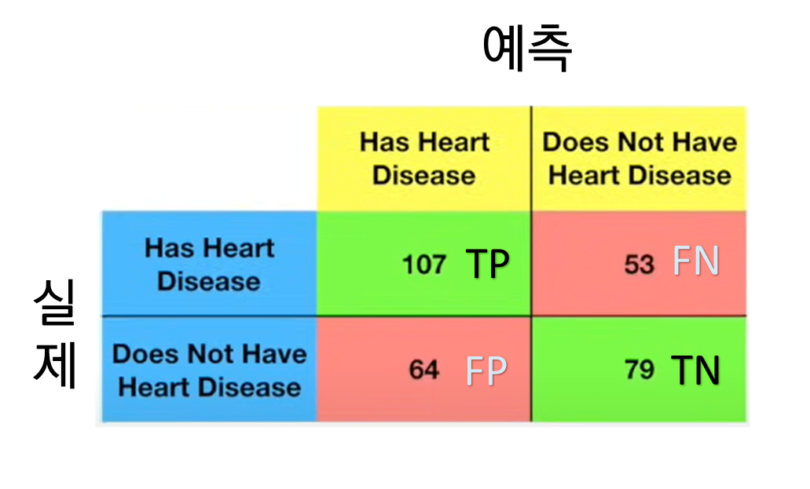
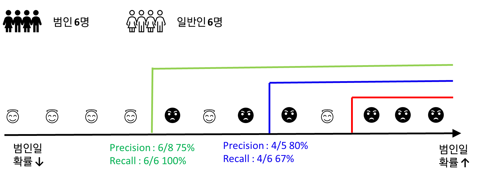
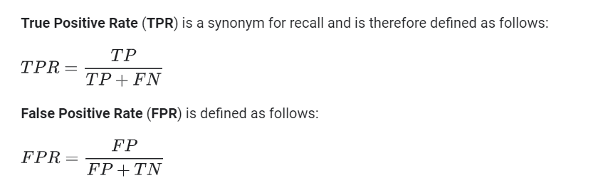
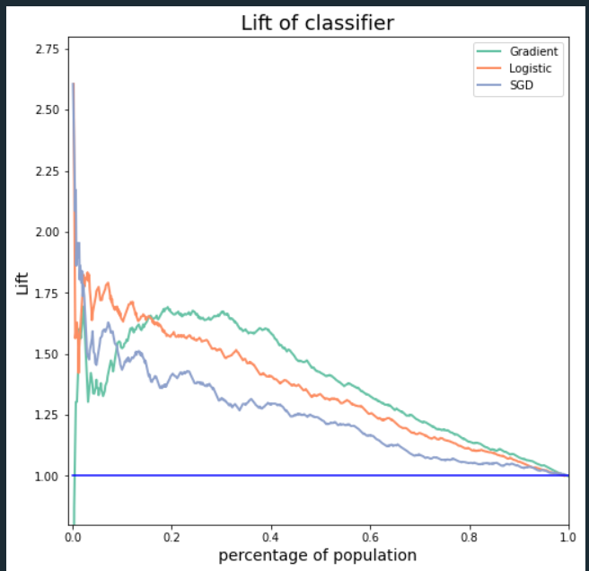
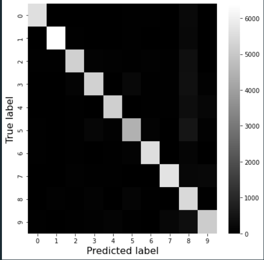
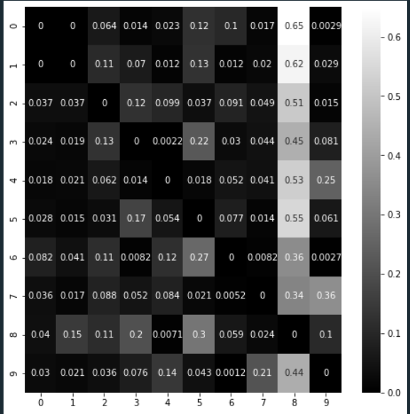

### Measuring _Accuracy_ using cross-validation

Cross-validation을 활용해 모델의 성능을 확인한다. classifier의 성능을 체크할 때 accuracy 방식은 효과적이지 못하다. A와 B를 분류하는 문제에서 A 95% B 5% 비율인 데이터셋으로 학습했다고 치자. 모델이 모든 instance를 A라고 분류한다면 accuracy 는 95%가 된다.

### Confusion Matrix



Sensitivity(Recall) = $\frac{TP}{TP+FN}$ ⇒ 전체 True 중 실제로 맞춘 비율 | 실제를 바탕으로 비율 계산

Precision = $\frac{TP}{TP+FP}$, ⇒ 예측값중 실제로 맞춘 비율 | 예측을 바탕으로 비율 계산

### Precision과 Recall

**Precision과 Recall은 Trade off 관계**

최근 보이스피싱 사기가 급증함에 따라 경찰은 대대적인 단속에 나섰다. 서울 A 경찰청의 전담팀은 12명의 보이스 피싱 용의자에 대해 조사중에 있다. 실제로 12명 중 6명은 범인이고 6명은 일반인이다. A 경찰청의 전담팀은 심문 조사 끝에 12명의 용의자를 가장 범인일 가능성이 높을 것 같은 순으로부터 나열하였다. 아래 그림은 나열한 용의자들이 실제로 범인인지 아니면 일반인인지를 보여준다. 아래는 Recall과 Precision의 이해를 돕기위한 그림이므로 경찰들의 시각에서는 이 안에 몇명이 범인인지 모르고 모두 같은 용의자로 보고 있다.



그림에서 초록색, 파란색, 빨간색 선은 범인으로 구분하는 기준이다. 선 왼편에 있다면 일반인, 오른편에 있다면 범인으로 간주하겠다는 뜻이다. 어느 색 선을 택하는지에 따라 범인으로 특정짓는 용의자의 수가 결정된다. 초록색 선을 택했다면 8명의 용의자를 범인으로 생각하고 4명은 일반인으로 생각한다. 파란색 선을 택했다면 5명의 용의자를 범인으로 생각하고 7명은 일반인으로 생각한다.

A 경찰청 전담팀은 누구까지를 범인으로 간주해야할지 고민중에 있다. 평소 신중에 신중을 가하는 팀장은 무고한 피해자를 발생시키지 않기 위해 빨간 선을 기준으로 해야한다고 주장한다. 반면 팀장의 상관인 경찰청장은 대대적인 단속에 나선만큼 확실하게 조사해야한다는 입장으로 초록색 선을 기준으로 해야한다고 주장한다.

팀장의 생각은 precision을 높혀야 한다는 말과 같다. 일단 범인이라고 예측하면 실제로 범인이 맞아야한다는 생각이다. 범인일 확률이 높은 용의자만 범인으로 간주하는게 무고한 피해자를 줄일 수 있는 방법이기 때문이다.

경찰청장의 생각은 recall을 높혀야 한다는 생각이다. 보이스 피싱으로 인한 피해자가 급증하고 있으니 최대한 범인을 색출해서 더이상 피해자가 발생하지 않도록 철저하게 조사해야하며 설령 무고한 피해자가 발생하더라도 이는 더큰 선을 위해 감내해야하는 부분이라 생각한다.

이처럼 recall과 prediction은 하나를 중시하게 되면 어쩔수 없이 하나를 포기해야하는 trade off 관계이다. 그렇다면 recall과 prediction 모두 올릴 수 있는 방법은 없을까? 해결책은 간단하다. 모델이 예측을 정말 잘하면 된다. 모델의 예측 성능이 정말 좋다면 prediction recall 모두 올라간다. 이러한 이유로 prediction과 recall에 기반한 $F$ 공식이 모델을 비교하는 도구로서 활용되는 것이다.


**모델 성능에 Prediction과 recall이 필요한 이유**

모델의 precision을 올리기는 매우 쉽다. 가장 높은 확률을 가진 대상 하나만을 예측해서 맞춘다면 100%가 되기 때문이다. recall은 이러한 precision의 맹점을 보완한다. recall은 precision한 대상이 얼마만큼 되는지 비율을 보여준다. recall을 증가시키려면 TP를 증가시켜야한다. TP를 증가시키기 위해서 까다롭게 설정한 기준을 점차 내리다보면서 잘못된 예측들도 서서히 범주에 포함된다. 그렇게 되면 TP가 늘고 이에따라 recall이 증가할 순 있어도 precision은 감소하게 된다. 성능이 좋을수록 recall이 증가하는 비율 대비 precision의 감소하는 비율이 작아지게된다.

recall이 증가할때 precision이 적게 떨어지는 모델이 좋은 모델이다.

### Threshold를 올리고 내림에 따라 빨간점과 선이 왔다갔다 하는 그래프를 만들어서 여기에 심고싶다.


### Precision과 Recall로 모델 비교하기

$F_1$은 calssifier의 성능을 비교하는데 활용되는 공식이다. Precision과 Recall을 활용해 조화평균을 계산한다. $F_1$이 높으려면 Recall과 Precision이 모두 높아야한다.

$F_1 = \frac{2}{\frac{1}{precision} + \frac{1}{recall}}$ ⇒ $2 \times \frac{precision \times recall}{precision + recall}$

**cross_val_predict() : confusion matrix를 만들때 활용된다.**

```python
from sklearn.model_selection import cross_val_predict
from sklearn.metrics import confusion_matrix

y_train_pred = **cross_val_predict**(sgd_clf, X_train, y_train_5, cv=3)
**confusion_matrix**(y_train_5, y_train_pred)

							     	   **예측
                     N       Y
>>> array([  실 F [53057, 1522],
				     제 T [ 1325, 4096]])**
```

### sklearn Decision function()과 Predict_proba()

Decision function과 predict_proba 개별 instance에 주어진 값으로, Decision_function은 score로 predict_proba는 probability로 계산된다. 개별 instance에 주어진 값은 theresohold를 통해서 class가 구분됩니다. threshold를 기준으로 위와 아래를 구분하는 것이다. 모델의 종류에 따라 둘 중 하나만을 가지고 모델을 분류한다. Tree 모델, logistic regression은 predict_proba()를 활용해 class를 구분하고 SGD classifier는 Decision_function()으로 class를 구분한다. 범인을 찾는 예시문제에서 활용된 모델은 용의자를 높은 확률에 기반해서 나열한뒤 구분하였으므로 predict_proba()를 활용한다.

하나의 sample을 넣으면 10개의 값이 있는 array로 반환한다. 이는 구분해야 하는 class가 10개이기 때문이다. 구분해야 하는 class가 2개라면 array도 2개로 반환한다.

```python
sgd_clf.decision_function([some_digit])

>> array([[-31893.03095419, -34419.69069632,  -9530.63950739,
          1823.73154031, -22320.14822878,  -1385.80478895,
        -26188.91070951, -16147.51323997,  -4604.35491274,
        -12050.767298  ]])
```

## ROC curve

ROC curve는 PR/RC curve처럼 threshold 변동에 따른 confusion matrix를 그래프화 한 것이다.

그래프를 만드는 기준은 TPR과 FPR이다.



T가 30개 F가 70개 있는 집단을 logistic regression으로 분류한다고 생각하자.

Threshold가 1.0이라는 말은 개별 instance의 predict_probability가 1.0이 되지 않고서는 P로 분류한다는 의미이다. 1.0인 instance는 모델은 모든 instance에 대해 N이라고 예측한다. Threshold 1.0일때 TPR과 FPR은 $TPR = \frac{0}{0+30} = 0 , FPR = \frac{0}{0+70}=0$이다.

Threshold가 0이라는 말은 개별 instance의 predict_probability가 0 이상이면 P라고 예측한다는 의미이다. Threshold 0일때 TPR과 FPR은 $TPR = \frac{30}{30+0} = 1 , FPR = \frac{70}{70+0}= 1$이다.

Threshold가 1.0 ⇒ 0으로 내려감에 따라 예측 N에 있는 instance들이 예측 P로 옮겨간다. Threshold 이 내려가면서 TPR과 FPR도 변동하게 된다.


실제로 어떻게 ROC Curve가 작동하는지 만져보자. Threshold를 증가시킬수록 N에 있던 값들이 감소하고 P에 있는 값이 증가하게 된다.

**TP rate와 FP rate 이해하기**

y축인 TP rate와 x축인 FP rate는 어떤 의미를 가질까? TP rate는 Recall을 다르게 부르는 용어이다. recall은 예측을 통해 TP를 얼마만큼 식별했는지를 나타낸다. Threshold를 0.7로 설정된 모델의 Recall이 0.45라면 0.7로 threshold를 내렸을때 약 45% 정도를 식별할 수 있다는 말이다.

FP rate는 종종 1-specificity라는 용어로 쓰인다. Specificity는 TN의 비율에 관심이 있다. Recall이 TP에 관심있고 Specificity는 TN에 관심이 있다. FP rate는 FP이므로 1-specificity비율에 관심이 있다.

Threshold를 1.0, 0.9, 0.8 ... 0으로 내릴때 instance의 수는 증가한다. 성능이 좋은 모델이라면 초반에 FP 대비 TP가 압도적으로 높아야한다. Threshold를 하나씩 내려보자. 일정 threshold를 지나서는 상승 곡선이 완만해지고 대신 FP 비율이 증가한다. 이는 Threshold를 계속 내리다보면서 예측정확도가 낮은 instance도 포함되기 때문이다.

**ROC curve로 모델 선정**

ROC curve가 만들어지는 원리와 TPR, FPR의 관계를 알았으니 이제는 모델을 비교하고 선정하는 방법에 대해서 알아보자. Auc를 계산해 더 큰 값을 가지는 classifier가 더 좋은 모델이다.

**ROC Curve를 직관적으로 변형하기**

ROC curve를 이해하기 위해서는 많은 지식도 있어야하고 ROC curve의 생성원리도 이해해야한다. data를 다루는 사람들이야 이해하겠지만 대부분의 사람들은 이 그래프가 의미하는 바를 명확하게 이해하기 어렵다. 그러므로 roc curve를 가지고는 사람들을 설득할 수 없다.

- **Cumulative response curve**
  culmulative response curve는 ROC curve를 보다 직관적으로 이해할 수 있도록 돕는다. y축은 TP rate로 똑같지만 x축을 선택되는 인구 비율로 대체된다. Business에서 이익 극대화를 위해서는 비용을 줄여야한다. 그러기 위해서는 적은 비용대비 큰 이익이 발생해야한다. 그러므로 business 문제에서는 Precision을 더욱 중요시 하게 된다. 마케팅에 효과적일 것 같은 대상을 선별해서 그 대상에게 맞는 마케팅 전략을 펼친다면 분명 비용대비 이익발생이 높아질 것이다.


- **Lift curve**



Lift는 모델의 성능을 base rate와 비교한 값이다. base rate라 함은 구하고자 하는 category가 모집단에서 차지하고 있는 비율을 말한다. 예로들어 2022년 3월 대한민국 남성과 여성의 비율은 49.5 : 50.5 이므로 남성의 base rate는 0.495 여성의 base rate 는 0.505가 된다.

이 그래프도 ROC curve와 마찬가지로 threshold가 감소되면서 그려진다. x축은 사용된 sample을 비율로 표현 한 것이다. threshold가 감소하면 모델이 True로 여기는 sample의 수가 증가하는 것이므로 비율이 점차 증가한다. threshold가 0에 도달하면 모든 Sample이 True로 여겨지기 때문에 base rate와 성능이 같아진다.

lift가 2.5라면 모델이 base rate보다 2.5배 많이 TP을 찾아낸다는 뜻이다. Titanic 생존자를 찾는 모델을 만든다고 해보자. 훈련 데이터 상 생존자와 사망자 비율은 3:7이다. 생존자의 base_rate는 0.3이 된다. 모델은 threshold과 개별 sample 별로 계산해 얻은 확률을 활용해 생존자를 구분짓는다. threshold를 0.8로 설정하면 생존 확률이 80% 이상으로 계산된 sample만 생존으로 예측하고 나머지는 사망으로 예측한다.

Threshold가 높을수록 최소한의 확률이 올라가는 것인만큼 모델이 생존으로 분류하는 sample의 수는 적어지게 된다. 하지만 생존자라고 예측한 sample중에 실제로 생존자일 경우가 매우 높아지게 된다. 따라서 threshold가 높을수록 예측 대비 정확도가 높아지고 모델의 정확도를 base rate와 비교하는 개념인 lift도 높게된다. threshold가 계속 내려갈수록 모델의 정확도는 점차 낮아지고 그에따라 lift도 낮아지게 된다.

**Lift curve 공식**

$\large\frac{the\;number\;of\; True\;Positive}{base\;rate \;\times \;the\;number\;of\;samples}$

왼손잡이를 구분하는 모델이 있다. 1000명의 sample을 가지고 있고 왼손잡이의 base rate는 0.1이다.

1000명 중 100명은 왼손잡이이다. lift를 계산해보자.

- Threshold = 1.0
  모델이 왼손잡이를 100%라고 생각하는 Sample은 없다. 따라서 모든 Sample을 오른손잡이로 분류한다. Lift = 0이다.
- Threshold = 0.9
  모델이 왼손잡이일 확률이 90%이상이라고 예측한 sample은 총 10명이다. 그중 6명은 실제로 왼손잡이지만 4명은 오른손잡이다. 모델은 10명 중 6명을 왼손잡이라 예측했다. 반면 base_rate는 1000명의 사람 중 10명을 무작위로 추출하는 방식이다. 그 결과 1명은 왼손잡이 9명은 오른손잡이다. lift = 6이다.
- Threshold = 0.5

  Threshold를 확 내려 확률이 50%이상인 sample을 왼손잡이라 예측하자. 50% 이상인 sample은 300명이고 이중 100명은 왼손잡이 200명은 오른손잡이이다. base_rate는 무작위로 300명을 뽑는다. 그 결과 30명은 왼손잡이 270명은 오른손잡이다. lift는 3.333

  lift 공식으로 다시 계산해보자

  $\large\frac{왼손잡이 예측 \;\cap\; 실제\;왼손잡이 }{base\;rate\;\times\; sample\; 개수}=\frac{100}{0.1*300} =3.333$

- Threshold = 0.0
  Threshold가 0이라는 말은 모든 sample을 왼손잡이로 여긴다는 말이다. 1000명을 왼손잡이로 여겼고 실제로 100명이 왼손잡이다. base rate도 마찬가지로 1000명을 뽑고 왼손잡이를 보니 100명이다. 따라서 lift = 1이다.

## Multiclass Classification

### One-versus-the-rest(OvR)와 One-versus-one(OvO)

multiclass classification은 사용하고 있는 알고리즘에 따라 가능하지 않을 수 있다. SVM과 logistic regression이 그러한 알고리즘이다. 물론 이 알고리즘만으로는 binary classification 밖에 수행할 수 없지만 OvR이나 OvO 방법을 사용하면 multiclassification을 수행할 수 있게 된다.

- One-versus-the-rest
  class 개수에 맞는 모델을 만든다. class가 5개 있다면 5개 모델을 각각 만들어야된다. 개별 모델은 하나의 class만 식별할 수 있다. sample을 예측하기 위해서 모든 모델에 넣어 값을 예측한다. 이중 가장 높은 점수(또는 확률)을 가진 class로 예측한다. 일부 모델을 제외하고는 OVR이 대세라고 한다.
- One-versus-One
  class끼리 비교하는 모델을 만든다. class가 5개 있는 variable을 예측한다고 하면 $_{5}C_2 = 10$개의 모델을 만들어야한다. training set을 2의 class로만 줄일 수 있다는 장점이 있다고 한다. 이게 장점이 되는건지는 모르겠지만..
    <aside>
    😍 sklearn은 class 개수에 따라서 자동으로 OvO 또는 OvR을 적용한다. 
    
    수동으로 원하면 sklearn.multiclass 항목에 있다고 함.
    
    </aside>

## Error Analysis

모델을 만들고 성능을 확인했다면 이제는 모델을 개선하는 작업에 들어가야한다. classification은 분류를 잘해야 성능이 올라간다. 그러므로 heatmap을 활용해 어떤 class에서 얼마나 많은 FP가 발생하는지 확인해야한다.

- **모델 정확도 파악**



MNIST 문제로 Error Analysis를 이해해보자. 0~9를 쓴 필기체를 맞추는 문제이다. training set은 0~9 sample이 같은 비율로 존재한다. 다시 말하면 개별 category별로 할당된 sample 수는 같다.

x축은 예측, y축은 실제 값이다. 색이 어두워 질수록 해당 칸에 존재하는 값이 없고 값이 많아질수록 밝아진다. 대각선만 밝게 빛나는 이유는 모델이 예측하고 실제로 맞춘 영역이기 때문이다.

밝은 대각선 중에서도 회색을 띄는 부분이 있다. 5x5 부분이 다른 칸에 비해 좀 더 진한 회색을 띈다.이는 다른 숫자에 비해 5를 잘 맞추지 못한다는 말이다.

- **Error 검토**



이번엔 Error에 집중해보자. 먼저 기존 confusion matrix에 변형을 가하자. 대각선을 모두 0으로 바꾼 뒤 실제 값(row)를 기준으로 normalization 하자. confusion matrix를 약간 변형하면 위 그래프가 나온다. 가장 밝은색인 (8,5)를 해석하면 실제 5를 8로 예측하는 경우가 다른 값으로 예측하는 경우보다 많았음을 알 수 있다. 뿐만 아니라 실제 값들 중 예측이 틀린 경우 8로 예측하는 경우가 제일 많았다. 이는 모델이 8을 제대로 예측한다면 더 나은 성능을 발휘할 것이라고 예측할 수 있다.

이러한 문제점을 개선하기 위해서는 여러 방법이 존재한다. 8에 대한 sample data를 보충한다던가 새로운 feature을 만들어 모델이 보다 8을 잘 이해할 수 있도록 한다던가 sample에 대해 preprocessing을 수행한다던가 하는 방식이 있다.

## Multilabel Classification

용어만 알아두고 가자. 샘플 하나에 여러 개 label을 붙여햐 하는 경우다. 사람 얼굴을 식별하는 모델이 여러 사람이 있는 사진을 보면 개별적으로 labeling을 해야한다. 이럴때 쓰이는 방식이다. 다만 image에 processing에 관심 없기에 지금은 그런게 있나보구나 하고 넘어가자.
