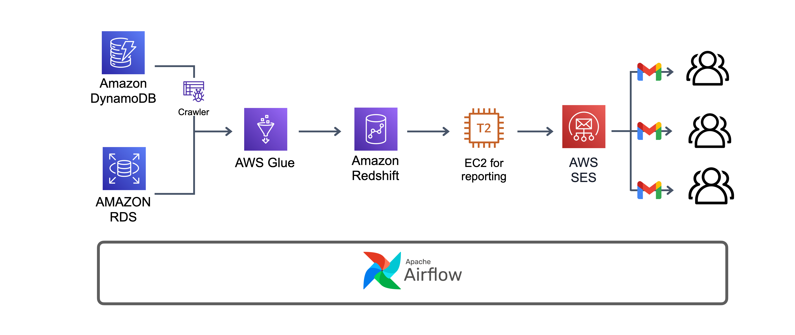
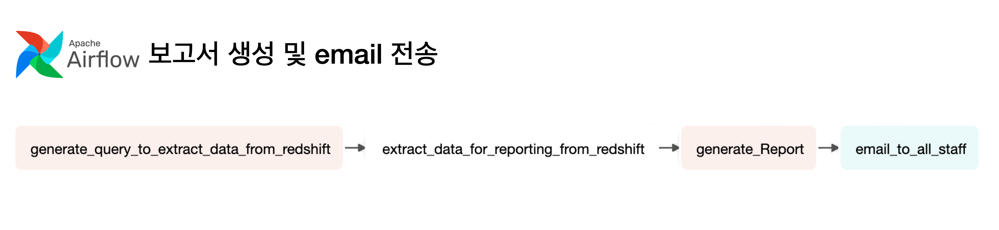

### 프로젝트 소개



### 시나리오 설명

- [**도서관 장서 검색 서비스**](https://yangoos57.github.io/blog/portfolio/app/)를 제공하는 기업의 데이터 엔지니어로서 서비스 이용현황을 보고서 양식으로 매일 아침 전 직원에게 메일로 공유해야한다.
- 사용자 요청 기준 일 평균 서비스 이용량은 약 10만건으로 요청 결과는 Dynamo DB에 저장되며 사용자 행동 데이터는 RDS에 저장된다.
- 데이터는 일일단위로 Data Warehouse를 구축해 데이터 분석가, PM 등 다른 구성원들이 이용할 수 있어야 하며, 보고서 자동화에 필요한 Data Mart도 구축해야한다.

### ETL 파이프라인 구축

  

- Dynamo DB에 저장된 데이터 구조는 다음과 같으며, Json 타입의 Dynamo DB 아이템을 RDBMS 테이블에 저장하기 위해 array 유형의 데이터를 여러 행으로 만드는 ETL 파이프라인을 구축했습니다.
- 데이터 처리에는 AWS Glue와 Pyspark를 활용하였고, 일일 사용자 요청 기준, 1,000만건의 데이터를 추출하여 Redshift에 저장했습니다.

  ```python
  # Dynamo DB Item example.
  item = {
    query_id: "bdeca3e6-efe5-4728-9056-2464e931dec7",
    query_date: "2023-05-16",
    selected_lib: ["노원", "마포", "남산"],
    isbn13_list: ["9791163030645","9791186710340""9788956748245"],
    user_search: ["flask", "python","ML"],
  };

  # to isbn13_list

  |   isbn13_list |                             query_id |
  |--------------:|-------------------------------------:|
  | 9791163030645 | bdeca3e6-efe5-4728-9056-2464e931dec7 |

  # to selected_lib

  | selected_lib |                             query_id |
  |-------------:|-------------------------------------:|
  |         노원  | bdeca3e6-efe5-4728-9056-2464e931dec7 |

  # to user_search

  | user_search  |                             query_id |
  |-------------:|-------------------------------------:|
  |       flask  | bdeca3e6-efe5-4728-9056-2464e931dec7 |
  ```

### 보고서 생성 및 email 전송

  

- Redshift에 저장된 데이터에서 필요한 데이터를 추출해 Data Mart를 구축했습니다.
- Airflow 운영 환경과 보고서 생성 환경을 분리하고, 다른 종류의 보고서 생성이 필요할 경우에 손쉬운 확장을 위해, EC2 Instance를 운영했습니다.
- 분석 보고서는 어느 환경에서나 열람 가능하도록 HTML 파일로 생성했으며, AWS SES를 활용해 전직원에게 관련 보고서를 email로 전송하도록 구현했습니다.

### 프로젝트를 통해 느낀점- 워크플로우 관리도구 필요성 절감

기획 초기 데이터 파이프라인 자동화를 위해 AWS Eventbridge, S3 Notification, Amazon SNS 등을 활용해 자동화를 구상했습니다. AWS 서비스를 이용해 데이터 파이프라인을 구축하는 만큼, Eventbridge나 SNS을 사용하는 것이 사용면에서 간편하고 호환성에서도 장점이 있다고 판단했습니다.

하지만 데이터 파이프라인을 구축하는 과정에서 워크플로우 관리 도구없이 AWS Eventbridge, S3 Notification, Amazon SNS만으로 자동화를 구현하는 방식이 매우 비효율적이며, 실수를 증가시키는 방식임을 깨달았습니다. 특히 다른 누군가가 제가 만든 파이프라인을 이해하거나 보수해야할 필요가 생길 경우 구조 이해에 상당한 어려움을 가질것이라 생각했습니다.

이러한 이유로 워크플로우 관리도구인 airflow를 도입했습니다. 직접 사용해보며 느꼈던 점으로는

- airflow에서 AWS 서비스를 공식 지원하므로 태스크 생성이 간단하며, Pyspark, Pandas를 활용한 전처리 태스크 또한 간단히 구축할 수 있어 빠르게 배우고 적용할 수 있었습니다.
- 워크플로우 변동사항이 실시간으로 다이어그램에 반영되고, 배치 프로세스가 실패하더라도 어떠한 태스크가 성공하고 실패했는지 한 번에 확인 가능하므로 파이프라인 관리에 있어 효율적이었습니다.
- 파이썬 코드로 파이프라인이 관리되는 만큼 파이프라인을 템플릿화하여 빠르고 간편하게 새로운 데이터 파이프라인을 구축할 수 있는 편리함이 있었습니다.

해당 프로젝트를 수행하며 데이터 파이프라인 구축에 필요한 서비스와 관련 기술을 익히는데도 도움이 됐지만, 무엇보다 워크플로우 관리도구를 사용하는 이유를 이해하고 효율성을 체감했다는 점에서 가치가 있다고 생각합니다.
