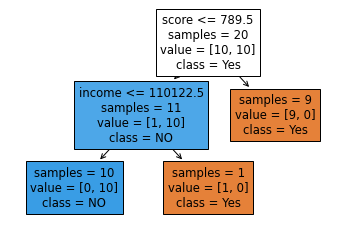

```python
import pandas as pd
import numpy as np
import matplotlib.pyplot as plt
import seaborn as sns
from sklearn.linear_model import LinearRegression
import os

os.getcwd()
```

    'd:\\git_local_repository\\yangoos57\\ML\\Hands_On_Data_preprocessing_in_python\\Part2'

```python
customerloan_df = pd.read_csv('./data/ch7/CustomerLoan.csv')

customerloan_df.info()
```

    <class 'pandas.core.frame.DataFrame'>
    RangeIndex: 21 entries, 0 to 20
    Data columns (total 4 columns):
     #   Column   Non-Null Count  Dtype
    ---  ------   --------------  -----
     0   Name     21 non-null     int64
     1   income   21 non-null     int64
     2   score    21 non-null     int64
     3   default  20 non-null     object
    dtypes: int64(3), object(1)
    memory usage: 800.0+ bytes

```python
plt.figure(figsize=(4,4))
customerloan_df.sort_values(by='default', ascending=False, inplace=True)
sns.scatterplot(x='income',y='score',hue='default', data = customerloan_df, palette=['k','b'])
plt.legend(bbox_to_anchor=(1.05, 1.0))
```

    <matplotlib.legend.Legend at 0x24b2175fd90>


```python
customerloan_df['default'].unique()
```

    array(['Yes', 'NO', nan], dtype=object)

```python
customerloan_df['income_normalized'] = (customerloan_df.income - customerloan_df.income.min()) / (customerloan_df.income.max() - customerloan_df.income.min())
customerloan_df['score_normalized'] = (customerloan_df.score - customerloan_df.score.min()) / (customerloan_df.score.max() - customerloan_df.score.min())

customerloan_df
```

<div>
<style scoped>
    .dataframe tbody tr th:only-of-type {
        vertical-align: middle;
    }

    .dataframe tbody tr th {
        vertical-align: top;
    }

    .dataframe thead th {
        text-align: right;
    }

</style>
<table border="1" class="dataframe">
  <thead>
    <tr style="text-align: right;">
      <th></th>
      <th>Name</th>
      <th>income</th>
      <th>score</th>
      <th>default</th>
      <th>income_normalized</th>
      <th>socre_normalized</th>
      <th>score_normalized</th>
    </tr>
  </thead>
  <tbody>
    <tr>
      <th>10</th>
      <td>10</td>
      <td>84519</td>
      <td>740</td>
      <td>Yes</td>
      <td>0.145553</td>
      <td>0.444444</td>
      <td>0.444444</td>
    </tr>
    <tr>
      <th>11</th>
      <td>11</td>
      <td>86504</td>
      <td>753</td>
      <td>Yes</td>
      <td>0.193387</td>
      <td>0.540741</td>
      <td>0.540741</td>
    </tr>
    <tr>
      <th>18</th>
      <td>18</td>
      <td>107388</td>
      <td>789</td>
      <td>Yes</td>
      <td>0.696653</td>
      <td>0.807407</td>
      <td>0.807407</td>
    </tr>
    <tr>
      <th>17</th>
      <td>17</td>
      <td>104451</td>
      <td>730</td>
      <td>Yes</td>
      <td>0.625877</td>
      <td>0.370370</td>
      <td>0.370370</td>
    </tr>
    <tr>
      <th>16</th>
      <td>16</td>
      <td>103760</td>
      <td>740</td>
      <td>Yes</td>
      <td>0.609225</td>
      <td>0.444444</td>
      <td>0.444444</td>
    </tr>
    <tr>
      <th>15</th>
      <td>15</td>
      <td>102658</td>
      <td>680</td>
      <td>Yes</td>
      <td>0.582669</td>
      <td>0.000000</td>
      <td>0.000000</td>
    </tr>
    <tr>
      <th>14</th>
      <td>14</td>
      <td>97262</td>
      <td>777</td>
      <td>Yes</td>
      <td>0.452635</td>
      <td>0.718519</td>
      <td>0.718519</td>
    </tr>
    <tr>
      <th>13</th>
      <td>13</td>
      <td>93941</td>
      <td>706</td>
      <td>Yes</td>
      <td>0.372605</td>
      <td>0.192593</td>
      <td>0.192593</td>
    </tr>
    <tr>
      <th>12</th>
      <td>12</td>
      <td>89292</td>
      <td>750</td>
      <td>Yes</td>
      <td>0.260573</td>
      <td>0.518519</td>
      <td>0.518519</td>
    </tr>
    <tr>
      <th>19</th>
      <td>19</td>
      <td>107400</td>
      <td>690</td>
      <td>Yes</td>
      <td>0.696942</td>
      <td>0.074074</td>
      <td>0.074074</td>
    </tr>
    <tr>
      <th>1</th>
      <td>1</td>
      <td>95483</td>
      <td>801</td>
      <td>NO</td>
      <td>0.409765</td>
      <td>0.896296</td>
      <td>0.896296</td>
    </tr>
    <tr>
      <th>9</th>
      <td>9</td>
      <td>119976</td>
      <td>790</td>
      <td>NO</td>
      <td>1.000000</td>
      <td>0.814815</td>
      <td>0.814815</td>
    </tr>
    <tr>
      <th>8</th>
      <td>8</td>
      <td>119147</td>
      <td>805</td>
      <td>NO</td>
      <td>0.980023</td>
      <td>0.925926</td>
      <td>0.925926</td>
    </tr>
    <tr>
      <th>7</th>
      <td>7</td>
      <td>114799</td>
      <td>801</td>
      <td>NO</td>
      <td>0.875244</td>
      <td>0.896296</td>
      <td>0.896296</td>
    </tr>
    <tr>
      <th>6</th>
      <td>6</td>
      <td>114114</td>
      <td>799</td>
      <td>NO</td>
      <td>0.858737</td>
      <td>0.881481</td>
      <td>0.881481</td>
    </tr>
    <tr>
      <th>5</th>
      <td>5</td>
      <td>112845</td>
      <td>750</td>
      <td>NO</td>
      <td>0.828156</td>
      <td>0.518519</td>
      <td>0.518519</td>
    </tr>
    <tr>
      <th>4</th>
      <td>4</td>
      <td>108726</td>
      <td>795</td>
      <td>NO</td>
      <td>0.728896</td>
      <td>0.851852</td>
      <td>0.851852</td>
    </tr>
    <tr>
      <th>3</th>
      <td>3</td>
      <td>104234</td>
      <td>790</td>
      <td>NO</td>
      <td>0.620647</td>
      <td>0.814815</td>
      <td>0.814815</td>
    </tr>
    <tr>
      <th>2</th>
      <td>2</td>
      <td>101641</td>
      <td>815</td>
      <td>NO</td>
      <td>0.558161</td>
      <td>1.000000</td>
      <td>1.000000</td>
    </tr>
    <tr>
      <th>0</th>
      <td>0</td>
      <td>78479</td>
      <td>800</td>
      <td>NO</td>
      <td>0.000000</td>
      <td>0.888889</td>
      <td>0.888889</td>
    </tr>
    <tr>
      <th>20</th>
      <td>20</td>
      <td>98487</td>
      <td>785</td>
      <td>NaN</td>
      <td>0.482155</td>
      <td>0.777778</td>
      <td>0.777778</td>
    </tr>
  </tbody>
</table>
</div>

### KNN

### Index와 Column 바꾸기 => .T

```python
from sklearn.neighbors import KNeighborsClassifier

predictors =['income_normalized','score_normalized']
target = 'default'
xs = customerloan_df[predictors].drop(index=[20]) ### independent attributes
y = customerloan_df[target].drop(index=[20]) ### a dependent attribute

knn = KNeighborsClassifier(n_neighbors=4)
knn.fit(xs,y)

newapplicant = customerloan_df.iloc[20][['income_normalized','score_normalized']]
newapplicant_df = pd.DataFrame(newapplicant).T
newapplicant_df

predict_y = knn.predict(newapplicant_df)
print(predict_y)
```

    ['NO']

### Decision Tree

### Decision Tree에서는 Normalize를 하지 않는다.

```python
from sklearn.tree import DecisionTreeClassifier

predictors = ['income', 'score'] ### Nomalizing을 하지 않는다.
target = 'default'

xs = customerloan_df[predictors].drop(index=[20])
y = customerloan_df[target].drop(index=[20])
classtree = DecisionTreeClassifier()
classtree.fit(xs,y)
predict_y = classtree.predict(newapplicant_df)
print(predict_y)
```

    ['Yes']

### Tree Image 불러오기

```python
from sklearn.tree import plot_tree

plot_tree(classtree, feature_names=predictors, class_names=y.unique(), filled =True, impurity=False)
```

    [Text(200.88000000000002, 181.2, 'score <= 789.5\nsamples = 20\nvalue = [10, 10]\nclass = Yes'),
     Text(133.92000000000002, 108.72, 'income <= 110122.5\nsamples = 11\nvalue = [1, 10]\nclass = NO'),
     Text(66.96000000000001, 36.23999999999998, 'samples = 10\nvalue = [0, 10]\nclass = NO'),
     Text(200.88000000000002, 36.23999999999998, 'samples = 1\nvalue = [1, 0]\nclass = Yes'),
     Text(267.84000000000003, 108.72, 'samples = 9\nvalue = [9, 0]\nclass = Yes')]



```python

```

Questions

1. .fillna로 NaN 값 플롯에 별표로 표시하기
2. Decision Tree로 주사위 합 Tree를 만들 수 있나?

```python

```

    4.7692133

```python
10,000,000,000
```
