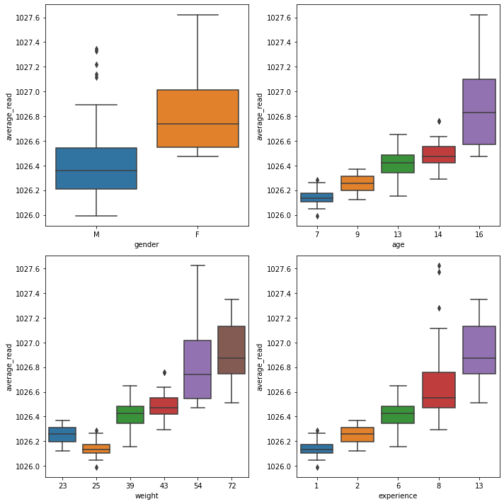
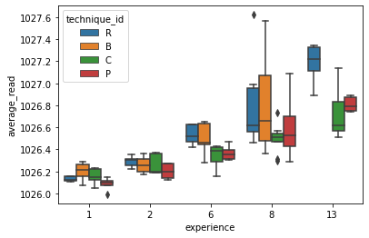

```python
import pandas as pd
import numpy as np
import seaborn as sns
import matplotlib.pyplot as plt
import os

os.getcwd()
```

    'd:\\git_local_repository\\yangoos57\\ML\\Hands_On_Data_preprocessing_in_python\\Part3'

### Data fusion and Data integration

- Data fusion : 합치고자 하는 데이터 셋 간 data object(=row)가 일치되지 않은 경우에 자료를 합치는 경우를 말합니다.
  - Data fusion을 위해서는 Data object를 정의내려야 하고 자료가 합쳐질 수 있도록 공통된 가정들을 설립해야합니다.

<br>

- Data integration : 합치고자 하는 데이터 셋 간 data object(=row)가 일치하는 경우에 자료를 합치는 경우를 말합니다.
  - Data integration은 이미 data object간 정의가 완료된 상태이므로 합치는데 어려움이 없습니다. 다만 자료 중복이나 결측값 발생 경우를 유의해야 합니다.

### Frequent challanges regarding data fusion and integration

1. entity identification : 개별 row를 식별하기 힘들거나 unique identifier가 너무 많아서 데이터 셋이 난잡해지는 경우입니다.
   <br>
2. unwise data collection : 개별 data object를 하나의 테이블에 보관하지 않고 여러 파일로 분산해서 가지고 있는 경우입니다. ex) trump address
3. index mismatched formatting : data fusion시 data object 간 양식이 맞지 않거나 조금씩 불일치 되는 경우에 완벽히 통합되지 않는 경우입니다.
4. aggregation mismatch : 3번과 유사하지만 attribute와 관련된 내용입니다. 대상이 통합될 수 있도록 하나의 데이터 프레임 또는 모두를 건드려서 통합될 수 있도록 해야합니다.
5. duplicate data objects : 분산된 자료를 하나로 통합하다보면 중복되는 data object가 발생할 수 있습니다.
6. data redundancy : attribute에서 데이터가 중복되는 경우 입니다. shallow redundancy는 title이 같거나 내용이 똑같아서 구분하기 쉬운 경우를, deeper redundancy는 title이나 내용이 다르지만 다른 attribute로 부터 도출가능한 경우를 말합니다.

### Example 1(Challenges 3 and 4)

```python
electric_df = pd.read_csv('data/ch12/Electricity Data 2016_2017.csv')
```

```python
### Date와 Time 합치기
electric_df.Date = electric_df.Date +' '+ electric_df.Time

# 합친 Date Datetime으로 변환
electric_df.Date = pd.to_datetime(electric_df.Date)

# 2017년도 자료 제거 & Time 제거
electric_df.drop(electric_df[electric_df['Date'].dt.year == 2017].index, inplace= True)
electric_df.drop(columns=['Time'], inplace=True)
```

```python
# 15분 term 자료 1시간으로 통합
hour_electric_df = electric_df.groupby([pd.Grouper(key='Date',freq='H')]).sum()

# multi-index 만들고 이름 부여하기
new_index = hour_electric_df.index.to_series().dt
hour_electric_df.set_index([new_index.month,new_index.day,new_index.time],inplace=True)
hour_electric_df.index.names =['month','day','time']
```

```python
temp_df = pd.read_csv('data/ch12/Temperature 2016.csv')
### Datetime으로 변환
temp_df['Timestamp'] = pd.to_datetime(temp_df['Timestamp'])

# multi-index 만들고 이름 부여하기
new_index = temp_df['Timestamp'].dt
temp_df.set_index([new_index.month,new_index.day,new_index.time],inplace= True)
temp_df.index.names =['month','day','time']

# timestamp 제거하기
temp_df.drop(columns=['Timestamp'],inplace=True)
```

```python
## hour_electric_dt와 temp_df 합치기
k = hour_electric_df.join(temp_df)
```

```python
temp_df.head(5)
# plt.plot(temp_df.index,temp_df['temp'])
# sns.lineplot(data=temp_df, x = temp_df.index, y='temp')
```

<div>
<style scoped>
    .dataframe tbody tr th:only-of-type {
        vertical-align: middle;
    }

    .dataframe tbody tr th {
        vertical-align: top;
    }

    .dataframe thead th {
        text-align: right;
    }

</style>
<table border="1" class="dataframe">
  <thead>
    <tr style="text-align: right;">
      <th></th>
      <th></th>
      <th></th>
      <th>temp</th>
    </tr>
    <tr>
      <th>month</th>
      <th>day</th>
      <th>time</th>
      <th></th>
    </tr>
  </thead>
  <tbody>
    <tr>
      <th rowspan="5" valign="top">1</th>
      <th rowspan="5" valign="top">1</th>
      <th>00:00:00</th>
      <td>79.0</td>
    </tr>
    <tr>
      <th>01:00:00</th>
      <td>79.0</td>
    </tr>
    <tr>
      <th>02:00:00</th>
      <td>77.5</td>
    </tr>
    <tr>
      <th>03:00:00</th>
      <td>79.0</td>
    </tr>
    <tr>
      <th>04:00:00</th>
      <td>77.0</td>
    </tr>
  </tbody>
</table>
</div>

```python
zxc = hour_electric_df.reset_index()
zxc['timestamp'] ='2016-' + zxc['month'].astype(str) + '-' + zxc['day'].astype(str) + ' ' +zxc['time'].astype(str)
zxc['timestamp'] = pd.to_datetime(zxc['timestamp'])
zxc.drop(columns=['month','day','time'],inplace=True)
zxc.head()

```

<div>
<style scoped>
    .dataframe tbody tr th:only-of-type {
        vertical-align: middle;
    }

    .dataframe tbody tr th {
        vertical-align: top;
    }

    .dataframe thead th {
        text-align: right;
    }

</style>
<table border="1" class="dataframe">
  <thead>
    <tr style="text-align: right;">
      <th></th>
      <th>Consumption</th>
      <th>timestamp</th>
    </tr>
  </thead>
  <tbody>
    <tr>
      <th>0</th>
      <td>119052.0</td>
      <td>2016-01-01 00:00:00</td>
    </tr>
    <tr>
      <th>1</th>
      <td>113138.0</td>
      <td>2016-01-01 01:00:00</td>
    </tr>
    <tr>
      <th>2</th>
      <td>111013.0</td>
      <td>2016-01-01 02:00:00</td>
    </tr>
    <tr>
      <th>3</th>
      <td>104808.0</td>
      <td>2016-01-01 03:00:00</td>
    </tr>
    <tr>
      <th>4</th>
      <td>99552.0</td>
      <td>2016-01-01 04:00:00</td>
    </tr>
  </tbody>
</table>
</div>

```python
zxc.set_index('timestamp',inplace=True)
zxc
```

<div>
<style scoped>
    .dataframe tbody tr th:only-of-type {
        vertical-align: middle;
    }

    .dataframe tbody tr th {
        vertical-align: top;
    }

    .dataframe thead th {
        text-align: right;
    }

</style>
<table border="1" class="dataframe">
  <thead>
    <tr style="text-align: right;">
      <th></th>
      <th>Consumption</th>
    </tr>
    <tr>
      <th>timestamp</th>
      <th></th>
    </tr>
  </thead>
  <tbody>
    <tr>
      <th>2016-01-01 00:00:00</th>
      <td>119052.0</td>
    </tr>
    <tr>
      <th>2016-01-01 01:00:00</th>
      <td>113138.0</td>
    </tr>
    <tr>
      <th>2016-01-01 02:00:00</th>
      <td>111013.0</td>
    </tr>
    <tr>
      <th>2016-01-01 03:00:00</th>
      <td>104808.0</td>
    </tr>
    <tr>
      <th>2016-01-01 04:00:00</th>
      <td>99552.0</td>
    </tr>
    <tr>
      <th>...</th>
      <td>...</td>
    </tr>
    <tr>
      <th>2016-12-31 19:00:00</th>
      <td>154958.0</td>
    </tr>
    <tr>
      <th>2016-12-31 20:00:00</th>
      <td>149484.0</td>
    </tr>
    <tr>
      <th>2016-12-31 21:00:00</th>
      <td>143693.0</td>
    </tr>
    <tr>
      <th>2016-12-31 22:00:00</th>
      <td>142717.0</td>
    </tr>
    <tr>
      <th>2016-12-31 23:00:00</th>
      <td>150928.0</td>
    </tr>
  </tbody>
</table>
<p>8784 rows × 1 columns</p>
</div>

### 분해한 datetime 다시 통합하기

```python
### index를 다시 column으로 위치시키기
asd = temp_df.reset_index()
### Timestamp 간단하게 만들기
# string으로 바꾼 다음에 datetime으로 만들면 어렵지 않다.
asd['timestamp'] ='2016-' + asd['month'].astype(str) + '-' + asd['day'].astype(str) + ' ' +asd['time'].astype(str)
asd['timestamp'] = pd.to_datetime(asd['timestamp'])

## 불필요한 column 지우기
asd.drop(columns=['month','day','time'],inplace=True)

```

```python
# sns.lineplot(data = asd , x = 'timestamp', y ='temp')
### temp와 consumption 합치기 위해 index 통일하기
asd.set_index('timestamp',inplace=True)


```

```python
## 통합
x = asd.join(zxc).reset_index()
x.head(10)
```

<div>
<style scoped>
    .dataframe tbody tr th:only-of-type {
        vertical-align: middle;
    }

    .dataframe tbody tr th {
        vertical-align: top;
    }

    .dataframe thead th {
        text-align: right;
    }

</style>
<table border="1" class="dataframe">
  <thead>
    <tr style="text-align: right;">
      <th></th>
      <th>timestamp</th>
      <th>temp</th>
      <th>Consumption</th>
    </tr>
  </thead>
  <tbody>
    <tr>
      <th>0</th>
      <td>2016-01-01 00:00:00</td>
      <td>79.0</td>
      <td>119052.0</td>
    </tr>
    <tr>
      <th>1</th>
      <td>2016-01-01 01:00:00</td>
      <td>79.0</td>
      <td>113138.0</td>
    </tr>
    <tr>
      <th>2</th>
      <td>2016-01-01 02:00:00</td>
      <td>77.5</td>
      <td>111013.0</td>
    </tr>
    <tr>
      <th>3</th>
      <td>2016-01-01 03:00:00</td>
      <td>79.0</td>
      <td>104808.0</td>
    </tr>
    <tr>
      <th>4</th>
      <td>2016-01-01 04:00:00</td>
      <td>77.0</td>
      <td>99552.0</td>
    </tr>
    <tr>
      <th>5</th>
      <td>2016-01-01 05:00:00</td>
      <td>77.0</td>
      <td>97522.0</td>
    </tr>
    <tr>
      <th>6</th>
      <td>2016-01-01 06:00:00</td>
      <td>77.0</td>
      <td>97959.0</td>
    </tr>
    <tr>
      <th>7</th>
      <td>2016-01-01 07:00:00</td>
      <td>77.0</td>
      <td>98447.0</td>
    </tr>
    <tr>
      <th>8</th>
      <td>2016-01-01 08:00:00</td>
      <td>80.5</td>
      <td>98609.0</td>
    </tr>
    <tr>
      <th>9</th>
      <td>2016-01-01 09:00:00</td>
      <td>82.0</td>
      <td>98590.0</td>
    </tr>
  </tbody>
</table>
</div>

### Example 2 (Challenges 2 and 3)

```python
unknown_df = pd.read_csv('data/ch12/Taekwondo_Technique_Classification_Stats.csv')
athelete_df = pd.read_csv('data/ch12/Table1.csv')

```

```python
### Data fusion이 필요할 때는 새로운 dataframe을 만들어서 이곳에 자료를 저장하자.
designed_columns = ['participant_id', 'gender', 'age','weight','experience','technique_id', 'trial_number','average_read']

# 어떤 사람 한명이 기술 한 번을 시현하지 않아서 1개 뺐음
n_rows = len(unknown_df.columns) -1

performance_df = pd.DataFrame(index=range(n_rows), columns=designed_columns)
performance_df
```

<div>
<style scoped>
    .dataframe tbody tr th:only-of-type {
        vertical-align: middle;
    }

    .dataframe tbody tr th {
        vertical-align: top;
    }

    .dataframe thead th {
        text-align: right;
    }

</style>
<table border="1" class="dataframe">
  <thead>
    <tr style="text-align: right;">
      <th></th>
      <th>participant_id</th>
      <th>gender</th>
      <th>age</th>
      <th>weight</th>
      <th>experience</th>
      <th>technique_id</th>
      <th>trial_number</th>
      <th>average_read</th>
    </tr>
  </thead>
  <tbody>
    <tr>
      <th>0</th>
      <td>NaN</td>
      <td>NaN</td>
      <td>NaN</td>
      <td>NaN</td>
      <td>NaN</td>
      <td>NaN</td>
      <td>NaN</td>
      <td>NaN</td>
    </tr>
    <tr>
      <th>1</th>
      <td>NaN</td>
      <td>NaN</td>
      <td>NaN</td>
      <td>NaN</td>
      <td>NaN</td>
      <td>NaN</td>
      <td>NaN</td>
      <td>NaN</td>
    </tr>
    <tr>
      <th>2</th>
      <td>NaN</td>
      <td>NaN</td>
      <td>NaN</td>
      <td>NaN</td>
      <td>NaN</td>
      <td>NaN</td>
      <td>NaN</td>
      <td>NaN</td>
    </tr>
    <tr>
      <th>3</th>
      <td>NaN</td>
      <td>NaN</td>
      <td>NaN</td>
      <td>NaN</td>
      <td>NaN</td>
      <td>NaN</td>
      <td>NaN</td>
      <td>NaN</td>
    </tr>
    <tr>
      <th>4</th>
      <td>NaN</td>
      <td>NaN</td>
      <td>NaN</td>
      <td>NaN</td>
      <td>NaN</td>
      <td>NaN</td>
      <td>NaN</td>
      <td>NaN</td>
    </tr>
    <tr>
      <th>...</th>
      <td>...</td>
      <td>...</td>
      <td>...</td>
      <td>...</td>
      <td>...</td>
      <td>...</td>
      <td>...</td>
      <td>...</td>
    </tr>
    <tr>
      <th>110</th>
      <td>NaN</td>
      <td>NaN</td>
      <td>NaN</td>
      <td>NaN</td>
      <td>NaN</td>
      <td>NaN</td>
      <td>NaN</td>
      <td>NaN</td>
    </tr>
    <tr>
      <th>111</th>
      <td>NaN</td>
      <td>NaN</td>
      <td>NaN</td>
      <td>NaN</td>
      <td>NaN</td>
      <td>NaN</td>
      <td>NaN</td>
      <td>NaN</td>
    </tr>
    <tr>
      <th>112</th>
      <td>NaN</td>
      <td>NaN</td>
      <td>NaN</td>
      <td>NaN</td>
      <td>NaN</td>
      <td>NaN</td>
      <td>NaN</td>
      <td>NaN</td>
    </tr>
    <tr>
      <th>113</th>
      <td>NaN</td>
      <td>NaN</td>
      <td>NaN</td>
      <td>NaN</td>
      <td>NaN</td>
      <td>NaN</td>
      <td>NaN</td>
      <td>NaN</td>
    </tr>
    <tr>
      <th>114</th>
      <td>NaN</td>
      <td>NaN</td>
      <td>NaN</td>
      <td>NaN</td>
      <td>NaN</td>
      <td>NaN</td>
      <td>NaN</td>
      <td>NaN</td>
    </tr>
  </tbody>
</table>
<p>115 rows × 8 columns</p>
</div>

```python
### athelete_df 정리
athelete_df.set_index('Participant ID', inplace= True)
### 이름 정리
athelete_df.columns =['sex', 'age','weight','experience','belt']
athelete_df
```

<div>
<style scoped>
    .dataframe tbody tr th:only-of-type {
        vertical-align: middle;
    }

    .dataframe tbody tr th {
        vertical-align: top;
    }

    .dataframe thead th {
        text-align: right;
    }

</style>
<table border="1" class="dataframe">
  <thead>
    <tr style="text-align: right;">
      <th></th>
      <th>sex</th>
      <th>age</th>
      <th>weight</th>
      <th>experience</th>
      <th>belt</th>
    </tr>
    <tr>
      <th>Participant ID</th>
      <th></th>
      <th></th>
      <th></th>
      <th></th>
      <th></th>
    </tr>
  </thead>
  <tbody>
    <tr>
      <th>P1</th>
      <td>M</td>
      <td>7</td>
      <td>25</td>
      <td>1</td>
      <td>Green</td>
    </tr>
    <tr>
      <th>P2</th>
      <td>M</td>
      <td>9</td>
      <td>23</td>
      <td>2</td>
      <td>Red Stripe</td>
    </tr>
    <tr>
      <th>P3</th>
      <td>M</td>
      <td>13</td>
      <td>39</td>
      <td>6</td>
      <td>Black Stripe</td>
    </tr>
    <tr>
      <th>P4</th>
      <td>M</td>
      <td>14</td>
      <td>43</td>
      <td>8</td>
      <td>Black (Competitive)</td>
    </tr>
    <tr>
      <th>P5</th>
      <td>F</td>
      <td>16</td>
      <td>54</td>
      <td>8</td>
      <td>Black (Competitive)</td>
    </tr>
    <tr>
      <th>P6</th>
      <td>M</td>
      <td>16</td>
      <td>72</td>
      <td>13</td>
      <td>Black (Competitive)</td>
    </tr>
  </tbody>
</table>
</div>

```python
# 행과 열을 바꿈
vert_unknown_df = unknown_df.T
#맨 위의 행을 column으로 사용함
vert_unknown_df.columns = vert_unknown_df.iloc[0]
# row를 제거할 땐 axis=0을 사용해야함.
vert_unknown_df.drop('Technique', axis=0, inplace=True)
```

```python
vert_unknown_df.head(3)
```

<div>
<style scoped>
    .dataframe tbody tr th:only-of-type {
        vertical-align: middle;
    }

    .dataframe tbody tr th {
        vertical-align: top;
    }

    .dataframe thead th {
        text-align: right;
    }

</style>
<table border="1" class="dataframe">
  <thead>
    <tr style="text-align: right;">
      <th>Technique</th>
      <th>ID</th>
      <th>Trial #</th>
      <th>Readings</th>
      <th>NaN</th>
      <th>NaN</th>
      <th>NaN</th>
      <th>NaN</th>
      <th>NaN</th>
      <th>NaN</th>
      <th>NaN</th>
      <th>...</th>
      <th>NaN</th>
      <th>NaN</th>
      <th>NaN</th>
      <th>NaN</th>
      <th>NaN</th>
      <th>NaN</th>
      <th>NaN</th>
      <th>NaN</th>
      <th>NaN</th>
      <th>NaN</th>
    </tr>
  </thead>
  <tbody>
    <tr>
      <th>R</th>
      <td>P1</td>
      <td>1</td>
      <td>1026</td>
      <td>1026</td>
      <td>1026</td>
      <td>1026</td>
      <td>1026</td>
      <td>1026</td>
      <td>1026</td>
      <td>1026</td>
      <td>...</td>
      <td>NaN</td>
      <td>NaN</td>
      <td>NaN</td>
      <td>NaN</td>
      <td>NaN</td>
      <td>NaN</td>
      <td>NaN</td>
      <td>NaN</td>
      <td>NaN</td>
      <td>NaN</td>
    </tr>
    <tr>
      <th>R.1</th>
      <td>P1</td>
      <td>2</td>
      <td>1026</td>
      <td>1028</td>
      <td>1028</td>
      <td>1028</td>
      <td>1028</td>
      <td>1028</td>
      <td>1028</td>
      <td>1028</td>
      <td>...</td>
      <td>NaN</td>
      <td>NaN</td>
      <td>NaN</td>
      <td>NaN</td>
      <td>NaN</td>
      <td>NaN</td>
      <td>NaN</td>
      <td>NaN</td>
      <td>NaN</td>
      <td>NaN</td>
    </tr>
    <tr>
      <th>R.2</th>
      <td>P1</td>
      <td>3</td>
      <td>1026</td>
      <td>1026</td>
      <td>1026</td>
      <td>1026</td>
      <td>1027</td>
      <td>1026</td>
      <td>1026</td>
      <td>1026</td>
      <td>...</td>
      <td>NaN</td>
      <td>NaN</td>
      <td>NaN</td>
      <td>NaN</td>
      <td>NaN</td>
      <td>NaN</td>
      <td>NaN</td>
      <td>NaN</td>
      <td>NaN</td>
      <td>NaN</td>
    </tr>
  </tbody>
</table>
<p>3 rows × 4749 columns</p>
</div>

```python
### Nan 값 때문에 전체에 바로 적용하기 힘드므로 열 하나씩 불러와 개별적으로 평균을 낸 뒤 x에 저장
x=[]
for col in vert_unknown_df.index :
    BM = vert_unknown_df.loc[col].isna() == False
    k = vert_unknown_df.loc[col][BM][2:].astype(int).mean()
    x.append(k)

print(len(x))
```

    115

```python
### 가장 빠른 방법은 개별 column에 대해 리스트나 array로 넣는 것임.
performance_df['technique_id'] = vert_unknown_df.index
performance_df['participant_id'] = vert_unknown_df.iloc[: , 0].values
performance_df['trial_number'] = vert_unknown_df.iloc[: , 1].values
performance_df['average_read'] = x


```

```python
### 개별 값을 넣을 때는 loc를 사용해야한다.
### loc를 쓸 때 index를 사용해야 정확히 들어가고 오류가 나지 않는다.
for i in performance_df['participant_id'].unique() :
    BM = performance_df['participant_id'] == i
    for num, col in enumerate(['gender', 'age', 'weight', 'experience']) :
        # print(performance_df[BM][col])
        performance_df.loc[performance_df[BM].index, col] = athelete_df.loc[i][num]

```

```python
performance_df.head(10)
```

<div>
<style scoped>
    .dataframe tbody tr th:only-of-type {
        vertical-align: middle;
    }

    .dataframe tbody tr th {
        vertical-align: top;
    }

    .dataframe thead th {
        text-align: right;
    }

</style>
<table border="1" class="dataframe">
  <thead>
    <tr style="text-align: right;">
      <th></th>
      <th>participant_id</th>
      <th>gender</th>
      <th>age</th>
      <th>weight</th>
      <th>experience</th>
      <th>technique_id</th>
      <th>trial_number</th>
      <th>average_read</th>
    </tr>
  </thead>
  <tbody>
    <tr>
      <th>0</th>
      <td>P1</td>
      <td>M</td>
      <td>7</td>
      <td>25</td>
      <td>1</td>
      <td>R</td>
      <td>1</td>
      <td>1026.112369</td>
    </tr>
    <tr>
      <th>1</th>
      <td>P1</td>
      <td>M</td>
      <td>7</td>
      <td>25</td>
      <td>1</td>
      <td>R.1</td>
      <td>2</td>
      <td>1026.154806</td>
    </tr>
    <tr>
      <th>2</th>
      <td>P1</td>
      <td>M</td>
      <td>7</td>
      <td>25</td>
      <td>1</td>
      <td>R.2</td>
      <td>3</td>
      <td>1026.106672</td>
    </tr>
    <tr>
      <th>3</th>
      <td>P1</td>
      <td>M</td>
      <td>7</td>
      <td>25</td>
      <td>1</td>
      <td>R.3</td>
      <td>4</td>
      <td>1026.123072</td>
    </tr>
    <tr>
      <th>4</th>
      <td>P1</td>
      <td>M</td>
      <td>7</td>
      <td>25</td>
      <td>1</td>
      <td>R.4</td>
      <td>5</td>
      <td>1026.153216</td>
    </tr>
    <tr>
      <th>5</th>
      <td>P2</td>
      <td>M</td>
      <td>9</td>
      <td>23</td>
      <td>2</td>
      <td>R.5</td>
      <td>1</td>
      <td>1026.303442</td>
    </tr>
    <tr>
      <th>6</th>
      <td>P2</td>
      <td>M</td>
      <td>9</td>
      <td>23</td>
      <td>2</td>
      <td>R.6</td>
      <td>2</td>
      <td>1026.223410</td>
    </tr>
    <tr>
      <th>7</th>
      <td>P2</td>
      <td>M</td>
      <td>9</td>
      <td>23</td>
      <td>2</td>
      <td>R.7</td>
      <td>3</td>
      <td>1026.314341</td>
    </tr>
    <tr>
      <th>8</th>
      <td>P2</td>
      <td>M</td>
      <td>9</td>
      <td>23</td>
      <td>2</td>
      <td>R.8</td>
      <td>4</td>
      <td>1026.258959</td>
    </tr>
    <tr>
      <th>9</th>
      <td>P2</td>
      <td>M</td>
      <td>9</td>
      <td>23</td>
      <td>2</td>
      <td>R.9</td>
      <td>5</td>
      <td>1026.350060</td>
    </tr>
  </tbody>
</table>
</div>

```python
### sns Boxplot은 여러 대상을 비교할 때 매우 좋다!
### pandas plot이나 matplotlib은 missing value를 찾을때 좋다!
plt.figure(figsize=(10,10))
for i, col in enumerate(['gender','age','weight','experience']) :
    plt.subplot(2,2,i+1)
    sns.boxplot(data=performance_df, x = col , y ='average_read')
plt.tight_layout()
plt.show()
    # for k in col.unique() :
    #     BM = performance_df[col] == k
```



```python
### Technique id 바꾸기
x = performance_df['technique_id'].unique()

for a in ['R','B','C','P'] :
    for i, uni in enumerate(x) :
        if a in uni :
            performance_df.loc[i,'technique_id'] = a
```

```python
### Hue를 사용하면 3차원까지 그릴 수 있다.
sns.boxplot(data=performance_df, y='average_read', x='experience', hue='technique_id')
```

    <AxesSubplot:xlabel='experience', ylabel='average_read'>



### Example3(Challenges 1,3,5,6) => Decision Tree 항목으로

```python
Q('D:/git_local_repository/billboardHot100_1999-2019.csv')
### 200mb ㄷㄷ
```

```python
billboard_df.tail()
```

<div>
<style scoped>
    .dataframe tbody tr th:only-of-type {
        vertical-align: middle;
    }

    .dataframe tbody tr th {
        vertical-align: top;
    }

    .dataframe thead th {
        text-align: right;
    }

</style>
<table border="1" class="dataframe">
  <thead>
    <tr style="text-align: right;">
      <th></th>
      <th>Unnamed: 0</th>
      <th>Artists</th>
      <th>Name</th>
      <th>Weekly.rank</th>
      <th>Peak.position</th>
      <th>Weeks.on.chart</th>
      <th>Week</th>
      <th>Date</th>
      <th>Genre</th>
      <th>Writing.Credits</th>
      <th>Lyrics</th>
      <th>Features</th>
    </tr>
  </thead>
  <tbody>
    <tr>
      <th>97220</th>
      <td>97221</td>
      <td>Vitamin C</td>
      <td>Smile</td>
      <td>95</td>
      <td>NaN</td>
      <td>NaN</td>
      <td>1999-07-12</td>
      <td>NaN</td>
      <td>Jamaica,Pop</td>
      <td>Colleen fitzpatrick, Josh deutsch</td>
      <td>Smile \nHahaha\nAlright, yeah\nAlright\nFirst ...</td>
      <td>Lady Saw</td>
    </tr>
    <tr>
      <th>97221</th>
      <td>97222</td>
      <td>Collective Soul</td>
      <td>Heavy</td>
      <td>96</td>
      <td>73.0</td>
      <td>20.0</td>
      <td>1999-07-12</td>
      <td>NaN</td>
      <td>Hockey,Gaming,Soundtrack,Rock</td>
      <td>Collective soul</td>
      <td>Heavy \nComplicate this world you wrapped for ...</td>
      <td>NaN</td>
    </tr>
    <tr>
      <th>97222</th>
      <td>97223</td>
      <td>Mary Chapin Carpenter</td>
      <td>Almost Home</td>
      <td>97</td>
      <td>NaN</td>
      <td>NaN</td>
      <td>1999-07-12</td>
      <td>NaN</td>
      <td>Country,Pop</td>
      <td>Annie roboff, Beth nielsen chapman, Mary chapi...</td>
      <td>Almost Home \nI saw my life this morning\nLyin...</td>
      <td>NaN</td>
    </tr>
    <tr>
      <th>97223</th>
      <td>97224</td>
      <td>Q</td>
      <td>Vivrant Thing</td>
      <td>98</td>
      <td>NaN</td>
      <td>NaN</td>
      <td>1999-07-12</td>
      <td>NaN</td>
      <td>Rap</td>
      <td>Q tip, J dilla, Barry white</td>
      <td>Vivrant Thing \nUh check it out now\nUh no dou...</td>
      <td>NaN</td>
    </tr>
    <tr>
      <th>97224</th>
      <td>97225</td>
      <td>The Offspring</td>
      <td>Why Don't You Get A Job?</td>
      <td>100</td>
      <td>74.0</td>
      <td>15.0</td>
      <td>1999-07-12</td>
      <td>NaN</td>
      <td>Ska,Punk Rock,Rock</td>
      <td>Dexter holland</td>
      <td>Why Don't You Get a Job? \nMy friend's got a g...</td>
      <td>NaN</td>
    </tr>
  </tbody>
</table>
</div>

```python
songattribute_df = pd.read_csv('data/ch12/songAttributes_1999-2019.csv')
wsr = songattribute_df.apply(lambda r : '{}---{}'.format(r.Artist,r.Name), axis=1)
wsr.value_counts()
```

    Jose Feliciano---Light My Fire                 21
    Dave Matthews Band---Ants Marching - Live      18
    Jose Feliciano---Rain                          15
    Jose Feliciano---California Dreamin'           14
    Jose Feliciano---La Bamba                      14
                                                   ..
    Elvis Presley---Let's Be Friends                1
    Yo Gotti---9 to 5                               1
    Chris Brown---Hands Up                          1
    Lil' Kim---Answering Machine Skit 2             1
    Willie Nelson---If I Can Find a Clean Shirt     1
    Length: 131377, dtype: int64

```python
songattribute_df
```

<div>
<style scoped>
    .dataframe tbody tr th:only-of-type {
        vertical-align: middle;
    }

    .dataframe tbody tr th {
        vertical-align: top;
    }

    .dataframe thead th {
        text-align: right;
    }

</style>
<table border="1" class="dataframe">
  <thead>
    <tr style="text-align: right;">
      <th></th>
      <th>Unnamed: 0</th>
      <th>Acousticness</th>
      <th>Album</th>
      <th>Artist</th>
      <th>Danceability</th>
      <th>Duration</th>
      <th>Energy</th>
      <th>Explicit</th>
      <th>Instrumentalness</th>
      <th>Liveness</th>
      <th>Loudness</th>
      <th>Mode</th>
      <th>Name</th>
      <th>Popularity</th>
      <th>Speechiness</th>
      <th>Tempo</th>
      <th>TimeSignature</th>
      <th>Valence</th>
    </tr>
  </thead>
  <tbody>
    <tr>
      <th>0</th>
      <td>0</td>
      <td>0.000728</td>
      <td>Collective Soul (Deluxe Version)</td>
      <td>Collective Soul</td>
      <td>0.520</td>
      <td>234947</td>
      <td>0.904</td>
      <td>False</td>
      <td>0.010300</td>
      <td>0.0634</td>
      <td>-5.030</td>
      <td>1</td>
      <td>Welcome All Again</td>
      <td>35</td>
      <td>0.0309</td>
      <td>106.022</td>
      <td>4</td>
      <td>0.365</td>
    </tr>
    <tr>
      <th>1</th>
      <td>1</td>
      <td>0.018200</td>
      <td>Collective Soul (Deluxe Version)</td>
      <td>Collective Soul</td>
      <td>0.581</td>
      <td>239573</td>
      <td>0.709</td>
      <td>False</td>
      <td>0.000664</td>
      <td>0.1740</td>
      <td>-4.909</td>
      <td>1</td>
      <td>Fuzzy</td>
      <td>31</td>
      <td>0.0282</td>
      <td>120.027</td>
      <td>4</td>
      <td>0.408</td>
    </tr>
    <tr>
      <th>2</th>
      <td>2</td>
      <td>0.000473</td>
      <td>Collective Soul (Deluxe Version)</td>
      <td>Collective Soul</td>
      <td>0.572</td>
      <td>198400</td>
      <td>0.918</td>
      <td>False</td>
      <td>0.000431</td>
      <td>0.0977</td>
      <td>-3.324</td>
      <td>0</td>
      <td>Dig</td>
      <td>30</td>
      <td>0.0559</td>
      <td>144.061</td>
      <td>4</td>
      <td>0.370</td>
    </tr>
    <tr>
      <th>3</th>
      <td>3</td>
      <td>0.000970</td>
      <td>Collective Soul (Deluxe Version)</td>
      <td>Collective Soul</td>
      <td>0.596</td>
      <td>231453</td>
      <td>0.661</td>
      <td>False</td>
      <td>0.000033</td>
      <td>0.1130</td>
      <td>-5.051</td>
      <td>1</td>
      <td>You</td>
      <td>35</td>
      <td>0.0254</td>
      <td>111.975</td>
      <td>4</td>
      <td>0.183</td>
    </tr>
    <tr>
      <th>4</th>
      <td>4</td>
      <td>0.000036</td>
      <td>Collective Soul (Deluxe Version)</td>
      <td>Collective Soul</td>
      <td>0.520</td>
      <td>222520</td>
      <td>0.808</td>
      <td>False</td>
      <td>0.000010</td>
      <td>0.0800</td>
      <td>-4.553</td>
      <td>0</td>
      <td>My Days</td>
      <td>21</td>
      <td>0.0318</td>
      <td>92.721</td>
      <td>4</td>
      <td>0.666</td>
    </tr>
    <tr>
      <th>...</th>
      <td>...</td>
      <td>...</td>
      <td>...</td>
      <td>...</td>
      <td>...</td>
      <td>...</td>
      <td>...</td>
      <td>...</td>
      <td>...</td>
      <td>...</td>
      <td>...</td>
      <td>...</td>
      <td>...</td>
      <td>...</td>
      <td>...</td>
      <td>...</td>
      <td>...</td>
      <td>...</td>
    </tr>
    <tr>
      <th>154926</th>
      <td>114</td>
      <td>0.333000</td>
      <td>No.6 Collaborations Project</td>
      <td>Ed Sheeran</td>
      <td>0.747</td>
      <td>200733</td>
      <td>0.649</td>
      <td>False</td>
      <td>0.000000</td>
      <td>0.1720</td>
      <td>-6.218</td>
      <td>0</td>
      <td>Nothing On You (feat. Paulo Londra &amp; Dave)</td>
      <td>80</td>
      <td>0.2190</td>
      <td>88.011</td>
      <td>4</td>
      <td>0.840</td>
    </tr>
    <tr>
      <th>154927</th>
      <td>115</td>
      <td>0.314000</td>
      <td>No.6 Collaborations Project</td>
      <td>Ed Sheeran</td>
      <td>0.469</td>
      <td>204507</td>
      <td>0.631</td>
      <td>False</td>
      <td>0.000000</td>
      <td>0.1400</td>
      <td>-6.569</td>
      <td>0</td>
      <td>I Don't Want Your Money (feat. H.E.R.)</td>
      <td>74</td>
      <td>0.0853</td>
      <td>91.418</td>
      <td>4</td>
      <td>0.763</td>
    </tr>
    <tr>
      <th>154928</th>
      <td>116</td>
      <td>0.467000</td>
      <td>No.6 Collaborations Project</td>
      <td>Ed Sheeran</td>
      <td>0.778</td>
      <td>212307</td>
      <td>0.590</td>
      <td>False</td>
      <td>0.000000</td>
      <td>0.0902</td>
      <td>-5.548</td>
      <td>1</td>
      <td>1000 Nights (feat. Meek Mill &amp; A Boogie Wit da...</td>
      <td>75</td>
      <td>0.2700</td>
      <td>97.995</td>
      <td>4</td>
      <td>0.515</td>
    </tr>
    <tr>
      <th>154929</th>
      <td>117</td>
      <td>0.110000</td>
      <td>No.6 Collaborations Project</td>
      <td>Ed Sheeran</td>
      <td>0.726</td>
      <td>190293</td>
      <td>0.731</td>
      <td>False</td>
      <td>0.000003</td>
      <td>0.0928</td>
      <td>-6.304</td>
      <td>0</td>
      <td>Way To Break My Heart (feat. Skrillex)</td>
      <td>73</td>
      <td>0.1590</td>
      <td>170.125</td>
      <td>4</td>
      <td>0.430</td>
    </tr>
    <tr>
      <th>154930</th>
      <td>118</td>
      <td>0.000245</td>
      <td>No.6 Collaborations Project</td>
      <td>Ed Sheeran</td>
      <td>0.631</td>
      <td>209120</td>
      <td>0.796</td>
      <td>False</td>
      <td>0.011500</td>
      <td>0.3800</td>
      <td>-5.350</td>
      <td>1</td>
      <td>BLOW (with Chris Stapleton &amp; Bruno Mars)</td>
      <td>72</td>
      <td>0.0401</td>
      <td>92.469</td>
      <td>4</td>
      <td>0.596</td>
    </tr>
  </tbody>
</table>
<p>154931 rows × 18 columns</p>
</div>

```python

```
