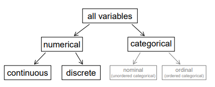
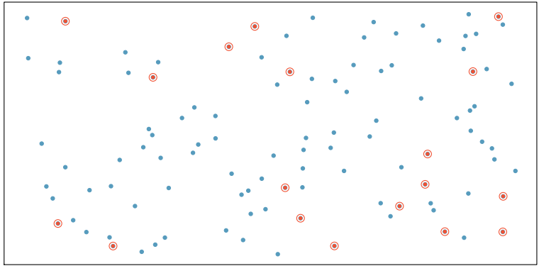
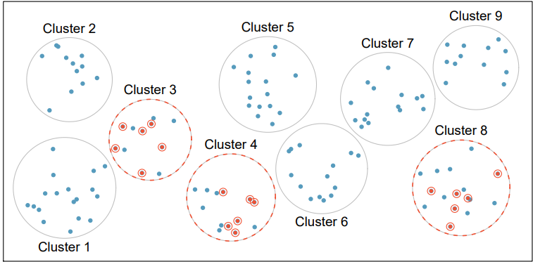
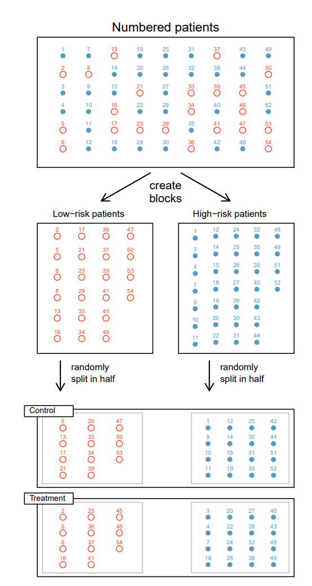

# Introduction to data

## Data Table

### a Row = a case = observational unit

### coulmns = variables

### Description

Variables가 무엇을 의미하는지 설명하는 내용

### Types of variables

- continuous : 연속적인 numerical variables
- Discrete : 양의 정수로 표현되는 numerical variables(검증 필요)
- Nominal : 순서가 정해져 있지 않은 variables
- Ordinal : 자연스럽게 순서가 정해져 있는 variables

### Relationship between variables

- Scatter plot은 두 variables 모두 numerical variables일때 사용 가능하다.

### Associated variables = dependent variables

비교 변수 간 관계(Relationship)가있는 경우 Associated(=dependent) variables라 부른다. 반면 관계가 없는 경우 Independent variables라 부른다.

A,B,C 변수가 있을때 A와 B, A와 C는 dependent variables이고 B와 C는 independent variables 일 수 있다.

### Explanatory and response variables

When we suspect one variable might causally affect another, we label the first variable the **explanatory** variable and the second the **response** variable.

**the explanatory variable ⇒ the response variable**

### Observational studies and experiments

**Observational study**

observational studies can provide evidence of a naturally occurring association between variables, but they cannot by themselves show a causal connection.

⛔ **causation can only be inferred from a randomized experiment.**

# Sampling Principles and strategies

---

### Anecdotal evidence

ex) A man on the news got mercury poisoning from eating swordfish, so the average mercury concentration in swordfish must be dangerously high.

Such evidence may be true and verifiable, but it may only represent extraordinary cases

**Bias**

무응답이 많은 샘플이라면 임의 선택으로 구성된 샘플인지 의심해야한다.

**convenience sample**

쉽게 구할 수 있는 대상으로 샘플을 만들면 샘플이 임의 선택을 통해 형성되었다는 것을 보장받을 수 없다.

### Observational data

treatment group과 control group이 구분되지 않는 데이터를 말한다.

Prospective study - 원하는 데이터를 추적해서 얻는 연구 방법

Retrospective study - 과거 데이터를 활용하는 연구 방법

### confounding variable = assumptions

It is a variable that is correlated with both the explanatory and response variables.

### Four sampling methods

Sampling 방법에 따라 Analysis 방법도 달라진다. 지금 배우고 있는 책에서는 simple sampling 말고는 범위를 벗어난 방법이므로 sampling에 네가지 방법이 있다 정도만 알아두고 넘어가자.

- Simple sampling

  

- Stratified sampling

  strata라고 불리우는 그룹으로 모집단을 구분한뒤 random sampling으로 각 stratum의 요소를 추출한다.

  ex) 야구 선수의 평균 연봉을 계산할 때 startum은 야구 팀에 해당한다. 팀별로 3명의 선수를 random으로 추출하면 stratified sampling이 된다.

  

- Cluster sampling

  

- multistage sampling
  

# Experiments

---

### Experiment

Studies where the researchers **assign treatments to case** are called experiments.

### A randomized experiment

Randomized experuments are fundamentally important when trying to show a causal connection between two variables.

### Principles of experimental design

**Controlling**

**Ranomization**

**Replication**

**Blocking**

- 다른 변수들의 영향력을 차단하기 위해서 실험군을 정할 때 행하는 조치. 제조한 약품이 심장마비에 효과가 있는지 검증할때, 실험대상을 우선 low-risk, high-risk로 구분 한 뒤 low-risk인원 절반과 high-risk 인원 절반을 합쳐서 treatment group과 control group으로 만든다.
  
- 책에서 설명하는 수준을 뛰어넘기 때문에 자세히 다루지 않는다.

### Reducing bias in human experiments

randomized sampling을 하더라도 bias가 모든 경우에 발생하지 않는다고는 말할 수 없다. 인간에 대한 연구가 그렇다.

- blind : 환자 본인이 treatment group인지 control group인지 알 수 없도록 만드는 방법
- double-blind : 환자와 환자를 치료하는 의사 모두 Treatment인지 Control 알 수 없도록 하는 방법
- Sham Surgeries : control group에게 하는 가짜 수술. 실험 대상 본인이 치료를 받았다고 생각할 수 있도록 하는 방법
