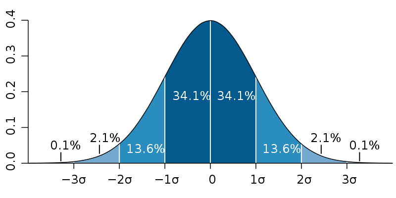
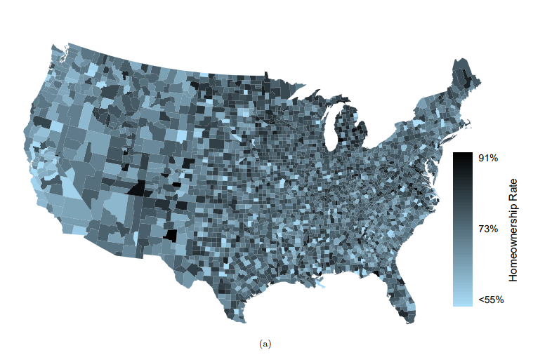
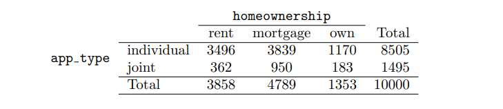
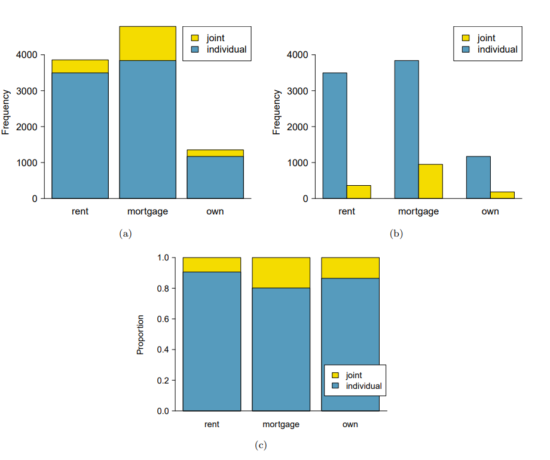

# Summarizing data

# Examining numerical data

---

### Scatterplots for paired data

scatterplot은 numerical attribute 2개를 비교할 때 사용된다.

### Dot plots and the mean

**Dot plots**

A dot plot is a one-variable scatterplot.

- there are two- kinds of dot plots ; dot plot, and a stacked dot plot.
- Dot plots are useful for small data sets, but they can become hard to read with larger samples.

**mean**

평균은 다른 대상과 비교할 때 좋다. 왜냐하면 평균은 단위를 1로 고정시키기 때문이다.

### Histogram and shape

**용어정리**

- bin = 히스토그램에서 bar을 의미함. 데이터 라이브러리에서 histogram을 그릴 때 argumnet로 bins=가 들어가 있음.

- $\bar{x} =$ 표본 평균, $E(\bar{x}) =$ 표본 평균의 평균 , $\mu =$ 모 평균

**Histogram의 용도**

histogram은 값의 분포를 보여준다. 우리가 생각하는 distribution은 모두 histogram이다. bargraph로는 distribution을 설명할 수 없다. Histogram을 사용한다면 데이터 구조가 어떤 모양인지 편리하게 알 수 있다.

**Histogram과 Barplot 차이**

- barplot은 categorical attribute에서 사용되므로 대상의 범위가 정해져 있음. 반면 histogram은 numerical attribute를 사용하므로 사용자가 어떤 기준을 정하는지에 따라 bins의 크기와 모양이 달라진다.

**Histogram의 종류**

modality와 shape를 알면 mean과 std가 같은 그래프를 구분할 수 있다.

- modality
  왼쪽에서부터 unimodal, bimodal, multimodal distribution이라 부른다. numerical attribute는 최빈값을 구하기 어려우므로 modality라는 개념을 활용한다. 그래프 모양을 봤을때 봉우리(peak)이 몇개인지에 따라 불리는 명칭이 구분된다.
  
- shape
  distribution shape이 대칭일 경우 symmetric distribution, 왼쪽이나 오른쪽으로 치우칠 경우 Skewd distribution이라 한다.
  

### Variance and standard deviation

**용어정리**

- deviation : 평균과 값의 차이(거리)
- an observation = a data object = a row

**분산을 구할 때 밑변에 n 대신 n-1을 넣는 이유**

- 이유는 모르겠고 the end result is that doing this makes this statistic slightly more reliable and useful.이라고 한다. 이유가 궁금해지면 나중에 찾아봐야겠다.

**표준편차 의미**

표준편차를 알면 찾고자 하는 대상이 어느 위치에 분포할 확률을 쉽게 알 수 있다.

### Box plots, quartiles, and the median

**Box plot**

- Interquartile(IQR) : std와 같이 표본의 분포를 나타내는 기능을 수행함 (박스가 작다면 분포가 작은 것이고 박스가 크다면 분포가 큰 것으로 이해해야함)
- Whisker : $Q_1 - 1.5*IQR \; | \; Q_3 - 1.5*IQR$

### Robust statistics

The median and IQR are called robust statistics because extreme observations have little effect on their values. mean and std are not robust staticstics as they are affected by their values.

### Transforming data

A transforming is a rescaling of the data using a function.

왼편에 치우처진 x축 데이터를 log를 이횽해 rescaling 하니 보다 데이터를 정확히 해석할 수 있게 됐음. 여기서 outlier를 정리하면 데이터 분석에 더욱 도움 될 것임.

### Mapping data

# Considering categorical data

---

### Contingency tables

**Row proportions**

Row를 모집단으로 생각하고 해석해야한다. 개인 중 렌트 비율, 개인 중 저당 비율과 같이

**Column proportions**

Column을 모집단으로 생각하고 해석해야한다. 렌트 중 개인 비율, 저당 중 개인 비율

Total 합이 어디가 1인지를 보고 row와 column proportion을 구분한다.

### bar plot

this is a common way to display a single categorical variable

- (a) **a stacked bar plot** : It provides a way to visualize the information in contingency tables. It is most useful when it’s reasonable to assign one variable as the explanatory variable and the other variable as the response. 현재 살고있는 집을 어떤 방식으로 사는지(월세, 대출, 소유)에 따라 app-type이 다르다는 것을 알 수 있다.
- (b) **side-by-side bar plot :** It is more easy to understand about which variable represents the explanatory and which the response variable. It is also easy to discern the number of cases in of the six different group combinations
- (c) **standardized stacked bar plot** : 그림 A처럼 x축 개별 요소끼리 절대적인 양이 다르다면 uinque별로 가지고 있는 비율을 확인하기 어렵게 된다. C와 같은 방법이라면 크기에 상관없이 모든 uinque의 비율을 한번에 볼 수 있다. 하지만 장점이 단점도 되긴 하는데 비율을 잘 보여주지만 실제 양은 보여주지 않으므로 해석하는 사람 입장에서는 오해할 여지가 크다.
- **Mosaic plot** : C의 단점을 보완해서 탄생한 plot이 mosaic plot이다. uinque별 비율과 실제 양을 직관적으로 이해할 수 있다.
  

### The only pie chart you will see in this book

파이차트는 별로 효율적이지 못하다고 한다. uinque끼리 비교할 때 bar plot이 훨씬 보기 좋기 때문이라고 함.

### T검정 공부하고 정리할 때 2-3-2 예시 다시 읽고 정리하기

### Variability within data

**random noise**

### 질문

Q. Categorical Attribute끼리 인과관계를 어떻게 해석해야할지 모르겠다.
