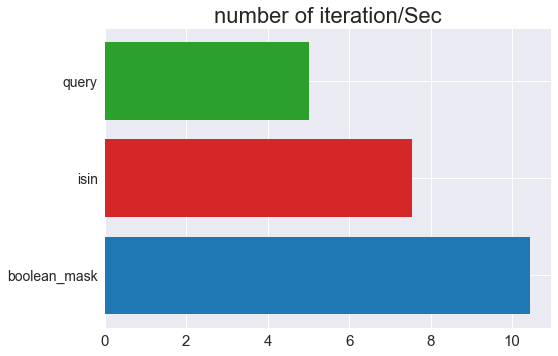

## 방향

이 글은 데이터 분석에서 일상적으로 사용하는 fiter 함수인 query, boolean masking, isin의 성능비교와 상황에 맞는 사용 방법을 설명합니다.

## DataFrame.query()

query 매서드는 유용성 대비 사람들이 많이 사용하지 않는 기능인 것 같습니다. 보통 100,000개 이상 row를 다룰 때 성능이 좋다고 알려져있는데, 사실 성능보다는 어떤 조건으로 필터링을 했는지 직관적으로 알 수 있고, 코드를 간결하게 쓸 수 있는 점에서 유용하게 쓰일 수 있습니다.

<br>

### 장점

**필터링을 단순하게 표현할 수 있습니다.**

```python
import pandas as pd
import numpy as np

# row 100만개, column 3개 df 생성
df = pd.DataFrame(10+60.5*np.random.randn(1000000,3))
df.columns = ['num','num2','num3']
pd.set_option('float_format', '{:f}'.format)

'''
필터링 조건
10 < num < 100
0.5 < num2 < 10
255 < num3 < 50
'''

# query

result = df.query('''
10 < num < 100 &
0.5 < num2 < 10 &
25< num3 < 50
''')

len(result) >>> 3982

# boolean mask

BM = (df['num'] > 10) & (df['num'] < 100)
BM2 = (df['num2'] > 0.5) & (df['num2'] < 10)
BM3 = (df['num3'] > 25) & (df['num3'] < 50)
result = df[BM & BM2 & BM3]

len(result) >>> 3982
```

<br>

**자료 검색용으로 간편합니다.**

```python
# 서울 공공데이터 지하철정보
sub_station = pd.read_csv('\sub_station.csv',encoding='CP949')

sub_station.query('역사명 == "김포공항"')

```

|     | 역사\_ID |   역사명 |          호선 |       경도 |      위도 |
| --: | -------: | -------: | ------------: | ---------: | --------: |
|   2 |     4929 | 김포공항 |  김포골드라인 | 126.801868 | 37.562360 |
|  88 |     4207 | 김포공항 | 공항철도1호선 | 126.801904 | 37.561842 |
| 130 |     4102 | 김포공항 |         9호선 | 126.802152 | 37.561916 |
| 352 |     2513 | 김포공항 |         5호선 | 126.801292 | 37.562384 |

<br>

**한번에 여러 values를 검색할 수 있습니다.**

다음 장에 소개할 Boolean masking은 하나의 조건문에 하나의 value만 검색 가능합니다. 만약 여러 조건을 걸 경우 코드가 끝도 없이 길어질 수 있습니다. 반면 query는 value를 list나 array 등으로 묶어주기만 하면 간단하게 검색할 수 있습니다.

```python
    #찾고자 하는 역 명
    stations = ['김포공항', '신논현']

    # @를 붙이면 변수 취급
    sub_station.query('역사명 == @stations').sort_values(by='역사명',ascending=False)
```

|     | 역사\_ID |   역사명 |          호선 |       경도 |      위도 |
| --: | -------: | -------: | ------------: | ---------: | --------: |
| 107 |     4125 |   신논현 |         9호선 | 127.025060 | 37.504598 |
|   2 |     4929 | 김포공항 |  김포골드라인 | 126.801868 | 37.562360 |
|  88 |     4207 | 김포공항 | 공항철도1호선 | 126.801904 | 37.561842 |
| 130 |     4102 | 김포공항 |         9호선 | 126.802152 | 37.561916 |
| 352 |     2513 | 김포공항 |         5호선 | 126.801292 | 37.562384 |

<br><br>

### 단점

**query, boolean masking, isin 중 처리속도가 가장 느립니다.**

처리속도 관련해서는 boolean mask에서 종합적으로 다루도록 하겠습니다.

<br>

**사용 가능한 문법이 제한됩니다.**

사용 가능한 문법 개수가 제한되긴 하나, 필터링이 필요한 대부분 상황은 query 매서드로 해결가능합니다.

query 매서드의 문법이 제한적인 이유는 처리절차 내에 eval() 함수를 사용하기 때문입니다.

query 매서드에서 사용 가능한 문법은 아래와 같습니다.

<br>

**These operations are supported by pandas.eval():**

> - Arithmetic operations except for the left shift (`<<`) and right shift (`>>`) operators, e.g., `df + 2 * pi / s ** 4 % 42 - the_golden_ratio`
>
> - Comparison operations, including chained comparisons, e.g., `2 < df < df2`
> - Boolean operations, e.g., `df < df2 and df3 < df4 or not df_bool`
> - `list` and `tuple` literals, e.g., `[1, 2]` or `(1, 2)`
> - Attribute access, e.g., `df.a`
> - Subscript expressions, e.g., `df[0]`
> - Simple variable evaluation, e.g., `pd.eval("df")` (this is not very useful)
> - Math functions: `sin`, `cos`, `exp`, `log`, `expm1`, `log1p`, `sqrt`, `sinh`, `cosh`, `tanh`, `arcsin`, `arccos`, `arctan`, `arccosh`, `arcsinh`, `arctanh`, `abs`, `arctan2` and `log10`.

<br>

**This Python syntax is `not` allowed:**

> Expressions
>
> - Function calls other than math functions.
>
> - `is/is not` operations
>
> - `if` expressionslambda expressions
>
> - `list/set/dict`comprehensions
>
> - Literal `dict` and `set` expressions
>
> - `yield` expressions
>
> Generator expressions
>
> - Boolean expressions consisting of only scalar values
>
> - Statements
>
> - Neither simple nor compound statements are allowed.
>
> - This includes things like `for, while, and if`.

출처 : [Pandas 공식홈페이지](https://pandas.pydata.org/docs/user_guide/enhancingperf.html#supported-syntax)

<br><br><br><br>

## boolean masking

filtering 방법으로 가장 먼저 배우는 매서드 입니다. 처리속도가 가장 빠르다는 장점이 있지만 다수의 필터링을 필요로 하는 작업에서 코드 가독성이 떨어지고, 불필요한 코드 작성이 많아 단점 또한 뚜렷한 매서드입니다.

### 장점

**처리속도가 빠릅니다.**

아래 그래프는 row가 1200만개인 데이터를 필터링을 반복적으로 300회 수행한 결과입니다. x축 단위는 초당 loop를 처리한 횟수입니다.

boolean masking은 초당 10회의 loop를 수행한 반면 query는 초당 5회 밖에 수행하지 못했습니다.

성능이 필요한 작업에서는 세 종류의 매서드 중 boolean_masking을 사용해야합니다.

<br>



<br><br>

### 단점

**한 번에 여러 개의 필터링을 할 수 없습니다.**

query나 isin 여러 종류의 필터링을 하나의 구문으로 처리할 수 있습니다. 반면 boolean masking은 filter 별로 일일히 변수를 만들어야하는 불편함이 있습니다.

조건을 자주 바꿔서 데이터를 탐색해야 하는 경우 일일히 column명, instance 명을 적고 masking을 씌우는 작업을 반복해야 하므로 코드 작성에 불필요한 에너지를 사용하게 됩니다.

```python
  # boolean mask
  BM1 = sub_station['역사명'] == '김포공항'
  BM2 = sub_station['역사명'] == '신논현'
  BM3 = sub_station['역사명'] == '여의도'
  BM4 = sub_station['역사명'] == '여의나루'
  BM5 = sub_station['역사명'] == '샛강'

  sub_station[BM1 | BM2 | BM3 | BM4 | BM5].sort_values(by='역사명',ascending=False)
```

<br><br> <br><br>

## Dataframe.isin(list())

isin 매서드는 boolean masking 방식과 마찬가지로 boolean 결과로 필터링을 수행합니다. 대신 isin은 여러 개의 instance를 한 번에 찾을 수 있습니다.

### 장점

**빠른속도로 여러 value를 한 번에 처리할 수 있다.**

isin의 처리속도는 query와 boolean mask의 중간 위치에 있습니다. 대신 boolean의 단점을 보완하며 query보다 처리 속도가 빠릅니다.

```python
  stations = ['김포공항', '신논현','여의도','여의나루']

  # isin은 list type을 변수로 받습니다.
  BM = sub_station['역사명'].isin(stations)
  sub_station[BM].sort_values(by='역사명',ascending=False)

```

|     | 역사\_ID |   역사명 |          호선 |       경도 |      위도 |
| --: | -------: | -------: | ------------: | ---------: | --------: |
| 117 |     4115 |   여의도 |         9호선 | 126.924030 | 37.521760 |
| 338 |     2527 |   여의도 |         5호선 | 126.924357 | 37.521747 |
| 337 |     2528 | 여의나루 |         5호선 | 126.932901 | 37.527098 |
| 107 |     4125 |   신논현 |         9호선 | 127.025060 | 37.504598 |
|   2 |     4929 | 김포공항 |  김포골드라인 | 126.801868 | 37.562360 |
|  88 |     4207 | 김포공항 | 공항철도1호선 | 126.801904 | 37.561842 |
| 130 |     4102 | 김포공항 |         9호선 | 126.802152 | 37.561916 |
| 352 |     2513 | 김포공항 |         5호선 | 126.801292 | 37.562384 |

<br><br>

### 단점

- **query에 비해 가독성이 떨어집니다.**
  isin 역시 boolean mask와 마찬가지로 필터링이 직관적이지 않다는 단점이 있습니다. 그래도 변수를 줄이는 장점이 있어서 boolean mask보다는 상대적 가독성이 좋다고 할 수 있습니다.
  <br><br><br><br>

## 정리

- 데이터 탐색 시 query 매서드 추천

- query로 구현할 수 없는 조건 또는 반복문과 함께 사용해야할 경우 isin 또는 boolean masking 중 선택

- 필터 조건이 2개 이상일 경우 isin을 추천, 빠른속도가 필요하거나 하나의 조건인 경우엔 boolean mask 추천

<br>

<div align="center">

|       함수       | 반복문 x | 반복문 0, 값 =1 | 반복문 0 , 값 > 1 |
| :--------------: | :------: | :-------------: | :---------------: |
|    **query**     |    O     |                 |         △         |
| **boolean_mask** |          |        O        |                   |
|     **isin**     |          |                 |         O         |

</div>
