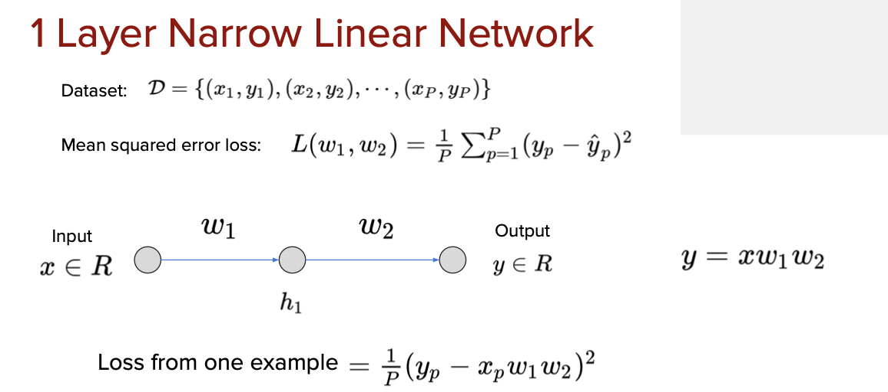
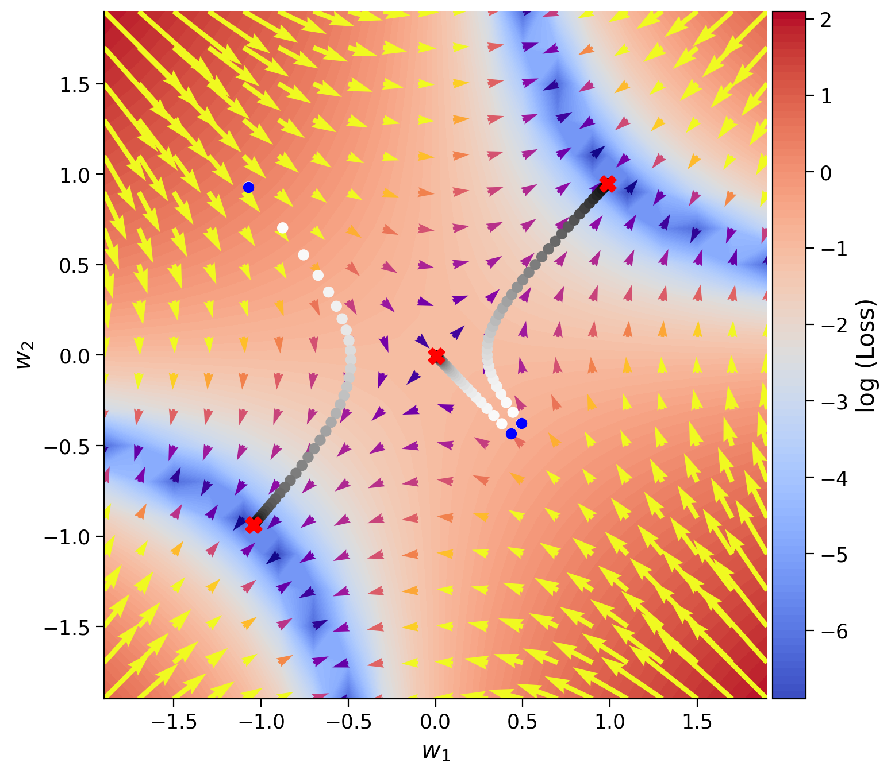

### A Shallow Narrow Linear Net

- 딥러닝 모델의 구조를 이해하기 위해서 linear 모델을 활용해 딥네트워크 구조를 만들었음.

- 해당 딥러닝 모델의 함수는 $y = xw_1w_2$ 임.

- Gradient Descent를 가지고 Loss function을 최소화하는 $w_1$과 $w_2$를 찾아야함
  

```python
# Imports
import torch
import numpy as np
from torch import nn
from math import pi
import matplotlib.pyplot as plt

import random
import torch

def set_seed(seed=None, seed_torch=True):
  """
  Function that controls randomness. NumPy and random modules must be imported.

  Args:
    seed : Integer
      A non-negative integer that defines the random state. Default is `None`.
    seed_torch : Boolean
      If `True` sets the random seed for pytorch tensors, so pytorch module
      must be imported. Default is `True`.

  Returns:
    Nothing.
  """
  if seed is None:
    seed = np.random.choice(2 ** 32)
  random.seed(seed)
  np.random.seed(seed)
  if seed_torch:
    torch.manual_seed(seed)
    torch.cuda.manual_seed_all(seed)
    torch.cuda.manual_seed(seed)
    torch.backends.cudnn.benchmark = False
    torch.backends.cudnn.deterministic = True

  print(f'Random seed {seed} has been set.')


# In case that `DataLoader` is used
def seed_worker(worker_id):
  """
  DataLoader will reseed workers following randomness in
  multi-process data loading algorithm.

  Args:
    worker_id: integer
      ID of subprocess to seed. 0 means that
      the data will be loaded in the main process
      Refer: https://pytorch.org/docs/stable/data.html#data-loading-randomness for more details

  Returns:
    Nothing
  """
  worker_seed = torch.initial_seed() % 2**32
  np.random.seed(worker_seed)
  random.seed(worker_seed)
```

```python
SEED = 2021
set_seed(seed=SEED)
DEVICE = 'mps'
```

    Random seed 2021 has been set.

### Gradient Descent를 수행하기 위해 Computational Graph 그리기

- $loss = (y - w_1 \cdot w_2 \cdot x)^2$


```python
def gen_samples(n, a, sigma):
  """
  Generates n samples with
  `y = z * x + noise(sigma)` linear relation.

  Args:
    n : int
      Number of datapoints within sample
    a : float
      Offset of x
    sigma : float
      Standard deviation of distribution

  Returns:
    x : np.array
      if sigma > 0, x = random values
      else, x = evenly spaced numbers over a specified interval.
    y : np.array
      y = z * x + noise(sigma)
  """
  assert n > 0
  assert sigma >= 0

  if sigma > 0:
    x = np.random.rand(n)
    noise = np.random.normal(scale=sigma, size=(n))
    y = a * x + noise
  else:
    x = np.linspace(0.0, 1.0, n, endpoint=True)
    y = a * x
  return x, y


class shallowNarrow :

    # 임의로 w1과 w2를 지정
    def __init__(self, init_weights) -> None:
        assert isinstance(init_weights, (list, np.ndarray, tuple))
        assert len(init_weights) == 2
        self.w1 = init_weights[0]
        self.w2 = init_weights[1]

    #w1,w2 값에 따른 y값 계산
    def forward(self,x) :
        y = self.w1*self.w2*x
        return y

    # gradient descent를 위한 계산
    def dloss_dw(self,x,y_true) :
        dloss_dw1 = -(2*self.w2*x*(y_true-self.w1*self.w2*x)).mean()
        dloss_dw2 = -(2*self.w1*x*(y_true-self.w1*self.w2*x)).mean()
        return dloss_dw1,dloss_dw2

    # loss(cost) function 식
    def loss(self, y_p, y_t):
        mse = ((y_t - y_p)**2).mean()
        return mse


    # 훈련시키기
    def train(self,x,y_true,lr,n_ep):
        loss_records = np.empty(n_ep)  # Pre allocation of loss records
        weight_records = np.empty((n_ep, 2))  # Pre allocation of weight records

        for i in range(n_ep):
            y_prediction = self.forward(x) # y값 계산
            loss_records[i] = self.loss(y_prediction, y_true) # loss function 계산
            dloss_dw1, dloss_dw2 = self.dloss_dw(x, y_true) # w1,w2 계산을 위한 값
            self.w1 -= lr*dloss_dw1 # 새로운 w1
            self.w2 -= lr*dloss_dw2 # 새로운 w2
            weight_records[i] = [self.w1, self.w2]
        return loss_records,weight_records

set_seed(seed=SEED)
n_epochs = 211
learning_rate = 0.02
initial_weights = [1.4, -1.6]
x_train, y_train = gen_samples(n=73, a=2.0, sigma=0.2)
x_eval = np.linspace(0.0, 1.0, 37, endpoint=True)
# Uncomment to run
sn_model = shallowNarrow(initial_weights)
loss_log, weight_log = sn_model.train(x_train, y_train, learning_rate, n_epochs)
y_eval = sn_model.forward(x_eval)
# plot_x_y_(x_train, y_train, x_eval, y_eval, loss_log, weight_log)
```

    Random seed 2021 has been set.

### Section 1.2: Gradient Descent 시각화하기

- **Blue ribbon**: shows all possible solutions:

- **Contour background**: Shows the loss values, red being higher loss

- **Vector field (arrows)**: shows the gradient vector field. The larger yellow arrows show larger gradients, which correspond to bigger steps by gradient descent.

- **Scatter circles**: the trajectory (evolution) of weights during training for three different initializations, with blue dots marking the start of training and red crosses ( x ) marking the end of training

### Saddle Point를 조심하자. Saddle Point는 w이 모두 0인 경우를 가리킨다. 그럼 훈련이 안된다. 그림 정가운데 이동 선이 saddle point이다.


