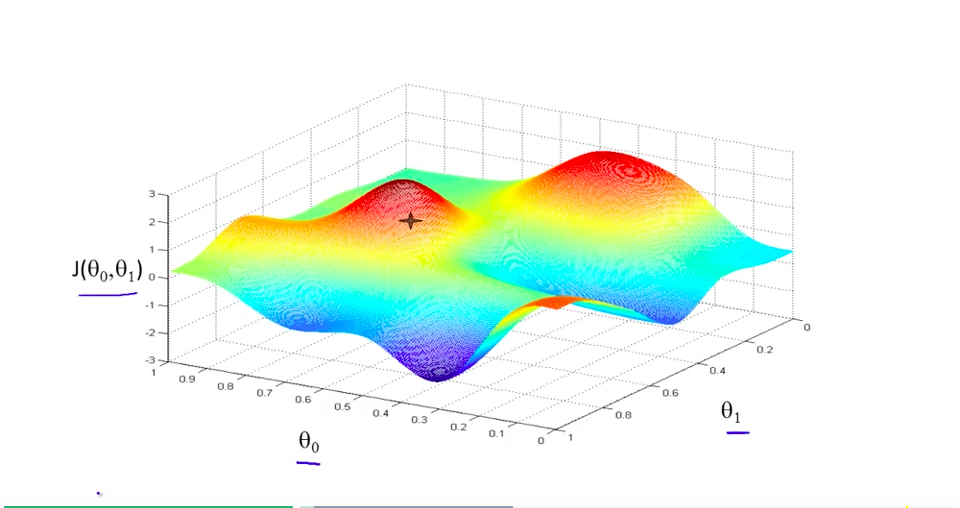

```python
# Imports
import torch
import numpy as np
from torch import nn
from math import pi
import matplotlib.pyplot as plt

import random
import torch

def set_seed(seed=None, seed_torch=True):
  """
  Function that controls randomness. NumPy and random modules must be imported.

  Args:
    seed : Integer
      A non-negative integer that defines the random state. Default is `None`.
    seed_torch : Boolean
      If `True` sets the random seed for pytorch tensors, so pytorch module
      must be imported. Default is `True`.

  Returns:
    Nothing.
  """
  if seed is None:
    seed = np.random.choice(2 ** 32)
  random.seed(seed)
  np.random.seed(seed)
  if seed_torch:
    torch.manual_seed(seed)
    torch.cuda.manual_seed_all(seed)
    torch.cuda.manual_seed(seed)
    torch.backends.cudnn.benchmark = False
    torch.backends.cudnn.deterministic = True

  print(f'Random seed {seed} has been set.')


# In case that `DataLoader` is used
def seed_worker(worker_id):
  """
  DataLoader will reseed workers following randomness in
  multi-process data loading algorithm.

  Args:
    worker_id: integer
      ID of subprocess to seed. 0 means that
      the data will be loaded in the main process
      Refer: https://pytorch.org/docs/stable/data.html#data-loading-randomness for more details

  Returns:
    Nothing
  """
  worker_seed = torch.initial_seed() % 2**32
  np.random.seed(worker_seed)
  random.seed(worker_seed)
```

```python
SEED = 2021
set_seed(seed=SEED)
DEVICE = 'mps'
```

    Random seed 2021 has been set.

## Section 1: Gradient Descent Algorithm

the goal of learning algorithms = minimizing the risk function

> risk = cost = loss

gradient descent = powerful optimization methods

Neural Network function = $y=f_w(x)$

> tuning 가능한 w를 포함한 함수

A loss function = $L=∂(y,data)$

> nn의 출력값(y)과 결과값(data)을 비교

Optimization problem : $w^* = argmin_w∂(f_w(x),data)$

> 최적의 w값은 loss_function의 최솟값인 경우를 말함. 위 두 함수를 합친 것

### 특정 function의 Gradient는 항상 가장 가파른 상승 방향을 지목한다고 한다..

**특정 function의 Gradient vector 찾기(공식 유도)**

- 예시
  $\begin{equation}
z = h(x, y) = \sin(x^2 + y^2)
\end{equation}$

- gradient vector 찾기
  $\begin{equation}
  \begin{bmatrix}
  \dfrac{\partial z}{\partial x} \\ \\ \dfrac{\partial z}{\partial y}
  \end{bmatrix}
\end{equation}$

**Chain Rule 이해하기**

- 기본 룰
  $\begin{equation}F(x) = g(h(x)) \equiv (g \circ h)(x)\end{equation}$

- 미분 할 경우
  $\begin{equation}
F'(x) = g'(h(x)) \cdot h'(x)
\end{equation}$

- 결과
  

**간략한 gradient descent의 역사**

In 1847, Augustin-Louis Cauchy used negative of gradients to develop the Gradient Descent algorithm as an iterative method to minimize a continuous and (ideally) differentiable function of many variables.

<br>

### 최종 결론 : gradient는 최고 높은 위치를 선택하는 방식인거고 그 gradient를 negative 한 식이 gradient descent이다.

### Gradient Descent 그래프 이해하기



- gradient를 사용하지 않으면 위 그림과 같이 $\theta_0$ 와 $\theta_1$를 격자로 생성해서 loss를 하나하나 구해야함.

- 이런식으로 일일이 구한 뒤 최소의 loss 값을 나타내는 $\theta_0$ 와 $\theta_1$를 찾는 것은 매우 비효율 적임

<br/>


- gradient라는 개념 자체가 매 연산 다음 단계 중 최적의 방향을 미리 알려줌

- 따라서 검은색 선과 같이, 가장 효율적인 값을 찾아가는 과정을 수행하는 gradient descent를 사용해야함.

## Section 1.2: Gradient Descent Algorithm

$\begin{equation}
\mathbf{w}^{(t+1)} = \mathbf{w}^{(t)} - \eta \nabla f \left( \mathbf{w}^{(t)} \right)
\end{equation}$

- $\eta$ = learning Rate

$\nabla f (\mathbf{w})= \left( \frac{\partial f(\mathbf{w})}{\partial w_1}, ..., \frac{\partial f(\mathbf{w})}{\partial w_d} \right)$ 을 알면 다음 w 값을 계산할 수 있다.

### 결론

Since negative gradients always point locally in the direction of steepest descent, the algorithm makes small steps at each point towards the minimum.

### 최적의 해를 구하는 것을 psudo code로 표현하면??

> Inputs: initial guess 𝐰(0), step size 𝜂>0, number of steps 𝑇.

> For 𝑡=0,1,2,…,𝑇−1 do
>
> &nbsp; **𝐰(𝑡+1)=𝐰(𝑡)−𝜂∇𝑓(𝐰(𝑡))**
>
> end

> Return: 𝐰(𝑡+1)

**Computational Graph를 활용해 $\nabla f (\mathbf{w})$ 구해보기**

**예시 함수**

$\begin{equation}
f(x, y, z) = \tanh \left(\ln \left[1 + z \frac{2x}{sin(y)} \right] \right)
\end{equation}$

**$\nabla f (\mathbf{w})$ 를 구하는 방법**

$\begin{equation}
\dfrac{\partial Loss}{\partial \mathbf{w}} = \left[ \dfrac{\partial Loss}{\partial w_1}, \dfrac{\partial Loss}{\partial w_2} , \dots, \dfrac{\partial Loss}{\partial w_d} \right]^{\top}
\end{equation}$

<br/>

- 우리가 구하고자 하는 값들(1~d) : $\dfrac{\partial Loss}{\partial w_d}$

- $\dfrac{\partial Loss}{\partial w_d}$을 하나씩 구해보자.

### Computational Graph(forward) - 원래 개념

- 위 공식의 계산 과정을 하나하나 뜯어내 도식화 하였음

- x,y,z를 대입해 $f$를 출력 함

  

<br/>

### Computational Graph(backward) - 델타 값 구하기 위해 응용

- $f$ 값을 가지고 $\dfrac{\partial f}{\partial x}$, $\dfrac{\partial f}{\partial y}$, $\dfrac{\partial f}{\partial z}$ 값을 출력함

- 파란색 네모 박스는 미분한 값

  

### 결론

$\begin{equation}
\dfrac{\partial f}{\partial x} = \dfrac{\partial f}{\partial e}~\dfrac{\partial e}{\partial d}~\dfrac{\partial d}{\partial c}~\dfrac{\partial c}{\partial a}~\dfrac{\partial a}{\partial x} = \left( 1-\tanh^2(e) \right) \cdot \frac{1}{d+1}\cdot z \cdot \frac{1}{b} \cdot 2
\end{equation}$
