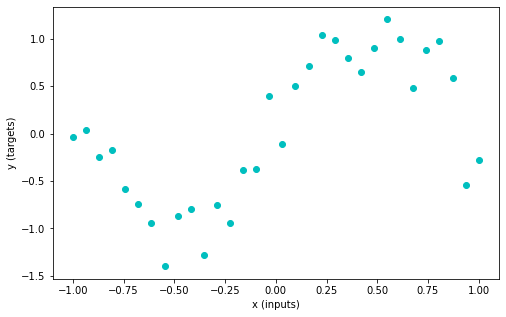
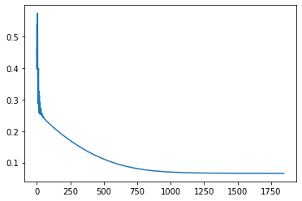

### Section 3.1: Training loop in PyTorch

- torch.nn 레이어를 사용하면 w,b는 이미 `requires_grad`에 들어가고 model parameter로 자동으로 등록된다.

- Model Parameter : .parameters() 매서드를 사용하면 파악할 수 있다.

- Optimizer : Optimization function을 의미, .step() 매서드를 사용하면 연산된 gradient를 업데이트 한다.

**You can run the cell multiple times and see how the parameters are being updated and the loss is reducing**

```python
# Imports
import torch
import numpy as np
from torch import nn
from math import pi
import matplotlib.pyplot as plt

import random
import torch

def set_seed(seed=None, seed_torch=True):
  """
  Function that controls randomness. NumPy and random modules must be imported.

  Args:
    seed : Integer
      A non-negative integer that defines the random state. Default is `None`.
    seed_torch : Boolean
      If `True` sets the random seed for pytorch tensors, so pytorch module
      must be imported. Default is `True`.

  Returns:
    Nothing.
  """
  if seed is None:
    seed = np.random.choice(2 ** 32)
  random.seed(seed)
  np.random.seed(seed)
  if seed_torch:
    torch.manual_seed(seed)
    torch.cuda.manual_seed_all(seed)
    torch.cuda.manual_seed(seed)
    torch.backends.cudnn.benchmark = False
    torch.backends.cudnn.deterministic = True

  print(f'Random seed {seed} has been set.')


# In case that `DataLoader` is used
def seed_worker(worker_id):
  """
  DataLoader will reseed workers following randomness in
  multi-process data loading algorithm.

  Args:
    worker_id: integer
      ID of subprocess to seed. 0 means that
      the data will be loaded in the main process
      Refer: https://pytorch.org/docs/stable/data.html#data-loading-randomness for more details

  Returns:
    Nothing
  """
  worker_seed = torch.initial_seed() % 2**32
  np.random.seed(worker_seed)
  random.seed(worker_seed)
```

```python
SEED = 2021
set_seed(seed=SEED)
DEVICE = 'mps'
```

    Random seed 2021 has been set.

```python
set_seed(seed=SEED)
n_samples = 32
inputs = torch.linspace(-1.0, 1.0, n_samples).reshape(n_samples, 1)
noise = torch.randn(n_samples, 1) / 4
targets = torch.sin(pi * inputs) + noise
plt.figure(figsize=(8, 5))
plt.scatter(inputs, targets, c='c')
plt.xlabel('x (inputs)')
plt.ylabel('y (targets)')
plt.show()
```

    Random seed 2021 has been set.



```python
# Deep Learning 함수 정의
class WideNet(nn.Module) :

    def __init__(self) :
        n_cells = 512
        super().__init__()
        self.layers = nn.Sequential(
            nn.Linear(1,n_cells), # 1 to n_cells,
            nn.Tanh(),
            nn.Linear(n_cells,1) # n_cells to 1
        )

    def forward(self, x : torch.Tensor ) :
        return self.layers(x)
```

```python
# Creating an instance
set_seed(seed=SEED)
wide_net = WideNet()
print(wide_net)
```

    Random seed 2021 has been set.
    WideNet(
      (layers): Sequential(
        (0): Linear(in_features=1, out_features=512, bias=True)
        (1): Tanh()
        (2): Linear(in_features=512, out_features=1, bias=True)
      )
    )

```python
loss_function = nn.MSELoss()

lr = 0.003

# wide_net.parameters를 사용하는 이유
# torch.nn 레이어를 사용하면 w,b는 이미 `requires_grad`에 들어가고 model parameter로 자동으로 등록된다.
sgd_optimizer = torch.optim.SGD(wide_net.parameters(), lr = lr,momentum=0.9)
```

```python
# x값, y값 정의
inputs = torch.linspace(-1.0, 1.0, n_samples).reshape(n_samples, 1)
noise = torch.randn(n_samples, 1) / 4
targets = torch.sin(pi * inputs) + noise

sgd_optimizer.zero_grad()

predcition = wide_net(inputs)

loss = loss_function(predcition,targets)
print(f'loss: {loss.item()}')

loss.backward()

sgd_optimizer.step()
```

    loss: 0.9112946391105652

```python
def train(features, labels, model, loss_fun, optimizer, n_epochs):
  """
  Training function
  Args:
    features: torch.Tensor
      Features (input) with shape torch.Size([n_samples, 1])
    labels: torch.Tensor
      Labels (targets) with shape torch.Size([n_samples, 1])
    model: torch nn.Module
      The neural network
    loss_fun: function
      Loss function
    optimizer: function
      Optimizer
    n_epochs: int
      Number of training iterations
  Returns:
    loss_record: list
      Record (evolution) of training losses
  """
  loss_record = []  # Keeping recods of loss

  for i in range(n_epochs):
    optimizer.zero_grad()  # Set gradients to 0
    predictions = model(features)  # Compute model prediction (output)
    loss = loss_fun(predictions, labels)  # Compute the loss
    loss.backward()  # Compute gradients (backward pass)
    optimizer.step()  # Update parameters (optimizer takes a step)

    loss_record.append(loss.item())
  return loss_record

# Add event to airtable


set_seed(seed=2021)
epochs = 1847 # Cauchy, Exercices d'analyse et de physique mathematique (1847)
## Uncomment to run
losses = train(inputs, targets, wide_net, loss_function, sgd_optimizer, epochs)
plt.plot(losses)
```

    Random seed 2021 has been set.


    [<matplotlib.lines.Line2D at 0x123ccb0d0>]


