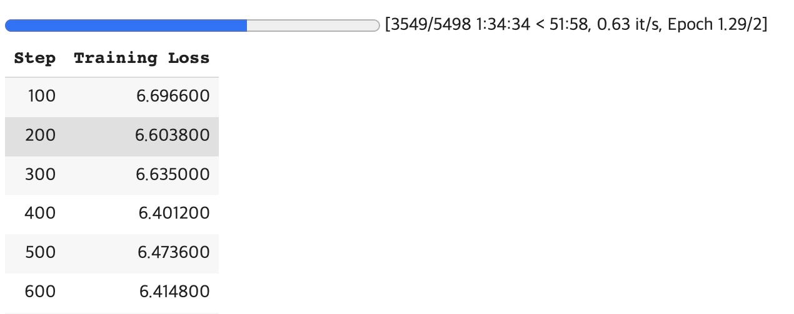

### 들어가며

이 글은 ELECTRA를 🤗 Transformers를 활용해 Domain Adaptation하는 방법에 대해 설명합니다. 이외에도 🤗 Transformers 개념과 Trainer, Dataset 등 기본적인 사용법 또한 포함하고 있으므로 🤗 Transformers에 대해 궁금한 경우에도 이 글을 참고하실 수 있습니다.

- Domain Adaptation 개념을 알고싶다면 [[NLP] Further Pre-training 및 Fine-tuning 정리](https://yangoos57.github.io/blog/DeepLearning/paper/Finetuning/Finetuning)를 참고바랍니다.

- ELECTRA 학습 구조는 [lucidrains의 electra-pytorch](https://github.com/lucidrains/electra-pytorch) 코드를 참고했으며, 🤗 Transformers로 구현하기 위해 일부 코드를 수정하였습니다.

- ELECTRA Base 모델은 monologg님의 `koelectra-v-base`모델을 활용하였습니다.

- ELECTRA 모델 학습에 대한 Jupyter Notebook은 [링크](https://github.com/yangoos57/Electra_for_Domain_Adaptation/blob/main/%5Btutorial%5D%20domain%20adaptation.ipynb)를 참고해주세요.

### 왜 ELECTRA인가?

ELECTRA는 Masked Language Model(MLM)의 비효율적인 학습 방법에 새로운 대안을 제시하는 모델입니다. ELECTRA의 학습 방법인 replaced token detection(RTD)은 동일 환경, 동일 시간 대비 MLM 보다 더 좋은 학습 성능을 보장합니다. 이는 동일한 성능을 내기위해 RTD가 Masked Language Model(MLM)에 비해 더 적은 컴퓨팅 리소스를 필요로 한다는 의미이므로 ELECTRA는 학습의 효율성 측면에서 최적화를 이뤄낸 모델이라 할 수 있습니다.

ELECTRA를 소개하는 논문에서는 MLM 모델이 비효율적인 이유에 대해 문장의 15%만이 학습에 활용하기 때문이라 지적합니다. MLM 모델은 [Mask]된 토큰을 예측하는 과정에서 학습을 진행하는데, 문장의 약 15% 토큰이 임의로 선택 된 뒤 전환되므로 [Mask] 되지 않은 나머지 85% 문장은 학습을 하지 않게 되어 비효율이 발생한다는 것입니다.

이러한 비효율을 개선하고자 등장한 방법을 적용한 모델이 ELECTRA이며, 비효율을 개선하는 방법을 replaced token detection(RTD)라 부릅니다. RTD는 아래와 절차로 진행됩니다.

- Generator 모델에서 문장 토큰 중 약 15%를 바꿔 가짜 문장을 만듭니다. 이때 Generator는 기존 MLM 학습 방법대로 학습을 수행합니다. Generator가 학습을 수행하는 이유는 더 나은 가짜 문장을 만들기 위함입니다.

- Discriminator는 모든 문장에 대해 진짜 토큰인지, 가짜 토큰인지 구별하는 과정에서 학습을 수행합니다. 이러한 학습 방법은 모든 문장을 검증해야하므로 MLM과 비교했을 때 동일한 문장 대비 더 많은 학습이 이뤄지게 됩니다. 그렇기 때문에 같은 양의 데이터, 크기라 할지라도 더 빠른 성능 향상이 가능한 것입니다.

- 학습을 완료했다면 Generator는 사용하지 않고 Discriminator를 기본 모델로 활용합니다.

### Domain Adaptation 이해하기

Domain Adaptation은 Pre-trained 모델을 특정 분야(Domain)에 적합한 모델로 개선하기 위한 과정을 의미합니다. Domain Adaptation은 종종 Further Pre-training이라는 용어로도 사용되곤 하는데, 이는 Domain Adaptation을 수행하는 방법이 Pre-trained Model을 학습하는 방법과 동일하므로 Pre-training을 지속한다는 의미를 나타내기 위해 사용합니다.

Domain Adaptation의 유의어가 Further Pre-training이라는 점에서 알 수 있듯, Domain Adaptation을 구현함으로서 Pre-training이 진행되는 과정을 이해할 수 있습니다. 따라서 이 글은 ELECTRA에 대해 Domain Adaptation을 수행하는 방법을 설명하지만 사용자에 필요에 따라선 이 방법을 Pre-training을 위해 적용해 새로운 모델을 만들 수도 있습니다.

> Domain Adaptation에 대한 추가 설명이 필요한 경우 [[NLP] Domain Adaptation과 Finetuning 개념 정리](https://yangoos57.github.io/blog/DeepLearning/paper/Finetuning/Finetuning/)을 참고해주세요.

<br/>

## ELECTRA 학습 구조 제작하기

앞서 ELECTRA 모델은 RTD 방법을 적용한 모델을 의미하며 RTD는 Generator가 만든 가짜 문장을 Discriminator가 진위여부를 판별하는 과정에서 학습하는 방법이라 설명했습니다. 이제는 RTD 구현에 필요한 Generator와 Discriminator를 🤗 Transformers로 불러오는 방법과 RTD를 구현하는 방법에 대해서 설명하도록 하겠습니다.

### 🤗 Transformers로 Generator, Discriminator 불러오기

🤗 Transformers로 Generator, Discriminator를 만들기 전에 🤗 Transformers이 어떻게 활용되는지에 대해 간단히 설명하도록 하겠습니다.

🤗 Transformers의 장점은 수행해야 하는 Task에 적합한 구조를 쉽게 불러올 수 있는 것에 있습니다. 🤗 Transformers에서 불러올 수 있는 구조는 Bert의 경우 `MaskedLM`, `SequenceClassification`, `MultipleChoice`, `TokenClassification`, `QuestionAnswering` 이 있습니다.(언어 모델별로 불러올 수 있는 구조는 상이합니다.) 이러한 구조들은 `BaseModel`을 기반으로 하되 출력 상단(output-Layer) 구조를 변경하는 방법으로 구성되어 있습니다. 만약 기존에 만들어진 Layer를 사용하지 않고 직접 Layer를 구성해야한다면 필요한 Layer를 생성한 뒤 BaseModel을 불러와 연결하는 방법을 사용할 수 있습니다.


<br/>
<br/>
<br/>

이렇게 출력 상단 구조가 다양한 이유는 Task 별로 필요한 Output 형태가 다르기 때문입니다. 예로들어 MaskedLM 구조의 경우 input data에 존재하는 [MASK]에 들어갈 단어들의 순위를 Output으로 출력해야합니다. 반면 Sequence Classification은 문장 유형을 분류하거나 확률을 예측해야하는 구조에서 활용해야 하므로 0~1 범위의 값(Regression 모델), 또는 정수값(Classification 모델)의 Outuput이 필요할 때 사용합니다.

🤗 Transformer의 기본 구조에 대해 어느정도 파악했으니 우리가 만들어야 하는 모델이 어떠한 구조를 가져야 하는지로 주제를 좁혀보겠습니다. ELECTRA 학습에 필요한 Generator와 Discriminator를 🤗 Transformer에서 불러오기 위해선 `ElectraForMaskedLM`와 `ElectraForPreTraining`를 사용해야 합니다.

`ElectraForMaskedLM`는 Generator가 가짜 문장을 생성하기 위해 필요한 토큰을 생성하는 기능을 제공하며 `ElectraForPreTraining`는 Discriminator가 학습에 필요한 token의 진위여부를 판별할 수 있는 기능을 제공합니다.

```python

from transformers import ElectraForPreTraining, ElectraTokenizer, ElectraForMaskedLM

tokenizer = ElectraTokenizer.from_pretrained("monologg/koelectra-base-v3-generator")

generator = ElectraForMaskedLM.from_pretrained('monologg/koelectra-base-v3-generator')

discriminator = ElectraForPreTraining.from_pretrained("monologg/koelectra-base-v3-discriminator")

```

<br/>
<br/>

#### ❖ ElectraForMaskedLM 구조 살펴보기(Generator)

아래 코드는 🤗 Transformers의 ElectraForMaskedLM Class를 복사한 것입니다. `__init__` 매서드를 ElectraForMaskedLM는 보면 electra 모델을 🤗 Transformers의 ElectraModel 모듈에서 불러와 사용하는 것을 알 수 있습니다.

ElectraModel의 Output은 Encoder 마지막단의 output을 의미하는 'last-hidden-state'을 반환합니다. ElectraModel의 'last-hidden-state'는 generator_predictions layer와 generator_lm_head layer를 거쳐 [MASK] 토큰에 알맞은 토큰을 확률로 나타냅니다.

```python

# Huggingface Transformers 내부 ElectraForMaskedLM 코드

class ElectraForMaskedLM(ElectraPreTrainedModel):
    _keys_to_ignore_on_load_missing = ["generator_lm_head.weight"]

    def __init__(self, config):
        super().__init__(config)

        # ElectraForMaskedLM 내부에서 ElectraModel 모듈을 불러와 사용함.
        self.electra = ElectraModel(config)

        # [Mask] 토큰에 적합한 토큰을 예측하는 generator predictor가 포함되어 있음을 확인할 수 있음.
        self.generator_predictions = ElectraGeneratorPredictions(config)

        self.generator_lm_head = nn.Linear(config.embedding_size, config.vocab_size)

        # Initialize weights and apply final processing
        self.post_init()

    def forward(...) :

            # electra를 통해 마지막 encoder의 output(=last_hidden_state)를 받음.
            generator_hidden_states = self.electra(
                input_ids,
                attention_mask=attention_mask,
                token_type_ids=token_type_ids,
                position_ids=position_ids,
                head_mask=head_mask,
                inputs_embeds=inputs_embeds,
                output_attentions=output_attentions,
                output_hidden_states=output_hidden_states,
                return_dict=return_dict,
            )
            # last_hidden_states를 prediction scores에 input 데이터로 활용함.
            generator_sequence_output = generator_hidden_states[0]

            # last_hidden_states를 MLM prediction layer의 input 데이터로 활용함.
            prediction_scores = self.generator_predictions(generator_sequence_output)
            prediction_scores = self.generator_lm_head(prediction_scores)

    return MaskedLMOutput(
                loss=loss,
                # Prediction_score을 리턴
                # logits의 shape은 (batch_size, src_token_len, vocab_size)
                logits=prediction_scores,
                hidden_states=generator_hidden_states.hidden_states,
                attentions=generator_hidden_states.attentions,
            )

```

<br/>
<br/>

#### ❖ ElectraForPreTraining 구조 살펴보기(Discriminator)

Discriminator가 수행하는 토큰의 진위여부 판별을 수행하는 기능은 `ElectraForPreTraining`이 담당합니다. ElectraForPreTraining의 `__init__` 매서드도 마찬가지로 `ElectraModel` 모듈을 베이스로 하고있으며, 문장 내 개별 token의 진위 여부를 판별하는 classification layer가 연결되어 있음을 확인할 수 있습니다.

이때 Classification Layer는 개별 토큰의 진위여부를 0과 1로 판단하며 output이 1인 경우 모델이 가짜 토큰으로 판별함을 의미합니다.

```python

# Huggingface Transformers 내부 ElectraForPreTraining 코드

class ElectraForPreTraining(ElectraPreTrainedModel):
    def __init__(self, config):
        super().__init__(config)

        # ElectraForPreTraining 내부에서 ElectraModel 모듈을 불러와 사용함.
        self.electra = ElectraModel(config)

        # Token의 진위여부를 판별하는 Precdiction 모델을 불러옴.
        self.discriminator_predictions = ElectraDiscriminatorPredictions(config)

    ....


    def forward(...)
        return_dict = return_dict if return_dict is not None else self.config.use_return_dict

        # electra를 통해 마지막 encoder의 output(=last_hidden_state)를 받음.
        discriminator_hidden_states = self.electra(
            input_ids,
            attention_mask=attention_mask,
            token_type_ids=token_type_ids,
            position_ids=position_ids,
            head_mask=head_mask,
            inputs_embeds=inputs_embeds,
            output_attentions=output_attentions,
            output_hidden_states=output_hidden_states,
            return_dict=return_dict,
        )

        # last_hidden_states를 classification layer의 input 데이터로 활용함.
        discriminator_sequence_output = discriminator_hidden_states[0]

        logits = self.discriminator_predictions(discriminator_sequence_output)

        return ElectraForPreTrainingOutput(
            loss=loss,
            # logits을 리턴
            # logits의 shape은 (batch_size, src_token_len)
            logits=logits,
            hidden_states=discriminator_hidden_states.hidden_states,
            attentions=discriminator_hidden_states.attentions,
        )
```

<br>

#### ❖ 모델을 학습한 다음은?

ELECTRA 학습 구조에 대한 설명을 이어나가기 전에, 학습을 완료한 다음 모델을 사용하는 방법에 대해 우선적으로 설명하겠습니다. 실제 학습을 수행하기도 전에 학습 이후를 소개하는 이유는 앞서 설명한 🤗 Transformer의 구조를 복습 차원에서 다시 한번 설명하기 위함입니다.

지금까지 모델 학습에 필요한 핵심인 Discriminator와 Generator를 불러오는 방법에 대해 배웠습니다. 그리고 이러한 모델들은 Electra Model에 layer가 올라간 구조임을 내부 코드를 통해 이해했습니다. 모델 학습을 완료했다면, Electa Model에 Layer를 연결했던 것과 반대로, 연결된 Layer를 제거해 Electra Model만을 활용해야합니다. 이때 Discriminator만 사용하므로 `ElectraForPreTraining` 내부에 있는 ElectraModel만을 추출해서 사용합니다. 그리고 이렇게 추출한 모델은 수행해야하는 Task에 적합한 Layer에 연결해 Fine-tuning하여 활용하게 됩니다.

```python
discriminator = ElectraForPreTraining.from_pretrained('...')

# Electra Model 추출하기
trained_electra = discriminator.electra
```

<br/>
<br/>

### ELECTRA 학습 구조 설계하기

본격적으로 ELECTRA 학습 구조를 설계하고 모델이 어떠한 방법으로 학습이 진행되는지 살펴보겠습니다. 아래 그림은 ELECTRA 논문에 있는 RTD의 구조를 나타냅니다. 여기서 주의할 점은 아래 도식화는 매우 간단해 보이지만 실제로 구현하는 과정은 생각보다 간단하지 않다는 것입니다. ELECTRA 학습 구조는 크게 3단계로 구분되며 1단계는 input data masking, 2단계는 Generator 학습 및 fake sentence 생성, 3단계는 Discriminator 학습이라 할 수 있습니다. 단계별 설명은 코드 주석을 참고하시기 바랍니다.


<br/>

```python
import math
from functools import reduce
from collections import namedtuple

import torch
from torch import nn
import torch.nn.functional as F

# constants

Results = namedtuple(
    "Results",
    [
        "loss",
        "mlm_loss",
        "disc_loss",
        "gen_acc",
        "disc_acc",
        "disc_labels",
        "disc_predictions",
    ],
)

# 모델 내부에서 활용되는 함수 정의

def log(t, eps=1e-9):
    return torch.log(t + eps)

def gumbel_noise(t):
    noise = torch.zeros_like(t).uniform_(0, 1)
    return -log(-log(noise))

def gumbel_sample(t, temperature=1.0):
    return ((t / temperature) + gumbel_noise(t)).argmax(dim=-1)

def prob_mask_like(t, prob):
    return torch.zeros_like(t).float().uniform_(0, 1) < prob

def mask_with_tokens(t, token_ids):
    init_no_mask = torch.full_like(t, False, dtype=torch.bool)
    mask = reduce(lambda acc, el: acc | (t == el), token_ids, init_no_mask)
    return mask

def get_mask_subset_with_prob(mask, prob):
    batch, seq_len, device = *mask.shape, mask.device
    max_masked = math.ceil(prob * seq_len)

    num_tokens = mask.sum(dim=-1, keepdim=True)
    mask_excess = mask.cumsum(dim=-1) > (num_tokens * prob).ceil()
    mask_excess = mask_excess[:, :max_masked]

    rand = torch.rand((batch, seq_len), device=device).masked_fill(~mask, -1e9)
    _, sampled_indices = rand.topk(max_masked, dim=-1)
    sampled_indices = (sampled_indices + 1).masked_fill_(mask_excess, 0)

    new_mask = torch.zeros((batch, seq_len + 1), device=device)
    new_mask.scatter_(-1, sampled_indices, 1)
    return new_mask[:, 1:].bool()

# main electra class

class Electra(nn.Module):
    def __init__(
        self,
        generator,
        discriminator,
        tokenizer,
        *,
        num_tokens=35000,
        mask_prob=0.15,
        replace_prob=0.85,
        mask_token_id=4,
        pad_token_id=0,
        mask_ignore_token_ids=[2, 3],
        disc_weight=50.0,
        gen_weight=1.0,
        temperature=1.0,
    ):
        super().__init__()

        """
        num_tokens: 모델 vocab_size
        mask_prob: 토큰 중 [MASK] 토큰으로 대체되는 비율
        replace_prop:  토큰 중 [MASK] 토큰으로 대체되는 비율
        mask_token_i: [MASK] Token id
        pad_token_i: [PAD] Token id
        mask_ignore_token_id: [CLS],[SEP] Token id
        disc_weigh: discriminator loss의 Weight 조정을 위한 값
        gen_weigh: generator loss의 Weight 조정을 위한 값
        temperature: gumbel_distribution에 활용되는 arg, 값이 높을수록 모집단 분포와 유사한 sampling 수행
        """

        # Generator, Discriminator, Tokenizer
        self.generator = generator
        self.discriminator = discriminator
        self.tokenizer = tokenizer

        # mlm related probabilities
        self.mask_prob = mask_prob # 0.15
        self.replace_prob = replace_prob # 0.85

        self.num_tokens = num_tokens # 35000

        # token ids
        self.pad_token_id = pad_token_id
        self.mask_token_id = mask_token_id
        self.mask_ignore_token_ids = set([*mask_ignore_token_ids, pad_token_id])

        # sampling temperature
        self.temperature = temperature

        # loss weights
        # Discriminor Weight이 50인 이유는 오차에 대한 Loss가 Generator 보다 작기 때문
        # 따라서 적절한 학습을 수행하기 위해 Weight을 통해 Discriminator와 Generator의 차이를 줄여줌
        self.disc_weight = disc_weight # 50.0
        self.gen_weight = gen_weight # 1.0

    def forward(self, input_ids, **kwargs):

        input = input_ids["input_ids"]

        # ------ 1단계 Input Data Masking --------#

        """
        - Generator는 Bert와 구조도 동일하고 학습하는 방법도 동일함.

        - Generator 학습을 위해선 [Masked] 토큰이 필요하므로 input data를 Masking하는 과정이 필요함.

        """

        replace_prob = prob_mask_like(input, self.replace_prob)

        # do not mask [pad] tokens, or any other tokens in the tokens designated to be excluded ([cls], [sep])
        # also do not include these special tokens in the tokens chosen at random
        no_mask = mask_with_tokens(input, self.mask_ignore_token_ids)
        mask = get_mask_subset_with_prob(~no_mask, self.mask_prob)

        # get mask indices
        mask_indices = torch.nonzero(mask, as_tuple=True)

        # mask input with mask tokens with probability of `replace_prob` (keep tokens the same with probability 1 - replace_prob)
        masked_input = input.clone().detach()

        # set inverse of mask to padding tokens for labels
        gen_labels = input.masked_fill(~mask, self.pad_token_id)

        # clone the mask, for potential modification if random tokens are involved
        # not to be mistakened for the mask above, which is for all tokens, whether not replaced nor replaced with random tokens
        masking_mask = mask.clone()

        # [mask] input
        masked_input = masked_input.masked_fill(
            masking_mask * replace_prob, self.mask_token_id
        )

        # ------ 2단계 Masking 된 문장을 Generator가 학습하고 가짜 Token을 생성 --------#

        """
        - Generator를 학습하여 MLM_loss 계산(combined_loss 계산에 활용)
        - Generator에서 예측한 문장을 Discriminator 학습에 활용
        - ex) 원본 문장 : 특히 안드로이드 플랫폼 기반의 (웹)앱과 (하이)브드리앱에 초점을 맞추고 있다
              가짜 문장 : 특히 안드로이드 플랫폼 기반의 (마이크로)앱과 (이)브드리앱에 초점을 맞추고 있다
        """

        # get generator output and get mlm loss(수정)
        logits = self.generator(masked_input, **kwargs).logits

        mlm_loss = F.cross_entropy(
            logits.transpose(1, 2), gen_labels, ignore_index=self.pad_token_id
        )

        # use mask from before to select logits that need sampling
        sample_logits = logits[mask_indices]

        # sample
        sampled = gumbel_sample(sample_logits, temperature=self.temperature)

        # scatter the sampled values back to the input
        disc_input = input.clone()
        disc_input[mask_indices] = sampled.detach()

        # generate discriminator labels, with replaced as True and original as False
        disc_labels = (input != disc_input).float().detach()

        # ------ 3단계 Token의 진위여부를 Discriminator가 예측하고 이를 학습 --------#

        """
        - 가짜 문장을 학습해 개별 토큰에 대해 진위여부를 판단
        - 진짜 token이라 판단하면 0, 가짜 토큰이라 판단하면 1을 부여
        - 정답과 비교해 disc_loss를 계산(combined_loss 계산에 활용)
        - combined_loss : 학습의 최종 loss임. 모델은 combined_loss의 최솟값을 얻기 위한 방식으로 학습 진행
        """

        # get discriminator predictions of replaced / original
        non_padded_indices = torch.nonzero(input != self.pad_token_id, as_tuple=True)

        # get discriminator output and binary cross entropy loss
        disc_logits = self.discriminator(disc_input, **kwargs).logits
        disc_logits_reshape = disc_logits.reshape_as(disc_labels)

        disc_loss = F.binary_cross_entropy_with_logits(
            disc_logits_reshape[non_padded_indices], disc_labels[non_padded_indices]
        )

        combined_loss = (self.gen_weight * mlm_loss + self.disc_weight * disc_loss,)

        # ------ 모델 성능 및 학습 과정을 추적하기 위한 지표(Metrics) 설계(선택사항) --------#

        with torch.no_grad():
            # gen mask 예측
            gen_predictions = torch.argmax(logits, dim=-1)

            # fake token 진위 예측
            disc_predictions = torch.round(
                (torch.sign(disc_logits_reshape) + 1.0) * 0.5
            )
            # generator_accuracy
            gen_acc = (gen_labels[mask] == gen_predictions[mask]).float().mean()
            # discriminator_accuracy
            disc_acc = (
                0.5 * (disc_labels[mask] == disc_predictions[mask]).float().mean()
                + 0.5 * (disc_labels[~mask] == disc_predictions[~mask]).float().mean()
            )


        return Results(
            combined_loss,
            mlm_loss,
            disc_loss,
            gen_acc,
            disc_acc,
            disc_labels,
            disc_predictions,
        )
```

<br/>

### 🤗 Datasets으로 학습 데이터 불러오기

ELECTRA 학습 구조를 설계했으니 이제 Domain Adaptation에 필요한 데이터셋을 불러오겠습니다. 이 글에서는 🤗 Transformers의 Trainer API를 활용해 모델을 학습할 예정이므로 🤗 Datasets을 활용합니다. Trainer에 pytorch의 Dataset을 사용하는데 문제는 없지만, 개인적인 경험을 비추어 봤을 때 원인을 찾기 어려운 에러로 인해 디버깅하기 어려워 추천하는 조합은 아닙니다.

학습에 활용하는 데이터는 [링크](https://github.com/yangoos57/Electra_for_Domain_Adaptation)에서 다운받을 수 있습니다.

```python
from datasets import load_dataset

# local file을 불러오고 싶을땐 '확장자명', '경로' 적기
train = load_dataset('csv',data_files='data/book_train_128.csv')
validation = load_dataset('csv',data_files='data/book_validation_128.csv')

# tokenizing 방법 정의
def tokenize_function(examples):
    return tokenizer(examples['sen'], max_length=128, padding=True, truncation=True)

# datasets의 map 매서드를 활용해 모든 문장에 대한 토크나이징 수행
train_data_set = train['train'].map(tokenize_function,batch_size=True)
validation_data_set = validation['train'].map(tokenize_function,batch_size=True)
```

<br/>
<br/>
<br/>

**datasets 기본 매서드 소개**

```python
train = load_dataset('csv',data_files='data/book_train_128.csv')

print(train)

>>> DatasetDict({
    train: Dataset({
        features: ['Unnamed: 0', 'sen'],
        num_rows: 175900
    })
})

#----------

# column 제거
train = train.remove_columns('Unnamed: 0')

print(train)

>>> DatasetDict({
    train: Dataset({
        features: ['sen'],
        num_rows: 175900
    })
})

#----------

# train 데이터셋으로 이동
train_data_set = train['train']

print(train_data_set)

>>> Dataset({
    features: ['Unnamed: 0', 'sen'],
    num_rows: 175900
})

#----------

# 데이터 불러오기
print(train_data_set[0])

>> {'sen': '이 책의 특징ㆍ코딩의 기초 기초수학 논리의 ... 기초수학'}

#----------

# 데이터 추출
print(train_data_set[0]['sen'])

>>> '이 책의 특징ㆍ코딩의 기초 기초수학 논리의 ... 기초수학'

#----------

# type 확인
print(train_data_set.feature)

>>> {'sen': Value(dtype='string', id=None)}

#----------

# 저장
print(train_data_set.to_csv(''))

```

<br/>
<br/>

### 🤗 Transformers Trainer로 모델 학습하기

학습에는 🤗 Transformers Trainer를 활용합니다. 실제 학습을 설명하기 전 🤗 Transformers Trainer 사용법에 익숙하지 않은 사용자들을 위해 Trainer에 대한 기본 사용법과 기능에 대해 간략하게 소개하고자 합니다. 지금부터 설명할 내용은 Trainer를 사용하는데에 필수로 설정해야하는 값은 아니지만 Trainer를 보다 효과적으로 사용할 수 있는 방법들이므로 처음은 이러한 기능들이 있다 정도로 이해한 뒤 실제 필요할 때 참고해서 활용하시면 되겠습니다.

#### ❖ TrainingArguments(선택사항)

TrainingArguments를 활용하면 Trainer에 적용되는 모든 Arguments를 수정할 수 있습니다. 이중 자주 쓰이는 몇가지 Arguments에 대해서 소개하겠습니다.

- `output_dir` 모델을 저장하는 공간입니다. Trainer는 따로 설정하지 않으면 기본 값으로 500회 step을 수행하면 모델을 자동 저장합니다.

- `per_device_eval_batch_size` 평가(evaluation) 시 batch 1회에 학습하는 문장 개수를 의미합니다.
- `per_device_train_batch_size` 학습(train) 시 batch 1회에 학습하는 문장 개수를 의미합니다.
- `logging_steps` Trainer에서 step은 batch 1회를 의미합니다. logging_steps = 2라는 의미는 2회의 step이 끝나면 log를 print 하라는 명령어입니다. log에 대한 내용은 callback 함수를 설명하며 다루겠습니다.
- `num_train_epochs` 데이터 학습 횟수를 의미합니다.
- `evaluation_strategy` evaluation을 수행하는 시기를 결정합니다. 'step'과 'epoch'가 있으며 step은 eval_steps에서 설정한 단계에서 실행되며 'epoch'는 매 epoch가 종료되면 실행됩니다.

> 이외의 arguments는 [TrainingArguments 페이지](https://huggingface.co/docs/transformers/main_classes/trainer#transformers.TrainingArguments)를 참고 바랍니다.

```python
from transformers import TrainingArguments

training_args = TrainingArguments(
    output_dir="test_trainer",
    per_device_eval_batch_size=8,
    per_device_train_batch_size=8,
    logging_steps=2,
    num_train_epochs=2,
    eval_steps = 100
    evaluation_strategy='steps'
)
```

<br/>

#### ❖ Callback(선택사항)

callback은 훈련 과정 중 Trainer API가 추가로 수행해야하는 내용을 정의하는 함수입니다. 간단한 예시를 들자면 step이 시작할때 마다 현재가 몇번째 step인지 print하는 기능을 구현할 수 있습니다. Callback은 필수로 설정해야하는 항목은 아니므로 학습 내부에 어떤 기능 구현이 필요한 경우에만 활용하면 됩니다.

사용 방법은 아래 코드처럼 callback class를 정의하고 TrainerCallback을 상속받은 뒤 callback이 필요한 단계를 함수명으로 정의해 사용하면 됩니다. callback 수행이 가능한 단계는 `on_init_end`, `on_train_begin`, `on_train_end`, `on_epoch_begin`, `on_epoch_end`, `on_step_begin`, `on_substep_end`, `on_step_end`, `on_evaluate`, `on_save`, `on_log`, `on_prediction_step` 이 있습니다.

```python
from transformers import TrainerCallback

# custom callback 만들기, 이때 TrainerCallback을 상속 받아야함.
class myCallback(TrainerCallback):

  # step이 시작할때 아래 코드 실행
  def on_step_begin(self, args, state, control, logs=None, **kwargs):

      if state.global_step % args.logging_steps == 0:
        # state는 현재 step, epoch 등 진행 상태에 대한 값을 불러옴
        # arg는 훈련 옵션으로 설정한 값을 불러옴.
          print("")
          print(
              f"{int(state.epoch)}번째 epoch 진행 중 --- {state.global_step}번째 step 결과"
          )
```

<br/>

이때 callback 함수를 정의할 때의 arguments는 `args`, `state`, `control`, `logs`, `**kwargs`를 사용 할 수 있습니다. 개별 arguments를 통해 불러올 수 있는 옵션은 다음과 같습니다.

- `args`는 앞서 TrainerArguments에서 설정한 값을 불러올 때 사용할 수 있습니다. 코드 예시에 나온 방법처럼 args.logging_steps처럼 사용하면 됩니다.

- `state`는 현재 step, epoch 등 진행 상태에 대한 값을 불러옵니다. 세부 parameter는 [TrainerState 페이지](https://huggingface.co/docs/transformers/v4.26.1/en/main_classes/callback#transformers.TrainerState)를 참고하세요

- `control`은 훈련 과정을 통제하는 변수를 불러옵니다. 세부 parameter는 [TrainerControl 페이지](https://huggingface.co/docs/transformers/v4.26.1/en/main_classes/callback#transformers.TrainerControl)를 참고하세요

- `logs`는 loss, learning_rate, epoch를 불러올 수 있습니다.

  ```python
  # logs output
  {'loss': 1.5284, 'learning_rate': 4.995452064762598e-05, 'epoch': 0.0}
  ```

- 이 외에도 `model`, `tokenizer`, `optimizer`, `dataloader` 등을 함수 내부로 불러와 사용할 수도 있습니다.

Callback을 커스터마이징 하는 것 외에도 기본적으로 구현된 Callback을 사용할 수도 있습니다.

- `ProgressCallback` 은 on_train_begin 단계에서 진행 상태바를 callback하도록 설정합니다.
- `PrinterCallback` 은 on_log 순서에서 logs 내용을 callback하도록 설정합니다.
- `EarlyStoppingCallback` 은 on_evaluate 순서에서 EarlyStop을 callback하도록 설정합니다.
- `MLFlowCallback`은 logs를 mlflow로 보내는 기능을 수행합니다.
  > 추가적인 Callback은 [Callbacks 페이지](https://huggingface.co/docs/transformers/main/en/main_classes/callback#callbacks)를 참고하세요.

<br/>

#### ❖ Custom Trainer(선택사항)

Callback을 커스터마이징해서 사용한 것처럼 Trainer 또한 사용자의 필요에 맞게 커스터마이징이 가능합니다. 이때 optimizer 설정, loss 계산 등 학습 방법을 수정하는데도 사용할 수 있지만, 아래와 같이 모델이 예측을 수행하는 과정 하나하나를 출력해보고 싶은 경우와 같이 어떠한 방법으로도 활용할 수 있습니다.

아래 예시는 Generator가 실제 학습하는 과정을 이해하기 쉽도록 출력한 결과물입니다. Trainer의 내부 매서드를 커스터마이징 하면 모델이 학습하는 과정에 접근할 수 있으므로 이와 같은 기능도 구현해 활용할 수 있습니다.

```js
0번째 epoch 진행 중 ------- 0번째 step 결과
input 문장 : 장 수학 기호 수식에 많이 쓰이는 그리스 알 [MASK] [MASK] [MASK] 읽고 쓰는 법을 배웁니다
output 문장 : 장 수학 기호 수식에 많이 쓰이는 그리스 알 [##파] [##벳] [##을]을 쓰는 법을 배웁니다

0번째 epoch 진행 중 ------- 20번째 step 결과
input 문장 : [MASK]이 출간된지 꽤 됬다고 생각하는데 실습하는데 전혀 [MASK]없습니다
output 문장 : [책]이 출간된지 꽤 됬다고 생각하는데 실습하는데 전혀 [문제]없습니다

```

위와 같이 모델이 실제 학습하는 과정을 시각적으로 추적하고 싶은 경우 compute_loss 매서드 내부를 수정해야합니다. 이는 Trainer 내부에서 model이 실제 작동하는 단계가 compute_loss 매서드에서 진행되기 때문입니다. 아래 코드를 보면 알 수 있듯 compute_loss는 모델과 input data를 args로 받고 내부 로직에 의해서 loss를 계산한 다음 이를 return하는 함수입니다. compute_loss 내부는 input data와 model의 output data를 동시에 접근할 수 있는 유일한 매서드 이므로 모델과 관련된 기능을 추가하고 싶은 경우 compute_loss를 활용해야합니다.

아래 코드는 기존 compute_loss에 위의 모델 출력 결과를 생성하는 코드를 추가한 것입니다. 이때 `############## 모델 학습 과정 확인을 위한 코드 추가` 다음에 추가된 로직이 모델 출력 결과를 생성합니다.

```python
class customtrainer(Trainer):
    def __init__(self, *args, **kwargs):
        super().__init__(*args, **kwargs)

    # compute_loss 함수 덮어쓰기
    def compute_loss(self, model, inputs, return_outputs=False):
        """
        How the loss is computed by Trainer.

        By default, all models return the loss in the first element.

        Subclass and override for custom behavior.
        """
        if self.label_smoother is not None and "labels" in inputs:
            labels = inputs.pop("labels")
        else:
            labels = None
        prds,outputs = model(inputs)
        # Save past state if it exists
        # TODO: this needs to be fixed and made cleaner later.
        if self.args.past_index >= 0:
            self._past = outputs[self.args.past_index]

        if labels is not None:
            loss = self.label_smoother(outputs, labels)
        else:
            # We don't use .loss here since the model may return tuples instead of ModelOutput.
            loss = outputs["loss"] if isinstance(outputs, dict) else outputs[0]

        ############## 모델 학습 과정 확인을 위한 코드 추가

        if self.state.global_step % self.args.logging_steps == 0:
            # self.state.global_step = 현 step 파악
            # args.logging_steps = argument에서 지정한 logging_step

            # batch 중 0 번째 위치한 문장 선택
            num = 1
            input_id = inputs.input_ids[num].reshape(-1).data.tolist()
            output_id = outputs.logits[num].argmax(dim=-1).reshape(-1).data.tolist()
            attention_mask = inputs.attention_mask[num]

            # mask가 위치한 idx 추출하기
            mask_idx = (inputs.input_ids[num] == 4).nonzero().data.reshape(-1).tolist()

            # padding 제거
            input_id_without_pad = [
                input_id[i] for i in range(len(input_id)) if attention_mask[i]
            ]
            output_id_without_pad = [
                output_id[i] for i in range(len(output_id)) if attention_mask[i]
            ]

            # id to token
            # [1:-1] [CLS,SEP] 제거
            inputs_tokens = self.tokenizer.convert_ids_to_tokens(input_id_without_pad)[
                1:-1
            ]
            outputs_tokens = self.tokenizer.convert_ids_to_tokens(
                output_id_without_pad
            )[1:-1]

            # output mask 부분 표시하기
            for i in mask_idx:
                # [CLS,SEP 위치 조정]
                outputs_tokens[i - 1] = "[" + outputs_tokens[i - 1] + "]"

            inputs_sen = self.tokenizer.convert_tokens_to_string(inputs_tokens)
            outputs_sen = self.tokenizer.convert_tokens_to_string(outputs_tokens)

            print(f"input 문장 : {''.join(inputs_sen)}")
            print(f"output 문장 : {''.join(outputs_sen)}")

            # input 문장 : 수학 기호 수식에 많이 쓰이는 그리스 알 [MASK] [MASK] [MASK] 읽고 쓰는 법을 배웁니다
            # output 문장 : 수학 기호 수식에 많이 쓰이는 그리스 알 [##파] [##벳] [##을]을 쓰는 법을 배웁니다

        return (loss, outputs) if return_outputs else loss
```

<br/>

### 모델 학습하기

이제 모델을 학습하기 위해 필요한 데이터셋, ELECTRA 학습 구조, Trainer 사용에 필요한 설정값들을 모두 설명했으니 이를 활용해 학습을 진행하겠습니다. 앞서 생성했던 customtrainer에 Electra 학습 구조(model)과 불러왔던 train_dataset, eval_dataset 그리고 args, callbacks, tokenizer 등을 arguments로 넣습니다. 이때 주의할 점은 callback 함수는 하나를 사용하더라도 list에 넣어 불러와야 합니다.

아래와 같이 custom trainer를 정의한 뒤 .train() 매서드를 실행하면 학습을 시작합니다. 학습을 완료했다면 `모델을 학습한 다음은?` 문단에서 설명한 바와 마찬가지로 Discriminator에서 ElectraModel을 추출하여 활용합니다.

```python
trainer = customtrainer(
    model=model.to(device),
    train_dataset=train_data_set,
    eval_dataset=validation_data_set,
    args=training_args,
    tokenizer=tokenizer,
    callbacks=[myCallback],
)

trainer.train()
```


