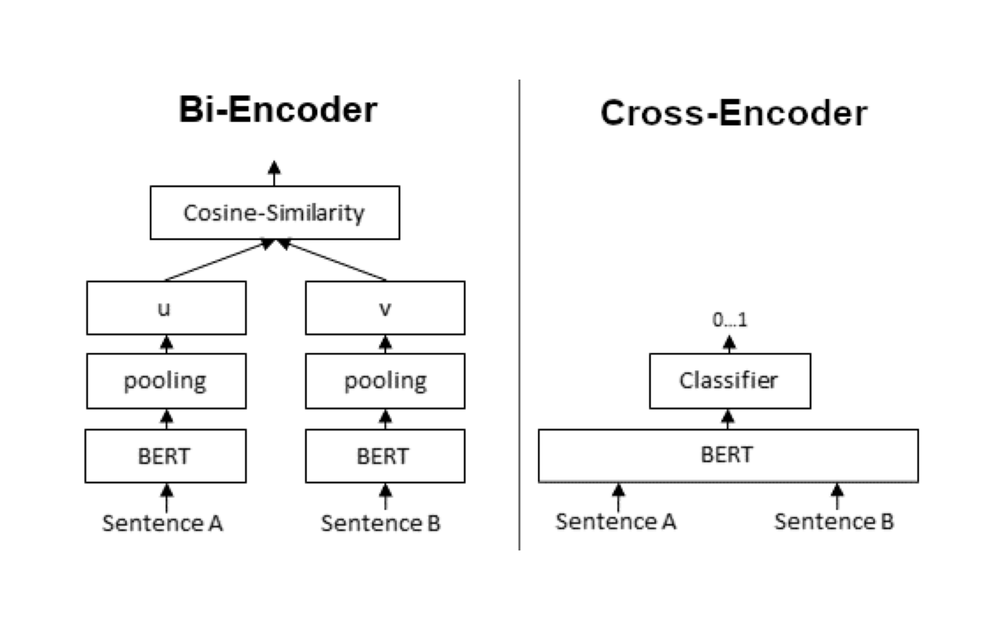
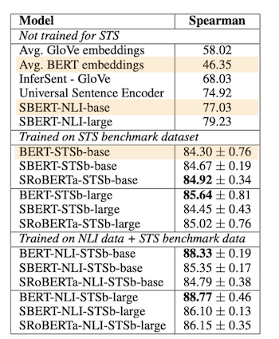

### 들어가며

이 글은 `Sentence-BERT: Sentence Embeddings using Siamese BERT-Networks`에 대한 코드를 구현하고 이를 설명함.

Pretrained Model을 Sbert로 finetuning하는 방법에 대한 튜토리얼은 [Sentence_bert_from_scratch Github](https://github.com/yangoos57/IR-Ranking-project/tree/main/1.Bi_encoder_%26_Cross_encoder)에 정리하였음.

<br/>
<br/>

### Sentence Bert가 필요한 이유

- Sentence Bert는 Bert에 Sentence Embedding을 가능하도록 Fine-tuning 한 모델을 말함.

- Sentence embedding은 문장을 벡터 공간에 배치하는 방법을 의미함. 문장을 벡터 공간 내 배치함으로서 문장 비교, 클러스터링, 시각화 등 다양한 방법을 적용할 수 있음.

- Sbert 이전에도 Bert 모델을 활용해 Sentence Embedding을 생성하는 방법이 존재했지만 이러한 방법은 과거 모델(Glove,Infer-Sent)의 성능에 미치지 못했음.

- 이러한 이유로 문장 간 유사도를 비교하는 Task에서는 주로 문장을 일대일로 비교하는 방식을 활용했음. 이때 일대일 방식은 두 개의 문장을 하나로 묶은 Input Data를 Bert 모델에 넣은 뒤 Output을 통해 두 문장의 유사도를 파악하는 방법을 의미함.

- 논문에서는 일대일로 문장을 비교하는 구조를 Cross encoder라는 용어로 사용하고, Sentence embedding을 기반으로 문장을 비교하는 구조를 Bi enccoder라는 용어로 사용함



- Cross encoder는 문장 간 관계를 파악하는 성능이 우수하지만, 파악해야하는 문장수가 많아질수록 연산이 급증한다는 치명적인 단점이 있음. 반면 Bi encoder는 Embedding 과정에서 정보손실이 발생하므로 성능에 있어서 Cross encoder에 미치지 못하지만, 실시간 문제 해결에 활용될 수 있는 수준의 빠른 속도를 보장함.

- Bi encoder는 Cross encoder의 느린 연산속도를 보완할 수 있고, Cross encoder는 Bi encoder의 비교 성능을 보완할 수 있으므로 아래와 같이 빠르고 정확한 문장 검색 구조를 구현할 수도 있음. 해당 방법은 먼저 Bi encoder로 query와 유사한 문장을 추려낸 뒤 Cross encoder를 활용해 추려낸 문장의 순위를 계산하게 됨. 이와 관련한 내용은 수행했던 미니프로젝트인 [Sentence Bert를 활용해 연관성 높은 도서 추천하기](https://github.com/yangoos57/Sentence_bert_from_scratch/tree/main/3.%20Book_Recommendation)에서 확인할 수 있음.

  

- 아래 표는 Cross encoder, Bi encoder(Sbert), 이전의 Sentence embedding 방법의 STS Task 점수를 보여줌. Sbert의 기본 모델은 NLI 데이터를 학습한 모델이며 기본 Sbert 모델의(SBERT-NLI-base)의 STS Spearman 점수는 77.03점임. 기본 Sbert 모델의 점수는 Cross-Encoder의 (Bert-STSb-base) 84.03점에 미치진 못하지만 기존 방법인 Avg. Bert embedding에 비해 80% 이상 성능 향상을 이룬 모델임을 확인할 수 있음.



<br/>

### Cross Encoder

- Sbert를 설명하기에 앞서 Cross Encoder를 우선 이해해야할 필요가 있음. Cross encoder와 Bi encoder의 문장 비교 방법에는 명확한 차이가 있으므로 Cross encoder의 문장 비교 방법을 이해한다면 Bi eoncder를 명확하게 이해하는데 도움이 될 수 있기 때문임.

<br/>

#### Cross Encoder Head

- Cross encoder의 구조는 Base 모델에 classification layer를 쌓은 구조임. 이러한 구조는 Huggingface의 Transformers 라이브러리에서 `BertModelForSequenceClassification`을 활용하면 쉽게 구현 가능함.

  

- `BertModelForSequenceClassification`의 상단 레이어는 문장 전체 정보가 요약된 토큰인 [CLS] embedding을 활용함.

- 예로들어 10개의 토큰으로 구성된 문장의 output shape이 [1,10,768]일 때, 10개 embedding으로 문장을 표현하는 대신 [CLS] 토큰의 embedding 만으로 문장을 표현함. 다시 말해 [CLS] 토큰 내부에 문장 정보가 들어있다 판단해서 [CLS] 외 나머지 토큰을 사용하지 않는 방식임.

- 이처럼 여러 정보를 하나로 치환하는 방법을 pooling이라 함. [CLS] 토큰의 embedding을 활용하는 방법외에도 문장 내 모든 토큰의 embedding을 평균하는 방법, embedding 내 개별 값의 max를 선택하는 방법이 있음. 이에 대한 내용은 Bi encoder 문단에서 설명하겠음.

- 아래 그림은 [CLS] embedding의 ouput 산출 과정을 Tensor의 차원으로 설명함. 10개의 토큰으로 구성된 1개의 문장이 768차원으로 embedding된 모델을 거치면 [1,10,768] 차원의 Tensor로 표현됨. 10개의 토큰 중 [CLS] 토큰을 선택하면 [1,10,768] ⇒ [1,768] 차원의 Tensor로 pooling 한 것임. [1,768] 차원의 Tensor는 dense layer, activation function 및 label 크기로 차원을 줄이는 projection layer를 거쳐 [1,N] 차원의 Tensor로 출력됨.
  

- 위에서 설명한 구조를 코드로 구현하면 다음과 같음. feature은 Language Model의 last-hidden-state을 의미함.

  ```python
  from torch import Tensor, nn

  class classificationHead(nn.Module):
      def __init__(self, config):
          super().__init__()
          self.dense = nn.Linear(config.hidden_size, config.hidden_size)
          classifier_dropout = (
              config.classifier_dropout
              if config.classifier_dropout is not None
              else config.hidden_dropout_prob
          )
          self.gelu = nn.functional.gelu

          self.dropout = nn.Dropout(classifier_dropout)

          # [batch, embed_size] => [batch, num_labels]
          self.out_proj = nn.Linear(config.hidden_size, config.num_labels)

      def forward(self, features, **kwargs):
          x = features[:, 0, :] # [CLS] 토큰 추출
          x = self.dropout(x)
          x = self.dense(x)
          x = self.gelu(x)
          x = self.dropout(x)

          # label 개수만큼 차원 축소 [batch, embed_size] => [batch, num_labels]
          x = self.out_proj(x)

          return x
  ```

<br/>

#### Cross Encoder 구조

- 아래 모델은 Pretrained model에 Classification Head를 적용한 모델임.
- 구조를 보면 pretrained model의 output이 Classification Head의 input data로 활용되는 것을 알 수 있음.
- 학습에 사용되는 Loss function은 num_labels 1일 땐 MSE를, 2 이상일 땐 Cross Entropy를 활용함.

  ```python
  from torch.nn import CrossEntropyLoss, MSELoss

  class ElectraWithClassification(nn.Module):
      def __init__(self, model, num_labels) -> None:
          super().__init__()
          self.model = model
          self.model.config.num_labels = num_labels
          self.classifier = classificationHead(self.model.config)

      def forward(
          self,
          input_ids=None,
          attention_mask=None,
          token_type_ids=None,
          position_ids=None,
          head_mask=None,
          inputs_embeds=None,
          labels=None,
          output_attentions=None,
          output_hidden_states=None,
          return_dict=None,
      ):

          discriminator_hidden_states = self.model(
              input_ids,
              attention_mask=attention_mask,
              token_type_ids=token_type_ids,
              position_ids=position_ids,
              head_mask=head_mask,
              inputs_embeds=inputs_embeds,
              output_attentions=output_attentions,
              output_hidden_states=output_hidden_states,
              return_dict=return_dict,
          )

          # Last-hidden-states 추출
          sequence_output = discriminator_hidden_states[0]

          # classificationHead에 Last-hidden-state 대입
          logits = self.classifier(sequence_output)

          loss = None
          if labels is not None:
              if self.model.config.num_labels == 1:
                  # Regression Model은 MSE Loss 활용
                  loss_fct = MSELoss()
              else:
                  # classification Model은 Cross entropy 활용
                  loss_fct = CrossEntropyLoss()
                  loss = loss_fct(logits.view(-1, 3), labels.view(-1))
              return {"loss": loss, "logit": logits}
          else:
              return {"logit": logits}
  ```

<br/>

#### Cross encoder로 학습하기 위해 필요한 데이터 구조

- 지금까지 설명한 cross encoder 구조는 다양한 유형의 Task를 수행할 수 있는 구조임. input data 종류에 따라 모델이 수행하는 Task가 달라지게 됨.

- Cross encoder로 Finetuning하기 위해선 아래의 도식화 그림과 같이 2개의 문장을 하나의 묶은 데이터를 활용해야함.

  

- 이러한 데이터 구조는 번역, 의미 분석, Q&A, 유사도 분석, 자연어 추론 등 다양한 Task에서 활용됨.

- Huggingface의 Tokenizer를 활용하면 문장 두 개를 하나로 합친 데이터를 간단히 만들 수 있음

  ```python
  sen = {
   'sen1': '그리고 그가 말했다, "엄마, 저 왔어요."',
   'sen2': '그는 학교 버스가 그를 내려주자마자 엄마에게 전화를 걸었다.',
   'gold_label': 2
   }

  tokenizer(sen['sen1'],sen['sen2'])

  # [SEP] = 3
  >>> [2, 6291, 2126, 4070, 2633, 4398, 4176, 16, 6, 6930, 16, 3278, 18137, 18, 6, 3,
  		 2126, 4034, 6351, 7369, 4070, 2126, 4110, 6725, 4076, 4195, 8627, 6930, 4073,
  		 4325, 6698, 4110, 2045, 4480, 4176, 18, 3],

  ```

- 이러한 구조는 모델 내부에서 Attention을 통해 의미를 파악하므로 문장 간 정확한 의미 파악을 가능케 함.
  다음 문단에 설명할 Bi encoder는 문장 간 비교를 ouput embedding을 활용하므로 의미파악에 있어 정확도가 떨어지는 문제가 있음.
- 다만 이러한 방식은 모든 문장을 1:1로 비교해야만 하는 방법이므로 비교할 문장 개수가 많아질수록 연산량이 급증하게 되는 구조임.

<br/>

### Bi Encoder로 Fine-tuning 하기

- Sentence bert는 Bert 모델을 Bi Encoder로 활용하는 방법임. Bert 모델을 Bi Encoder로 활용하기 위해선 논문에서 제시한 구조를 활용해 Fine-tuning 해야함. 따라서 학습 구조 설명에 앞서 Sbert 구조에 대해 먼저 설명하겠음.
- Sbert의 구조는 Base 모델에 Pooling-layer를 쌓은 구조임. Pooling 방법에는 세 종류가 있음. [CLS] Selection, Mean pooling, Max pooling 방법임. 이 중 논문에서는 Mean Pooling 방법이 효과적이라 소개하므로 이를 기본값으로 세팅하여 활용함.
- pooling을 수행하는 방법은 간단함. 예로들면 토큰 개수가 10개인 문장 1개를 768차원의 embed_size를 가진 모델에 넣으면 Output은 [1,10,768]차원의 Tensor를 반환함. 이때 Pooling은 10개의 Token을 1개의 Token으로 압축하는 방법을 말함.
- Sbert Pooling에는 세 종류의 방법이 있다고 설명하였음.
- 먼저 CLS pooling은 [CLS]토큰을 Sentence Embedding으로 Sentence Embedding으로 활용함.
- Mean Pooling은 10개의 토큰 embedding을 평균 낸 embedding을 Sentence Embedding으로 활용함.
- Max Pooling은 개별 벡터의 max값을 취합한 embedding을 Sentence Embedding으로 활용함.
- 이렇게 풀링된 Tensor의 차원은 [1,768]이 됨.

- Sentence Bert의 flow는 다음과 같음. 1. 문장을 Bert에 입력으로 넣고 2.Output을 Pooling하면 3.Sentence Embedding을 얻을 수 있음.


- #### Sentence Bert 구조

  > Huggingface에 대해 익숙하지 않은 경우 [ELECTRA 모델 구현 및 Domain Adaptation 방법 정리](https://yangoos57.github.io/blog/DeepLearning/paper/Electra/electra/)를 참고

```python
from transformers import ElectraModel, ElectraTokenizer
import torch.nn as nn
import torch

model = ElectraModel.from_pretrained("monologg/koelectra-base-v3-discriminator")
tokenizer = ElectraTokenizer.from_pretrained("monologg/koelectra-base-v3-discriminator")

class modelWithPooling(nn.Module):
    def __init__(self, model, pooling_type="mean") -> None:
        super().__init__()

        self.model = model  # base model ex)BertModel, ElectraModel ...
        self.pooling_type = pooling_type  # pooling type 설정(기본 mean)

    def forward(self, **kwargs):
        features = self.model(**kwargs)
        # [batch_size, src_token, embed_size]
        attention_mask = kwargs["attention_mask"]

        last_hidden_state = features["last_hidden_state"]

        if self.pooling_type == "cls":
            """
            [cls] 부분만 추출
            """

            cls_token = last_hidden_state[:, 0]  # [batch_size, embed_size]
            result = cls_token

        if self.pooling_type == "max":
            """
            문장 내 토큰 중 가장 값이 큰 token만 추출
            """

            input_mask_expanded = (
                attention_mask.unsqueeze(-1).expand(last_hidden_state.size()).float()
            )
            # Set padding tokens to large negative value
            last_hidden_state[input_mask_expanded == 0] = -1e9
            max_over_time = torch.max(last_hidden_state, 1)[0]
            result = max_over_time

        if self.pooling_type == "mean":
            """
            문장 내 토큰을 합한 뒤 평균
            """
            # padding 부분 찾기 = [batch_size, src_token, embed_size]
            input_mask_expanded = (
                attention_mask.unsqueeze(-1).expand(last_hidden_state.size()).float()
            )
            # padding인 경우 0 아닌 경우 1곱한 뒤 총합 = [batch_size, embed_size]
            sum_embeddings = torch.sum(last_hidden_state * input_mask_expanded, 1)

            # 평균 내기위한 token 개수
            sum_mask = input_mask_expanded.sum(1)
            sum_mask = torch.clamp(sum_mask, min=1e-9)

            result = sum_embeddings / sum_mask

        #  input.shape : [batch_size, src_token, embed_size] => output.shape : [batch_size, embed_size]
        return {"sentence_embedding": result}
```

<br/>

### Sbert 학습 구조 : Classification Data를 학습하는 경우

> Pretrained Model을 Sbert로 finetuning하는 방법에 대한 Tutorial을 제작하였음. [Information Retrieval With Sentence Bert 깃허브 페이지](https://github.com/yangoos57/IR-Ranking-project) 참고

- Sbert는 학습에 활용될 데이터셋에 따라 학습 구조가 달라짐. 따라서 자신이 활용할 데이터셋이 regression 데이터셋인지, classification 데이터셋인지 구분을 해야함.
- 먼저 Classification 데이터 유형에 대해서 설명하겠음. 이때 활용하는 데이터셋은 자연어추론(NLI) 데이터셋임. 데이터 구조는 아래와 같음.
- ```python
  {'sen1': '그리고 그가 말했다, "엄마, 저 왔어요."',
   'sen2': '그는 학교 버스가 그를 내려주자마자 엄마에게 전화를 걸었다.',
   'gold_label': 'neutral'}
  ```
- Classification 데이터로 Sbert를 학습하는 구조는 아래와 같음. 1차로 SBert 모델을 통해 산출한 embedding vector를 각각 U,V라 할 때 U,V,|U-V|를 하나의 Tensor로 concat을 수행함. 그 다음 softmax Classifier를 통해 entailment, neutral, contradition을 판단하고 Loss를 구해 학습을 진행함.

<br/>
  

- #### Classification Data 학습 구조

  ```python
  from torch import nn

  class modelForClassificationTraining(nn.Module):
      def __init__(self, model, *inputs, **kwargs):
          super().__init__()

          # 학습할 모델 불러오기
          self.model = modelWithPooling(model)

          # 모델 embed_size
          sentence_embedding_dimension = self.model.model.config.hidden_size

          # concat 해야하는 vector 개수(U,V, |U-V|)
          num_vectors_concatenated = 3

          # embed_size * 3 => 3 차원으로 축소시키는 classifier
          self.classifier = nn.Linear(num_vectors_concatenated * sentence_embedding_dimension, 3)

      def forward(self, features, answer):

          """
          샴 네트워크는 하나의 모델로 두 개의 output을 산출하는 구조임.
          하나의 모델을 사용하지만 각각 출력하므로 Input 데이터 상호 간 영향을 줄 수 없게 됨.
          """

          # 개별 데이터 생성
          embeddings = [self.model(**input_data)["sentence_embedding"] for input_data in features]

          rep_a, rep_b = embeddings

          # U,V, |U-V| vector 병합
          vectors_concat = []
          vectors_concat.append(rep_a)
          vectors_concat.append(rep_b)
          vectors_concat.append(torch.abs(rep_a - rep_b))

          features = torch.cat(vectors_concat, 1)

          # 병합한 vector 차원 축소
          outputs = self.classifier(features)

          # Loss 계산
          loss_fct = nn.CrossEntropyLoss()
          loss = loss_fct(outputs, answer.view(-1))

          return {"loss": loss}
  ```

<br/>

### Sbert 구조 : Regression Data를 학습하는 경우

- Regression Data는 문장과 문장 간 비교를 수치료 표현한 데이터를 말함.

  ```python

  {
   'sen1': '비행기가 이륙하고 있다.',
   'sen2': '비행기가 이륙하고 있다.',
   'score': '5.000'
   }

  ```

- Regression 학습 구조는 코사인 유사도를 활용해 Embedding Vector를 비교함.

  

- #### Regression Data 학습 구조

  ```python
  from torch import nn

  class modelForRegressionTraining(nn.Module):
      def __init__(self, model, *inputs, **kwargs):
          super().__init__()

          # 학습을 수행할 모델 불러오기
          self.model = modelWithPooling(model)

      def forward(self, features, answer):

          # Sentence 1, Sentence 2에 대한 Embedding
          embeddings = [self.model(**input_data)["sentence_embedding"] for input_data in features]

          # Sentence 1, Sentence 2에 대한 Cosine Similarity 계산
          cos_score_transformation = nn.Identity()
          outputs = cos_score_transformation(torch.cosine_similarity(embeddings[0], embeddings[1]))

          # label score Normalization
          answer = answer / 5  # 0 ~ 5 => 0 ~ 1

          loss_fct = nn.MSELoss()
          loss = loss_fct(outputs, answer.view(-1))

          return {"loss": loss}
  ```

<br/>

### Bi encoder 활용

- 학습이 완료되면 학습에 활용된 구조는 버리고 Sentence Bert만 추출하여 활용함.

- Bi encoder는 STS, NLI Task 외에도 Semantic Search, paraphrase-mining, parallel-sentence-mining 등 다양한 Task에 활용할 수 있음.

- 이와 관련한 예제는 [Sbert 깃허브 페이지](https://github.com/UKPLab/sentence-transformers/tree/master/examples/applications)에 코드로 자세히 설명하고 있으니 응용 방법에 대해 궁금한 경우 해당 링크를 참고
