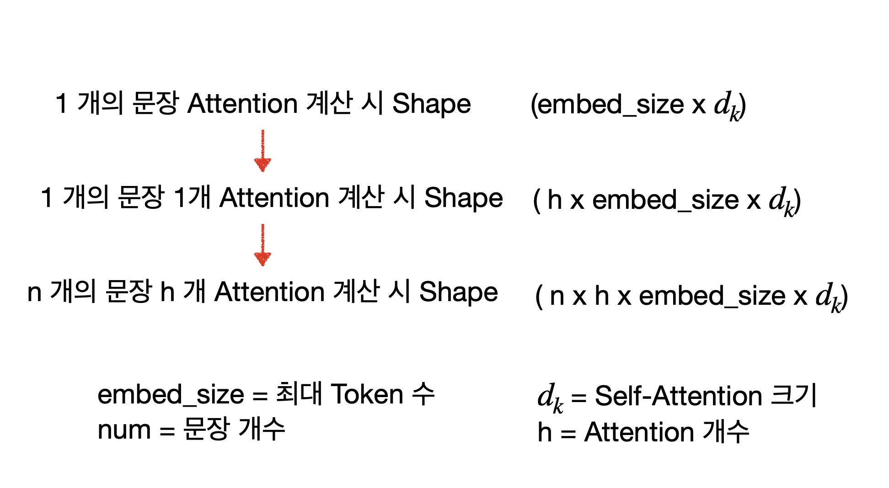

> 이 글은 Transformer 이론과 이를 pytorch로 구현하는 과정을 소개함.
>
> 모델에 대한 학습, 평가, 테스트 방법이 궁금한 경우 [Transformer from scratch](https://github.com/yangoos57/Transformer_from_scratch)을 참고

<br/>

### Transformer 구조

- 현 NLP 모델의 조상격인 Transformer를 이해하고, Pytorch를 활용해 이를 구현하였음.
- 아래의 도식화를 하나씩 해부하면서 Transformer의 세부 작동원리에 대해 이해할 수 있었음.


### Transformer 탄생 배경

- RNN을 사용해 Seq2seq(encoder+decoder 구조)을 구현했을 때 문장이 길어질수록 정확도가 떨어지는 문제 발생

- RNN 구조 상 문장 내 단어수가 많아질수록 뒷단에서 부분에서 시작 부분에 있는 단어들을 참조하지 못하는 현상이 문제의 원인
- 이를 보완하고자 attention이라는 개념을 도입해 문장 내 모든 단어를 참고할 수 있는 방향으로 개선
  > 모든 단어를 참고하게 되면 과부화가 걸리니 단어별 중요도를 계산해 과부화를 최소화 하는게 Attention의 목적
- 이에 더 나아가 RNN을 사용하지 않고 attention만을 사용해 Seq2Seq 구조 구현 시도
- attention만으로 모델을 구현함으로써 RNN에서는 할 수 없는 병렬 연산이 가능해졌음.

## Encoder


- RNN 구조 상 문장 내 단어수가 많아질수록 뒷단에서 부분에서 시작 부분에 있는 단어들을 참조하지 못하는 현상이 문제의 원인
- 이를 보완하고자 attention이라는 개념을 도입해 문장 내 모든 단어를 참고할 수 있는 방향으로 개선

## Multi-head Attention


## Attention

### Attention 배경

- SeqtoSeq 구조에서 RNN을 사용할 때 문장이 길어지면 앞 단어를 기억하지 못하는 문제가 발생

- 이를 보완하기 위해서는 모든 문장을 참고해야하는데 그러다 보면 연산에 과부화가 생김.
- 모든 단어를 참고하되 과부화를 최소화하기 위해 Attention이라는 개념을 도입
- Scaled Dot Product를 통해 병렬 연산이 가능해짐에 따라 효율성 증대
- 단어와의 연관성, 중요도를 계산해서 모든 단어를 참고하되 어떤 단어를 집중적으로 봐야하는지를 알려주는 도구

### Self-Attention이란

- Attention은 token과 token 사이 연관성을 계산하는 방법을 의미

- Self-Attention은 하나의 문장안에 있는 Token 간 연관성을 계산하는 방법

- 다른 문장에 있는 token 간 연관성을 비교하는 것을 Cross-Attention이라 부름(Transformer에선 사용하지 않음)

### Parameter 소개

- Multi-head-Attention은 여러 개의 Self-Attention을 합친 것을 의미함.

- 모델에서 사용할 Attention 개수를 Head라고 하며 논문에서는 8개를 사용함.

- Self-Attention의 크기는 embed_size / Head 로 구할 수 있음.

- Embed_size는 문장 하나에 담을 수 있는 최대 토큰 개수를 의미하고 논문에서는 512로 사용함.

- 따라서 논문에서 Self-Attention 크기는 512 / 8 = 64

### Multi head Attention의 장점

- 모든 토큰에 대해 문장 내 다른 토큰과 연관성을 계산할 수 있고 이를 병렬로 처리 가능

- 이를 통해 특정 토큰이 문장 내 어느 토큰에 집중해야 하는지 알 수 있음.

- 예시로 `The animal didn’t cross the street, because it was too tired.`에서 토큰 `it`의 Self- Attention을 계산하면, 문장 내 token과 `it`의 연관성을 확인할 수 있으며 `it`이 실제로 의미하는 `animal` token의 관심도가 다른 token에 비해 상대적으로 높은 것을 확인할 수 있음.


### Self Attention 계산(= scaled dot product attention)

- Scaled dot product Attention은 Attention을 병렬 연산 가능하도록 만드는 방법임.

- Attention을 구하는 식은 다음과 같음.

    <br/>

  $Attention(Q,K,V)= \mathrm{softmax} \left( \frac{Q K^\text{T}}{\sqrt{d_k}} \right) V$

  <br/>

  **Q** : Query Vector,&nbsp; **K** : Key Vector,&nbsp; **V** : Value Vector,&nbsp; **${d_k} $** : Self-Attention 크기(64)

### scaled dot product Attention을 구하는 6단계

- **Step 1: Create three vectors(Q,K,V) from each of the encoder’s input vectors**

  - Key,Query,Value 개념은 검색 시스템을 모방한 것이라고 함. yotube 검색을 예로들면, 검색엔진은 사용자가 검색한 단어 또는 문장(query)을 동영상 제목, 상세 설명, 태그와 같은 정보(key)와 비교한 다음 query와 연관성 높은 영상(Value)들을 사용자에게 제공함.

  - 검색엔진 방식과 마찬가지로 하나의 token (query vector)이 문장 내 어떤 token과 연관성 있는지를 확인할 수 있음.

  - 특정 token(query)을 문장 내 다른 token과 일일히 비교하여(key) 토큰 간 연관성을 확인한 뒤 이를 softmax하여 가중치화하고, 이를 다시 개별 token과 곱하면 특정 token(query) 기준으로 문장 내 다른 token의 가치를 파악할 수 있음.

  - Query, key, value shape : **n x ${d_k}$,** (_n : 문장 내 token 개수, ${d_k}$ : attention 크기_)

  - 알고리즘으로 Query Vector, Key Vector, Value Vector 구현하기

    - embedding size(512)를 ${d_k}$(64)로 줄이는 Linear Layer 생성

    - 이때 Q,K,V의 Weight는 공유하지 않으므로 3개의 Layer를 각각 생성한다.

- **Step 2: Calculate a score**

  - Score는 Q \* K^T를 의미함.

  - 앞서 설명한 바와 같이 특정 token(query)과 문장 내 토큰 간(key) 연관성을 파악하기 위한 계산임.

  - 이때 문장 내 모든 토큰이 한 번씩 Query 역할을 수행하므로 모든 Token은 Score을 가짐.

  - Tensor Shape : Query(n x ${d_k}$) \* $Key^T$(${d_k}$ x n ) = Score(n x n)

    

- **Step 3: Divide the score by $\sqrt{d_k}$**

  - Score을 Softmax 대입 이전 Scailing 하는 과정

  - token 별 score 비율차이는 유지한 상태로 절대적인 크기를 감소시키기 위해 Score을 나눔.

  - Score을 $\sqrt{d_k}$로 나눠야 하는 명확한 근거는 없고 경험적으로 봤을 때 더 나은 성능을 보장하기 때문에 사용함.

- **Step 4: Pass the result through a softmax operation**

  - 개별 값을 0 ~ 1 사이로 조정하기 위해 softmax 사용(모든 값의 합은 1)

  - query와 연관성 높은 key일수록 1에 근접한 값을, 낮을수록 0에 근접한 값을 부여받으므로 개별 단어에 대한 가중치로 활용 가능

  - 집중도를 1이라 할때 문장 내 token 별로 얼마나 집중해야하는지를 할당하는 과정이라 생각할 수 있음.

- **Step 5: Multiply each value vector by the softmax score**

  - Softmax로 구한 토큰 별 집중치를 token과 곱해서 기준 token(query)가 어떤 token에 집중해야하는지를 값으로 표현 가능

  - Softmax score과 Value를 matmulg하면 Attention을 구할 수 있음.

  - Tensor Shape : Softmax_Score(n x n) \* Value(n x ${d_k}$) = Attention(n x ${d_k}$)

  

- **Step 6 : Sum up the weighted value vector which produces the output of the self- attention layer at this position**

  - head 개수만큼 Step 1 ~ 5를 반복 수행해서 얻은 Attention을 concat하여 Multi-head Attention 구현

  - Attention 구하는 과정이 head 개수 만큼 독립적으로 실행됨을 강조하기 위해 반복 수행한다 설명했지만 실제 구현 과정에서는 병렬 연산 가능
  - 같은 과정을 독립적으로 수행하는 이유는 token이 갖는 다양한 의미를 보관하기 위함.
  - 8명의 독자가 같은 책을 읽더라도 느낀점이 다양한 것과 같이 Attention 별 다양한 의견을 반영해 하나의 결과로 생성하는 것이 목표

### Scaled dot Product Attention 확장하기

- 지금까지 설명은 `The animal didn’t cross the street, because it was too tired.` 문장 하나에 대한 Multi-head Attention을 계산하는 방법이었음.

- 이제는 여러 문장을 한 번에 학습하는 방법과, 더 나아가 Head 개수만큼 반복 수행해야하는 Attention 연산을 한 번의 병렬 연산으로 수행하는 방법에 대한 내용을 다룸

- Scaled dot product Attention을 병렬로 연산하기 위해선 Query, Key, Value의 Shape이 (h x n x embed_size x ${d_k}$)인 4차원 Tensor를 활용해야 함.

- Query, Key, Value Shape이 (n x h x embed_size x ${d_k}$)인 이유는 다음의 그림을 통해 이해할 수 있음.



### Pad에 대한 Masking

- Pad라는 개념은 Encoder와 Decoder에 각각 한 번씩 등장함. 방법은 동일하나 활용 목적에 차이가 있음

- Encoder에서 Masking을 쓰는 이유는 모든 문장 크기를 최대 token 개수(이 글에서는 100개)로 통일하기 위한 용도로 활용.

- 최대 token 개수를 정하는 이유는 병렬 연산이 가능하도록 차원 통일 및 허용 token이 많아질수록 Self-Attention 연산 급증 해결 목적

- 이때, token 개수 설정에 절대적인 기준은 없기 때문에 Input data에 따라 적절한 값을 찾는 것이 필요

- 최대 token 개수를 100개로 설정한다고 가정하면, token 100개 미만인 문장은 나머지 빈 공간에 Pad를 부여하고 100개 초과인 문장은 100개 까지만 token을 저장

- Pad에 Masking함으로서 해당 부분은 Attention 연산을 수행하지 않을 수 있음.

- Pad에 -inf를 부여하면 softmax 이후 0을 부여받게 되므로 Value 계산 시 해당 Pad를 연산하지 않음.

- Encoder Padding은 `make_src_mask` 매서드를 통해 구현되며 문장 내 pad 부분을 1 token인 부분을 0으로 하는 Tensor를 생성하여 Attention 연산 과정에서 Pad와 Token을 구분하는데 활용

  ````python
    def make_pad_mask(self, query, key):
        """
        Multi-head attention pad 함수
        """
        len_query, len_key = query.size(1), key.size(1)

        key = key.ne(self.src_pad_idx).unsqueeze(1).unsqueeze(2)
        # (batch_size x 1 x 1 x src_token_len) 4

        key = key.repeat(1, 1, len_query, 1)
        # (batch_size x 1 x len_query x src_token_len) 4

        query = query.ne(self.src_pad_idx).unsqueeze(1).unsqueeze(3)
        # (batch_size x 1 x src_token_len x 1) 4

        query = query.repeat(1, 1, 1, len_key)
        # (batch_size x 1 x src_token_len x src_token_len) 4

        mask = key & query
        return mask

      ```
  ````

### Pytorch로 Multi-head Attention 구현하기

```python
import torch
import torch.nn as nn

class selfAttention(nn.Module):
    def __init__(self, embed_size, heads) -> None:
        """
        config 참고
        embed_size(=512) : embedding 차원
        heads(=8) : Attention 개수
        """
        super().__init__()
        self.embed_size = embed_size  # 512
        self.heads = heads  # 8
        self.head_dim = embed_size // heads  # 개별 attention의 embed_size(=64)

        # Query, Key, Value
        self.query = nn.Linear(self.head_dim, self.head_dim, bias=False)  # 64 => 64
        self.key = nn.Linear(self.head_dim, self.head_dim, bias=False)  # 64 => 64
        self.value = nn.Linear(self.head_dim, self.head_dim, bias=False)  # 64 => 64

        # 8개 attention => 1개의 attention으로 생성
        self.fc_out = nn.Linear(heads * self.head_dim, embed_size)  # 8 * 64 => 512

    def forward(self, value, key, query, mask):
        """
        query, key, value size : (N, seq_len, embed_size)
        - N_batch = 문장 개수(=batch_size)
        - seq_len : 훈련 문장 내 최대 token 개수
        - embed_size : embedding 차원
        """

        N_batch = query.shape[0]  # 총 문장 개수
        value_len = value.shape[1]  # token 개수
        key_len = key.shape[1]  # token 개수
        query_len = query.shape[1]  # token 개수

        # n : batch_size(=128)
        # h : heads(=8)
        # value,key,query_len, : token_len
        # d_k : embed_size/h(=64)

        value = value.reshape(
            N_batch, self.heads, value_len, self.head_dim
        )  # (n, h, value_len, d_k)
        key = key.reshape(
            N_batch, self.heads, key_len, self.head_dim
        )  # (n x h x key_len x d_k)
        query = query.reshape(
            N_batch, self.heads, query_len, self.head_dim
        )  # (n x h x query_len x d_k)

        # Q,K,V 구하기
        V = self.value(value)
        K = self.key(key)
        Q = self.query(query)

        # score = Q dot K^T
        score = torch.matmul(Q, K.transpose(-2, -1))
        # query shape : (n, h, query_len, d_k)
        # transposed key shape : (n, h, d_k, key_len)
        # score shape : (n, h, query_len, key_len)

        if mask is not None:
            score = score.masked_fill(mask == 0, float("-1e20"))
            """
            mask = 0 인 경우 -inf(= -1e20) 대입
            softmax 계산시 -inf인 부분은 0이 됨.
            """

        # attention 정의

        # d_k로 나눈 뒤 => softmax
        d_k = self.embed_size ** (1 / 2)
        softmax_score = torch.softmax(score / d_k, dim=3)
        # softmax_score shape : (n, h, query_len, key_len)

        # softmax * Value => attention 통합을 위한 reshape
        out = torch.matmul(softmax_score, V).reshape(
            N_batch, query_len, self.heads * self.head_dim
        )
        # softmax_score shape : (n, h, query_len, key_len)
        # value shape : (n, h, value_len, d_k)
        # (key_len = value_len 이므로)
        # out shape : (n, h, query_len, d_k)
        # reshape out : (n, query_len, h, d_k)

        # concat all heads
        out = self.fc_out(out)
        # concat out : (n, query_len, embed_size)

        return out

```

### Add & Normalization


- add를 하는 이유는 gradient vanishing(gradient descent가 0이 되는 현상)을 방지하기 위함.

- add는 일반적으로 residual connection이라고 불림.

- y = f(x) + x 이며 f(x)는 현재 블록의 output, x는 input 값임.

- normalization은 layer Norm을 활용.

- Normalization을 하는 이유는 gradient가 exploding하거나 vanishing하는 문제를 완화시키고 gradient 값이 안정적인 값을 가지게 하여 빠른 학습을 보장한다고 함.

- 최종적으로 Dropout을 수행해 개별 Node가 골고루 학습되도록 구조를 설계

  

### position-wise Feed Forward Neural Network(FFNN)


- ReLU를 activation function으로 사용

- FFNN은 Linear(512d,2048d)-> ReLU(2048d) -> Linear(2048d, 512d)의 Position-Wise한 구조로 이뤄짐

  
  <figcaption>Jay Alammar, The Illustrated Transformer</figcaption>

### Encoder Block 구현


```python
class EncoderBlock(nn.Module) :
    class EncoderBlock(nn.Module):
    def __init__(self, embed_size, heads, dropout, forward_expansion) -> None:
        """
        config 참고
        embed_size(=512) : embedding 차원
        heads(=8) : Attention 개수
        dropout(=0.1): Node 학습 비율
        forward_expansion(=2) : FFNN의 차원을 얼마나 늘릴 것인지 결정,
                                forward_expension * embed_size(2*512 = 1024)
        """
        super().__init__()
        # Attention 정의
        self.attention = selfAttention(embed_size, heads)

        ### Norm & Feed Forward
        self.norm1 = nn.LayerNorm(embed_size)  # 512
        self.norm2 = nn.LayerNorm(embed_size)  # 512

        self.feed_forawrd = nn.Sequential(
            # 512 => 1024
            nn.Linear(embed_size, forward_expansion * embed_size),
            # ReLU 연산
            nn.ReLU(),
            # 1024 => 512
            nn.Linear(forward_expansion * embed_size, embed_size),
        )
        self.dropout = nn.Dropout(dropout)

    def forward(self, value, key, query, mask):

        # self Attention
        attention = self.attention(value, key, query, mask)
        # Add & Normalization
        x = self.dropout(self.norm1(attention + query))
        # Feed_Forward
        forward = self.feed_forawrd(x)
        # Add & Normalization
        out = self.dropout(self.norm2(forward + x))
        return out
```

## Input Embedding과 Positional Encoding

- Input Embedding + Positional encoding은 첫번째 Encoder Block의 Input Data로 활용됨.

### Input Embedding


- Embedding은 벡터 공간 내 단어의 position을 특정 차원 내에 표현하여 단어의 유사도, 연관성 등을 파악할 수 있는 방법임.

- Transfromer 논문에서는 512차원의 벡터 공간에 Embedding을 활용.

### Positional Embedding


- Transformer는 RNN으로 구현한 seq2seq를 Attention으로 구현했으며 이를 통해 병렬연산을 가능하게 하였음.

- RNN 방식의 모델은 단어를 순차적으로 학습했으므로 단어가 나오는 순서에 대한 패턴 또한 학습 할 수 있었음.

- 하지만 병렬연산이 가능한 Transformer에서는 단어 순서를 통해 얻을 수 있는 패턴을 학습할 기회가 사라짐.

- 이러한 단점을 상쇄시키기 위해 Input Embedding에 단어 간 거리를 나타내는 Positional Embedding을 더하여 사용함.

### Encoder 구현(= Encoder x num_layers)


```python
class Encoder(nn.Module):
    def __init__(
        self,
        src_vocab_size,
        embed_size,
        num_layers,
        heads,
        forward_expansion,
        dropout,
        max_length,
        device,
    ) -> None:
        """
        config 참고
        src_vocab_size(=11509) : input vocab 개수
        embed_size(=512) : embedding 차원
        num_layers(=3) : Encoder Block 개수
        heads(=8) : Attention 개수
        device : cpu;
        forward_expansion(=2) : FFNN의 차원을 얼마나 늘릴 것인지 결정,
                                forward_expension * embed_size(2*512 = 1024)
        dropout(=0.1): Node 학습 비율
        max_length : batch 문장 내 최대 token 개수(src_token_len)
        """
        super().__init__()
        self.embed_size = embed_size
        self.device = device

        # input + positional_embeding
        self.word_embedding = nn.Embedding(src_vocab_size, embed_size)  # (11509, 512) 2

        # positional embedding
        pos_embed = torch.zeros(max_length, embed_size)  # (src_token_len, 512) 2
        pos_embed.requires_grad = False
        position = torch.arange(0, max_length).float().unsqueeze(1)
        div_term = torch.exp(
            torch.arange(0, embed_size, 2) * -(math.log(10000.0) / embed_size)
        )
        pos_embed[:, 0::2] = torch.sin(position * div_term)
        pos_embed[:, 1::2] = torch.cos(position * div_term)
        self.pos_embed = pos_embed.unsqueeze(0).to(device)  # (1, src_token_len, 512) 3

        # Encoder Layer 구현
        self.layers = nn.ModuleList(
            [
                EncoderBlock(
                    embed_size,
                    heads,
                    dropout=dropout,
                    forward_expansion=forward_expansion,
                )
                for _ in range(num_layers)
            ]
        )
        # dropout
        self.dropout = nn.Dropout(dropout)

    def forward(self, x, mask):
        _, seq_len = x.size()  # (n, src_token_len) 2
        # n : batch_size(=128)
        # src_token_len : batch 내 문장 중 최대 토큰 개수

        pos_embed = self.pos_embed[:, :seq_len, :]
        # (1, src_token_len, embed_size) 3

        out = self.dropout(self.word_embedding(x) + pos_embed)
        # (n, src_token_len, embed_size) 3

        for layer in self.layers:
            # Q,K,V,mask
            out = layer(out, out, out, mask)
        return out
```

## Decoder

- Decoder 구조와 Encoder 구조는 거의 유사함.

- Masked Multi-head Attention이 추가되고 encoder 과정에서 확보한 최종 결과값(Context)을 개별 Decoder의 Multi-head에 활용하는 것이 특징

- Decoder 또한 Encoder와 마찬가지로 Input Data를 활용.

- 영어 불어 번역 Task를 수행하는 경우 영어 문장을 Encoder로 학습해 Context를 만든 뒤 Decoder에서 불어 Input Data와 함께 Decoder를 학습

### Masked Mulit-head Attention


- Mask는 Encoder와 Decoder에서 한 번씩 사용되며 수행 방법은 동일하나 목적이 다름.

- Encoder에서는 token이 아닌 Pad를 가리기 위해 사용했다면, Decoder는 `Teacher Forcing`을 병렬로 수행하기 위해 Mask를 사용함.

- 영불 번역기를 만든다고 생각할 때 Encoder는 영어 문장 Input 내 Pad에 대해 Masking을 수행함. Decoder는 불어 문장 Input을 활용해 Teacher Forcing' 수행에 필요한 교본을 만듬.

- 기본적으로 Transformer는 RNN 구조의 Seq2Seq 모델을 Attention으로 변형한 것이므로 기존의 학습 방법을 따름.

- RNN의 학습은 이전에 예측한 값을 기반으로 새로운 에측을 수행하며 학습함. `I am a studient -> Je suis étudiant`을 학습한다고 할 경우, 이전 문장이 `<sos> Je` 라면 이 문장을 참고해 다음 단어를 예측하는 학습을 수행함.

- 모델이 정답인 Suis를 예측하지 못하더라도 이전 문장은 정답 문장인`<sos> Je suis`을 통해 다음 단어 예측을 수행함.

- 이러한 RNN 모델 학습 방법은 예측이 틀릴지라도 다음 문장의 예측 학습에 영향을 주지 않으며 이를 통해 모든 단어를 바르게 예측할 기회를 제공함. 이를 `Teacher Forcing`이라 함.

- Transformer는 동시에 모든 문장 확인이 가능하므로 아래와 같이 Masking하여 예측하는 연습을 수행해야함.

  

- **주의! Decoder Masked Mulit-head attention에서 수행하는 Masking은 모델 학습에만 사용됨. 실전에서는 가릴 내용이 존재하지 않으므로 사용하지 않음.**

- 그림과 같이 사각형을 삼각형 두 개로 나누는 구조로 만들어짐. torch.tril을 통해 삼각형 구조의 행렬 구현 가능

- `make_trg_mask` 매서드에서 Pad 부분을 1 이전 문장 부분을 0으로 하는 Tensor를 만든 다음 Atention 연산 과정에서 Pad와 Token을 구분하는데 활용됨.

```python

    def make_trg_mask(self, trg):
        """
        Masked Multi-head attention pad 함수
        """
        # trg = triangle
        N, trg_len = trg.shape
        trg_mask = torch.tril(torch.ones((trg_len, trg_len))).expand(
            N, 1, trg_len, trg_len
        )
        return trg_mask.to(self.device)
```

### Multi-head Attention


- Decoder와 Encoder의 Multi-head Attention 구조는 동일함. 다만 Input Data에 차이가 있음.

- 아래 그림을 보면 Encoder 끝단에서 이어진 화살표가 모든 Decoder의 Input Data로 들어감. 이때 Masked Multi-head Attention에서 학습한 결돠도 함께 Input Data로 받음.


- Encoder의 결과값을 Context라 부르는 이유는 N개의 Encoder를 거치면서 문장 내 토크들의 서로간 관계가 복잡하게 녹아들어갔기 떄문

- Decoder의 Multi-head Attention은 Encoder의 Context와 Decoder의 Masked Mulit-head Attention의 output을 결합하는 중요한 과정임.

- Eecoder의 Multi-head Attention와 Decoder의 Masked Multi-head Attention은 지금껏 자신의 문장 간 관계를 파악하는 Self- Attention을 수행하였음.(이해가 어려울 경우 Attention 항목의 `Self-Attention이란`을 참고)

- 이제는 Encoder에서 사용한 문장과 Decoder에서 사용한 문장 간 Attention 계산이 필요함. 이를 Cross-Attention이라고 부름.

- Attention 학습이 충분이 이뤄진 Encoder Context에서 Key,Value를, Masked Multi-head Attention의 output에서 Query를 추출함.

- Attention은 검색 시스템의 개념을 차용한 것이므로 이러한 방법이 효과적임. 유튜브 검색에 비유하자면, 사용자 검색 단어(Query)를 DB 내 동영상 Meta 데이터(Key)와 비교하여 연관성 높은 동영상(Value)을 우선 순위로 제공하는 과정임.

- 다음과 같이 Score을 구하면 영어 문장과 불어 문장 간 관계 파악이 가능하며 이를 Softmax한 뒤 Value로 곱하여 특정 불어 단어에 집중해야할 영어 단어들을 확보할 수 있음.


### Decoder Block 구현


```python
class DecoderBlock(nn.Module):
    def __init__(self, embed_size, heads, dropout, forward_expansion) -> None:
        """
        config 참고
        embed_size(=512) : embedding 차원
        heads(=8) : Attention 개수
        dropout(=0.1): Node 학습 비율
        forward_expansion(=2) : FFNN의 차원을 얼마나 늘릴 것인지 결정,
                                forward_expension * embed_size(2*512 = 1024)
        """
        super().__init__()
        self.norm = nn.LayerNorm(embed_size)
        self.attention = selfAttention(embed_size, heads=heads)
        self.encoder_block = EncoderBlock(embed_size, heads, dropout, forward_expansion)
        self.dropout = nn.Dropout(dropout)

    def forward(self, x, value, key, src_trg_mask, target_mask):
        """
        x : target input with_embedding (n, trg_token_len, embed_size) 3
        value, key : encoder_attention (n, src_token_len, embed_size) 3
        """

        # masked_attention
        attention = self.attention(x, x, x, target_mask)
        # (n, trg_token_len, embed_size) 3

        # add & Norm
        query = self.dropout(self.norm(attention + x))

        # encoder_decoder attention + feed_forward
        out = self.encoder_block(value, key, query, src_trg_mask)
        # (n, trg_token_len, embed_size) 3

        return out

```

### Decoder 구현


```python
class Decoder(nn.Module):
    def __init__(
        self,
        trg_vocab_size,
        embed_size,
        num_layers,
        heads,
        forward_expansion,
        dropout,
        max_length,
        device,
    ) -> None:
        """
        config 참고
        trg_vocab_size(=10873) : input vocab 개수
        embed_size(=512) : embedding 차원
        num_layers(=3) : Encoder Block 개수
        heads(=8) : Attention 개수
        forward_expansion(=2) : FFNN의 차원을 얼마나 늘릴 것인지 결정,
                                forward_expension * embed_size(2*512 = 1024)
        dropout(=0.1): Node 학습 비율
        max_length : batch 문장 내 최대 token 개수
        device : cpu
        """
        super().__init__()
        self.device = device

        # 시작부분 구현(input + positional_embeding)
        self.word_embedding = nn.Embedding(trg_vocab_size, embed_size)  # (10837,512) 2

        # positional embedding
        pos_embed = torch.zeros(max_length, embed_size)  # (trg_token_len, embed_size) 2
        pos_embed.requires_grad = False
        position = torch.arange(0, max_length).float().unsqueeze(1)
        div_term = torch.exp(
            torch.arange(0, embed_size, 2) * -(math.log(10000.0) / embed_size)
        )
        pos_embed[:, 0::2] = torch.sin(position * div_term)
        pos_embed[:, 1::2] = torch.cos(position * div_term)
        self.pos_embed = pos_embed.unsqueeze(0).to(device)
        # (1, trg_token_len, embed_size) 3

        # Decoder Layer 구현
        self.layers = nn.ModuleList(
            [
                DecoderBlock(embed_size, heads, dropout, forward_expansion)
                for _ in range(num_layers)
            ]
        )
        self.dropout = nn.Dropout(dropout)

    def forward(self, x, enc_src, src_trg_mask, trg_mask):
        # n : batch_size(=128)
        # trg_token_len : batch 내 문장 중 최대 토큰 개수

        _, seq_len = x.size()
        # (n, trg_token_len)

        pos_embed = self.pos_embed[:, :seq_len, :]
        # (1, trg_token_len, embed_size) 3

        out = self.dropout(self.word_embedding(x) + pos_embed).to(self.device)
        # (n, trg_token_len, embed_size) 3

        for layer in self.layers:
            # Decoder Input, Encoder(K), Encoder(V) , src_trg_mask, trg_mask
            out = layer(out, enc_src, enc_src, src_trg_mask, trg_mask)
        return out


```

## Linear FC layer & Softmax


- 마지막 Decoder까지 수행한 Output의 Shape은 (num of sentence x max_length x embed_size) 임.

- Decoder 수행을 마친 Output을 활용해 실제 불어 Text를 만들어야 하므로 Output을 불어 Vocab Size 만큼 확장시켜야함.

- 따라서 (num of sentence x max_length x embed_size) Shape으로의 확장을 위한 Linear FC Layer가 필요함.

- 불어 Vocab Size만큼 확장된 embedding에 softmax를 입혀 모든 단어의 확률을 구함.

- 예측의 가장 처음은 < sos >로 시작함. Encoding Context + < sos >를 가지고 첫 output인 `I`를 산출함.

- 그 다음은 아래와 같이 이전에 예측했던 Output을 참고하면서 다음에 올 단어를 예측함.


<figcaption>Jay Alammar, The Illustrated Transformer</figcaption>

## Transformer 최종 구현


```python
class Transformer(nn.Module):
    def __init__(
        self,
        src_vocab_size,
        trg_vocab_size,
        src_pad_idx,
        trg_pad_idx,
        embed_size,
        num_layers,
        forward_expansion,
        heads,
        dropout,
        device,
        max_length,
    ) -> None:
        """
        src_vocab_size(=11509) : source vocab 개수
        trg_vocab_size(=10873) : target vocab 개수
        src_pad_idx(=1) : source vocab의 <pad> idx
        trg_pad_idx(=1) : source vocab의 <pad> idx
        embed_size(=512) : embedding 차원
        num_layers(=3) : Encoder Block 개수
        forward_expansion(=2) : FFNN의 차원을 얼마나 늘릴 것인지 결정,
                                forward_expension * embed_size(2*512 = 1024)
        heads(=8) : Attention 개수
        dropout(=0.1): Node 학습 비율
        device : cpu
        max_length(=140) : batch 문장 내 최대 token 개수
        """
        super().__init__()
        self.Encoder = Encoder(
            src_vocab_size,
            embed_size,
            num_layers,
            heads,
            forward_expansion,
            dropout,
            max_length,
            device,
        )
        self.Decoder = Decoder(
            trg_vocab_size,
            embed_size,
            num_layers,
            heads,
            forward_expansion,
            dropout,
            max_length,
            device,
        )
        self.src_pad_idx = src_pad_idx
        self.trg_pad_idx = trg_pad_idx
        self.device = device

        # Probability Generlator
        self.fc_out = nn.Linear(embed_size, trg_vocab_size)  # (512,10873) 2

    def encode(self, src):
        """
        Test 용도로 활용 encoder 기능
        """
        src_mask = self.make_pad_mask(src, src)
        return self.Encoder(src, src_mask)

    def decode(self, src, trg, enc_src):
        """
        Test 용도로 활용 decoder 기능
        """
        # decode
        src_trg_mask = self.make_pad_mask(trg, src)
        trg_mask = self.make_trg_mask(trg)
        out = self.Decoder(trg, enc_src, src_trg_mask, trg_mask)
        # Linear Layer
        out = self.fc_out(out)  # (n, decoder_query_len, trg_vocab_size) 3

        # Softmax
        out = F.log_softmax(out, dim=-1)
        return out

    def make_pad_mask(self, query, key):
        """
        Multi-head attention pad 함수
        """
        len_query, len_key = query.size(1), key.size(1)

        key = key.ne(self.src_pad_idx).unsqueeze(1).unsqueeze(2)
        # (batch_size x 1 x 1 x src_token_len) 4

        key = key.repeat(1, 1, len_query, 1)
        # (batch_size x 1 x len_query x src_token_len) 4

        query = query.ne(self.src_pad_idx).unsqueeze(1).unsqueeze(3)
        # (batch_size x 1 x src_token_len x 1) 4

        query = query.repeat(1, 1, 1, len_key)
        # (batch_size x 1 x src_token_len x src_token_len) 4

        mask = key & query
        return mask

    def make_trg_mask(self, trg):
        """
        Masked Multi-head attention pad 함수
        """
        # trg = triangle
        N, trg_len = trg.shape
        trg_mask = torch.tril(torch.ones((trg_len, trg_len))).expand(
            N, 1, trg_len, trg_len
        )
        return trg_mask.to(self.device)

    def forward(self, src, trg):
        src_mask = self.make_pad_mask(src, src)
        # (n,1,src_token_len,src_token_len) 4

        trg_mask = self.make_trg_mask(trg)
        # (n,1,trg_token_len,trg_token_len) 4

        src_trg_mask = self.make_pad_mask(trg, src)
        # (n,1,trg_token_len,src_token_len) 4

        enc_src = self.Encoder(src, src_mask)
        # (n, src_token_len, embed_size) 3

        out = self.Decoder(trg, enc_src, src_trg_mask, trg_mask)
        # (n, trg_token_len, embed_size) 3

        # Linear Layer
        out = self.fc_out(out)  # embed_size => trg_vocab_size
        # (n, trg_token_len, trg_vocab_size) 3

        # Softmax
        out = F.log_softmax(out, dim=-1)
        return out


```

## 참고자료

[[hansu kim] [NLP 논문 구현] pytorch로 구현하는 Transformer (Attention is All You Need)](https://cpm0722.github.io/pytorch-implementation/transformer)

[[Jay Alammar] The Illustrated Transformer](https://jalammar.github.io/illustrated-transformer/)

[[Aimb] Self-Attention과 Masked Self-Attention](https://aimb.tistory.com/182)

[[고려대학교 산업경영공학부] 08-2: Transformer ](https://www.youtube.com/watch?v=Yk1tV_cXMMU&t=1422s)

[[Aimb] Self-Attention과 Masked Self-Attention](https://aimb.tistory.com/182)

[[딥 러닝을 이용한 자연어 처리 입문] 16-01 트랜스포머(Transformer)](https://wikidocs.net/31379)
