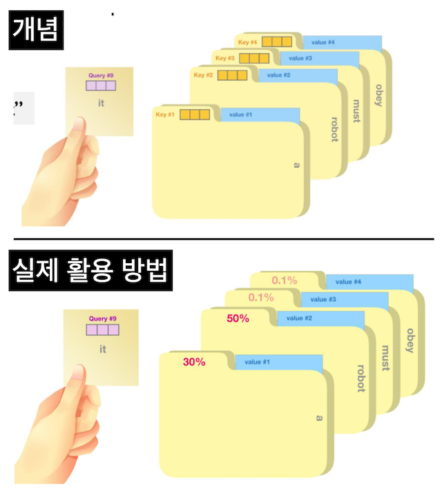
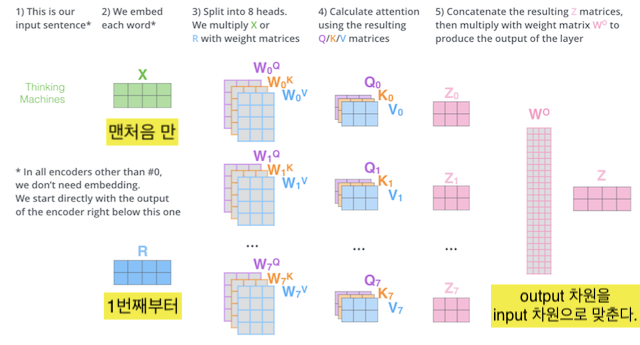
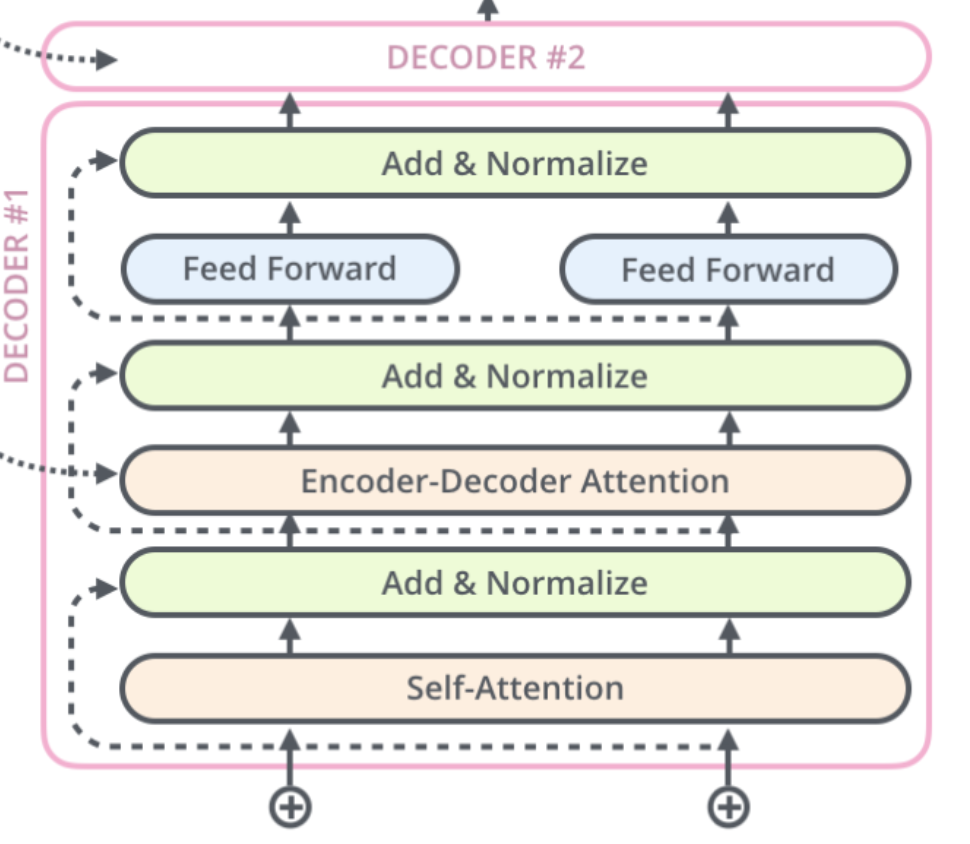

### Transformer 탄생 배경

- RNN을 사용해 Seq2seq(encoder+decoder 구조)을 구현했을 때 문장이 길어질수록 정확도가 떨어지는 문제 발생

- RNN 구조 상 문장 내 단어수가 많아질수록 뒷단에서 부분에서 시작 부분에 있는 단어들을 참조하지 못하는 현상이 문제의 원인
- 이를 보완하고자 attention이라는 개념을 도입해 문장 내 모든 단어를 참고할 수 있는 방향으로 개선
  > 모든 단어를 참고하게 되면 과부화가 걸리니 단어별 중요도를 계산해 과부화를 최소화 하는게 Attention의 목적임
- 이에 더 나아가 RNN을 사용하지 않고 attention만을 사용해 Seq2Seq 구조 구현 시도
- 그 결과 SOTA를 차지하는 Transformer를 만들게 됨.
- 그래서 Transformer의 논문 이름이 Attention is all you need
- 이 외에도 attention만으로 구현하는게 좋은 이유는 RNN에서는 할 수 없는 병렬 연산이 가능하다는 점

## transformer 구조


## Encoder

- Input 단어 간 관계를 파악하는 단계
- N개의 encoder로 구성되어 있고 매 단계를 지날때마다 단어의 세부적인 의미를 담은 임베딩 벡터가 업데이트 된다.
- ex) Apple이 phone, pod라는 단어와 쓰일때는 회사 Apple을 의미한다는 것을, eat, juice라는 단어와 쓰일 경우 먹는 Apple을 의미한다는 것을 학습한다.

  

### Attention

- 논문에 나온 Multi head attention은 Self_head_attention을 n번 동시에 수행한 값을 옆으로 합친 결과임.

- n명의 독자가 같은 책을 읽고 내논 개별 독서평을 옆으로 합쳤다고 보면됨. 나중에 벡터 곱을 통해 하나의 독서평으로 통합하려고 이러한 구조를 만든 것임.

- Parameter 소개

  - Multi_Head_Attention = Heads \* SelfAttention

  - embed_size : 토큰 개수 , 논문에서는 512개로 사용

    

  - Heads = Attention 개수, 논문에서는 8개 사용

  - Attention_dim = embeding_size // Heads, 개별 attention 차원, 논문에서는 64차원

### Self Attention

**Attention 탄생 배경**

- SeqtoSeq 구조에서 RNN을 사용할 때 문장이 길어지면 앞 단어를 기억하지 못하는 문제가 발생

- 이를 보완하기 위해서는 모든 문장을 참고해야하는데 그러다 보면 연산에 과부화가 생김
- 모든 단어를 참고하되 과부화를 최소화하기 위해 Attention이라는 개념을 도입
- 단어와의 연관성, 중요도를 계산해서 모든 단어를 참고하되 어떤 단어를 집중적으로 봐야하는지를 알려주는 도구라고 생각하면 된다.

<br>
<br>

**Multi head Attention이 사용되는 방식**

- 논문에서는 8개의 Attention이 쓰였음. 그림에는 8개의 색으로 표현되어있음.

- it이라는 단어에 대해서 개별 Attention의 중요도가 표시되고 있음을 확인할 수 있음

- 실제로는 그림과 다르게 옆 단으로 합쳐진 다음 W를 곱해서 input size와 동일한 size의 vector로 압축되게 됨.

- 계산 방법은 뒤에서 설명 됨


### Self Attention 구하기

**Query, Key, Value**

- query, key, value라는 개념을 사용하여 하나의 단어와 문장 내 전체 단어의 관계를 파악

- key, value는 Dict의 그것과 같다.

  - query : 현재 관심을 갖는 단어 | vector
  - key : column 명 | vector
  - value : column 안에 있는 실제 값 | vector

      

<br>

**scaled dot product attention**

- Attention을 병렬 연산으로 구하는 방법임

  $Attention(Q,K,V)= Z = \mathrm{softmax} \left( \frac{Q K^\text{T}}{\sqrt{d}} \right) V$

<br>
<br>

**Attention 공식 이해하기**

- Step 1: Create three vectors from each of the encoder’s input vectors

  `head_dim = embed_size // heads`

- Step 2: Calculate a score

- Step 3: Divide the score by $\sqrt{b_k}$

  이렇게 해야 성능이 잘나온다고 논문에 나옴.

- Step 4: Pass the result through a softmax operation

  지금 보고 있는 토큰과 얼마나 관련성이 있는지 확률로 변환

- Step 5: Multiply each value vector by the softmax score

  v에다가 퍼센트를 곱해서 단어의 중요도를 반영

- Step 6 : Sum up the weighted value vector which produces the output of the self- attention layer at this position

  Step 5에서 얻은 값들을 모두 더하면 self attention 값이 된다.

단계 한눈에 보기


### Multi-headed attention

- Multi head attention은 Self_head_attention을 n번 동시에 수행한 값을 옆으로 합친 결과임

- 8명의 독자가 같은 책을 읽는다는 비유로 생각

- attention($z_n$) 결과 값을 모두 concat($z_1 + z_2 + ... + z_8 $) = $z_{all}$
- $z_{all}$ \* $ W^0 = Z $
- $W^0$ 은 처음에는 임의로 부여되고 학습과정에서 조정된다.
- Z는 feed forward에 투입되는 값

    

```python
import torch
import torch.nn as nn

class selfAttention(nn.Module) :
    def __init__(self,embed_size, heads) -> None:
        '''
        embed_size : input 토큰 개수, 논문에서는 512개로 사용
        heads : multi_head의 개수, 논문에서는 8개 사용

        Self Attention은 특정 단어(query)와 다른 단어(keys) 간의 중요도를 파악하는 매커니즘이다.
        '''

        super().__init__()


        self.embed_size = embed_size # 512차원
        self.heads = heads # 8개
        self.head_dim = embed_size // heads # 64차원(개별 attention의 차원)


        '''
        dict에서 쓰는 key,value 와 같다.
        query는 현재 찾고자 하는 값이다.
        '''
        # input feature, output feature
        self.values = nn.Linear(self.head_dim, self.head_dim, bias=False)
        self.keys = nn.Linear(self.head_dim, self.head_dim, bias=False)
        self.queries = nn.Linear(self.head_dim, self.head_dim, bias=False)

        # Multi-headed attention을 만듬
        # fully connected out
        # input feature = outfut feature
        self.fc_out = nn.Linear(heads*self.head_dim, embed_size) # 64 * 8

    def forward(self, values,keys,query,mask) :
        N = query.shape[0] # 단어 개수
        value_len = values.shape[1] # head 차원
        key_len = keys.shape[1]
        query_len = query.shape[1]

        values = values.reshape(N,value_len, self.heads,self.head_dim)
        keys = keys.reshape(N,key_len, self.heads,self.head_dim)
        queries = query.reshape(N,query_len, self.heads,self.head_dim)

        vlaues = self.values(values)
        keys = self.values(keys)
        queries = self.queries(queries)

        # score = Q dot K^T
        score = torch.einsum("nqhd,nkhd->nhqk", [queries,keys])
        # queries shape : N,value_len, self.heads,self.head_dim
        # keys shape : N,key_len, self.heads,self.head_dim
        # score shape : N, heads, query_len, key_len

        # decoder 구조인 masked Self Attention 적용 시 활용되는 구문
        # score = -inf로 둬서 값을 예측 하도록 한다.
        if mask is not None :
            score = score.masked_fill(mask == 0, float("-1e20"))
            '''
            mask = 0 인 값에 대해서 -inf 대입
            -1e20 = -inf
            -inf이기 때문에 값이 0에 수렴
            mask가 부여된 경우 score 값을 0으로 준다.

            '''
        # attention 정의
        attention = torch.softmax(score / (self.embed_size**(1/2)),dim=3)

        out = torch.einsum("nhql,nlhd -> nqhd",[attention, values]).reshape(
            N,query_len,self.heads * self.head_dim
            )
        # attention shape : N, heads,query_len,key_len
        # values shape : N, value_len, heads, heads_dim
        # out shape : N, query_len, heads * head_dim

        # concat all heads
        out = self.fc_out(out)

        return out

```

### Transformer Block 구현


**Add(=residual connection) & Norm**

- add(=residual connection)를 하는 이유는 gradient descent 할 때 0이 될 수 있기 때문

- Add 방법 : z 에다가 x를 더한다.
  이때 x 는 이전 z 값 z는 현재 z값
- LayerNorm = normalization(상대 위치는 고정하되 절대 위치만 변경)

**Feed Forward**

- 같은 계층의 encoder에서는 feed forward 구조가 같음
- Linear(512d,2048d)-> relu(2048d) -> Linear(2048d, 512d)

  

```python
class TransformerBlock(nn.Module) :
    def __init__(self,embed_size, heads, dropout, forward_expansion) -> None:
        '''
        embed_size : token 개수 | 논문 512개
        heads : attention 개수 | 논문 8개
        dropout : 골고루 학습하기 위한 방법론
        forward_expansion : forward 계산시 차원을 얼마나 늘릴 것인지 결정, 임의로 결정하는 값
                            forward_차원 계산은 forward_expension * embed_size
                            논문에서는 4로 정함. 총 2048차원으로 늘어남.

        '''
        super().__init__()

        # Attention 정의
        self.attention = selfAttention(embed_size,heads)

        ### Norm & Feed Forward
        self.norm1 = nn.LayerNorm(embed_size)
        self.norm2 = nn.LayerNorm(embed_size)

        self.feed_forawrd = nn.Sequential(
            # 차원을 512 -> 2048로 증가
            nn.Linear(embed_size,forward_expansion*embed_size),
            # 차원을 Relu 연산
            nn.ReLU(),
            # 차원 2048 -> 512로 축소
            nn.Linear(forward_expansion*embed_size,embed_size)
            )
        self.dropout = nn.Dropout(dropout)

    ### Encoder 구현
    def forward(self, value,key,query,mask) :
        # self Attention
        attention = self.attention(value, key, query, mask)
        # Add & Normalization
        x = self.dropout(self.norm1(attention + query))

        # Feed_Forward
        forward = self.feed_forawrd(x)
        # Add & Normalization
        out = self.dropout(self.norm2(forward + x))
        return out
```

### Encoder 구현(= Encoder Block \* num_layers)

- 앞서 구현한 encoder를 가지고 Transformer의 Encoder를 구현한다.

```python
class Encoder(nn.Module) :
    def __init__(
        self,
        src_vocab_size,
        embed_size,
        num_layers,
        heads,
        device,
        forward_expansion,
        dropout,
        max_length,
        ) -> None:

        '''
        src_vocab_size : input vocab 개수
        num_layers : Encoder block 구현할 개수
        dropout : dropout 비율
        max_length :
        '''

        super().__init__()


        self.embed_size = embed_size
        self.device = device

        # 시작부분 구현(input + positional_embeding)
        self.word_embeding = nn.Embedding(src_vocab_size, embed_size) # row / col
        self.position_embeding = nn.Embedding(max_length,embed_size) # row / col

        # Transformer Layer 구현
        self.layers = nn.ModuleList(
            [TransformerBlock(
                    embed_size,
                    heads,
                    dropout=dropout,
                    forward_expansion = forward_expansion,
                )
            for _ in range(num_layers)]
        )

        # dropout = 0 ~ 1
        self.dropout = nn.Dropout(dropout)

    def forward(self, x, mask):
        N,seq_length = x.shape # (a,b)
        positions = torch.arange(0, seq_length).expand(N,seq_length).to(self.device) # (a,b)

        out = self.dropout(self.word_embeding(x) + self.position_embeding(positions))

        for layer in self.layers :
            # query, key, value
            out = layer(out,out,out,mask)

        return out
```

### Decoder

- 1 단에서 output에 대한 self-attention 수행 + 학습을 위한 mask 부여
- 2 단에서 mask 부여된 값을 예측하면서 학습이 진행
- 3 단에서 feed-forwward 진행



**1단 : output에 대한 mask 씌우기**


```python
class DecoderBlock(nn.Module) :
    def __init__(self,embed_size, heads, forward_expansion, dropout, device) -> None:
        super().__init__()

        self.norm = nn.LayerNorm(embed_size)
        self.attention = selfAttention(embed_size, heads=heads)
        self.transfromer_block = TransformerBlock(
            embed_size, heads, dropout, forward_expansion
        )
        self.dropout = nn.Dropout(dropout)

    def forward(self,x,value,key,src_mask, target_mask) :
        # output에 대한 attention 수행
        attention = self.attention(x,x,x,target_mask)

        # add & Norm
        query = self.dropout(self.norm(attention + x))

        # encoder_decoder attention + feed_forward
        out = self.transfromer_block(value, key, query, src_mask)
        return out


class Decoder(nn.Module) :
    def __init__(
        self,
        trg_vocab_size,
        embed_size,
        num_layers,
        heads,
        forward_expansion,
        dropout,
        device,
        max_length

        ) -> None:
        super().__init__()
        self.device = device
        self.word_embedding = nn.Embedding(trg_vocab_size, embed_size)
        self.position_embedding = nn.Embedding(max_length,embed_size)

        self.layers = nn.ModuleList(
            [DecoderBlock(embed_size,heads,forward_expansion, dropout, device)
                for _ in range(num_layers)]
        )
        self.fc_out = nn.Linear(embed_size,trg_vocab_size)
        self.dropout = nn.Dropout(dropout)

    def forward(self,x,enc_out, src_mask, trg_mask) :
        N, seq_length = x.shape
        positions = torch.arange(0,seq_length).expand(N,seq_length).to(self.device)
        x = self.dropout((self.word_embedding(x) + self.position_embedding(positions)))

        for layer in self.layers :
            x = layer(x,enc_out, enc_out, src_mask, trg_mask)

        out = self.fc_out(x)

        return out


```

### Transformer

```python
class transformer(nn.Module) :
    def __init__(
        self,
        src_vocab_size,
        trg_vocab_size,
        src_pad_idx,
        trg_pad_idx,
        embed_size = 512,
        num_layers = 6,
        forward_expansion = 4,
        heads = 8,
        dropout = 0,
        device = 'cpu',
        max_length = 100
    ) -> None:

        super().__init__()


        self.Encoder = Encoder(
            src_vocab_size,
            embed_size,
            num_layers,
            heads,
            device,
            forward_expansion,
            dropout,
            max_length,
        )

        self.decoder = Decoder(trg_vocab_size,
            embed_size,
            num_layers,
            heads,
            forward_expansion,
            dropout,
            device,
            max_length)

        self.src_pad_idx = src_pad_idx
        self.trg_pad_idx = trg_pad_idx
        self.device = device

    def mask_src_mask(self,src) :
        src_mask = (src != self.src_pad_idx).unsqueeze(1).unsqueeze(2)
        #(N,1,1,src_len)
        return src_mask.to(self.device)

    def mask_trg_mask(self,trg) :
        # trg = triangle
        N, trg_len = trg.shape
        trg_mask = torch.tril(torch.ones((trg_len, trg_len))).expand(N,1,trg_len,trg_len)
        return trg_mask.to(self.device)

    def forward(self,src,trg) :
        src_mask = self.mask_src_mask(src)
        trg_mask = self.mask_trg_mask(trg)
        enc_src = self.Encoder(src,src_mask)
        out = self.decoder(trg,enc_src, src_mask, trg_mask)
        return out


```

```python
### 작동 테스트
device = 'cpu'
x = torch.tensor([[1, 5, 6, 4, 3, 9, 5, 2, 0], [1, 8, 7, 3, 4, 5, 6, 7, 2]]).to(
    device
)
trg = torch.tensor([[1, 7, 4, 3, 5, 9, 2, 0], [1, 5, 6, 2, 4, 7, 6, 2]]).to(device)

src_pad_idx = 0
trg_pad_idx = 0
src_vocab_size = 10
trg_vocab_size = 10
model = transformer(src_vocab_size, trg_vocab_size, src_pad_idx, trg_pad_idx, device=device).to(
    device
)
out = model(x, trg[:, :-1])
print(out.shape)
```

    torch.Size([2, 7, 10])

```python

```
