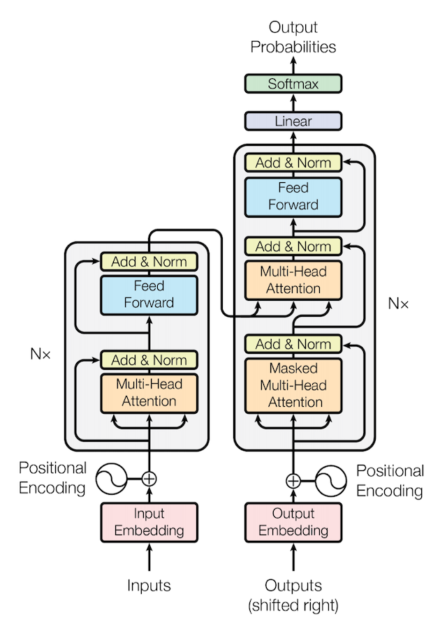
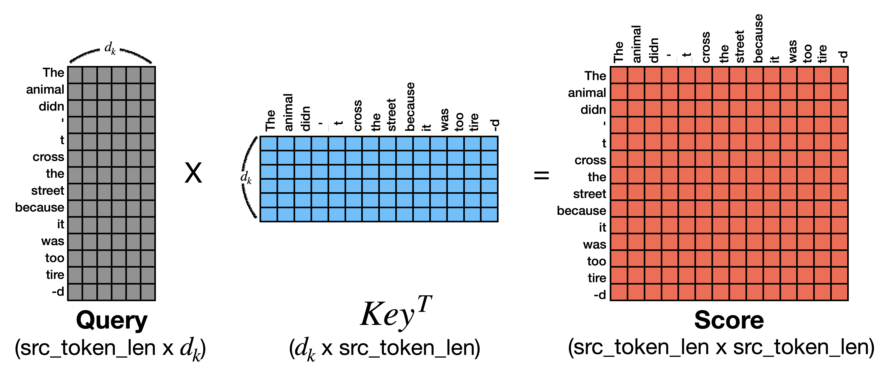
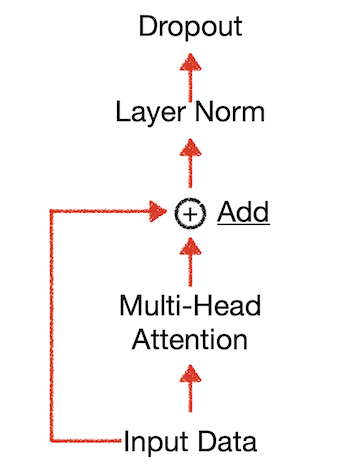
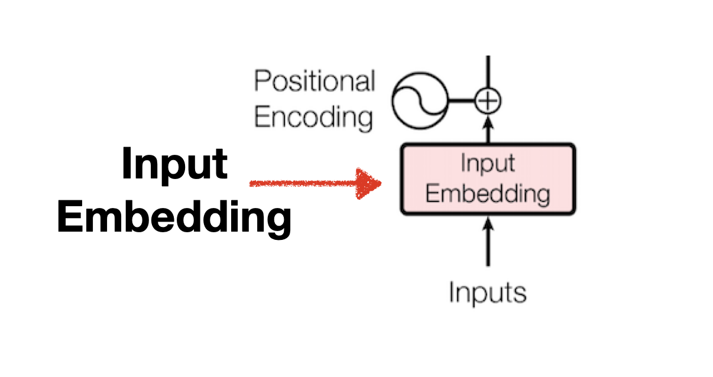
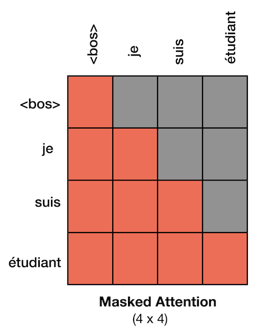
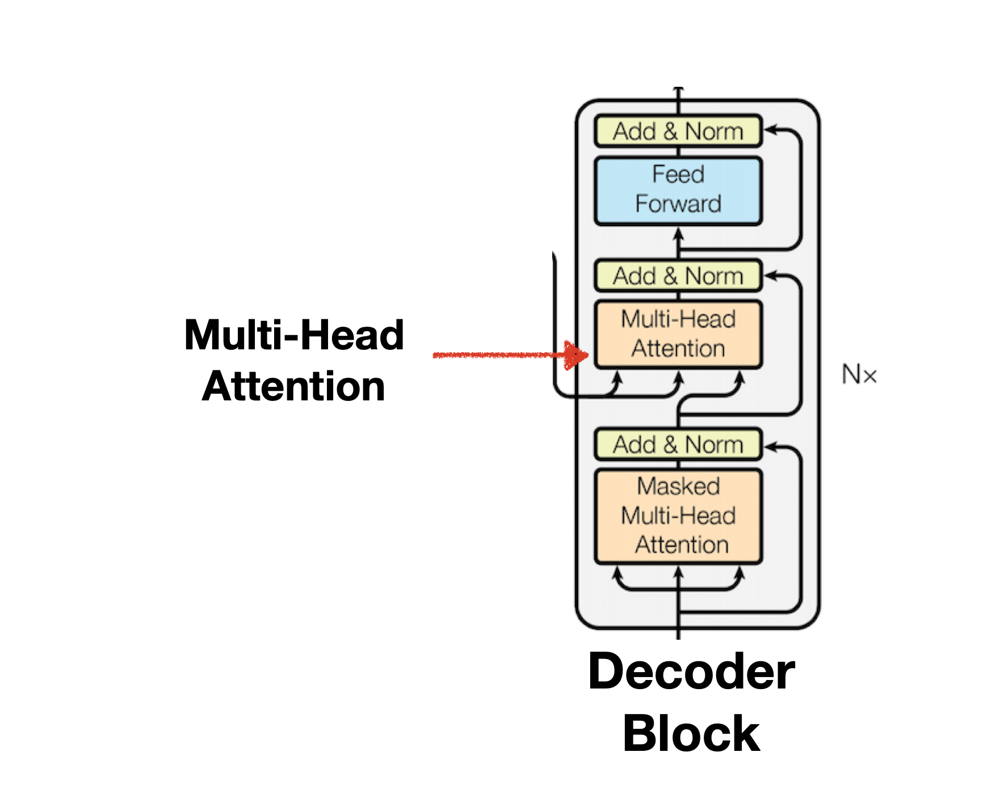
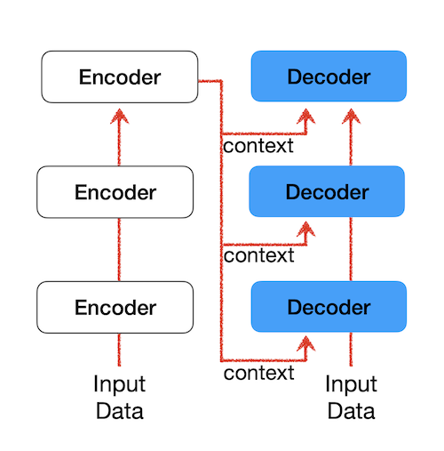
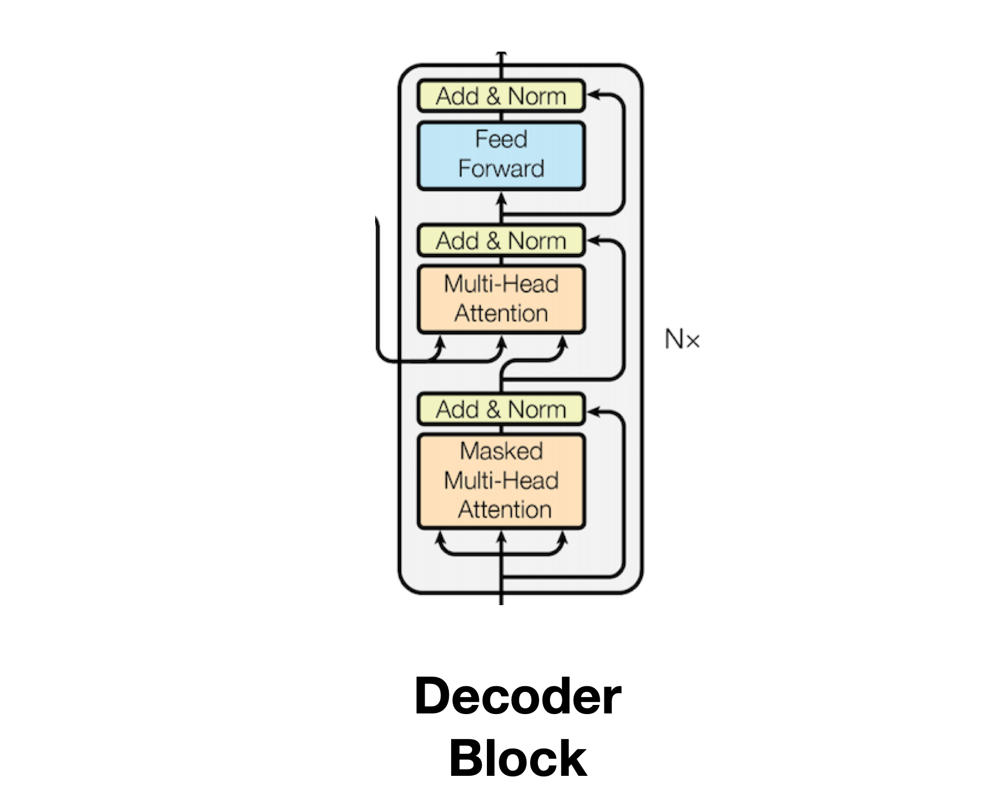
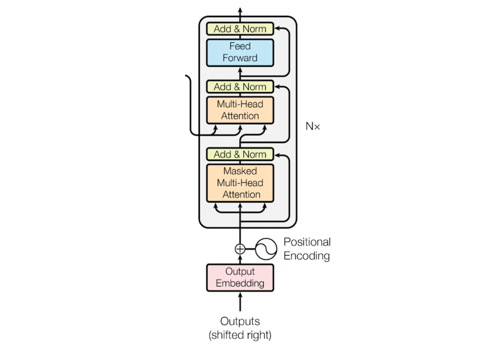

### 들어가며

이 글은 Transformer 논문의 구조를 pytorch로 구현해보며 세부적인 모델 작동 방식을 설명합니다.

> Transformer 모델을 실제 학습하는 방법에 대해 궁금하신 분들은 [학습 튜토리얼](https://github.com/yangoos57/Transformer_from_scratch)을 참고바랍니다. 링크에 연결된 튜토리얼은 아래와 같이 모델 학습 과정을 시각화하여 Transformer 모델이 실제로 어떻게 학습을 수행하는지를 확인할 수 있습니다.

    1번째 epoch 실행
    ------------------------------

    Dataset is "training"

    200번째 batch에 있는 0번째 문장 예측 결과 확인

    src(프랑스어) :  Un homme en uniforme orange pose au milieu d' une rue .
    prd(영어 예측) :  A man in a suit shirt is in front air of the building . <eos> . . . . . . . <eos> . . <eos> . . . <eos>
    trg(실제 정답) :  A man in an orange uniform poses in the middle of a street .

<br/>

### Transformer 구조

이 글은 아래의 도식화를 부분화하여 설명합니다. 부분화 된 기능을 pytorch를 사용해 하나씩 구현해 나가면서 Transformer의 세부 작동원리를 이해하고자 합니다.



### Transformer 탄생 배경

Transformer 모델은 RNN을 사용해 Seq2seq(encoder+decoder 구조)을 구현했을 때 문장이 길어질수록 정확도가 떨어지는 문제를 해결하기 위해 고안됐습니다. RNN 구조는 문장 내 단어수가 많아질수록 뒷단에서 부분에서 시작 부분에 있는 단어들을 참조할 수 없었습니다. 이를 보완하고자하는 다양한 시도가 있었고 그 중 attention이라는 개념을 도입해 RNN을 도와 문장 내 모든 단어를 참고할 수 있는 방법이 개발 되었습니다. RNN이 문장의 모든 단어를 참고하는 경우 과부화를 유발하고 있으니 단어별 중요도를 계산한다면 과부화를 최소화할 수 있다 판단해 Attention이 개발된 것입니다.

이러한 시도는 성공적이었고 이에 더 나아가 RNN을 사용하지 않고 attention만을 사용해 Seq2Seq 구조를 구현한 Transformer 모델이 탄생했습니다. Transformer 모델은 문장의 시작 단어를 참조하지 못하는 문제 외에도 RNN의 다른 단점 하나를 극복했는데, attention만으로 seq2seq 모델을 구현함으로써 RNN에서는 할 수 없는 병렬 연산이 가능해졌다는 것입니다. 이러한 장점으로 인해 Transformer는 사실상 NLP 모델의 표준으로 자리잡게 됐습니다.

> 현재 활용되고 있는 Bert 모델이나 GPT 모델은 모두 Transformer에서 파생된 모델입니다. 그러므로 Transformer를 이해한다면 NLP 모델의 핵심 축인 Bert, GPT 또한 자연스럽게 이해할 수 있습니다.

## Encoder

Input 구조를 설명하기 전에 Transformer의 핵심인 Encoder 구조와 Decoder 구조를 먼저 살펴보도록 하겠습니다. Encoder 내부 구조는 Multi-head Attention와 Feed Forward로 구성되어 있으며 개별 과정을 반복 수행하다보면 발생할 수 있는 기울기 소실(Gradient Vanishing)을 막기위해 Add & Norm을 구성하고 있습니다. 내부의 layer들을 수행한 Input Data는 다시 윗단의 Encoder의 Input Data로 활용되게 되며, 이러한 과정을 여러차례 반복한 Input Data는 궁극적으로 Decoder 구조의 Context로서 활용됩니다. Context에 대한 설명은 Decoder 문단에서 설명하겠습니다.


## Multi-head Attention

Encoder 구조의 첫번째 구성요소인 Multi-head-Attention은 여러 개의 Self-Attention을 합친 구조를 의미합니다. 이때 모델에서 사용할 Attention 개수를 설정하는 인자(args)를 Head라고 하며 논문에서는 8개를 기본으로 사용합니다. Multi-head Attention은 Self-Attention 8개를 연결한 것에 불과한 개념이므로 Self-Attention을 이해하는 것이 Multi-head Attention을 이해하는 것이라 할 수 있습니다.


### Self-Attention과 Cross-Attention

Attention은 Self-Attention, Cross-Attention으로 나눌 수 있습니다. Self-Attention은 하나의 문장 내부에 있는 Token 간 중요도를 파악하는 방법이라면 Cross-Attention은 문장과 문장 간의 Token을 비교하는 방법입니다. Transformer는 두 종류의 Attetion을 각각 Encoder, Decoder 단에서 사용하는데, Self-Attetnion은 Encoder 내부의 Multi-head attention에서, Cross-Attention은 Decoder 내부의 Multi-head Attention에서 활용됩니다.

### Multi-head Attention의 Parameter 소개

앞선 설명에서 Multi-head Attention은 여러 개의 Self-Attention을 합친 것을 의미한다고 설명했습니다. 병렬 연산으로 한번에 n개의 Self-Attention을 계산하고 이를 합치면(concatenation) Mulit-head Atention이 되는 것입니다. Multi-head Attention에서 사용되는 Parameter는 Self-Attention의 개수를 의미하는 Attention Head와 개별 Self-Attention의 embedding_size입니다.

논문에서 사용한 Attention Head의 기본값은 8이며 Self-Attention의 embedding_size는 64입니다. Self-Attention의 embedding_size를 구하는 방법은 모델의 embedding_size를 Attention Head로 나눈 값으로, 논문에서 설정한 모델의 기본 embedding_size 인 512와 Attention head의 수인 8을 나누어 64라른 결과를 얻게 됩니다.

### Multi-head Attention 구하기

Multi-head Attention에 대한 기본적인 설명을 마쳤으니 Attention을 구하는 방법에 대한 설명으로 넘어가겠습니다. 이번 문단에서 설명하는 Attention 구하는 방법은 다음 문단에서 그대로 코드로 구현되니 참고하여 읽으면 Attention에 대해 더욱 쉽게 이해할 수 있습니다.

### scaled dot product Attention을 구하는 6단계

**Attention 공식**

$Attention(Q,K,V)= \mathrm{softmax} \left( \frac{Q K^\text{T}}{\sqrt{d_k}} \right) V$

**Q** : Query Vector,&nbsp; **K** : Key Vector,&nbsp; **V** : Value Vector,&nbsp; **${d_k} $** : Self-Attention 크기(64)

#### ❖ Step 1: Create three vectors(Q,K,V) from each of the encoder’s input vectors

Attention이 문장 내 토큰의 중요도를 계산하는 방식은 검색 시스템을 모방한 것이라고 합니다. 예로들어 사용자가 구글 검색을 한다면, 검색에 활용한 단어 또는 문장과 같은 기능은 query에 대응되고, 페이지 제목, 설명, 태그와 같이 검색에 활용되는 index는 key에 대응되며, 검색을 통해 얻은 결과는 Value에 대응됩니다.

Attention을 구하기 위해 필요한 Query, Key, Value는 Encoder의 Input Data를 바탕으로 생성됩니다. Encoder의 Input Data에 대한 tensor 차원은 (N_Batch, token_len, embedding_size) 입니다. 이러한 차원을 가진 Input Data는 (N_Batch, token_len, head, d_k)로 reshape 됩니다.(head \* d_k = embedding size) 이때 Encoder의 Attention은 Self-Attention이므로 Query, Key, Value 모두 Input Data로 부터 만들어집니다. 따라서 Query, Key, Value는 이름만 같을 뿐 내용은 동일합니다.

> Input data의 Tensor 차원이 (N_Batch, token_len, embedding_size)되는 이유는 Transformer가 한 번에 여러개의 문장을 처리하고(N_batch) 개별 문장은 여러 개의 token을 갖고 있으며(token_len), 개별 단어는 embedding_size로 표현되기 때문입니다. 예로들어 8개의 문장을 병렬로 학습하고, 8개 문장 중 최대 token 개수가 20이고, 단어의 embedding_size를 512로 표현한다면 Input data는 (8,20,512)의 차원을 가진 Tensor가 되는 것입니다.

<br/>

#### ❖ Step 2: Calculate a score

앞서 Attention이 단어간 중요도를 파악하는 방식은 검색 엔진을 모방했다고 말씀드렸습니다. Score을 구하는 과정은 검색엔진이 query와 index를 비교해 어떤 내용을 수집할지를 판단하는 과정과 유사합니다. Attention Token 하나와 문장 전체의 연관성을 비교하는 방법으로 Score을 구합니다. 이때 문장 내 모든 토큰이 한번씩 Query 역할을 수행하므로 모든 Token에 대한 Score을 구합니다.

문장 `The animal didn't cross the street because it was too tired.`을 예로 들어 Score를 계산해 보겠습니다. 실제 연산은 (N_batch, token_len, head, d_k) 차원으로 계산해야하지만 연산을 간단히 하고 이해를 돕기위해 token_len과 d_k만 활용하도록 하겠습니다. 아래 그림처럼 Query와 Key는 (token_len, d_k)의 차원을 가진다고 가정하겠습니다. 이제 query와 key를 통해 score를 구하면 score의 차원은 (token_len \* token_len)이 됩니다. score의 개별 값은 단어와 단어 간 score이 되는데, score의 (0,0)의 경우 the와 the의 score 값이 됩니다.

  

<br/>

#### ❖ Step 3: Divide the score by $\sqrt{d_k}$

score의 절대적인 크기를 감소시키기 위해 Score을 $\sqrt{d_k}$ 나눕니다. Score을 $\sqrt{d_k}$로 나눠야 하는 이론적인 근거는 없고 경험적으로 봤을 때 더 나은 성능을 보장하기 때문에 사용한다고 합니다.

<br/>

#### ❖ Step 4: Pass the result through a softmax operation

이제 score을 0 ~ 1 사이로 조정하기 위해 softmax를 사용합니다. 조정이 끝난 score들은 query와 연관성 높은 key일수록 1에 근접한 값을, 낮을수록 0에 근접한 값을 부여받게 됩니다.

<br/>

#### ❖ Step 5: Multiply each value vector by the softmax score

개별 score는 0 ~ 1 사이의 값을 갖고 있습니다. score과 value를 곱해 얻은 결과인 Attention은 단어 별 가중치가 반영된 embedding이라 할 수 있습니다.

  

  <br/>

#### ❖ Step 6 : Sum up the weighted value vector which produces the output of the self-attention layer at this position

지금까지 Step 1 ~ 5를 통해 얻은 결과는 (token_len, d_k) 차원의 Self-Attention입니다. 여러 번 언급했듯 Self-Attention을 병합한 것이 Multi-head Attention이 므로 앞선 방법과 동일하게 7개의 Self-Attention을 구한 뒤 병합(concatenation)하면 Multi-head Attention이 됩니다.

Query, Key, Value는 Input data로 만들어진다고 설명한 바 있습니다. (8,20,512)의 차원을 가진 Input Data를 Query, Key, Value로 만들면 각각은 (8,20,8,64)가 됩니다. Step 1 ~ 5에서 설명한 예시는 이해를 돕기위해 (8,20,8,64)차원의 예시를 (20,64)으로 간단하게 변경한 것입니다. Step 1 - 5의 실제 과정에 사용된 데이터 차원은 실제로는 (1,20,1,64)입니다. 이는 8개 Self-Attention 중 고작 하나의 Self-Attention을 구한 것에 불과하므로 나머지 7개의 Self-Attenion을 구한 다음 병합해야 `The animal didn't cross the street because it was too tired.`의 Multi-head Attention을 구한 것이라 할 수 있습니다. (물론 실제 Multi-head-Attention 연산은 병렬로 진행됩니다.)

<br/>

### Multi-head Attention 구현하기

```python
import torch
import torch.nn as nn

class selfAttention(nn.Module):
    def __init__(self, embed_size, heads) -> None:
        """
        config 참고
        embed_size(=512) : embedding 차원
        heads(=8) : Attention 개수
        """
        super().__init__()
        self.embed_size = embed_size  # 512
        self.heads = heads  # 8
        self.head_dim = embed_size // heads  # 개별 attention의 embed_size(=64)

        # Query, Key, Value
        self.query = nn.Linear(self.head_dim, self.head_dim, bias=False)  # 64 => 64
        self.key = nn.Linear(self.head_dim, self.head_dim, bias=False)  # 64 => 64
        self.value = nn.Linear(self.head_dim, self.head_dim, bias=False)  # 64 => 64

        # 8개 attention => 1개의 attention으로 생성
        self.fc_out = nn.Linear(heads * self.head_dim, embed_size)  # 8 * 64 => 512

    def forward(self, value, key, query, mask):
        """
        query, key, value size : (N, seq_len, embed_size)
        - N_batch = 문장 개수(=batch_size)
        - seq_len : 훈련 문장 내 최대 token 개수
        - embed_size : embedding 차원
        """

        N_batch = query.shape[0]  # 총 문장 개수
        value_len = value.shape[1]  # token 개수
        key_len = key.shape[1]  # token 개수
        query_len = query.shape[1]  # token 개수

        # n : batch_size(=128)
        # h : heads(=8)
        # value,key,query_len, : token_len
        # d_k : embed_size/h(=64)

        value = value.reshape(
            N_batch, self.heads, value_len, self.head_dim
        )  # (n, h, value_len, d_k)
        key = key.reshape(
            N_batch, self.heads, key_len, self.head_dim
        )  # (n x h x key_len x d_k)
        query = query.reshape(
            N_batch, self.heads, query_len, self.head_dim
        )  # (n x h x query_len x d_k)

        # Q,K,V 구하기
        V = self.value(value)
        K = self.key(key)
        Q = self.query(query)

        # score = Q dot K^T
        score = torch.matmul(Q, K.transpose(-2, -1))
        # query shape : (n, h, query_len, d_k)
        # transposed key shape : (n, h, d_k, key_len)
        # score shape : (n, h, query_len, key_len)

        if mask is not None:
            score = score.masked_fill(mask == 0, float("-1e20"))
            """
            mask = 0 인 경우 -inf(= -1e20) 대입
            softmax 계산시 -inf인 부분은 0이 됨.
            """

        # attention 정의

        # d_k로 나눈 뒤 => softmax
        d_k = self.embed_size ** (1 / 2)
        softmax_score = torch.softmax(score / d_k, dim=3)
        # softmax_score shape : (n, h, query_len, key_len)

        # softmax * Value => attention 통합을 위한 reshape
        out = torch.matmul(softmax_score, V).reshape(
            N_batch, query_len, self.heads * self.head_dim
        )
        # softmax_score shape : (n, h, query_len, key_len)
        # value shape : (n, h, value_len, d_k)
        # (key_len = value_len 이므로)
        # out shape : (n, h, query_len, d_k)
        # reshape out : (n, query_len, h, d_k)

        # concat all heads
        out = self.fc_out(out)
        # concat out : (n, query_len, embed_size)

        return out

```

### Add & Normalization


add를 하는 이유는 gradient vanishing(gradient descent가 0이 되는 현상)을 방지하기 위함이며 일반적으로 residual connection라는 용어로 불립니다. residual connection을 수식으로 표현하면 다음과 같습니다.

- y = f(x) + x (x는 input f(x)는 layer의 ouput)

Normalization을 하는 이유는 gradient가 exploding하거나 vanishing하는 문제를 완화시키고 gradient 값이 안정적인 값을 가지게 하여 빠른 학습을 보장받기 위함이라고 합니다.

최종적으로 Dropout을 수행해 개별 Node가 골고루 학습되도록 합니다.

  

### position-wise Feed Forward Neural Network(FFNN)


- Transformer는 ReLU를 activation function으로 사용합니다. FFNN은 Linear(512d,2048d)-> ReLU(2048d) -> Linear(2048d, 512d)의 Position-Wise한 구조로 이뤄집니다.

  
  <figcaption>Jay Alammar, The Illustrated Transformer</figcaption>

### Encoder Block 구현


```python
class EncoderBlock(nn.Module) :
    class EncoderBlock(nn.Module):
    def __init__(self, embed_size, heads, dropout, forward_expansion) -> None:
        """
        config 참고
        embed_size(=512) : embedding 차원
        heads(=8) : Attention 개수
        dropout(=0.1): Node 학습 비율
        forward_expansion(=2) : FFNN의 차원을 얼마나 늘릴 것인지 결정,
                                forward_expension * embed_size(2*512 = 1024)
        """
        super().__init__()
        # Attention 정의
        self.attention = selfAttention(embed_size, heads)

        ### Norm & Feed Forward
        self.norm1 = nn.LayerNorm(embed_size)  # 512
        self.norm2 = nn.LayerNorm(embed_size)  # 512

        self.feed_forawrd = nn.Sequential(
            # 512 => 1024
            nn.Linear(embed_size, forward_expansion * embed_size),
            # ReLU 연산
            nn.ReLU(),
            # 1024 => 512
            nn.Linear(forward_expansion * embed_size, embed_size),
        )
        self.dropout = nn.Dropout(dropout)

    def forward(self, value, key, query, mask):

        # self Attention
        attention = self.attention(value, key, query, mask)
        # Add & Normalization
        x = self.dropout(self.norm1(attention + query))
        # Feed_Forward
        forward = self.feed_forawrd(x)
        # Add & Normalization
        out = self.dropout(self.norm2(forward + x))
        return out
```

## Input Embedding과 Positional Encoding

- Input Embedding + Positional encoding은 첫번째 Encoder Block의 Input Data로 활용됩니다.

### Input Embedding



- Embedding은 벡터 공간 내 단어의 position을 특정 차원 내에 표현하여 단어의 유사도, 연관성 등을 파악할 수 있는 방법입니다. Transfromer 논문에서는 512차원을 기본 Embedding으로 사용합니다.

### Positional Embedding


RNN 방식의 모델은 단어를 순차적으로 학습했으므로 단어가 나오는 순서에 대한 패턴 또한 학습 할 수 있었습니다. 하지만 병렬연산이 가능한 Transformer에서는 단어 순서를 통해 얻을 수 있는 패턴을 학습할 기회가 사라졌고 이를 보완하기 위해 Input Embedding에 단어 간 거리를 나타내는 Positional Embedding을 더하여 사용하고 있습니다.

### Pad에 대해 Masking하기

- Pad라는 개념은 Encoder와 Decoder에 각각 한 번씩 등장합니다. 방법은 동일하나 활용 목적에 차이가 있습니다. Encoder에서 Masking을 쓰는 이유는 모든 모든 문장의 토큰 개수를 통일하기 위해 pad 토큰을 사용하기 때문입니다. 8개의 문장을 한 번에 학습한다고 생각할 때 8개 문장의 개별 토큰의 개수는 일반적으로는 모두 상이합니다. 어떤 문장은 20개의 토큰으로 구성되고 어떤 문장은 8개의 토큰으로 구성될 수 도 있다는 의미입니다. 문장별로 각각 토큰 개수가 다르다는 것은 하나로 통일 해야함을 의미합니다. 삐죽빼죽한 행렬은 존재하지 않으니까요.

Masking은 Pad 토큰이 Attention 계산에 활용되지 않도록 하는데 목표가 있습니다. Pad에 -inf를 부여하면 Attention 계산 과정 중 Step 4 softmax를 하는 단계에서 모두 0이 되므로 Value 계산 시 해당 Pad의 값이 모두 0 이 됩니다.

````python
  def make_pad_mask(self, query, key):
      """
      Multi-head attention pad 함수
      """
      len_query, len_key = query.size(1), key.size(1)

      key = key.ne(self.src_pad_idx).unsqueeze(1).unsqueeze(2)
      # (batch_size x 1 x 1 x src_token_len) 4

      key = key.repeat(1, 1, len_query, 1)
      # (batch_size x 1 x len_query x src_token_len) 4

      query = query.ne(self.src_pad_idx).unsqueeze(1).unsqueeze(3)
      # (batch_size x 1 x src_token_len x 1) 4

      query = query.repeat(1, 1, 1, len_key)
      # (batch_size x 1 x src_token_len x src_token_len) 4

      mask = key & query
      return mask

    ```
````

### Encoder 구현(= Encoder x num_layers)


```python
class Encoder(nn.Module):
    def __init__(
        self,
        src_vocab_size,
        embed_size,
        num_layers,
        heads,
        forward_expansion,
        dropout,
        max_length,
        device,
    ) -> None:
        """
        config 참고
        src_vocab_size(=11509) : input vocab 개수
        embed_size(=512) : embedding 차원
        num_layers(=3) : Encoder Block 개수
        heads(=8) : Attention 개수
        device : cpu;
        forward_expansion(=2) : FFNN의 차원을 얼마나 늘릴 것인지 결정,
                                forward_expension * embed_size(2*512 = 1024)
        dropout(=0.1): Node 학습 비율
        max_length : batch 문장 내 최대 token 개수(src_token_len)
        """
        super().__init__()
        self.embed_size = embed_size
        self.device = device

        # input + positional_embeding
        self.word_embedding = nn.Embedding(src_vocab_size, embed_size)  # (11509, 512) 2

        # positional embedding
        pos_embed = torch.zeros(max_length, embed_size)  # (src_token_len, 512) 2
        pos_embed.requires_grad = False
        position = torch.arange(0, max_length).float().unsqueeze(1)
        div_term = torch.exp(
            torch.arange(0, embed_size, 2) * -(math.log(10000.0) / embed_size)
        )
        pos_embed[:, 0::2] = torch.sin(position * div_term)
        pos_embed[:, 1::2] = torch.cos(position * div_term)
        self.pos_embed = pos_embed.unsqueeze(0).to(device)  # (1, src_token_len, 512) 3

        # Encoder Layer 구현
        self.layers = nn.ModuleList(
            [
                EncoderBlock(
                    embed_size,
                    heads,
                    dropout=dropout,
                    forward_expansion=forward_expansion,
                )
                for _ in range(num_layers)
            ]
        )
        # dropout
        self.dropout = nn.Dropout(dropout)

    def forward(self, x, mask):
        _, seq_len = x.size()  # (n, src_token_len) 2
        # n : batch_size(=128)
        # src_token_len : batch 내 문장 중 최대 토큰 개수

        pos_embed = self.pos_embed[:, :seq_len, :]
        # (1, src_token_len, embed_size) 3

        out = self.dropout(self.word_embedding(x) + pos_embed)
        # (n, src_token_len, embed_size) 3

        for layer in self.layers:
            # Q,K,V,mask
            out = layer(out, out, out, mask)
        return out
```

## Decoder

Decoder 구조와 Encoder 구조는 거의 유사합니다. 차이가 있다면 Encoder에 있는 Layer 외에도 Masked Multi-head Attention이 추가되며, Multi-head Attention에서 encoder 과정에서 확보한 최종 결과값(Context)을 Key와 Value로 활용합니다. Decoder 또한 Encoder와 마찬가지로 Input Data를 활용하는데, 이때 Encoder 단에서 쓰이는 Input Data와 구분되는 Input Data 이어야 합니다. 불어(🇫🇷) -> 영어(🇺🇸) 번역 모델을 예로들면 Enoder는 불어 Input Data를, Decoder는 영어 Input Data를 사용해야합니다.

Decoder 문단은 Encoder에서 설명한 구조를 생략하고 Encoder 없는 구조와 특징을 위주로 설명하도록 하겠습니다.

### Masked Mulit-head Attention


Mask는 Encoder와 Decoder에서 한 번씩 사용되며 수행 방법은 동일하나 사용하는 목적은 다릅니다. Encoder에서는 Masking을 모델이 Pad를 학습하지 않게하기 위해 사용했다면, Decoder는 `Teacher Forcing`을 병렬로 수행하기 위해 Mask를 사용합니다. 영불 번역기를 만든다고 생각할 때 Encoder 내부의 Mask 함수는 불어 문장 Input 내 존재하는 Pad에 대해 Masking을 수행하며 Decoder는 영어 문장 Input을 활용해 Teacher Forcing 수행에 필요한 교본을 만들기 위해 Masking을 사용합니다.

Teacher Forcing은 기존의 RNN 구조에서 활용되는 기법이었습니다. Tranformer는 RNN으로 구현한 Seq2Seq 모델을 Attention으로 새롭게 만든 것이므로 기존의 RNN에서 수행했던 학습 방법과 동일하게 모델을 학습시킵니다. RNN의 학습은 이전에 예측한 값을 기반으로 새로운 에측을 수행하며 학습합니다. `Je suis étudiant → I am a studient`을 학습하고자 경우, 이전 문장이 `<sos> I ` 이라면 이 문장을 기반으로 다음 단어를 예측하는 학습을 수행하는 것입니다. 하지만 이러한 방법은 예측이 틀릴 경우 다음 단어에 예측할 단어에도 영향을 주게되어 결과적으로 잘못된 학습을 수행하는 위험이 있습니다. 모델이 `<sos> I is`라 예측했을 때 바로잡지 않고 계속해서 학습을 이어나간다면 잘못된 내용을 학습시키는 것입니다.

이러한 문제를 막고자 정답인 am을 모델이 예측하지 못하더라도 다음 번 예측은 원래 정답인 `<sos> I am`을 통해 다음에 올 단어 예측을 수행하도록 합니다. 이러한 RNN 모델 학습 방법을 Teacher Forcing이라 하며, 이를 통해 모델의 예측이 틀릴지라도 학습에 영향을 주지 않을 수 있으며 모든 단어를 예측할 기회를 제공할 수 있게 됩니다.

다시 본론으로 넘어가 Masking을 Teacher Forcing에 필요한 교본을 만들기 위해 활용한다는 말은 무슨 의미일까요?

이는 Transformer가 병렬적으로 학습이 가능하기 때문에 비롯합니다. RNN은 문장 하나를 학습할 때 Token을 하나 하나 예측하는 방법으로 진행했다면 Transformer는 병렬로 진행합니다. 모델 학습 과정에서는 Teacher forcing을 사용하므로 이전 예측은 다음 예측에 영향을 주지 않습니다. 이는 모델 예측이 독립적으로 진행된다는 의미이며 이를 수행하기 위해서는 모델이 개별 단어를 학습 할 수 있도록 불필요한 단어를 제거해야함을 의미합니다. 따라서 Masking을 활용해 학습에 활용될 데이터를 아래와 같이 생성해야합니다.

  

- **주의! Decoder Masked Mulit-head attention에서 수행하는 Masking은 모델 학습에만 사용됩니다. 실전에서는 가릴 내용이 존재하지 않으므로 사용하지 않습니다.**

```python

    def make_trg_mask(self, trg):
        """
        Masked Multi-head attention pad 함수
        """
        # trg = triangle
        N, trg_len = trg.shape
        trg_mask = torch.tril(torch.ones((trg_len, trg_len))).expand(
            N, 1, trg_len, trg_len
        )
        return trg_mask.to(self.device)
```

### Multi-head Attention에서 Context 활용



Decoder와 Encoder의 Multi-head Attention 구조는 동일하나 Input Data에 차이가 있습니다. 아래 그림을 보면 Encoder 끝단에서 이어진 화살표가 모든 Decoder의 Input Data로 들어감을 확인 할 수 있습니다. 이때 Masked Multi-head Attention에서 학습한 값도 Multi-head Attention에 함께 Input Data로서 받는 것을 확인 할 수 있습니다. 즉 두 개의 문장이 Decoder의 Multi-head Attetnion으로 활용되는 것입니다. Self-Attention과 Cross-Attention 문단에서 설명했듯 두 개의 문장이 들어가므로 Decoder의 Multi-head Attetnion은 Cross Attention입니다.



Decoder의 Multi-head Attention은 Encoder의 Context와 Decoder의 Masked Mulit-head Attention의 output을 결합하는 중요한 과정입니다. Encoder의 결과값을 Context라 부르는 이유는 N개의 Encoder를 거치면서 문장 내 토크들의 서로간 관계가 복잡하게 녹아들어갔기 때문에 문장의 문맥을 담았다는 의미에서 사용됩니다.

Decoder의 Multi-head Attetnion은 Context에서 Key,Value를, Masked Multi-head Attention의 output에서 Query를 추출하여 연산을 수행하며, 개별 query를 context의 key로 Score를 구한 뒤 최종 Attention을 구함으로서 문맥 정보를 포함한 번역이 가능하게 되는 것입니다. 다음과 같이 Score을 구하게 되면 영어 문장과 불어 문장 간 관계 파악를 파악할 수 있으며 이를 Softmax한 뒤 Value로 곱하여 특정 불어 단어에 집중해야할 영어 단어들을 확보할 수 있습니다.


### Decoder Block 구현



```python
class DecoderBlock(nn.Module):
    def __init__(self, embed_size, heads, dropout, forward_expansion) -> None:
        """
        config 참고
        embed_size(=512) : embedding 차원
        heads(=8) : Attention 개수
        dropout(=0.1): Node 학습 비율
        forward_expansion(=2) : FFNN의 차원을 얼마나 늘릴 것인지 결정,
                                forward_expension * embed_size(2*512 = 1024)
        """
        super().__init__()
        self.norm = nn.LayerNorm(embed_size)
        self.attention = selfAttention(embed_size, heads=heads)
        self.encoder_block = EncoderBlock(embed_size, heads, dropout, forward_expansion)
        self.dropout = nn.Dropout(dropout)

    def forward(self, x, value, key, src_trg_mask, target_mask):
        """
        x : target input with_embedding (n, trg_token_len, embed_size) 3
        value, key : encoder_attention (n, src_token_len, embed_size) 3
        """

        # masked_attention
        attention = self.attention(x, x, x, target_mask)
        # (n, trg_token_len, embed_size) 3

        # add & Norm
        query = self.dropout(self.norm(attention + x))

        # encoder_decoder attention + feed_forward
        out = self.encoder_block(value, key, query, src_trg_mask)
        # (n, trg_token_len, embed_size) 3

        return out

```

### Decoder 구현



```python
class Decoder(nn.Module):
    def __init__(
        self,
        trg_vocab_size,
        embed_size,
        num_layers,
        heads,
        forward_expansion,
        dropout,
        max_length,
        device,
    ) -> None:
        """
        config 참고
        trg_vocab_size(=10873) : input vocab 개수
        embed_size(=512) : embedding 차원
        num_layers(=3) : Encoder Block 개수
        heads(=8) : Attention 개수
        forward_expansion(=2) : FFNN의 차원을 얼마나 늘릴 것인지 결정,
                                forward_expension * embed_size(2*512 = 1024)
        dropout(=0.1): Node 학습 비율
        max_length : batch 문장 내 최대 token 개수
        device : cpu
        """
        super().__init__()
        self.device = device

        # 시작부분 구현(input + positional_embeding)
        self.word_embedding = nn.Embedding(trg_vocab_size, embed_size)  # (10837,512) 2

        # positional embedding
        pos_embed = torch.zeros(max_length, embed_size)  # (trg_token_len, embed_size) 2
        pos_embed.requires_grad = False
        position = torch.arange(0, max_length).float().unsqueeze(1)
        div_term = torch.exp(
            torch.arange(0, embed_size, 2) * -(math.log(10000.0) / embed_size)
        )
        pos_embed[:, 0::2] = torch.sin(position * div_term)
        pos_embed[:, 1::2] = torch.cos(position * div_term)
        self.pos_embed = pos_embed.unsqueeze(0).to(device)
        # (1, trg_token_len, embed_size) 3

        # Decoder Layer 구현
        self.layers = nn.ModuleList(
            [
                DecoderBlock(embed_size, heads, dropout, forward_expansion)
                for _ in range(num_layers)
            ]
        )
        self.dropout = nn.Dropout(dropout)

    def forward(self, x, enc_src, src_trg_mask, trg_mask):
        # n : batch_size(=128)
        # trg_token_len : batch 내 문장 중 최대 토큰 개수

        _, seq_len = x.size()
        # (n, trg_token_len)

        pos_embed = self.pos_embed[:, :seq_len, :]
        # (1, trg_token_len, embed_size) 3

        out = self.dropout(self.word_embedding(x) + pos_embed).to(self.device)
        # (n, trg_token_len, embed_size) 3

        for layer in self.layers:
            # Decoder Input, Encoder(K), Encoder(V) , src_trg_mask, trg_mask
            out = layer(out, enc_src, enc_src, src_trg_mask, trg_mask)
        return out


```

## Linear FC layer & Softmax


<br/>

이렇게 여러번의 Decoder를 거친 결과의 Shape은 (N_batch x max_length x embed_size)가 됩니다. Decoder 수행을 마친 Output을 활용해 실제 영어 Text를 만들어야 하므로 Output을 영어 Vocab Size 만큼 확장시키는 과정을 거쳐야 합니다. 따라서 (N_batch x max_length x vocab_size) Shape으로의 확장을 위한 Linear FC Layer가 필요합니다. 이렇게 영어 Vocab Size만큼 확장된 embedding에 softmax를 구하면 개별 단어의 확률을 구할 수 있습니다. 그렇게 되면 가장 확률이 높은 단어가 곧 선택지 입니다.

마지막으로 Seq2Seq 모델이 문장을 예측하는 방법을 설명하겠습니다. 학습이 끝난 모델이 실제 예측을 위해서는 Decoder의 Input Data로 < sos >를 넣고 시작합니다. 이때 번역하고자 하는 불어 문장 문맥 정보가 녹아있는 Context와 Input data의 < sos >를 가지고 < sos > 다음에 올 단어를 예측합니다. 학습이 잘된 모델이라면 `I`를 산출할 것입니다. 다음 단어를 예측하는 방법도 동일합니다. Decoder Input Data에 `< sos > + I`를 넣으면 Context와 Input data를 기반으로 다음 단어를 예측합니다. 이러한 방법을 문장 종료를 의미하는 < bos >가 나올때 까지 수행합니다. 아래의 그림은 Seq2Seq 모델이 실제 Output을 산출하는 과정을 나타냅니다.


<figcaption>Jay Alammar, The Illustrated Transformer</figcaption>

## Transformer 최종 구현


```python
class Transformer(nn.Module):
    def __init__(
        self,
        src_vocab_size,
        trg_vocab_size,
        src_pad_idx,
        trg_pad_idx,
        embed_size,
        num_layers,
        forward_expansion,
        heads,
        dropout,
        device,
        max_length,
    ) -> None:
        """
        src_vocab_size(=11509) : source vocab 개수
        trg_vocab_size(=10873) : target vocab 개수
        src_pad_idx(=1) : source vocab의 <pad> idx
        trg_pad_idx(=1) : source vocab의 <pad> idx
        embed_size(=512) : embedding 차원
        num_layers(=3) : Encoder Block 개수
        forward_expansion(=2) : FFNN의 차원을 얼마나 늘릴 것인지 결정,
                                forward_expension * embed_size(2*512 = 1024)
        heads(=8) : Attention 개수
        dropout(=0.1): Node 학습 비율
        device : cpu
        max_length(=140) : batch 문장 내 최대 token 개수
        """
        super().__init__()
        self.Encoder = Encoder(
            src_vocab_size,
            embed_size,
            num_layers,
            heads,
            forward_expansion,
            dropout,
            max_length,
            device,
        )
        self.Decoder = Decoder(
            trg_vocab_size,
            embed_size,
            num_layers,
            heads,
            forward_expansion,
            dropout,
            max_length,
            device,
        )
        self.src_pad_idx = src_pad_idx
        self.trg_pad_idx = trg_pad_idx
        self.device = device

        # Probability Generlator
        self.fc_out = nn.Linear(embed_size, trg_vocab_size)  # (512,10873) 2

    def encode(self, src):
        """
        Test 용도로 활용 encoder 기능
        """
        src_mask = self.make_pad_mask(src, src)
        return self.Encoder(src, src_mask)

    def decode(self, src, trg, enc_src):
        """
        Test 용도로 활용 decoder 기능
        """
        # decode
        src_trg_mask = self.make_pad_mask(trg, src)
        trg_mask = self.make_trg_mask(trg)
        out = self.Decoder(trg, enc_src, src_trg_mask, trg_mask)
        # Linear Layer
        out = self.fc_out(out)  # (n, decoder_query_len, trg_vocab_size) 3

        # Softmax
        out = F.log_softmax(out, dim=-1)
        return out

    def make_pad_mask(self, query, key):
        """
        Multi-head attention pad 함수
        """
        len_query, len_key = query.size(1), key.size(1)

        key = key.ne(self.src_pad_idx).unsqueeze(1).unsqueeze(2)
        # (batch_size x 1 x 1 x src_token_len) 4

        key = key.repeat(1, 1, len_query, 1)
        # (batch_size x 1 x len_query x src_token_len) 4

        query = query.ne(self.src_pad_idx).unsqueeze(1).unsqueeze(3)
        # (batch_size x 1 x src_token_len x 1) 4

        query = query.repeat(1, 1, 1, len_key)
        # (batch_size x 1 x src_token_len x src_token_len) 4

        mask = key & query
        return mask

    def make_trg_mask(self, trg):
        """
        Masked Multi-head attention pad 함수
        """
        # trg = triangle
        N, trg_len = trg.shape
        trg_mask = torch.tril(torch.ones((trg_len, trg_len))).expand(
            N, 1, trg_len, trg_len
        )
        return trg_mask.to(self.device)

    def forward(self, src, trg):
        src_mask = self.make_pad_mask(src, src)
        # (n,1,src_token_len,src_token_len) 4

        trg_mask = self.make_trg_mask(trg)
        # (n,1,trg_token_len,trg_token_len) 4

        src_trg_mask = self.make_pad_mask(trg, src)
        # (n,1,trg_token_len,src_token_len) 4

        enc_src = self.Encoder(src, src_mask)
        # (n, src_token_len, embed_size) 3

        out = self.Decoder(trg, enc_src, src_trg_mask, trg_mask)
        # (n, trg_token_len, embed_size) 3

        # Linear Layer
        out = self.fc_out(out)  # embed_size => trg_vocab_size
        # (n, trg_token_len, trg_vocab_size) 3

        # Softmax
        out = F.log_softmax(out, dim=-1)
        return out


```

## 참고자료

[[hansu kim] [NLP 논문 구현] pytorch로 구현하는 Transformer (Attention is All You Need)](https://cpm0722.github.io/pytorch-implementation/transformer)

[[Jay Alammar] The Illustrated Transformer](https://jalammar.github.io/illustrated-transformer/)

[[Aimb] Self-Attention과 Masked Self-Attention](https://aimb.tistory.com/182)

[[고려대학교 산업경영공학부] 08-2: Transformer ](https://www.youtube.com/watch?v=Yk1tV_cXMMU&t=1422s)

[[Aimb] Self-Attention과 Masked Self-Attention](https://aimb.tistory.com/182)

[[딥 러닝을 이용한 자연어 처리 입문] 16-01 트랜스포머(Transformer)](https://wikidocs.net/31379)
