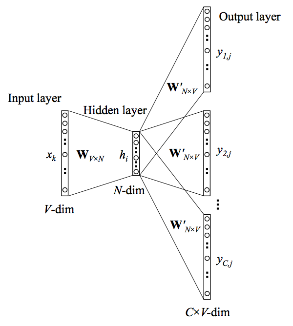
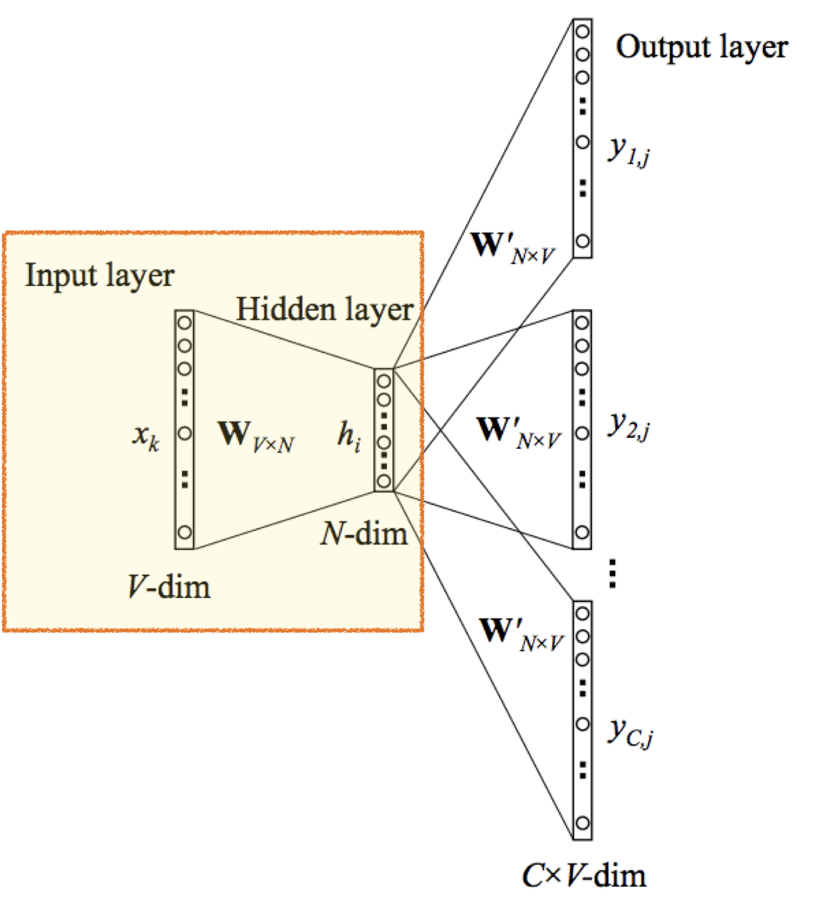
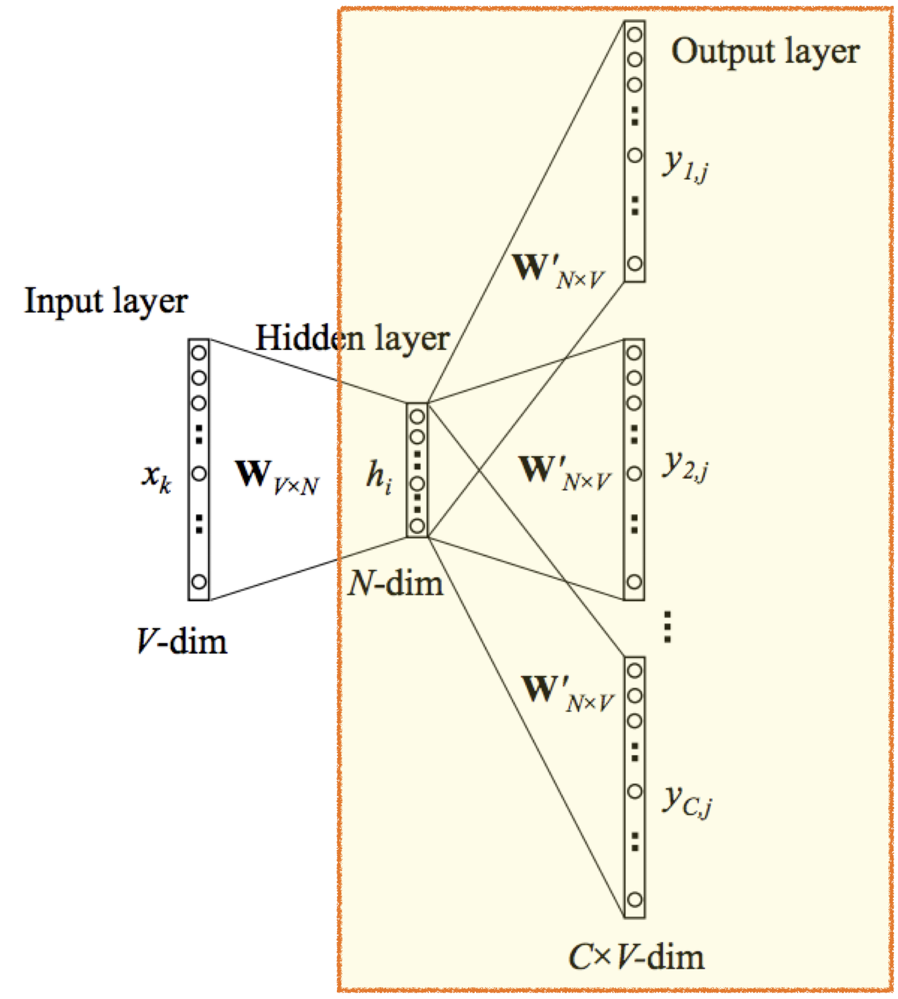

### 개요

Word2Vec의 구조에는 CBOW과 Skip-Gram이 있는데, Skip-Gram이 성능이 약간 우수하여 대부분 이 방법을 사용한다. 이 글에서도 skip-gram 방식을 나타내는 아래의 도식화를 차근차근 뜯어볼 예정이다.

 

### input data 전처리

word2vec 모델을 활용하는 목적은 단어간 유사도를 파악할 수 있는 word embedding을 구하는 것이다. w2v는 우리가 수집한 문장들의 집합(=corpus)을 input 데이터로 학습해 단어간 연관성을 vector로 표현한다.

  

아직 NLP, ML 개념이 잡히지 않은 사람이라면 input 데이터가 문장이니 그렇지 않다. 도식화된 그림에는 표현 되어있지 않지만 input 데이터를 input layer에 맞는 데이터 형태로 바꾸기 위한 전처리 과정이 필요하다. 이번 단락에서는 input 데이터인 corpus를 어떻게 input layer에 맞는 데이터 형태로 전처리 하는지에 대해 설명한다.

w2v의 input 데이터는 corpus라고 했다. corpus는 ‘나는 어제 맥북을 구매했다’와 같은 문장들이 모여 하나의 set으로 구성된다. corpus를 input layer에 맞는 데이터 형태로 전처리하기 위해서는 corpus 내 개별 문장을 단어 단위로 토큰화하고 토큰화 된 단어를 다시 숫자로 encoding하는 과정이 필요하다.

먼저 모든 문장을 토큰화해 중복 단어를 제거해 단어 리스트를 만들어야 한다. ‘나는 어제 맥북을 구매했다’라는 문장은 [나,-는,어제,맥북,-을,구매,-했다]로 토큰화 된다. 이런 방식으로 corpus 내 모든 문장을 토큰화 한 다음 하나로 모아 중복 제거를 하면 단어 리스트가 생성된다.

이제 이렇게 얻은 단어에 대해 one-hot-encoding 방식으로 encoding한다. corpus를 모드 토큰화 한 뒤 중복제거해 보니 10,000의 단어 리스트가 생성됐다고 생각해보자. one-hot encoding은 단어의 총합이 개별 단어 vector 차원이 된다. 10,000개의 단어 리스트 내 단어들의 vector는 10,000 차원이 된다. 첫 번째 단어는 [1,0,0,0…..0]으로, 두 번째 단어는 [0,1,0,0…0], 10,000번째 단어는 [0,0,0,0….1]과 같이 벡터가 부여된다.

차원을 줄이고 싶다면 중복 빈도가 n회 이하인 단어들을 제거해 리스트로 구성한다. 중복 빈도가 적을 수록 문장에 적게 나온다는 말이니 중요하지 않은 단어라 판단해 제거하는 것이다.

이제 input 데이터를 input layer에 맞는 데이터 형태로 전처리했다. 개별 단어에 부여했던 one-hot vector ([1,0,0…0])를 input layer의 데이터로 사용한다. 도식화 그림 input layer 하단에 V-dim은 단어의 벡터 차원을 의미한다. 10,000개의 단어리스트를 사용했으니 V-dim은 10,000이 된다.

 

### Input layer에서 hidden layer까지 : 특정 단어의 embedding vector를 불러온다.

이번 단락에서는 전처리된 데이터를 활용해 hidden layer를 구하는 흐름을 설명한다.

Skip-Gram은 input layer - hidden layer - output layer로 총 3개의 layer로 구성된다. 3개의 layer를 사용하므로 2개 Weight 행렬(W와 W’)이 사용된다. 차차 알아가겠지만 2개의 weight 행렬 중 첫번째 weight 행렬은 모델 학습의 최종 결과물이다. ‘input 데이터 전처리’ 단락에 있는 첫번째 그림의 output이 첫번째 weight 행렬을 의미한다.

<figure>
    
    <figcaption>V = 단어 개수, N = feature 개수(기본 값 300), C = 참고할 단어 개수(Window) </figcaption>
</figure>

 
 

‘input 데이터 전처리’ 단락에서 input layer의 데이터 형태가 one-hot-vector라고 설명했다. 개별 단어들은 one-hot-vector로 encoding 되었으며 개별 one-hot-vector의 차원은 단어의 총개수인 V라고 했다. 10,000개의 단어 리스트인 경우 개별 단어는 10,000차원을 지닌다 했다.

첫번째 Weight 행렬은 VxN 구조의 행렬이다. V는 단어의 총 개수이고 N은 차원 개수이다. N은 임의의 값으로 설정해도 무방하다. 논문에서는 300을 사용하므로 이 글에서도 N을 300으로 설정하겠다.

첫번째 Weight 행렬은 hidden layer를 계산하기 위한 weight에 활용되며 우리가 최종적으로 얻고자 하는 값이기도 하다. 개별 단어를 정해진 차원(N=300)내에서 표현하는 word embedding이 Word2Vec의 목표이기 때문이다.

 

> **Word embedding(=Distributed Representation(분산 표상))**
>
> word embedding은 단어 표현에 필요한 차원을 줄이는데 1차적 목표가 있다. one-hot encoding은 단어 개수에 비례해 차원 개수가 늘어나는 문제가 있다. 단어가 100개면 100차원, 1000개면 1000차원이 된다.하지만 차원이 커질수록 연산량이 급증하기 때문에 단어 개수를 늘리는데 한계가 있다.
>
> word embedding의 2차 목표는 단어간 유사도를 표현하기 위함이다. one-hot encoding에서 개별 단어의 내적은 0이 되므로 서로 연관성을 나타낼 수 없다. Distributed Representation는 학습을 통해 단어 간 좌표평면 상 위치를 조정하는 과정이므로 학습이 완료된 경우 단어간 유사도를 계산할 수 있다.
>
> 아래 블로그 링크를 보면 상세히 이해할 수 있으니 기억나지 않으면 들어가서 Distributed representation 부분을 읽어보자.
>
> [Neural Probabilistic Language Model](https://ratsgo.github.io/from%20frequency%20to%20semantics/2017/03/29/NNLM/)

 

hidden layer는 input layer와 첫번째 Weight 행렬을 곱셈해서 만든다. 따라서 1xV \* VxN = 1xN 행렬 구조가 된다. input layer에 쓰이는 vector는 one-hot vector이고, 첫번째 weight 행렬은 최종적으로 얻고자 하는 word embedding이라 했다. 이 둘을 곱하면 특정 단어의 embedding vector를 구할 수 있다. 그리고 그 값이 hidden layer로 활용된다.

말로서는 이해가 어려우니 예시를 들어보자. [참새, 커피, 마시다, 잡다] 라는 단어 리스트가 있다. 참새는 one-hot vector로 [1,0,0,0]으로, 커피는 [0,1,0,0]이 된다.

**one-hot vector**

참새 = [1,0,0,0], 커피 = [0,1,0,0], 잡다 = [0,0,1,0], 마시다 = [0,0,0,1]

첫번째 Weight 행렬은 학습이 끝나면 embedding 행렬로 사용한다고 했다. 학습 과정에는 hidden layer를 계산하는 용도로 사용된다고 했다. 첫번째 weight 행렬은 처음에는 임의의 값을 부여 받는다. 학습이 진행되면서 임의로 부여받은 weight 행렬 값들이 조정되고 학습이 마무리되면 조정된 Weight 행렬 값을 embedding 행렬로 사용하게 된다.

첫번째 Weight 행렬의 행은 단어개수(V) 열은 차원(N)이다. embedding 행렬에서 하나의 행은 개별 단어의 N차원 벡터의 값으로 표현한 것과 같다. 첫번째 행인 [1.2, 2.1, 3.6]은 참새를, 두번째 행인 [3.5, 2.8, 4]은 커피를 의미한다.

**첫번째 weight 행렬**

$\begin{pmatrix}
 참새\\
 커피\\
 잡다\\
마시다
\end{pmatrix} = \begin{pmatrix}1.2 & 2.1 & 3.6 \\3.5 & 2.8 & 4 \\1.2 & 0.8 & 3.0 \\4.1 & 1.7 & 2.8 \\\end{pmatrix}$

one-hot vector와 weight 행렬을 알았으니 hidden layer를 구해보자. input 값이 커피인 경우 hidden layer 계산은 아래와 같다. 행렬 곱셈의 결과값을 보면 weight 행렬에 두 번째 위치한 값과 같음을 알 수 있다. 커피의 embedding vector이다. input layer와 weight 행렬을 곱해 hidden layer를 구하는 과정은 커피의 embedding vector를 불러오는 과정으로 이해할 수 있다. 즉 hidden layer는 특정 단어의 embedding vector가 된다.

$[0,1,0,0] \times \begin{pmatrix}1.2 & 2.1 & 3.6 \\3.5 & 2.8 & 4 \\1.2 & 0.8 & 3.0 \\4.1 & 1.7 & 2.8 \\\end{pmatrix} = [3.5,2.8,4]$

 

### hidden layer에서 output layer까지 : Skip-Gram

다음으로 output layer를 구하는 단계이다. output layer은 hidden layer와 두번째 Weight 행렬을 곱해서 구한다. 도식화된 output layer를 이해하기 위해서는 skip-gram에 대해 알아야 하므로 skip gram을 설명한 뒤output layer에 대해 설명하겠다.

Skip-Gram은 학습을 위해 중심단어와 주변단어를 샘플링한다. 파란색 배경이 있는 단어가 중심단어이고 배경이 없고 윤곽만 있는 단어가 주변 단어이다. 첫번째 학습을 보면 the와 주변 단어인 quick과 brown을 샘플링한다. 이때 (the,quick), (the,brown) 형태에서 보듯 개별적으로 학습한다.

학습 절차는 다음의 순으로 진행된다. 모델은 (the,quick)을 학습한다. 모델은 the 다음에 나올 단어들의 확률을계산하기 위해 모든 단어에 대해 the 다음에 나타날 확률을 계산한다. 10,000개의 단어 리스트가 있다면 10,000개 단어 모두에 대해 the 다음에 나타날 확률을 계산한다. the 다음에 quick이 나왔다는 것을 학습시키기 위해 the 다음에 quick이 나올 확률을 올리고 나머지 확률을 낮추는 방식으로 weight를 조정한다. 같은 방식으로 (the, brown), (quick, the), (quick,brown) 을 계산한다.

아래 그림은 중심단어를 기준으로 2개의 주변 단어를 학습(Window = 2)하는 과정을 나타낸다. 1회에 학습할 단어 개수를 window라는 용어로 부른다. window가 2이면 중심단어를 기준으로 좌우 2개 단어 도합 4개의 단어를 1회 학습으로 간주한다. brown을 학습하기 위해 (brown, the), (brown, quick), (brown, fox), (brown, jumps)를 샘플링하고 학습하면 1회 학습이 완료된다. 중심 단어 기준 주변 단어를 몇 개까지 포함할 것일지에 따라 모델이 학습하는 양이 달라짐을 알 수 있다.

 

> **CBOW보다 Skip-Gram을 선호하는 이유**
>
> _Skip-Gram의 W 업데이트 횟수가 CBOW보다 많기 때문_
>
> 주변단어로 중심단어를 예측하는 CBOW에 비해 Skip-gram의 성능이 좋은 이유가 바로 여기에 있습니다. 언뜻 생각하기에는 주변의 네 개 단어(window = 2인 경우)를 가지고 중심단어를 맞추는 것이 성능이 좋아보일 수 있습니다. 그러나 CBOW의 경우 중심단어(벡터)는 단 한번의 업데이트 기회만 갖습니다.
>
> 반면 윈도우 크기가 2인 Skip-gram의 경우 중심단어는 업데이트 기회를 4번이나 확보할 수 있습니다. 말뭉치 크기가 동일하더라도 학습량이 네 배 차이난다는 이야기이죠. 이 때문에 요즘은 Word2Vec을 수행할 때 Skip-gram으로 대동단결하는 분위기입니다.
>
> [Word2Vec의 학습 방식](https://ratsgo.github.io/from%20frequency%20to%20semantics/2017/03/30/word2vec/)

 

<figure>
    
    <figcaption>V = 단어 개수, N = feature 개수(기본 값 300), C = 참고할 단어 개수(Window) </figcaption>
</figure>

 
 

도식화 그림에서 output layer는 skip-gram의 1회 학습 구조를 나타낸다. output layer는 v-dim이 C개 있는 구조로 표현되는데, C는 중심단어가 주변단어를 학습하는 횟수와 같다. window가 2인 경우 중심단어 기준 좌우 주변단어 2개에 대해 총 4번 학습하게 된다. 그래서 window가 2인 경우 C는 4가 된다. 학습은 4번 진행되지만 중심단어를 학습하는 것이 목적이므로 1회의 학습으로 간주해야한다. 도식화 그림은 이를 반영한 것이라 할 수 있다.

brown을 학습한다면 (brown, the), (brown, quick), (brown, fox), (brown, jumps) 4번의 학습이 1회 학습이된다. 도식화 그림에서 개별 학습은 $y_{ij}$ 행렬로 표현된다. (brown, the)은 첫번째 학습이므로 $y_{1j}$, (brown,quick)은 두번째 학습 이므로 $y_{2j}$가 되는 방식이다.

여기서 주의해야할 점은 output layer의 도식화 그림은 skip-gram의 학습 방법을 표현한 것이지 output layer의 행렬이 CxV 행렬이라는 의미는 아니다. output layer의 그림은 C번의 학습 과정을 나타낼 뿐 개별적으로 진행되는 과정임을 명심해야한다. (brown, the)를 학습해 weight를 조정하고 그 다음 (brown, quick)를 학습해 weight를 조정하고 그 다음은(brown, fox), 그 다음은 (brown, jumps)를 학습해 weight를 조정하면 brown의 학습이 종료되고 다음 중심단어로 넘어가 학습을 시작한다.

이러한 구조이기 때문에 $y_{ij}$ 행렬을 이해한다면 output layer를 이해할 수 있게 된다. $y_{ij}$ 행렬은 hidden layer와 두번째 weight 행렬을 곱해서 구한다.

두번째 weight 행렬도 첫번째 weight 행렬과 마찬가지로 개별 단어의 word embedding을 나타낸다. 기능은 동일하지만 첫번째 weight 행렬의 값과는 다르다. 첫번째 weight 행렬에서는 행 벡터가 개별 단어의 embedding 값을 의미했다면 두번째 weight 행렬에서는 열 벡터가 개별 단어의 embedding 값을 의미한다. 단순하게 생각해서 VxN 행렬을 NxV 행렬로 Transpose 했기 때문에 행과 열의 위치만 바뀐 것이다.

 

> 두번째 Weight 행렬의 구조를 보고 첫번째 Weight 행렬을 Transpose하면 두번째 Weight 행렬이 되는 것 아닌가 생각할 수 있다. 첫번째 weight 행렬을 Transpose 한다고 두 번째 weight 행렬이 되는건 아니라고한다. 학습이 잘됐을 땐 두 weight 행렬 중 아무 행렬이나 embedding 행렬로 사용 가능하지만 일반적으로 첫번째 W를 사용한다고 한다.
>
> [Word2Vec의 학습 방식](https://ratsgo.github.io/from%20frequency%20to%20semantics/2017/03/30/word2vec/)

 

**두번째 weight 행렬**

$\begin{pmatrix}
참새 & 커피 & 잡다 & 마시다 \\
 \end{pmatrix}$ = $\begin{pmatrix}
1.5 & 2.3 & 3.1 & 4.3 \\
 3.2 & 2.9 & 1.7 & 3.1 \\
 0.7 & 4.2 & 2.8 & 2.0 \\  \end{pmatrix}$

hidden layer와 두번째 weight 행렬을 곱하면 output layer를 구할 수 있다. hidden layer는 특정 단어의 embedding이다. 커피의 hidden layer는 커피의 embedding vector인 [3.5, 2.8, 4]이다. 두번째 weight 행렬은 word embedding을 transpose한 구조이다. (기능은 같지만 안의 실수 값은 다르다고 한다.) 아래 식과 같이 커피와 리스트 전체([참새,커피,마시다,잡다])를 곱해 output layer를 구한다.

$[3.5,2.8,4] \times \begin{pmatrix}
1.5 & 2.3 & 3.1 & 4.3 \\
 3.2 & 2.9 & 1.7 & 3.1 \\
 0.7 & 4.2 & 2.8 & 2.0 \\  \end{pmatrix}= [17.01, 32.97, 26.81, 31.73]$

이렇게 계산한 output layer에 softmax를 적용하면 커피 다음에 오는 단어의 확률을 구할 수 있다.

$\begin{pmatrix}
참새 & 커피 & 잡다 & 마시다 \\
 \end{pmatrix}$ = $[0., 0.774, 0.0016, 0.224]$

 
 
 

### 참고자료

1. [A simple Word2vec tutorial](https://medium.com/@zafaralibagh6/a-simple-word2vec-tutorial-61e64e38a6a1)

2. [Neural Probabilistic Language Model](https://ratsgo.github.io/from%20frequency%20to%20semantics/2017/03/29/NNLM/)

3. [Word2Vec의 학습 방식](https://ratsgo.github.io/from%20frequency%20to%20semantics/2017/03/30/word2vec/)

4. [Word2Vec: Out of the Black Box](https://towardsdatascience.com/word2vec-out-of-the-black-box-a404b4119681)

 
 
 
