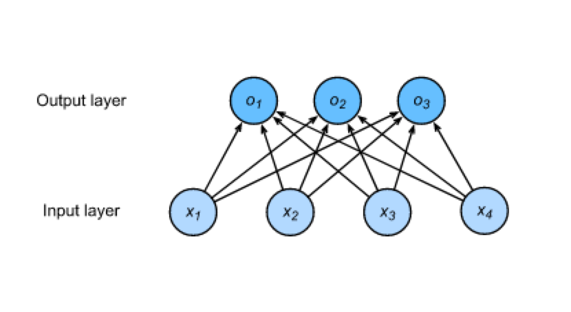
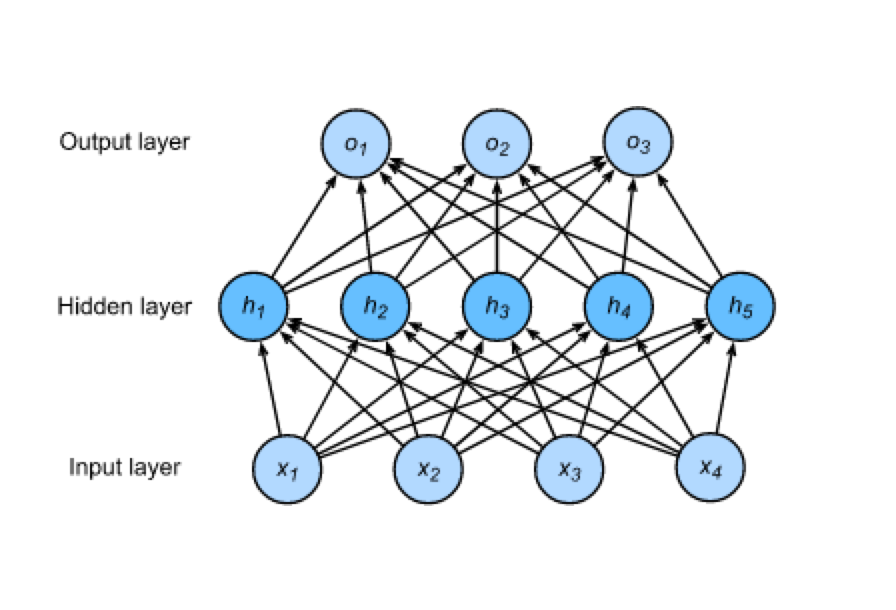
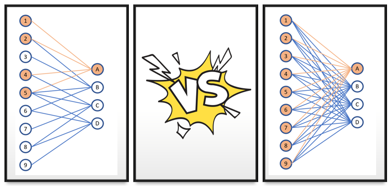
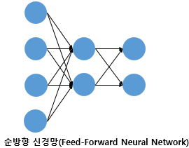
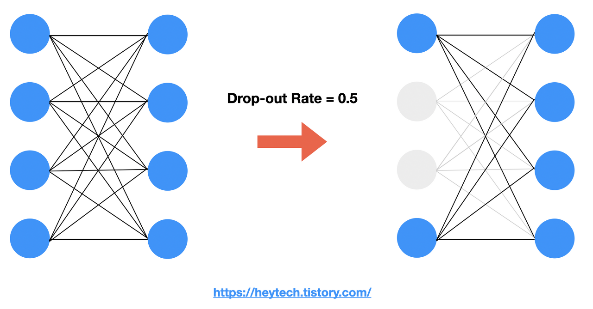
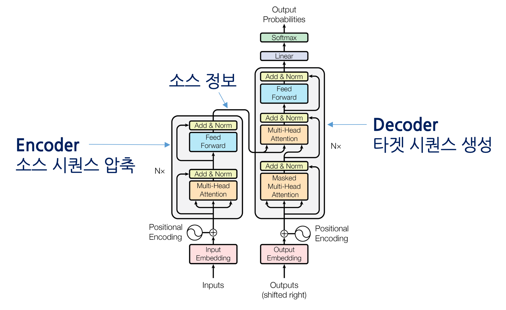

### 딥러닝 구조 이해

딥러닝 구조는 linear -> nonlinear -> linear -> ... -> nonlinear 로 반복된다. linear-nonlinear 반복 구조의 배경에는 일정 수준 이상의 신호만 결과를 출력하는 뉴럴의 구조를 모방했기 때문이다. 이러한 구조를 수학식으로 구현하기 위해서 non-linear 구조에 softmax, sigmoid, relu, gelu와 같은 함수를 이용한다. 앞선 함수들을 activation 함수라 부른다.

딥러닝은 logistic regession 모델처럼 classification 문제를 regression으로 해결하는 모델의 끝판왕이라 이해할 수 있다. logistic regression이 input과 output 하나만을 가진 구조라면 딥러닝은 output을 다시 input으로서 활용하여 반복하는 다단 구조이다.

딥러닝 구조는 다음과 같다.

하나의 linear-nonlinear 구조는 output이 2개 이상이므로 multiclass classification(다중 분류) 구조로 볼 수 있다.

예시를 들어보자. 강아지, 고양이, 닭을 구분하는 softmax regression 모델을 만든다고 생각하자. 강아지, 고양이, 닭을 구분하기 위해서는 3개의 output이 필요하다. output을 만들기 위한 함수의 변수를 보면 input인 x는 동일하나 W와 B가 다름을 알 수 있다.

$\begin{aligned}
o_1 &= softmax(x_1 w_{11} + x_2 w_{21} + x_3 w_{31} + x_4 w_{41} + b_1),\\
o_2 &= softmax(x_1 w_{12} + x_2 w_{22} + x_3 w_{32} + x_4 w_{42} + b_2),\\
o_3 &= softmax(x_1 w_{13} + x_2 w_{23} + x_3 w_{33} + x_4 w_{43} + b_3).
\end{aligned}$

> 이때 $\sum{o_n} =1$

위 식을 간단히 표현해보자.

${\mathbf{o}}^{(i)} = \mathbf{W} {\mathbf{x}}^{(i)} + {\mathbf{b}} \\
{\hat{\mathbf{y}}}^{(i)} = \mathrm{softmax}({\mathbf{o}}^{(i)})$

딥러닝은 $\hat{\mathbf{y}}^{(i)}$가 다시 input(${\mathbf{x}}^{(i)}$)으로 활용되어 $o^{(i)}$를 구하는데 활용된다.

<a href='https://ko.d2l.ai/chapter_deep-learning-basics/mlp.html'> Dive into Deep Learning </a>

---

 

### activation function

> 신경망에서는 노드에 들어오는 값들에 대해 곧바로 다음 레이어로 전달하지 않고 활성화 함수를 통과시킨 후 전달한다. 활성화 함수(activation function)는 입력 신호의 총합을 출력 신호로 변환하는 함수로, 입력 받은 신호를 얼마나 출력할지 결정하고 네트워크에 층을 쌓아 비선형성을 표현할 수 있도록 해준다.
>
> 출처 : <a href='https://heeya-stupidbutstudying.tistory.com/entry/ML-%ED%99%9C%EC%84%B1%ED%99%94-%ED%95%A8%EC%88%98Activation-Function'>[ML] 활성화 함수(Activation Function) 종류 정리</a>

An Activation Function decides _whether a neuron should be activated or not_. This means that it will decide whether `the neuron’s input to the network is important or not in the process of prediction` using simpler mathematical operations.

---

 

### layer와 Perceptron

**용어정리**

- unit : layer 안에 있는 동그라미를 부르는 용어

- input layer : layer의 개별 unit은 column을 의미한다.

- hidden layers : input, output layer를 제외한 모든 layer를 의미

- output layer : input layer와 마찬가지로 layer에 있는 하나의 값들은 column 이라고 이해하면 직관적이다. 꼭 input layer와 같은 size일 필요는 없다.

- perceptron : 여러개 값을 하나의 뉴런에 넣은 다음 하나의 output을 만드는 방법.
  

- Multi Layered Perceptron(MLP) : layer가 여러개 있는 perceptron 구조

- fully connected layer : 이전 layer와 다음 layer가 완전히 연결 된 상태를 fully connected layer라고 한다.

**Q&A**

- Q.모든 perceptron이 Fully connected Layer 구조를 가지는가?

  A. No. 아래 그림 왼편의 구조처럼 output 계산에 일부 unit만 사용하는 perceptron도 있다.
  

- Q. Multi Layer를 쓰는 이유는 ?
  A. 단층 Layer로는 XOR을 구현할 수 없기 때문, XOR 하나만 있으면 모든 대상을 구분할 수 있음.

---

 

### Feed_Fowrad_Neural_Netwrok(FFNN)

한 방향으로만 데이터가 흐르는 네트워크를 의미한다. FFNN과 반대되는 구조가 RNN 구조이다.

<a href='https://wikidocs.net/24987'> 이미지 출처 </a>

<참고자료>

<a href='https://ko.d2l.ai/chapter_deep-learning-basics/mlp.html'> Dive into Deep Learning </a>

---

 

### Dropout

- 랜덤으로 Unit을 제거하는 방법 | Unit(=feature=column) Layer 내 동그라미를 의미
- overfitting을 방지하고 여러 Unit을 골고루 학습 시키기 위한 목적
- ensemble이라는 개념을 사용해서 하나의 layer를 여러번 학습 시킨 다음 이를 평균으로 적용해 최종 weight을 구한다.
- dropout_rate : 개별 unit이 사라질지 나타날지의 확률임. 전체 unit 개수를 의미하는게 아님.
  
  <a href='https://heytech.tistory.com/127'> 이미지 출처 </a>

---

 

### Layer Norm과 Batch Norm

Layer Norm과 Batch Norm은 Deep Learning에서 쓰이는 Normalization 임.

---

 

### Transformer는 SeqtoSeq 모델 중 하나이다.

- Seq to Seq 를 RNN이 아닌 Attention만으로 구현한 모델이다.
  > 시퀀스-투-시퀀스
  > 트랜스포머(Transformer)란 기계 번역(machine translation) 등 시퀀스-투-시퀀스(sequence-to-sequence) 과제를 수행하기 위한 모델입니다. 여기에서 시퀀스란 단어(word) 같은 무언가(something)의 나열을 의미하는데요. 시퀀스-투-시퀀스는 특정 속성을 지닌 시퀀스를 다른 속성의 시퀀스로 변환하는 작업을 가리킵니다.
  >
  > 기계 번역을 예시로 시퀀스-투-시퀀스가 어떤 태스크인지 알아봅시다. 기계 번역이란 어떤 언어(소스 언어, source language)의 단어 시퀀스를 다른 언어(대상 언어, target language)의 단어 시퀀스로 변환하는 과제입니다. 예를 들면 다음과 같습니다.
  >
  > 그림1 기계 번역에서의 ‘시퀀스-투-시퀀스’
  >
  > `어제, 카페, 갔었어, 거기, 사람, 많더라 > I, went, to, the, cafe, There, were, many, people, there`
  >
  > 자세히 살펴보면 소스 시퀀스의 길이(단어 6개)와 타깃 시퀀스의 길이(10개)가 다르다는 점을 알 수 있습니다. 이처럼 시퀀스-투-시퀀스 태스크는 소스와 타깃의 길이가 달라도 해당 과제를 수행하는 데 문제가 없어야 합니다.
  >
  > 인코더는 소스 시퀀스의 정보를 압축해 디코더로 보내주는 역할을 담당합니다. 인코더가 소스 시퀀스 정보를 압축하는 과정을 인코딩(encoding)이라고 합니다. 그리고 디코더는 인코더가 보내준 소스 시퀀스 정보를 받아서 타깃 시퀀스를 생성합니다. 디코더가 타겟 시퀀스를 생성하는 과정을 디코딩(decoding)이라고 합니다. 예를 들어 기계번역에서는 인코더가 한국어 문장을 압축해 디코더에 보내고, 디코더는 이를 받아 영어로 번역합니다.
  >
  > 
  >
  > 출처 : <a href = 'https://ratsgo.github.io/nlpbook/docs/language_model/transformers/'> Transformer 살펴보기 </a>

---

 

### softmax

- 소프트맥스(softmax)란 입력 벡터의 모든 요솟값 범위를 0 이상, 1 이하로 하고 총합을 1이 되게끔 하는 함수입니다. 어떤 입력이든 소프트맥스 함수를 적용하면 해당 값이 확률로 변환됩니다.

---

 

### Epoch vs Batch_size vs step

- Epoch : 하나의 데이터를 몇 번 학습시킬지 결정
- Batch_size : 한 번에 gradient 계산에 활용되는 데이터 개수
- Step : 최종 반복하는 횟수를 표현(Epoch \* (data/Batch_size))
- Ex) 1000개 데이터 epoch 10, batch_size = 100
- (10 \* (1000/100)) = 100번의 반복

출처 : <a href = 'https://jimmy-ai.tistory.com/205'> [딥러닝 용어] Epoch, Batch Size, Step 정의 비교 </a>
