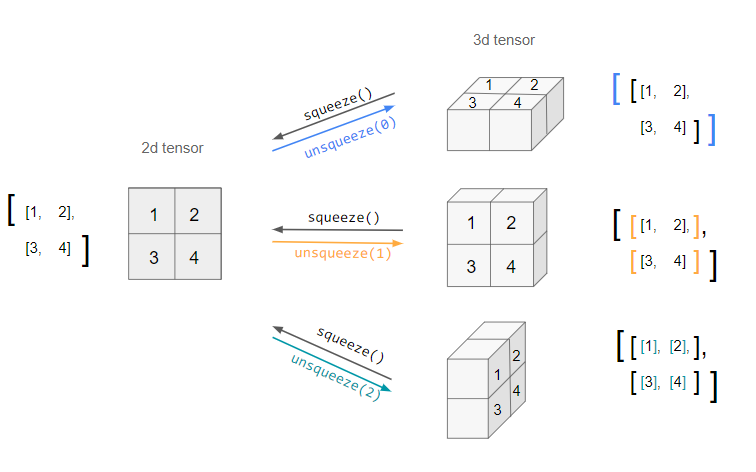

### nn.Linear(input_dim, output_dim)

딥러닝 구조는 linear -> nonlinear -> linear -> ... -> nonlinear 로 구성된다.

그중 nn.Linear는 a simple fully connected neural network를 구현한다.

nn.Linear의 Output에 NonLinear 함수를 사용해 activation function 기능을 구현한다.

### Einstein Summation Convention(einsum)

```python
import numpy as np

a = np.arange(25).reshape(5,5)
a
```

```python

array([[ 0,  1,  2,  3,  4],
       [ 5,  6,  7,  8,  9],
       [10, 11, 12, 13, 14],
       [15, 16, 17, 18, 19],
       [20, 21, 22, 23, 24]])
```

```python
# 합을 구하는 notiation 방법
np.einsum('ij->', a)
300
np.einsum('ij->i', a) # 행 단위로 값을 계산하라는 의미
array([ 10,  35,  60,  85, 110])

# 곲을 구하는 notation 방법
a = np.array([[1,2],[3,4]])
b = np.array([[2,3],[4,5]])

np.einsum('ij,jk->ik',a,b)  2*2 dot
# np.einsum('ij,jk',a,b)와 동일

```

출처 : <a href = 'https://zmade.tistory.com/48'>Einsum (Einstein Summation) </a>

### squeeze and unsqueeze

squeeze와 unsqueeze는 차원이 1개인 경우를 만들거나 제거하는데 활용되는 매소드임.

> unsqueeze turns an n.d. tensor into an (n+1).d. one by adding an extra dimension of depth 1. However, since it is ambiguous which axis the new dimension should lie across (i.e. in which direction it should be "unsqueezed"), this needs to be specified by the dim argument.
>
> e.g. unsqueeze can be applied to a 2d tensor three different ways:



출처 : <a href = 'https://stackoverflow.com/questions/57237352/what-does-unsqueeze-do-in-pytorch'> Transformer 살펴보기 </a>

### Torch.Transpose

차원 개수를 변경

```python

a.shape
>> (2,3,4)
a.transopse(1,2)
>> (2,4,3)


a.shape
>> (2,3,4)
a.transpose(0,2)
>> (4,3,2)
```

### Grad_Zero를 사용하는 이유

- Backward를 하게되면 Gradient 값이 누적됨. RNN에 활용되거나 gradient를 sum하는 용도 때문에 자동으로 누적된다고 함.

- 그래서 이 기능이 필요 없는 경우 Loop에 grad_zero를 포함시켜야 함.

> In PyTorch, for every mini-batch during the training phase, we typically want to explicitly set the gradients to zero before starting to do backpropragation (i.e., updating the Weights and biases) because PyTorch accumulates the gradients on subsequent backward passes. This accumulating behaviour is convenient while training RNNs or when we want to compute the gradient of the loss summed over multiple mini-batches. So, the default action has been set to accumulate (i.e. sum) the gradients on every loss.backward() call.
>
> Because of this, when you start your training loop, ideally you should zero out the gradients so that you do the parameter update correctly. Otherwise, the gradient would be a combination of the old gradient, which you have already used to update your model parameters, and the newly-computed gradient. It would therefore point in some other direction than the intended direction towards the minimum (or maximum, in case of maximization objectives).

출처 : <a href = 'https://stackoverflow.com/questions/48001598/why-do-we-need-to-call-zero-grad-in-pytorch'> Why do we need to call zero_grad() in PyTorch? </a>

### DataSet과 DataLoader

**DataSet**

- Dataset을 DataLoader에서 사용하기 위해서는 **init**, **getitem**, **len** 매서드를 구현해야한다.

- Dataset의 값을 직접 보고 싶다면 **getitem**을 이용한다.

**DataLoader**

- DataLoader는 Model Train에 활용된다. Minibatch 기능과 Epoch 기능 구현을 위해 사용한다.
- 데이터의 접근하려면 python 의 내장함수 iter 와 next 을 사용하여 접근할 수 있다.

출처 : <a href = 'https://acdongpgm.tistory.com/233'> [PyTorch]. Dataset 과 Dataloader 사용하여 전처리하기 </a>

```python

from torch.utils.data import DataLoader
import dataset

ds = dataset.IMDBBertData("./data/IMDB Dataset.csv")
dl = DataLoader(ds,batch_size=10,shuffle=True)

import pandas as pd
# DataSet에 있는 Data 불러오기
a = ds.__getitem__(0)

# DataLoader에 있는 Data 불러오기
c = next(iter(dl))

```
