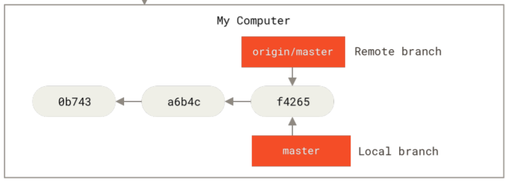
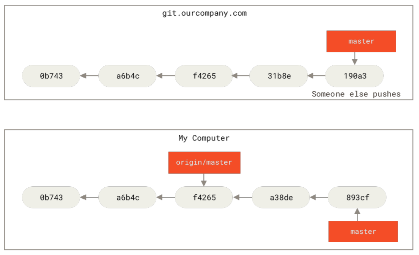
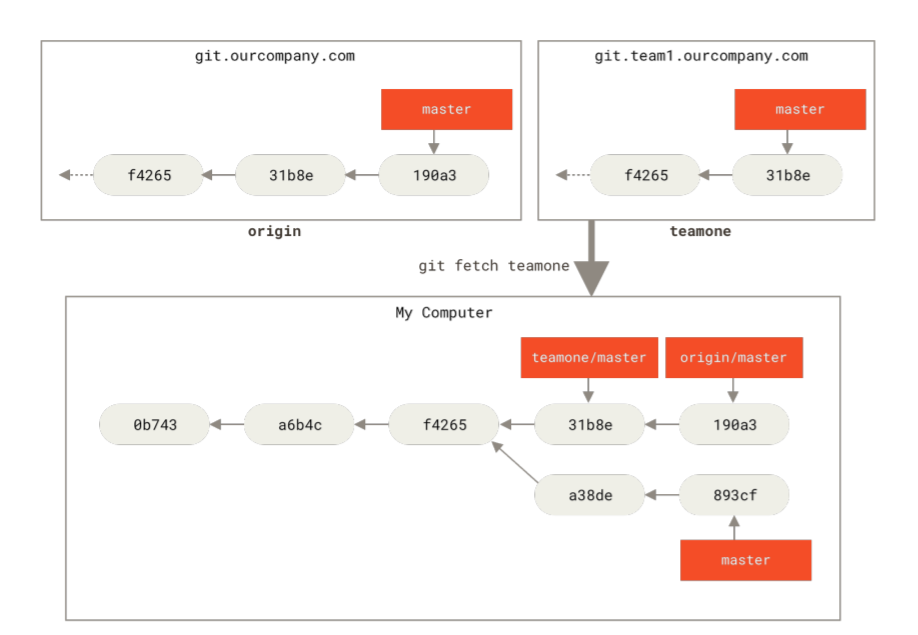
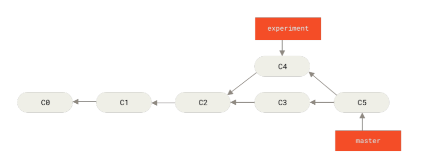
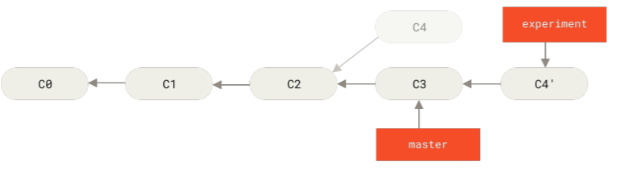
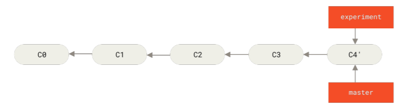
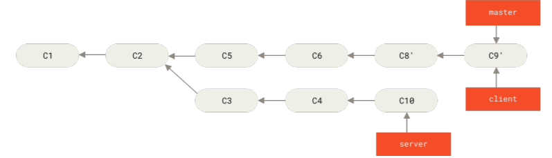

# Branch Management & working flow

### Management for branch

- git branch
  생성된 branch 전체를 보여줌

  - -v 를 추가하면 각 branch마다 최신 commit 내용을 보여줌
  - -all 모든 branch를 볼 수 있음.
  - --merged or --no-merged
    현재 branch에서 merge된 또는 merge되지 않은 branch를 보여줌
    ```bash
    $ git branch --merged
      iss53
    * master
    # * 없는 branch는 병합된 branch이므로
    지우고 싶으면 지울 수 있음.
    -------------------
    $ git branch -d testing
    error: The branch 'testing' is not fully merged.
    **If you are sure you want to delete it, run 'git branch -D testing'.**
    git branch - d는 merge된 branch만 제거 가능( -d를 D로 바꾸면 강제로 제거 가능)
    ```
  - git branch --move <branch_name(전)> <branch_name(후)> | 브랜치 명 바꾸기
    이렇게 하더라도 local에서만 바뀜
    git push --set-upstream origin <branch_name(후)> 이렇게 해야 remote도 branch명이 바뀜

    ```bash
    $ git branch --all
    - corrected-branch-name
    main
    **remotes/origin/bad-branch-name**
    remotes/origin/corrected-branch-name
    remotes/origin/main
    ```

    또한 바꾸고 싶은 branch가 여전히 remote에 있기 때문에 이를 지워야함.
    git push origin --delete bad-branch-name
    <aside>
    💡 master/main branch는 바꿀 때 신중을 가해야함. 왜냐하면 이전 버전과 어긋남이 발생하기 때문이다.(정확한건 읽으면서 보충하자.)
        </aside>

        master/main 브랜치 명 변경 시 확인해야 할 내용들

        - Any projects that depend on this one will need to update their code and/or configuration.
        - Update any test-runner configuration files.
        - Adjust build and release scripts.
        - Redirect settings on your repo host for things like the repo’s default branch, merge rules, and
        other things that match branch names.
        - Update references to the old branch in documentation.
        - Close or merge any pull requests that target the old branch.

    해당 작업을 완료 한 뒤 마찬가지로 Remote에 있는 master branch를 지워야함.

### Branching Workflows

Branch를 활용한 버전관리 방법에 관해 이야기를 다룬다.

- Long-Running Branches
  프로그램을 개발할 때 3가지 flow를 가지고 수행하는 방법이다. Master branch는 정식 발매된 버전이 있는 flow이고 develop는 발매 되진 않았으나 개발 완료된 기능이 쌓이는 flow, Topic은 해결해야할 또는 개발중인 기능을 다루는 flow이다.
  
- Topic Branches
  Branch 생성, 머지, 삭제가 매우 빨리 이뤄지기 때문에 Topic 방식은 Git만의 장점이다. 하나의 Topic branch는 long-running내 branch와 다르게 빠르게 사라진다. 아래 그림처럼 여러 개의 branch를 생성해 작업을 진행한다. 내가 생각할 때 merge conflict가 엄청 발생할 것 같다는 생각이 든다. 이걸 해결하는데 드는 비용도 만만치 않을텐데 어떤 장점이 있을지 이해해보자. (관련 내용은 Distributed Git에서 설명)
  
- Remote Branches
  Remote Branch는 Clone하거나 git init하면 자동으로 생겨난다. “origin/”은 해당 branch가 remote branch라는 점을 사용자에게 인지시키는 용도라고 이해하면된다. 사용자는 직접 해당 remote branch로 이동할 수 없고 Local에 자동 생성된 branch를 사용해야한다.

  - git clone을 할 경우 local 용도 master branch와 origin/master branch가 생긴다.
  - git init로 시작할 경우 local 용도 master branch만 생기고 git remote add 명령어로 remote repo와 local repo를 연결해야만 origin/master가 생긴다.
    <aside>
    💡 처음 생긴 branch명은 origin인데 default 값일 뿐 큰 의미는 없다. 만약 원하는 이름의 branch가 있다면 git clone -o yangoos라는 명령어를 사용해 yangoos/master를 만들 수 있다.

    </aside>

    

    - Git fetch <remote_name>
      Clone한 remote repo가 업데이트 되었다면 아래와 같은 상황이 된다. 이를 업데이트 하기 위해 쓰는 명령어가 git fetch <remote_name>이다. 추가된 내용을 업데이트 한다.
      
      git fetch는 git pull과 다르게 업데이트 된 내용을 merge하지 않는다. 만약 위와 같은 상황에서 pull을 했다면 중복된 내용이 겹치므로 merge conflict가 발생한다. 반면 fetch는 아래와 같이 기존 작업과 remote에서 받은 자료가 분리된다.
        <aside>
        💡 Git pull은 git fetch + merge이다.
        
        </aside>
        
        
        
        추가로 remote repo를 활용한다고 생각해보자. origin외에 다른 remote repo를 불러와야 하는 경우는 다른 기능을 개발하는 부서간 연동을 위해서, 아니면 지금 개발하고 있는 기능이 다른 팀이 개발하고 있는 기능을 활용해야 하는 경우가 있다. 이런 경우 버전개발 중인 local repo에 다른 부서가 개발 중인 remote repo와 연결시켜 관련 내용을 받아야한다. 이때 remote명은 origin과 충돌 방지를 위해 teamone으로 한다. git remote add <remote_name> <url> 명령어로 remote repo를 연결한 뒤 git fetch teamone을 하면 관련 내용이 local에 업데이트 된다. 아래 그림은 remote repo를 추가로 add하면 발생하는 예시다. 앞서 설명한 내용과는 다르지만 추가된 repo가 어떻게 master가 생기는지 알 수 있다.
        
        

- Pushing

  - git push <remote_branch_name> <local branch_name>
    local repo 중 원하는 branch만 온라인으로 공유할 수 있다. remote branch에 업로드 할 local branch로 넘어간 뒤 push하면 된다. 만약 remote repo에 새로운 branch를 만들어 그곳에 push하고 싶다면 명령어 끝에 “: <branch name>”을 추가하면 된다.
    ! 새로운 branch를 만든 입장에서는 새로운 remote branch와 연결된 local branch가 있겠지만 이를 fetch한 다른 이용자들은 origin/new branch(=Remote branch)는 생성되지만 이를 통제 할 local branch가 생성되지는 않는다.
    이때 방금 fetch 받은 origin/new branch(=Remote branch)와 local branch를 연결 할 수 있는 두가지 방법이 있다.
    - new branch 내용을 내가 작업중인 local에 통합하는 방법이다.
      git merge origin/new branch 명령어를 치면 local branch와 통합이 된다.
    - 다른 하나는 new branch를 수정할 수 있게 local에 새로운 branch를 만들어 연동시키는 방법이다.
      git checkout -b <new local branch name> <origin/new branch> 명령어를 치면 local branch와 remote branch가 연동된다. 이제는 remote repo에 있는 new branch를 업데이트 할 수 있다.
  - Tracking Branches
    remote/new branch에 맞게 loacl new branch를 생성하면 자동으로 두 브랜치가 연동이 된다. 이를 tracking branch라고 한다. 이때 remote branch를 upstream branch라고 한다.

    - git checkout --track origin/<branch_name>
      local branch를 새로 만들어 기존 remote branch를 track할수도 있다. 연동시키고 싶은 local branch로 이동한 뒤 git checkout --track origin/branch\_ name 명령어를 사용 한다면 local branch는 remote branch를 tracking하게 된다.

    - git branch -u origin/<branch_name>
      만약 upstream branch를 바꾸고 싶다면 git branch -u origin/branch_name 명령어를 치면 된다.
        <aside>
        💡 **Upstream branch**
        upstream branch는 local branch가 추적중인 remote repo branch를 말한다. 축약어로 @{u} 또는 @{upstream}을 쓴다면 따로 branch 이름을 적지 않더라도 지금 local이 추적하고 있는 remote repo를 불러올 수 있다.  git merge @{u} = git merge origin/master
        
        </aside>

    - git branch -vv
      local이 가지고 있는 branch와 upstream branch 그리고 최신 commit 내용을 보여준다.
      ```bash
      $ git branch -vv
        iss53 7e424c3 [origin/iss53: **ahead 2**] Add forgotten brackets
        master 1ae2a45 [origin/master] Deploy index fix
      * serverfix f8674d9 [teamone/server-fix-good: **ahead 3, behind 1**] This should do it
        testing 5ea463a Try something new
      ```
      볼드체 된 ahead는 local과 remote의 버전 차이라고 보면된다. local branch에서 수행한 commit과 remote branch에서 유지되고 있는 commit을 비교할 때 local commit이 remote branch보다 2개 앞선다는 의미다.
      반면 아래 ahead 3과 behind 1은 현재 remote branch 기준으로 3개 commit을 push해했고, remote branch에서 1개의 pull을 해야함을 말한다.

  - Git push origin --delete serverfix
    활용이 끝난 Remote Branch를 지우는 명령어이다.

- Rebasing
  Rebase는 Merge처럼 Commit을 통합하는 명령어이다. 결과적으로 두 개의 Commit을 병합한 하나의 Commit을 만들지만 기록되는 방법이 다르다. Merge는 두 개의 Commit을 하나로 통합하는 새로운 Commit을 만들고 branching을 기록한다면 Rebase는 branching 없이 마치 하나의 flow만 가지고 작업 한 것 같이 기록한다.
  
  Merge는 C2에서 C3와 C4가 Branching 된 기록을 남긴다.
  
  Rebase는 C4가 마치 C3 이후의 commit인 것처럼 기록한다. C4’와 C5는 완전 동일한 commit이다.
  Rebase는 갈라진 commit(=C4)에서 수행했던 작업을 C3 Commit에서 Replay하는 방식으로 재구현 하는 방식을 택한다. master를 최신버전으로 pointing하기 위해서 experiment와 master가 merge 되야한다. fast-forward 방식으로 merge된다.(git concept & branching 보기)
  ```bash
  $ git checkout master
  $ git merge experiment
  ```
  
  Merge하게 되면 갈라졌던 c4는 사라지게 되고 master가 최신버전을 pointing 한다.
  - Rebase 예시
    
    - git rebase --onto master server client
      Server branch로 부터 갈라진 client Branch를 Master에 rebase하라는 명령어이다. --onto가 rebase하라는 의미라는데 와닿지 않는다. (onto는 client branch만 해달라는 명령어 인 것 같다.)
      
      rebase 및 merge결과
    - git rebase master server
      
      Server도 commit해서 이와 같이 만든다. 이후 master와 server를 merge 한뒤 server branch와 client branch를 지우면(git branch -d client) 다음과 같은 결과물을 생성한다.
      
      The Perils of Rebasing부터 다시
  - Question
    수정이 중복된게 있으면 conflict 없이 덮어 씌우나? Replay라 했으니 Base가 되는 Commit에 변경 사항을 자동적으로 실행하게 되는거로 이해했다.
