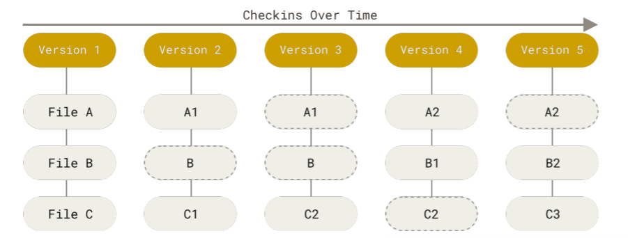
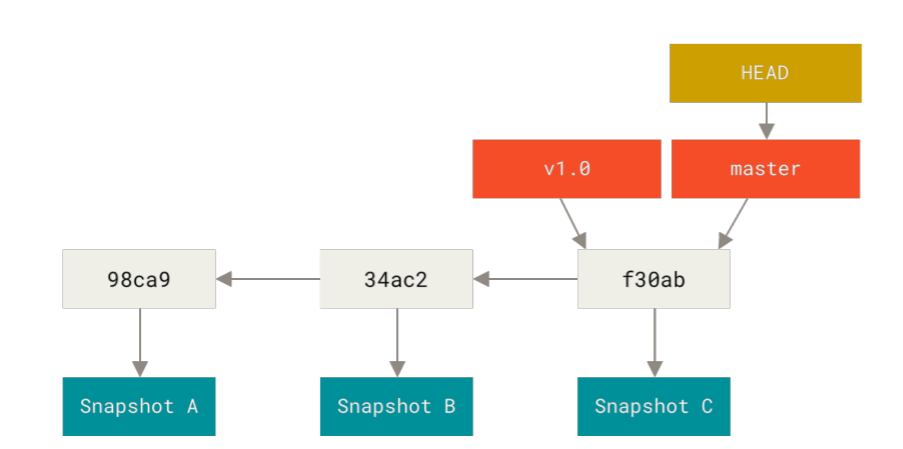
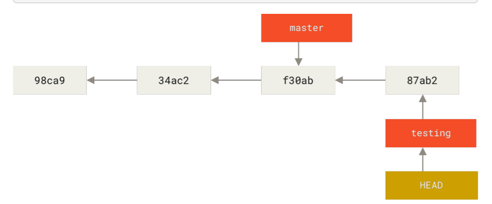
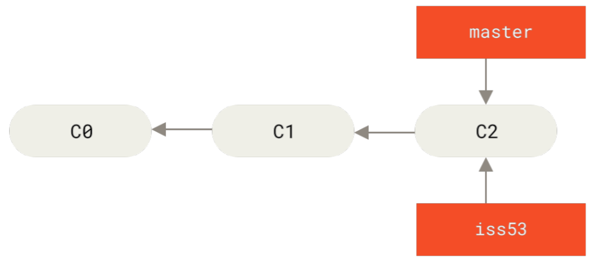
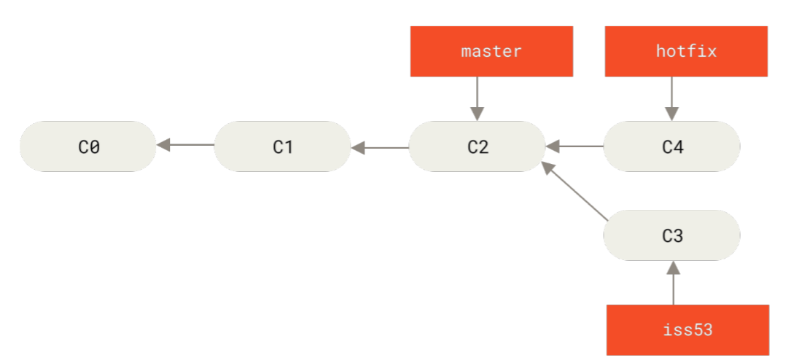
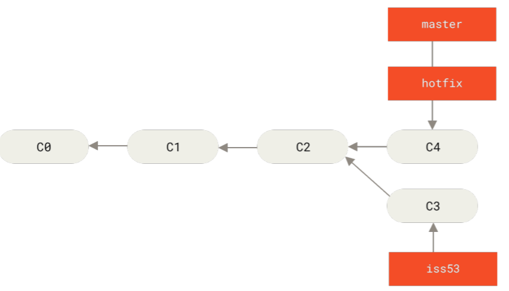
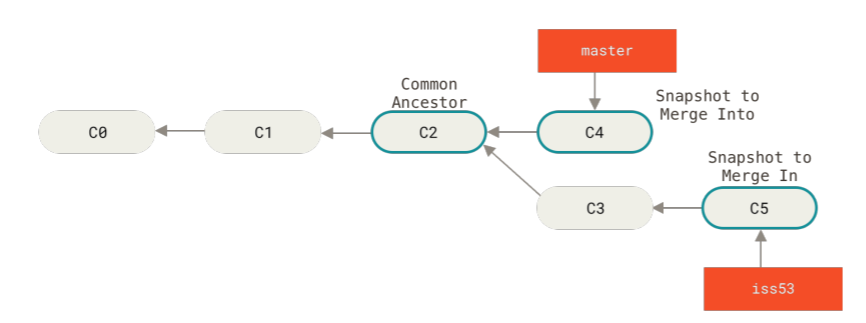
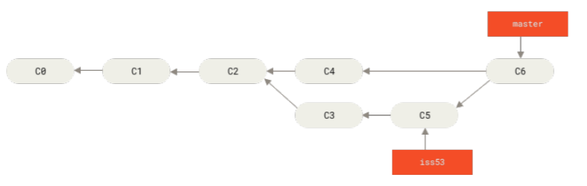

# Git Concept and Branching

### Git Concept

- Snapshot

  Git은 다른 버전관리 프로그램과 다르게 snapshot이라는 개념을 사용한다. 다른 버전관리 시스템은 (내가 안써봐서 어떤 식으로 진행되는지 잘 모르겠으나) 버전 관리를 할 때 파일별로 버전관리를 하는데 반면(그림 1참조) Git은 매번 전체 그림을 저장한다.(그림 2참조) Git은 효율을 위해 수정되지 않은 파일들은 Pointer로 연결해 놓는다. 이러한 개념은 Git Branch에서 위력을 발휘한다.

  

  그림 1 기존 버전 관리 프로그램의 개념

  

  그림 2 Git만의 버전 관리 개념

  > _Git doesn’t store data as a series of changesets or differences, but instead as a series of snapshots. - Git guide 63p_

- Checksum과 SHA-1 Hash
  Checksum은 파일이나 폴더를 자리수로 바꾸는 것을 말한다. 그리고 Git에서 Checksum을 만들기위해 사용되는 매커니즘을 SHA-1 Hash라고 부른다. File을 Staging 하는 과정에서 Checksum을 계산한다.(63p참조) Staging Area는 Checksum 형식으로 저장된다.
    <aside>
    💡 Git은 checksum으로 자료를 관리하기 때문에 모든 변동사항을 추적할 수 있다고 함.
    
    </aside>

### Git Branching

- Git이 Commit하는 과정

  Ex) 3개의 파일을 commit한다.

  git add

  3개 파일이 staging area로 옮겨짐. 이때 파일들은 Checksum으로 변환되며 옮겨진다.

  변환된 checksum이 Git repository로 저장됨(이때 저장된 checksum을 blob이라고 부름)

  (.git이 git repository인듯?)

  git commit

  하위 항목들을 checksum한 뒤 tree object라고 리스트 형태 파일 하나와 메타데이터와 이전 버전 포인터들을 포함한 commit object를 생성한다.

  

  Commit obejct 1개 Tree obeject 1개, Blob 3개 총 5개

  

  여러가지 버전이 이와같이 저장된다.

- Branch 의미
  Branch는 포인터다. Commit할 때마다 포인터는 가장 최신 버전을 향해 바뀐다. Default branch를 master라고 하는데, git init을 할때 master라는 이름의 branch가 생긴다. 물론 Master를 다른 이름으로 바꿀 수 있다.
  
  master라는 이름의 branch가 가장 최신 commit을 향해 있다.
- 다중 branch
  Git에서는 여러 개의 branch를 사용 할 수 있다. Branch가 하나라면 굳이 HEAD라는 용어를 고민할 필요가 없다. 하지만 Branch가 두 개 이상이라면 HEAD에 대해 알아야 한다. HEAD 또한 Branch와 마찬가지로 Pointer이다. 다만 HEAD는 우리가 직접 만지는 포인터라고 보면 된다. 다시말해 우리는 HEAD를 이용해 Branch를 건드리고 그 브런치를 통해 Commit을 관리한다.
  
  두 개 이상의 Brunch로 버전관리하기
  - git checkout <branch_git name>
    브랜치 변경 커맨드
  - git log --oneline --decorate
    현재 브랜치 위치가 어디에 있는지 알려주는 커맨드. 현재 pointing 하는 branch만 볼 수 있음. branch 명을 안다면 git log <branch_name>을 쓰면되고 모든 branch를 보려면 git log --all를 하면 된다.
    
    다중 branch 사용 시 새로운 commit을 하면 HEAD가 가리키는 branch만 옮겨짐
    다중브런치의 장점은 현재버전과 과거버전을 동시에 사용 할 수 있다는 것이다. git checkout으로 master branch를 활용하면 git에서 관리되고 있는 폴더가 구버전으로 바뀐다. 마치 테이프를 되감기 하듯 과거버전의 snapshot을 복원할 수 있다. (branch를 다시 testing으로 돌리면 파일이 다시 바뀌는건지 알아봐야겠다.)
    이후 내용을 수정해 다시 commit을 올리게 된다면 다음 그림과 같이 brunch가 분화된다.
    
  - git log -- oneline -- decorater -- graph --all
    모든 commit과 branch를 볼 수 있는 명령어
  - git switch
    git checkout 말고 git switch 명령어를 사용해서 branch를 옮기거나 생성할 수 있다.
    - git switch <branch_name>-branch : <branch_name>으로 이동
    - git switch -c <branch_name>-branch : branch를 새로만들고 바로 이동할 수 있음. ( = git checkout -b <branch_name>
    - git switch - : 이전 branch로 되돌아갈 수 있음.
- Branching and Merging
  실전에서 branch를 어떻게 활용하는지, 그리고 branch들을 어떻게 통합하는지 예시를 통해 알아가보자. 기존에 맡은 업무를 해결한 뒤 팀장으로부터 새로운 업무을 부여받았다고 생각해보자. 업무 명은 이슈 53이라 하자.(Git guide에서 예시를 이슈 53으로 명명했다.

  - 새로운 버전을 만들기 위해 iss53 branch를 만든다.
    
  - 현재까지 완성된 내용은 C2이고 Issue53 관련 내용을 작성하여 일부분을 Commit 했다.
    
  - 작업하던 중 현재 운영중인 버전(C2)에서 버그가 발견됐다는 연락을 받고 빠르게 핫픽스를 만들어야한다. 먼저 이슈 53건에 대해 작업중인 내용 전부를 commit 해서 폴더 내modified 된 자료들이 없어야한다.
      <aside>
      💡 branch를 바꾸기 위해서는 현재 branch 내 작업중인게 없어야한다.  그러지 않은 경우 branch를 바꿀 수 없다.
      
      </aside>

  - Hotfix를 위해 새로운 브런치(hotfix)를 만든다. 그리고 수정사항을 반영해서 commit한다. c4 commit이 생성된다.
    
  - 다시 master branch로 checkout한 뒤 git merge hotfix 명령어를 쓴다.
    이때 물리적으로 Merge하지 않고 hotfix branch를 master branch로 대체한다.
    `markup $ git checkout master $ git merge hotfix Updating f42c576..3a0874c **Fast-forward** index.html | 2 ++ 1 file changed, 2 insertions(+) `

        Fast-forward 의미: Fast-Forward는 master branch가 hotfix branch를 pointing 하는 행위다.

        

  - git branch -d hotffix로 branch를 지우면 master가 C4를 직접 지목한다.
    다시 checkout으로 iss53으로 돌아가 작업을 하면 된다. 만약 C4 내용을 다음 Commit(C5)에 반영하고 싶으면 hotfix를 merge한 방식과 같이 master로 돌아간 뒤 merge하면 된다.
    
  - 분화된 Branch를 Merging 하기 위해서는 3개의 snapshot을 비교한다. (개념으로만 알고 있자.)
    
  - C6를 만든 뒤 다시 issue 53을 작업해도 되고 만약 쓸 필요가 없다면 iss53을 제거한다.
    

- Merge Conflicts
  만약 hotffix와 iss53이 같은 파일을 수정했다면 c6을 만들때 conflict 오류가 발생한다.
  ```markup
  $ git merge iss53
  Auto-merging index.html
  **CONFLICT (content): Merge conflict in index.html**
  Automatic merge failed; fix conflicts and then commit the result.
  ```
  conflict가 발생하면 conflict-resolution maker를 생성하고(어떤 형식인지는 모르겠다.) 어떤 부분에서 conflict이 발생했는지를 확인할 수 있다.
  ```markup
  **<<<<<<< HEAD:index.html(Head는 지금 master를 pointing 중)**
  <div id="footer">contact : email.support@github.com</div>
  **=======**
  <div id="footer">
   please contact us at support@github.com
  </div>
  **>>>>>>> iss53:index.html**
  ```
  이중 마음에 드는 수정사항을 아래와 같이 남겨둔 뒤 git add 한다.
  ```markup
  <div id="footer">
  please contact us at email.support@github.com
  </div>
  ```
  - git mergetool : merge를 편리하게 도와주는 도구를 불러올 수 있음.(Git guide 78p 확인)
