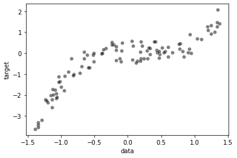
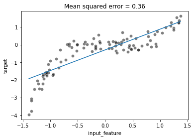
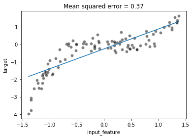
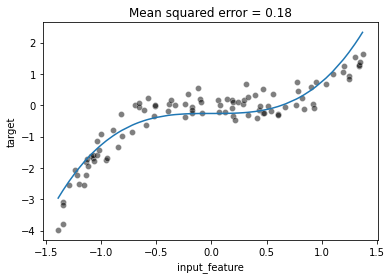
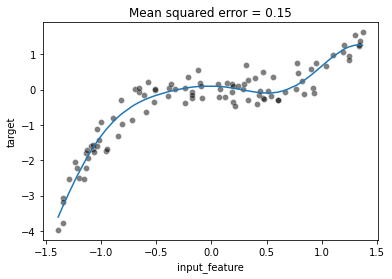

```python
import pandas as pd
import numpy as np
import seaborn as sns
```

### rand = Uniform distribution


### randn = Normal distribution


### Non linear distribution

```python
rng = np.random.RandomState(0)

n_sample = 100
data_max, data_min = 1.4, -1.4
len_data = (data_max - data_min)
data = rng.rand(n_sample) * len_data -len_data /2
noise = rng.randn(n_sample) * .3
target = data**3 -0.5*data** 2 + noise
```

```python
full_data = pd.DataFrame({"data" : data, "target" : target})

sns.scatterplot(x='data',y='target', data=full_data, color='black', alpha=0.5)

```

    <AxesSubplot:xlabel='data', ylabel='target'>



```python
from sklearn.linear_model import LinearRegression

model_linear = LinearRegression()
data = pd.DataFrame(data)
target=pd.DataFrame(target)

model_linear.fit(data,target)

```

    LinearRegression()

```python
x_coef = model_linear.coef_
x_intercept = model_linear.intercept_
```

```python
x_equ = x_coef* data + x_intercept
```

```python
import matplotlib.pyplot as plt
# full_data = pd.DataFrame({"data" : data, "target" : target})
plt.figure(figsize=(10,6))
sns.scatterplot(x='data',y='target', data=full_data, color='black', alpha=0.5)
plt.plot(data[0].to_list(), x_equ[0].to_list())
```

    [<matplotlib.lines.Line2D at 0x195d6e6f700>]


```python
from sklearn.metrics import mean_squared_error
k = mean_squared_error(target,x_equ.values)
k
```

    0.3711754400250842

### Linear regression for a non-linear features-target relationship

A machine learning pipeline that combines a non-linear feature engineering step followed by a linear regression step can be considered non-linear regression model as a whole

=> non-linear model과 linear model이 함께 쓰이면 non-linear model로 간주된다.

### Non-linear model 다루기

1. choose a model that can natively deal with non-linearity.
2. engineer a richer set of features by including expert knowledge which can be directly used by a simple linear model (정확히 무슨의미인지는 캐치 못함)
3. use a kernel to have a locally-based decision function instead of a global linear decision function.

```python
import numpy as np

rng = np.random.RandomState(0)

n_sample = 100
data_max, data_min = 1.4, -1.4
len_data = (data_max - data_min)
# sort the data to make plotting easier later
data = np.sort(rng.rand(n_sample) * len_data - len_data / 2)
noise = rng.randn(n_sample) * .3
target = data ** 3 - 0.5 * data ** 2 + noise
```

```python
full_data = pd.DataFrame({"input_feature": data, "target": target})
```

```python
# X should be 2D for sklearn: (n_samples, n_features)
data = data.reshape((-1, 1))
data.shape
```

    (100, 1)

```python
from sklearn.linear_model import LinearRegression
from sklearn.metrics import mean_squared_error

linear_regression = LinearRegression()
linear_regression.fit(data, target)
target_predicted = linear_regression.predict(data)

mse = mean_squared_error(target, target_predicted)
```

```python
ax = sns.scatterplot(data=full_data, x="input_feature", y="target",
                     color="black", alpha=0.5)
ax.plot(data, target_predicted)
_ = ax.set_title(f"Mean squared error = {mse:.2f}")
```



### 1. choose a model that can natively deal with non-linearity.

```python
from sklearn.tree import DecisionTreeRegressor

tree = DecisionTreeRegressor(max_depth=3).fit(data, target)
target_predicted = tree.predict(data)
mse = mean_squared_error(target, target_predicted)
```

```python
ax = sns.scatterplot(data=full_data, x="input_feature", y="target",
                     color="black", alpha=0.5)
ax.plot(data, target_predicted)
_ = ax.set_title(f"Mean squared error = {mse:.2f}")
```


### 2. engineer a richer set of features by including expert knowledge which can be directly used by a simple linear model

linear_model이 어째서 이렇게 그려지는거지?????

```python
data_expended = np.concatenate([data,data**2, data**3], axis=1)
```

```python
linear_regression.fit(data_expended, target)
target_predicted = linear_regression.predict(data_expended)

plt.plot(data,target_predicted)
```

    [<matplotlib.lines.Line2D at 0x195d4cc9970>]


### 3. use a kernel to have a locally-based decision function instead of a global linear decision function.

include*bias = False => We would create a column perfectly corrlated to the intercept* 라는데 뭔말인지..

```python
from sklearn.pipeline import make_pipeline
from sklearn.preprocessing import PolynomialFeatures

poly_regression = make_pipeline(PolynomialFeatures(degree=3, include_bias=False), LinearRegression())

poly_regression.fit(data,target)
target_predicted = poly_regression.predict(data)
mse = mean_squared_error(target,target_predicted)
```

```python
ax = sns.scatterplot(data=full_data, x="input_feature", y="target",
                     color="black", alpha=0.5)
ax.plot(data, target_predicted)
_ = ax.set_title(f"Mean squared error = {mse:.2f}")
```


```python
from sklearn.svm import SVR

svr = SVR(kernel='linear')
svr.fit(data,target)
target_predicted = svr.predict(data)
mse = mean_squared_error(target, target_predicted)
```

```python
ax = sns.scatterplot(data=full_data, x="input_feature", y="target",
                     color="black", alpha=0.5)
ax.plot(data, target_predicted)
_ = ax.set_title(f"Mean squared error = {mse:.2f}")
```



```python
full_data['input_feature'].head()
```

    0   -1.386853
    1   -1.347389
    2   -1.343699
    3   -1.343388
    4   -1.290274
    Name: input_feature, dtype: float64

```python
svr = SVR(kernel='poly', degree=3)
svr.fit(data,target)
target_predicted = svr.predict(data)
mse = mean_squared_error(target, target_predicted)
```

```python
ax = sns.scatterplot(data=full_data, x="input_feature", y="target",
                     color="black", alpha=0.5)
ax.plot(data, target_predicted)
_ = ax.set_title(f"Mean squared error = {mse:.2f}")
```



Kernel methdos such as SVR are very efficient for small to medium datasets.data

for larger datasets with n_samples >> 10_000, it is often computationally more efficient to perform explict feature expension using `PolynomialFeatures` or other non-linear transformers such as `KBinsDiscretizer or Nystroem`

```python
from sklearn.preprocessing import KBinsDiscretizer

binned_regression = make_pipeline(KBinsDiscretizer(n_bins=8), LinearRegression())

binned_regression.fit(data, target)
target_predicted = binned_regression.predict(data)

mse = mean_squared_error(target, target_predicted)

```

```python
ax = sns.scatterplot(data=full_data, x="input_feature", y="target",
                     color="black", alpha=0.5)
ax.plot(data, target_predicted)
_ = ax.set_title(f"Mean squared error = {mse:.2f}")
```


```python
from sklearn.kernel_approximation import Nystroem

Nystroem_regession = make_pipeline(Nystroem(n_components=5), LinearRegression())

Nystroem_regession.fit(data,target)

target_predicted = Nystroem_regession.predict(data)
```

```python
ax = sns.scatterplot(data=full_data, x="input_feature", y="target",
                     color="black", alpha=0.5)
ax.plot(data, target_predicted)
_ = ax.set_title(f"Mean squared error = {mse:.2f}")
```



### Exercise

```python
from sklearn.datasets import fetch_california_housing

data,target = fetch_california_housing(as_frame=True, return_X_y=True)
target*=100
```

```python
from sklearn.linear_model import LinearRegression
from sklearn.model_selection import cross_validate

model = LinearRegression()
cv_model = cross_validate(model,data,target,cv=10, scoring='neg_mean_absolute_error', n_jobs=-1, return_estimator= True)
```

```python
weight = pd.DataFrame([a.coef_ for a in cv_model['estimator']], columns=data.columns)

weight.plot.box(vert=False, figsize=(10,5))
```

    <AxesSubplot:>


```python

```
