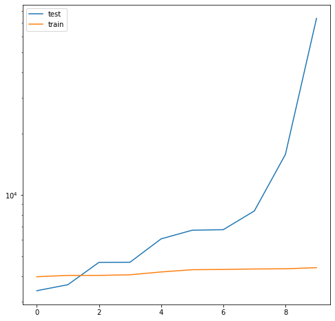
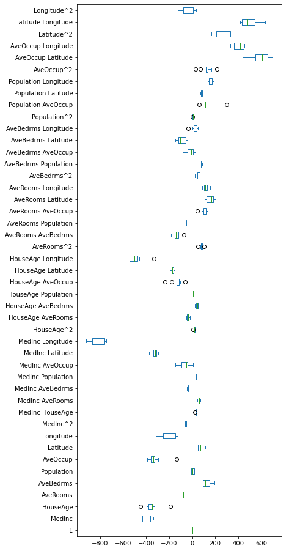
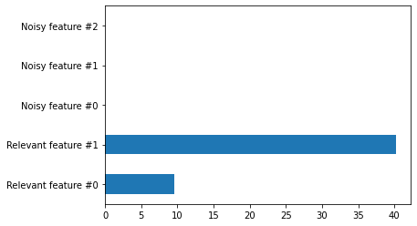

```python
import numpy as np
import pandas as pd
import seaborn as sns
import matplotlib.pyplot as plt
```

### Effect of regularization

```python
from sklearn.datasets import fetch_california_housing

data,target = fetch_california_housing(as_frame=True, return_X_y=True)
target*=100
```

```python
from sklearn.model_selection import cross_validate
from sklearn.pipeline import make_pipeline
from sklearn.preprocessing import PolynomialFeatures
from sklearn.linear_model import LinearRegression

linear_regression = make_pipeline(PolynomialFeatures(degree=2), LinearRegression())
cv_results = cross_validate(linear_regression, data, target, cv=10, scoring='neg_mean_squared_error', return_train_score=True, return_estimator=True)
```

```python
cv_results = pd.DataFrame(cv_results)
```

```python
cv_results.head(5)
test_cv = -cv_results['test_score'].sort_values(ascending=False).reset_index(drop=True)
train_cv = -cv_results['train_score'].sort_values(ascending=False).reset_index(drop=True)
```

```python
plt.figure(figsize=(8,8))
plt.plot(test_cv, label = 'test')
plt.plot(train_cv , label = 'train' )
plt.yscale('log')
plt.legend()
```

    <matplotlib.legend.Legend at 0x22c5a0cc850>



### This generalization performance gap between the training and testing score is an indication that our model overfitted our training set

```python
model_first_fold = cv_results['estimator'][0]
feature_names = model_first_fold[0].get_feature_names_out(input_features=data.columns)
```

```python
coefs = [model[-1].coef_ for model in cv_results['estimator']]
weights_linear_regression = pd.DataFrame(coefs,columns=feature_names)
```

```python
weights_linear_regression.plot.box(vert=False, figsize=(6,16))
```

    <AxesSubplot:>


### Regularization

box plot을 보면 AveBedrms이나 Latitude같이 weight이 엄청나게 크다보니 다른 값들이 그다지 영향력을 발휘하지 못한다는 것을 알 수 있다. Regularization은 이러한 값을 0으로 만들어서 다른 값이 골고루 영향을 줄 수 있도록 하는 방법이다.

```python
from sklearn.linear_model import Ridge

ridge = make_pipeline(PolynomialFeatures(degree=2), Ridge(alpha=100))

cv_results = cross_validate(ridge,data,target, cv=10, scoring='neg_mean_squared_error', return_train_score=True, return_estimator=True)
```

    C:\Users\679oo\anaconda3\lib\site-packages\sklearn\linear_model\_ridge.py:157: LinAlgWarning: Ill-conditioned matrix (rcond=2.672e-17): result may not be accurate.
      return linalg.solve(A, Xy, sym_pos=True, overwrite_a=True).T
    C:\Users\679oo\anaconda3\lib\site-packages\sklearn\linear_model\_ridge.py:157: LinAlgWarning: Ill-conditioned matrix (rcond=2.67257e-17): result may not be accurate.
      return linalg.solve(A, Xy, sym_pos=True, overwrite_a=True).T
    C:\Users\679oo\anaconda3\lib\site-packages\sklearn\linear_model\_ridge.py:157: LinAlgWarning: Ill-conditioned matrix (rcond=2.75536e-17): result may not be accurate.
      return linalg.solve(A, Xy, sym_pos=True, overwrite_a=True).T
    C:\Users\679oo\anaconda3\lib\site-packages\sklearn\linear_model\_ridge.py:157: LinAlgWarning: Ill-conditioned matrix (rcond=2.67367e-17): result may not be accurate.
      return linalg.solve(A, Xy, sym_pos=True, overwrite_a=True).T
    C:\Users\679oo\anaconda3\lib\site-packages\sklearn\linear_model\_ridge.py:157: LinAlgWarning: Ill-conditioned matrix (rcond=3.5546e-17): result may not be accurate.
      return linalg.solve(A, Xy, sym_pos=True, overwrite_a=True).T
    C:\Users\679oo\anaconda3\lib\site-packages\sklearn\linear_model\_ridge.py:157: LinAlgWarning: Ill-conditioned matrix (rcond=2.75974e-17): result may not be accurate.
      return linalg.solve(A, Xy, sym_pos=True, overwrite_a=True).T
    C:\Users\679oo\anaconda3\lib\site-packages\sklearn\linear_model\_ridge.py:157: LinAlgWarning: Ill-conditioned matrix (rcond=2.82401e-17): result may not be accurate.
      return linalg.solve(A, Xy, sym_pos=True, overwrite_a=True).T
    C:\Users\679oo\anaconda3\lib\site-packages\sklearn\linear_model\_ridge.py:157: LinAlgWarning: Ill-conditioned matrix (rcond=4.96672e-17): result may not be accurate.
      return linalg.solve(A, Xy, sym_pos=True, overwrite_a=True).T
    C:\Users\679oo\anaconda3\lib\site-packages\sklearn\linear_model\_ridge.py:157: LinAlgWarning: Ill-conditioned matrix (rcond=2.68318e-17): result may not be accurate.
      return linalg.solve(A, Xy, sym_pos=True, overwrite_a=True).T
    C:\Users\679oo\anaconda3\lib\site-packages\sklearn\linear_model\_ridge.py:157: LinAlgWarning: Ill-conditioned matrix (rcond=2.68514e-17): result may not be accurate.
      return linalg.solve(A, Xy, sym_pos=True, overwrite_a=True).T

원래 이런 오류가 뜬다고 한다. 매우 큰값이나 매우 작은값이 들어가면 이렇게 오류가 뜬다고한다.

```python
coefs = [model[-1].coef_ for model in cv_results['estimator']]
weights_ridge = pd.DataFrame(coefs,columns=feature_names)

weights_ridge.plot.box( vert=False, figsize=(6,16))
```

    <AxesSubplot:>


Ridge_regression을 사용하니 LinearRegression을 사용하는 것 보다 값들이 0에 가까워졌음을 확인할 수 있다.

### Feature scaling and regularization

Scaling도 weight을 결정할 때 매우 중요한 요소임.

Regularization은 scale이 작은 class를 부스팅하고 큰 calss를 감소시킨다. 결과적으로 weights를 서로 가깝게 만든다.

### When working with a linear model and numerical data, it is generally good practice to scale the data

```python
from sklearn.preprocessing import StandardScaler

ridge = make_pipeline(PolynomialFeatures(), StandardScaler(), Ridge(alpha=0.5))
cv_results=cross_validate(ridge,data,target, cv=10, scoring='neg_mean_squared_error', return_estimator=True, return_train_score=True)
```

```python
print(f"Train_mean : {-cv_results['train_score'].mean()}, test_mean :{-cv_results['test_score'].mean()}")
```

    Train_mean : 4347.036270227011, test_mean :5508.472404145571

We observe that scaling has a positive impact on the test score and that the test score is closer to the train score.

```python
coefs = [model[-1].coef_ for model in cv_results['estimator']]
weights_ridge = pd.DataFrame(coefs,columns=feature_names)

weights_ridge.plot.box( vert=False, figsize=(6,16))
```

    <AxesSubplot:>



### alpha = 0.5 => alpha = 1_000_000

```python
ridge = make_pipeline(PolynomialFeatures(), StandardScaler(), Ridge(alpha=1_000_000))
cv_results=cross_validate(ridge,data,target, cv=10, scoring='neg_mean_squared_error', return_estimator=True, return_train_score=True)

print(f"Train_mean : {-cv_results['train_score'].mean()}, test_mean :{-cv_results['test_score'].mean()}")

coefs = [model[-1].coef_ for model in cv_results['estimator']]
weights_ridge = pd.DataFrame(coefs,columns=feature_names)

weights_ridge.plot.box(vert=False, figsize=(6,16))
```

    Train_mean : 12020.649993430929, test_mean :12543.889892473617


    <AxesSubplot:>


alpha = 1_000_000결과 score은 좋지 않지만 weight이 -2 ~ 2 사이로 수렴하도록 했다.

### 주의할점

Categorical feature을 Onehotencoder로 encoding한 경우 scaling을 해서는 안된다.

### Fine tuning the regularization parameter

최적의 parameter를 찾기 위해서는 train_set과 testing_set, out_of_sample testing set을 갖춰야한다.

Out_of_sample testing set은 train_set과 testing_set을 통해서 최적의 모델을 찾고난 다음 모델의 성능을 확인할때 쓰는 데이터이다.

Testing_set은 최적의 hyperparameter를 찾기 위해 사용되는 데이터로서, train_set에서 훈련받은 모델을 testing_set을 통해 alpha 값을 조정하는 과정을 거친다.

### 꿀팁

- 모델별로 최적의 hyperparameter를 찾기 위한 method가 존재한다. 모두 모델 끝에 CV가 붙는다.
- inner_cross_validation은 hyperparameter를 찾기위해 사용되고 nested_cross_validation은 모델의 실제 성능을 테스트하는 용도이다.

```python
from sklearn.linear_model import RidgeCV
alphas = np.logspace(-2,0,num=20)
ridge = make_pipeline(PolynomialFeatures(degree=2), StandardScaler(), RidgeCV(alphas=alphas, store_cv_values=True))
```

```python
from sklearn.model_selection import ShuffleSplit

cv = ShuffleSplit(n_splits=5, random_state=1)
cv_results=cross_validate(ridge,data,target,cv=cv,scoring='neg_mean_squared_error', return_estimator=True, return_train_score=True, n_jobs=-1)
```

```python
print(f"Train_mean : {-cv_results['train_score'].mean()}, test_mean :{-cv_results['test_score'].mean()}")
```

    Train_mean : 4306.561862713922, test_mean :4348.656991192537

### We see that the training and testing scores are close. It indicates that our model is not overfitting.

```python
mse_alphas = [est[-1].cv_values_.mean(axis=0) for est in cv_results['estimator']]
cv_alphas = pd.DataFrame(mse_alphas, columns=alphas)
cv_alphas
```

<div>
<style scoped>
    .dataframe tbody tr th:only-of-type {
        vertical-align: middle;
    }

    .dataframe tbody tr th {
        vertical-align: top;
    }

    .dataframe thead th {
        text-align: right;
    }

</style>
<table border="1" class="dataframe">
  <thead>
    <tr style="text-align: right;">
      <th></th>
      <th>0.010000</th>
      <th>0.012743</th>
      <th>0.016238</th>
      <th>0.020691</th>
      <th>0.026367</th>
      <th>0.033598</th>
      <th>0.042813</th>
      <th>0.054556</th>
      <th>0.069519</th>
      <th>0.088587</th>
      <th>0.112884</th>
      <th>0.143845</th>
      <th>0.183298</th>
      <th>0.233572</th>
      <th>0.297635</th>
      <th>0.379269</th>
      <th>0.483293</th>
      <th>0.615848</th>
      <th>0.784760</th>
      <th>1.000000</th>
    </tr>
  </thead>
  <tbody>
    <tr>
      <th>0</th>
      <td>7587.897141</td>
      <td>7059.531216</td>
      <td>6579.796667</td>
      <td>6161.839629</td>
      <td>5813.048345</td>
      <td>5535.350138</td>
      <td>5326.646369</td>
      <td>5182.950517</td>
      <td>5100.749049</td>
      <td>5079.212663</td>
      <td>5122.029454</td>
      <td>5238.704149</td>
      <td>5445.118890</td>
      <td>5763.012259</td>
      <td>6217.925433</td>
      <td>6835.274126</td>
      <td>7634.692137</td>
      <td>8623.620241</td>
      <td>9791.918443</td>
      <td>11109.476019</td>
    </tr>
    <tr>
      <th>1</th>
      <td>7079.341771</td>
      <td>6696.622046</td>
      <td>6329.022308</td>
      <td>5987.727181</td>
      <td>5681.306000</td>
      <td>5415.171818</td>
      <td>5191.880969</td>
      <td>5012.209177</td>
      <td>4876.780585</td>
      <td>4787.974274</td>
      <td>4751.851652</td>
      <td>4779.853646</td>
      <td>4889.937328</td>
      <td>5106.656625</td>
      <td>5459.549144</td>
      <td>5979.280717</td>
      <td>6691.530974</td>
      <td>7609.581815</td>
      <td>8727.609953</td>
      <td>10017.092899</td>
    </tr>
    <tr>
      <th>2</th>
      <td>24857.406605</td>
      <td>21448.284772</td>
      <td>18293.478416</td>
      <td>15481.009011</td>
      <td>13067.031991</td>
      <td>11071.457116</td>
      <td>9480.437579</td>
      <td>8254.431555</td>
      <td>7338.963939</td>
      <td>6675.026438</td>
      <td>6207.024331</td>
      <td>5887.541169</td>
      <td>5679.263698</td>
      <td>5554.913823</td>
      <td>5496.051755</td>
      <td>5491.367683</td>
      <td>5534.775517</td>
      <td>5623.398006</td>
      <td>5755.456140</td>
      <td>5928.154410</td>
    </tr>
    <tr>
      <th>3</th>
      <td>7504.216958</td>
      <td>7125.074257</td>
      <td>6754.172985</td>
      <td>6400.999897</td>
      <td>6072.937966</td>
      <td>5774.941819</td>
      <td>5509.955509</td>
      <td>5280.027720</td>
      <td>5087.960263</td>
      <td>4939.271829</td>
      <td>4844.228092</td>
      <td>4819.618117</td>
      <td>4889.808854</td>
      <td>5086.420585</td>
      <td>5445.877349</td>
      <td>6004.320850</td>
      <td>6790.113763</td>
      <td>7815.311733</td>
      <td>9068.542918</td>
      <td>10511.939341</td>
    </tr>
    <tr>
      <th>4</th>
      <td>6999.938808</td>
      <td>6598.898743</td>
      <td>6215.363499</td>
      <td>5861.328579</td>
      <td>5546.025773</td>
      <td>5275.377052</td>
      <td>5052.349007</td>
      <td>4878.140850</td>
      <td>4753.964890</td>
      <td>4683.117084</td>
      <td>4673.049960</td>
      <td>4737.162496</td>
      <td>4895.935124</td>
      <td>5176.863333</td>
      <td>5612.500529</td>
      <td>6236.037942</td>
      <td>7074.449338</td>
      <td>8140.303978</td>
      <td>9424.471281</td>
      <td>10892.352852</td>
    </tr>
  </tbody>
</table>
</div>

```python
#### Cross validation 첫번째 Ridge Regression
cv_results['estimator'][0][-1]

# ### 뭔지 모르겠는제 뭐가 18000개 리스트가있는거지
# cv_results['estimator'][0][-1].cv_values_

# #### 흠... 뭘까...
# cv_results['estimator'][0][-1].cv_values_[0]
```

    RidgeCV(alphas=array([0.01      , 0.01274275, 0.01623777, 0.02069138, 0.02636651,
           0.03359818, 0.04281332, 0.05455595, 0.06951928, 0.08858668,
           0.11288379, 0.14384499, 0.18329807, 0.23357215, 0.29763514,
           0.37926902, 0.48329302, 0.61584821, 0.78475997, 1.        ]),
            store_cv_values=True)

```python
cv_alphas.mean(axis=0).plot(marker='+')
```

    <AxesSubplot:>


### Regularization is just like salt in cooking: 너무 많이넣으면 음식을 망친다. 적당히 넣어야지 그 가치가 나온다.

```python
best_alphas = [est[-1].alpha_ for est in cv_results['estimator']]
best_alphas

### 매번 Cross validation 했을 때 결과
```

    [0.08858667904100823,
     0.11288378916846889,
     0.37926901907322497,
     0.14384498882876628,
     0.11288378916846889]

```python
from sklearn.datasets import make_regression

data, target, coef = make_regression(
    n_samples=2_000,
    n_features=5,
    n_informative=2,
    shuffle=False,
    coef=True,
    random_state=0,
    noise=30,
)
```

```python
feature_names = [
    "Relevant feature #0",
    "Relevant feature #1",
    "Noisy feature #0",
    "Noisy feature #1",
    "Noisy feature #2",
]
coef = pd.Series(coef, index=feature_names)
coef.plot.barh()
coef
```

    Relevant feature #0     9.566665
    Relevant feature #1    40.192077
    Noisy feature #0        0.000000
    Noisy feature #1        0.000000
    Noisy feature #2        0.000000
    dtype: float64



```python
from sklearn.linear_model import LinearRegression
from sklearn.model_selection import cross_validate
from sklearn.pipeline import make_pipeline

model = LinearRegression()
model.fit(data,target)

model.coef_

feature_names = [
    "Relevant feature #0",
    "Relevant feature #1",
    "Noisy feature #0",
    "Noisy feature #1",
    "Noisy feature #2",
]
coef = pd.Series(model.coef_, index=feature_names)
coef.plot.barh()
coef
```

    Relevant feature #0    10.895870
    Relevant feature #1    40.411280
    Noisy feature #0       -0.205425
    Noisy feature #1       -0.189545
    Noisy feature #2        0.111298
    dtype: float64


```python
data_modify = map(lambda x : np.append(x,[1.76405235, 0.40015721,1.76405235, 0.40015721]), data)
data_modify = np.array(list(data_modify))
data_modify[0]
```

    array([1.76405235, 0.40015721, 0.97873798, 2.2408932 , 1.86755799,
           1.76405235, 0.40015721, 1.76405235, 0.40015721])

```python
data_modi = np.concatenate([data, data[:, [0,1]], data[:,[0,1]]],axis=1)
data_modi[0]

data_modi_2 = np.concatenate([data, data[:, [0, 1]], data[:, [0, 1]]], axis=1)
data_modi_2[0]
```

    array([1.76405235, 0.40015721, 0.97873798, 2.2408932 , 1.86755799,
           1.76405235, 0.40015721, 1.76405235, 0.40015721])

```python
linear_regression = LinearRegression()
linear_regression.fit(data_modi_2,target)
feature_names = [
    "Relevant feature #0",
    "Relevant feature #1",
    "Noisy feature #0",
    "Noisy feature #1",
    "Noisy feature #2",
    "First repetition of feature #0",
    "First repetition of  feature #1",
    "Second repetition of  feature #0",
    "Second repetition of  feature #1",
]
coef = pd.Series(linear_regression.coef_, index=feature_names)
_ = coef.plot.barh()
```


```python
from sklearn.linear_model import Ridge
model_ridge = Ridge()
model_ridge.fit(data_modi_2,target)

model_ridge.coef_

feature_names = [
    "Relevant feature #0",
    "Relevant feature #1",
    "Noisy feature #0",
    "Noisy feature #1",
    "Noisy feature #2",
    "First repetition of feature #0",
    "First repetition of  feature #1",
    "Second repetition of  feature #0",
    "Second repetition of  feature #1",
]
coef = pd.Series(model_ridge.coef_, index=feature_names)
_ = coef.plot.barh()
```


```python
### Dealing with correlation between one-hot encoded features

```

```python
import pandas as pd
from sklearn.model_selection import train_test_split

ames_housing = pd.read_csv("data/house_prices.csv", na_values='?')
ames_housing = ames_housing.drop(columns="Id")

categorical_columns = ["Street", "Foundation", "CentralAir", "PavedDrive"]
target_name = "SalePrice"
X, y = ames_housing[categorical_columns], ames_housing[target_name]

X_train, X_test, y_train, y_test = train_test_split(
    X, y, test_size=0.2, random_state=0
)
```

```python
X_train['CentralAir']
```

    618     Y
    870     N
    92      Y
    817     Y
    302     Y
           ..
    763     Y
    835     Y
    1216    Y
    559     Y
    684     Y
    Name: CentralAir, Length: 1168, dtype: object

```python
from sklearn.preprocessing import OneHotEncoder

single_feature = ['CentralAir']
encoder =OneHotEncoder(sparse=False, dtype=np.int32)
X_trans = encoder.fit_transform(X_train[single_feature])
X_trans = pd.DataFrame(X_trans, columns=encoder.get_feature_names_out(input_features=single_feature))
X_trans
```

<div>
<style scoped>
    .dataframe tbody tr th:only-of-type {
        vertical-align: middle;
    }

    .dataframe tbody tr th {
        vertical-align: top;
    }

    .dataframe thead th {
        text-align: right;
    }

</style>
<table border="1" class="dataframe">
  <thead>
    <tr style="text-align: right;">
      <th></th>
      <th>CentralAir_N</th>
      <th>CentralAir_Y</th>
    </tr>
  </thead>
  <tbody>
    <tr>
      <th>0</th>
      <td>0</td>
      <td>1</td>
    </tr>
    <tr>
      <th>1</th>
      <td>1</td>
      <td>0</td>
    </tr>
    <tr>
      <th>2</th>
      <td>0</td>
      <td>1</td>
    </tr>
    <tr>
      <th>3</th>
      <td>0</td>
      <td>1</td>
    </tr>
    <tr>
      <th>4</th>
      <td>0</td>
      <td>1</td>
    </tr>
    <tr>
      <th>...</th>
      <td>...</td>
      <td>...</td>
    </tr>
    <tr>
      <th>1163</th>
      <td>0</td>
      <td>1</td>
    </tr>
    <tr>
      <th>1164</th>
      <td>0</td>
      <td>1</td>
    </tr>
    <tr>
      <th>1165</th>
      <td>0</td>
      <td>1</td>
    </tr>
    <tr>
      <th>1166</th>
      <td>0</td>
      <td>1</td>
    </tr>
    <tr>
      <th>1167</th>
      <td>0</td>
      <td>1</td>
    </tr>
  </tbody>
</table>
<p>1168 rows × 2 columns</p>
</div>

```python

```
