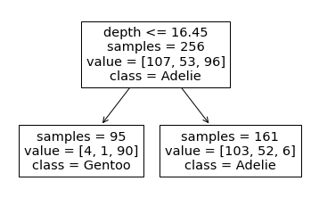
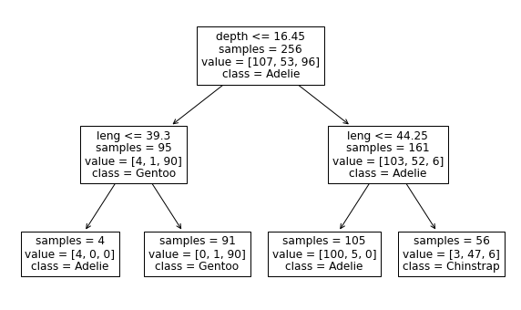

```python
import pandas as pd

penguins = pd.read_csv('data/penguins_classification.csv')
penguins
```

<div>
<style scoped>
    .dataframe tbody tr th:only-of-type {
        vertical-align: middle;
    }

    .dataframe tbody tr th {
        vertical-align: top;
    }

    .dataframe thead th {
        text-align: right;
    }

</style>
<table border="1" class="dataframe">
  <thead>
    <tr style="text-align: right;">
      <th></th>
      <th>Culmen Length (mm)</th>
      <th>Culmen Depth (mm)</th>
      <th>Species</th>
    </tr>
  </thead>
  <tbody>
    <tr>
      <th>0</th>
      <td>39.1</td>
      <td>18.7</td>
      <td>Adelie</td>
    </tr>
    <tr>
      <th>1</th>
      <td>39.5</td>
      <td>17.4</td>
      <td>Adelie</td>
    </tr>
    <tr>
      <th>2</th>
      <td>40.3</td>
      <td>18.0</td>
      <td>Adelie</td>
    </tr>
    <tr>
      <th>3</th>
      <td>36.7</td>
      <td>19.3</td>
      <td>Adelie</td>
    </tr>
    <tr>
      <th>4</th>
      <td>39.3</td>
      <td>20.6</td>
      <td>Adelie</td>
    </tr>
    <tr>
      <th>...</th>
      <td>...</td>
      <td>...</td>
      <td>...</td>
    </tr>
    <tr>
      <th>337</th>
      <td>55.8</td>
      <td>19.8</td>
      <td>Chinstrap</td>
    </tr>
    <tr>
      <th>338</th>
      <td>43.5</td>
      <td>18.1</td>
      <td>Chinstrap</td>
    </tr>
    <tr>
      <th>339</th>
      <td>49.6</td>
      <td>18.2</td>
      <td>Chinstrap</td>
    </tr>
    <tr>
      <th>340</th>
      <td>50.8</td>
      <td>19.0</td>
      <td>Chinstrap</td>
    </tr>
    <tr>
      <th>341</th>
      <td>50.2</td>
      <td>18.7</td>
      <td>Chinstrap</td>
    </tr>
  </tbody>
</table>
<p>342 rows × 3 columns</p>
</div>

```python
penguins.columns = ['leng', 'depth','species']
```

```python
from sklearn.model_selection import train_test_split
data_train, data_test, target_train, target_test = train_test_split(penguins.drop(columns='species'), penguins['species'], random_state=0)
```

```python
from sklearn.tree import DecisionTreeClassifier

tree = DecisionTreeClassifier(max_depth=1)
tree.fit(data_train,target_train)

```

    DecisionTreeClassifier(max_depth=1)

```python
from sklearn.tree import plot_tree
plot_tree(tree, feature_names=['leng', 'depth'], class_names=tree.classes_, impurity=False)
```

    [Text(0.5, 0.75, 'depth <= 16.45\nsamples = 256\nvalue = [107, 53, 96]\nclass = Adelie'),
     Text(0.25, 0.25, 'samples = 95\nvalue = [4, 1, 90]\nclass = Gentoo'),
     Text(0.75, 0.25, 'samples = 161\nvalue = [103, 52, 6]\nclass = Adelie')]



- we see that the sample superior to 16.45 belongs mainly to the Adelie class.

- Looking at the values, we indeed observe 103 Adelie individuals in this space. We also count 52 Chinstrap samples and 6 Gentoo samples

```python
sample_1 = pd.DataFrame(
    {"leng": [0], "depth": [15]}
)
tree.predict(sample_1)
```

    array(['Gentoo'], dtype=object)

```python
sample_2 = pd.DataFrame(
    {"leng": [0], "depth": [17]}
)
tree.predict(sample_2)
```

    array(['Adelie'], dtype=object)

### Thus, we can conclude that a decision tree classifier will predict the most represented class within a partition.

```python
y_pred_proba = tree.predict_proba(sample_2)
y_proba_class_0 = pd.Series(y_pred_proba[0], index=tree.classes_)
y_proba_class_0.plot.bar()
```

    <AxesSubplot:>


It is also important to note that the culmen length has been disregarded for the moment.

It means that whatever the value given, it will not be used during the prediction.

Going back to our classification problem, the split found with a maximum depth of 1 is not powerful enough to separate the three species and the model accuracy is low when compared to the linear model.

```python
from sklearn.tree import DecisionTreeClassifier

tree = DecisionTreeClassifier(max_depth=2)
tree.fit(data_train,target_train)
tree.score(data_test, target_test)

```

    0.9651162790697675

```python
from sklearn.tree import plot_tree
import matplotlib.pyplot as plt
plt.figure(figsize=(10,6))
plot_tree(tree,feature_names=data_train.columns, class_names=target_test.unique(), impurity=False)
```

    [Text(0.5, 0.8333333333333334, 'depth <= 16.45\nsamples = 256\nvalue = [107, 53, 96]\nclass = Adelie'),
     Text(0.25, 0.5, 'leng <= 39.3\nsamples = 95\nvalue = [4, 1, 90]\nclass = Gentoo'),
     Text(0.125, 0.16666666666666666, 'samples = 4\nvalue = [4, 0, 0]\nclass = Adelie'),
     Text(0.375, 0.16666666666666666, 'samples = 91\nvalue = [0, 1, 90]\nclass = Gentoo'),
     Text(0.75, 0.5, 'leng <= 44.25\nsamples = 161\nvalue = [103, 52, 6]\nclass = Adelie'),
     Text(0.625, 0.16666666666666666, 'samples = 105\nvalue = [100, 5, 0]\nclass = Adelie'),
     Text(0.875, 0.16666666666666666, 'samples = 56\nvalue = [3, 47, 6]\nclass = Chinstrap')]



```python
a = tree.predict_proba(data_test)
asd = pd.DataFrame(a[0:9], columns=target_test.unique())
```

```python
asd.plot.barh(legend='reverse')
# plt.legend()
```

    <AxesSubplot:>


```python

```
