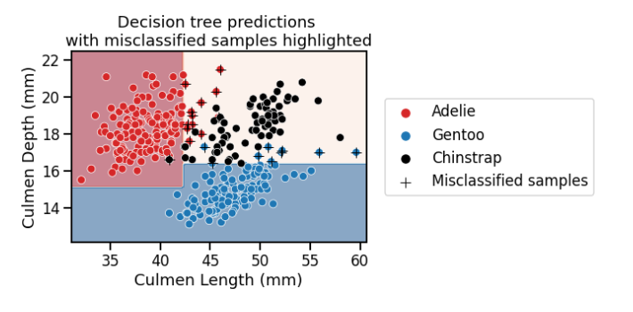
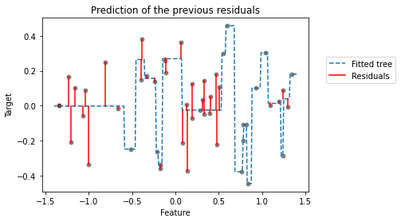
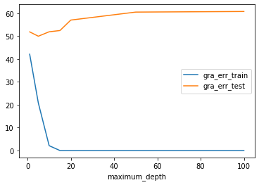

```python
import numpy as np
import pandas as pd
import seaborn as sns
import matplotlib.pyplot as plt
```

### Adaptive boost (adaboost)

틀린내용을 복습하는 개념인듯 하다.

misclassified 된 rows를 모아서 다시 훈련을 한다.

- AdaBoost is a nice algorithm to demonstrate the internal machinery of boosting algorithms

```python
penguins = pd.read_csv("data/penguins_classification.csv")
culmen_columns = ["Culmen Length (mm)", "Culmen Depth (mm)"]
target_column = "Species"

data, target = penguins[culmen_columns], penguins[target_column]
```

```python
from sklearn.tree import DecisionTreeClassifier

palette = ["tab:red",'tab:blue','black']

tree = DecisionTreeClassifier(max_depth=2, random_state=0)
tree.fit(data,target)

```

    DecisionTreeClassifier(max_depth=2, random_state=0)

### flatnonzero => 0이 아닌 값들의 순서를 반환한다.

x = np.arange(-2, 3)

> array([-2, -1, 0, 1, 2])

np.flatnonzero(x)

> array([0, 1, 3, 4])

```python
target_predicted = tree.predict(data)

### 예측에 실패한 row들을 불러오는 명령어
misclassified_samples_idx = np.flatnonzero(target != target_predicted)
data_misclassified = data.iloc[misclassified_samples_idx]
```

```python
misclassified_samples_idx
```

    array([ 16,  18,  42,  72,  74,  80,  98, 108, 110, 114, 128, 130, 184,
           188, 216, 230, 236, 240, 242, 250, 252, 304], dtype=int64)

### Sample_weight

Sample 중에 정해진 Sample에게 중요도를 부과해 더욱 높은 가중치를 부여하는 방법

### np.zeros_like

특정 array의 shape를 복사하고 내용은 비우게(0으로) 만드는 명령어

> 유사 명령어로 np.zero가 있음 원하는 shape를 직접 설정하는 방법임

```python
### 개별 row and columns 별로 Weight 값설정하기
sample_weight = np.zeros_like(target, dtype=int)
sample_weight[misclassified_samples_idx] = 1

tree = DecisionTreeClassifier(max_depth=2, random_state=0)
tree.fit(data, target, sample_weight=sample_weight)
```

    DecisionTreeClassifier(max_depth=2, random_state=0)

### 틀린 문제에 가중값 1을 준다.

```python
sample_weight = np.zeros_like(target, dtype=int)
sample_weight.shape
```

    (342,)

### sample weight parameter 유무를 decision boundary 차이로 봅시다.

가중값 준 value를 +로 따로 표기했다. 해당 value는 처음 생성한 tree model에서 얻은 missclassifed value이다. Sample-Weight를 적용하니 다른건 다 제치고 +로 표기된 value는 모두 분류가 잘되었다. 결과 자체로는 높지않다. 다만 machine이 weight를 준 value를 우선적으로 학습한다는 점을 인지하면 된다.

**Sample-Weight 미적용**


**Sample-Weight 적용**


```python
target_predicted = tree.predict(data)
newly_misclassified_samples_idx = np.flatnonzero(target != target_predicted)
remaining_misclassified_samples_idx = np.intersect1d(
    misclassified_samples_idx, newly_misclassified_samples_idx
)

print(f"Number of samples previously misclassified and "
      f"still misclassified: {len(remaining_misclassified_samples_idx)}")
```

    Number of samples previously misclassified and still misclassified: 0

- misclassified가 0이라는 말은 Weight를 1로 가중치를 둔 instance들을 위주로 modeling을 진행했다는 말임.

- np.intersect1d => 교집합을 구하는 매소드

```python
### 모델 정확도 계산
ensemble_weight = [
    (target.shape[0] - len(misclassified_samples_idx)) / target.shape[0],
    (target.shape[0] - len(newly_misclassified_samples_idx)) / target.shape[0],
]
ensemble_weight
```

    [0.935672514619883, 0.6929824561403509]

- misclassified_samples_idx : 맨 처음 tree로 구한 mis개수

- newly_misclassified_samples_idx : mis 개수에 weight를 줘서 교육시킨 model에서 발생한 mis 개수

- We could use these accuracy values to weight the predictions of each learner. 라고 하는데 정확도를 가지고 model에 가중치를 준다는게 뭔말인지 이해가 어렵네..

맨처음 올바르게 식별된 경우에 가중치를 줘서 해당 instance들을 먼저 학습한다음 나머지를 학습시키는건가..

근데 1번과 2번에서 둘다 올바르게 분류된 경우에는 가중치 둘 중에 무엇을 택해야하는거지?

### boosting과 bagging 차이점

- boosting learns several classifiers, each of which will focus more or less on specific samples of the dataset.
- Boosting is thus different from bagging: here we never resample our dataset, we just assign different weights to the original dataset.

```python
from sklearn.ensemble import AdaBoostClassifier

base_estimator = DecisionTreeClassifier(max_depth=3, random_state=0)
adaboost = AdaBoostClassifier(base_estimator=base_estimator, n_estimators=3, algorithm='SAMME', random_state=0)

adaboost.fit(data,target)
```

    AdaBoostClassifier(algorithm='SAMME',
                       base_estimator=DecisionTreeClassifier(max_depth=3,
                                                             random_state=0),
                       n_estimators=3, random_state=0)


```python
print(f"Weight of each classifier: {adaboost.estimator_weights_}")
```

    Weight of each classifier: [3.58351894 3.46901998 3.03303773]

misclassfied 된 instance에 가중치를 주는 방식으로 학습을 3번 수행함.

### Gradient-boosting decision tree (GBDT)¶

GBDT will fit a decision tree on the residuals error (hence the name “gradient”) of the previous tree. Therefore, each new tree in the ensemble predicts the error made by the previous learner instead of predicting the target directly.

```python
import pandas as pd
import numpy as np

# Create a random number generator that will be used to set the randomness
rng = np.random.RandomState(0)


def generate_data(n_samples=50):
    """Generate synthetic dataset. Returns `data_train`, `data_test`,
    `target_train`."""
    x_max, x_min = 1.4, -1.4
    len_x = x_max - x_min
    x = rng.rand(n_samples) * len_x - len_x / 2
    noise = rng.randn(n_samples) * 0.3
    y = x ** 3 - 0.5 * x ** 2 + noise

    data_train = pd.DataFrame(x, columns=["Feature"])
    data_test = pd.DataFrame(np.linspace(x_max, x_min, num=300),
                             columns=["Feature"])
    target_train = pd.Series(y, name="Target")

    return data_train, data_test, target_train


data_train, data_test, target_train = generate_data()
```

```python
import matplotlib.pyplot as plt
import seaborn as sns

sns.scatterplot(x=data_train["Feature"], y=target_train, color="black",
                alpha=0.5)
_ = plt.title("Synthetic regression dataset")
```


```python
from sklearn.tree import DecisionTreeRegressor

tree = DecisionTreeRegressor(max_depth=3, random_state=0)
tree.fit(data_train, target_train)

target_train_predicted = tree.predict(data_train)
target_test_predicted = tree.predict(data_test)
```

```python
# plot the data
sns.scatterplot(x=data_train["Feature"], y=target_train, color="black",
                alpha=0.5)
# plot the predictions
line_predictions = plt.plot(data_test["Feature"], target_test_predicted, "--")

# plot the residuals
for value, true, predicted in zip(data_train["Feature"],
                                  target_train,
                                  target_train_predicted):
    lines_residuals = plt.plot([value, value], [true, predicted], color="red")

plt.legend([line_predictions[0], lines_residuals[0]],
           ["Fitted tree", "Residuals"])
_ = plt.title("Prediction function together \nwith errors on the training set")
```


설명에는 underfit되었다는데.. 많이 꾸불거려야 sweetspot으로 인정되는건가?

Residuals : difference between the predictions and the ground-truth data.

In a gradient-boosting algorithm, the idea is to create a second tree which, given the same data data, will try to predict the residuals instead of the vector target.

We would therefore have a tree that is able to predict the errors made by the initial tree.

```python
residuals = target_train - target_train_predicted

tree_residuals = DecisionTreeRegressor(max_depth=5, random_state=0)
tree_residuals.fit(data_train, residuals)

target_train_predicted_residuals = tree_residuals.predict(data_train)
target_test_predicted_residuals = tree_residuals.predict(data_test)
```

```python
sns.scatterplot(x=data_train["Feature"], y=residuals, color="black", alpha=0.5)
line_predictions = plt.plot(
    data_test["Feature"], target_test_predicted_residuals, "--")

# plot the residuals of the predicted residuals
for value, true, predicted in zip(data_train["Feature"],
                                  residuals,
                                  target_train_predicted_residuals):
    lines_residuals = plt.plot([value, value], [true, predicted], color="red")

plt.legend([line_predictions[0], lines_residuals[0]],
           ["Fitted tree", "Residuals"], bbox_to_anchor=(1.05, 0.8),
           loc="upper left")
_ = plt.title("Prediction of the previous residuals")
```



위 plot은 Residual이 발생한 값들만 모아서 다시 tree를 돌린 결과임

```python
sample = data_train.iloc[[-2]]
x_sample = sample['Feature'].iloc[0]
target_true = target_train.iloc[-2]
target_true_residual = residuals.iloc[-2]
```

```python
# Plot the previous information:
#   * the dataset
#   * the predictions
#   * the residuals

sns.scatterplot(x=data_train["Feature"], y=target_train, color="black",
                alpha=0.5)
plt.plot(data_test["Feature"], target_test_predicted, "--")
for value, true, predicted in zip(data_train["Feature"],
                                  target_train,
                                  target_train_predicted):
    lines_residuals = plt.plot([value, value], [true, predicted], color="red")

# Highlight the sample of interest
plt.scatter(sample, target_true, label="Sample of interest",
            color="tab:orange", s=200)
plt.xlim([-1, 0]) ## 이것 때문에 그림이 달라보임
plt.legend(bbox_to_anchor=(1.05, 0.8), loc="upper left")
_ = plt.title("Tree predictions")
```


```python
# Plot the previous information:
#   * the residuals committed by the first tree
#   * the residual predictions
#   * the residuals of the residual predictions

### Residudal 그래프
sns.scatterplot(x=data_train["Feature"], y=residuals,
                color="black", alpha=0.5)
plt.plot(data_test["Feature"], target_test_predicted_residuals, "--")
for value, true, predicted in zip(data_train["Feature"],
                                  residuals,
                                  target_train_predicted_residuals):
    lines_residuals = plt.plot([value, value], [true, predicted], color="red")

# Highlight the sample of interest
plt.scatter(sample, target_true_residual, label="Sample of interest",
            color="tab:orange", s=200)
plt.xlim([-1, 0]) ### 이것 때문에 그림이 달라보임
plt.legend()
_ = plt.title("Prediction of the residuals")
```


- 첫번째 그래프의 Sample of interest를 보면 sample이 error가 있다.

- 두번째 그패는 error 보정을 거쳐서 정확히 예측 범위에 속해있다.(error가 0이다.)

- 이런식으로 gradient boosting을 수행한다. We will quantitatively check this prediction using the fitted tree.

```python
print(f"True value to predict for "
      f"f(x={x_sample:.3f}) = {target_true:.3f}")

y_pred_first_tree = tree.predict(sample)[0]
print(f"Prediction of the first decision tree for x={x_sample:.3f}: "
      f"y={y_pred_first_tree:.3f}")
print(f"Error of the tree: {target_true - y_pred_first_tree:.3f}")
```

    True value to predict for f(x=-0.517) = -0.393
    Prediction of the first decision tree for x=-0.517: y=-0.145
    Error of the tree: -0.248

```python
print(f"Prediction of the residual for x={x_sample:.3f}: "
      f"{tree_residuals.predict(sample)[0]:.3f}")
```

    Prediction of the residual for x=-0.517: -0.248

```python
y_pred_first_and_second_tree = (
    y_pred_first_tree + tree_residuals.predict(sample)[0]
)
print(f"Prediction of the first and second decision trees combined for "
      f"x={x_sample:.3f}: y={y_pred_first_and_second_tree:.3f}")
print(f"Error of the tree: {target_true - y_pred_first_and_second_tree:.3f}")
```

    Prediction of the first and second decision trees combined for x=-0.517: y=-0.393
    Error of the tree: 0.000

### 개념정도로만 이해하자..

1. GBDT는 decision tree에 관한 boosting 방법이다.
2. decision tree를 처음 만든 뒤 발생한 오차(Residual)를 수정하는 방식으로 계속해서 모델을 학습시킨다.
3. 방금 예시는 하나의 샘플만을 가지고 보여줬지만 수백 수천번을 돌려서 prediction과 모델을 맞춘다.

We chose a sample for which only two trees were enough to make the perfect prediction. However, we saw in the previous plot that two trees were not enough to correct the residuals of all samples.

Therefore, one needs to add several trees to the ensemble to successfully correct the error

GBDT를 설명하는 예시는 하나의 residual에만 해당하는 것이고 실제로는 수많은 tree를 만들어서 residual을 점차 적용시켜야 함.

```python
from sklearn.datasets import fetch_california_housing
from sklearn.model_selection import cross_validate

data, target = fetch_california_housing(return_X_y=True, as_frame=True)
target *= 100  # rescale the target in k$
```

```python
from sklearn.ensemble import GradientBoostingRegressor

gradient_boosting = GradientBoostingRegressor(n_estimators=200)
cv_results_gbdt = cross_validate(
    gradient_boosting, data, target, scoring="neg_mean_absolute_error",
    n_jobs=2,
)
```

    ---------------------------------------------------------------------------

    KeyboardInterrupt                         Traceback (most recent call last)

    <ipython-input-24-945a31f93e8f> in <module>
          2
          3 gradient_boosting = GradientBoostingRegressor(n_estimators=200)
    ----> 4 cv_results_gbdt = cross_validate(
          5     gradient_boosting, data, target, scoring="neg_mean_absolute_error",
          6     n_jobs=2,


    ~\anaconda3\lib\site-packages\sklearn\model_selection\_validation.py in cross_validate(estimator, X, y, groups, scoring, cv, n_jobs, verbose, fit_params, pre_dispatch, return_train_score, return_estimator, error_score)
        265     # independent, and that it is pickle-able.
        266     parallel = Parallel(n_jobs=n_jobs, verbose=verbose, pre_dispatch=pre_dispatch)
    --> 267     results = parallel(
        268         delayed(_fit_and_score)(
        269             clone(estimator),


    ~\anaconda3\lib\site-packages\joblib\parallel.py in __call__(self, iterable)
       1059
       1060             with self._backend.retrieval_context():
    -> 1061                 self.retrieve()
       1062             # Make sure that we get a last message telling us we are done
       1063             elapsed_time = time.time() - self._start_time


    ~\anaconda3\lib\site-packages\joblib\parallel.py in retrieve(self)
        938             try:
        939                 if getattr(self._backend, 'supports_timeout', False):
    --> 940                     self._output.extend(job.get(timeout=self.timeout))
        941                 else:
        942                     self._output.extend(job.get())


    ~\anaconda3\lib\site-packages\joblib\_parallel_backends.py in wrap_future_result(future, timeout)
        540         AsyncResults.get from multiprocessing."""
        541         try:
    --> 542             return future.result(timeout=timeout)
        543         except CfTimeoutError as e:
        544             raise TimeoutError from e


    ~\anaconda3\lib\concurrent\futures\_base.py in result(self, timeout)
        432                 return self.__get_result()
        433
    --> 434             self._condition.wait(timeout)
        435
        436             if self._state in [CANCELLED, CANCELLED_AND_NOTIFIED]:


    ~\anaconda3\lib\threading.py in wait(self, timeout)
        300         try:    # restore state no matter what (e.g., KeyboardInterrupt)
        301             if timeout is None:
    --> 302                 waiter.acquire()
        303                 gotit = True
        304             else:


    KeyboardInterrupt:

```python
print("Gradient Boosting Decision Tree")
print(f"Mean absolute error via cross-validation: "
      f"{-cv_results_gbdt['test_score'].mean():.3f} +/- "
      f"{cv_results_gbdt['test_score'].std():.3f} k$")
print(f"Average fit time: "
      f"{cv_results_gbdt['fit_time'].mean():.3f} seconds")
print(f"Average score time: "
      f"{cv_results_gbdt['score_time'].mean():.3f} seconds")
```

    Gradient Boosting Decision Tree
    Mean absolute error via cross-validation: 46.443 +/- 2.914 k$
    Average fit time: 8.968 seconds
    Average score time: 0.012 seconds

```python
from sklearn.ensemble import RandomForestRegressor

random_forest = RandomForestRegressor(n_estimators=200, n_jobs=2)
cv_results_rf = cross_validate(
    random_forest, data, target, scoring="neg_mean_absolute_error",
    n_jobs=2,
)
```

```python
print("Random Forest")
print(f"Mean absolute error via cross-validation: "
      f"{-cv_results_rf['test_score'].mean():.3f} +/- "
      f"{cv_results_rf['test_score'].std():.3f} k$")
print(f"Average fit time: "
      f"{cv_results_rf['fit_time'].mean():.3f} seconds")
print(f"Average score time: "
      f"{cv_results_rf['score_time'].mean():.3f} seconds")
```

    Random Forest
    Mean absolute error via cross-validation: 46.530 +/- 4.449 k$
    Average fit time: 21.589 seconds
    Average score time: 0.153 seconds

### Random_Forest VS GBDT

In term of computation performance, the forest can be parallelized and will benefit from using multiple cores of the CPU. In terms of scoring performance, both algorithms lead to very close results.

However, we see that the gradient boosting is a very fast algorithm to predict compared to random forest. This is due to the fact that gradient boosting uses shallow trees. We will go into details in the next notebook about the hyperparameters to consider when optimizing ensemble methods.

```python
from sklearn.datasets import fetch_california_housing
from sklearn.model_selection import train_test_split

data, target = fetch_california_housing(return_X_y=True, as_frame=True)
target *= 100  # rescale the target in k$
data_train, data_test, target_train, target_test = train_test_split(
    data, target, random_state=0, test_size=0.5)
```

```python
from sklearn.ensemble import GradientBoostingRegressor, RandomForestRegressor
from sklearn.model_selection import validation_curve


gradient_boosting = GradientBoostingRegressor(max_depth=5,learning_rate=0.5)

random_forest = RandomForestRegressor(max_depth=None)


max_depth = [1,5,10,15,20,50,100]

train_scores_gra, test_scores_gra = validation_curve(gradient_boosting,data,target, param_name='max_depth', param_range=max_depth, scoring='neg_mean_absolute_error', n_jobs= -1)

train_errors_gra, test_errors_gra = -train_scores_gra, -test_scores_gra

train_scores_fore, test_scores_fore = validation_curve(gradient_boosting,data,target, param_name='max_depth', param_range=max_depth, scoring='neg_mean_absolute_error', n_jobs= -1)

train_errors_fore, test_errors_fore = -train_scores_fore, -test_scores_fore
```

```python
plt.plot(max_depth,train_errors_gra.mean(axis=1), label='gra_err_train')
plt.plot(max_depth,test_errors_gra.mean(axis=1), label='gra_err_test')
plt.legend()
plt.xlabel('maximum_depth')

plt.show()


plt.plot(max_depth,train_errors_fore.mean(axis=1), label='fore_err_train')
plt.plot(max_depth,test_errors_fore.mean(axis=1), label='fore_err_test')
plt.legend()
plt.xlabel('maximum_depth')
```



    Text(0.5, 0, 'maximum_depth')


```python
import matplotlib.pyplot as plt

fig, axs = plt.subplots(ncols=2, sharex=True, sharey=True, figsize=(10, 4))

axs[0].errorbar(
    param_range,
    gbdt_train_errors.mean(axis=1),
    yerr=gbdt_train_errors.std(axis=1),
    label="Training",
)
axs[0].errorbar(
    param_range,
    gbdt_validation_errors.mean(axis=1),
    yerr=gbdt_validation_errors.std(axis=1),
    label="Cross-validation",
)
axs[0].set_title("Gradient boosting decision tree")
axs[0].set_xlabel("# estimators")
axs[0].set_ylabel("Mean absolute error in k$\n(smaller is better)")

axs[1].errorbar(
    param_range,
    forest_train_errors.mean(axis=1),
    yerr=forest_train_errors.std(axis=1),
    label="Training",
)
axs[1].errorbar(
    param_range,
    forest_validation_errors.mean(axis=1),
    yerr=forest_validation_errors.std(axis=1),
    label="Cross-validation",
)
axs[1].set_title("Random forest")
axs[1].set_xlabel("# estimators")

plt.legend()
_ = fig.suptitle("Validation curves", y=1.1)
```


### Cross_Validation

Cross validation은 training set을 traing용과 validation용으로 나눠서 사용한다.

그러므로 training set 전체를 학습하는 것보다 error가 클 수 있다.

We can observe that the final evaluation of the test error seems to be even slightly below than the cross-validated test scores. This can be explained because the final model has been trained on the full training set while the cross-validation models have been trained on smaller subsets: in general the larger the number of training points, the lower the test error.

### Speeding-up gradient-boosting

```python
from sklearn.datasets import fetch_california_housing

data, target = fetch_california_housing(return_X_y=True, as_frame=True)
target *= 100  # rescale the target in k$
```

```python
from sklearn.model_selection import cross_validate
from sklearn.ensemble import GradientBoostingRegressor

gradient_boosting = GradientBoostingRegressor(n_estimators=200)
cv_results_gbdt = cross_validate(
    gradient_boosting, data, target, scoring="neg_mean_absolute_error",
    n_jobs=2
)
```

### 시간 단축시키기 위한 방법

- numerical attribute를 kbinsdiscretizer를 활용해 categorical attribute로 바꾼다.

```python
import numpy as np
from sklearn.preprocessing import KBinsDiscretizer

discretizer = KBinsDiscretizer(
    n_bins=256, encode="ordinal", strategy="quantile")
data_trans = discretizer.fit_transform(data)
data_trans
```

    C:\Users\679oo\anaconda3\lib\site-packages\sklearn\preprocessing\_discretization.py:230: UserWarning: Bins whose width are too small (i.e., <= 1e-8) in feature 1 are removed. Consider decreasing the number of bins.
      warnings.warn(
    C:\Users\679oo\anaconda3\lib\site-packages\sklearn\preprocessing\_discretization.py:230: UserWarning: Bins whose width are too small (i.e., <= 1e-8) in feature 3 are removed. Consider decreasing the number of bins.
      warnings.warn(
    C:\Users\679oo\anaconda3\lib\site-packages\sklearn\preprocessing\_discretization.py:230: UserWarning: Bins whose width are too small (i.e., <= 1e-8) in feature 6 are removed. Consider decreasing the number of bins.
      warnings.warn(
    C:\Users\679oo\anaconda3\lib\site-packages\sklearn\preprocessing\_discretization.py:230: UserWarning: Bins whose width are too small (i.e., <= 1e-8) in feature 7 are removed. Consider decreasing the number of bins.
      warnings.warn(


    array([[249.,  39., 231., ...,  83., 162.,  30.],
           [248.,  19., 203., ...,  28., 161.,  30.],
           [242.,  49., 249., ..., 125., 160.,  29.],
           ...,
           [ 17.,  15., 126., ...,  49., 200.,  82.],
           [ 23.,  16., 136., ...,  29., 200.,  77.],
           [ 53.,  14., 130., ...,  93., 199.,  81.]])

```python
[len(np.unique(col)) for col in data_trans.T]
```

    [256, 50, 256, 253, 256, 256, 207, 235]

```python
from sklearn.pipeline import make_pipeline

gradient_boosting = make_pipeline(
    discretizer, GradientBoostingRegressor(n_estimators=200))
cv_results_gbdt = cross_validate(
    gradient_boosting, data, target, scoring="neg_mean_absolute_error",
    n_jobs=2,
)
```

KBinsDiscretizer를 사용하는 것과 동일한 기능을 수행하는 HistGradientBoostingRegressor or HistGradientBoostingClassifier가 있다.

```python
from sklearn.ensemble import HistGradientBoostingRegressor

histogram_gradient_boosting = HistGradientBoostingRegressor(max_iter=200, random_state=0)

cv_results_hgbdt = cross_validate(histogram_gradient_boosting, data, target, scoring='neg_mean_absolute_error',n_jobs=2)
```

```python
print("Histogram Gradient Boosting Decision Tree")
print(f"Mean absolute error via cross-validation: "
      f"{-cv_results_hgbdt['test_score'].mean():.3f} +/- "
      f"{cv_results_hgbdt['test_score'].std():.3f} k$")
print(f"Average fit time: "
      f"{cv_results_hgbdt['fit_time'].mean():.3f} seconds")
print(f"Average score time: "
      f"{cv_results_hgbdt['score_time'].mean():.3f} seconds")
```

    Histogram Gradient Boosting Decision Tree
    Mean absolute error via cross-validation: 43.758 +/- 2.694 k$
    Average fit time: 2.847 seconds
    Average score time: 0.072 seconds

```python

```
