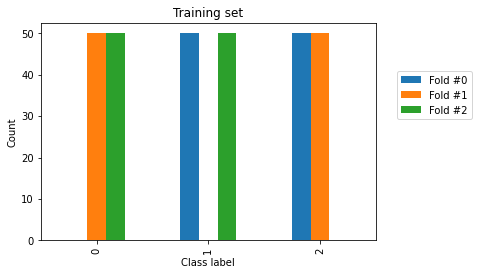
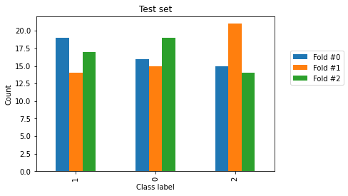
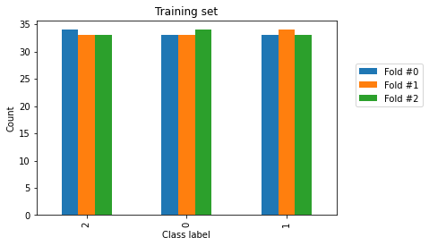
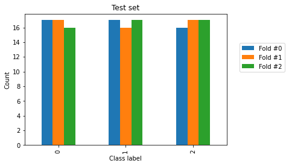
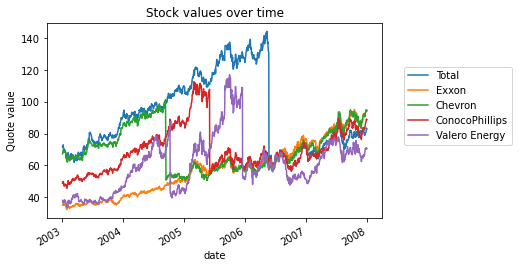
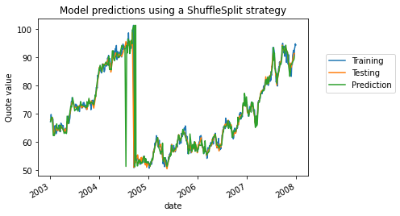

```python
import pandas as pd
import numpy as np
```

### Stratification

openintro에서 배운 stratified와 hands-on preprocessing에서 배운 stratification 내용이 충돌된다.

일단 이번 예시는 hands-on 내용과 일치하니 hands -on에서 다루는 내용을 넣었다.


```python
from sklearn.datasets import load_iris

data, target = load_iris(as_frame=True, return_X_y=True)
```

```python
from sklearn.preprocessing import StandardScaler
from sklearn.linear_model import LogisticRegression
from sklearn.pipeline import make_pipeline

model = make_pipeline(StandardScaler(), LogisticRegression())
```

### K-fold 예시

```python
import numpy as np
from sklearn.model_selection import KFold

data_random = np.random.randn(9, 1)
cv = KFold(n_splits=3)
for train_index, test_index in cv.split(data_random):
    print("TRAIN:", train_index, "TEST:", test_index)
```

    TRAIN: [3 4 5 6 7 8] TEST: [0 1 2]
    TRAIN: [0 1 2 6 7 8] TEST: [3 4 5]
    TRAIN: [0 1 2 3 4 5] TEST: [6 7 8]

### iris 예시에 적용하기

```python
from sklearn.model_selection import cross_validate

cv = KFold(n_splits=3)
results = cross_validate(model, data, target, cv=cv)
test_score = results["test_score"]
print(f"The average accuracy is "
      f"{test_score.mean():.3f} +/- {test_score.std():.3f}")
```

    The average accuracy is 0.000 +/- 0.000

### 표본이 잘 정리되어있어서 발생한 문제

```python
import matplotlib.pyplot as plt

target.plot()
plt.yticks(target.unique())
_ = plt.title("Class value in target y")
```


### K-fold로 발생한 subset 검토하기

```python
n_splits = 3
cv = KFold(n_splits=n_splits)

train_cv_counts = []
test_cv_counts = []
for fold_idx, (train_idx, test_idx) in enumerate(cv.split(data, target)):
    target_train, target_test = target.iloc[train_idx], target.iloc[test_idx]

    train_cv_counts.append(target_train.value_counts())
    test_cv_counts.append(target_test.value_counts())
```

### Training set

```python
train_cv_counts = pd.concat(train_cv_counts, axis=1,
                            keys=[f"Fold #{idx}" for idx in range(n_splits)]).sort_index()
train_cv_counts.index.name = "Class label"
train_cv_counts
```

<div>
<style scoped>
    .dataframe tbody tr th:only-of-type {
        vertical-align: middle;
    }

    .dataframe tbody tr th {
        vertical-align: top;
    }

    .dataframe thead th {
        text-align: right;
    }

</style>
<table border="1" class="dataframe">
  <thead>
    <tr style="text-align: right;">
      <th></th>
      <th>Fold #0</th>
      <th>Fold #1</th>
      <th>Fold #2</th>
    </tr>
    <tr>
      <th>Class label</th>
      <th></th>
      <th></th>
      <th></th>
    </tr>
  </thead>
  <tbody>
    <tr>
      <th>0</th>
      <td>NaN</td>
      <td>50.0</td>
      <td>50.0</td>
    </tr>
    <tr>
      <th>1</th>
      <td>50.0</td>
      <td>NaN</td>
      <td>50.0</td>
    </tr>
    <tr>
      <th>2</th>
      <td>50.0</td>
      <td>50.0</td>
      <td>NaN</td>
    </tr>
  </tbody>
</table>
</div>

### Test set

```python
test_cv_counts = pd.concat(test_cv_counts, axis=1,
                           keys=[f"Fold #{idx}" for idx in range(n_splits)])
test_cv_counts.index.name = "Class label"
test_cv_counts
```

<div>
<style scoped>
    .dataframe tbody tr th:only-of-type {
        vertical-align: middle;
    }

    .dataframe tbody tr th {
        vertical-align: top;
    }

    .dataframe thead th {
        text-align: right;
    }

</style>
<table border="1" class="dataframe">
  <thead>
    <tr style="text-align: right;">
      <th></th>
      <th>Fold #0</th>
      <th>Fold #1</th>
      <th>Fold #2</th>
    </tr>
    <tr>
      <th>Class label</th>
      <th></th>
      <th></th>
      <th></th>
    </tr>
  </thead>
  <tbody>
    <tr>
      <th>0</th>
      <td>50.0</td>
      <td>NaN</td>
      <td>NaN</td>
    </tr>
    <tr>
      <th>1</th>
      <td>NaN</td>
      <td>50.0</td>
      <td>NaN</td>
    </tr>
    <tr>
      <th>2</th>
      <td>NaN</td>
      <td>NaN</td>
      <td>50.0</td>
    </tr>
  </tbody>
</table>
</div>

```python
train_cv_counts.plot.bar()
plt.legend(bbox_to_anchor=(1.05, 0.8), loc="upper left")
plt.ylabel("Count")
_ = plt.title("Training set")
```



```python
test_cv_counts.plot.bar()
plt.legend(bbox_to_anchor=(1.05, 0.8), loc="upper left")
plt.ylabel("Count")
_ = plt.title("Test set")
```


### 이러한 오류를 방지하기 위해서 `shuffle=True`를 설정한다.

```python
cv = KFold(n_splits=3, shuffle=True, random_state=0)
results = cross_validate(model, data, target, cv=cv)
test_score = results["test_score"]
print(f"The average accuracy is "
      f"{test_score.mean():.3f} +/- {test_score.std():.3f}")
```

    The average accuracy is 0.953 +/- 0.009

### stratification이 필요한 이유

one might want to split our data by preserving the original class frequencies: we want to stratify our data by class.

```python
train_cv_counts = []
test_cv_counts = []
for fold_idx, (train_idx, test_idx) in enumerate(cv.split(data, target)):
    target_train, target_test = target.iloc[train_idx], target.iloc[test_idx]

    train_cv_counts.append(target_train.value_counts())
    test_cv_counts.append(target_test.value_counts())
train_cv_counts = pd.concat(train_cv_counts, axis=1,
                            keys=[f"Fold #{idx}" for idx in range(n_splits)])
test_cv_counts = pd.concat(test_cv_counts, axis=1,
                           keys=[f"Fold #{idx}" for idx in range(n_splits)])
train_cv_counts.index.name = "Class label"
test_cv_counts.index.name = "Class label"
```

### Fold별로 Class label의 비율이 다르다는 것을 알 수 있음

```python
train_cv_counts.plot.bar()
plt.legend(bbox_to_anchor=(1.05, 0.8), loc="upper left")
plt.ylabel("Count")
_ = plt.title("Training set")
```


```python
test_cv_counts.plot.bar()
plt.legend(bbox_to_anchor=(1.05, 0.8), loc="upper left")
plt.ylabel("Count")
_ = plt.title("Test set")
```



### Stratified k-fold를 쓰면 population의 class 비율을 매 fold에서 일정하게 유지시킬 수 있다.

```python
from sklearn.model_selection import StratifiedKFold

cv = StratifiedKFold(n_splits=3)
```

```python
results = cross_validate(model, data, target, cv=cv)
test_score = results["test_score"]
print(f"The average accuracy is "
      f"{test_score.mean():.3f} +/- {test_score.std():.3f}")
```

    The average accuracy is 0.960 +/- 0.016

```python
train_cv_counts = []
test_cv_counts = []
for fold_idx, (train_idx, test_idx) in enumerate(cv.split(data, target)):
    target_train, target_test = target.iloc[train_idx], target.iloc[test_idx]

    train_cv_counts.append(target_train.value_counts())
    test_cv_counts.append(target_test.value_counts())
train_cv_counts = pd.concat(train_cv_counts, axis=1,
                            keys=[f"Fold #{idx}" for idx in range(n_splits)])
test_cv_counts = pd.concat(test_cv_counts, axis=1,
                           keys=[f"Fold #{idx}" for idx in range(n_splits)])
train_cv_counts.index.name = "Class label"
test_cv_counts.index.name = "Class label"
```

```python
train_cv_counts.plot.bar()
plt.legend(bbox_to_anchor=(1.05, 0.8), loc="upper left")
plt.ylabel("Count")
_ = plt.title("Training set")
```



```python
test_cv_counts.plot.bar()
plt.legend(bbox_to_anchor=(1.05, 0.8), loc="upper left")
plt.ylabel("Count")
_ = plt.title("Test set")
```



### Groupfold => 예시가 이해가 되지않아서 이런게 있다 정도로만 이해하고 넘어가자.

```python
from sklearn.datasets import load_digits

digits = load_digits()
data, target = digits.data, digits.target
```

```python
from sklearn.preprocessing import MinMaxScaler
from sklearn.linear_model import LogisticRegression
from sklearn.pipeline import make_pipeline

model = make_pipeline(MinMaxScaler(), LogisticRegression(max_iter=1_000))
```

### Shuffle = True or False

```python
from sklearn.model_selection import cross_val_score, KFold

cv = KFold(shuffle=False)
test_score_no_shuffling = cross_val_score(model, data, target, cv=cv,
                                          n_jobs=2)
print(f"The average accuracy is "
      f"{test_score_no_shuffling.mean():.3f} +/- "
      f"{test_score_no_shuffling.std():.3f}")
```

    The average accuracy is 0.931 +/- 0.026

```python
cv = KFold(shuffle=True)
test_score_with_shuffling = cross_val_score(model, data, target, cv=cv,
                                            n_jobs=2)
print(f"The average accuracy is "
      f"{test_score_with_shuffling.mean():.3f} +/- "
      f"{test_score_with_shuffling.std():.3f}")
```

    The average accuracy is 0.969 +/- 0.004

```python
import pandas as pd

all_scores = pd.DataFrame(
    [test_score_no_shuffling, test_score_with_shuffling],
    index=["KFold without shuffling", "KFold with shuffling"],
).T
```

```python
import matplotlib.pyplot as plt

all_scores.plot.hist(bins=10, edgecolor="black", alpha=0.7)
plt.xlim([0.8, 1.0])
plt.xlabel("Accuracy score")
plt.legend(bbox_to_anchor=(1.05, 0.8), loc="upper left")
_ = plt.title("Distribution of the test scores")
```


색이 다른건 파란색과 중복됐기 때문임

### Group fold 중단

```python

```

### None i.i.d. data

- it is quite common to assume that the data are i.i.d, meaning that the generative process does not have any memory of past samples to generate new samples.
- i.i.d => independent and identically distributed
- This assumption is usually violated when `dealing with time series`.

### Read_csv

- parse_dates = True or column 위치 or column 명

csv를 불러올 때 기본값 날짜를 object type으로 불러오는데 pars_dates를 넣으면 date type으로 변환한다.

```python
import pandas as pd

symbols = {"TOT": "Total", "XOM": "Exxon", "CVX": "Chevron",
           "COP": "ConocoPhillips", "VLO": "Valero Energy"}
template_name = ("data/financial-data/{}.csv")

quotes = {}
for symbol in symbols:
    data = pd.read_csv(
        template_name.format(symbol), index_col=0, parse_dates=True
    )
    quotes[symbols[symbol]] = data["open"]
quotes = pd.DataFrame(quotes)
```

```python
import matplotlib.pyplot as plt

quotes.plot()
plt.ylabel("Quote value")
plt.legend(bbox_to_anchor=(1.05, 0.8), loc="upper left")
_ = plt.title("Stock values over time")
```



### R2가 뭐지??

```python
from sklearn.model_selection import train_test_split

data, target = quotes.drop(columns=["Chevron"]), quotes["Chevron"]
data_train, data_test, target_train, target_test = train_test_split(
    data, target, shuffle=True, random_state=0)
```

```python
from sklearn.tree import DecisionTreeRegressor
from sklearn.model_selection import ShuffleSplit
from sklearn.model_selection import cross_val_score

regressor = DecisionTreeRegressor()

cv = ShuffleSplit(random_state=0)

test_score = cross_val_score(regressor, data_train, target_train, cv=cv,
                             n_jobs=2)
print(f"The mean R2 is: "
      f"{test_score.mean():.2f} +/- {test_score.std():.2f}")
```

    The mean R2 is: 0.95 +/- 0.07

```python
regressor.fit(data_train, target_train)
target_predicted = regressor.predict(data_test)
# Affect the index of `target_predicted` to ease the plotting
target_predicted = pd.Series(target_predicted, index=target_test.index)
```

```python
from sklearn.metrics import r2_score

test_score = r2_score(target_test, target_predicted)
print(f"The R2 on this single split is: {test_score:.2f}")
```

    The R2 on this single split is: 0.83

```python
target_train.plot(label="Training")
target_test.plot(label="Testing")
target_predicted.plot(label="Prediction")

plt.ylabel("Quote value")
plt.legend(bbox_to_anchor=(1.05, 0.8), loc="upper left")
_ = plt.title("Model predictions using a ShuffleSplit strategy")
```



iid 개념도 중단.. R2 배우고 다시 와보자
