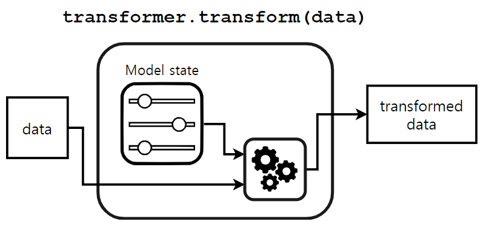

```python
import pandas as pd
import numpy as np
import matplotlib.pyplot as plt
import seaborn as sns
import os
os.getcwd()
```

    'd:\\git_local_repository\\yangoos57\\ML\\[inria] scikit-learn course'

```python
adult_df = pd.read_csv('data/phpMawTba.csv')

adult_df.info()
```

    <class 'pandas.core.frame.DataFrame'>
    RangeIndex: 48842 entries, 0 to 48841
    Data columns (total 15 columns):
     #   Column          Non-Null Count  Dtype
    ---  ------          --------------  -----
     0   age             48842 non-null  int64
     1   workclass       48842 non-null  object
     2   fnlwgt          48842 non-null  int64
     3   education       48842 non-null  object
     4   education-num   48842 non-null  int64
     5   marital-status  48842 non-null  object
     6   occupation      48842 non-null  object
     7   relationship    48842 non-null  object
     8   race            48842 non-null  object
     9   sex             48842 non-null  object
     10  capital-gain    48842 non-null  int64
     11  capital-loss    48842 non-null  int64
     12  hours-per-week  48842 non-null  int64
     13  native-country  48842 non-null  object
     14  class           48842 non-null  object
    dtypes: int64(6), object(9)
    memory usage: 5.6+ MB

```python
adult_df.head()
```

<div>
<style scoped>
    .dataframe tbody tr th:only-of-type {
        vertical-align: middle;
    }

    .dataframe tbody tr th {
        vertical-align: top;
    }

    .dataframe thead th {
        text-align: right;
    }

</style>
<table border="1" class="dataframe">
  <thead>
    <tr style="text-align: right;">
      <th></th>
      <th>age</th>
      <th>workclass</th>
      <th>fnlwgt</th>
      <th>education</th>
      <th>education-num</th>
      <th>marital-status</th>
      <th>occupation</th>
      <th>relationship</th>
      <th>race</th>
      <th>sex</th>
      <th>capital-gain</th>
      <th>capital-loss</th>
      <th>hours-per-week</th>
      <th>native-country</th>
      <th>class</th>
    </tr>
  </thead>
  <tbody>
    <tr>
      <th>0</th>
      <td>25</td>
      <td>Private</td>
      <td>226802</td>
      <td>11th</td>
      <td>7</td>
      <td>Never-married</td>
      <td>Machine-op-inspct</td>
      <td>Own-child</td>
      <td>Black</td>
      <td>Male</td>
      <td>0</td>
      <td>0</td>
      <td>40</td>
      <td>United-States</td>
      <td>&lt;=50K</td>
    </tr>
    <tr>
      <th>1</th>
      <td>38</td>
      <td>Private</td>
      <td>89814</td>
      <td>HS-grad</td>
      <td>9</td>
      <td>Married-civ-spouse</td>
      <td>Farming-fishing</td>
      <td>Husband</td>
      <td>White</td>
      <td>Male</td>
      <td>0</td>
      <td>0</td>
      <td>50</td>
      <td>United-States</td>
      <td>&lt;=50K</td>
    </tr>
    <tr>
      <th>2</th>
      <td>28</td>
      <td>Local-gov</td>
      <td>336951</td>
      <td>Assoc-acdm</td>
      <td>12</td>
      <td>Married-civ-spouse</td>
      <td>Protective-serv</td>
      <td>Husband</td>
      <td>White</td>
      <td>Male</td>
      <td>0</td>
      <td>0</td>
      <td>40</td>
      <td>United-States</td>
      <td>&gt;50K</td>
    </tr>
    <tr>
      <th>3</th>
      <td>44</td>
      <td>Private</td>
      <td>160323</td>
      <td>Some-college</td>
      <td>10</td>
      <td>Married-civ-spouse</td>
      <td>Machine-op-inspct</td>
      <td>Husband</td>
      <td>Black</td>
      <td>Male</td>
      <td>7688</td>
      <td>0</td>
      <td>40</td>
      <td>United-States</td>
      <td>&gt;50K</td>
    </tr>
    <tr>
      <th>4</th>
      <td>18</td>
      <td>?</td>
      <td>103497</td>
      <td>Some-college</td>
      <td>10</td>
      <td>Never-married</td>
      <td>?</td>
      <td>Own-child</td>
      <td>White</td>
      <td>Female</td>
      <td>0</td>
      <td>0</td>
      <td>30</td>
      <td>United-States</td>
      <td>&lt;=50K</td>
    </tr>
  </tbody>
</table>
</div>

```python
col_num = [x for x in adult_df.columns if adult_df[x].dtype == 'int64']

data  = adult_df[col_num].drop(columns=['fnlwgt','education-num'])

data_testing = data.sample(9000)
data_learning = data.drop(data_testing.index)

data_testing.sort_index(inplace=True)
data_learning.sort_index(inplace=True)
```

```python
target_learning = adult_df.loc[data_learning.index,'class']
target_testing = adult_df.loc[data_testing.index,'class']

target_testing.sort_index(inplace=True)
target_learning.sort_index(inplace=True)

# data_testing.reset_index(inplace=True, drop=True)
# data_learning.reset_index(inplace=True, drop=True)

```

### K-nearest neighbors

```python

from sklearn.neighbors import KNeighborsClassifier

model=KNeighborsClassifier()
model.fit(data_learning, target_learning)
```

    KNeighborsClassifier()


```python
target_predicted = model.predict(data_learning)
```

- model state와 testing data를 알고리즘에 넣은 뒤 prediction을 생성


```python
target_predicted[:5]
```

    array([' <=50K', ' >50K', ' <=50K', ' <=50K', ' >50K'], dtype=object)

### 모델 정확도 계산

```python
target_learning[:5] == target_predicted[:5]
```

    0     True
    1    False
    2    False
    5     True
    7     True
    Name: class, dtype: bool

```python
(target_learning == target_predicted).mean()
```

    0.8253852718237036

### Train-test data split

**sklearn 매소드로 Model score 계산하기**

```python
accuracy = model.score(data_testing,target_testing)
model_name = model.__class__.__name__

print(f"{accuracy:.3f}")
```

    0.816

### 용어정리

- Generalization performance : test score or test error를 말함. 같은 용어로 Predictive performance, statistical perfromance가 있음.

- Computational performance : predictive model의 computational cost을 설명함

```python
model_exercise = KNeighborsClassifier(n_neighbors=50)
model_exercise.fit(data_learning,target_learning)
```

    KNeighborsClassifier(n_neighbors=50)

```python
prediction_exer = model_exercise.predict(data_learning)


```

```python
target_learning[:5] == prediction_exer[:5]
```

    0     True
    1     True
    2    False
    5     True
    7     True
    Name: class, dtype: bool

```python
model_exercise.score(data_learning,target_learning)
```

    0.8281461774007329

```python
model_exercise.score(data_testing,target_testing)
```

    0.8267777777777777

## M1_03 Working with numerical data

```python
target = adult_df['class']
data = adult_df.drop(columns=['class'])
```

```python
# numerical data 추출하기
numerical_columns = [x for x in data.columns if data[x].dtype == 'int64']
numerical_columns.remove('fnlwgt')
numerical_columns.remove('education-num')
numerical_columns
```

    ['age', 'capital-gain', 'capital-loss', 'hours-per-week']

```python
data['age'].describe()
```

    count    48842.000000
    mean        38.643585
    std         13.710510
    min         17.000000
    25%         28.000000
    50%         37.000000
    75%         48.000000
    max         90.000000
    Name: age, dtype: float64

```python
data_numeric = data[numerical_columns]
```

### Train-test split the dataset

- random_state = 42 => 매번 새로고침해도 random 값이 바뀌지 않게 설정
- test_size => 테스트 set의 크기를 설정

```python
from sklearn.model_selection import train_test_split

data_train, data_test, target_train, target_test = train_test_split(data_numeric,target, random_state=42, test_size=0.25)
```

```python
from sklearn.linear_model import LogisticRegression
model = LogisticRegression()
model.fit(data_train,target_train)
```

    LogisticRegression()

```python
model.score(data_test,target_test)
```

    0.8070592089099992

### Majority classifier와 모델 비교하기

```python
from sklearn.dummy import DummyClassifier
class_to_predict = " >50K"
high_revenue_clf = DummyClassifier(strategy="constant", constant=class_to_predict)
high_revenue_clf.fit(data_train, target_train)
high_revenue_clf.score(data_test,target_test)
```

    0.23396937187781508

```python
class_to_predict = " <=50K"
high_revenue_clf = DummyClassifier(strategy="constant", constant=class_to_predict)
high_revenue_clf.fit(data_train, target_train)
high_revenue_clf.score(data_test,target_test)
```

    0.7660306281221849

```python
target.value_counts(normalize=True)
```

     <=50K    0.760718
     >50K     0.239282
    Name: class, dtype: float64

### M1_04 Preprocessing for numerical features

- sklearn에는 preprocessing tool이 존재함.

- 데이터를 standardization 한 뒤 logistic regression에 적용할 예정임.

```python
from sklearn import set_config
set_config(display='diagram')
```

```python
data_train.describe()
```

<div>
<style scoped>
    .dataframe tbody tr th:only-of-type {
        vertical-align: middle;
    }

    .dataframe tbody tr th {
        vertical-align: top;
    }

    .dataframe thead th {
        text-align: right;
    }

</style>
<table border="1" class="dataframe">
  <thead>
    <tr style="text-align: right;">
      <th></th>
      <th>age</th>
      <th>capital-gain</th>
      <th>capital-loss</th>
      <th>hours-per-week</th>
    </tr>
  </thead>
  <tbody>
    <tr>
      <th>count</th>
      <td>36631.000000</td>
      <td>36631.000000</td>
      <td>36631.000000</td>
      <td>36631.000000</td>
    </tr>
    <tr>
      <th>mean</th>
      <td>38.642352</td>
      <td>1087.077721</td>
      <td>89.665311</td>
      <td>40.431247</td>
    </tr>
    <tr>
      <th>std</th>
      <td>13.725748</td>
      <td>7522.692939</td>
      <td>407.110175</td>
      <td>12.423952</td>
    </tr>
    <tr>
      <th>min</th>
      <td>17.000000</td>
      <td>0.000000</td>
      <td>0.000000</td>
      <td>1.000000</td>
    </tr>
    <tr>
      <th>25%</th>
      <td>28.000000</td>
      <td>0.000000</td>
      <td>0.000000</td>
      <td>40.000000</td>
    </tr>
    <tr>
      <th>50%</th>
      <td>37.000000</td>
      <td>0.000000</td>
      <td>0.000000</td>
      <td>40.000000</td>
    </tr>
    <tr>
      <th>75%</th>
      <td>48.000000</td>
      <td>0.000000</td>
      <td>0.000000</td>
      <td>45.000000</td>
    </tr>
    <tr>
      <th>max</th>
      <td>90.000000</td>
      <td>99999.000000</td>
      <td>4356.000000</td>
      <td>99.000000</td>
    </tr>
  </tbody>
</table>
</div>

위 테이블을 보면 attribute간 값 차이가 많이 나는 것을 알 수 있음.

사용하고자 하는 모델별로 normalization이 필요할 수도 있고 필수가 아닌 경우도 있음.

Linear model들, 예로들어 logistic regression은 일반적으로 scaling을 해야한다. 반면 Decision Tree는 Scaling을 필요로 하지 않는다.

지금 사용하고자 하는 **StandardScaler**는 평균 0, 표준편차는 1로 만들어놓는다.

SA*(i) = A*(i) - mean(A) / std(A)

```python
from sklearn.preprocessing import StandardScaler

scaler = StandardScaler()
scaler.fit(data_train)
```

<style>div.sk-top-container {color: black;background-color: white;}div.sk-toggleable {background-color: white;}label.sk-toggleable__label {cursor: pointer;display: block;width: 100%;margin-bottom: 0;padding: 0.2em 0.3em;box-sizing: border-box;text-align: center;}div.sk-toggleable__content {max-height: 0;max-width: 0;overflow: hidden;text-align: left;background-color: #f0f8ff;}div.sk-toggleable__content pre {margin: 0.2em;color: black;border-radius: 0.25em;background-color: #f0f8ff;}input.sk-toggleable__control:checked~div.sk-toggleable__content {max-height: 200px;max-width: 100%;overflow: auto;}div.sk-estimator input.sk-toggleable__control:checked~label.sk-toggleable__label {background-color: #d4ebff;}div.sk-label input.sk-toggleable__control:checked~label.sk-toggleable__label {background-color: #d4ebff;}input.sk-hidden--visually {border: 0;clip: rect(1px 1px 1px 1px);clip: rect(1px, 1px, 1px, 1px);height: 1px;margin: -1px;overflow: hidden;padding: 0;position: absolute;width: 1px;}div.sk-estimator {font-family: monospace;background-color: #f0f8ff;margin: 0.25em 0.25em;border: 1px dotted black;border-radius: 0.25em;box-sizing: border-box;}div.sk-estimator:hover {background-color: #d4ebff;}div.sk-parallel-item::after {content: "";width: 100%;border-bottom: 1px solid gray;flex-grow: 1;}div.sk-label:hover label.sk-toggleable__label {background-color: #d4ebff;}div.sk-serial::before {content: "";position: absolute;border-left: 1px solid gray;box-sizing: border-box;top: 2em;bottom: 0;left: 50%;}div.sk-serial {display: flex;flex-direction: column;align-items: center;background-color: white;}div.sk-item {z-index: 1;}div.sk-parallel {display: flex;align-items: stretch;justify-content: center;background-color: white;}div.sk-parallel-item {display: flex;flex-direction: column;position: relative;background-color: white;}div.sk-parallel-item:first-child::after {align-self: flex-end;width: 50%;}div.sk-parallel-item:last-child::after {align-self: flex-start;width: 50%;}div.sk-parallel-item:only-child::after {width: 0;}div.sk-dashed-wrapped {border: 1px dashed gray;margin: 0.2em;box-sizing: border-box;padding-bottom: 0.1em;background-color: white;position: relative;}div.sk-label label {font-family: monospace;font-weight: bold;background-color: white;display: inline-block;line-height: 1.2em;}div.sk-label-container {position: relative;z-index: 2;text-align: center;}div.sk-container {display: inline-block;position: relative;}</style><div class="sk-top-container"><div class="sk-container"><div class="sk-item"><div class="sk-estimator sk-toggleable"><input class="sk-toggleable__control sk-hidden--visually" id="54187454-a130-4df6-b19b-31e09fc8b631" type="checkbox" checked><label class="sk-toggleable__label" for="54187454-a130-4df6-b19b-31e09fc8b631">StandardScaler</label><div class="sk-toggleable__content"><pre>StandardScaler()</pre></div></div></div></div></div>

- 다른 sklearn 모델처럼 preprocessing도 model로 만들어져서 동작함.


```python
### 4개인 이유는 attribute가 4개이기 때문임!
scaler.mean_# means
scaler.scale_ # standard deviations
```

    array([  13.72556083, 7522.59025606,  407.10461772,   12.42378265])

- The transform method for transfromers is similar to the predict method for predictors



```python
data_train_scaled = scaler.transform(data_train)
```

### fit_transform은 앞의 두 절차를 한번에 가능하게 한다.

```python
data_train_scaled = scaler.fit_transform(data_train)

data_train_scaled = pd.DataFrame(data_train_scaled, columns=data_train.columns)

data_train_scaled.describe()
data_train_scaled['age'].describe()
```

    count    3.663100e+04
    mean    -1.263553e-16
    std      1.000014e+00
    min     -1.576792e+00
    25%     -7.753674e-01
    50%     -1.196565e-01
    75%      6.817680e-01
    max      3.741752e+00
    Name: age, dtype: float64

평균이 0에 근접하고 표준편차가 1에 근접하는 사실을 알 수 있다.

```python
plt.figure(figsize=(10,6))
sns.jointplot(data=data_train[:300], x='age', y='hours-per-week', marginal_kws=dict(bins=15))
sns.jointplot(data=data_train_scaled[:300], x='age', y='hours-per-week', marginal_kws=dict(bins=15))

```

    <seaborn.axisgrid.JointGrid at 0x207cf6d9d30>


    <Figure size 720x432 with 0 Axes>


### Pipeline

- It chanins together operations and is used as any other classifier or regressor.

- pipeline을 사용하면 개별 단게에서 설정해야하는 변수를 생략할 수 있다. 과정 내 변수명을 알고 싶다면 model.named_steps 명령어를 사용하면된다.


```python
import time
from sklearn.linear_model import LogisticRegression
from sklearn.pipeline import make_pipeline

model = make_pipeline(StandardScaler(), LogisticRegression())
model
```

<style>div.sk-top-container {color: black;background-color: white;}div.sk-toggleable {background-color: white;}label.sk-toggleable__label {cursor: pointer;display: block;width: 100%;margin-bottom: 0;padding: 0.2em 0.3em;box-sizing: border-box;text-align: center;}div.sk-toggleable__content {max-height: 0;max-width: 0;overflow: hidden;text-align: left;background-color: #f0f8ff;}div.sk-toggleable__content pre {margin: 0.2em;color: black;border-radius: 0.25em;background-color: #f0f8ff;}input.sk-toggleable__control:checked~div.sk-toggleable__content {max-height: 200px;max-width: 100%;overflow: auto;}div.sk-estimator input.sk-toggleable__control:checked~label.sk-toggleable__label {background-color: #d4ebff;}div.sk-label input.sk-toggleable__control:checked~label.sk-toggleable__label {background-color: #d4ebff;}input.sk-hidden--visually {border: 0;clip: rect(1px 1px 1px 1px);clip: rect(1px, 1px, 1px, 1px);height: 1px;margin: -1px;overflow: hidden;padding: 0;position: absolute;width: 1px;}div.sk-estimator {font-family: monospace;background-color: #f0f8ff;margin: 0.25em 0.25em;border: 1px dotted black;border-radius: 0.25em;box-sizing: border-box;}div.sk-estimator:hover {background-color: #d4ebff;}div.sk-parallel-item::after {content: "";width: 100%;border-bottom: 1px solid gray;flex-grow: 1;}div.sk-label:hover label.sk-toggleable__label {background-color: #d4ebff;}div.sk-serial::before {content: "";position: absolute;border-left: 1px solid gray;box-sizing: border-box;top: 2em;bottom: 0;left: 50%;}div.sk-serial {display: flex;flex-direction: column;align-items: center;background-color: white;}div.sk-item {z-index: 1;}div.sk-parallel {display: flex;align-items: stretch;justify-content: center;background-color: white;}div.sk-parallel-item {display: flex;flex-direction: column;position: relative;background-color: white;}div.sk-parallel-item:first-child::after {align-self: flex-end;width: 50%;}div.sk-parallel-item:last-child::after {align-self: flex-start;width: 50%;}div.sk-parallel-item:only-child::after {width: 0;}div.sk-dashed-wrapped {border: 1px dashed gray;margin: 0.2em;box-sizing: border-box;padding-bottom: 0.1em;background-color: white;position: relative;}div.sk-label label {font-family: monospace;font-weight: bold;background-color: white;display: inline-block;line-height: 1.2em;}div.sk-label-container {position: relative;z-index: 2;text-align: center;}div.sk-container {display: inline-block;position: relative;}</style><div class="sk-top-container"><div class="sk-container"><div class="sk-item sk-dashed-wrapped"><div class="sk-label-container"><div class="sk-label sk-toggleable"><input class="sk-toggleable__control sk-hidden--visually" id="52f564d5-7c72-472d-aba6-a3f9c6461447" type="checkbox" ><label class="sk-toggleable__label" for="52f564d5-7c72-472d-aba6-a3f9c6461447">Pipeline</label><div class="sk-toggleable__content"><pre>Pipeline(steps=[('standardscaler', StandardScaler()),

                ('logisticregression', LogisticRegression())])</pre></div></div></div><div class="sk-serial"><div class="sk-item"><div class="sk-estimator sk-toggleable"><input class="sk-toggleable__control sk-hidden--visually" id="9cc340db-1e2c-44e4-bccf-ff757ea0fc9e" type="checkbox" ><label class="sk-toggleable__label" for="9cc340db-1e2c-44e4-bccf-ff757ea0fc9e">StandardScaler</label><div class="sk-toggleable__content"><pre>StandardScaler()</pre></div></div></div><div class="sk-item"><div class="sk-estimator sk-toggleable"><input class="sk-toggleable__control sk-hidden--visually" id="bb5d9fd0-f1fe-4930-b6fb-b97909c585b7" type="checkbox" ><label class="sk-toggleable__label" for="bb5d9fd0-f1fe-4930-b6fb-b97909c585b7">LogisticRegression</label><div class="sk-toggleable__content"><pre>LogisticRegression()</pre></div></div></div></div></div></div></div>

```python
model.named_steps
```

    {'standardscaler': StandardScaler(),
     'logisticregression': LogisticRegression()}

```python
start = time.time()
model.fit(data_train, target_train)
elapsed_time = time.time() - start
```

```python
print(model.score(data_test, target_test))
print(f'iteration times : {model[-1].n_iter_[0]}')

```

    0.8071411022848252
    iteration times : 12

```python
model_un = LogisticRegression()
model_un.fit(data_train,target_train)
model_un.n_iter_[0]
```

    59

### 알아두기

Scaling 유무의 차이는 모델의 정확도 뿐만 아니라 computational performance에도 영향을 준다.

scaling을 한 모델에서는 iteration을 12번 수행한 반면 하지 않은 모델에서는 59번 수행했다.

주의할 점은 모델별로 max_iter이 정해져있는데, scale을 하지 않는 경우 max_iter이 learning을 위해 필요한 iteration 보다 작은 경우 모델이 제대로 학습되지 않게 된다.

## M1\_ Model evaluation using cross-validation

- We can acess the variability of our measure of the model's generalization performance.

- There are many cross-validation strategies. some of these aspects will be covered in more detail in future notebooks.

- k-fold strategy : the entire dataset is split into K partitions.

- Cross validation = C.V.

```python
%%time
from sklearn.model_selection import cross_validate

model = make_pipeline(StandardScaler(),LogisticRegression())
cv_result = cross_validate(model, data_numeric, target, cv=5)
cv_result
```

    Wall time: 623 ms


    {'fit_time': array([0.1245749 , 0.08346152, 0.0835948 , 0.08078623, 0.08336091]),
     'score_time': array([0.01556349, 0.01861572, 0.0175848 , 0.0153017 , 0.0168829 ]),
     'test_score': array([0.79557785, 0.80049135, 0.79965192, 0.79873055, 0.80436118])}

The goal of cross-validation is not to train a model,

but rather to estimate approximately the generalization performance of a model that would have been trained to the full training set,

along with an estimate of the variability

```python
score = cv_result['test_score']
print(f'score : {score.mean():.3f}, std : {score.std():.3f}')
```

    score : 0.800, std : 0.003

by computing std, we can estimate the uncertainty of our model generalization performance.
