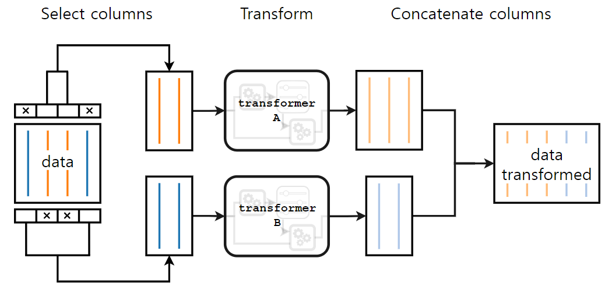

```python
import pandas as pd
import numpy as np
import matplotlib.pyplot as plt
import seaborn as sns
import os
os.getcwd()
```

    'd:\\git_local_repository\\yangoos57\\ML\\[inria] scikit-learn course'

## Encoding of categorical variables

### ordinal encoding

### one-hot encoding

```python
adult_df = pd.read_csv('data/phpMawTba.csv').drop(columns='education-num')

target = adult_df['class']
data = adult_df.drop(columns=['class'])
```

```python
from sklearn.compose import make_column_selector as selector

categorical_columns_selector = selector(dtype_include=object)
categorical_columns = categorical_columns_selector(data)
categorical_columns

# # or

categorical_columns = [x for x in data.columns if adult_df[x].dtype == 'object']

categorical_columns
```

    ['workclass',
     'education',
     'marital-status',
     'occupation',
     'relationship',
     'race',
     'sex',
     'native-country']

```python
data_categorical = data[categorical_columns]
data_categorical.head()
```

<div>
<style scoped>
    .dataframe tbody tr th:only-of-type {
        vertical-align: middle;
    }

    .dataframe tbody tr th {
        vertical-align: top;
    }

    .dataframe thead th {
        text-align: right;
    }

</style>
<table border="1" class="dataframe">
  <thead>
    <tr style="text-align: right;">
      <th></th>
      <th>workclass</th>
      <th>education</th>
      <th>marital-status</th>
      <th>occupation</th>
      <th>relationship</th>
      <th>race</th>
      <th>sex</th>
      <th>native-country</th>
    </tr>
  </thead>
  <tbody>
    <tr>
      <th>0</th>
      <td>Private</td>
      <td>11th</td>
      <td>Never-married</td>
      <td>Machine-op-inspct</td>
      <td>Own-child</td>
      <td>Black</td>
      <td>Male</td>
      <td>United-States</td>
    </tr>
    <tr>
      <th>1</th>
      <td>Private</td>
      <td>HS-grad</td>
      <td>Married-civ-spouse</td>
      <td>Farming-fishing</td>
      <td>Husband</td>
      <td>White</td>
      <td>Male</td>
      <td>United-States</td>
    </tr>
    <tr>
      <th>2</th>
      <td>Local-gov</td>
      <td>Assoc-acdm</td>
      <td>Married-civ-spouse</td>
      <td>Protective-serv</td>
      <td>Husband</td>
      <td>White</td>
      <td>Male</td>
      <td>United-States</td>
    </tr>
    <tr>
      <th>3</th>
      <td>Private</td>
      <td>Some-college</td>
      <td>Married-civ-spouse</td>
      <td>Machine-op-inspct</td>
      <td>Husband</td>
      <td>Black</td>
      <td>Male</td>
      <td>United-States</td>
    </tr>
    <tr>
      <th>4</th>
      <td>?</td>
      <td>Some-college</td>
      <td>Never-married</td>
      <td>?</td>
      <td>Own-child</td>
      <td>White</td>
      <td>Female</td>
      <td>United-States</td>
    </tr>
  </tbody>
</table>
</div>

### Encoding ordinal categories

- The most intutive strategy is to encode each category with a different number.

### bracket을 두 개 쓰면 Dataframe으로 불러온다.

```python
from sklearn.preprocessing import OrdinalEncoder

education_column = data_categorical[['education']]

encoder = OrdinalEncoder()
education_encoded = encoder.fit_transform(education_column)
education_encoded
```

    array([[ 1.],
           [11.],
           [ 7.],
           ...,
           [11.],
           [11.],
           [11.]])

```python
encoder.categories_
```

    [array([' 10th', ' 11th', ' 12th', ' 1st-4th', ' 5th-6th', ' 7th-8th',
            ' 9th', ' Assoc-acdm', ' Assoc-voc', ' Bachelors', ' Doctorate',
            ' HS-grad', ' Masters', ' Preschool', ' Prof-school',
            ' Some-college'], dtype=object)]

```python
data_encoded = encoder.fit_transform(data_categorical)
data_encoded[:5]
```

    array([[ 4.,  1.,  4.,  7.,  3.,  2.,  1., 39.],
           [ 4., 11.,  2.,  5.,  0.,  4.,  1., 39.],
           [ 2.,  7.,  2., 11.,  0.,  4.,  1., 39.],
           [ 4., 15.,  2.,  7.,  0.,  2.,  1., 39.],
           [ 0., 15.,  4.,  0.,  3.,  4.,  0., 39.]])

### 알아두기

OrdinalEncoder uses a lexicographical(사전 순서대로) strategy to map string category labels to integers.

ex) Size 'S', 'M', 'L', 'XL' => 2, 1, 0, 3 by following the alphabetical OrdinalEncoder

```python
from sklearn.preprocessing import OneHotEncoder

encoder = OneHotEncoder(sparse=False)
education_encoded = encoder.fit_transform(education_column)
```

```python
education_encoded
```

    array([[0., 1., 0., ..., 0., 0., 0.],
           [0., 0., 0., ..., 0., 0., 0.],
           [0., 0., 0., ..., 0., 0., 0.],
           ...,
           [0., 0., 0., ..., 0., 0., 0.],
           [0., 0., 0., ..., 0., 0., 0.],
           [0., 0., 0., ..., 0., 0., 0.]])

### Sparse matrix

행열에 포함된 0이 많은 경우, 데이터 공간을 아끼기 위해 필요한 정보만 수록한 행렬을 말한다.


```python
feature_names = encoder.get_feature_names(input_features=['education'])
education_encoded = pd.DataFrame(education_encoded,columns=feature_names)
education_encoded
```

    C:\Users\679oo\anaconda3\lib\site-packages\sklearn\utils\deprecation.py:87: FutureWarning: Function get_feature_names is deprecated; get_feature_names is deprecated in 1.0 and will be removed in 1.2. Please use get_feature_names_out instead.
      warnings.warn(msg, category=FutureWarning)

<div>
<style scoped>
    .dataframe tbody tr th:only-of-type {
        vertical-align: middle;
    }

    .dataframe tbody tr th {
        vertical-align: top;
    }

    .dataframe thead th {
        text-align: right;
    }

</style>
<table border="1" class="dataframe">
  <thead>
    <tr style="text-align: right;">
      <th></th>
      <th>education_ 10th</th>
      <th>education_ 11th</th>
      <th>education_ 12th</th>
      <th>education_ 1st-4th</th>
      <th>education_ 5th-6th</th>
      <th>education_ 7th-8th</th>
      <th>education_ 9th</th>
      <th>education_ Assoc-acdm</th>
      <th>education_ Assoc-voc</th>
      <th>education_ Bachelors</th>
      <th>education_ Doctorate</th>
      <th>education_ HS-grad</th>
      <th>education_ Masters</th>
      <th>education_ Preschool</th>
      <th>education_ Prof-school</th>
      <th>education_ Some-college</th>
    </tr>
  </thead>
  <tbody>
    <tr>
      <th>0</th>
      <td>0.0</td>
      <td>1.0</td>
      <td>0.0</td>
      <td>0.0</td>
      <td>0.0</td>
      <td>0.0</td>
      <td>0.0</td>
      <td>0.0</td>
      <td>0.0</td>
      <td>0.0</td>
      <td>0.0</td>
      <td>0.0</td>
      <td>0.0</td>
      <td>0.0</td>
      <td>0.0</td>
      <td>0.0</td>
    </tr>
    <tr>
      <th>1</th>
      <td>0.0</td>
      <td>0.0</td>
      <td>0.0</td>
      <td>0.0</td>
      <td>0.0</td>
      <td>0.0</td>
      <td>0.0</td>
      <td>0.0</td>
      <td>0.0</td>
      <td>0.0</td>
      <td>0.0</td>
      <td>1.0</td>
      <td>0.0</td>
      <td>0.0</td>
      <td>0.0</td>
      <td>0.0</td>
    </tr>
    <tr>
      <th>2</th>
      <td>0.0</td>
      <td>0.0</td>
      <td>0.0</td>
      <td>0.0</td>
      <td>0.0</td>
      <td>0.0</td>
      <td>0.0</td>
      <td>1.0</td>
      <td>0.0</td>
      <td>0.0</td>
      <td>0.0</td>
      <td>0.0</td>
      <td>0.0</td>
      <td>0.0</td>
      <td>0.0</td>
      <td>0.0</td>
    </tr>
    <tr>
      <th>3</th>
      <td>0.0</td>
      <td>0.0</td>
      <td>0.0</td>
      <td>0.0</td>
      <td>0.0</td>
      <td>0.0</td>
      <td>0.0</td>
      <td>0.0</td>
      <td>0.0</td>
      <td>0.0</td>
      <td>0.0</td>
      <td>0.0</td>
      <td>0.0</td>
      <td>0.0</td>
      <td>0.0</td>
      <td>1.0</td>
    </tr>
    <tr>
      <th>4</th>
      <td>0.0</td>
      <td>0.0</td>
      <td>0.0</td>
      <td>0.0</td>
      <td>0.0</td>
      <td>0.0</td>
      <td>0.0</td>
      <td>0.0</td>
      <td>0.0</td>
      <td>0.0</td>
      <td>0.0</td>
      <td>0.0</td>
      <td>0.0</td>
      <td>0.0</td>
      <td>0.0</td>
      <td>1.0</td>
    </tr>
    <tr>
      <th>...</th>
      <td>...</td>
      <td>...</td>
      <td>...</td>
      <td>...</td>
      <td>...</td>
      <td>...</td>
      <td>...</td>
      <td>...</td>
      <td>...</td>
      <td>...</td>
      <td>...</td>
      <td>...</td>
      <td>...</td>
      <td>...</td>
      <td>...</td>
      <td>...</td>
    </tr>
    <tr>
      <th>48837</th>
      <td>0.0</td>
      <td>0.0</td>
      <td>0.0</td>
      <td>0.0</td>
      <td>0.0</td>
      <td>0.0</td>
      <td>0.0</td>
      <td>1.0</td>
      <td>0.0</td>
      <td>0.0</td>
      <td>0.0</td>
      <td>0.0</td>
      <td>0.0</td>
      <td>0.0</td>
      <td>0.0</td>
      <td>0.0</td>
    </tr>
    <tr>
      <th>48838</th>
      <td>0.0</td>
      <td>0.0</td>
      <td>0.0</td>
      <td>0.0</td>
      <td>0.0</td>
      <td>0.0</td>
      <td>0.0</td>
      <td>0.0</td>
      <td>0.0</td>
      <td>0.0</td>
      <td>0.0</td>
      <td>1.0</td>
      <td>0.0</td>
      <td>0.0</td>
      <td>0.0</td>
      <td>0.0</td>
    </tr>
    <tr>
      <th>48839</th>
      <td>0.0</td>
      <td>0.0</td>
      <td>0.0</td>
      <td>0.0</td>
      <td>0.0</td>
      <td>0.0</td>
      <td>0.0</td>
      <td>0.0</td>
      <td>0.0</td>
      <td>0.0</td>
      <td>0.0</td>
      <td>1.0</td>
      <td>0.0</td>
      <td>0.0</td>
      <td>0.0</td>
      <td>0.0</td>
    </tr>
    <tr>
      <th>48840</th>
      <td>0.0</td>
      <td>0.0</td>
      <td>0.0</td>
      <td>0.0</td>
      <td>0.0</td>
      <td>0.0</td>
      <td>0.0</td>
      <td>0.0</td>
      <td>0.0</td>
      <td>0.0</td>
      <td>0.0</td>
      <td>1.0</td>
      <td>0.0</td>
      <td>0.0</td>
      <td>0.0</td>
      <td>0.0</td>
    </tr>
    <tr>
      <th>48841</th>
      <td>0.0</td>
      <td>0.0</td>
      <td>0.0</td>
      <td>0.0</td>
      <td>0.0</td>
      <td>0.0</td>
      <td>0.0</td>
      <td>0.0</td>
      <td>0.0</td>
      <td>0.0</td>
      <td>0.0</td>
      <td>1.0</td>
      <td>0.0</td>
      <td>0.0</td>
      <td>0.0</td>
      <td>0.0</td>
    </tr>
  </tbody>
</table>
<p>48842 rows × 16 columns</p>
</div>

```python
data_encoded = encoder.fit_transform(data_categorical)
```

```python
columns_encoded = encoder.get_feature_names_out(data_categorical.columns)
pd.DataFrame(data_encoded, columns=columns_encoded)
```

<div>
<style scoped>
    .dataframe tbody tr th:only-of-type {
        vertical-align: middle;
    }

    .dataframe tbody tr th {
        vertical-align: top;
    }

    .dataframe thead th {
        text-align: right;
    }

</style>
<table border="1" class="dataframe">
  <thead>
    <tr style="text-align: right;">
      <th></th>
      <th>workclass_ ?</th>
      <th>workclass_ Federal-gov</th>
      <th>workclass_ Local-gov</th>
      <th>workclass_ Never-worked</th>
      <th>workclass_ Private</th>
      <th>workclass_ Self-emp-inc</th>
      <th>workclass_ Self-emp-not-inc</th>
      <th>workclass_ State-gov</th>
      <th>workclass_ Without-pay</th>
      <th>education_ 10th</th>
      <th>...</th>
      <th>native-country_ Portugal</th>
      <th>native-country_ Puerto-Rico</th>
      <th>native-country_ Scotland</th>
      <th>native-country_ South</th>
      <th>native-country_ Taiwan</th>
      <th>native-country_ Thailand</th>
      <th>native-country_ Trinadad&amp;Tobago</th>
      <th>native-country_ United-States</th>
      <th>native-country_ Vietnam</th>
      <th>native-country_ Yugoslavia</th>
    </tr>
  </thead>
  <tbody>
    <tr>
      <th>0</th>
      <td>0.0</td>
      <td>0.0</td>
      <td>0.0</td>
      <td>0.0</td>
      <td>1.0</td>
      <td>0.0</td>
      <td>0.0</td>
      <td>0.0</td>
      <td>0.0</td>
      <td>0.0</td>
      <td>...</td>
      <td>0.0</td>
      <td>0.0</td>
      <td>0.0</td>
      <td>0.0</td>
      <td>0.0</td>
      <td>0.0</td>
      <td>0.0</td>
      <td>1.0</td>
      <td>0.0</td>
      <td>0.0</td>
    </tr>
    <tr>
      <th>1</th>
      <td>0.0</td>
      <td>0.0</td>
      <td>0.0</td>
      <td>0.0</td>
      <td>1.0</td>
      <td>0.0</td>
      <td>0.0</td>
      <td>0.0</td>
      <td>0.0</td>
      <td>0.0</td>
      <td>...</td>
      <td>0.0</td>
      <td>0.0</td>
      <td>0.0</td>
      <td>0.0</td>
      <td>0.0</td>
      <td>0.0</td>
      <td>0.0</td>
      <td>1.0</td>
      <td>0.0</td>
      <td>0.0</td>
    </tr>
    <tr>
      <th>2</th>
      <td>0.0</td>
      <td>0.0</td>
      <td>1.0</td>
      <td>0.0</td>
      <td>0.0</td>
      <td>0.0</td>
      <td>0.0</td>
      <td>0.0</td>
      <td>0.0</td>
      <td>0.0</td>
      <td>...</td>
      <td>0.0</td>
      <td>0.0</td>
      <td>0.0</td>
      <td>0.0</td>
      <td>0.0</td>
      <td>0.0</td>
      <td>0.0</td>
      <td>1.0</td>
      <td>0.0</td>
      <td>0.0</td>
    </tr>
    <tr>
      <th>3</th>
      <td>0.0</td>
      <td>0.0</td>
      <td>0.0</td>
      <td>0.0</td>
      <td>1.0</td>
      <td>0.0</td>
      <td>0.0</td>
      <td>0.0</td>
      <td>0.0</td>
      <td>0.0</td>
      <td>...</td>
      <td>0.0</td>
      <td>0.0</td>
      <td>0.0</td>
      <td>0.0</td>
      <td>0.0</td>
      <td>0.0</td>
      <td>0.0</td>
      <td>1.0</td>
      <td>0.0</td>
      <td>0.0</td>
    </tr>
    <tr>
      <th>4</th>
      <td>1.0</td>
      <td>0.0</td>
      <td>0.0</td>
      <td>0.0</td>
      <td>0.0</td>
      <td>0.0</td>
      <td>0.0</td>
      <td>0.0</td>
      <td>0.0</td>
      <td>0.0</td>
      <td>...</td>
      <td>0.0</td>
      <td>0.0</td>
      <td>0.0</td>
      <td>0.0</td>
      <td>0.0</td>
      <td>0.0</td>
      <td>0.0</td>
      <td>1.0</td>
      <td>0.0</td>
      <td>0.0</td>
    </tr>
    <tr>
      <th>...</th>
      <td>...</td>
      <td>...</td>
      <td>...</td>
      <td>...</td>
      <td>...</td>
      <td>...</td>
      <td>...</td>
      <td>...</td>
      <td>...</td>
      <td>...</td>
      <td>...</td>
      <td>...</td>
      <td>...</td>
      <td>...</td>
      <td>...</td>
      <td>...</td>
      <td>...</td>
      <td>...</td>
      <td>...</td>
      <td>...</td>
      <td>...</td>
    </tr>
    <tr>
      <th>48837</th>
      <td>0.0</td>
      <td>0.0</td>
      <td>0.0</td>
      <td>0.0</td>
      <td>1.0</td>
      <td>0.0</td>
      <td>0.0</td>
      <td>0.0</td>
      <td>0.0</td>
      <td>0.0</td>
      <td>...</td>
      <td>0.0</td>
      <td>0.0</td>
      <td>0.0</td>
      <td>0.0</td>
      <td>0.0</td>
      <td>0.0</td>
      <td>0.0</td>
      <td>1.0</td>
      <td>0.0</td>
      <td>0.0</td>
    </tr>
    <tr>
      <th>48838</th>
      <td>0.0</td>
      <td>0.0</td>
      <td>0.0</td>
      <td>0.0</td>
      <td>1.0</td>
      <td>0.0</td>
      <td>0.0</td>
      <td>0.0</td>
      <td>0.0</td>
      <td>0.0</td>
      <td>...</td>
      <td>0.0</td>
      <td>0.0</td>
      <td>0.0</td>
      <td>0.0</td>
      <td>0.0</td>
      <td>0.0</td>
      <td>0.0</td>
      <td>1.0</td>
      <td>0.0</td>
      <td>0.0</td>
    </tr>
    <tr>
      <th>48839</th>
      <td>0.0</td>
      <td>0.0</td>
      <td>0.0</td>
      <td>0.0</td>
      <td>1.0</td>
      <td>0.0</td>
      <td>0.0</td>
      <td>0.0</td>
      <td>0.0</td>
      <td>0.0</td>
      <td>...</td>
      <td>0.0</td>
      <td>0.0</td>
      <td>0.0</td>
      <td>0.0</td>
      <td>0.0</td>
      <td>0.0</td>
      <td>0.0</td>
      <td>1.0</td>
      <td>0.0</td>
      <td>0.0</td>
    </tr>
    <tr>
      <th>48840</th>
      <td>0.0</td>
      <td>0.0</td>
      <td>0.0</td>
      <td>0.0</td>
      <td>1.0</td>
      <td>0.0</td>
      <td>0.0</td>
      <td>0.0</td>
      <td>0.0</td>
      <td>0.0</td>
      <td>...</td>
      <td>0.0</td>
      <td>0.0</td>
      <td>0.0</td>
      <td>0.0</td>
      <td>0.0</td>
      <td>0.0</td>
      <td>0.0</td>
      <td>1.0</td>
      <td>0.0</td>
      <td>0.0</td>
    </tr>
    <tr>
      <th>48841</th>
      <td>0.0</td>
      <td>0.0</td>
      <td>0.0</td>
      <td>0.0</td>
      <td>0.0</td>
      <td>1.0</td>
      <td>0.0</td>
      <td>0.0</td>
      <td>0.0</td>
      <td>0.0</td>
      <td>...</td>
      <td>0.0</td>
      <td>0.0</td>
      <td>0.0</td>
      <td>0.0</td>
      <td>0.0</td>
      <td>0.0</td>
      <td>0.0</td>
      <td>1.0</td>
      <td>0.0</td>
      <td>0.0</td>
    </tr>
  </tbody>
</table>
<p>48842 rows × 102 columns</p>
</div>

### Choosing encoding strategy

- OneHotEncoder는 linear model에 좋다.
- OrdinalEncoder는 tree-based models에 좋다.

Linear models은 순서가 잘못된 카테고리(misordered categories)에 Tree models보다 더 영향을 많이 받는다.

물론 OrdinalEncoder를 쓸 순 있지만 몇가지 주의해서 사용해아한다.

- 해당 category가 ordinal이어야 함.
- encoded category와 원래 순서가 같아야함.

OneHotEncoder는 column이 많이 생기기 때문에 tree 모델 계산에 드는 비용이 늘어나게 된다. 따라서 nominal인 attribute에도 ordinalencoder를 추천한다.

### Pipeline에 Encoder 포함하기

```python
from sklearn.pipeline import make_pipeline
from sklearn.linear_model import LogisticRegression

model = make_pipeline(
    OneHotEncoder(handle_unknown='ignore'), LogisticRegression(max_iter=500)
)
```

### handle_unknown

- OneHotEncoder에 포함되는 handle_unknown은 train_set에는 포함됐는데 test_set에는 포함되지 않아서 발생하는 오류를 없애는 용도로 사용된다.

- 어떤 membership 개수가 1개인데, train_set에 포함되지 않고 test_set에 포함되는 경우에는, 해당 membership은 encoding이 되지 않은 체로 남아있게 된다.

- 왜냐하면 make_pipeline을 통해 데이터가 train 된 후 그 모델을 가지고 testing을 진행하는 것이기 때문이다.


```python
from sklearn.model_selection import cross_validate
cv_results= cross_validate(model, data_categorical, target)
cv_results
```

    {'fit_time': array([3.0549016 , 1.95256853, 1.89158463, 2.3199544 , 2.22608924]),
     'score_time': array([0.08644485, 0.08166909, 0.07385516, 0.07588482, 0.08471704]),
     'test_score': array([0.83222438, 0.83560242, 0.82872645, 0.83312858, 0.83466421])}

```python
scores = cv_results['test_score']
print(f' score mean : {scores.mean(): .3f}, score std : {scores.std(): .3f}')
```

     score mean :  0.833, score std :  0.002

### Exercise

```python
from sklearn.compose import make_column_selector as selector

categorical_columns = selector(dtype_include='object')
categorical_columns_selector = categorical_columns(data)
data_categorical = data[categorical_columns]
```

```python
from sklearn.pipeline import make_pipeline
from sklearn.preprocessing import OrdinalEncoder
from sklearn.linear_model import LogisticRegression

model = make_pipeline(OrdinalEncoder(handle_unknown = 'use_encoded_value', unknown_value = -1 ), LogisticRegression(max_iter=500))

```

```python
from sklearn.model_selection import cross_validate

cv_result = cross_validate(model, data_categorical, target, error_score='raise')
cv_result
```

    {'fit_time': array([1.1448431 , 1.08406806, 1.11679602, 0.95446897, 0.73432469]),
     'score_time': array([0.10227561, 0.09878707, 0.0787673 , 0.07945442, 0.06002498]),
     'test_score': array([0.75514382, 0.75555328, 0.75573301, 0.75358313, 0.75788288])}

```python
from sklearn.preprocessing import OneHotEncoder
model = make_pipeline(OneHotEncoder(handle_unknown='ignore'), LogisticRegression(max_iter=500))
```

```python
cv_result = cross_validate(model, data_categorical, target )
```

```python
cv_result
```

    {'fit_time': array([1.41253281, 1.25485945, 1.25681615, 1.98606658, 1.09955859]),
     'score_time': array([0.03338957, 0.03629804, 0.05181813, 0.08128047, 0.03550386]),
     'test_score': array([0.83222438, 0.83560242, 0.82872645, 0.83312858, 0.83466421])}

### Transformer : Using numerical and categorical variables together

```python
from sklearn.compose import make_column_selector as selector

numerical_columns_selector = selector(dtype_exclude = 'object')
categorical_columns_selector = selector(dtype_include = 'object')

numerical_column = numerical_columns_selector(data)
categorical_column = categorical_columns_selector(data)
```

```python
from sklearn.preprocessing import OneHotEncoder, StandardScaler

categorical_preprocessor = OneHotEncoder(handle_unknown='ignore')
numerical_preprocessor = StandardScaler()
```

```python
from sklearn.compose import ColumnTransformer

preprocessor = ColumnTransformer([
    ('one-hot-encoder', categorical_preprocessor, categorical_columns),
    ('standard_scaler', numerical_preprocessor, numerical_column)
    ])

```

### Columntransformer 작동 원리

- ColumnTransformer([('column 제목', 'preprocessor', 'column 명 ')])
  

```python
from sklearn.linear_model import LogisticRegression
from sklearn.pipeline import make_pipeline
from sklearn import set_config
set_config(display='diagram')
model = make_pipeline(preprocessor, LogisticRegression(max_iter=500))
model
```

<style>#sk-0e605333-106a-441e-b8dd-9b06a71d8293 {color: black;background-color: white;}#sk-0e605333-106a-441e-b8dd-9b06a71d8293 pre{padding: 0;}#sk-0e605333-106a-441e-b8dd-9b06a71d8293 div.sk-toggleable {background-color: white;}#sk-0e605333-106a-441e-b8dd-9b06a71d8293 label.sk-toggleable__label {cursor: pointer;display: block;width: 100%;margin-bottom: 0;padding: 0.3em;box-sizing: border-box;text-align: center;}#sk-0e605333-106a-441e-b8dd-9b06a71d8293 label.sk-toggleable__label-arrow:before {content: "▸";float: left;margin-right: 0.25em;color: #696969;}#sk-0e605333-106a-441e-b8dd-9b06a71d8293 label.sk-toggleable__label-arrow:hover:before {color: black;}#sk-0e605333-106a-441e-b8dd-9b06a71d8293 div.sk-estimator:hover label.sk-toggleable__label-arrow:before {color: black;}#sk-0e605333-106a-441e-b8dd-9b06a71d8293 div.sk-toggleable__content {max-height: 0;max-width: 0;overflow: hidden;text-align: left;background-color: #f0f8ff;}#sk-0e605333-106a-441e-b8dd-9b06a71d8293 div.sk-toggleable__content pre {margin: 0.2em;color: black;border-radius: 0.25em;background-color: #f0f8ff;}#sk-0e605333-106a-441e-b8dd-9b06a71d8293 input.sk-toggleable__control:checked~div.sk-toggleable__content {max-height: 200px;max-width: 100%;overflow: auto;}#sk-0e605333-106a-441e-b8dd-9b06a71d8293 input.sk-toggleable__control:checked~label.sk-toggleable__label-arrow:before {content: "▾";}#sk-0e605333-106a-441e-b8dd-9b06a71d8293 div.sk-estimator input.sk-toggleable__control:checked~label.sk-toggleable__label {background-color: #d4ebff;}#sk-0e605333-106a-441e-b8dd-9b06a71d8293 div.sk-label input.sk-toggleable__control:checked~label.sk-toggleable__label {background-color: #d4ebff;}#sk-0e605333-106a-441e-b8dd-9b06a71d8293 input.sk-hidden--visually {border: 0;clip: rect(1px 1px 1px 1px);clip: rect(1px, 1px, 1px, 1px);height: 1px;margin: -1px;overflow: hidden;padding: 0;position: absolute;width: 1px;}#sk-0e605333-106a-441e-b8dd-9b06a71d8293 div.sk-estimator {font-family: monospace;background-color: #f0f8ff;border: 1px dotted black;border-radius: 0.25em;box-sizing: border-box;margin-bottom: 0.5em;}#sk-0e605333-106a-441e-b8dd-9b06a71d8293 div.sk-estimator:hover {background-color: #d4ebff;}#sk-0e605333-106a-441e-b8dd-9b06a71d8293 div.sk-parallel-item::after {content: "";width: 100%;border-bottom: 1px solid gray;flex-grow: 1;}#sk-0e605333-106a-441e-b8dd-9b06a71d8293 div.sk-label:hover label.sk-toggleable__label {background-color: #d4ebff;}#sk-0e605333-106a-441e-b8dd-9b06a71d8293 div.sk-serial::before {content: "";position: absolute;border-left: 1px solid gray;box-sizing: border-box;top: 2em;bottom: 0;left: 50%;}#sk-0e605333-106a-441e-b8dd-9b06a71d8293 div.sk-serial {display: flex;flex-direction: column;align-items: center;background-color: white;padding-right: 0.2em;padding-left: 0.2em;}#sk-0e605333-106a-441e-b8dd-9b06a71d8293 div.sk-item {z-index: 1;}#sk-0e605333-106a-441e-b8dd-9b06a71d8293 div.sk-parallel {display: flex;align-items: stretch;justify-content: center;background-color: white;}#sk-0e605333-106a-441e-b8dd-9b06a71d8293 div.sk-parallel::before {content: "";position: absolute;border-left: 1px solid gray;box-sizing: border-box;top: 2em;bottom: 0;left: 50%;}#sk-0e605333-106a-441e-b8dd-9b06a71d8293 div.sk-parallel-item {display: flex;flex-direction: column;position: relative;background-color: white;}#sk-0e605333-106a-441e-b8dd-9b06a71d8293 div.sk-parallel-item:first-child::after {align-self: flex-end;width: 50%;}#sk-0e605333-106a-441e-b8dd-9b06a71d8293 div.sk-parallel-item:last-child::after {align-self: flex-start;width: 50%;}#sk-0e605333-106a-441e-b8dd-9b06a71d8293 div.sk-parallel-item:only-child::after {width: 0;}#sk-0e605333-106a-441e-b8dd-9b06a71d8293 div.sk-dashed-wrapped {border: 1px dashed gray;margin: 0 0.4em 0.5em 0.4em;box-sizing: border-box;padding-bottom: 0.4em;background-color: white;position: relative;}#sk-0e605333-106a-441e-b8dd-9b06a71d8293 div.sk-label label {font-family: monospace;font-weight: bold;background-color: white;display: inline-block;line-height: 1.2em;}#sk-0e605333-106a-441e-b8dd-9b06a71d8293 div.sk-label-container {position: relative;z-index: 2;text-align: center;}#sk-0e605333-106a-441e-b8dd-9b06a71d8293 div.sk-container {/* jupyter's `normalize.less` sets `[hidden] { display: none; }` but bootstrap.min.css set `[hidden] { display: none !important; }` so we also need the `!important` here to be able to override the default hidden behavior on the sphinx rendered scikit-learn.org. See: https://github.com/scikit-learn/scikit-learn/issues/21755 */display: inline-block !important;position: relative;}#sk-0e605333-106a-441e-b8dd-9b06a71d8293 div.sk-text-repr-fallback {display: none;}</style><div id="sk-0e605333-106a-441e-b8dd-9b06a71d8293" class="sk-top-container"><div class="sk-text-repr-fallback"><pre>Pipeline(steps=[(&#x27;columntransformer&#x27;,

                 ColumnTransformer(transformers=[(&#x27;one-hot-encoder&#x27;,
                                                  OneHotEncoder(handle_unknown=&#x27;ignore&#x27;),
                                                  &lt;sklearn.compose._column_transformer.make_column_selector object at 0x0000020ABAF30880&gt;),
                                                 (&#x27;standard_scaler&#x27;,
                                                  StandardScaler(),
                                                  [&#x27;age&#x27;, &#x27;fnlwgt&#x27;,
                                                   &#x27;capital-gain&#x27;,
                                                   &#x27;capital-loss&#x27;,
                                                   &#x27;hours-per-week&#x27;])])),
                (&#x27;logisticregression&#x27;, LogisticRegression(max_iter=500))])</pre><b>Please rerun this cell to show the HTML repr or trust the notebook.</b></div><div class="sk-container" hidden><div class="sk-item sk-dashed-wrapped"><div class="sk-label-container"><div class="sk-label sk-toggleable"><input class="sk-toggleable__control sk-hidden--visually" id="2fa2f0f1-1704-4629-8f6b-391611f28432" type="checkbox" ><label for="2fa2f0f1-1704-4629-8f6b-391611f28432" class="sk-toggleable__label sk-toggleable__label-arrow">Pipeline</label><div class="sk-toggleable__content"><pre>Pipeline(steps=[(&#x27;columntransformer&#x27;,
                 ColumnTransformer(transformers=[(&#x27;one-hot-encoder&#x27;,
                                                  OneHotEncoder(handle_unknown=&#x27;ignore&#x27;),
                                                  &lt;sklearn.compose._column_transformer.make_column_selector object at 0x0000020ABAF30880&gt;),
                                                 (&#x27;standard_scaler&#x27;,
                                                  StandardScaler(),
                                                  [&#x27;age&#x27;, &#x27;fnlwgt&#x27;,
                                                   &#x27;capital-gain&#x27;,
                                                   &#x27;capital-loss&#x27;,
                                                   &#x27;hours-per-week&#x27;])])),
                (&#x27;logisticregression&#x27;, LogisticRegression(max_iter=500))])</pre></div></div></div><div class="sk-serial"><div class="sk-item sk-dashed-wrapped"><div class="sk-label-container"><div class="sk-label sk-toggleable"><input class="sk-toggleable__control sk-hidden--visually" id="84cf8f84-2a5f-419d-868d-8a02608c783e" type="checkbox" ><label for="84cf8f84-2a5f-419d-868d-8a02608c783e" class="sk-toggleable__label sk-toggleable__label-arrow">columntransformer: ColumnTransformer</label><div class="sk-toggleable__content"><pre>ColumnTransformer(transformers=[(&#x27;one-hot-encoder&#x27;,
                                 OneHotEncoder(handle_unknown=&#x27;ignore&#x27;),
                                 &lt;sklearn.compose._column_transformer.make_column_selector object at 0x0000020ABAF30880&gt;),
                                (&#x27;standard_scaler&#x27;, StandardScaler(),
                                 [&#x27;age&#x27;, &#x27;fnlwgt&#x27;, &#x27;capital-gain&#x27;,
                                  &#x27;capital-loss&#x27;, &#x27;hours-per-week&#x27;])])</pre></div></div></div><div class="sk-parallel"><div class="sk-parallel-item"><div class="sk-item"><div class="sk-label-container"><div class="sk-label sk-toggleable"><input class="sk-toggleable__control sk-hidden--visually" id="b9aeb9e3-a8e9-41f7-999e-cab3aa938af7" type="checkbox" ><label for="b9aeb9e3-a8e9-41f7-999e-cab3aa938af7" class="sk-toggleable__label sk-toggleable__label-arrow">one-hot-encoder</label><div class="sk-toggleable__content"><pre>&lt;sklearn.compose._column_transformer.make_column_selector object at 0x0000020ABAF30880&gt;</pre></div></div></div><div class="sk-serial"><div class="sk-item"><div class="sk-estimator sk-toggleable"><input class="sk-toggleable__control sk-hidden--visually" id="75b7d6eb-2c81-4921-8ab0-cad9273b28ff" type="checkbox" ><label for="75b7d6eb-2c81-4921-8ab0-cad9273b28ff" class="sk-toggleable__label sk-toggleable__label-arrow">OneHotEncoder</label><div class="sk-toggleable__content"><pre>OneHotEncoder(handle_unknown=&#x27;ignore&#x27;)</pre></div></div></div></div></div></div><div class="sk-parallel-item"><div class="sk-item"><div class="sk-label-container"><div class="sk-label sk-toggleable"><input class="sk-toggleable__control sk-hidden--visually" id="8455e1b8-e7ae-4cfc-b936-3c45d5674cb6" type="checkbox" ><label for="8455e1b8-e7ae-4cfc-b936-3c45d5674cb6" class="sk-toggleable__label sk-toggleable__label-arrow">standard_scaler</label><div class="sk-toggleable__content"><pre>[&#x27;age&#x27;, &#x27;fnlwgt&#x27;, &#x27;capital-gain&#x27;, &#x27;capital-loss&#x27;, &#x27;hours-per-week&#x27;]</pre></div></div></div><div class="sk-serial"><div class="sk-item"><div class="sk-estimator sk-toggleable"><input class="sk-toggleable__control sk-hidden--visually" id="beadaa2b-13d2-4e54-b65d-b663fbfe387a" type="checkbox" ><label for="beadaa2b-13d2-4e54-b65d-b663fbfe387a" class="sk-toggleable__label sk-toggleable__label-arrow">StandardScaler</label><div class="sk-toggleable__content"><pre>StandardScaler()</pre></div></div></div></div></div></div></div></div><div class="sk-item"><div class="sk-estimator sk-toggleable"><input class="sk-toggleable__control sk-hidden--visually" id="b3b0f52d-2429-4d0d-bf14-7bf226a75506" type="checkbox" ><label for="b3b0f52d-2429-4d0d-bf14-7bf226a75506" class="sk-toggleable__label sk-toggleable__label-arrow">LogisticRegression</label><div class="sk-toggleable__content"><pre>LogisticRegression(max_iter=500)</pre></div></div></div></div></div></div></div>

```python
from sklearn.model_selection import train_test_split

data_train, data_test, target_train, target_test = train_test_split(data, target, random_state=42)
```

```python
_ = model.fit(data_train, target_train)
```

```python
(model.predict(data_test) == target_test).mean()
```

    0.8582425681762346

```python
from sklearn.model_selection import cross_validate
cv_result = cross_validate(model, data, target, cv=5)
cv_result
```

    {'fit_time': array([1.88789725, 1.59824586, 2.49867463, 1.86383438, 1.78309011]),
     'score_time': array([0.04785728, 0.06697297, 0.05750132, 0.0501852 , 0.06561947]),
     'test_score': array([0.85228785, 0.85105947, 0.84930385, 0.85257985, 0.85667486])}

### Fitting a more powerful model

다른 모델의 performance를 살펴보고 더 나은 모델이 있을지 점검해보자.

- For tree-based models, the handling of numerical and categorical variables is simpler than for linear models.
  - We do not need to scale the numerical features
  - using an ordinal encoding for the categorical variables is fine even if the encoding results in an arbitray ordering.

```python
from sklearn.ensemble import HistGradientBoostingClassifier
from sklearn.preprocessing import OrdinalEncoder

categorical_preprocessor = OrdinalEncoder(handle_unknown='use_encoded_value', unknown_value= -1)

preprocessor = ColumnTransformer([('categorical', categorical_preprocessor, categorical_columns)], remainder="passthrough")

model = make_pipeline(preprocessor, HistGradientBoostingClassifier())
```

### HistGradientBoostingClassifier

매우 좋다고 한다.

```python
_ = model.fit(data_train, target_train)

model.score(data_test, target_test)
```

    0.8797805257554664

### Exercise

```python
from sklearn.preprocessing import StandardScaler
from sklearn.preprocessing import OrdinalEncoder
from sklearn.pipeline import make_pipeline
from sklearn.compose import ColumnTransformer
from sklearn.model_selection import cross_validate

numerical_preprocessor = StandardScaler()
categorical_preprocessor = OrdinalEncoder(handle_unknown="use_encoded_value", unknown_value = -1)

preprocessor = ColumnTransformer([
    ('numerical', numerical_preprocessor, numerical_column),
    ('categorical', categorical_preprocessor, categorical_column)
])
model = make_pipeline(preprocessor, HistGradientBoostingClassifier())
cv_result = cross_validate(model,data,target)
cv_result
```

    {'fit_time': array([1.55848622, 1.43981433, 1.58595634, 1.43365455, 1.22896409]),
     'score_time': array([0.0648582 , 0.06629252, 0.09653473, 0.07640481, 0.06157136]),
     'test_score': array([0.8732726 , 0.87235132, 0.8729525 , 0.87305487, 0.87776413])}

```python
from sklearn.preprocessing import OneHotEncoder
from sklearn.compose import ColumnTransformer
from sklearn.pipeline import make_pipeline

categorical_preprocessor = OneHotEncoder(handle_unknown='ignore', sparse=False)
preprocessor = ColumnTransformer([('categorical', categorical_preprocessor, categorical_column)], remainder='passthrough')
model = make_pipeline(preprocessor, HistGradientBoostingClassifier())
cv_result = cross_validate(model,data,target)
cv_result
```

    {'fit_time': array([3.66681075, 3.59259176, 3.54879737, 3.85077429, 3.97472668]),
     'score_time': array([0.24810314, 0.12551618, 0.14622188, 0.12290215, 0.17382073]),
     'test_score': array([0.87276077, 0.87214659, 0.87387387, 0.87356675, 0.8762285 ])}

### Remainder 하고 안하고에 따라 4% 정도 정확도가 차이난다.


