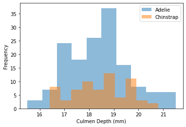
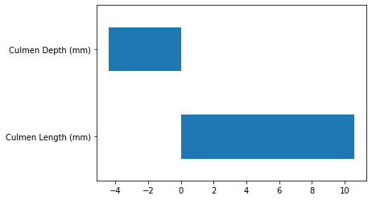

```python
import pandas as pd
import numpy as np
```

### Linear model for classification

In regression, we saw that the target to be predicted was a continuous variable. In classification, this target will be discrete.

- Numerical variables에도 discrete이 있음을 명심하자!

```python
penguins = pd.read_csv("data/penguins_classification.csv")

# only keep the Adelie and Chinstrap classes
penguins = penguins.set_index("Species").loc[
    ["Adelie", "Chinstrap"]].reset_index()
culmen_columns = ["Culmen Length (mm)", "Culmen Depth (mm)"]
target_column = "Species"
```

```python
import matplotlib.pyplot as plt

for feature_name in culmen_columns:
    plt.figure()
    # plot the histogram for each specie
    penguins.groupby("Species")[feature_name].plot.hist(alpha=0.5, legend=True)
    plt.xlabel(feature_name)
```




```python
from sklearn.model_selection import train_test_split

penguins_train, penguins_test = train_test_split(penguins, random_state=0)

data_train = penguins_train[culmen_columns]
data_test = penguins_test[culmen_columns]

target_train = penguins_train[target_column]
target_test = penguins_test[target_column]
```

```python
import sklearn
sklearn.set_config(display="diagram")
```

```python
from sklearn.preprocessing import StandardScaler
from sklearn.linear_model import LogisticRegression
from sklearn.pipeline import make_pipeline

model = make_pipeline(StandardScaler(), LogisticRegression(penalty='none'))
model.fit(data_train, target_train)
model.score(data_test, target_test)

```

    1.0

```python
weight =pd.Series(model[-1].coef_[0], index=culmen_columns)
weight.plot.barh()

```

    <AxesSubplot:>



### Exercise

- In the previous notebook we set penalty="none" to disable regularization entirely.
- This parameter can also control the type of regularization to use, whereas the regularization strength is set using the parameter C.
- Settingpenalty="none" is equivalent to an infinitely large value of C. In this exercise, we ask you to train a logistic regression classifier using the penalty="l2" regularization (which happens to be the default in scikit-learn) to find by yourself the effect of the parameter C.

```python
logistic_regression = make_pipeline(
    StandardScaler(), LogisticRegression(penalty="l2"))
```

```python
Cs = [0.01, 0.1, 1, 10]
for c in Cs :
    logistic_regression.set_params(logisticregression__C=c)
    logistic_regression.fit(data_train,target_train)
    acc = logistic_regression.score(data_test,target_test)
    print(acc)

```

    0.6545454545454545
    0.9454545454545454
    1.0
    1.0

```python
x =[]
for c in Cs :
    logistic_regression.set_params(logisticregression__C=c)
    logistic_regression.fit(data_train,target_train)
    x.append(logistic_regression[-1].coef_[0])
```

```python
k = pd.DataFrame(x,columns=culmen_columns,index=Cs).T
culmen_columns
k
```

<div>
<style scoped>
    .dataframe tbody tr th:only-of-type {
        vertical-align: middle;
    }

    .dataframe tbody tr th {
        vertical-align: top;
    }

    .dataframe thead th {
        text-align: right;
    }

</style>
<table border="1" class="dataframe">
  <thead>
    <tr style="text-align: right;">
      <th></th>
      <th>0.01</th>
      <th>0.10</th>
      <th>1.00</th>
      <th>10.00</th>
    </tr>
  </thead>
  <tbody>
    <tr>
      <th>Culmen Length (mm)</th>
      <td>0.467537</td>
      <td>1.725882</td>
      <td>3.724988</td>
      <td>6.580371</td>
    </tr>
    <tr>
      <th>Culmen Depth (mm)</th>
      <td>-0.002953</td>
      <td>-0.286512</td>
      <td>-1.096500</td>
      <td>-2.491597</td>
    </tr>
  </tbody>
</table>
</div>

```python
k.plot.barh()
```

    <AxesSubplot:>


```python
k.plot.bar()
```

    <AxesSubplot:>


### 참고하기

C가 작아질수록 weight이 0에 근접함.(Regularization이 강할수록 0에 가까워짐)

Ridge 모델의 Alpha는 값이 커지면서 Regularization이 강해지지만, LogisticRegression의 C는 값이 작아지면서 Regularization이 강해진다.

```python
k
```

<div>
<style scoped>
    .dataframe tbody tr th:only-of-type {
        vertical-align: middle;
    }

    .dataframe tbody tr th {
        vertical-align: top;
    }

    .dataframe thead th {
        text-align: right;
    }

</style>
<table border="1" class="dataframe">
  <thead>
    <tr style="text-align: right;">
      <th></th>
      <th>0.01</th>
      <th>0.10</th>
      <th>1.00</th>
      <th>10.00</th>
    </tr>
  </thead>
  <tbody>
    <tr>
      <th>Culmen Length (mm)</th>
      <td>0.467537</td>
      <td>1.725882</td>
      <td>3.724988</td>
      <td>6.580371</td>
    </tr>
    <tr>
      <th>Culmen Depth (mm)</th>
      <td>-0.002953</td>
      <td>-0.286512</td>
      <td>-1.096500</td>
      <td>-2.491597</td>
    </tr>
  </tbody>
</table>
</div>

```python
b = pd.DataFrame([k.iloc[0].values,k.iloc[1].values,[0.01,0.10,1.00,10.00]]).T
b.columns=['leng','depth','cs']
```

```python
b.iloc[0].to_list()
```

    [0.4675371847893255, -0.0029527834145905182, 0.01]

```python

```
