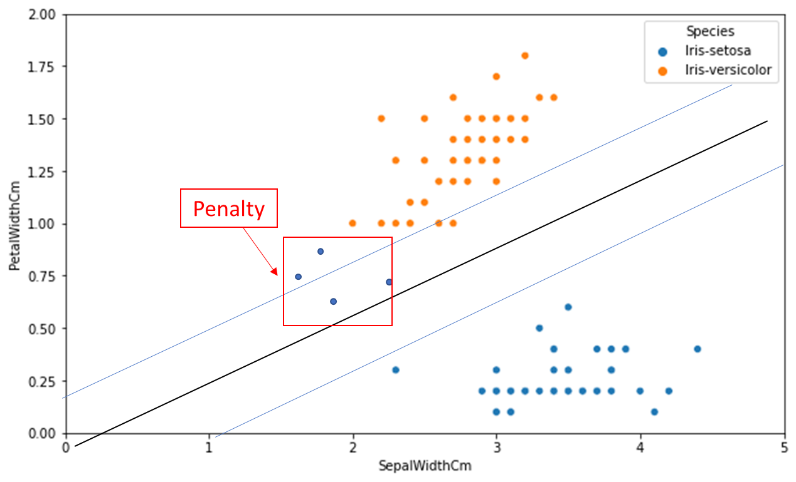
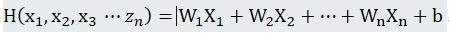
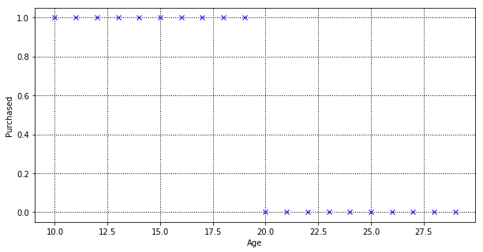
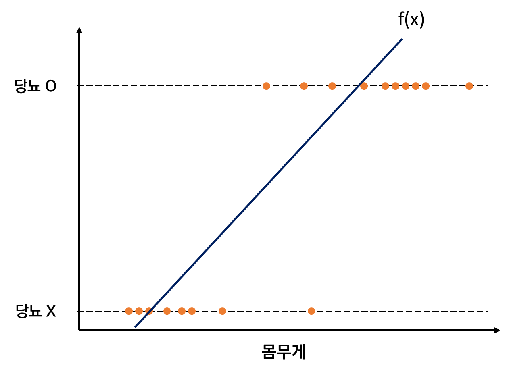
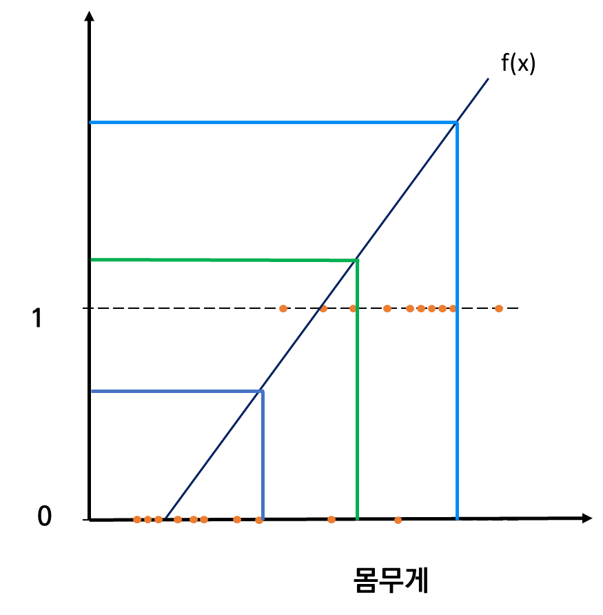

# 모델 유형 분류

이번 장은 제목과 내용이 다소 다르다. Ch3에서 설명한 Tree 방식을 실제 적용하는 장이 아닌 함수로 Target Value를 구분하는 모델을 새로 소개한다. 글에서는 이를 Numeric Parameter을 이용한 예측모델이라고 명명한다. 용어에 익숙해지자. 함수를 이용한 여러 예측 모델이 있지만, 이 책에서는 linear function을 이용한 모델에 대해서 다룬다. 책을 읽는 대상이 ML 입문자이므로 ML의 본질을 소개하는데 초점을 두고 있다보니 , 다소 복잡하고 수학 지식이 필요로 하는 모델은 제외한 것이다.

### Linear Function과 Tree 차이점

Tree는 Attribute 중 IG가 높은 몇몇만 사용하는 반면에 Linear function은 Attribute 전부를 사용한다. 다만 Attribute별로 영향력(Weight:W)이 다르므로 Attribute 전부가 쓰이긴 하나 모두 동일한 비중으로 Target-value를 선정할 때 영향을 줄 수는 없다.

<aside>
💡 $**f(x) = w_0 +w_1x_1+w_2x_2 \cdots$     <식 4-1> Linear function 공식**

x는 instance의 개별 Attribute 값 | W는 Attribute가 얼마나 중요한지 영향력을 나타내는 값

</aside>

### Linear Function 기본

$f(x) = w_0 +w_1x_1+w_2x_2 \cdots$ ⇒ Linear Model

$w_0$을 제외한 값은 개별 instance의 Attribute(x)와 Attribute가 가지는 비중(w)을 의미한다. Attribute가 많으면 식이 그만큼 늘어나게 된다.

최적의 Linear Model을 찾기 위해서는 확보한 데이터를 바탕으로 Weight Set을 찾아야한다. Attribute가 많아질수록 그만큼 W를 찾고 상호 관계를 파악해야하므로 최적의 값을 구하기 어려워지겠지만, 그렇다고 Attribute가 많다고 정확도가 높아지는건 아니다. W가 매우 낮다면 있으나마나 하는 Attribute이기 때문이다. 다시 말해 W가 크다는 것은 W에 해당하는 attribute가 Class를 분류하는데 다른 attribute보다 더 큰 영향을 끼친다는 의미다.

<!-- <W를 구하기 위해선 Cost function을 알아야한다. > 책에서 배우게 된다면 넣어보자. -->

### Linear discriminant function 이해하기

Linear function( SVM, Logistic regression, linear regression)은 Class 분류선을 기준으로 대상을 분류하기만 하는게 아니라 해당 클래스에 얼마나 일치하는지 확률도 알 수 있다. A처럼 하나의 점이 decision boundary 위에 올라와 있다면 이는 구분하기 애매한 instance이다. Decision Boundary에서 점차 멀어지게 된다면 Instance가 해당 영역이 맞을 확률이 올라가게 된다. 마치 Decision Boundary에서 멀어질 수록 파란색과 주황색이 점점 진해지는 것처럼 Instance가 점점 멀어질수록 해당 영역일 확률이 높다는 말이다.

### Support Vector Machine

SVM은 Margin의 크기와 margin안에 있는 instance 개수를 선정 기준으로 삼아 Objective function을 구한다.

1. Margin 간격

1. Magin에서 벗어난 Instance 수에 따라 패널티 부여

   

   패널티를 먹이는 공식은 Hinge Loss를 통해서 결정된다. f(x) -1에서 0 사이는 파란색 점들에 가까운 margin에 속해있는 점에 대한 Penalty이다 . f(x) 0 이후는 Decision Boundary를 넘은, 빨간색 박스로 쳐져있는 점들에 대한 Penalty이다.

   

### Questions

1. W를 구하는 방법은?

   W와 $w_0$을 구하는 방법은 어떤 방법론을 택하느냐에 따라 다르다.

   Linear function은 Gradient Descent와 Normal equation을 통해 구한다.

2. <그림 4-1>에서와 같이 x축과 y축을 attribute별로 만든 뒤 일일히 W를 파악해야하는건가?

   Attribute는 축이다. iris 데이터는 5개의 attribute가 있으니까 4개의 축이 있다. 5개가 아닌 이유는 우리가 구하고자 하는 Target-Value는 축이 아니고 좌표상에 값으로 구현되기 때문이다. <그림 4-1>은 Petal과 Sepal 그리고 Target-Value인 Species 총 세가지 attribute에 대한 Classification 문제라고 보면된다. Target-Value는 Species가 Setosa인지 verisicolor인지 구분하는 것이다. A라는 instance의 Sepal과 Petal을 보고 A가 setosa인지 verisicolor인지 구분하는 classification model인 것이다. 여기서 Attribute가 하나씩 더 추가될 때마다 차원이 늘어나게되고 최대 3차원까지는 그림으로 이해할 수 있지만 그 이후로는 그래프로 그릴 수 없다. (4차원이 있지만 시각적으로 대상을 구분할 수 없다.

   

3. $**f(x) = w_0 +w_1x_1+w_2x_2 \cdots$ N차원 함수라고 보는게 맞는거지?\*\*

   맞다. 아래와 같은 말이니까.

   

4. 단순히 더하는 방식이 어떻게 예측에 효과가 있는거지?

5. Discriminant function은 모든 attritbute에 대한 function을 말하는거 맞는지? 아니면 궁극적인 f(x)에만 해당되는건지?

   

6. 3차원인데 어떻게 선형함수가 되는거지?

   차원은 Attribute 개수와 연관있고 선형함수는 함수 식과 관련있다. 선형함수는 1차함수를 다르게 표현한 말에 불과하다. 1차함수가 영어로 linear function인데 이를 직역하면 선형함수가 된다. 2차원에서는 선으로 표현되나 3차원에서는 면으로 표현된다.

   

   축이 하나 추가되면 이런 모양을 하게된다. <나중에 게시할 생각이 있다면 한국인 사이트에서 퍼온거니까 새로 만들기>

7. Support Vector machine에 Margin을 설정하는 이유가 Instance를 구분하기 위한 최소한의 버퍼를 얻기 위함이 아닐까? line과 함께 있는 margin 밖에 있는 instance는 대상을 구분할 때 최소한 50%이상의 확률을 확보하게 되니까 그런 이유 때문에 margin을 쓰는건가?

   어떤 Instance가 Line에 딱 달라 붙어있으면 확률이 0이고 거의 끝에 가깝도록 멀리 떨어져있으면 확률이 1이라고 하니, margin을 둬서 딱 달라붙는 instance와 line 근처에서 놀아나는 Instance를 최소화 하도록 하는 거 같다는 생각이다. 즉 분류에 있어서 애매함을 최소화 하기위해 마진을 둬서 일정 %이상을 유지하도록 하는게 margin의 목적 같다.

   어떤 선을 긋느냐에 따라 같은 instance라도 A일 확률이 70%에서 50%로 감소 될 수도 있는거 아닌가.

   Training set에 있는 Instance들에게 있어서 최소한의 확률을 margin을 통해서 확보하는것 아닌가? 그럼에도 margin안에 있는 일부 instance는 A일 확률과 B일 확률이 대략적으로 반반일 수도 있긴 하겠지만.

   Training set을 통해 그어진 선은 Instance의 애매함을 최소로 만들기 위한 선이라 할 수 있는건가? margin을 통해서 instance들을 구분할 수 있는 확률을 최소한 몇퍼센트라도 올려놨으니까. 여러 조건을 충족하는 대상 중 가장 넓은 margin을 고르는거니까 일부 margin 내에 있는 instance를 제외하고는 최소 5:5 극단적인 예시로 A일 수 있는 확률이 60%이거나 아니면 B일 수 있는 확률이 60%를 보장 받을 수 있게 되는 것 같다.

   그리고 앞으로도 Traning Set의 분포와 유사하게 따를거라는 판단하에 이미 몇몇 outlier만 제외하고 margin 밖에 있을 확률이 높기 때문에 정확히 구분할 수 있는것 같다.

8. 분명 Decision Boundary를 기준으로 멀리 떨어져 있는 값일 수록 분류가 명확하다고 했는데 갑자기 Fit한 모델을 찾기 위해서는 예측값과 실제 값간에 차이가 작아야 한다고 말하고 있다.

   Regression, Logical Regression, Support Vector Machine 모두 Classification에 사용 가능하다는 것을 알고 있음. 셋 다 직선으로 문제를 해결함.

   Support Vector Machine은 아래 그림과 같이 Margin이 있고 Target-Value를 Hue로 보여준다. 축이 아니다.

   

   나는 당연히 Linear Regression은 아래 그림처럼 Margin 없이 선을 찾는 방식이 Linear Regression이라 생각해왔다. Tree에서도 그렇고 SVM에서도 그렇고 선에서 멀어질수록 대상을 구분할 확률이 높아지기 때문에 선을 멀리두면 좋다는 인식이 있었다. 이런 바탕으로 Linear Regression을 이해하려고 하니 예측값과 실제값이 작으면 좋다는 말이 이해가 되지 않았다. 그도 그런게 Classification하는 방법에는 SVM과 Linear Regression, Logistic Regression이 있다고 하니 SVM처럼 Target Value가 점으로 표기되고 이를 선으로 구분하는 방법 중 하나라고 생각했다. 다시 말하면 SVM은 Margin과 Error로 값을 매긴다음 가장 좋은 모델(대상을 구분하는 직선 하나하나가 모두 모델이 될 수 있다. 그러니 수만가지 모델이 나올 수 있다. )을 고르는 방식이고 Linear Regression은 이와는 다른 기준을 사용해서 최적의 모델을 구하는 방법을 배운다 생각했었다.

   

   여태까지 이런식으로 대상을 구분하는 게 Linear Regrssion이라고 믿고 있었다.

   지금까지 이해한 바로는 Linear Regression은 Target Value를 구분할 선을 찾는게 아니라 Attribute간 관계를 밝혀내는 방법이라는 것이다. X와 Y가 상관관계가 있음을 밝혀내고 X 값에 따라 Y값을 예측하는게 선형회귀의 목적이다.

   

   1. 또 다시 헷갈린다. Regression은 분류 기준이 Float인 것을 말한다. 대상을 Yes No 이분법으로 구분하는게 Classification이라면 Regression은 대상을 Float으로 ( Ex) Y> K 이면 Yes Y <K 이면 No로 분류하자.)구분한다고 이해했다. 그러니까 Logical Regression에서 처럼 x에 따라 Y를 예측하는게 필요한건가 싶다.
   2. Linear regression은 Numeric value를 예측하기 위해 쓰는데 어째서 Classification에 적용되는거지?

   3. Attributes가 많아지면 어떻게 되지?

   ⇒ N차원 함수가 생기겠지. 값과 오차가 가장 작은 선 또는 면 또는 hyperplane을 찾는거겠지

   1. 내가 알고 있는 개념인 회귀와 Regression는 왜 매칭이 되지 않는거지?
   2. 데이터에 결측치가 있으면 기계가 예상을 못하나?
   3. Regression에는 Target-Value가 뭐지? 그냥 값을 찾는건가? 아니지 구하고자 하는 값이 있을거니까. X가 입력값 Y가 출력값인데, 둘 간에 선형관계가 확인됐다고 판단되면 Y를 가지고도 X를 찾는 시도도 가능한가?

      축 하나는 무조건 Target Value를 찾는 용도로 사용되겠지. 귀뚜라미가 우는 횟수를 통해서 섭씨 온도를 에측하는 것처럼. 그러니까 H(x)가 Y이니까 나머지 attribute를 통해서 구하고자 하는 값 Y를 예측할 수 있는거구나.

      

      반대로 SVM Decision Boundary 수식은 $w^T+b =0$ 이니까 방정식이다. 방정식이므로 0이상이면 A, 0이하면 B라는 a set of rule이 형성된다.

   4. Classification을 어떻게 Regression으로 만들지?

      불가능하다고 하네. Regression 문제를 Classification으로 만드는건 가능하다고 하네.

      궁금한것. Y값을 가지고 어느수준 이상이면 Yes로 그 이하면 No로 구할 수 있지않나? 그럼 모든 Classification문제들은 Regression으로 바꿀 수 있는거 아닌가?

      지금 앞서 설명한 내용은 Regression을 가지고 Classification을 만드는 방법이었음.

      Training set에 있는 Target- Attribute가 Yes or No로 이미 구분되어있고 이를 바탕으로 새로운 Instance가 Yes일지 No일지 예측하는게 Classification이다.

      Regression은 Target-Attribute 자체가 Yes or No로 표현되지 않고 연속적인 수치로 구분이 되어있음. Regression을 Classification으로 바꾸려면 사회적 합의나 과학적 사실을 바탕으로 Yes or No를 가르는 기준을 선정해야한다. 새로운 Attribute를 만들어 Instance별로 Yes or No를 부여할 수 있다. 그리고 이렇게 만들어진 Attribute를 바탕으로 새로운 Instance가 Yes 또는 No인지를 파악한다면 Classification이된다. 만약 새로 만든 Attribute를 쓰지않고 계속해서 수치를 기준으로 Yes or No를 판단한다면 Regression을 계속 Classifcation으로 만드는 방식으로 쓰게 되는 거다. 단순히 생각해봐도 가공된 값(새로운 Attribute)를 바탕으로 추론하는 것 보다는 Regression을 Classification으로 바꾸는 방법으로 새로운 Instance의 Class를 추론하는게 더 정확도가 높을거라 생각한다.

      Classification을 Regression으로 바꿀 수 없는 이유는 Classification 문제는 아래 처럼 표현될 수 밖에 없기 때문이다. 그럼 Logistic Regression은 Classification model인가? Logistic Regression은 어떻게 가능한거지?

      Logistic Regression은 Classification문제를 Regression으로 가지고 온건가?

      아니다. Classification은 0과 1로 구분되는거고 Regression은 연속적인 값이다. 연속적인 값을 0과 1로 구분할 수 는 있지만 0과 1을 연속적인 값으로 바꿀 수는 없다.

      Regression을 Classification으로 바꾸는건 가능하다. Classification을 Regression으로 바꾸는건 불가능하다. 왜 불가능하지? 우리가 생각하는 방식이 Regression에서 Classification으로 밖에 작용하지 않기 때문이다. Classification이 되야 언어로서 작용한다. 모든 사건은 시간의 흐름안에서 작용한다. 시간은 끊을 수 없는 연속적인 것이다. 따라서 명확하게 끊김이 있는 기준은 이세상에 존재하지 않는다. 우리모두 시간에 영향을 받고 있고 시간이 regression이기 때문이다. 우리가 말하는 순간 Regression은 끊기고 Classification이 된다. 말을 하기 위해서는 인위적인 기준을 새워야 하기 때문이다. 즉 우리가 하는 모든 언어는 모두 주관적인 기준이 깔려있다. 이렇게 모든게 주관적인 기준에 세워졌기 때문에 이 기준을 적용한다면 언어까지 해체되고 설명 자체도 혼란스러워진다. 그러니 언어 자체는 그래도 두고 인간이 언어를 사용하는 방식 수준에서 이야기를 이어나가자. 언어도 그렇고 다른 사회현상, 어떤 물체를 정의하는 것에 대해 인간들은 합의를 본다. 주관적인 기준을 절대적인 기준으로 생각하자는 것이다. 그리고 이렇게 사회적 합의를 하고 오랜 기간동안 사용하다보면 이 기준이 세상에 존재하는 법칙처럼 절대적이라 생각하고는 사회적 합의라는 사실을 인지하지 못하게 된다.

      인간은 주관적인 기준을 절대적인 기준으로 자연스럽게 여기는 방식으로 진화해왔다고 할 수 있다. 우리는 강아지와 고양이를 명확하게 분류 할 수 있지만 사실 이를 분류할 수 있는 절대기준이라는 것은 존재하지 않는다. 애초에 기준이라는 의미 자체가 연속적인 무언가를 구분짓는 잣대를 들이댄다는 것이기 때문이다. 강아지와 고양이를 구분할때 생김새라던가 소리, 행위 등으로 구분할 수 있는데, 이는 대상을 구분짓는 것 자체가 인간의 본능이므로 매우 당연한 것으로 여겨진다. 그리고 이를 구분짓는 기준 조차도 다른 기준에 의해 설립된 것이다. 강아지가 짖는 소리와 고양이가 우는 소리도 어떤 기준을 가지고 구분한다는 말이다. 고양이와 강아지의 음성을 구분하는 것은 음성학적으로 표현 될 거고 이를 주파수 대역으로 표시할 것이다. 주파수 대역을 선정하는 것 자체가 실수를 소수나 정수로 끊는 행위이기 때문에 Classification의 시작점이라고 이해할 수 있다. 이처럼 언어를 파고들면 파고들수록 인간이 사회적으로 합의한 기준이 어느정도인지 그리고 무엇인지 파악할수 있다.

      이처럼 Classification(우리가 절대기준이라고 착각하는 기준)도 결국에는 다른 Classification에 의해 설립된 것이고 더 깊게 그 기준을 파악하다보면 최초로 Regression을 두고 기준을 잡는 행위를 발견하게 될 것이다. 기준을 파고들어가다가 float을 구분하는 순간이 첫 classification이라고 볼 수 있다.

      따라서 Regression이 Classification으로 되는 것은 언어의 당연한 구조이므로 Classification을 가지고 Regression을 할 수는 없다. 우리가 Classification을 Regression한다고 착각하는 예시들은 단지 Classification을 수립하기 위해 사용한 기준들일 뿐이다. 예로들면 중산층이 맞냐 아니냐를 구분하는것은 Classification이다. Classification을 Regression화 한다고 착각하는 예시중 하나는 중산층을 20000~40000달러 범위라고 생각하면 되지 않을까 하는 발상이다. 하지만 애초에 중산층이라는 단어를 사용하기 위해서는 중산층이 무엇인지 이미 정의를 해야하기 때문에 Classification이 Regression으로 바뀐다기 보다는 해당 기준을 처음 사용하기 위해 설정한 값을 변경하는 수준에 그치는 것 밖에 안된다. 중산층이라는 단어가 언제 쓰였는지 모르겠지만 분명 중산층과 중산층이 아닌 계층을 구분하는 기준이 있었을 것이다. 사회적 합의가 완벽히 이뤄지지 않았다면 그 기준이 애매했을 것이다. 학자마다 중산층을 정의하는 기준이 달랐을 수도 있다. 어쨌든 중산층이라는 단어 자체에는 대상을 분류하는 기준이 있었다. 다만 용어를 최초로 사용한 뒤 수십년이 지나고보면 그 기준이 애매해지거나 아예 초기 의도한 기준과는 다른 기준이 자리잡혀있을 수도 있다. 그러다보니 마치 중산층인가 아닌가라는 Classification Problem을 regression problem으로 변환 할 수있다고 착각하게 된다. 예로들면 20000~40000달러 안에 속한 사람을 중산층이고 그 외 사람들이 중산층이 아니라고 생각하면 이게 바로 Classification을 Regression으로 바꾼것 아닌가라는 발상인 것이다.

      충분히 그렇게 생각할 수 있지만 누누히 말했듯 중산층이라는 단어를 처음 사용할 때 이미 어떤 기준들을 사용해 중산층인지 아닌지를 구분했기 때문에 앞에서 생각한 발상은 중산층이라는 기준을 어떻게 다시 정의 내릴까의 수준이지 Classification을 Regression으로 바꾼 것이 아니다.

      종합하자면 인간은 연속적인 대상을 주관적인 기준으로 구분 짓는 본능이 있다. 세상은 절대적인 끊김이 없는 Float의 세상이기에 절대적인 기준이란 존재하지않고 오로지 주관적인 기준만 있을 뿐이다. 인간들은 합의를 통해 주관적인 기준을 절대적인 기준으로 사용하자고 합의할 뿐이고 세월이 흐르면서 원래는 주관적인 기준이 우리 인식에서는 자연에서도 실제로 절대적인 기준이라고 착각을 하게 된다.

      세상의 모든 분류는 흐름(=Regression)에서 기준(=Classification)으로 형성될 수 밖에 없기에 우리가 하는 언어 자체는 모두 기준을 바탕으로 다른 기준을 새운 것에 불과하다. 절대적인 기준이라 합의했던 기준들을 해체하고 내려가다보면 그 끝단에서 만나는게 흐름(=regression)일 뿐이다. 따라서 Classification은 하단에 있는 Classification에 분류 됐을 뿐이다. 우리가 Classification을Regression으로 바꾼다는 발상은 사실 Regression을 Classification하기 위한 선정 기준들을 재정립하는 행위를 착각했던 것이다.

      우리가 Classification이라고 생각하는 모든것들이 주관적인 기준으로 선정된것이다. 이세상에 모든 것들은 다 float과 같이 이어져있다. 구분을 짓는다는 것 자체가 머리속에서 일어나는 것일 뿐이다.

      우리가 착각하고 있는게 있다면 기준을 새운다는 것 자체가 연속적인 대상을 수치화하는 것이다. 모든 세계는 시간 안에서 이뤄지기 때문에 절대적인 기준을 가지고 끊을 수 없다.

      즉 우리가 본능적으로 하고 있는 Classification이 사실은 무언가를 기준으로 두고 구분하는 것을 바탕으로 두고 있음을 이해해야한다. Classification이 곧 언어다.

      Classification과 Class probability estimation은 다른건가?

      Classfication의 한 방법인

      

      Linear Regression 관계가 아닌 데이터 셋은 어떻게 되는거지 그럼? 걍 머신의 정확도가 낮아지게 될 뿐인가?

      Log-odds와 Linear function이 같다는 가정

      Log-odds = Linear function 이게 무슨소린지 며칠동안 이해하려고 노력했다.

      수학과 통계 지식이 전무한 나로서는 이렇게 직관적인 수식을 이해하기 위해서 여러 개념을 알아가고 관련성을 고심하며 그나마 의미를 이해할 수 있게 됐다. 나와 비슷한 처지에 있는 분들이 이 수식을 이해하는데 조금이나마 힌트를 얻을 수 있도록 글을 정리했다.

      어떤 발상에서 이런 기법을 적용했는지 이해해보자

      알아두기

      y=ax+b

      우리가 1차함수로 배운 y=ax+b는 여러가지 이름으로 불린다. 대표적인 용어가 선형함수다. 1차함수가 영어로 Linear function인데 그냥 직역해서 선형함수로도 불린다. 이외에도 x가 y와 비례 또는 반비례 관계에 있다고 표현하기도 한다.

      여담이지만 y= ax+b 식 하나로 수많은 의미를 내포한다는게 참 새롭다. 하나의 식으로 수많은 현상을 해석한다는 점에서 수학의 간결함을 느끼게 한다. Machine Learning을 배우면서 수많은 통계 지식을 접하게 되는데 정말 기발한 아이디어가 넘처나는 영역이고 인간의 창의성이란 이런 것이구나 하는 깨달음을 얻어가고 있다.

      Linear function = x와 y가 비례 또는 반비례 관계에 있음을 설명해줌. 기울기에 따라 관련성이 얼마나 높냐 낮냐가 구분 되긴 하지만 양의 관계라면 비례 음의 관계라면 반비례다.

      Logistic regession에서 y는 Yes or No ⇒ 1 or 0이고 x는 어떤 요소겠지 Logistic function을 적용하기 위해서는 당연히 x와 y가 Linear하다는 가정이 있겠지.

      아래 그래프를 보면 몸무게가 증가할수록 당뇨인 경우가 증가하는 경향을 확인할 수 있다. Logistic function을 사용하기 위해서는 이처럼 X와 Y가 상관관계가 있어야 한다.

      

      X와 Y가 비례관계에 있으면 이와 같이 몸무게가 점점 증가할수록 당뇨 비율이 올라가는 것을 알 수 있다. 이 그래프가 먼저 나와야할듯

      

      하지만 Linear 함수는 무한대로 퍼져나가기 때문에 몸무게가 증가할 수록 아래처럼 된다.

      아래 그래프 처럼 뻗어나간다. 이미 1은 초과해버린지 오래다.

      

      f(x)는 1을 지나 저 멀리 떠나고 있지만 몸무게가 증가할수록 당뇨가 증가하는 것, 즉 비례관계는 변하지 않는다.

      [그림 2]처럼 x와 y가 비례관계에 있으면 몸무게에 따라 당뇨비율이 점차적으로 증가하는 것을 알 수 있다. 그리고 [그림 3]처럼 몸무게가 증가할수록 f(x)값이 점점 상승한다.

      뭔가 감이 오지 않는가. 몸무게가 증가할 때 당뇨 비율이 점차 올라가는 것과 마찬가지로 f(x)값도 점차 올라간다. 즉 당뇨 비율이 올라가는 것은 f(x)값의 증가를 의미한다.

      여기서 이제 하나의 가정이 들어간다. f(x)값이 혹시 당뇨에 관한 odds이지 않을까 하는 발상이다. 우리는 앞서 Odds라는 개념을 통해서 확률을 수로 변환하는 방법을 터득했다. 90%일어날 확률이 9로 표현되는 것이다. 이처럼
