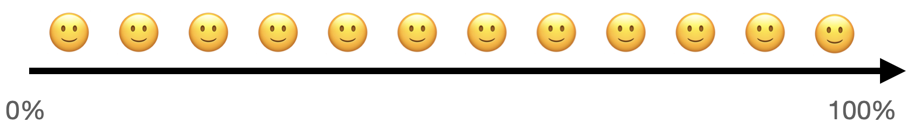
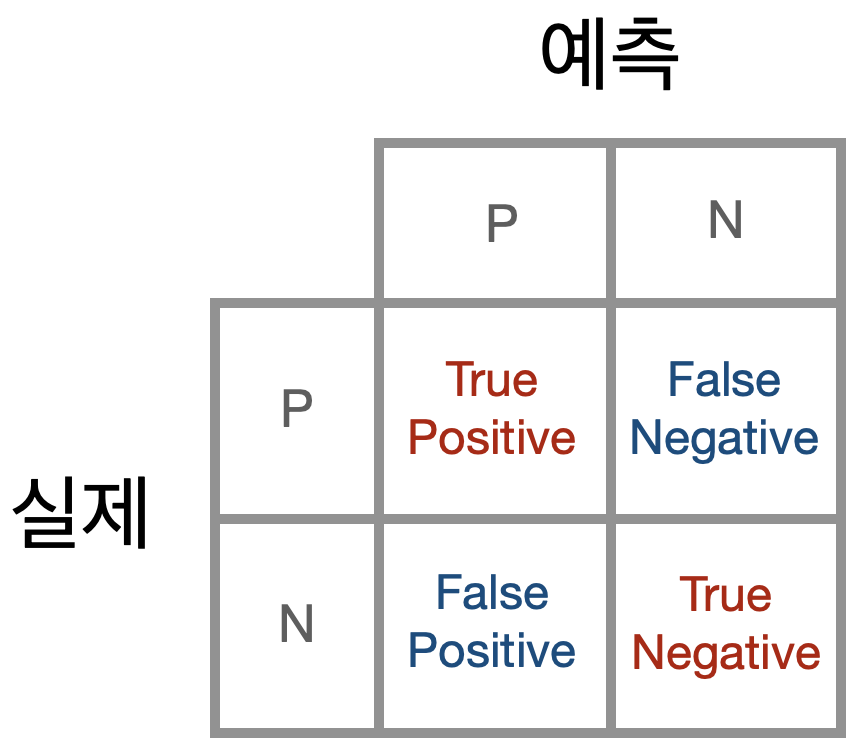
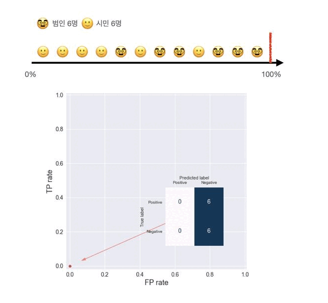
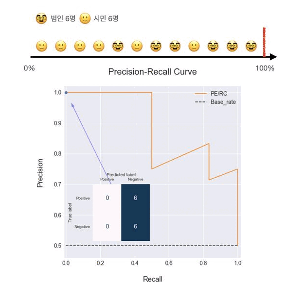
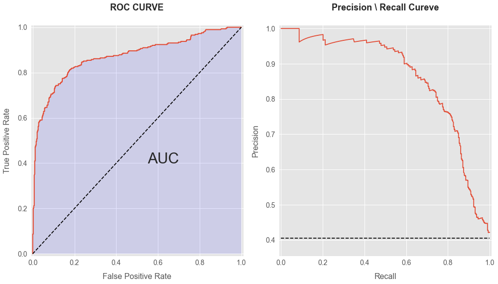

<br>

## 글의 방향

ROC Curve와 Precision-Recall Curve는 classification 모델의 성능을 파악하기 위해 활용됩니다.

일반적으로는 모델 성능을 파악하는 방법으로 예측 정확도(Accuracy)를 활용합니다. 10건 중 8건의 테스트 데이터를 맞추면 정확도가 모델의 80%가 되는 식입니다. 그런데 이 방법에는 문제가 있습니다.

예로들어 왼손잡이와 오른손잡이를 구분하는 예측 모델을 만든다고 생각해 보겠습니다. 대한민국의 오른손잡이, 왼손잡이 분포는 각각 95%, 5% 입니다. 테스트 데이터가 실제 분포를 따른다고 할때, 예측 모델이 모든 데이터를 전부 오른손잡이로 예측했다면 이 모델의 정확도는 95%가 됩니다. 정확도만 보면 엄청난 성능을 보여주는 모델이지만, 실제로는 아무런 쓸모도 없는 모델입니다.

이와 같이 단순히 예측 모델이 훈련 데이터를 얼마나 정확히 예측했는지 평가하기 보다는 해결하고자 하는 문제에 부합하는 지표를 만들고, 이를 모델 성능 평가에 활용할 수 있어야 합니다. ROC Curve와 Precision-Recall Curve는 이러한 용도로 활용됩니다. 다시말해 예측 모델이 사전 설정한 지표를 달성할 수 있는지 파악하기 위한 도구입니다.

ROC Curve와 Precision-Recall Curve를 이해하기 위해서는 우선 confusion matrix를 알아야 합니다. 그러므로 이 글에서는 Confusion Matrix를 이해하는 시간을 가진 다음 ROC Curve와 Precision-Recall Curve 내용을 설명하도록 하겠습니다. 끝으로 배운 내용을 직접 code로 구현해볼 수 있도록 작성한 예시 코드를 설명하겠습니다.

### 목차

- **[Confusion Matrix 이해하기](#confusionMatrix)**
- **[ROC, PR/RC Curve 이해햐기](#curve)**
- **[직접 그려보기](#code)**

<br>

## Confusion Matrix 이해하기 <a name="confusionMatrix"></a>

머신러닝을 공부하다 보면 여러 개념들을 이론적으로만 이해하는 경우가 많습니다. confusion matrix도 그러한 개념 중 하나라고 생각하는데, 사실 confusion matrix는 사회 현상을 이해하거나, 인과관계를 도출하기 위해 자주 이용되는 개념입니다. 이 글에서는 confusion matrix를 이론으로 설명하기 보다는 실제 있을법한 사례를 각색해서 이를 활용해 설명하도록 하겠습니다.

### 배경 설명

> 최근 보이스피싱 사기가 급증함에 따라 경찰은 대대적인 단속에 나섰다. 서울 A 경찰청의 보이스피싱 전담팀은 12명의 용의자들을 체포, 조사한 뒤 보이스 피싱범일 가능성이 높은 순으로 이들을 나열하였다.



A 경찰청 내부에서는 용의자 중 어디까지 기소해야할지 의견이 엇갈리고 있습니다. 평소 신중에 신중을 가하는 전담팀장은 무고한 피해자를 발생시키지 않기 위해 범인이라 확신이 드는 용의자만 기소해야한다는 의견입니다.

그의 상관인 수사부장은 경찰이 대대적인 단속에 나선만큼 어느정도 의심이 되는 용의자들도 포함해 기소해야한다는 의견입니다.

반면 A 경찰청장은 보이스 피싱으로 인한 피해자가 급증하고 있으며 경찰이 대대적에 단속에 나선 만큼, 범인을 최대한 색출하여 더이상 피해자가 발생하지 않도록 해야한다는 입장입니다. 그는 무고한 피해자가 발생하더라도 대의를 위해 감내해야한다 생각합니다.
<br><br>


위 그림은 전담팀장, 수사부장, 경찰청장이 생각하는 용의자 기소 기준을 보여줍니다.

- 전담팀장은 가장 범인일 가능성이 높은 용의자 3명만 기소해야한다는 신중한 입장입니다.
- 수사부장은 확신이 들지 않더라도 범인일 가능성이 높은 2명을 추가해 총 5명의 용의자를 기소해야한다는 의견입니다.
- 경찰청장은 이미 보이스피싱 사기 용의자로 12명을 추려 체포한 만큼, 의심 되는 8명을 기소해야한다는 입장입니다.

<br><br>

### 기준 선정의 딜레마


해당 그림은 용의자들 중 실제로 누가 범인인지, 시민인지를 보여줍니다. 검은색 아이콘은 실제 보이스피싱 사기범이고 흰색 아이콘은 무고한 시민입니다. 용의자 12명 중 6명은 범인, 6명은 시민임을 알 수 있습니다.

만약 팀장의 의견이 받아들여져서 팀장의 기준으로 용의자를 기소하게 된다면 무고한 피해자 발생없이 3명의 범인을 색출할 수 있습니다. 다만 남은 3명의 범인은 기소되지 않아 추가적인 보이스피싱 피해자가 발생할 수 있습니다.

부장의 기준이 받아들여진다면 사기범 6명 중 4명을 기소하지만 그 과정에서 1명의 피해자가 발생하게 됩니다.

마지막으로 경찰청장의 기준이 받아들여진다면 범인 모두를 색출하지만 2명의 피해자가 발생하게 됩니다.

이처럼 범인을 어디까지 기소해야할지를 결정하는데에 정답은 없습니다. 여러 의견을 종합해 기준을 선정하는 일종의 선택의 문제입니다. 그러므로 이 기준은 현재 상황, 결정권자의 성향, 개인의 신념, 양심 등에 따라 달라질 수 있습니다. 경찰청장의 의견대로 모든 범인을 잡기 위해서는 무고한 피해자가 발생하는 것을 감내해야하며, 팀장의 의견대로 무고한 피해자 발생을 막기 위해서는 범인을 놓칠 수 있음을 인정해야합니다.

<br><br>

### Confusion Matrix 용어 이해하기

이제부턴 앞선 사례를 바탕으로 Confusion matrix를 설명하도록 하겠습니다.



- True Positive : 범인으로 지목한 용의자가 실제로 범인인 경우(예측 성공)
- True Negative : 범인으로 지목하지 않은 용의자가 범인이 아닌 경우(예측 성공)
- False Positive : 범인으로 지목한 용의자가 실제로는 범인이 아닌 경우(예측 실패)
- False Negative : 범인으로 지목하지 않은 용의자가 실제로는 범인인 경우(예측 실패)

  <br>
**Positive**

▸ 전담팀장이 지목한 3명 중 3명이 실제 범인이므로 TP는 3, FP는 1 입니다.

▸ 수사부장이 지목한 5명 중 4명이 실제 범인이므로 TP는 4, FP는 1 입니다.

▸ 경찰청장이 지목한 8명 중 6명이 실제 범인이므로 TP는 6, FP는 2 입니다.

  <br>

**Negative**

▸ 전담팀장이 지목하지 않은 9명 중 6명이 범인이 아니므로 TN은 6, FN은 3 입니다.

▸ 수사부장이 지목하지 않은 7명 중 5명이 범인이 아니므로 TN은 5, FN은 2 입니다.

▸ 경찰청장이 지목하지 않은 4명 중 4명이 범인이 아니므로 TN은 4, FN은 0 입니다.

<br><br>

팀장, 부장, 청장의 Confusion Matrix는 다음과 같습니다. COnfusion Matrix를 읽을 때 주의할 점은 Positive와 Negative label의 위치입니다. 경우에 따라 Positive와 Negative 위치를 바꿔 작성하는 경우도 있기 때문입니다. 이 글에서는 상단에 Postive Label 하단이 Negative Label을 배치했습니다.


<br><br>

### Precision과 Recall

**Precision**

Precision은 예측한 값이 얼마나 정확한지를 설명합니다. Positive로 예상한 경우(instance) 중 실제로 얼마나 맞췄는지를 비율로 표현합니다.

  <br>

$\large\frac{Positive로 \ 예상해 \ 맞춘 \ 경우}{Positive로\ 예측한\ 경우 \ 전체} = \frac{TP}{TP+FP} $

<br><br>

▸ 전담팀장의 Precision은 3명을 범인으로 예측했고(`TP+FP=3`), 3명 모두 범인(`TP=3`)이므로 100%입니다.

▸ 수사부장의 Precision은 5명을 범인으로 예측했고(`TP+FP=5`), 그 중 4명이 범인이므로(`TP=4`) 80%입니다.

▸ 관할청장의 Precision은 8명을 범인으로 예측했고(`TP+FP=8`), 그 중 6명이 범인이므로(`TP=6`) 75%입니다.

<br><br>

**Recall**

Recall은 실제 Positiv인 경우(instance)를 얼마나 찾았는지 설명합니다. 전체 Positive 중 예측을 통해 얼마만큼 발견했는지를 비율로 표현합니다.

<br>

$\large\frac{Positive로 \ 예상해 \ 맞춘 \ 경우}{실제 \ Positive인 \ 경우 \ 전체} = \frac{TP}{TP+FN} $

<br><br>

▸ 전담팀장의 Recall은 범인 6명 중(`TP+FN=6`) 실제론 3명만을 찾았기에(`TP=3`) 50%입니다.

▸ 수사부장의 Recall은 범인 6명 중(`TP+FN=6`) 실제론 4명만을 찾았기에(`TP=4`) 67%입니다.

▸ 관할청장의 Recall은 범인 6명 중(`TP+FN=6`) 6명 전부를 찾았으므로(`TP=6`) 100%입니다.

<br><br>

**Precision-Recall Trade off**

전담팀장, 부장, 청장의 Precision, Recall을 하나의 테이블로 정리했습니다. 테이블을 보면 Precision과 Recall이 반비례 함을 확인할 수 있습니다. Precision을 올리기 위해서는 Recall 하락을 감내해야합니다. 반대로 Recall을 올리기 위해서는 Precision의 하락을 감내해야 합니다.
<br>

|      | Precision | Recall |
| ---: | --------: | -----: |
| 팀장 |      100% |    50% |
| 부장 |       80% |    67% |
| 청장 |       75% |   100% |

<br><br><br>

## Precision-Recall Curve,ROC Curve 해석하기<a name="curve"></a>

이 글을 읽는 분들은 해당 그래프를 처음 보시는 분들은 없을거라 생각합니다. 아마도 그래프를 해석하는데 앞뒤가 맞지않는 느낌이 들어서 자료를 검색하던 중 이 글을 찾지 않으셨나 싶습니다. 사실 이 내용을 다루고자 한 이유도 책에서 배울때는 나름 이해가 어렵지 않았던 커브를 직접 그려보는 과정에서 앞뒤가 맞지 않는 기분을 느꼈기 때문이었습니다. 그러므로 이런 애매한 느낌이 드는 이유와 올바른 해석 방법은 무엇인지를 이해하고 난 뒤 개별 그래프에 대해서 해석하는 방법과 사용하는 이유에 대해서 설명하도록 하겠습니다.

<br>

### 그래프 해석이 어려운 이유

우리가 그래프를 해석 할 때 x가 증감하니 y가 증감한다는 방식에 익숙합니다. $y=ax^2+bx+c$ 와 같이 x값이 증감하면 y값도 증감하는 해석이 일반적으로 마주하는 그래프 해석 방식입니다. Precision-Recall Curve와 ROC Curve도 곡선으로 표현된 그래프기에 똑같이 x 증감에 따라 y가 증감하는 방식으로 그래프를 해석합니다. 하지만 앞뒤가 맞지 않는다는 느낌이 듭니다.

이런 혼란과 함께 그래프를 몇 번이고 다시 해석하려는 시도를 하다보면 "Precision과 Recall이 인과관계라도 되는건가?", "왜 recall이 증가하니 Precision이 증가하는거지?", "Precision과 Recall 의미를 제대로 이해하지 못해서 그런건가?" 와 같은 의문이 발생합니다.

사실 이러한 혼란이 발생하는 이유는 Precision-Recall Curve와 ROC Curve를 그리는 방식을 모르기 때문입니다. 거의 모든 개념서들은 설명하고 있는 그래프들을 그리는 방법에 대해서는 설명하지 않습니다. 이미 그려진 그래프를 보여주고는 어떤 목적으로 사용하는지에 대해 설명할 뿐입니다.

<br>

### 그래프가 그려지는 과정 이해하기

Precision-Recall Curve와 ROC Curve를 그리기 위해서는 기준(Threshold)의 존재를 잊지 않아야 합니다. confusion matrix를 설명하기 위해 예로 들었던 보이스피싱 사례를 통해서 Threshold를 이해해 보겠습니다. Threshold는 용의자 중 기소할 대상을 선별하는 기준입니다. 팀장, 부장, 청장의 기소 기준이 달랐고 그에 따라 Confusion Matrix도 차이가 있었습니다. Precision과 Recall 또한 confusion matrix를 기반으로 계산되므로 서로 다른 값입니다.

여기서 주목해야할 점은 Threshold가 변함에 따라 confusion matrix도 변하는 것입니다. confusion matrix가 변하니 이를 기반으로 한 precision과 recall도 변하게 됩니다. 이제는 threshold를 한칸씩 변화시켜 얻은 precision과 recall을 그려보겠습니다.



범인 선정 기준(Threshold)이 한칸씩 이동함에 따라 Precision-Recall curve가 그려지고 있습니다. threshold가 우측에서 좌측으로 이동하는 것은 기소 기준이 점차 완화되어가고 있는 것과 같습니다. 기준이 완화됨에 따라 전체 범인들 중 실제 기소 되는 비율인 Recall은 증가하고 있지만 범인이라 예상한 경우에 비해 실제 범인인 비율인 Precision은 점차 낮아지고 있음을 확인할 수 있습니다.

완성된 Precision-Recall 그래프를 보면 이제는 이 그래프가 Threshold의 변화에 따른 Precision과 Recall을 그렸다는 것을 알 수 있습니다.지금까지 예시를 Precision-Recall curve로 설명했지만 ROC Curve도 마찬가지로 Threshold가 변화함에 따라 그래프가 그려집니다.

이제 그래프가 그려지는 과정을 이해했으니 이 그래프를 어떤 목적으로 사용해야하는지에 대해 개별 Curve를 설명하면서 알려드리겠습니다.

### ROC Curve

<br>

### True Positive Rate과 False Positive Rate

Recall은 True Positive Rate의 다른 이름입니다. TPR로 부르는 이유는 FPR과 함께 쓸 경우 이해하기 훨씬 쉽기 때문입니다.
TPR은 Positive 예측이 성공한 비율을 설명하며 FPR은 Positive 예측이 실패한 비율을 설명합니다. TPR은 높으면 좋고 FPR은 낮으면 좋습니다.

<br>

$\large\frac{Positive로 \ 예상해 \ 맞춘 \ 경우}{실제 \ Positive인 \ 경우 \ 전체} = \frac{TP}{TP+FN} $

<br>

$\large\frac{Positive로 \ 예상했으나 \ 아닌 \ 경우}{실제 \ Negative인 \ 경우 \ 전체} = \frac{FP}{FP+TN} $

<br><br>

### 그래프 그려지는 과정 이해하기


그래프는 Threshold = 100%인 상태부터 시작합니다. 이 경우는 어떠한 용의자도 기소되지 않은 경우를 의미합니다. Confusion matrix에서 Positive로 예측한 경우가 0을 나타냅니다.

이제 Threshold를 한 단계씩 내려보겠습니다. 기소 기준이 낮아짐에 따라 기소되는 사례가 증가합니다. 그에 따라 실제로 범인을 기소한 경우인 TP와 실제로는 무고한 시민이었던 경우인 FP 모두 증가하게 됩니다. 기준이 왼편 끝으로 이동함에 따라 모든 인원이 기소되고 그 결과 TPR,FPR 모두 1에 도달합니다.

이 그래프를 통해 A 경찰청 보이스피싱 전담팀이 선정할 수 있는 Threshold에 따른 모든 TPR과 FPR을 파악할 수 있습니다.

### Threshold 선정과 모델 비교

우리가 ROC Curve를 사용하는 목적은 다른 모델과의 성능 비교 및 적절한 Threshold를 찾는데 있습니다.

먼저 ROC Curve를 활용해 여러 모델을 비교하는 방법을 설명하겠습니다. 이번에는 전국에는 보이스 피싱 전담팀이 A팀 말고도 두 팀이 더 있다고 생각해보겠습니다. B팀은 경찰청장 직속 팀이라 유능한 형사들로만 꾸려진 팀이고, C팀은 신설된지 얼마되지 않아 경험이 많이 없는 형사들이 주로 소속된 팀입입니다.
<br><br>

B팀, C팀도 A팀이 채포한 12명의 용의자를 가장 범인일 것 같은 순으로 나열했습니다.
<br><br>

B팀의 예상과 실제 범인 분포입니다.


C팀 예상과 실제 범인 분포입니다.


이렇게 나열한 그림만 본다면 어느 팀이 더 유능한 팀인지 확인하기 어렵습니다. 세 팀의 퍼포먼스를 비교하기 위해 ROC Curve를 그려보겠습니다.


ROC Curve를 그려보니 어떤 팀의 성과가 좋은지 확연히 알 수 있습니다. B팀은 FP Rate 0.2에서 이미 TP Rate가 1에 도달했습니다. 이에 비해 A팀과 C팀이 TPR 1을 달성하기 위해서는 FPR이 상당히 높아져야 함을 확인할 수 있습니다.

이처럼 ROC Curve는 동일한 훈련데이터를 활용해 여러 모델의 성능을 직관적으로 비교할 수 있는데 유용합니다.

최적의 모델을 선정했다면 이제는 Threshold를 선택해야 합니다. Threshold를 선택하는 과정은 모델 운용목적, 조직의 가치관 등 다양한 요소를 고려해 결정하는 과정입니다.

범인을 전부 색출하기 위해 무고한 희생자가 발생하는 것을 감수할 사회적 분위기가 조성됐다면 TPR이 높은 Threshold를 택해야 합니다. 반면 무고한 희생자는 절대 발생해서는 안된다는 사회적 분위기라면 FPR이 거의 발생하지 않는 선에서 Threshold를 택해야 합니다.

이처럼 ROC Curve는 Threshold 별로 TPR과 FPR을 한눈에 보여주므로 빠른 의사결정을 위해 활용 될 수 있습니다.

### Precision-Recall Curve

ROC Curve는 모델이 실제 Positive를 얼마만큼 찾았는지(TPR), 예측 실패는 얼마만큼 발생했는지(FPR)에 관심이 있다면, Precision-Recall Curve는 모델의 예측 정확도가 어떻게 되는지, 실제 Positive를 얼마만큼 찾았는지에 관심을 갖습니다.

<br><br>

모델의 예측 정확도는 Precision으로 알 수 있고 Positive를 찾은 비율은 Recall(=TPR)로 알 수 있습니다.

Precision은 예측한 값이 얼마나 정확한지를 설명합니다. Positive로 예상한 instance 중 실제로 얼마나 맞췄는지를 비율로 표현합니다.

  <br>

$\large\frac{Positive로 \ 예상해 \ 맞춘 \ 경우}{Positive로\ 예측한\ 경우 \ 전체} = \frac{TP}{TP+FP} $

<br>

Recall은 실제 Positiv인 instance를 얼마나 찾았는지 설명합니다. 전체 Positive 중 예측을 통해 얼마만큼 발견했는지를 비율로 표현합니다.

<br>

$\large\frac{Positive로 \ 예상해 \ 맞춘 \ 경우}{실제 \ Positive인 \ 경우 \ 전체} = \frac{TP}{TP+FN} $

<br><br>

### 그래프 그려지는 과정 이해하기



PE/RC Curve도 ROC Curve와 마찬가지로 Treshold 변화에 따라 그래프가 그려집니다. 그리고 ROC Curve 처럼 Threshold가 100%에서 부터 시작해 0%까지 도달하는 과정에서 그래프가 그려집니다.

[그래프 그려지는 과정]

검은색 점선은 Base Rate를 의미합니다. Base Rate란 훈련된 모델이 최소한 넘어야 하는 수준의 정확도를 의미합니다. 예시에서 12명 중 6명이 범인이므로 모델이 모든 용의자를 범인으로 지목할 경우 정확도는 50%를 확보할 수 있습니다.

Threshold가 0%라는 말은 곧 모든 용의자를 범인으로 지목한다는 의미이므로 Precision-Recall Curve는 최종적으로 Base rate에 도달하게됩니다.

### 그래프 해석

Precision-recall Curve가 반비례하는 곡선의 그래프처럼 보이는 이유는 Threshold가 100%에서 0%로 감소함에 따라 예측 정확도가 감소하기 때문입니다.

가장 범인일 것 같은 용의자를 나열한 다음 가장 엄격한 기소 기준을 선정한다면 예측의 정확도는 높아집니다. 하지만 기준을 점차 내림에 따라 시민인 경우도 기소되는 경우가 발생하므로 예측 정확도는 떨어지게 됩니다. 계속해서 기소 기준을 낮추게 된다면 그만큼 실제 범인을 찾는 비율(Recall)이 늘어나겠지만 정확하지 못한 예측 또한 증가하여 Precision이 지속적으로 감소하게 됩니다.

Precision-Recall Curve를 활용해 모델을 비교하고 Threshold를 선정하는 과정은 ROC Curve에서 설명한 내용과 동일하기 때문에 생략하겠습니다.

<br><br>

## 직접 그려보기 <a name="code"></a>

개념을 이해하는데 가장 빠른 방법은 직접 만들어보는 것입니다.
제가 작성한 코드는 막히는 부분이 있을 때 참고용으로 활용해주세요.

code 작성 시 seaborn에 있는 Titanic 데이터를 활용했습니다.

<br>

### Titanic 데이터 불러오기

```python
import pandas as pd
import numpy as np
import seaborn as sns
import matplotlib.pyplot as plt

# 데이터 로드 및 분할
a = sns.load_dataset('titanic')
raw_data = a.drop(columns=['alive','who','deck']).dropna()
data = raw_data.drop(columns='survived')
target = raw_data['survived']
```

<br><br>

### 인코딩 및 스케일링

```python
from sklearn.preprocessing import OrdinalEncoder, StandardScaler
from sklearn.compose import ColumnTransformer

#encoding
ordinal = OrdinalEncoder()
ordinal_col = ['pclass','sex','embarked','class','adult_male','embark_town','alone']

#scailing
standard = StandardScaler()
standard_col = ['age','sibsp','parch','fare']

preprocessing = ColumnTransformer([
    ('ordinal', ordinal, ordinal_col),
    ('standard', standard,standard_col)
])
```

<br><br>

### Logistic Regression으로 모델 학습

학습을 위해 어떤 모델을 사용해도 좋습니다. 다만 classifier의 성능 파악을 위해 ROC Curve와 Precision-Recall Curve를 사용하므로 Classification 모델을 사용해주세요.

```python
#모델 학습
from sklearn.pipeline import make_pipeline
from sklearn.linear_model import LogisticRegression
model = make_pipeline(preprocessing, LogisticRegression())
model.fit(data,target)

# 모델 성능 및 base_rate 확인
print(f'logistic : {model.score(data,target)}')
print(f'base_rate : {target.mean()}')

# logistic : 0.8216292134831461
# base_rate : 0.4044943820224719
```

<br><br>

### Sklearn 모듈에 있는 Confusion Matrix 활용하기

```python
from sklearn.metrics import confusion_matrix
proba_each_row = model.predict_proba(data)
# predict_proba : instance별 예측 값 도출

thereshhold = 0.5
con_max = confusion_matrix(y_true=target,
                           y_pred=(proba_each_row[:,1] > thereshhold),
                           labels=[1, 0])
                           # labels=[1, 0] 넣은 이유 :
                           # 0 = Negative, 1 = Positive를 의미하므로
                           # label을 설정하지 않으면 Positive와 Negative가 바뀐체로 나온다.


# confusion matrix 시각화
sns.heatmap(con_max,
            xticklabels= ['positive','Negative'],
            yticklabels=['True','False'],
            annot=True,
            cbar=False,
            cmap='Blues',
            fmt='g',
            annot_kws={'size':12})
plt.xlabel('Predict label',fontsize=18)
plt.ylabel('True label',fontsize=18)
```


<br><br>

### Sklearn 모듈에 있는 ROC Curve와 Precision_Recall Curve 사용하기

```python
from sklearn.metrics import roc_curve
from sklearn.metrics import precision_recall_curve

# ROC Curve 자료생성
fpr_logistic,tpr_logistic,thresholds_logistic = roc_curve(y_true=target,
                                                          y_score=proba_each_row[:,1])

# Precision-Recall Curve 자료생성
pr_logis ㅡtic,rc_logistic, pr_rc_thre_logistic = precision_recall_curve(y_true=target,
                                                                      probas_pred=proba_each_row[:,1])
```

<br><br>

### ROC Curve와 Precision-Recall Curve 그리기

```python

## ggplot 스타일 사용하기
plt.style.use('ggplot')
plt.figure(figsize=(14,8))

## ROC Curve 그리기
plt.subplot(121)
plt.plot(fpr_logistic,tpr_logistic,linewidth=2)
plt.title('ROC CURVE',fontsize=18,fontweight="bold",y=1.05)
plt.fill_between(fpr_logistic,tpr_logistic, facecolor='blue',alpha=0.1)
plt.text(0.55,0.4, 'AUC', fontsize=30)

# styling figure
plt.xlabel('False Positive Rate',fontsize=16,labelpad=13,)
plt.ylabel('True Positive Rate',fontsize=16,labelpad=13)
plt.xticks(fontsize=14)
plt.yticks(fontsize=14)
plt.plot([0,1],[0,1],'k--')
plt.xlim(-0.01,1.01)
plt.ylim(-0.01,1.01)


# Precision-Recall Curve 그리기
plt.subplot(122)
plt.plot(rc_logistic,pr_logistic)
base_rate = target.mean()
plt.plot([0,1],[base_rate,base_rate],'k--')

#styling figure
plt.title('Precision \ Recall Cureve',fontsize=18,fontweight="bold",y=1.05)
plt.xlabel('Recall',fontsize=16,labelpad=13)
plt.ylabel('Precision',fontsize=16,labelpad=13,)
plt.xticks(fontsize=14)
plt.yticks(fontsize=14)
plt.xlim(-0.01,1.01)
plt.ylim(base_rate-0.05,1.01)


plt.tight_layout()
```


