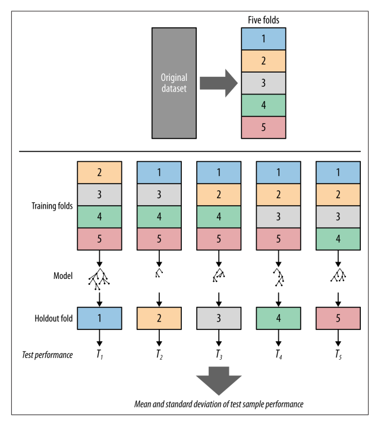
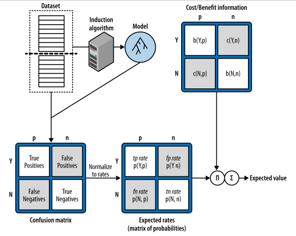
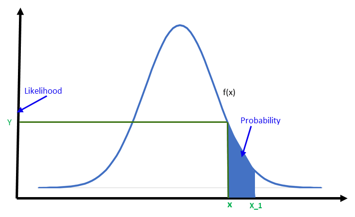

### CH2

### Classification and Regression

Classification은 대상을 구분짓는 문제로 최적의 Decision Boundary를 찾는게 목적이다.

> Whether something will happen?

Q. 목동에 거주하는 30대 남자가 A라는 홍보에 효과를 거둘 수 있을까?

A. Yes or No

Q. Will this customer# CHrchase service S1 if given incentive?

A. Yes or No

Q#.CHich service pakage(S1,S2,or None) will a customer likely# CHrchase if given incentive problem?

A. S1, S2, or None

Regression(=value estimation)은 수치를 예상하는 문제다. 구하고자 하는 Attribute와 다른 Attribute들 사이에 연관성이 있음을 전제한다. 대상을 구분하는게 목적이 아닌만큼 Decision Boundary를 구하지 않는다. Regression은 모두 수치를 찾는 것이므로 분석가가 수치를 바탕으로 기준을 세운다면 Classification 문제로 바꿀 수 있다. 반면 Classification 문제는 Regression문제로 바꿀 수 없다.

> How# CHch something will happen?

Q. 해당 구매자가 매장에서 구매할 금액은 얼마나 될까?

A. 구매자의 연봉이 5000~7000만원인 것으로 보아 100만원으로 예상함.

(연봉대별 매장 내 구매 금액이 선형 관계에 있음을 근거로 구매자의 연봉을 통해 매장에 사용할 금액을 예측함.

Q.How# CHch will this customer use the service?

A.The target variable is the amount of usage per customer.

### Classification을 Regression으로 바꿀 수 없는 이유

모든 Classification은 대상을 구분 짓는 기준이 있다. 수능 등급이 1등급이라면 해당 시험의 성적이 상위 4%안에 들어야 한다는 기준이 있다. 학생들을 성적순으로 나열한 뒤 상위 4%까지 1등급으로 분류하겠다는 말이다. 앞서 설명한 기준을 충족시키기 위한 또다른 기준이 필요하다. 이때 필요한게 학생의 시험 점수이다. 시험 점수는 또한 학생의 역량을 구분짓기 위한 기준이다. 즉 수능 1등급이라는 기준을 위해서 서열을 매겨야 하고, 서열을 매기기 위해 성적이 필요하다. 그리고 성적은 개인을 역량이라는 잣대를 두고 평가하는 방법이다.

즉, 학생의 역량을 평가하기 위한 방법으로 시험 점수를 산출한다. 그리고 이렇게 산출된 점수를 가지고 서열을 세워 등급을 분류한다. Classification에는 대상을 분류하는 기준이 있다. 1~9등급으로 9개 Class에는 분류 기준이 모두 있다. 우리가 이런 Classification을 Regression으로 바꾸기 위해선 흠... 다시 생각해봐야겠다.

### Classifier(=Classification Algorithm)

Classification을 수행하는 방식을 의미한다. Decision Tree, Logistic Regression, SVM 등이 Classifier에 해당된다.

### Model

특정 Dataset을 기반으로 학습된 Algorithm을 말한다.

### Descriptive anlaysis Predictive analysis

Descriptive anlaysis는 일어난 일에 이유를 찾고자 하는 분석이라면

Predictive analysis는 일어난 일을 바탕으로 앞으로 어떻게 진행될지 예상하기 위한 분석이다.

### CH4

### Parameter, Variable, Argument

```python
def multiple(a,b):
	return a*b

Parameter은 a,b
Argument는 multiple(1,2)에서 1,2
Variable a = 1, b =2
```

linear function에서 parameter는 W를 말함.

### Decision boundary

모델을 통해 얻게된 함수를 말함. Instance의 Class를 부여하는 기준이 됨. 아래 초록색 선이 Decision boundary임.


<그림 1-1> SepalLeng와 Sepal width에 따른 Iris 종류 분석

### Classification function = a linear discriminant function

새로운 Instance의 Target-value가 무엇인지를 구분하는 기준

계산결과 function 위면 blue, 아래면 orange

$f(x) = w_0 +w_1x_1+w_2x_2 \cdots$ A linear discriminant function

### A weighted Sum

model을 통해 알게된 attribute별 w값과 Instance가 가지고 있는 attribute(=x값)을 곱해서 계산한 합

$**f(x) = w_0 +w_1x_1+w_2x_2 \cdots$ f(x) = A Weighted Sum\*\*

5개의 변수에 대한 Model을 만들었다면

$**f(x) = w_0 +w_1x_1+w_2x_2+w_3x_3+w_4x_4+w_5x_5$\*\* 가 된다.

$w_0 - w_5$ 의 과거 데이터를 통해 찾은 weight || $x_1 - x_5$ instance x가 attribute별 가지고 있는 값

### Objective Function

달성하고자 하는 수준을 만족시켜주는 Classification function을 말한다. linear function을 찾는 방법론으로는 Linear regression, logistic regression, support vector# CHchine등이 있다.

ex) A와 B를 식별하는 모델의 목표 식별률이 80%라면 이를 달성 시킬 수 있는 a set of weight을 찾아야한다. Linear Regression 방법으로 Objective function을 찾겠다.

### Class probability estimation

25page 참조

### Loss function

이 함수는 기계에게 지금 사용한 방법이 잘못됐음을 인지시켜주는 용도로 활용된다. SVM에서 Instance가 Margin 내에 존재한다면 Instance와 margin의 위치 관계에 따라 패널티를 부과하는 방식이다. SVM을 통해 Objective Function을 구할 때 Margin의 넓이와 패널티 점수의 합으로 순위를 매기기 때문에 Margin이 넓은 것도 중요하지만 패널티도 적어야 한다. SVM말고도 데이터 과학에서 쓰이는 함수이고 Loss function도 여러 종류가 있다. SVM에서는 Hinge Loss를 주로 활용한다. 물론 다른 함수를 사용해도 되지만 결과를 봤을때 Hinge Loss가 가장 효과적이었기 때문에 보편적으로 사용하고 있다.

아래 그래프를 보면 f(x)가 -1일때 부터 Loss가 시작함을 알 수 있다. Loss가 발생하기 시작했다는 말 은 Margin내 Instance가 존재한다는 의미인데, f(x) -1 ~0 영역은 Decision Boundary를 넘지는 않았지만 Margin에 속한 Instance에게, 0~1 영역은 반대편 Margin 속한 Instance에게 부여되고 그 이후는 margin 조차 벗어난 Instance에게 패널티를 준다.(이렇게 해석하는게 정확한건지 확인하는 단계가 필요하니 공부하면서 맞고 틀림을 확인해보자.)


### the odds, Log-odds(=Logit), Logistic function

Odds

이 함수는 확률을 실수로 바꾸기 위해 활용했다.

Log-odds

Linear Regression을 Probaility Value에 적용하기 위한 노력으로 부터 시작했다. 즉 확률적으로 표현된 대상을 실수화 시킨 뒤 Linear Regressor에 적용 하려는 시도에서 Log-odds를 발견하고 사용했다는 말이다.

이 함수는 odds를 확률을 실수로 바꾸는 용도로 활용 한다.

- Probality values ${\displaystyle (0,1)}$ ⇒ Real number ${\displaystyle (-\infty ,+\infty )}$
- $log-odds =ln(\frac{p}{1-p})=w_0 +w_1x_1+w_2x_2 \,\cdots$ 이 식의 의미는 선형회귀인

Logistic function

이 함수는 Log-odds와 정반대의 기능으로 실수를 확률로 변경하는 용도로 활용된다.

- Real number ${\displaystyle (-\infty ,+\infty )}$ ⇒ Probailty values${\displaystyle (0,1)}$기

### CH5

### Holdout Data

Hold out은 감춰두다라는 뜻이 있음. overfitting을 방지하기 위한 목적으로 훈련 데이터 일부를 테스트용으로 남겨둔 데이터를 말한다. 테스트용 데이터인만큼 우리가 정답을 알고 있기에 모델이 적합한 결과를 산출하는지 확인할 수 있는 좋은 자료가 된다. 모든 데이터를 훈련에 사용하고 훈련에 사용한 데이터를 다시 모델을 테스트하기 위해 사용한다면 overfitting이 발생할 수 밖에 없게된다. 따라서 훈련 데이터 중 일부 데이터를 분할해 오로지 테스트 용도로 활용하려는 목적으로하는 데이터 셋을 만들어야 한다.

목적에 맞게 Testing set이라고도 부르기도 하며 단순히 테스트용 데이터를 의미하는 용어이기 때문에 Cross-validation이나 다른 방법론 설명 시 training set과 구분하기 위해 쓰인다.

### Complexity

모델이 얼마나 복잡한지를 확인하는 지표이다. model이 고도화 되면(=복잡하면) 더 좋은 결과를 낼 것이라 예상하지만 이는 훈련 데이터에만 국한할 뿐 실제 데이터(또는 Holdout Data)에 적용하면 오히려 예측 정확도가 낮아진다. 훈련 데이터에서 정확도가 높아지는 이유는 모델이 복잡해질수록 개별 데이터들간 구분할 수 있는 조건들이 많아지기 때문이다.

너무 단순한 모델도 underfiting이 되므로 일정 수준 이상의 compexity를 필요로 하지만 최적의 모델을 만들기 위해서 complexity 또한 중요한 고려 대상이 된다.

### Class priors

= Base rate + Base error rate(= 1-Base rate)

### Base rate

Base Rate란 자연현상에서 통계적으로 발생하는 경우의 수를 말한다. 한 통계에 의하면 대한민국 왼손잡이 비율이 5%라고 한다. 대한민국 인구 중 무작위로 100명을 선발한다고 하면 평균 95명이 오른손잡이 일 것이다. 우리가 오른손잡이를 예측하는 모델을 만들때 가장 단순하면서 예측 정확도를 보장하는 방법은 Base rate를 따르는 것이다.

Base Rate 개념은 단순하지만 중요한 여러 가치를 가진다. 우리가 classification model을 만든다고 할 때 Base rate에 따라 모델 성능을 보여주는 ‘정확도’의 가치가 결정된다. 오른손잡이와 왼손잡이를 구분하는 classification 모델을 제작할 때 가장 단순하고 효과적인 방법은 Base Rate를 따르는 것이다. 이렇게 Base rate를 따르는 Classifier를 A majority classifier라 부른다. 이미 majority classifier의 정확도가 95%가 되니 정확도를 가지고 다양한 분류의 모델을 비교하기에는 불가능하다. 반면 Base rate 비율이 5:5에 근접하다면 정확도는 모델을 비교하기 위한 중요한 지표로서 활용될 수 있다.

그러므로 Base rate는 Classification model이 뛰어넘어야 하는 최소 성능으로 활용되기도 한다. Roc Curve 같이 모델의 성능을 비교하기 위한 그래프에서 모델이 넘어가야할 최소한의 기준으로 그려진다.

### Sweet spot

Tree induction에서 Tree size가 클수록(Leaf가 많이 생길수록) 훈련 데이터에 대한 정확도는 지속적으로 높아지나 테스트 데이터에서는 정확도가 떨어지는 지점을 의미한다.

이는 Tree Induction에서도 일정 수준 이상의 complextity는 예측 정확도를 떨어뜨린다는 점을 인지시킨다. Node가 많아질수록 개별 instance를 구분하는 기준이 많이생기는 것이므로 데이터에 모델이 과하게 적합해지는 결과를 낳는다.

### Cross-Validation

훈련된 모델을 검증하기 위한 방법론 중 하나이다. 전체 데이터 셋을 5~10개의 데이터 셋으로 균등하게 분할 한뒤 , 각각의 데이터 셋을 각 한 번씩 테스트 데이터로 활용한다. 아래 그림을 보면 이해가 쉽다. 데이터를 총 5개로 구분하면 하나는 테스트 셋으로 나머지 4개는 훈련 셋으로 사용한다. 이런식으로 한다면 총 5번 다른 테스트 셋을 활용하게 된다.

같은 데이터를 분할한 뒤 5개의 개별적인 모델을 만드는 이유는 Test set이 모델을 검증하는 과정 자체도 검증이 필요하기 때문이다. 쉽게 말해 자동차를 수리할 때 전문가의 도움을 받아야하는데, 과연 이 사람이 정말로 믿고 맏길 수 있는 전문가인지 확인을 해야 실제로 수리가 됐는지 안됐는지를 알 수 있게 되는 것과 같다. 검증을 하기 위해 검증도구 자체가 그 역할을 하는지 확인하는 것도 중요하다는 말이다.

데이터 셋을 5개로 나눈 뒤 개별 셋이 한 번씩 테스팅 데이터 역할을 한다. 훈련 데이터로 학습된 모델을 다시 테스팅 데이터를 통해 검증하면 5개 모델의 결과가 나온다. 결과들의 평균과 분산은 ?

내가 궁금한건 훈련 셋에 따라 모델이 다른데 뭐가 generalization이 됐다는거지? 가장 최적의 모델을 선정하는 것도 아니고 이렇게 해서 하나의 모델을 generalization 했다고 봐야하는건가? 뭔가 내용이 뜨문뜨문 있다보니까 하나로 합쳐지지가 않네

Generalization을 위한 방법론 중에 하나고 아래 같은 방법으로 훈련시킨다는 것만 이해해보자. 그 이후는 추후 다른 학습에서 채워보자.



개별 모델을 검증한다기 보다는 어떤 방법론이 더 효과적인지를 검증하는 용도로 사용하는 것 같다.해당 데이터로 Logistic regression을 하니 평균 64%의 실제 예측값이 나오고 Tree로 하니 평균 69% 정도의 예측값이 나오니 이 데이터는 Classfication Tree가 더 높은 정확도를 제공해주는구나 생각해야되나 보다.


### $arg \,\, max_w$

훈련 데이터에 가장 높은 정확도를 제공하는 w를 찾겠다라는 의미다.

### Grid Search

최적의 parameter(=Hyperparameter)를 찾는 방법론 중 하나이다. 격자로 찾는 방식이므로 Grid# CHarch라고 불린다. <책에서 관련 내용이 많이 언급되지 않으므로 나중에 공부하게 되면 넣어보자>

### Multiple Comparisons

같은 모델을 같은 환경에서 여러차례 실험한 뒤 그 중 가장 좋은 결과값을 선정하는 행위를 의미한다. 데이터를 다루는 사람이라면 경계해야하는 오류이다. 예로들어 1이 나올 확률을 실험하기 위해 주사위를 120번 던지는 실험을 5차례 실행한다고 생각하자. 그 결과는 아래와 같다. multiple Comparisions은 여러차례 실험된 결과 중 가장 많이 나온 경우를, 즉 28회, 1이 나올 확률로 생각하는 행위이다. 실험 결과의 평균은 20회로 수렴하나 개별 실험 결과에는 범위 차이가 있다.

데이터 분석가는 이러한 오류가 발생하지 않도록 사전 인지하여 데이터의 신뢰성을 확보해야한다.

|               | 1회차 | 2회차 | 3회차 | 4회차 | 5회차 |
| ------------- | ----- | ----- | ----- | ----- | ----- |
| 1이 나온 경우 | 25    | 28    | 15    | 12    | 20    |

### Generalization

훈련 데이터로 만들어진 모델에 테스트 데이터를 적용해 모델의 실제 정확도를 파악하는 행위를 말한다. 이와 관련한 여러가지 방법들이 있는데, 대표적으로 cross-validation이 있다. <Generalization의 목적은 여러 모델 중 실제 데이터(=테스팅 데이터)에 더 높은 예측 정확도를 가진 모델을 찾기 위함이다.> <만든 모델을 실제 데이터로 테스트해서 정확도가 얼마나 되는지 확인하는 단계이다. 테스트 데이터에서 얻게된 정확도보다 낮게 된다면 해당 모델이 훈련 데이터에 overfit 됐다는 점을 의심해야한다. >

### Regularization

하나의 데이터 가장 적합한 모델을 찾기 위한 방법론이다. 최적의 모델을 선정하는 기준에 Complexity를 포함하여 과하게 복잡한 모델을 선정하지 않는다. 이렇게 선정된 모델은 최적의 W와 모델의 복잡도가 종합적으로 고려된 결과물이다. <DS에서 많이 사용되는 개념인 만큼 관련 내용을 추가적으로 학습하면 추가하자.>

$arg \,\, max_w = [fit(x,w) - \lambda \, \cdot \,penalty(w)]$

위 공식은 최적으로 학습된 모델은 최적의 w와 함께 복잡도를 적게 고려한 모델이 되어야 한다는 의미다. $\lambda$는 W가 하는 기능과 마찬가지로 Penalty의 중요도를 의미한다. $\lambda$ 와 $penalty(w)$는 데이터 과학자가 선정한다.

### A Learning Curve

해당 모델을 대상으로하는 훈련 instance가 증가할수록 Generalization performance가 증가된되는지 확인하기 위한 용도로 사용한다. 일정량을 훈련 한뒤 test를 하고 추가적으로 훈련 한 뒤 테스트하는 방식을 누적하면 Learning curve를 만들 수 있다. 만들어진 그래프를 바탕으로 모델의 현재 상태와 사용하고 있는 Training set 또는 test set이 적합한지를 확인할 수 있다고 한다.

### A fitting graph

해당 모델의 복잡도가 증가할수록 Generalization performance 증가량을 확인하기 위한 용도로 사용한다. Learning Curve를 만들때 처럼 중간에 모델을 테스트해서 performance의 변화를 추적한다.

## CH7

### The Confusion Matrix

Classfication 유형에서 예측과 실제 결과의 비율을 표시한 행렬(Matrix)이다. 분류하는 유형의 수에 따라 행렬의 수가 결정된다. Class가 두 가지인 경우 아래와 같이 분류가 되고 각 요소(?)마다 불려지는 용어가 있다. 실제와 예측이 맞은 경우 True를, 실제와 예측이 다른경우 False가 붙는다. 구분 대상많아져도 예측이 맞는 경우 True, 나머지는 False가 된다는 점을 유의하면 헷갈리지 않는다.

| \예측
실제 \ | Y | N |
| --- | --- | --- |
| Y | True Positive(TP) | False Positive(FP) |
| N | False Negative(FN) | True Negative(TN) |

이 행렬의 가치는 예측과 실제가 다른 경우(FP, FN)를 구분한다는 점에 있다. 예측에 실패했다는 점에서 공통점이 있지만, 경우에 따라 전혀 다른 가치가 매겨진다. 암 여부를 검사하는 진단 키트에서 False Positive(음성이지만 양성으로 예측)과 False Negative(양성이지만 음성으로 예측)은 환자에게 전혀 다르게 다가온다는 점을 보면 알 수 있다. 암이 맞다고 생각했는데 실제로 아니었다면 안도의 한숨을 내쉬겠지만, 암이 아니어서 안심하고 있는데 실제로는 암이었음을 알게됐다면 좌절감이 들었을 것이다.

이외에도 비지니스 관점에서도 광고에 효과가 있을거라 예상되는 고객이 실제로는 효과가 없는 경우(FP)는 광고비용이 들었지만, 광고에 효과가 없을거라 예상되는 고객이 실제로는 효과가 있는 경우(FN)은 대상에게 어떤 비용도 들이지 않았기에 역시 FP와 FN은 예측이 틀렸다는 공통점이 있지만 그 의미와 가치에는 차이가 있다.

따라서, 우리가 단순히 FP와 FN을 구분하지 않고 예측 실패로 뭉뚱그리는 예측 정확도($\frac{예측성공}{전체경우}$)만을 가지고 문제를 해결하고자 한다면, 예측 정확도는 다소 떨어지나 실제 사례에 더 효과적일 수 있는 모델을 배제하게 될 수도 있다.

### Expected Value

같은 훈련 데이터를 통해 생성된 여러 모델들을 비교하기 위한 방법 중 하나이다. 모델을 단순히 예측정확도로만 평가해서는 안된다. Confusion Matrix 설명처럼 FP와 FN의 가치는 다르기 때문이다. Expected Value는 각 요소별(TP,FP,FN,TN) 비용이나 이익을 산정해 계산하므로 기업의 목적인 이익 극대화라는 관점으로 모델별 평균 산출 가치를 파악할 수 있다. 해당 방법은 Classification 문제 뿐만아니라 Regression문제에도 적용된다. 다만 개념의 이해를 쉽게 돕고자 Classification 문제에 한정하여 서술하였다.

$EV\ = \ p(o_1)\ · v(o_1) \ + \ p(o_2)\ · v(o_2) \ + \ \cdots \ + \ p(o_n)\ · v(o_n)$ EV 산출공식

$o_n$ : 행렬 요소(TP,FP,TN,FN) | $p(o_n)$ : 요소 발생 확률 | $v(o_n)$ : 요소별 가치

※ $p(o_n)$은 행렬 내 요소로 계산되는 값이지만 , $v(o_n)$는 구성원들간 합의를 통해 선정하는 값이다.

**모델 별 Expected Value 구하기**



1. 같은 훈련 데이터를 통해 여러 모델을 만든다. 유형별(Logistic regression, SVM, Classification Tree 등)로 다양한 모델을 만든다.
2. Test 데이터를 활용해 모델별 확률로 표현된 Confusion Matrix를 만든다. $p(Y,p) = \frac{count(Y,p)}{T}$
3. 조직 구성원들과의 합의를 통해 Confusion Matrix 내 요소 별 Value를 선정한다.
4. EV가 가장 높은 모델을 선택한다.

### A balanced population과 A representative(=true) population

A balanced population은 구분하고자 하는 class들 간 비율이 같은 데이터셋을 의미하고, A representative population은 Class의 실제 Base Rate를 반영한 데이터셋을 의미한다.

대상을 Yes or No로 구분할때 50:50 비율이라 생각하기 쉽지만 실제 데이터는 한쪽으로 치우친 경우가 많다. 암 진단 키트의 양성과 음성 비율을 보더라도 Negative일 경우가 훨씬 많다.

Representative population을 가지고 모델을 훈련시킨다면 Majority Classifier에 가깝게 학습되기 때문에 비율을 일정하게 선별한 데이터를 가지고 훈련시켜야한다. Representative population은 실전 데이터 비율과 같으므로 테스트용으로 사용한다.

### $p(x,y)\ = \ p(y)\ ·p(x\ | \ y)$

### A baseline

### **A majority Classifier**

통계적으로 알게된 비율을 바탕으로 가장 높은 비율의 class를 선택하는 전략이다. 동전 던지기처럼 확률이 50:50일때는 majority classifier을 사용하는데 효과가 없겠지만, 왼손잡이인지 오른손잡이인지 예측하는 문제처럼 특정 class가 편향된 경우에는 매우 효과적이다. 통계상 왼손잡이와 오른손잡이 비율이 0.5:9.5이므로 모든 예측을 오른손으로 한다면 95%의 정확도를 가지기 때문이다. 단순하지만 매우 효과적인 방법이므로 모델이 최소한으로 넘어야 하는 정확도의 지표가 된다.

### A Random model

### Single-feature predictive models

## CH8

### Likelihood와 Possibility

Likelihood는 f(x) 값을 의미하며 f(x)의 Possibility는 면적을 의미한다.

Likelihood의 합 = Possibility



### A Ranking Classifier

Instance를수치로 표현한 뒤 점수별로 정렬해 Target Value를 선정하는 함수. 이렇게 나열된 instance를 어떤 기준을 가지고 구분할 것인지에 따라 class가 선정된다. 필터를 설정해 원하는 값만 추출하는 방법과 같다. Class를 분류하는 기준(=Threshold)를 설정할 때 최소한으로 넘어야하는 기준을 높히면 Target value가 엄격히 선정되고 반대로 수치를 낮게 잡으면 Target Value가 느슨하게 선정된다.

Threshold를 어떻게 선정하는지에 따라 Target Value로 분류된 Instance가 아니게 될 수 있으므로 적절한 기준을 선정하는 것이 중요하다. 이러한 질문을 해결하기 위한 방법으로 ROC Curve가 있다.

비지니스에서 Rankoing Classifier는 매우 중요하다. 기업은 최소의 비용으로 최대의 이윤을 내야하므로 기업의 전략이 가장 효과적으로 작용할 그룹을 선별해 전략이 최대한으로 적용될 수 있도록 해야한다. 전체 인구의 1% 만이 기업의 마케팅에 효과가 있다면 1%를 위해 나머지 99%에도 마케팅 비용을 지불해야하는 부담이 있다. 회사가 물품 판매 수익이 10만원, 마케팅 비용이 1천원이라 생각해보자. 기대수익을 계산하면 0.01*100,000 - 0.99*1,000 = 1000원이 된다. 만약 ranking classifier를 도입해 마케팅에 효과 있는 비율을 10%로 끌어올렸다면 기대수익은 0.1*100,000 - 0.9*1,000 = 9100원이 된다.

### Hit rate and false alarm rate

$Hit \ rate \ = \ tp \ rate \ = \ \frac{True \ Positive}{Total \ True}$ = 전체 True 중에 얼만큼 맞췄는가?

$False \ alarm \ rate = fp \ rate \ = \frac{False \ Positive}{Total \ Negative}$ = 전체 Negative 중 얼만큼 틀렸는가?

## CH 12

### **Latent dimensions**

데이터 과학용어인 latent는 연관성은 있지만 정교하게 설명되지 않는 관계를 말한다. 입증하긴 어려우나 관련성이 나타나므로 영화추천과 같은 recomendation 알고리즘에 활용된다. latent가 있는 요소로 plot을 만든 뒤 어떤 패턴이 숨어있는지 찾아야한다.

### Ensemble method

여러 종류의 예측모델을 결합해 하나의 기능을 수행하는 모델로 활용하는 방법

## CH13

### Problem engineering

기업이 직면한 문제를 해결하기 위해 문제를 수치화하고 세분화해서 구체적인 달성 목표를 만드는 과정을 말한다. 문제해결에 필요한 예측모델 등을 만들때 구하고자 하는게 무엇인지를 우선 정의하고 설정한 대상을 알아가기 위한 세부요소를 합리성을 바탕으로 선정하면서 문제를 구체화한다. 구체화된 목표를 위해 데이터를 수집하고 이를 활용해 문제를 다루는 도구를 만들게 된다.

### lift

어떤 현상의 발생 확률과 우연히 발생한 확률을 비교하기 위한 개념이다. lift가 1이라는 말은 해당 현상이 우연임을 의미하며 수치가 올라갈수록 현상이 우연에 의해 발생한 것이 아니게 된다. 전국에 마트를 보유하고 있는 회사의 정보분석가라고 생각해보자. 회사 데이터를 보니 사람들이 가장 많이 장바구니에 담는 1순위가 우유로 2%, 2순위가 복권으로 1%라는 사실을 알았다. 장을 본 100명의 물품을 확인하면 2명은 우유를 구매했고 1명은 복권을 구매했다는 의미이다. 데이터를 보던 중 우유와 복권 모두를 구매한 사람이 0.1%였다. 0.1%가 미미한 수준이라고 생각할수도 있다. 하지만 우유 구매가 2%이고 복권 구매가 1%라는 사실을 알기에 0.1%라는 수치가 얼마나 의미있는지 금방에 알아차리게 된다. 우유와 복권 모두를 우연히 구매할 확률은 0.02%밖에 되지 않는다. 우연으로 발생할 확률보다 5배나 높다. 이를 lift로 표현하면 5가 된다. 이와 같이 lift는 어떤 현상이 단순히 우연에 의함이 아니라는 사실을 우리에게 인지시킨다.

# 추가 용어정리

## 벡터

### 벡터화

- 대상들을 하나의 공간을 기준으로 벡터로 표현하는 과정
- 병렬처리가 가능한 구조로 데이터를 재배열하는 과정

### 벡터 내적

두 벡터의 관계를 파악하는 방법


- -1 < cos < 1 이므로 내적의 값에 따라 두 벡터의 관계를 파악할 수 있음
- a b가 0이면 cos이 0이므로 두 벡터의 각도는 직각
- a b가 > 0이면 cos이 0~1사이 이므로 90도보다 작음
- a b가 < 0이면 cos이 -1 ~ 0사이 이므로 90도보다 큼

## NLP

### Word2Vec

Word2Vec, Doc2Vec and Glove are semi-supervised learning algorithms and they are Neural Word Embeddings for the sole purpose of Natural Language Processing.

Specifically Word2vec is a two-layer neural net that processes text. Its input is a text corpus and its output is a set of vectors: feature vectors for words in that corpus. While Word2vec is not a deep neural network, it turns text into a numerical form that deep nets can understand.

However Word2vec’s applications extend beyond parsing sentences in the wild. It can be applied just as well to genes, code, likes, playlists, social media graphs and other verbal or symbolic series in which patterns may be discerned. So in one word gene2vec, like2vec and follower2vec are all possible.

Word2Vec can be implemented at its best using RNN’s, LSTM’s, GRU’s or any other architecture that can perform pretty well on 1-D data or basically sequence of data.

### TF-IDF

Through TFIDF frequent terms in the text are “rewarded” (like the word “they” in our example), but they also get “punished” if those terms are frequent in other texts we include in the algorithm too. On the contrary, this method highlights and “rewards” unique or rare terms considering all texts
