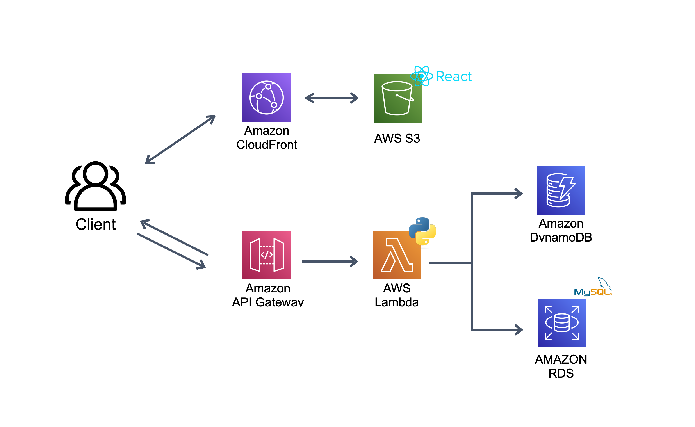
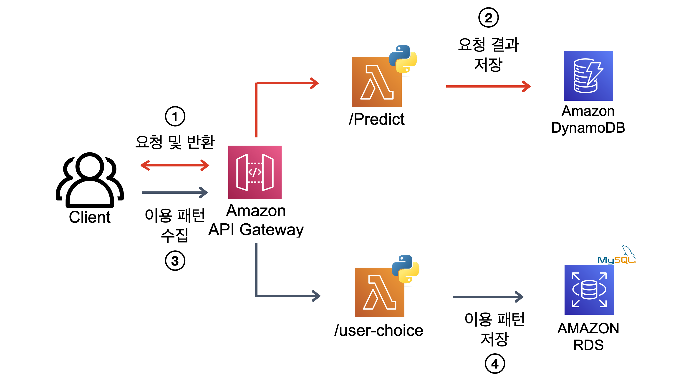

### 프로젝트 소개

- 개인 프로젝트로 진행한 [도서관 장서 검색 서비스](https://github.com/yangoos57/dodomoa)를 AWS Cloud 기반의 서버리스로 배포했습니다. 도서관 장서 검색 서비스는 도서관 내 비치된 컴퓨터 & 과학 분야 도서를 키워드를 기반으로 찾아주는 서비스이며 [링크](https://yangoos.me)를 통해 사용하실 수 있습니다.

- 프로젝트의 아키텍처는 다음과 같습니다.

### 서버리스 백엔드 구현 - Lambda, Dynamo DB, RDS 활용

- AWS 서비스인 Lambda, Dynamo DB, RDS를 활용해 서버리스 백엔드를 구축했으며, 사용자 요청을 처리하는 API(`/predict`)와 사용자 행동 데이터를 저장하는 API(`/user-choice`)를 구현했습니다.

  

<h5> Lambda 선정 이유</h5>

- 백엔드 구성에는 **AWS의 EC2, ECS, Lambda**를 고민했습니다.

  - **EC2 :** 장점으로는 기존 구축한 도커 이미지를 활용해서 별도 코드 수정없이 즉각 배포할 수 있었습니다. 단점으로는 Auto scaling에 필요한 AMI 생성, SQS 및 ALB를 추가로 구축해야하는 시간과 제한된 인스턴스 성능(t2-micro)이 있었습니다.

  - **ECS :** 장점으로는 Fargate를 활용하여 서버리스로 간편하게 구축할 수 있었습니다. 하지만 Fargate를 Free-tier에서 제공하지 않아 비용이 발생하는 단점이 있었습니다.

  - **Lambda** : 장점으로는 서버리스 서비스이자 배포 또한 간단했습니다. 단점으로는 기존 코드를 수정해야하고, 라이브러리와 코드 포함 용량이 250mb 이상인 경우 container로 생성해 ECR로 업로드 해야했습니다.

- **그중에서 lambda를 선택한 이유는**

- ECS와 EC2로 백엔드를 구축할 경우 제한된 EC2 성능(t2-micro)으로 인해 대량 요청 처리를 위해 수십 개의 Instance를 실행시켜야하므로 오버헤드가 증가하는 구조이므로 서버리스인 Lambda가 효율적이라 판단했습니다.
- 단점으로 고려 됐던 lambda-container 또한 초기 구축을 위해서 별도의 학습과 시행착오가 진입장벽이 존재하지만, 실시간 머신러닝 서비스를 서버리스로 구축할 수 있으므로 장기적 활용도가 높다고 판단했습니다.

<h5> Dynamo DB 선정 이유</h5>

- 데이터 분석 목적으로 사용자에게 제공한 요청 정보를 Dynamo DB에 저장했습니다. 백엔드에서 처리한 사용자 요청 정보를 key-value의 object 타입으로 프론트엔드에 제공하고 있으므로 별도의 데이터 처리없이 저장할 수 있는 Dynamo DB를 사용했습니다.
- RDS에 저장하는 방법도 고민했으나 key-value 구조를 RDMBS 구조에 맞게 데이터 처리가 필요하므로 오버헤드가 증가한다고 판단했습니다. Dynamo DB에 쌓은 데이터를 AWS Glue를 활용해 전처리한 다음 Redshift로 저장하는 방식이 효율적이라 판단했습니다.

<h5> RDS 선정 이유</h5>

- Mysql RDS를 구성한다면 기존 서비스 재사용이 가능해 불필요한 작업을 줄일 수 있었습니다.
- 사용자 행동 데이터는 RDMBS로 저장 가능한 구조이므로 기 구축한 RDS를 활용해 효율성을 높혔습니다.

### 프론트엔드 구현 - Cloudfront, S3 활용

<h5> S3 선정 이유</h5>

- 별도 서버 구축없이 S3 업로드만으로 정적 웹을 운영할 수 있어 Lambda와 연계 가능하고 효율적인 서비스 제공 방식이라 생각했습니다.
- AWS S3 Sync와 React Build 명령어 조합으로 CI/CD를 간편하게 구축할 수 있어 실시간 수정 사항을 반영할 수 있습니다.

<h5> CloudFront 선정 이유</h5>

- **비용절감 :** 클라이언트가 S3에 바로 접근할 경우 1,000건의 request 당 `$0.0045` 비용이 부과됩니다. Cloudfront의 웹캐시 기능을 사용하여 서비스를 운영하면 Cloudfront의 1000만건 무료 request와 1000건 당 `$0.0009`로 제공이 가능해 S3만 사용하는 구조 대비 비용이 저렴합니다.

- **S3 비공개 :** S3로 웹 호스팅을 할 경우 bucket을 public으로 공개해야하지만 Cloudfront를 사용하면 S3를 비공개로 유지한 체 웹 호스팅이 가능합니다.

- **HTTPS 통신** : S3 웹 호스팅은 HTTPS를 지원하지 않으므로 HTTPS 통신을 위해 Cloudfront를 활용했습니다.
