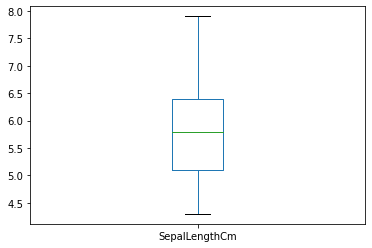
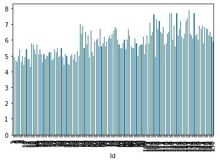
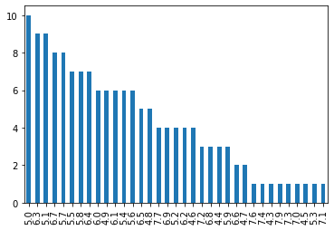

```python
import pandas as pd
```

# Getting to Know 'the structure' of a data

```python
iris_data = pd.read_csv('./data/iris.csv', index_col='Id') # Numerical dataset
mushroom_data = pd.read_csv('./data/mushrooms.csv') # Categorical dataset

mushroom_data.info() # shows each columns informations
```

    <class 'pandas.core.frame.DataFrame'>
    RangeIndex: 8124 entries, 0 to 8123
    Data columns (total 23 columns):
     #   Column                    Non-Null Count  Dtype
    ---  ------                    --------------  -----
     0   class                     8124 non-null   object
     1   cap-shape                 8124 non-null   object
     2   cap-surface               8124 non-null   object
     3   cap-color                 8124 non-null   object
     4   bruises                   8124 non-null   object
     5   odor                      8124 non-null   object
     6   gill-attachment           8124 non-null   object
     7   gill-spacing              8124 non-null   object
     8   gill-size                 8124 non-null   object
     9   gill-color                8124 non-null   object
     10  stalk-shape               8124 non-null   object
     11  stalk-root                8124 non-null   object
     12  stalk-surface-above-ring  8124 non-null   object
     13  stalk-surface-below-ring  8124 non-null   object
     14  stalk-color-above-ring    8124 non-null   object
     15  stalk-color-below-ring    8124 non-null   object
     16  veil-type                 8124 non-null   object
     17  veil-color                8124 non-null   object
     18  ring-number               8124 non-null   object
     19  ring-type                 8124 non-null   object
     20  spore-print-color         8124 non-null   object
     21  population                8124 non-null   object
     22  habitat                   8124 non-null   object
    dtypes: object(23)
    memory usage: 1.4+ MB

# Getting to know 'the values' of a dataset

### Categorical Values

```python
#Getting to know 'the values' of a dataset

mushroom_data.describe() # depends on data types. the table below shows information about categorical values

# Unique = the catergories of Values in a column
```

<div>
<style scoped>
    .dataframe tbody tr th:only-of-type {
        vertical-align: middle;
    }

    .dataframe tbody tr th {
        vertical-align: top;
    }

    .dataframe thead th {
        text-align: right;
    }

</style>
<table border="1" class="dataframe">
  <thead>
    <tr style="text-align: right;">
      <th></th>
      <th>class</th>
      <th>cap-shape</th>
      <th>cap-surface</th>
      <th>cap-color</th>
      <th>bruises</th>
      <th>odor</th>
      <th>gill-attachment</th>
      <th>gill-spacing</th>
      <th>gill-size</th>
      <th>gill-color</th>
      <th>...</th>
      <th>stalk-surface-below-ring</th>
      <th>stalk-color-above-ring</th>
      <th>stalk-color-below-ring</th>
      <th>veil-type</th>
      <th>veil-color</th>
      <th>ring-number</th>
      <th>ring-type</th>
      <th>spore-print-color</th>
      <th>population</th>
      <th>habitat</th>
    </tr>
  </thead>
  <tbody>
    <tr>
      <th>count</th>
      <td>8124</td>
      <td>8124</td>
      <td>8124</td>
      <td>8124</td>
      <td>8124</td>
      <td>8124</td>
      <td>8124</td>
      <td>8124</td>
      <td>8124</td>
      <td>8124</td>
      <td>...</td>
      <td>8124</td>
      <td>8124</td>
      <td>8124</td>
      <td>8124</td>
      <td>8124</td>
      <td>8124</td>
      <td>8124</td>
      <td>8124</td>
      <td>8124</td>
      <td>8124</td>
    </tr>
    <tr>
      <th>unique</th>
      <td>2</td>
      <td>6</td>
      <td>4</td>
      <td>10</td>
      <td>2</td>
      <td>9</td>
      <td>2</td>
      <td>2</td>
      <td>2</td>
      <td>12</td>
      <td>...</td>
      <td>4</td>
      <td>9</td>
      <td>9</td>
      <td>1</td>
      <td>4</td>
      <td>3</td>
      <td>5</td>
      <td>9</td>
      <td>6</td>
      <td>7</td>
    </tr>
    <tr>
      <th>top</th>
      <td>e</td>
      <td>x</td>
      <td>y</td>
      <td>n</td>
      <td>f</td>
      <td>n</td>
      <td>f</td>
      <td>c</td>
      <td>b</td>
      <td>b</td>
      <td>...</td>
      <td>s</td>
      <td>w</td>
      <td>w</td>
      <td>p</td>
      <td>w</td>
      <td>o</td>
      <td>p</td>
      <td>w</td>
      <td>v</td>
      <td>d</td>
    </tr>
    <tr>
      <th>freq</th>
      <td>4208</td>
      <td>3656</td>
      <td>3244</td>
      <td>2284</td>
      <td>4748</td>
      <td>3528</td>
      <td>7914</td>
      <td>6812</td>
      <td>5612</td>
      <td>1728</td>
      <td>...</td>
      <td>4936</td>
      <td>4464</td>
      <td>4384</td>
      <td>8124</td>
      <td>7924</td>
      <td>7488</td>
      <td>3968</td>
      <td>2388</td>
      <td>4040</td>
      <td>3148</td>
    </tr>
  </tbody>
</table>
<p>4 rows × 23 columns</p>
</div>

```python
mushroom_data['class'].unique() # describes the uniques of 'class'

```

    array(['p', 'e'], dtype=object)

### value_counts로 비율을 구할 수 있음.

```python
# Total numbers of each unique in 'class'
a = mushroom_data['class'].value_counts()
print(a)
print('')
# Proportion of uniques in 'class'
b = mushroom_data['class'].value_counts(normalize=True)
print(b)
```

    e    4208
    p    3916
    Name: class, dtype: int64

    e    0.517971
    p    0.482029
    Name: class, dtype: float64

```python
# Value_counts is also used to plot a bar-graph.
mushroom_data['cap-color'].value_counts(normalize=True).plot.bar()
```

    <AxesSubplot:>


### Numerical Value

```python
# Range of 'SppalLengthCm'
iris_data['SepalLengthCm'].plot.box()
```

    <AxesSubplot:>



```python
# Histogram is recommanded to plot numerical Value.
iris_data['SepalLengthCm'].plot.hist()
```

    <AxesSubplot:ylabel='Frequency'>


```python
# bar chart is not recommended to plot numerical values.
iris_data['SepalLengthCm'].plot.bar()
```

    <AxesSubplot:xlabel='Id'>



```python
# if the widths of a bar can be modified to get between 2 and 10 bars, bar chart can be used for numerical values.
# yet, I don't know how to set widths of a bar.
iris_data['SepalLengthCm'].value_counts().plot.bar()
```

    <AxesSubplot:>



### To apply a function to every values in a column

```python
# It is recommended to combine apply with lambda.
# apply method will help to change every values in a column
iris_data['SepalLengthCm'].apply(lambda x : int(round(x,1)))
```

      File "<ipython-input-1-2379359dc2c0>", line 3
        iris_data['SepalLengthCm'].apply(lambda x : int(round(x,1)) axis=1)
                                                                    ^
    SyntaxError: invalid syntax

```python
# a bracket is used to choose columns that you want to include.
iris_data[['SepalLengthCm','SepalWidthCm']]
```

<div>
<style scoped>
    .dataframe tbody tr th:only-of-type {
        vertical-align: middle;
    }

    .dataframe tbody tr th {
        vertical-align: top;
    }

    .dataframe thead th {
        text-align: right;
    }

</style>
<table border="1" class="dataframe">
  <thead>
    <tr style="text-align: right;">
      <th></th>
      <th>SepalLengthCm</th>
      <th>SepalWidthCm</th>
    </tr>
    <tr>
      <th>Id</th>
      <th></th>
      <th></th>
    </tr>
  </thead>
  <tbody>
    <tr>
      <th>1</th>
      <td>5.1</td>
      <td>3.5</td>
    </tr>
    <tr>
      <th>2</th>
      <td>4.9</td>
      <td>3.0</td>
    </tr>
    <tr>
      <th>3</th>
      <td>4.7</td>
      <td>3.2</td>
    </tr>
    <tr>
      <th>4</th>
      <td>4.6</td>
      <td>3.1</td>
    </tr>
    <tr>
      <th>5</th>
      <td>5.0</td>
      <td>3.6</td>
    </tr>
    <tr>
      <th>...</th>
      <td>...</td>
      <td>...</td>
    </tr>
    <tr>
      <th>146</th>
      <td>6.7</td>
      <td>3.0</td>
    </tr>
    <tr>
      <th>147</th>
      <td>6.3</td>
      <td>2.5</td>
    </tr>
    <tr>
      <th>148</th>
      <td>6.5</td>
      <td>3.0</td>
    </tr>
    <tr>
      <th>149</th>
      <td>6.2</td>
      <td>3.4</td>
    </tr>
    <tr>
      <th>150</th>
      <td>5.9</td>
      <td>3.0</td>
    </tr>
  </tbody>
</table>
<p>150 rows × 2 columns</p>
</div>

### Groupby Method

1. is used to set multi-index
2. is recommended to select categorical values for milti-index

```python
mushroom_data.groupby(['class','cap-shape']).size()

```

    class  cap-shape
    e      b             404
           f            1596
           k             228
           s              32
           x            1948
    p      b              48
           c               4
           f            1556
           k             600
           x            1708
    dtype: int64

```python
# value_count method is similar to gropuby, but it should be used only for one column.
k = mushroom_data['gill-color']
k.value_counts()
```

    b    1728
    p    1492
    w    1202
    n    1048
    g     752
    h     732
    u     492
    k     408
    e      96
    y      86
    o      64
    r      24
    Name: gill-color, dtype: int64

```python
# What is the most frequent unique of class at bruises, cap-shape, and cap-color index?
a = mushroom_data.groupby(['bruises','cap-shape','cap-color'])['class'].max()
print(a)

```

    bruises  cap-shape  cap-color
    f        b          g            e
                        n            p
                        w            e
                        y            p
             c          y            p
             f          c            p
                        e            p
                        g            p
                        n            p
                        r            e
                        u            e
                        w            e
                        y            p
             k          c            p
                        e            p
                        g            e
                        n            p
                        w            e
                        y            p
             s          g            e
                        n            e
             x          c            p
                        e            p
                        g            p
                        n            p
                        p            p
                        r            e
                        u            e
                        w            p
                        y            p
    t        b          b            p
                        p            p
                        w            p
                        y            e
             c          w            p
             f          b            p
                        c            e
                        e            e
                        g            p
                        n            p
                        p            p
                        w            p
                        y            e
             k          b            e
                        e            e
                        n            e
                        p            e
                        w            p
             x          b            p
                        c            e
                        e            e
                        g            p
                        n            p
                        p            e
                        w            p
                        y            e
    Name: class, dtype: object
