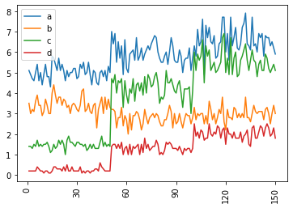
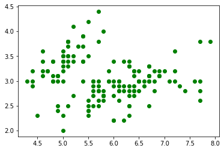

```python
import pandas as pd
import numpy as np
import matplotlib.pyplot as plt
import seaborn as sns
```

```python
iris_data = pd.read_csv('./data/iris.csv', index_col='Id') # Numerical dataset
mushroom_data = pd.read_csv('./data/mushrooms.csv') # Categorical dataset
a = iris_data.SepalLengthCm
b = iris_data.SepalWidthCm
c = iris_data.PetalLengthCm
d = iris_data.PetalWidthCm
```

```python
iris_data.describe()
```

<div>
<style scoped>
    .dataframe tbody tr th:only-of-type {
        vertical-align: middle;
    }

    .dataframe tbody tr th {
        vertical-align: top;
    }

    .dataframe thead th {
        text-align: right;
    }

</style>
<table border="1" class="dataframe">
  <thead>
    <tr style="text-align: right;">
      <th></th>
      <th>SepalLengthCm</th>
      <th>SepalWidthCm</th>
      <th>PetalLengthCm</th>
      <th>PetalWidthCm</th>
    </tr>
  </thead>
  <tbody>
    <tr>
      <th>count</th>
      <td>150.000000</td>
      <td>150.000000</td>
      <td>150.000000</td>
      <td>150.000000</td>
    </tr>
    <tr>
      <th>mean</th>
      <td>5.843333</td>
      <td>3.054000</td>
      <td>3.758667</td>
      <td>1.198667</td>
    </tr>
    <tr>
      <th>std</th>
      <td>0.828066</td>
      <td>0.433594</td>
      <td>1.764420</td>
      <td>0.763161</td>
    </tr>
    <tr>
      <th>min</th>
      <td>4.300000</td>
      <td>2.000000</td>
      <td>1.000000</td>
      <td>0.100000</td>
    </tr>
    <tr>
      <th>25%</th>
      <td>5.100000</td>
      <td>2.800000</td>
      <td>1.600000</td>
      <td>0.300000</td>
    </tr>
    <tr>
      <th>50%</th>
      <td>5.800000</td>
      <td>3.000000</td>
      <td>4.350000</td>
      <td>1.300000</td>
    </tr>
    <tr>
      <th>75%</th>
      <td>6.400000</td>
      <td>3.300000</td>
      <td>5.100000</td>
      <td>1.800000</td>
    </tr>
    <tr>
      <th>max</th>
      <td>7.900000</td>
      <td>4.400000</td>
      <td>6.900000</td>
      <td>2.500000</td>
    </tr>
  </tbody>
</table>
</div>

```python
plt.hist(a)
plt.hist(b)
plt.show()
```


```python
plt.boxplot(a, vert=False)
```

    {'whiskers': [<matplotlib.lines.Line2D at 0x2145fb6f250>,
      <matplotlib.lines.Line2D at 0x2145fb6f5b0>],
     'caps': [<matplotlib.lines.Line2D at 0x2145fb6f910>,
      <matplotlib.lines.Line2D at 0x2145fb6fc70>],
     'boxes': [<matplotlib.lines.Line2D at 0x2145fb62eb0>],
     'medians': [<matplotlib.lines.Line2D at 0x2145fb6ffd0>],
     'fliers': [<matplotlib.lines.Line2D at 0x2145fb7d370>],
     'means': []}


### Legend()

To add a legend in a chart, it needs to include a label variable at every plot.

### xticks()

Use a rotation variable to rotate labels.

```python
plt.plot(a, label ='a')
plt.plot(b, label ='b')
plt.plot(c, label ='c')
plt.plot(d, label ='d')
plt.xticks(range(0,180,30), rotation=90)
plt.legend()
```

    <matplotlib.legend.Legend at 0x2145fbde8b0>



### There is no feature like hue of SNS at matplotlib scatter plot.

```python

plt.scatter(a,b, marker="o",c='green')
```

    <matplotlib.collections.PathCollection at 0x2145face5e0>



### Subplots

We use subplots when we want to populate more than one visual and organize them next to one another in a specific way.

```python
plt.figure(figsize =(10,5))

for i, col in enumerate([a,b,c,d]) :
    plt.subplot(2,4,1+i) # I need (2,1) plot and am drawing first row of the plot.
    plt.hist(col)

for i, col in enumerate([a,b,c,d]) :
    plt.subplot(2,4,i+5)
    plt.boxplot(col, vert=False)

plt.tight_layout()

```


### Saving Figures

plt.savefig()

the directory is same with current folder.

```python
iris_data.Species.unique()
```

    array(['Iris-setosa', 'Iris-versicolor', 'Iris-virginica'], dtype=object)

```python
Species = iris_data.Species == 'Iris-setosa'
setosa = iris_data[Species]
```

```python
sns.regplot(x='SepalLengthCm', y='SepalWidthCm', data =setosa)
plt.show()
```


```python
for col in iris_data.columns :
    a = iris_data[col].unique()
    print(f"Column : {col}  \n unique : {a}\n")
```

    Column : SepalLengthCm
     uniqe : [5.1 4.9 4.7 4.6 5.  5.4 4.4 4.8 4.3 5.8 5.7 5.2 5.5 4.5 5.3 7.  6.4 6.9
     6.5 6.3 6.6 5.9 6.  6.1 5.6 6.7 6.2 6.8 7.1 7.6 7.3 7.2 7.7 7.4 7.9]

    Column : SepalWidthCm
     uniqe : [3.5 3.  3.2 3.1 3.6 3.9 3.4 2.9 3.7 4.  4.4 3.8 3.3 4.1 4.2 2.3 2.8 2.4
     2.7 2.  2.2 2.5 2.6]

    Column : PetalLengthCm
     uniqe : [1.4 1.3 1.5 1.7 1.6 1.1 1.2 1.  1.9 4.7 4.5 4.9 4.  4.6 3.3 3.9 3.5 4.2
     3.6 4.4 4.1 4.8 4.3 5.  3.8 3.7 5.1 3.  6.  5.9 5.6 5.8 6.6 6.3 6.1 5.3
     5.5 6.7 6.9 5.7 6.4 5.4 5.2]

    Column : PetalWidthCm
     uniqe : [0.2 0.4 0.3 0.1 0.5 0.6 1.4 1.5 1.3 1.6 1.  1.1 1.8 1.2 1.7 2.5 1.9 2.1
     2.2 2.  2.4 2.3]

    Column : Species
     uniqe : ['Iris-setosa' 'Iris-versicolor' 'Iris-virginica']

```python

```
