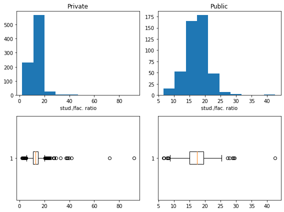
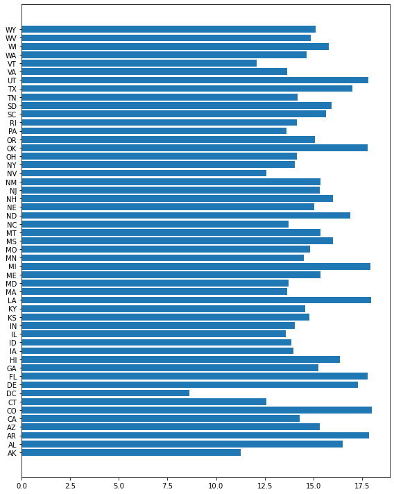
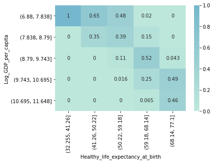
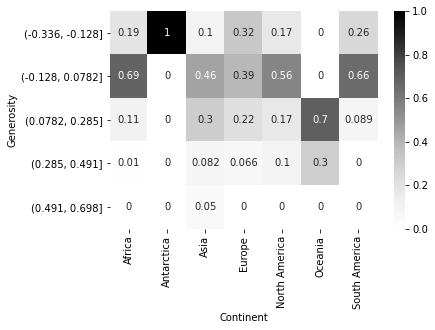

```python
import pandas as pd
import numpy as np
import matplotlib.pyplot as plt
import seaborn as sns
import os

os.getcwd()
```

    'd:\\git_local_repository\\yangoos57\\ML\\Hands_On_Data_preprocessing_in_python\\Part2'

```python
university_df = pd.read_csv('data/ch5/Universities_imputed_reduced.csv')
university_df.info()
```

    <class 'pandas.core.frame.DataFrame'>
    RangeIndex: 1302 entries, 0 to 1301
    Data columns (total 11 columns):
     #   Column                 Non-Null Count  Dtype
    ---  ------                 --------------  -----
     0   College Name           1302 non-null   object
     1   State                  1302 non-null   object
     2   Public/Private         1302 non-null   object
     3   num_appli_rec          1302 non-null   int64
     4   num_appl_accepted      1302 non-null   int64
     5   num_new_stud_enrolled  1302 non-null   int64
     6   in-state tuition       1302 non-null   int64
     7   out-of-state tuition   1302 non-null   int64
     8   % fac. w/PHD           1302 non-null   int64
     9   stud./fac. ratio       1302 non-null   float64
     10  Graduation rate        1302 non-null   int64
    dtypes: float64(1), int64(7), object(3)
    memory usage: 112.0+ KB

```python
plt.figure(figsize=(8,6))
university_poss = university_df['Public/Private'].unique()
for i, poss in enumerate(university_poss) :
    BM = university_df['Public/Private'] == poss
    x = university_df[BM]['stud./fac. ratio']
    plt.subplot(2,2,i+1)
    plt.title(poss)
    plt.hist(x)
    plt.xlabel('stud./fac. ratio')
    plt.subplot(2,2,i+3)
    plt.boxplot(x, vert=False)
    plt.tight_layout()
```



```python
plt.figure(figsize=(8,10))


university_df_poss = university_df['State'].unique()

a = []
for poss in university_df_poss :
    BM = university_df['State'] == poss
    mean = university_df[BM]['stud./fac. ratio'].mean()
    a.append(round(mean,3))

plt.barh(university_df_poss, a)
plt.tight_layout()
```



```python
plt.figure(figsize=(8,8))
# asd = university_df.groupby(['State','Public/Private']).size().unstack().plot.barh(stacked=True,figsize=(10,10), yticks= k)

BM_1 = university_df['Public/Private'] == 'Private'
a = university_df[BM_1]['State'].value_counts()
a['WY'] = 0
BM_2 = university_df['Public/Private'] == 'Public'
b = university_df[BM_2]['State'].value_counts()

# To Change Series into Dataframe and to make a new columns for sorting
total_df = pd.concat([a,b],axis=1) # axis = 1 가로로 붙히는 명령어
total_df.columns = ['Private','Public'] # column 이름 변경
total_df['total'] = total_df['Private'] + total_df['Public'] # Total 계산

# 순서대로 변경하기 위해서는 Sort_values를 무조건 해야함.
total_df.sort_values('total', ascending=False, inplace = True) # Inplce하면 원본파일 건드림

total_df = total_df.iloc[0:20,:]
plt.barh(total_df.index,total_df.Private,color='dodgerblue' , label ="Private")
plt.barh(total_df.index,total_df.Public, left=total_df.Private ,color='violet', label ="Public") # barh에서는 left, bar에서는 bottom

plt.legend()
plt.show()
```


```python
WH_df = pd.read_csv('data/ch5/WH Report_preprocessed.csv')
WH_df.info()
```

    <class 'pandas.core.frame.DataFrame'>
    RangeIndex: 1220 entries, 0 to 1219
    Data columns (total 13 columns):
     #   Column                            Non-Null Count  Dtype
    ---  ------                            --------------  -----
     0   Name                              1220 non-null   object
     1   Continent                         1220 non-null   object
     2   year                              1220 non-null   int64
     3   population                        1220 non-null   float64
     4   Life_Ladder                       1220 non-null   float64
     5   Log_GDP_per_capita                1220 non-null   float64
     6   Social_support                    1220 non-null   float64
     7   Healthy_life_expectancy_at_birth  1220 non-null   float64
     8   Freedom_to_make_life_choices      1220 non-null   float64
     9   Generosity                        1220 non-null   float64
     10  Perceptions_of_corruption         1220 non-null   float64
     11  Positive_affect                   1220 non-null   float64
     12  Negative_affect                   1220 non-null   float64
    dtypes: float64(10), int64(1), object(2)
    memory usage: 124.0+ KB

```python
sns.pairplot(WH_df)
```

    <seaborn.axisgrid.PairGrid at 0x167349c2cd0>


```python
WH_df.info()
```

    <class 'pandas.core.frame.DataFrame'>
    RangeIndex: 1220 entries, 0 to 1219
    Data columns (total 13 columns):
     #   Column                            Non-Null Count  Dtype
    ---  ------                            --------------  -----
     0   Name                              1220 non-null   object
     1   Continent                         1220 non-null   object
     2   year                              1220 non-null   int64
     3   population                        1220 non-null   float64
     4   Life_Ladder                       1220 non-null   float64
     5   Log_GDP_per_capita                1220 non-null   float64
     6   Social_support                    1220 non-null   float64
     7   Healthy_life_expectancy_at_birth  1220 non-null   float64
     8   Freedom_to_make_life_choices      1220 non-null   float64
     9   Generosity                        1220 non-null   float64
     10  Perceptions_of_corruption         1220 non-null   float64
     11  Positive_affect                   1220 non-null   float64
     12  Negative_affect                   1220 non-null   float64
    dtypes: float64(10), int64(1), object(2)
    memory usage: 124.0+ KB

```python
log_GDP = pd.cut(WH_df['Log_GDP_per_capita'], bins = 5)
Healthy_life =pd.cut(WH_df['Healthy_life_expectancy_at_birth'], bins = 5)

contingency_tbl = pd.crosstab(log_GDP,Healthy_life)
possibility_tbl = contingency_tbl/contingency_tbl.sum()
sns.heatmap(possibility_tbl, annot=True, center=5)
```

    <AxesSubplot:xlabel='Healthy_life_expectancy_at_birth', ylabel='Log_GDP_per_capita'>



```python
gen = pd.cut(WH_df['Generosity'], bins = 5)
contingency_tbl = pd.crosstab(gen,WH_df['Continent'])
possibility_tbl = contingency_tbl/contingency_tbl.sum()
sns.heatmap(possibility_tbl, annot=True, center=0.5, cmap='Greys')
```

    <AxesSubplot:xlabel='Continent', ylabel='Generosity'>



```python
WH_df.info()
```

    <class 'pandas.core.frame.DataFrame'>
    RangeIndex: 1220 entries, 0 to 1219
    Data columns (total 13 columns):
     #   Column                            Non-Null Count  Dtype
    ---  ------                            --------------  -----
     0   Name                              1220 non-null   object
     1   Continent                         1220 non-null   object
     2   year                              1220 non-null   int64
     3   population                        1220 non-null   float64
     4   Life_Ladder                       1220 non-null   float64
     5   Log_GDP_per_capita                1220 non-null   float64
     6   Social_support                    1220 non-null   float64
     7   Healthy_life_expectancy_at_birth  1220 non-null   float64
     8   Freedom_to_make_life_choices      1220 non-null   float64
     9   Generosity                        1220 non-null   float64
     10  Perceptions_of_corruption         1220 non-null   float64
     11  Positive_affect                   1220 non-null   float64
     12  Negative_affect                   1220 non-null   float64
    dtypes: float64(10), int64(1), object(2)
    memory usage: 124.0+ KB

```python
plt.figure(figsize=(6,8))
grwh = WH_df.groupby(['Name','year'])['Generosity'].mean().loc[:,[2010,2019]]
name_poss =WH_df['Name'].unique()
for con in name_poss :
    plt.plot([2010,2019],grwh[con], color ='gray')

markers =['o','8','s']
con_name = ['United States','India','China']
for i, name in enumerate(con_name) :
    plt.plot([2010,2019],grwh[name], color ='blue', marker=markers[i], label=name)
plt.xticks([2010,2019])
plt.legend()
plt.show()
```


```python

```

```python

```
