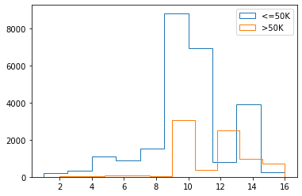
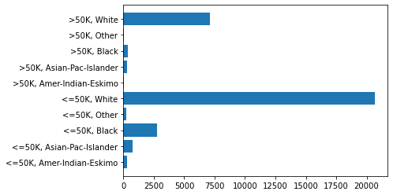
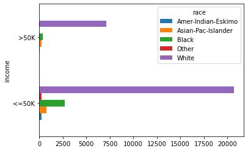
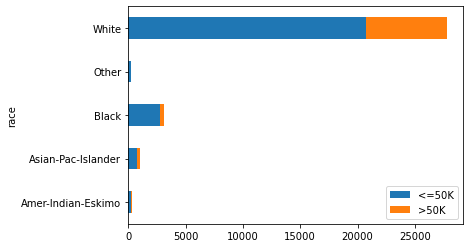

```python
import pandas as pd
import numpy as np
import matplotlib.pyplot as plt
import os
import seaborn as sns
cwd = os.getcwd()

cwd
```

    'd:\\git_local_repository\\yangoos57\\ML\\Hands_On_Data_preprocessing_in_python\\Part2'

```python
adult_df = pd.read_csv("data/ch5/adult.csv")

adult_df.head(10)
```

<div>
<style scoped>
    .dataframe tbody tr th:only-of-type {
        vertical-align: middle;
    }

    .dataframe tbody tr th {
        vertical-align: top;
    }

    .dataframe thead th {
        text-align: right;
    }

</style>
<table border="1" class="dataframe">
  <thead>
    <tr style="text-align: right;">
      <th></th>
      <th>age</th>
      <th>workclass</th>
      <th>fnlwgt</th>
      <th>education</th>
      <th>education-num</th>
      <th>marital-status</th>
      <th>occupation</th>
      <th>relationship</th>
      <th>race</th>
      <th>sex</th>
      <th>capitalGain</th>
      <th>capitalLoss</th>
      <th>hoursPerWeek</th>
      <th>nativeCountry</th>
      <th>income</th>
    </tr>
  </thead>
  <tbody>
    <tr>
      <th>0</th>
      <td>39</td>
      <td>State-gov</td>
      <td>77516</td>
      <td>Bachelors</td>
      <td>13</td>
      <td>Never-married</td>
      <td>Adm-clerical</td>
      <td>Not-in-family</td>
      <td>White</td>
      <td>Male</td>
      <td>2174</td>
      <td>0</td>
      <td>40</td>
      <td>United-States</td>
      <td>&lt;=50K</td>
    </tr>
    <tr>
      <th>1</th>
      <td>50</td>
      <td>Self-emp-not-inc</td>
      <td>83311</td>
      <td>Bachelors</td>
      <td>13</td>
      <td>Married-civ-spouse</td>
      <td>Exec-managerial</td>
      <td>Husband</td>
      <td>White</td>
      <td>Male</td>
      <td>0</td>
      <td>0</td>
      <td>13</td>
      <td>United-States</td>
      <td>&lt;=50K</td>
    </tr>
    <tr>
      <th>2</th>
      <td>38</td>
      <td>Private</td>
      <td>215646</td>
      <td>HS-grad</td>
      <td>9</td>
      <td>Divorced</td>
      <td>Handlers-cleaners</td>
      <td>Not-in-family</td>
      <td>White</td>
      <td>Male</td>
      <td>0</td>
      <td>0</td>
      <td>40</td>
      <td>United-States</td>
      <td>&lt;=50K</td>
    </tr>
    <tr>
      <th>3</th>
      <td>53</td>
      <td>Private</td>
      <td>234721</td>
      <td>11th</td>
      <td>7</td>
      <td>Married-civ-spouse</td>
      <td>Handlers-cleaners</td>
      <td>Husband</td>
      <td>Black</td>
      <td>Male</td>
      <td>0</td>
      <td>0</td>
      <td>40</td>
      <td>United-States</td>
      <td>&lt;=50K</td>
    </tr>
    <tr>
      <th>4</th>
      <td>28</td>
      <td>Private</td>
      <td>338409</td>
      <td>Bachelors</td>
      <td>13</td>
      <td>Married-civ-spouse</td>
      <td>Prof-specialty</td>
      <td>Wife</td>
      <td>Black</td>
      <td>Female</td>
      <td>0</td>
      <td>0</td>
      <td>40</td>
      <td>Cuba</td>
      <td>&lt;=50K</td>
    </tr>
    <tr>
      <th>5</th>
      <td>37</td>
      <td>Private</td>
      <td>284582</td>
      <td>Masters</td>
      <td>14</td>
      <td>Married-civ-spouse</td>
      <td>Exec-managerial</td>
      <td>Wife</td>
      <td>White</td>
      <td>Female</td>
      <td>0</td>
      <td>0</td>
      <td>40</td>
      <td>United-States</td>
      <td>&lt;=50K</td>
    </tr>
    <tr>
      <th>6</th>
      <td>49</td>
      <td>Private</td>
      <td>160187</td>
      <td>9th</td>
      <td>5</td>
      <td>Married-spouse-absent</td>
      <td>Other-service</td>
      <td>Not-in-family</td>
      <td>Black</td>
      <td>Female</td>
      <td>0</td>
      <td>0</td>
      <td>16</td>
      <td>Jamaica</td>
      <td>&lt;=50K</td>
    </tr>
    <tr>
      <th>7</th>
      <td>52</td>
      <td>Self-emp-not-inc</td>
      <td>209642</td>
      <td>HS-grad</td>
      <td>9</td>
      <td>Married-civ-spouse</td>
      <td>Exec-managerial</td>
      <td>Husband</td>
      <td>White</td>
      <td>Male</td>
      <td>0</td>
      <td>0</td>
      <td>45</td>
      <td>United-States</td>
      <td>&gt;50K</td>
    </tr>
    <tr>
      <th>8</th>
      <td>31</td>
      <td>Private</td>
      <td>45781</td>
      <td>Masters</td>
      <td>14</td>
      <td>Never-married</td>
      <td>Prof-specialty</td>
      <td>Not-in-family</td>
      <td>White</td>
      <td>Female</td>
      <td>14084</td>
      <td>0</td>
      <td>50</td>
      <td>United-States</td>
      <td>&gt;50K</td>
    </tr>
    <tr>
      <th>9</th>
      <td>42</td>
      <td>Private</td>
      <td>159449</td>
      <td>Bachelors</td>
      <td>13</td>
      <td>Married-civ-spouse</td>
      <td>Exec-managerial</td>
      <td>Husband</td>
      <td>White</td>
      <td>Male</td>
      <td>5178</td>
      <td>0</td>
      <td>40</td>
      <td>United-States</td>
      <td>&gt;50K</td>
    </tr>
  </tbody>
</table>
</div>

### Numerical_attributes 시각화하기

Numerical 속성은 histogram과 boxplot으로 시각화하면 속성의 특징을 쉽게 이해할 수 있다.

<br>

### suplot 기본값

**plt.subplot(nrows,ncols,index)** <br>
**221 의미 => 2x2의 첫번째 줄의 첫번째 칸**<br>
**223 의미 => 2x2의 두번째 줄의 첫번째 칸**<br>

```python
numerical_attributes = ['age', 'fnlwgt','education-num']
a = adult_df.iloc[:,0].index
print(a)
```

    RangeIndex(start=0, stop=32561, step=1)

```python
numerical_attributes = ['age', 'fnlwgt','education-num']

plt.figure(figsize=(10,6))

for i, col in enumerate(numerical_attributes) :
    plt.subplot(2,3,i+1)
    a = adult_df[col]
    plt.hist(a, edgecolor='black')

    plt.subplot(2,3,i+4)
    a = adult_df[col]
    plt.boxplot(a, vert=False)


plt.tight_layout()
plt.show()
```


### Categorical Attribute 살펴보기

카테고리 속성은 바차트를 이용해서 시각화하면 보기 편하다.

```python
categorical_attributes =['workclass', 'education', 'occupation']
a = adult_df[categorical_attributes].value_counts()
total = len(categorical_attributes)
plt.figure(figsize=(12,4))
for i, att in enumerate(categorical_attributes) :
    plt.subplot(1,3,i+1)
    a = adult_df[att].value_counts()
    plt.barh(a.index,a)
    plt.title(att)
plt.tight_layout()
plt.show()
```


### Y축 눈금 바꾸기

plt.yticks([축에 있는 값], [변경하고 싶은 값]) <br>
아래 예시처럼 하나만 변경하고 싶을지라도 [ ]로 감싸야함

```python
income_possibilities = adult_df['income'].unique()

for i in range(2) :
    plt.subplot(2,1,i+1)
    a = adult_df[adult_df['income'] ==income_possibilities[i]]['education-num']
    plt.boxplot(a ,vert=False)
    plt.yticks([1],[income_possibilities[i]])


plt.tight_layout()
plt.show()


```


대상 구분하는 표 만들기 (legend)

1. plt에 label을 넣는다.
2. plt.legend() 명령어를 넣는다.

```python
income_possibilities = adult_df['income'].unique()
for poss in income_possibilities :
    a = adult_df['income'] == poss
    b = adult_df['education-num'][a]
    plt.hist(b, label=poss,histtype='step')
plt.legend()
plt.show()
```



### 1. Categorical Attributes에는 value_count()를 써야한다.

- Categorical의 경우 Class를 Index로 쓰기 때문에 .unique()를 Index로 사용해도 된다.
- 다만 value_counts()를 사용하면 Class가 자동으로 포함되기에 .unique()를 쓴다.

### 2. Groupby를 사용할 땐 value_counts()를 쓰지않고 size()를 쓴다.

```python
income_possibilities = adult_df['income'].unique()
for i, att in enumerate(income_possibilities):
    plt.subplot(2,1,i+1)
    a = adult_df['income'] == att
    b = adult_df['race'][a].value_counts()
    plt.barh(b.index,b)
plt.tight_layout()
plt.show()
```


```python
a = adult_df.groupby(['income','race']).size()
b = [a+", "+b for a,b in a.index]
plt.barh(b, a)
plt.show()
```



```python
adult_df.groupby(['race','income']).size().plot.barh()
```

    <AxesSubplot:ylabel='race,income'>


### Unstack()을 하면 class를 색으로 구분한다.

### groupby 순서에 따라 label과 y축 위치기 달라진다.

```python
adult_df.groupby(['income','race']).size().unstack().plot.barh()
plt.show()
```



```python
adult_df.groupby(['race','income']).size().unstack().plot.barh()
plt.legend(loc=4)
plt.show()
```


```python
adult_df.groupby(['race','income']).size().unstack().plot.barh(stacked=True)
plt.legend(loc=4)
plt.show()
```



```python

```
