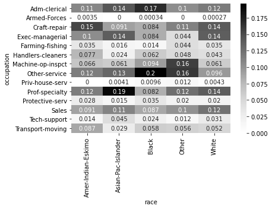
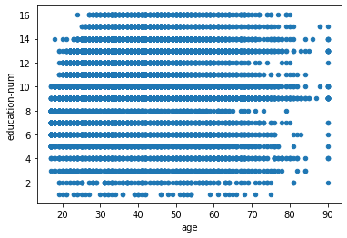
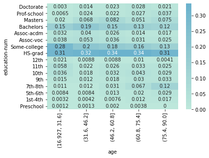
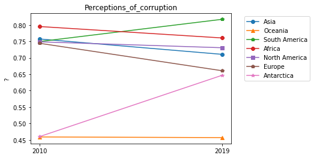

```python
import pandas as pd
import numpy as np
import matplotlib.pyplot as plt
import seaborn as sns
import os

os.getcwd()
```

```python
uni_df = pd.read_csv('./data/ch5/Universities_imputed_reduced.csv')
uni_df.info()
```

    <class 'pandas.core.frame.DataFrame'>
    RangeIndex: 1302 entries, 0 to 1301
    Data columns (total 11 columns):
     #   Column                 Non-Null Count  Dtype
    ---  ------                 --------------  -----
     0   College Name           1302 non-null   object
     1   State                  1302 non-null   object
     2   Public/Private         1302 non-null   object
     3   num_appli_rec          1302 non-null   int64
     4   num_appl_accepted      1302 non-null   int64
     5   num_new_stud_enrolled  1302 non-null   int64
     6   in-state tuition       1302 non-null   int64
     7   out-of-state tuition   1302 non-null   int64
     8   % fac. w/PHD           1302 non-null   int64
     9   stud./fac. ratio       1302 non-null   float64
     10  Graduation rate        1302 non-null   int64
    dtypes: float64(1), int64(7), object(3)
    memory usage: 112.0+ KB

```python
sns.pairplot(uni_df, palette='k')
```

    <seaborn.axisgrid.PairGrid at 0x18e71f6a700>


```python
adult_df = pd.read_csv('data/ch5/adult.csv')
adult_df.info()
```

    <class 'pandas.core.frame.DataFrame'>
    RangeIndex: 32561 entries, 0 to 32560
    Data columns (total 15 columns):
     #   Column          Non-Null Count  Dtype
    ---  ------          --------------  -----
     0   age             32561 non-null  int64
     1   workclass       30725 non-null  object
     2   fnlwgt          32561 non-null  int64
     3   education       32561 non-null  object
     4   education-num   32561 non-null  int64
     5   marital-status  32561 non-null  object
     6   occupation      30718 non-null  object
     7   relationship    32561 non-null  object
     8   race            32561 non-null  object
     9   sex             32561 non-null  object
     10  capitalGain     32561 non-null  int64
     11  capitalLoss     32561 non-null  int64
     12  hoursPerWeek    32561 non-null  int64
     13  nativeCountry   31978 non-null  object
     14  income          32561 non-null  object
    dtypes: int64(6), object(9)
    memory usage: 3.7+ MB

```python
contingency_tbl = pd.crosstab(adult_df.income, adult_df.sex)
contingency_tbl
```

<div>
<style scoped>
    .dataframe tbody tr th:only-of-type {
        vertical-align: middle;
    }

    .dataframe tbody tr th {
        vertical-align: top;
    }

    .dataframe thead th {
        text-align: right;
    }

</style>
<table border="1" class="dataframe">
  <thead>
    <tr style="text-align: right;">
      <th>sex</th>
      <th>Female</th>
      <th>Male</th>
    </tr>
    <tr>
      <th>income</th>
      <th></th>
      <th></th>
    </tr>
  </thead>
  <tbody>
    <tr>
      <th>&lt;=50K</th>
      <td>9592</td>
      <td>15128</td>
    </tr>
    <tr>
      <th>&gt;50K</th>
      <td>1179</td>
      <td>6662</td>
    </tr>
  </tbody>
</table>
</div>

### Heatmap은 값의 개별 확률을 확인할 때 사용하는구나.

### Heatmap = Contingency Table

- annot은 네모 박스 안에 숫자를 표현함
- annot과 cmap은 색을 조절함

```python
plt.figure(figsize=(8,6))
probability_tbl = contingency_tbl /contingency_tbl.sum()
print(probability_tbl)
sns.heatmap(probability_tbl, annot=True, center=0.8, cmap="Greys")
plt.show()
```

    sex       Female      Male
    income
    <=50K   0.890539  0.694263
    >50K    0.109461  0.305737


```python
contingency_tbl = pd.crosstab(adult_df.occupation,adult_df.race)
probability_tbl = contingency_tbl/contingency_tbl.sum()
sns.heatmap(probability_tbl, annot=True, cmap='Greys')
plt.show()
```



### Discretization : Numerical => Categorical

- pd.cut()은 분류기준이 되는 값 N개를 임의로 선정하는 method임.

```python
# pd. cut devides numerical attributes into 5 categorical class.
age_discretized = pd.cut(adult_df.age, bins =5)
contingency_tbl = pd.crosstab(age_discretized, adult_df.race)
probability_tbl = contingency_tbl/contingency_tbl.sum()
sns.heatmap(probability_tbl, annot=True, center=0.5, cmap="Greys")
```

    <AxesSubplot:xlabel='race', ylabel='age'>


 <br>

ordinal = by order <br>
nominal = noun

```python
adult_df.groupby(['education-num','education']).size()
```

    education-num  education
    1              Preschool          51
    2              1st-4th           168
    3              5th-6th           333
    4              7th-8th           646
    5              9th               514
    6              10th              933
    7              11th             1175
    8              12th              433
    9              HS-grad         10501
    10             Some-college     7291
    11             Assoc-voc        1382
    12             Assoc-acdm       1067
    13             Bachelors        5355
    14             Masters          1723
    15             Prof-school       576
    16             Doctorate         413
    dtype: int64

```python
## 두 개의 attribute가 관련 없음이 확인됨
adult_df.plot.scatter(x='age', y='education-num')
plt.show()
```



### heatmap X,Y축 원하는 방식으로 설정하기

```python
age_discretized = pd.cut(adult_df.age, bins = 5)
contingency_tbl = pd.crosstab(adult_df['education-num'], age_discretized)
probability_tbl = contingency_tbl / contingency_tbl.sum()

y = adult_df[['education','education-num']].sort_values(by='education-num')
yticks = y.education.unique()

ax = sns.heatmap(probability_tbl, annot=True, center = 1.5, yticklabels=yticks)
ax.invert_yaxis()
```



### 행열 지우기

drop(지우고 싶은 부분,axis =0(행) or 1(열), inplace =True or False)

```python
age_discretized = pd.cut(adult_df.age, bins = 5)
education_sort = adult_df[['age', 'education','education-num']].sort_values(by='education-num').drop('education-num', axis = 1)

# print(age_discretized)
print(type(adult_df.education))
print(type(education_sort))
```

    <class 'pandas.core.series.Series'>
    <class 'pandas.core.frame.DataFrame'>

### Dimension 추가하기

```python
country_df = pd.read_csv('data/ch5/WH Report_preprocessed.csv')
country_df.info()
```

    <class 'pandas.core.frame.DataFrame'>
    RangeIndex: 1220 entries, 0 to 1219
    Data columns (total 13 columns):
     #   Column                            Non-Null Count  Dtype
    ---  ------                            --------------  -----
     0   Name                              1220 non-null   object
     1   Continent                         1220 non-null   object
     2   year                              1220 non-null   int64
     3   population                        1220 non-null   float64
     4   Life_Ladder                       1220 non-null   float64
     5   Log_GDP_per_capita                1220 non-null   float64
     6   Social_support                    1220 non-null   float64
     7   Healthy_life_expectancy_at_birth  1220 non-null   float64
     8   Freedom_to_make_life_choices      1220 non-null   float64
     9   Generosity                        1220 non-null   float64
     10  Perceptions_of_corruption         1220 non-null   float64
     11  Positive_affect                   1220 non-null   float64
     12  Negative_affect                   1220 non-null   float64
    dtypes: float64(10), int64(1), object(2)
    memory usage: 124.0+ KB

.text()로 Plot안에 원하는 내용을 포함할 수 있음.plt

- Subplot을 사용할 경우에는 밑바탕이 되는 plot을 변수로 지정한다음 text method를 사용해야함.
- x축과 Y축은 비율로 움직이기 때문에 퍼센티지라 생각하고 값을 조정해야함.
- 공식문서에 있는 \*\*kwargs는 옵션 값이니 필요한 기능을 찾아서 활용하자. || [경로](https://matplotlib.org/3.5.1/api/_as_gen/matplotlib.pyplot.text.html)

```python
fig = plt.figure(figsize=(16,8))
year_poss = country_df.year.unique()
for i, yr in enumerate(year_poss) :
    BM = country_df.year == yr
    x = country_df[BM].Healthy_life_expectancy_at_birth
    y = country_df[BM].Log_GDP_per_capita
    plt.subplot(2,5,i+1)
    plt.scatter(x,y)
    plt.title(yr)
    plt.xlim([30,80])
    plt.ylim([6, 12])
# Set common labels
# fig.text(0.5, 0.04, 'common xlabel', ha='center', va='center')
fig.text(-0.02,0.5, 'Log_GDP_per_capita', ha='center', va='center', rotation='vertical',fontsize='x-large')
fig.text(0.5,-0.02, 'Healthy_life_expectancy_at_birth', ha='center', va='center' ,fontsize='x-large')
plt.tight_layout()

plt.show()
```


```python
def plotyear(year):
    BM = country_df.year == year
    x = country_df[BM].Healthy_life_expectancy_at_birth
    y = country_df[BM].Log_GDP_per_capita
    plt.scatter(x,y)
    plt.xlabel('Healthy_life_expectancy_at_birth')
    plt.ylabel('Log_GDP_per_capita')
    plt.xlim([30,80])
    plt.ylim([6, 12])
    plt.show()

```

### Interact 만들기

```python
from ipywidgets import interact, widgets

```

```python
continent_poss = country_df.Continent.unique()
lst_color =['b','g','r','c','m','y','k']
plt.figure(figsize=[10,10])
def plotyear(year) :
    BM1 = (country_df.year == year)
    for i in range(len(continent_poss)) :
        country_df.sort_values(['population'], inplace=True, ascending=False)
        BM2 = (country_df.Continent == continent_poss[i])
        BM = BM1 & BM2
        size = country_df[BM].population/200000
        x = country_df[BM].Healthy_life_expectancy_at_birth
        y = country_df[BM].Log_GDP_per_capita
        plt.scatter(x,y,c=lst_color[i], marker='o', linewidths=0.5, edgecolors='k', s=size, label =continent_poss[i])
    plt.xlabel('Healthy_life_expectancy_at_birth')
    plt.ylabel('Log_GDP_per_capita')
    plt.xlim([30,80])
    plt.ylim([6,12])
    plt.legend(markerscale = 0.4)
    plt.show()
# plotyear(2019)
interact(plotyear, year=widgets.IntSlider(min=2010,max=2019,step=1,value=2010))
```

    <Figure size 720x720 with 0 Axes>


    interactive(children=(IntSlider(value=2010, description='year', max=2019, min=2010), Output()), _dom_classes=(…

### Inplace True 의미

- Inplace를 True로 설정하고 실행하면 None이 반환됩니다. 아무것도 반환할게 없다는거죠.
- 건드린 원본을 보면 처음 불러왔을때와 모습이 다르다는 것을 알 수 있습니다.
- 즉 Inplace = True는 기존에 있는 dataframe이나 series를 직접 수정한다는 말입니다.

```python
BM1 = (country_df.year == 2010)
BM2 = (country_df.Continent == "Asia")
BM = BM1 & BM2
country_df[BM][['Name','Healthy_life_expectancy_at_birth']].sort_values('Healthy_life_expectancy_at_birth', ascending=False)

```

<div>
<style scoped>
    .dataframe tbody tr th:only-of-type {
        vertical-align: middle;
    }

    .dataframe tbody tr th {
        vertical-align: top;
    }

    .dataframe thead th {
        text-align: right;
    }

</style>
<table border="1" class="dataframe">
  <thead>
    <tr style="text-align: right;">
      <th></th>
      <th>Name</th>
      <th>Healthy_life_expectancy_at_birth</th>
    </tr>
  </thead>
  <tbody>
    <tr>
      <th>980</th>
      <td>Singapore</td>
      <td>74.80</td>
    </tr>
    <tr>
      <th>550</th>
      <td>Japan</td>
      <td>73.80</td>
    </tr>
    <tr>
      <th>530</th>
      <td>Israel</td>
      <td>72.40</td>
    </tr>
    <tr>
      <th>240</th>
      <td>China</td>
      <td>67.60</td>
    </tr>
    <tr>
      <th>1190</th>
      <td>Vietnam</td>
      <td>66.50</td>
    </tr>
    <tr>
      <th>1140</th>
      <td>United Arab Emirates</td>
      <td>66.40</td>
    </tr>
    <tr>
      <th>80</th>
      <td>Bahrain</td>
      <td>66.30</td>
    </tr>
    <tr>
      <th>1020</th>
      <td>Sri Lanka</td>
      <td>66.10</td>
    </tr>
    <tr>
      <th>680</th>
      <td>Malaysia</td>
      <td>65.60</td>
    </tr>
    <tr>
      <th>1070</th>
      <td>Thailand</td>
      <td>65.50</td>
    </tr>
    <tr>
      <th>610</th>
      <td>Lebanon</td>
      <td>65.20</td>
    </tr>
    <tr>
      <th>560</th>
      <td>Jordan</td>
      <td>64.70</td>
    </tr>
    <tr>
      <th>590</th>
      <td>Kuwait</td>
      <td>64.60</td>
    </tr>
    <tr>
      <th>940</th>
      <td>Saudi Arabia</td>
      <td>64.40</td>
    </tr>
    <tr>
      <th>1180</th>
      <td>Uzbekistan</td>
      <td>63.20</td>
    </tr>
    <tr>
      <th>1050</th>
      <td>Tajikistan</td>
      <td>62.40</td>
    </tr>
    <tr>
      <th>90</th>
      <td>Bangladesh</td>
      <td>60.70</td>
    </tr>
    <tr>
      <th>890</th>
      <td>Philippines</td>
      <td>60.60</td>
    </tr>
    <tr>
      <th>500</th>
      <td>Indonesia</td>
      <td>60.40</td>
    </tr>
    <tr>
      <th>740</th>
      <td>Mongolia</td>
      <td>60.20</td>
    </tr>
    <tr>
      <th>1110</th>
      <td>Turkmenistan</td>
      <td>60.04</td>
    </tr>
    <tr>
      <th>510</th>
      <td>Iraq</td>
      <td>59.60</td>
    </tr>
    <tr>
      <th>780</th>
      <td>Nepal</td>
      <td>59.20</td>
    </tr>
    <tr>
      <th>190</th>
      <td>Cambodia</td>
      <td>58.50</td>
    </tr>
    <tr>
      <th>490</th>
      <td>India</td>
      <td>57.40</td>
    </tr>
    <tr>
      <th>770</th>
      <td>Myanmar</td>
      <td>57.02</td>
    </tr>
    <tr>
      <th>850</th>
      <td>Pakistan</td>
      <td>56.20</td>
    </tr>
    <tr>
      <th>0</th>
      <td>Afghanistan</td>
      <td>51.60</td>
    </tr>
  </tbody>
</table>
</div>

### linePlot 그리기

### Legend 이동하기 (Bounding Box)

```python
continent_poss = country_df.Continent.unique()
bycontinentyear_df = country_df.groupby(['Continent', 'year'])['Perceptions_of_corruption'].mean()
print(bycontinentyear_df.loc['Asia',[2010,2019]])
markers_options = ['o','^','p','8','s','p','*']
for i, c in enumerate(continent_poss):
    plt.plot([2010,2019], bycontinentyear_df.loc[c,[2010,2019]], label=c, marker = markers_options[i])
plt.xticks([2010,2019])
plt.legend(bbox_to_anchor=(1.05, 1.0))
plt.title('Perceptions_of_corruption')
plt.ylabel('?')
plt.show()
```

    Continent  year
    Asia       2010    0.757500
               2019    0.710643
    Name: Perceptions_of_corruption, dtype: float64



### Groupby method

- .max() : 가장 빈도가 높은 값
- .min() : 가장 빈도가 낮은 값
- .size() : 개수
- .mean() : 평균

```python
a = bycontinentyear_df = country_df.groupby(['Continent', 'year'])['Perceptions_of_corruption'].size()
print(a)
```

    Continent      year
    Africa         2010    30
                   2011    30
                   2012    30
                   2013    30
                   2014    30
                           ..
    South America  2015     9
                   2016     9
                   2017     9
                   2018     9
                   2019     9
    Name: Perceptions_of_corruption, Length: 70, dtype: int64

```python

```
