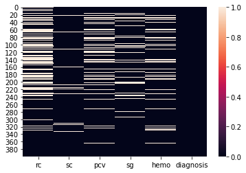

```python
import seaborn as sns
import pandas as pd
import numpy as np
import matplotlib.pyplot as plt
import os

os.getcwd()
```

    'd:\\git_local_repository\\yangoos57\\ML\\Hands_On_Data_preprocessing_in_python\\Part3'

```python
kidney_disease_df = pd.read_csv('data/ch11/kidney_disease.csv')

for attr in kidney_disease_df.columns :
    MV = sum(kidney_disease_df[attr].isna())
    print('{} : {} --- {}'.format(attr,MV, MV/len(kidney_disease_df[attr])))
```

    rc : 131 --- 0.3275
    sc : 17 --- 0.0425
    pcv : 71 --- 0.1775
    sg : 47 --- 0.1175
    hemo : 52 --- 0.13
    diagnosis : 0 --- 0.0

```python
sns.heatmap(kidney_disease_df.isna())
```

    <AxesSubplot:>



### Dealing with missing values

Those missing values are MAR.

We need to first consider how the algorithm uses the data and then try to choose a strategy that simultaneously optimizses the two goals of dealing with missing values

Remind two goals of dealing with missing value.

- Keeping as much data and information as possible
- Introducing the least possible amount of bias in our analysis

Our analytic tool, Decision Tree, is not inherently designed to deal with missing values. Knowing that will tell us that a keep as is strategy is not an option

### Missing value 자체가 instance에 의미 있는 변수이므로 nan값을 central tendency로 대체하기 전에 이를 표현하자

```python
kidney_disease_df['rc_BMV'] = kidney_disease_df.rc.isna().astype(int)
kidney_disease_df['pcv_BMV'] = kidney_disease_df.pcv.isna().astype(int)
kidney_disease_df['sg_BMV'] = kidney_disease_df.sg.isna().astype(int)
kidney_disease_df['hemo_BMV'] = kidney_disease_df.hemo.isna().astype(int)
```

```python
kidney_disease_df.head(3)
```

<div>
<style scoped>
    .dataframe tbody tr th:only-of-type {
        vertical-align: middle;
    }

    .dataframe tbody tr th {
        vertical-align: top;
    }

    .dataframe thead th {
        text-align: right;
    }

</style>
<table border="1" class="dataframe">
  <thead>
    <tr style="text-align: right;">
      <th></th>
      <th>rc</th>
      <th>sc</th>
      <th>pcv</th>
      <th>sg</th>
      <th>hemo</th>
      <th>diagnosis</th>
      <th>rc_BMV</th>
      <th>pcv_BMV</th>
      <th>sg_BMV</th>
      <th>hemo_BMV</th>
    </tr>
  </thead>
  <tbody>
    <tr>
      <th>0</th>
      <td>5.2</td>
      <td>1.2</td>
      <td>44.0</td>
      <td>1.02</td>
      <td>15.4</td>
      <td>ckd</td>
      <td>0</td>
      <td>0</td>
      <td>0</td>
      <td>0</td>
    </tr>
    <tr>
      <th>1</th>
      <td>NaN</td>
      <td>0.8</td>
      <td>38.0</td>
      <td>1.02</td>
      <td>11.3</td>
      <td>ckd</td>
      <td>1</td>
      <td>0</td>
      <td>0</td>
      <td>0</td>
    </tr>
    <tr>
      <th>2</th>
      <td>NaN</td>
      <td>1.8</td>
      <td>31.0</td>
      <td>1.01</td>
      <td>9.6</td>
      <td>ckd</td>
      <td>1</td>
      <td>0</td>
      <td>0</td>
      <td>0</td>
    </tr>
  </tbody>
</table>
</div>

### Nan에 Central Tendency(Median 또는 Mean) 대체하기

- Decision Tree는 대상을 구분할 때 주로 Central Tendency을 벗어난 값이 있는 것부터 구분한다. 아무래도 구분이 명확하기 때문인듯
- 그런 이유에서 Nan 값을 Central Tendency로 넣는다는 것은 해당 값이 분류에 영향을 최소화 할 수 있다는 것이기도 함.
- 그리고 Decision Tree는 Nan 값이 있으면 오류가 발생하므로 값을 무조건 너어야 하기도 함.

### 그렇다면 Median 또는 Mean 중 어떤 값을 넣어야 할까?

- Outlier가 많이 없다면 Mean으로 많다면 median으로 넣는다.

- dataframe의 attribute가 어떤 분포를 가지는지 boxplot을 그려보자.

```python
plt.figure(figsize=(10,5))
for i , attr in enumerate(['rc','sc','pcv','sg','hemo']) :
    plt.subplot(1,5,i+1)
    plt.title(attr)
    sns.boxplot(y= kidney_disease_df[attr])

plt.tight_layout()
plt.show()

```


```python
kidney_disease_df.fillna(kidney_disease_df.sc.median(),inplace=True)
kidney_disease_df.fillna(kidney_disease_df.mean(),inplace=True)
```

### Decision Tree 만들기

```python
from sklearn.tree import DecisionTreeClassifier, plot_tree
x = kidney_disease_df.drop(columns='diagnosis')
y = kidney_disease_df['diagnosis']
classTree=DecisionTreeClassifier(min_impurity_decrease= 0.01, min_samples_split=15)
classTree.fit(x,y)
```

    DecisionTreeClassifier(min_impurity_decrease=0.01, min_samples_split=15)

```python
plt.figure(figsize=(15,15))
plot_tree(classTree, feature_names=x.columns, class_names=y.unique(), filled= True, impurity=False)
plt.show()
```


### Question

1. 어떻게 Tree를 해석해야하는건가
2. 설정 변수들은 무엇들이지..
3. 실제로 예측을 해보고 싶은데 어떻게 해야하지?
4. cross validation 한번 써보고 싶은데

### Ch12 Example 3

```python
billboard_df = pd.read_csv('D:/git_local_repository/billboardHot100_1999-2019.csv')
### 200mb ㄷㄷ
```

```python
billboard_df.drop(index=67647,inplace=True)
```

### Query는 variate를 찾는데 활용된다. Query와 같은 기능 1. Boolean mask 2. isna()

### 엑셀 filter 개념과 같다고 보면 된다.

```python
# songattribute_df.query("Artist == 'Jose Feliciano' and Name == 'Light My Fire'")
```

```python
filtered_duplicate_song = songattribute_df.drop_duplicates(['Artist','Name'])
```

```python
filtered_duplicate_song.head()
```

<div>
<style scoped>
    .dataframe tbody tr th:only-of-type {
        vertical-align: middle;
    }

    .dataframe tbody tr th {
        vertical-align: top;
    }

    .dataframe thead th {
        text-align: right;
    }

</style>
<table border="1" class="dataframe">
  <thead>
    <tr style="text-align: right;">
      <th></th>
      <th>Unnamed: 0</th>
      <th>Acousticness</th>
      <th>Album</th>
      <th>Artist</th>
      <th>Danceability</th>
      <th>Duration</th>
      <th>Energy</th>
      <th>Explicit</th>
      <th>Instrumentalness</th>
      <th>Liveness</th>
      <th>Loudness</th>
      <th>Mode</th>
      <th>Name</th>
      <th>Popularity</th>
      <th>Speechiness</th>
      <th>Tempo</th>
      <th>TimeSignature</th>
      <th>Valence</th>
    </tr>
  </thead>
  <tbody>
    <tr>
      <th>0</th>
      <td>0</td>
      <td>0.000728</td>
      <td>Collective Soul (Deluxe Version)</td>
      <td>Collective Soul</td>
      <td>0.520</td>
      <td>234947</td>
      <td>0.904</td>
      <td>False</td>
      <td>0.010300</td>
      <td>0.0634</td>
      <td>-5.030</td>
      <td>1</td>
      <td>Welcome All Again</td>
      <td>35</td>
      <td>0.0309</td>
      <td>106.022</td>
      <td>4</td>
      <td>0.365</td>
    </tr>
    <tr>
      <th>1</th>
      <td>1</td>
      <td>0.018200</td>
      <td>Collective Soul (Deluxe Version)</td>
      <td>Collective Soul</td>
      <td>0.581</td>
      <td>239573</td>
      <td>0.709</td>
      <td>False</td>
      <td>0.000664</td>
      <td>0.1740</td>
      <td>-4.909</td>
      <td>1</td>
      <td>Fuzzy</td>
      <td>31</td>
      <td>0.0282</td>
      <td>120.027</td>
      <td>4</td>
      <td>0.408</td>
    </tr>
    <tr>
      <th>2</th>
      <td>2</td>
      <td>0.000473</td>
      <td>Collective Soul (Deluxe Version)</td>
      <td>Collective Soul</td>
      <td>0.572</td>
      <td>198400</td>
      <td>0.918</td>
      <td>False</td>
      <td>0.000431</td>
      <td>0.0977</td>
      <td>-3.324</td>
      <td>0</td>
      <td>Dig</td>
      <td>30</td>
      <td>0.0559</td>
      <td>144.061</td>
      <td>4</td>
      <td>0.370</td>
    </tr>
    <tr>
      <th>3</th>
      <td>3</td>
      <td>0.000970</td>
      <td>Collective Soul (Deluxe Version)</td>
      <td>Collective Soul</td>
      <td>0.596</td>
      <td>231453</td>
      <td>0.661</td>
      <td>False</td>
      <td>0.000033</td>
      <td>0.1130</td>
      <td>-5.051</td>
      <td>1</td>
      <td>You</td>
      <td>35</td>
      <td>0.0254</td>
      <td>111.975</td>
      <td>4</td>
      <td>0.183</td>
    </tr>
    <tr>
      <th>4</th>
      <td>4</td>
      <td>0.000036</td>
      <td>Collective Soul (Deluxe Version)</td>
      <td>Collective Soul</td>
      <td>0.520</td>
      <td>222520</td>
      <td>0.808</td>
      <td>False</td>
      <td>0.000010</td>
      <td>0.0800</td>
      <td>-4.553</td>
      <td>0</td>
      <td>My Days</td>
      <td>21</td>
      <td>0.0318</td>
      <td>92.721</td>
      <td>4</td>
      <td>0.666</td>
    </tr>
  </tbody>
</table>
</div>

```python
artist_df = pd.read_csv('data/ch12/artistDf.csv')
artist_df.Artist.value_counts()
artist_df.drop(index = 716, inplace= True)
```

```python

```
