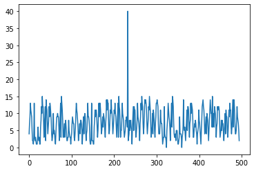
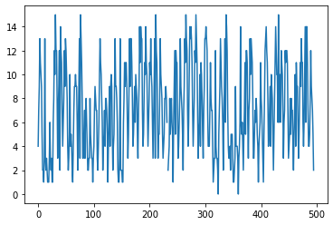
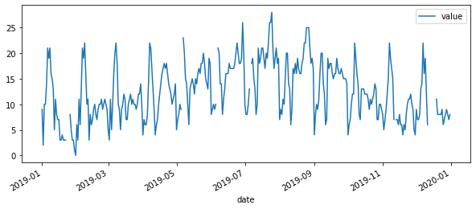
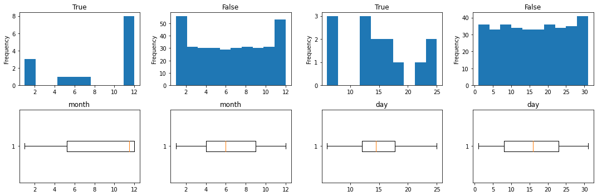
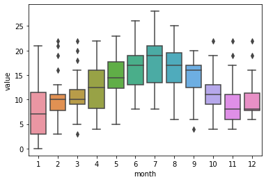
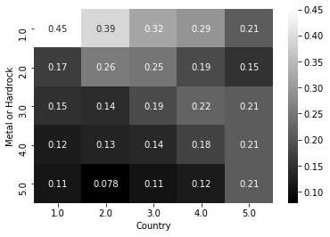
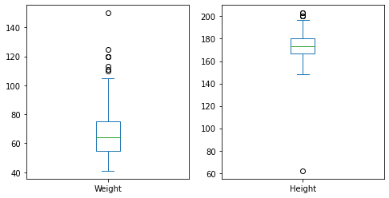
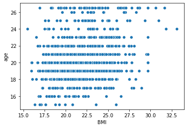
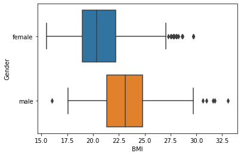
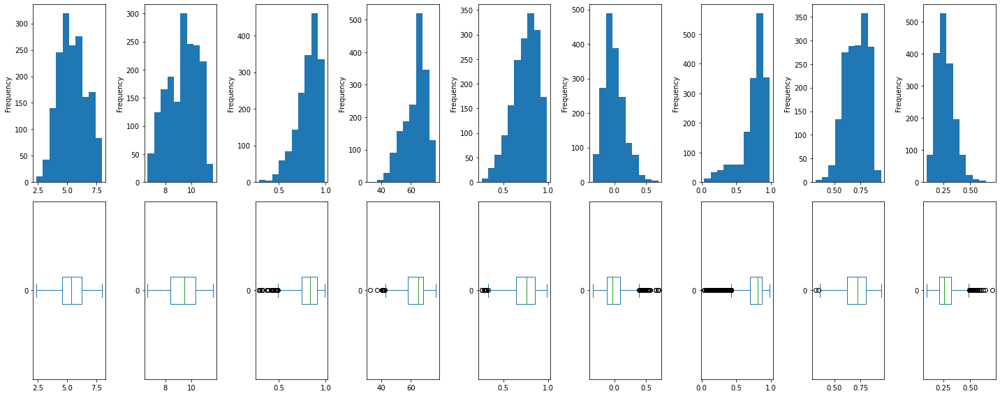

```python
import numpy as np
import pandas as pd
import seaborn as sns
import os
import matplotlib.pyplot as plt

os.getcwd()
```

    'd:\\git_local_repository\\yangoos57\\ML\\Hands_On_Data_preprocessing_in_python\\Part3'

### Data = True Signal + Error

```python
customer_entries = pd.read_excel('data/ch11/CustomerEnteries.xlsx')

customer_entries.info()
```

    <class 'pandas.core.frame.DataFrame'>
    RangeIndex: 495 entries, 0 to 494
    Data columns (total 3 columns):
     #   Column       Non-Null Count  Dtype
    ---  ------       --------------  -----
     0   Date         495 non-null    datetime64[ns]
     1   Time         495 non-null    int64
     2   N_Customers  495 non-null    int64
    dtypes: datetime64[ns](1), int64(2)
    memory usage: 11.7 KB

```python
BM = customer_entries.Time == 9
asd = customer_entries.drop(columns='Date')[BM].values
```

```python
customer_entries.N_Customers.plot()
```

    <AxesSubplot:>



### Regarding the data entry as a missing value and replacing it with np.nan

```python
err_index = customer_entries[customer_entries.N_Customers > 20].index
customer_entries.loc[err_index] = np.nan
```

### Univariate

```python
customer_entries.N_Customers.plot()
```

    <AxesSubplot:>



### bivariate

```python
sns.boxplot(y='N_Customers', x='Time', data=customer_entries)
```

    <AxesSubplot:xlabel='Time', ylabel='N_Customers'>


```python
customer_entries.groupby('Time').N_Customers.median().plot.bar()
```

    <AxesSubplot:xlabel='Time'>


### Exercise_1

```python
temp_df = pd.read_csv('data/ch11/Temperature_data.csv')
temp_df.head(1)
```

<div>
<style scoped>
    .dataframe tbody tr th:only-of-type {
        vertical-align: middle;
    }

    .dataframe tbody tr th {
        vertical-align: top;
    }

    .dataframe thead th {
        text-align: right;
    }

</style>
<table border="1" class="dataframe">
  <thead>
    <tr style="text-align: right;">
      <th></th>
      <th>Site</th>
      <th>Species</th>
      <th>ReadingDateTime</th>
      <th>Value</th>
      <th>Units</th>
      <th>Provisional or Ratified</th>
    </tr>
  </thead>
  <tbody>
    <tr>
      <th>0</th>
      <td>RI2</td>
      <td>TMP</td>
      <td>1/1/2019 0:00</td>
      <td>9.0</td>
      <td>oC</td>
      <td>P</td>
    </tr>
  </tbody>
</table>
</div>

```python
temp_df.columns = ['site','species','date','value','units','P_or_R']
```

```python
for col in temp_df.columns :
    print('{} : {} _ {}'.format(col,len(temp_df[col].unique()),sum(temp_df[col].isna())))

```

    site : 1 _ 0
    species : 1 _ 0
    date : 365 _ 0
    value : 28 _ 14
    units : 1 _ 0
    P_or_R : 1 _ 0

```python
new_temp_df = temp_df[['date','value']]

```

```python
new_temp_df.loc[:,'date'] = pd.to_datetime(new_temp_df['date'])
```

    <ipython-input-13-7c1e367b6e0f>:1: SettingWithCopyWarning:
    A value is trying to be set on a copy of a slice from a DataFrame.
    Try using .loc[row_indexer,col_indexer] = value instead

    See the caveats in the documentation: https://pandas.pydata.org/pandas-docs/stable/user_guide/indexing.html#returning-a-view-versus-a-copy
      new_temp_df.loc[:,'date'] = pd.to_datetime(new_temp_df['date'])

```python
new_temp_df['month'] = new_temp_df['date'].dt.month
new_temp_df['day'] = new_temp_df['date'].dt.day
```

    <ipython-input-14-1d0b8b9cd9a8>:1: SettingWithCopyWarning:
    A value is trying to be set on a copy of a slice from a DataFrame.
    Try using .loc[row_indexer,col_indexer] = value instead

    See the caveats in the documentation: https://pandas.pydata.org/pandas-docs/stable/user_guide/indexing.html#returning-a-view-versus-a-copy
      new_temp_df['month'] = new_temp_df['date'].dt.month
    <ipython-input-14-1d0b8b9cd9a8>:2: SettingWithCopyWarning:
    A value is trying to be set on a copy of a slice from a DataFrame.
    Try using .loc[row_indexer,col_indexer] = value instead

    See the caveats in the documentation: https://pandas.pydata.org/pandas-docs/stable/user_guide/indexing.html#returning-a-view-versus-a-copy
      new_temp_df['day'] = new_temp_df['date'].dt.day

```python
plt.figure(figsize=(10,4))
new_temp_df.plot(x='date', y='value', figsize=(10,4))
```

    <AxesSubplot:xlabel='date'>


    <Figure size 720x288 with 0 Axes>



```python
plt.subplot(2,1,1)
new_temp_df.value.plot.hist()
plt.subplot(2,1,2)
new_temp_df.value.plot.box(vert=False)

plt.show()
```


```python
plt.figure(figsize=(15,5))
for k, val in enumerate(['month', 'day']) :
    for i, poss in enumerate([True,False]) :
        BM = new_temp_df['value'].isna() == poss
        plt.subplot(2,4,i+1+2*k)
        plt.title(poss)
        plt.hist(new_temp_df[BM][val])
        plt.ylabel('Frequency')
        plt.subplot(2,4,i+5+2*k)
        plt.title(val)
        plt.boxplot(new_temp_df[BM][val], vert=False)
plt.tight_layout()
plt.show()
```



```python
from scipy.stats import ttest_ind
BM = new_temp_df['value'].isna()
ttest_ind(new_temp_df[BM].month, new_temp_df[~BM].month)
```

    Ttest_indResult(statistic=1.9521738591840396, pvalue=0.05168601534282252)

```python
new_temp_df[new_temp_df['value'].isna() == True]
```

<div>
<style scoped>
    .dataframe tbody tr th:only-of-type {
        vertical-align: middle;
    }

    .dataframe tbody tr th {
        vertical-align: top;
    }

    .dataframe thead th {
        text-align: right;
    }

</style>
<table border="1" class="dataframe">
  <thead>
    <tr style="text-align: right;">
      <th></th>
      <th>date</th>
      <th>value</th>
      <th>month</th>
      <th>day</th>
    </tr>
  </thead>
  <tbody>
    <tr>
      <th>22</th>
      <td>2019-01-23</td>
      <td>NaN</td>
      <td>1</td>
      <td>23</td>
    </tr>
    <tr>
      <th>23</th>
      <td>2019-01-24</td>
      <td>NaN</td>
      <td>1</td>
      <td>24</td>
    </tr>
    <tr>
      <th>24</th>
      <td>2019-01-25</td>
      <td>NaN</td>
      <td>1</td>
      <td>25</td>
    </tr>
    <tr>
      <th>155</th>
      <td>2019-05-06</td>
      <td>NaN</td>
      <td>5</td>
      <td>6</td>
    </tr>
    <tr>
      <th>156</th>
      <td>2019-06-06</td>
      <td>NaN</td>
      <td>6</td>
      <td>6</td>
    </tr>
    <tr>
      <th>157</th>
      <td>2019-07-06</td>
      <td>NaN</td>
      <td>7</td>
      <td>6</td>
    </tr>
    <tr>
      <th>344</th>
      <td>2019-11-12</td>
      <td>NaN</td>
      <td>11</td>
      <td>12</td>
    </tr>
    <tr>
      <th>345</th>
      <td>2019-12-12</td>
      <td>NaN</td>
      <td>12</td>
      <td>12</td>
    </tr>
    <tr>
      <th>346</th>
      <td>2019-12-13</td>
      <td>NaN</td>
      <td>12</td>
      <td>13</td>
    </tr>
    <tr>
      <th>347</th>
      <td>2019-12-14</td>
      <td>NaN</td>
      <td>12</td>
      <td>14</td>
    </tr>
    <tr>
      <th>348</th>
      <td>2019-12-15</td>
      <td>NaN</td>
      <td>12</td>
      <td>15</td>
    </tr>
    <tr>
      <th>349</th>
      <td>2019-12-16</td>
      <td>NaN</td>
      <td>12</td>
      <td>16</td>
    </tr>
    <tr>
      <th>350</th>
      <td>2019-12-17</td>
      <td>NaN</td>
      <td>12</td>
      <td>17</td>
    </tr>
    <tr>
      <th>351</th>
      <td>2019-12-18</td>
      <td>NaN</td>
      <td>12</td>
      <td>18</td>
    </tr>
  </tbody>
</table>
</div>

```python
sns.boxplot(data= new_temp_df, x ='month' , y='value')
```

    <AxesSubplot:xlabel='month', ylabel='value'>



### Exerise 3

Exercise 2는 자료가 없으므로 패스

```python
imdb_df = pd.read_csv('data/ch11/imdb_top_1000.csv')
imdb_df.info()
```

    <class 'pandas.core.frame.DataFrame'>
    RangeIndex: 1000 entries, 0 to 999
    Data columns (total 16 columns):
     #   Column         Non-Null Count  Dtype
    ---  ------         --------------  -----
     0   Poster_Link    1000 non-null   object
     1   Series_Title   1000 non-null   object
     2   Released_Year  1000 non-null   object
     3   Certificate    899 non-null    object
     4   Runtime        1000 non-null   object
     5   Genre          1000 non-null   object
     6   IMDB_Rating    1000 non-null   float64
     7   Overview       1000 non-null   object
     8   Meta_score     843 non-null    float64
     9   Director       1000 non-null   object
     10  Star1          1000 non-null   object
     11  Star2          1000 non-null   object
     12  Star3          1000 non-null   object
     13  Star4          1000 non-null   object
     14  No_of_Votes    1000 non-null   int64
     15  Gross          831 non-null    object
    dtypes: float64(2), int64(1), object(13)
    memory usage: 125.1+ KB

```python
sorted_imdb_df = imdb_df[['IMDB_Rating','Certificate','Runtime','Genre','Gross']] ## Certificate, Gross missing value

sorted_imdb_df.head(5)
```

<div>
<style scoped>
    .dataframe tbody tr th:only-of-type {
        vertical-align: middle;
    }

    .dataframe tbody tr th {
        vertical-align: top;
    }

    .dataframe thead th {
        text-align: right;
    }

</style>
<table border="1" class="dataframe">
  <thead>
    <tr style="text-align: right;">
      <th></th>
      <th>IMDB_Rating</th>
      <th>Certificate</th>
      <th>Runtime</th>
      <th>Genre</th>
      <th>Gross</th>
    </tr>
  </thead>
  <tbody>
    <tr>
      <th>0</th>
      <td>9.3</td>
      <td>A</td>
      <td>142 min</td>
      <td>Drama</td>
      <td>28,341,469</td>
    </tr>
    <tr>
      <th>1</th>
      <td>9.2</td>
      <td>A</td>
      <td>175 min</td>
      <td>Crime, Drama</td>
      <td>134,966,411</td>
    </tr>
    <tr>
      <th>2</th>
      <td>9.0</td>
      <td>UA</td>
      <td>152 min</td>
      <td>Action, Crime, Drama</td>
      <td>534,858,444</td>
    </tr>
    <tr>
      <th>3</th>
      <td>9.0</td>
      <td>A</td>
      <td>202 min</td>
      <td>Crime, Drama</td>
      <td>57,300,000</td>
    </tr>
    <tr>
      <th>4</th>
      <td>9.0</td>
      <td>U</td>
      <td>96 min</td>
      <td>Crime, Drama</td>
      <td>4,360,000</td>
    </tr>
  </tbody>
</table>
</div>

```python
x = sorted_imdb_df.Genre.str.split(',')
k=[]
for i in range(len(x)) :
    k += x[i]
print(set(k))
```

    {'Mystery', ' Crime', ' Sport', 'Crime', ' Action', 'Animation', ' Fantasy', ' Comedy', ' Horror', 'Biography', ' Musical', ' War', ' Adventure', ' Film-Noir', 'Adventure', 'Western', ' Music', ' Mystery', ' Drama', ' Romance', 'Film-Noir', 'Fantasy', ' Biography', 'Thriller', 'Family', ' Family', ' Sci-Fi', ' Western', 'Horror', 'Action', ' Thriller', 'Drama', 'Comedy', ' History'}

```python
x = sorted_imdb_df.Genre.str.split(',')
a = []
for i in range(len(x)) :
    a.append(len(x[i]))

# sorted_imdb_df['Gen_len'] = a

```

```python
new_imdb_df = sorted_imdb_df.dropna()

```

```python
# from sklearn.tree import DecisionTreeClassifier
# from sklearn import preprocessing


# predictors = new_imdb_df.drop(columns=['IMDB_Rating']).columns ### Nomalizing을 하지 않는다.
# target = 'IMDB_Rating'

# for val in predictors :
#     xs = new_imdb_df[val]
#     print(xs)
#     le = preprocessing.LabelEncoder()
#     xs = le.fit_transform(xs)
# y = new_imdb_df[target]
# classtree = DecisionTreeClassifier()
# classtree.fit(xs,y)
# # predict_y = classtree.predict(newapplicant_df)
# # print(predict_y)
```

### Exercise 4

```python
responses_df = pd.read_csv('data/ch11/responses.csv')
columns_df = pd.read_csv('data/ch11/columns.csv')
```

```python
# responses_df.info()
columns_df.info()
```

    <class 'pandas.core.frame.DataFrame'>
    RangeIndex: 150 entries, 0 to 149
    Data columns (total 2 columns):
     #   Column    Non-Null Count  Dtype
    ---  ------    --------------  -----
     0   original  150 non-null    object
     1   short     150 non-null    object
    dtypes: object(2)
    memory usage: 2.5+ KB

```python
Q3 = responses_df.Age.quantile(0.75)
Q1 = responses_df.Age.quantile(0.25)
IQR = Q3-Q1
upper_cap = Q3 + 1.5*IQR
lower_cap = Q1 - 1.5*IQR

BM = responses_df.Age > upper_cap
responses_df.loc[responses_df[BM].index,'Age'] = upper_cap
BM = responses_df.Age < lower_cap
responses_df.loc[responses_df[BM].index,'Age'] = lower_cap


```

```python
sns.boxplot(y= responses_df.Age)
```

    <AxesSubplot:ylabel='Age'>


```python
metal_country_df = responses_df[['Metal or Hardrock','Country']]
contingency_table = pd.(metal_country_df.iloc[:,0],metal_country_df.iloc[:,1])
possibility_tbl = contingency_table/contingency_table.sum()
sns.heatmap(possibility_tbl,annot=True, cmap='gray')
```

    <AxesSubplot:xlabel='Country', ylabel='Metal or Hardrock'>



```python
new_response_df = responses_df.loc[:,['Weight','Height','Education']]
new_response_df.dropna(inplace=True)
```

```python
plt.figure(figsize=(8,4))
plt.subplot(1,2,1)
new_response_df['Weight'].plot.box()
plt.subplot(1,2,2)
new_response_df['Height'].plot.box()
```

    <AxesSubplot:>



```python
new_response_df['BMI'] = responses_df['Weight'] / ((responses_df['Height']/100)**2)

new_response_df.info()
```

    <class 'pandas.core.frame.DataFrame'>
    Int64Index: 979 entries, 0 to 1009
    Data columns (total 4 columns):
     #   Column     Non-Null Count  Dtype
    ---  ------     --------------  -----
     0   Weight     979 non-null    float64
     1   Height     979 non-null    float64
     2   Education  979 non-null    object
     3   BMI        979 non-null    float64
    dtypes: float64(3), object(1)
    memory usage: 38.2+ KB

```python
new_response_df.drop(new_response_df[new_response_df['BMI'] > 120].index,axis=0,inplace=True)
```

```python
sns.boxplot(data=new_response_df, y='Education',x='BMI')
```

    <AxesSubplot:xlabel='BMI', ylabel='Education'>


```python
# BMI Outlier 없애기

for degree in new_response_df['Education'].unique() :
# for degree in ['college/bachelor degree'] :
    print(degree)
    de = new_response_df['Education'] == degree
    k = new_response_df[de]
    Q3 = k.BMI.quantile(0.75)
    Q1 = k.BMI.quantile(0.25)
    IQR = Q3-Q1
    upper_cap = Q3 + 1.5*IQR
    lower_cap = Q1 - 1.5*IQR

    BM = k.BMI > upper_cap
    # print(BM)
    # print(len(k[BM].index))
    new_response_df.loc[k[BM].index,'BMI'] = upper_cap
    BM = k.BMI < lower_cap
    new_response_df.loc[k[BM].index,'BMI'] = lower_cap
```

    college/bachelor degree
    secondary school
    primary school
    masters degree
    doctorate degree
    currently a primary school pupil

```python
sns.boxplot(data=new_response_df, y='Education',x='BMI')
```

    <AxesSubplot:xlabel='BMI', ylabel='Education'>


```python
### age 불러오기 쉬움. BM 이용하면 됨
BM = new_response_df['BMI'].index
new_response_df['age']= responses_df['Age'][BM]

sns.scatterplot(x='BMI', y='age',data=new_response_df)
```

    <AxesSubplot:xlabel='BMI', ylabel='age'>



```python
BM = new_response_df['BMI'].index
new_response_df['Gender']= responses_df['Gender'][BM]
new_response_df.dropna(inplace=True)
```

```python
x =[]
for poss in new_response_df['Gender'].unique() :
    BM = new_response_df['Gender'] == poss
    x.append(new_response_df[BM].BMI.values)
```

```python
sns.boxplot(data = new_response_df[['BMI','Gender']], x = 'BMI', y= 'Gender')
```

    <AxesSubplot:xlabel='BMI', ylabel='Gender'>



```python
resposne_se = pd.Series(x)
plt.boxplot(resposne_se, vert=False)
plt.show()
```


### Exercise 6

- exercise 5는 자료가 없으므로 생략

```python
wh_report = pd.read_csv('data/ch11/WH Report.csv')
wh_report.head(1)
```

<div>
<style scoped>
    .dataframe tbody tr th:only-of-type {
        vertical-align: middle;
    }

    .dataframe tbody tr th {
        vertical-align: top;
    }

    .dataframe thead th {
        text-align: right;
    }

</style>
<table border="1" class="dataframe">
  <thead>
    <tr style="text-align: right;">
      <th></th>
      <th>Country name</th>
      <th>year</th>
      <th>Life Ladder</th>
      <th>Log GDP per capita</th>
      <th>Social support</th>
      <th>Healthy life expectancy at birth</th>
      <th>Freedom to make life choices</th>
      <th>Generosity</th>
      <th>Perceptions of corruption</th>
      <th>Positive affect</th>
      <th>Negative affect</th>
    </tr>
  </thead>
  <tbody>
    <tr>
      <th>0</th>
      <td>Afghanistan</td>
      <td>2008</td>
      <td>3.724</td>
      <td>7.37</td>
      <td>0.451</td>
      <td>50.8</td>
      <td>0.718</td>
      <td>0.168</td>
      <td>0.882</td>
      <td>0.518</td>
      <td>0.258</td>
    </tr>
  </tbody>
</table>
</div>

```python
wh_report.columns =['country','year','ladder','log_gdp','social_suppoet','expectancy','freedom_life','generosity','corruption','pos_aff','neg_aff']
```

```python
for col in wh_report.columns :
    print('{} : {}'.format(col,sum(wh_report[col].isna())))
```

    country : 0
    year : 0
    ladder : 0
    log_gdp : 36
    social_suppoet : 13
    expectancy : 55
    freedom_life : 32
    generosity : 89
    corruption : 110
    pos_aff : 22
    neg_aff : 16

```python
wh_report.dropna(inplace=True)
```

```python
outlier_check = wh_report.drop(columns=['country','year']).columns
total_len = len(outlier_check)

plt.figure(figsize=(20,8))

for i, col in enumerate(outlier_check) :
    plt.subplot(2,total_len,i+1)
    # sns.histplot(x=wh_report[col])
    # plt.hist(wh_report[col])
    wh_report[col].plot.hist()

    plt.subplot(2,total_len,i+1+total_len)
    # plt.boxplot(wh_report[col],vert=False)
    # sns.boxplot(x=wh_report[col])
    wh_report[col].plot.box(vert=False, use_index=False)

plt.tight_layout()
plt.show()
```



```python

```
