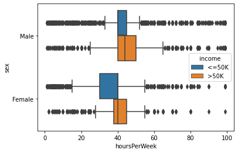
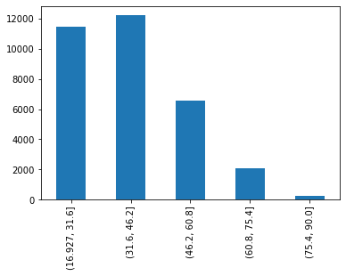
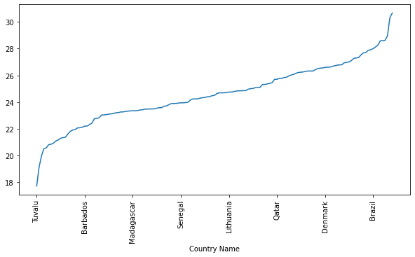
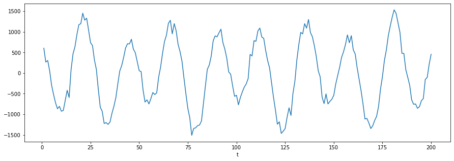
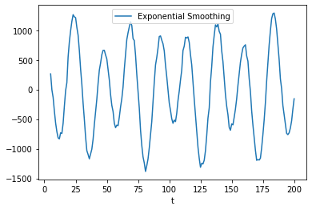

```python
import pandas as pd
import numpy as np
import seaborn as sns
import matplotlib.pyplot as plt
import os

os.getcwd()
```

    'd:\\git_local_repository\\yangoos57\\ML\\Hands_On_Data_preprocessing_in_python\\Part3'

# Data transformation and Massaging

### Three reasons why data transforamtion needs.

1. Necessity : 몇몇 알고리즘은 numerical attributes만 사용가능다. 그럴경우 categorical attributes 를 numerical로 바꿔야한다.

2. Correctness : K-means 알고리즘과 같은 경우 Normalization을 하지 않은체로 실행한다면 scale이 큰 attribute에 더욱 가중치를 둔다.
3. Effectiveness : 데이터가 약간 다듬어 진다면 더 나은 결과를 산출할 수 있다.

### Normalization and standardization

1. Normalization : we need normalization when we need the range of all the attributes in a dataset to be equal. especially some algorithms,such as KNN, K-means, that use the distance between the data object are necessary.

   NA*(i) = A*(i) - min(A) / Max(A) - Min(A)

2. Standardization : we need the variance or the standard deviation of all the attributes to be equal. attribute들 끼리 비교할 때 deviation으로 통일해서 구분하는 방법이다.

   SA*(i) = A*(i) - mean(A) / std(A)

3. 두 방법 모두 거리로 값을 통일하는 듯. 대상을 통일시킬때 둘중 하나로 사용하면 되므로 둘다 써보고 효과가 좋은 방법으로 쓰는것을 권장함.

### Attribute 종류 변환하는 세가지 툴

1. Binary coding (C => N, when C is Nominal)

2. ranking trnasformation (C => N, when C is Nominal or Ordinal)
3. discretization(N => C)


```python
report_df = pd.read_csv('data/ch14/WH Report_preprocessed.csv')
BM = report_df.year == 2019
report_df_2019 = report_df[BM]
report_df_2019.set_index('Name', inplace=True)

```

### Binary coding

get_dummies

```python
bc_continent = pd.get_dummies(report_df_2019.Continent)
bc_continent.head(5)
```

<div>
<style scoped>
    .dataframe tbody tr th:only-of-type {
        vertical-align: middle;
    }

    .dataframe tbody tr th {
        vertical-align: top;
    }

    .dataframe thead th {
        text-align: right;
    }

</style>
<table border="1" class="dataframe">
  <thead>
    <tr style="text-align: right;">
      <th></th>
      <th>Africa</th>
      <th>Antarctica</th>
      <th>Asia</th>
      <th>Europe</th>
      <th>North America</th>
      <th>Oceania</th>
      <th>South America</th>
    </tr>
    <tr>
      <th>Name</th>
      <th></th>
      <th></th>
      <th></th>
      <th></th>
      <th></th>
      <th></th>
      <th></th>
    </tr>
  </thead>
  <tbody>
    <tr>
      <th>Afghanistan</th>
      <td>0</td>
      <td>0</td>
      <td>1</td>
      <td>0</td>
      <td>0</td>
      <td>0</td>
      <td>0</td>
    </tr>
    <tr>
      <th>Albania</th>
      <td>0</td>
      <td>0</td>
      <td>0</td>
      <td>1</td>
      <td>0</td>
      <td>0</td>
      <td>0</td>
    </tr>
    <tr>
      <th>Algeria</th>
      <td>1</td>
      <td>0</td>
      <td>0</td>
      <td>0</td>
      <td>0</td>
      <td>0</td>
      <td>0</td>
    </tr>
    <tr>
      <th>Argentina</th>
      <td>0</td>
      <td>0</td>
      <td>0</td>
      <td>0</td>
      <td>0</td>
      <td>0</td>
      <td>1</td>
    </tr>
    <tr>
      <th>Armenia</th>
      <td>0</td>
      <td>0</td>
      <td>0</td>
      <td>1</td>
      <td>0</td>
      <td>0</td>
      <td>0</td>
    </tr>
  </tbody>
</table>
</div>

### Discretization

- 1번 방법

```python
adult_df = pd.read_csv('data/ch14/adult.csv')
sns.boxplot(data=adult_df, y='sex', x='hoursPerWeek', hue='income')
```

    <AxesSubplot:xlabel='hoursPerWeek', ylabel='sex'>



```python
adult_df['discretized_hoursPerWeek'] = adult_df.hoursPerWeek.apply(lambda v : '>40' if v>40 else ('40' if v==40 else '<40'))
```

```python
adult_df.groupby(['sex','income']).discretized_hoursPerWeek.value_counts().unstack()[['<40','40','>40']].plot.barh(legend='reverse')
```

    <AxesSubplot:ylabel='sex,income'>


- 2번 방법
  - pd.cut : equal index
  - pd.qcut : equal frequency

```python
pd.cut(adult_df.age, bins = 5).value_counts().sort_index().plot.bar()
```

    <AxesSubplot:>



```python
pd.qcut(adult_df.age, q = 5).value_counts().sort_index().plot.bar()
```

    <AxesSubplot:>


### How to find the optimum number for K ?

- Study the histogram of the numerical attribute you intend to discretize.

- Too many cut-off points are not desireable, as one of the main reasons we would like to discretize a numerical attribute is to simplify it for our own consumption.
- Study the circumstantial facts and knowledge about the numerical attribute and see if the can lead you in the right direction.
- Experiment with a few ideas and study their pros and cons.

### Attribue construction

해당 방법은 categorical -> numerical attribute로 바꾸는데 활용된다. ranking transformation, binary coding과 다른 점은 새로운 attribute를 만드는데 있다.

이를 위해 여러 attribute의 내용과 관련 attribute 에 관한 지식을 필요로 한다.

### Replace를 쓰면 바꾸고 싶은 value를 한번에 바꿀 수 있구나

```python
person_df = pd.read_csv('data/ch14/500_Person_Gender_Height_Weight_Index.csv')
person_df.Index = person_df.Index.replace({0:'Extremely Weak', 1: 'Weak',2: 'Normal',3:'Overweight', 4:'Obesity',5:'ExtremeObesity'})
person_df.columns = ['Gender', 'Height', 'Weight', 'Condition']

```

### Style을 쓰면 차원 하나를 더 늘릴 수 있음!

```python
sns.scatterplot(data=person_df, x='Height', y='Weight', hue='Condition',style='Gender')
plt.legend(bbox_to_anchor=(1.05,1))
plt.show()
```


```python
person_df['BMI'] = person_df.apply(lambda r : r.Weight/((r.Height/100)**2), axis=1)
```

```python
# [np.random.rand(3,10) for _ in range(len(person_df))]
# 10*np.random.rand(1,len(person_df))[0]
plt.figure(figsize=(15,3))
sns.scatterplot(x=person_df['BMI'], y=8.5*np.random.rand(1,len(person_df))[0]+2, hue=person_df['Condition'])
plt.ylim(0,13)
plt.legend(bbox_to_anchor=(1.05,1))
plt.show()
```


### Feature extraction

하나의 attribute 내에 숨어있는 정보를 찾는 방법
EX) Email 주소를 보고 학생(또는 교직원)인지 알 수 있음. 가장 인기가 많은 Email platform이 무엇인지 알 수 있음.

### Log transformation

```python
country_df = pd.read_csv('data/ch14/GDP 2019 2020.csv',index_col='Country Name')
```

```python
country_df['log_2020'] = np.log(country_df['2020'])
country_df.log_2020.sort_values().plot()
plt.xticks(rotation = 90 )
plt.show()
```



```python
country_df['2020'].sort_values().plot(logy=True)
plt.xticks(rotation=90)
plt.show()
```


### Smoothing, aggregation, and binning

- Time-series data만이 smoothing, aggregation, binning을 적용할 수 있다.
- 이러한 데이터 형태만이 noise를 찾을 수 있기 때문이다.

- missing values와 outliers도 noise의 한 종류이다. 만약 시스템적인 에러가 아니고 time-series라면 지금 배우는 방법을 적용할 수 있다.

### Smoothing

```python
signal_df = pd.read_csv('data/ch14/Noise_data.csv', index_col='t')
signal_df.Signal.plot(figsize=(15,5))
plt.show()
```



**Rolling(window : 계산에 필요한 변수 갯수)**

- 주식 이동평균선 계산하는 것과 원리가 같음

```python
# signal_df.Signal.plot(figsize=(15,5), label='Signal')
signal_df.Signal.rolling(window=5).mean().plot(label='Moving Average Smoothed') ### 5일 평균선을 그릴때 좋구나
plt.legend()
plt.show()
```


```python
def ExpSmoothing(v):
 a=0.2
 yhat = v.iloc[0]
 for i in range(len(v)):
    yhat = a*v.iloc[i] + (1-a)*yhat
 return yhat

# signal_df.Signal.plot(figsize=(15,5),label='Signal')
signal_df.Signal.rolling(window=5).apply(ExpSmoothing).plot(label = 'Exponential Smoothing')
plt.legend()
plt.show()
```



```python
**Aggregation**

```
