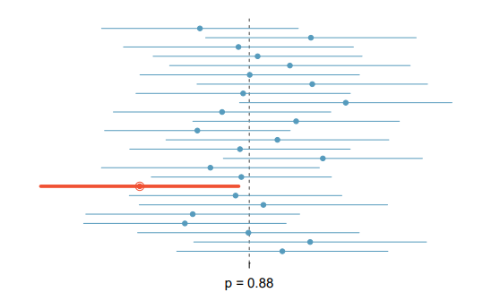
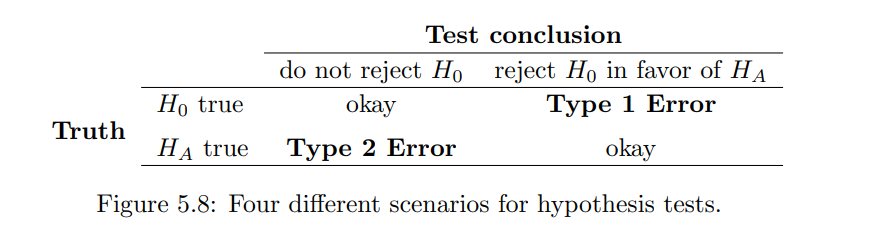
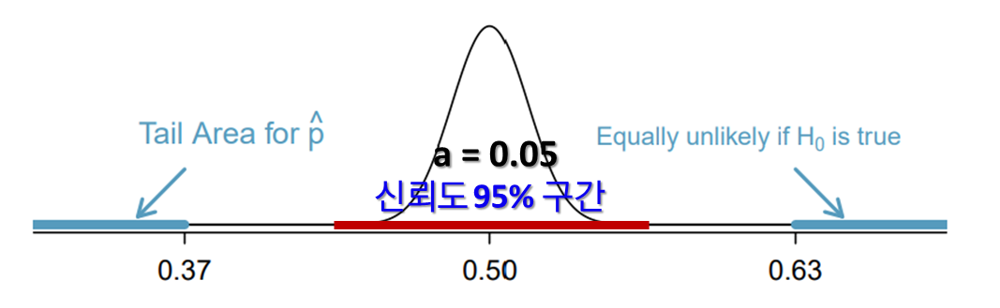

# Foundations for inference

## 5.1 Point estimates and sampling variability

---

### Point estimate

표본이나 모집단에서 표현되는 어떤 위치를 말하는 듯. 표본을 여러 번 뽑을 때면 매번 값이 달라지는 것은 당연하다. 이렇게 매번 뽑은 값들을 point estimate라고 부른다. 물론 우리가 표본을 웬만해선 한 번 이상을 뽑지는 않으니 가장 최고의 point estimate는 $\hat{p}$라고 부를 수 있다.

ex) 지상파 대통령 선거 출구조사 결과 윤석열 48.4% 이재명 47.7%, / jtbc 대통령 선거 출구조사 결과 이재명 48.2% 윤석열 47.9% . 같은 모집단을 두고도 표본을 뽑아도 표본의 평균이나 std가 달라질 수 있음. 그리고 이런 표본들은 정규분포를 따름

### Parameter(↔ Statistic)

모집단을 설명하는 값을 의미한다. / 표본 집단을 설명하는 값을 의미한다.

- p : parameter가 모집단의 특정 요소의 비율을 나타낸다. ex) 전체 인구 중 아메리카노를 좋아하는 사람 비율
- $\hat{p}$ : 구하고자 하는 표본집단의 특정 요소의 비율을 나타낸다. ex) 100명 중 아메리카노를 좋아하는 사람 비율

### Error

표본 조사와 실제 결과의 차이를 error라고 한다.

- Sampling error(=Sampling uncertainty) : 자연적으로 발생할 수 밖에 없음
  같은 방식으로 추출된 샘플과 다른 샘플간의 예측치 차이를 말함. 표본을 뽑다보면 일정하게 뽑기란 불가능하다. 따라서 같은 조건으로 표본집단을 추출하더라도 자연적으로 오차가 발생한다.
- Bias
  인적 실수나 시스템적인 실수로 인해 발생하는 오류가 있다. 설문 대상에게 어떤 식으로 질문하는지에 따라서도 같은내용일지라도 응답자가 다르게 대답할 수 있다는 사실을 염두에 두고 설문을 진행해야한다.

### 5.1.2. Understanding the variability of a point estimate

---

A라는 법안은 상당히 예민한 내용이라 국회에서는 국민 투표로 상정 여부를 판단하기로 합의했다. 국민투표 결과는 해당 법안에 대한 88%의 찬성이었다. 만약 인구 2000명을 무작위로 선정한다면 표본의 찬성비율도 88%를 따라갈까? 단순하게 시뮬레이션으로 진행해보자.

1. 바구니 안에 종이를 넣고 이중 임의로 2000개를 뽑는다고 생각하자. 종이는 찬반 비율이 88:12로 일정하고, 전체 개수가 나라 인구수와 동일하다.
2. 2000개 종이를 일일히 구분해 찬성과 반대 갯수를 세서 비율을 구한다.
3. 이를 10번 반복한다.

### **Sampling distribution**

우리는 인구의 88%가 A라는 법안에 통과했다는 사실을 안다. 표본을 10번 뽑는다면 개별 표본의 찬성 비율이 88%로 일정할까? 추출된 비율은 모평균을 중심으로 편차를 가지고 분포한다.

| 1    | 2    | 3    | 4    | 5    | 6    | 7    | 8    | 9    | 10   |
| ---- | ---- | ---- | ---- | ---- | ---- | ---- | ---- | ---- | ---- |
| 0.88 | 0.87 | 0.90 | 0.85 | 0.93 | 0.89 | 0.87 | 0.87 | 0.88 | 0.83 |

- Center
  Sample의 분포는 모평균을 중심으로 표준분포를 따른다.
- Spread
  표준분포를 따르는 만큼 표준편차가 존재한다.
- Shape
  표본의 평균은 정규분포 곡선을 따른다.

<aside>
💡 **주의
실제로 표본을 추출할 때 Sampling distribution을 관측하지는 않는다. 우리가 표본을 추출할때 실제로 Sampling distribution을 만들 수 있을정도로 많이 뽑지않는다는 말이다. 다만 표본들이 정규분포를 따른다는 사실은 우리가 확보한 point estimate를 이해하는데 도움을 준다.**

</aside>

- Sample의 수가 클수록 $\hat{p}$의 정확도는 p와 가까워진다.

### 5.1.3. Central Limit Theorem(CLT)

---

Sample proportion $\hat{p}$는 표준정규분포를 따른다. 표본 $\hat{p}$에 CLT를 적용하기 위해서는 두가지 조건을 충족시켜야한다.

1.  **Independence :** the observations must be independent
2.  **Success-failure condition :** the sample size must be sufficiently large such that $np \geq 10 \;\;  and \; \;  n(1-p) \geq 10$

**표본평균의 비율($\mu_{\hat{p}}$) = p | 표본오차($SE_{\hat{p}}$) = $\sqrt{\frac{p(1-p)}{n}}$**

**이항분포 평균= np | 표준편차 $\sqrt{np(1-p)}$ — 6장 exercise 참고**

<aside>
💡 **Sample ovservation이 Independent인지 확인하는 방법

1. Observations(관측값)이 Simple random sample에서 추출되었음.
2. Subject(실험 대상)이 Treatment group와 control group에 무작위로 선발되어야 함.
3. Sample이 확률적인 결과에서 비롯됐다면 observation이 independent인지 고민해봐야함.\*\*

</aside>

- simple sampling
  

### 5.1.4. Applying the Central Limit Theorem to a real world setting

---

지금까지는 표본평균을 수많이 뽑은 뒤 Sample distribution을 만들어 평균도 구하고 표준편차를 구했다. 실제로는 이렇게 많이 샘플링을 할 수 없다. 우리가 찾은 평균과 표준편차 공식이 하나의 샘플링에서도 실제로 적용이 될까?

### Substitution approximation(= Plug-in principle)

표본평균의 평균인 p 대신 표본 평균중 하나의 값 $\hat{p}$를 가지고도 표본평균의 평균과 표본 오차를 구할 수 있다. 표본 평균을 곧바로 표본 평균의 평균(=모평균)으로 활용할 수 있다. 표준오차 또한 실제와 다르지만 그 차이가 미세하므로 표준오차로 생각해도 문제 없다.

### 5.1.5. More details regarding the Central Limit Theorem

---

지금까지는 CLT를 위해 충족해야하는 전제조건 2번(Sucess-failure condition)을 충족할 정도로 큰 표본과 p를 활용했다. 이번 장은 왜 Success-failure condition을 충족해야하는지를 설명한다.

### Success failure condition : $np \geq 10 \;\; and \;\; n(1-p) \geq 10$

결론은 success failure condition을 충족하지 못하면 표본은 정규분포를 따르지 않기 때문이다.

두 특성을 skew와 discreteness를 기준으로 비교하면

1. np or n(1-p)가 매우 작으면 분포는 discrete(이산) 형태를 띈다.
2. np or n(1-p)가 10보다 작으면 분포의 치우침(skew)가 확연하게 드러난다.
3. np or n(1-p)가 커질수록 정규분포에 더욱 접근해간다.
4. np or n(1-p)가 매우 커지면 discrete가 없어지고 continuous한 정규분포에 가까워진다.

이번에는 평균과 표준편차를 기준으로 비교하면

1. 두 조건을 충족하면 sample proportion $\hat{p}$과 population proportion p의 bias가 없다.
2. 샘플 수가 커지면 표본오차가 작아진다.
3. 샘플 수가 같다면 p가 0.5일때 표본 오차가 가장 크다. $\sqrt{p(1-p)}$이므로 p(1-p)는 p가 0.5일 때 가장 크다.

<aside>
💡 Sample distribution은 실제로 normal distribution인 건 아니다.  $\hat{p}$는 언제나 discrete이기 때문이다. (물론 통계에서 계산을 할때 웬만해서는 표준분포라 가정하고 문제를 푼다.)

</aside>

### 5.1.6. Extending the framework for other statistics

---

모집단의 parameter를 알기위해서 하나의 표본을 추출하는 방법은 매우매우매우매우 효과적이고 흔히 쓰이는 방법이다.

## Exercise

---

### 1. **평균과 proportion은 다른가?**

평균은 numerical variables에서 사용되고 proportion은 categorical variables에서 사용된다.

### 2. Point estimate의 unertainty를 측정하는 통계 방법은?

Standard error(표준 오차)

### 3. 추출하는 sample이 줄어들면?

Standard error(표준오차)가 증가한다.

## 5.2 Confidence intervals for a proportions

---

모집단과 관련된 parameter를 언급하기 위해서는 하나의 점( a point estimate)를 제시하는 것 보다 범위로서 제시하는게 더욱 설득력있고 효과적이다.

### 5.2.1 Capturing the population parameter

---

표본을 통해 모집단을 추측하는 행위를 강에서 물고기를 잡는 행위로 비유를 들어 설명하겠다. 물고기를 잡기 위한 방법은 여러가지가 있다. 작살로 물고기를 잡는 방법도 그물로 물고기를 잡는 방법도 있다. 두 방법 중 어떤 방법이 효과적일까? 당연히 그물로 잡는게 넓은 범위에서 긁는 방법이므로 훨씬 효과적이다. 표본을 통해서 모집단을 추출하는 것도 이와 마찬가지다. 작살로 잡는 방법은 표본을 통해서 얻은 값으로 모평균을 추측하는 방법이라면 범위를 줘서 그안에 모평균이 포함되도록 하는게 더욱 효과적이고 현실성 있는 방법이 된다.

### 5.2.2. Constructing a 95% confidence interval

---

지금까지 표본의 평균과 표준오차를 구하는 방법에 대해서 배웠다. 이를 활용해 모집단의 평균을 범위로 제시할 수 있다.

Confidence interval = $\hat{p} \;\; \pm \;\; 1.96 \;\; \times \; \sqrt{\frac{p(1-p)}{n}}$

Confidence interval을 해석하는 방법은 Point estimate( $\hat{p}$ )의 범위를 95%로 늘리면 95%의 표본에서 모평균을 발견할 수 있다는 의미이다. 이를 시각적으로 표현하면 다음과 같다.

point estimate를 신뢰도 95% 범위로 준 다음 25개 표본을 뽑으면 빨간색 표본 하나를 제외한 나머지 24개의 표본(약 95%) 내에는 모집단의 비율(p=0.88)이 속해있다.

### 5.2.3. Changing the confidence level

---

95% 신뢰도는 z를 1.96으로, 99% 신뢰도는 z를 2.58로 설정하면 된다.

### **margin of error**

$z\times \sqrt{\frac{p(1-p)}{n}}$를 margin of error라고 부른다.

### 5.2.5. Interpreting confidence intervals

---

Confidence Level을 설정하는 이유 : 표본으로 모집단을 추론하기 위함임.

주의할 사실 : confidence level은 모집단에 관한 사항이므로 표본의 개별적인 관측값이나 다른 표본으로부터 추출된 평균, 표준편차에 대한 정보를 포함하지 않음. 쉽게 말해 같은 모집단으로 부터 추출한 다른 표본에 대한 어떤 내용도 유추할 수 없음.

또한 표본 추출에 관한 테크닉일 뿐 bias에는 해당사항이 없다. bias는 데이터를 수집할 때 data scientist가 주의해야하는 중요한 사항이라는 점도 명심해야한다.

## 5.3 Hypothesis testing for a proportion

---

proportion에 대한 hypothesis testing이므로 categorical attributes에 관한 내용이라는 점을 염두에 둔체로 이해하자.

Hypothesis testing을 수행하는 이유는 data scientist가 기본적으로 가져야 하는 태도에서 기인한다. data scientist는 데이터와 데이터로부터 추출된 정보를 의심하고 검증하려는 마음 가짐을 가져야한다. 그러므로 어떤 주장에 대해서 우선적으로 사실이 아님을 기본 전제로 한 체로 이를 하나하나 조사하고 검증하면서 주장이 실제로 타당한지 여부를 알아가야한다.

### 5.3.1 Hypothesis testing framework

---

Data scientist is to play the role of a skeptic : before we buy into the alternative hypothesis, we need to see strong evidence.

**Null hypothesis($H_0$) = 발생한 사건이 단순히 우연적으로 발생했다는 주장**

The null hypothesis often represents a skeptical position or a perspective of “no difference”.

**Null value = $p_0$**

Null hypothesis가 가지는 값을 Null value라고 한다. class의 membership 수에 따라 확률이 달라진다. 이진 선택이라면 $p_0 =  0.5$가 되고 membership이 3개라면 $p_0 = 0.33$이 되는 식이다.

**Alternative hypothesis($H_A$) = 발생한 사건이 우연적으로 발생한게 아니라는 주장**

Alternative hypothesis represents an alternative claim under consideration and is often represented by a range of possible parameter values.

<aside>
💡 **주의할점**
Hypothesis testing을 통해 $H_0$이 틀리다는 사실을 검증하지 못할지라도 $H_A$가 사실이라는 근거로서 활용될 수는 없다.  $H_A$가 사실이 되기 위해서는 Strong evidence가 필요하다.

</aside>

### 5.3.2. Testing hypotheses using confidence intervals

---

A라는 대학교에 다니는 학생 50명에게 아래의 질문을 하였다.

전세계 기준, 한살짜리 아이가 예방접종을 받은 비율은 어떻게 될까?

a) 20% b) 50% c) 80%

그 결과 정답률이 24%였다. (정답은 C이다.)

24%는 50명의 대학생을 설문조사한 결과이다. 과연 이 데이터가 모든 대학생을 대표할 수 있다고 볼 수 있을까? 표본이 많아지게되면 무작위 확률인 33%(문제를 찍어서 맞출 확률이 1/3라는 의미)로 수렴할 수도 있는거 아닌가? 아니면 모집단의 정답률은 어떠한 추세성을 가지질 수도 있지 않을까? 가령 해당 질문이 사실 너무 유명하다보니 해당 국가의 많은 학생들이 알고 있을 수 있지만, 우연히 표본으로 추출된 학생들 상당수가 교환 학생이거나 외국인 학생이다보니 이러한 결과가 나올 수 도 있다. 또는 학생들이 세상을 부정적으로 보다보니 수치를 매우 부정적으로 생각해 실제 정답률은 33%보다 한참 아래일 수 도 있다.

그렇다면 50명을 통해 알게된 24%라는 결과는 우연에 의해 발생한 것인지 아니면 실제로 어떠한 추세를 보여주는 것인지를 검증할 필요가 있다. 실험결과 24%는 우연에 의해 발생가능하다는 주장인 $H_0$를 입증한다면 해당 결과를 사용할 수 없게 되는 것이고 만약 $H_0$이 아니라는 주장이 입증된다면 24%는 실제로 전체학생들을 대표할 수 있는 값으로 활용할 수 있게 된다.

우리는 50명의 표본을 통해 알게된 표본평균으로 모집단의 평균을 추측할 수 있다. 표본평균에 confidene interval을 적용하면 (0.122,0.358)이다. 이는 0.122-0.358사이에 평균이 있을 확률이 95%라는 의미이므로 우연에 의해 발생하는 0.333이 포함된 범위다. 따라서 $H_0$이 틀렸다고 주장할 수 없다. 다만 strong evidence가 없으므로 $H_A$가 틀렸다고도 주장할 수 없다.

<aside>
💡 **Double Negatives can sometimes be used in statistics

While we failed to reject $H_0$, that does not necessarily mean the null hypothesis is true.\*\*

</aside>

### Significant evidence

이와 비슷한 실험을 질문만 다르게하여 재실험하였다.

2022년 현재 전세계 0~15세 인구는 20억명이다. 그렇다면 2100년의 0~15세 인구는 얼마일까?

1. 40억명, b. 30억명, c. 20억명

실험대상은 224명이고 정답을 맞춘 인원은 34명으로 14.9%를 차지한다.

표본평균의 confidence interval을 계산하면 (0.103, 0.195)이된다. 앞선 실험과 다르게 0.333이 confidence interval에 포함되지 않으므로, $H_0$이 틀렸다는 주장에 대한 Strong evidence를 찾았다.

### 5.3.3 Decision errors

---

$**\alpha$를 어떻게 설정할지 고민하는 단계\*\*

Hypothesis testing은 confidence interval에 기반한 방법이므로 오류가 발생한다. 때로는 오류가 발생하여 드는 비용이 막대할 수 있으므로 발생가능한 오차를 이해하고 이를 감당할 수 있는 선에서 통제한다면 hypothesis testing의 결점을 보완하여 효과적으로 사용할 수 있게된다.

- **Type 1 Error :** $H_0$이 사실이지만 $H_0$이 틀렸다고 주장하는 경우
  ex) 무죄인데 유죄로 선고가 내려진 경우
- **Type 2 Error :** $H_0$이 사실이아니지만 $H_0$이 틀리지 않았다고 주장하는 경우

ex) 유죄인데 무죄로 선고가 내려진 경우

### significance level

Hypothesis testing은 null hypothesis를 반려하거나 반려하지 못하는 경우로 구분된다. Null hypothesis를 반박하기 위해서는 strong evidence를 필수적으로 가져야한다. Strong evidence는 Null hypothesis를 반려하지 말아야 하는 상황에서 반려하는 경우가 5% 미만임을 보여줘야 한다. 즉 type 1 error가 0.05 이하임을 입증하는 근거여야만 $H_0$을 반려할 수 있다.

Significance level은 $H_0$을 잘못 반려하는 비율을 의미한다. Significance level 기호는 $\alpha$로 사용한다. 전통적으로 95% 신뢰도를 기준으로 hypothesis testing을 하므로 $\alpha = 0.05$를 자주 사용한다.

### 5.3.4. Formal testing using p-values

---

**P-value**

P-value는 null hypothesis를 반박하고 alternative hypothesis를 지지하는 근거의 신뢰성(Strength)를 수치화 하는 방법이다. 통계적인 hypothesis testing은 confidence interval에 기반한 의사결정보다는 p-valu를 주로 사용한다. confidence interval은 $H_0$이 반려되는지 또는 반려 될 수 없는지를 검증했다면, P-value는 null hypothesis가 맞다는 가정을 사실로 하여 $H_0$의 반려여부를 판단한다.

$**H_0$ Sample의 Normal distribution여부 확인\*\*

1000명을 대상으로 에너지 생산을 위해 석탄을 사용하는 것을 찬성하는지 또는 반대하는지 여부를 조사했다. 조사인원 중 37%의 인원만이 찬성했다. 37% 비율은 우연에 의한 값인가 실제로 모집단을 대표하는가? P-value로 구해보자.

P-value를 구하기 위해서는 $H_0$이 모집단을 대표한다고 가정한다. $H_0$도 표본평균이므로 Normal distribution 여부를 확인한다.

- Independence : random sampling이므로 independence
- Sucess-failure : np = 500, n(1-p) = 500
- $\hat{p}$= 0.5, $SE_{\hat{p}}$ = 0.016

**Null distribution**

Null distribution에서 $\hat{p}$의 위치. **P-value는 관측된 $\hat{p}$의 확률을 의미한다.**

- P-value 계산

$Z \; \; = \; \; \frac{0.37 \; - \; 0.5}{0.016} \;= \; -8.125 = 2.2*10^{-16} * 2$

Null hypothesis가 맞다는 가정하에 0.37이 발생할 확률은 $4.4*10^{-16}$이다. 랜덤으로 0.37이 나올 확률은 극히 적다는 사실을 알 수 있다.

---

<aside>
💡 **P-value < $\alpha$ 인 경우 Null hypothesis가 기각된다는 사실을 의미한다. the data provide strong evidence supporting the alternative hypothesis  //// P-value = tail * 2

P-value > $\alpha$ 인 경우 Null hypothesis를 기각할 수 없다는 말이다. 하지만 Null hypothesis이 사실이라는 의미를 내포하진 않는다. 주어진 데이터를 통해서는 Null Hypothesis가 틀렸음을 확신하지 못한다는 말과 더 가깝다.\*\*

</aside>

---

### 5.3.5 Choosing a significance level

---

Type 1 Error가 발생할때마다 기회비용이 많이 든다면 $\alpha$를 낮게 설정하여 Type 1 Error를 줄여줄 수 있다. $\alpha$를 낮게 설정할수록 null hypothesis를 부정하는데 더 강력한 strong evidence를 요구한다. 반대로 type 2 Error를 줄이기 위해서는 $\alpha$를 높게 설정하여 확보한 evidence가 강력하지 않더라도 $H_0$를 기각할 수 있도록 할 수 있다.

### 5.3.6. Statistical significance versus practical significance

---

표본의 수를 증가시킬수록 statistical significance가 증가하여 미세한 차이를 찾아낼 수 있다. 하지만 이렇게 찾아낸 차이가 실제로 의미가 없을 가능성이 높다. 표본 수를 늘리기 위해서는 그만큼 비용을 감당해야하므로 data scientist의 역할 중 하나는 표본의 크기를 얼마만큼 설정해야하는지도 포함한다.

### Exercise

---

5.17. Hypothesis testing은 모집단을 대상으로 시행해야한다. 표본 집단을 대상으로는 할 수 없다.

5.31. **P-value > $\alpha$ 인 경우 Null hypothesis를 기각할 수 없다는 말이다. 하지만 이 말에는 Null hypothesis가 사실이라는 의미를 내포하진 않는다. 주어진 데이터를 통해서는 Null Hypothesis가 틀렸음을 확신하지 못한다는 말과 더 가깝다.**

### 내용이해

---

정규분포를 확인하는 이유는 표본을 추출할 때 나오는 값들이 정규분포를 따르기 때문이다. 모평균이 0.5라도 표본으로 추출한 표본평균의 값은 범위로 나타난다. 어느 경우에는 0.55가 될수도 있고 0.43이 될수도 있다. 하지만 표본 평균을 많이 찾은다음 표본 평균들의 평균을 찾으면 0.5로 수렴된다. 그리고 이렇게 추출된 평균들을 차트로 그리면 정규분포로 표현된다.

이러한 패턴을 바탕으로 우리가 모집단에서 임의로 추출한 표본평균 하나를 계산해보자. 우리가 길가에서 주사위를 발견했다느 가정을 해보자. 주사위 외형을 보니 길가에 버려진지 오래되 보였고 모든 모서리가 닳아 정육면체의 모습과는 다소 거리가 멀었다.. 평소에 확률에 관심이 많던 나는 이 주사위가 재역할을 할 수 있을지 관심이 생겼다. 만약 재역할을 한다면 모든 빈도수가 1/6의 근사치로 발생할테고 재역할을 하지 못한다면 개별 값의 빈도수가 차이날테니 말이다. 평소에 1을 좋아하는 나는 주사위를 던져서 1이 나올 확률이 1/6에 근접할지 주사위를 120번 던졌다. 그 결과 1이 나온 경우가 35번이었다.

35번.. 생각보다 빈도수가 높다. 하지만 이 값이 확률적으로 충분히 나올 수 있는 값일 수 도 있다. 1/6확률이므로 주사위를 120번 던지는 행위를 무수히 많이 한다면 평균 20번에 수렴하겠지만 18번, 23번 등 다양한 경우가 발생하는게 당연하기 때문이다. 어쩌면 35번 또한 생각보다 빈도수가 높을수도 있다.

35번이 과연 확률적으로 나올법한 일인지 검증이 필요하다. 이를 검증하기 위해서는 기본적으로 모든 주사위가 1/6 확률이 나온다는 가정을 해야한다. 내가 찾고 싶은건 주사위가 본연의 기능을 갖고 있는지 검증하기 위함이고, 우리가 용납할 수 있는 범위 내에 35번이 해당되는지 확인하기 위함이기 때문이다.

과연 35번은 확률적으로 용납가능한 일일까? 다시말하면 주사위가 문제 없는 것일까? 먼저 표본이 정규분포를 따르는지 확인해야한다. 1. independence인가? yes. 2. sucess-failure condtion이 10 이상인가? yes.

모평균 : 1/6 ⇒ 0.1667 표준에러 : 0.034

표본평균 : 35/120 ⇒ 0.291

Z = p-value = $\frac{0.291-0.1667}{0.034}$ = 3.65 = 1 - 99.974 = 0.00026

35번 발생할 경우는 0.026%.. 매우 낮다. $\alpha = 0.05$를 기준으로 했을 때 p-value는 $\alpha$보다 낮으므로 35번이 확률적으로 발생가능한 범위에 속해있다.는 주장은 받아드릴 수 없다. 따라서 주사위는 정상작동을 하지 못한다라고 결론을 내릴 수 있다.(엄밀히 말해서 그런 결론을 내릴 수 있는 강력한 근거가 있다는 말이 정확하다.)
