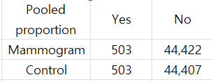
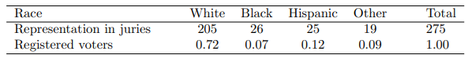
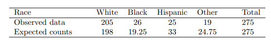
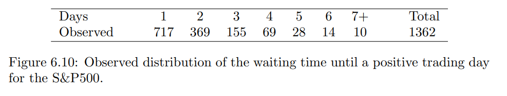
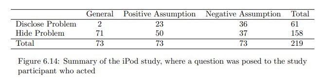
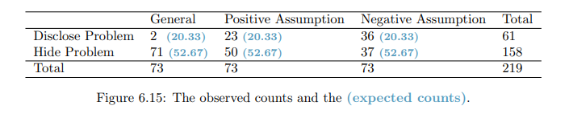

# Inference for categorical data

## 6.2 Difference of two proportions

---

two proportion의 차이를 구하는 이유는 두 대상을 비교하기 위함이다. 어떤 경우에 대상끼리 비교할 필요가 있는지 한번 공부해보자.

실험을 할 때 treatment group과 control group으로 나눠서 수행한다. treatment group과 control group의 차이는 실제로 treatment의 효과 또는 부작용이 있는지와 어떠한 영향도 없는지(treatment group이나 control group이나 차이없다)를 알기 위해 활용된다.

실제로 차이가 없는 경우에도 표본 추출을 통해 두 대상의 차이를 구분한다면 약간의 차이가 발생할 수 있다. 표본을 수없이 뽑은다음 표본의 추세를 보면 0에 근접하겠지만 표본이 무작위로 추출되는 만큼 차이가 -0.02 ~ 0.02 인 표본도 충분히 많으리라 예상된다.

두 대상의 차이 또한 hypothesis test로 활용해 확률적으로 용납 가능한 범위에 속하는지 아니면 실제로 어떤 추세(treatment가 효과가 있거나 부작용이 있다.)를 나타내는 것인지를 확인 할 수 있다.

### 6.2.1, 6.2.2 | Confidence intervals for $p_1 - p_2$ & normal distribution 조건

---

두 대상의 차이가 정규분포를 따른다고 판단하기 위해서는 대상이 독립적으로 추출됐는지, success-failure condition에 충족되는지를 확인해야 한다. 이때 개별 대상에 대한 검증과 두 대상간 차이에 대해서 검증이 필요하다.

두 조건이 충족된다면 다음과 같은 공식이 성립된다.

$SE = \sqrt {\frac{p_1(1-p_1)}{n_1} + \frac{p_2(1-p_2)}{n_2}}$

Confidence intervals ⇒ $\hat{p_1} - \hat{p_2} \; = z \;\times \; \sqrt {\frac{p_1(1-p_1)}{n_1} + \frac{p_2(1-p_2)}{n_2}}$

### 6.2.3 Hypothesis tests for the difference of two proportions

---

difference에 대한 Hypothesis test는 두 대상이 차이가 없음을($p_1 = p_2 \;\; or \;\; p_1-p_2= 0)$을 기본 가정으로 설정하 대상이 차이가 있음을 반박 가정으로 설정한다.

$H_0 =$ 대상의 차이는 없다. 즉 효과의 차이는 없다. **pooled proportions**이라 불림.

$Mean = 0 \;\;\;|\;\;\;SE=\sqrt {\frac{p_1(1-p_1)}{n_1} + \frac{p_1(1-p_1)}{n_1}}$

### Pooled proportion 만들기

예시용 Contingency table

**pooled table(두 대상이 확률적으로 같다는 가정으로 만들어진 테이블)**

$\frac{\# \;of patients\;who\;are\;included \;in\;yes}{\# \;of\; patients\;in\;the\;entire\; study}$=$\frac{500+505}{500+44,425+505+44,405} = 0.0112$

**P-value 구하기**

$\hat{p}_{mgm} - \hat{p}_{ctrl} = -0.00012  \;\;\; | \;\;\; SE = 0.00070$

$Z = \frac{point\;estimate\;-\;null\; value}{SE} = \frac{-0.00012-0}{0.00070} = -0.17$

p-value = 0.8650 ⇒ $p_1 = p_2$라는 주장을 기각할 수 없음.($p_1 = p_2$라는 의미는 아님)

<aside>
💡 p-value는 2* Zscore

</aside>

Keep in mind when reviewing any medical study :

- We do not accpet the null hypothesis, which means we don’t have sufficient evidence to conclude that mammograms reduce or increase breast cancer deaths.
- **mammogram이 암 발생과 관련이 있다는 주장에 대한 충분한 근거가 없다는 의미로 해석해야한다.**

### 6.2.5. Examining the standard error formular

---

어째서 $SE_{\hat{p_1} - \hat{p_2}} = \sqrt {\frac{p_1(1-p_1)}{n_1} + \frac{p_2(1-p_2)}{n_2}}$ 공식이 성립되는지 이해하기

**분산 계산하기**

$\sigma^2(ax+by) = a^2\sigma(x) + b^2\sigma(y) \;=SE^2_{\hat{p_1} - \hat{p_2}} = SE^2_{\hat{p_1}} + SE^2_{\hat{p_2}}$

**표준편차 계산하기**

$SE_{\hat{p_1} - \hat{p_2}} = \sqrt{SE_{\hat{p_1}} + SE_{\hat{p_2}}}$

### 6.3 Testing for goodness of fit using chi-square

---

**Goodness of fit**

a statistical hypothesis test used to see how closely observed data mirrors expected data.

Chi-square은 unique value들의 비율을 예측하는 방법이다.

표본추출한 비율과 모집단의 비율을 보여주는 표

chi-square을 써야하는 경우 : 표본으로 추출한 비율이 random 추출 했을 때 용납 가능한 범위 인지 알고 싶을때 또는 어떤 경향이 있음을 확인하고 싶을때(representative라고 표현하는 듯)

- the juries were not representative : 배심원이 뽑힌 비율이 모집단의 비율을 대표하지 못한다.

### 6.3.1 Creating a test statistic for one-way tables

---

One-way table이라 함은 하나의 column내 group(unique variable)의 비율을 보여주는 표를 말한다.

**chi-square을 사용하기 위해서는 기본적으로 모집단의 비율을 알고 있어야한다.**

모집단의 비율을 바탕으로 275명을 구분 짓는다면 Expected counts와 같이 나온다. 단순히 비율에 맞게 값을 넣었기에 소숫점으로 표현된다.

**hyppthesis 기본 세팅**

$H_0 :$ The jurors are a random sample. There is no racial bias in juror selection.

$H_A :$ The jurors are not randomly sampled. There is racial bias in juror selection.

### 6.3.2. The chi-square test statistic

---

$Z = \frac{point\;estimate - null\; value}{SE \; of \; null}$

P-value를 구하기 위해서 Zscore를 사용하는 것처럼 Group별로 Zscore을 구한 뒤 더한다.

$Z_{white} = \frac{205-198}{\sqrt{198}}$ | $Z_{black} = \frac{26-19.25}{\sqrt{19.25}}$ | $Z_{hispanic} = \frac{25-33}{\sqrt{33}}$ | $Z_{other} = \frac{19-24.75}{\sqrt{24.75}}$

다만 여러개의 Z-score을 구하는 만큼 정규분포 외에 chi-square 분포를 바탕으로 p-value를 계산한다.

**Chi-square 공식**

null hypothesis가 맞다고 가정할때, Chi-distribution을 따른다. Chi-distribution을 바탕으로 p-value를 구해서 hypotheses를 검증할 수 있다.

$\chi^2 = Z^2_1 \;+ \;Z^2_2 \;+\; Z^2_3 \;+\; Z^2_4 \cdots \;+\;  Z^2_n$

**Square을 하는 이유**

- 음수를 양수로 만든다.
- unusual 한 경우를 강조하고 usual 한 경우는 덜 강조한다.

### 6.3.3 The chi-square distribution and finding areas

---

Chi-square의 분포는 항상 양수이고 right skewed의 모양을 띈다. chi-square 분포는 하나의 parameter로 분포가 결정된다. degree of freedom(df)는 분포의 모양, 중앙값, 데이터 분포에 모두 영향을 미치는 유일한 요소이다.

chi-square 분포의 평균은 degree of freedom과 같다. 그리고 degree of freedom이 커질수록 분포는 점점 커진다.

**df가 커짐에 따라 변하는 사항**

- the distribution becomes more symmetric
- the center moves to the right
- the variability inflates

### 6.3.4. Finding a p-value for a chi-square distribution

---

$\chi^2$가 크다는 말은 $H_A$가 맞다는 근거를 제공하는 것과 의미가 같다.

$**\chi^2$가 chi-square 분포를 따르기 위한 조건\*\*

- $\chi^2$에 필요한 최소한의 Sample size는 5개이다. 개별 bins의 개수가 5개 이상이 되어야 한다.
- null hypothesis가 참이다.

**degree of freemdom 계산**

null hypothesis가 참이라는 가정하에 $\chi^2$은 k-1 degrees of freedom의 분포를 따른다. 이때 k는 원소의 개수(the number of bins)이다.

<aside>
💡 **bins가 2개인 경우에는 one-proportion methods를 사용하자**

</aside>

### 6.3.5 Evaluating goodness of fit for a distriution

---

지난 날의 가격이 당일 가격과 상관성이 있는지 검증해보자. 가격이 연속으로 내려갔다면 오늘은 오를거라는 믿음이 실제로 유의미한 예측인지 확인하는 방법이다. 위의 표는 S&P 500의 10일간 주가 변화를 나타낸다. 여기서 days to up이라 함은 상승하기 까지 걸린 날을 의미한다.

< days to up이라는 아이디어를 고안한게 대단하다.

Hypothesis test를 활용해 지난 날의 가격이 당일 가격에 영향을 주는지 검증해보자. 지난날의 가격과 오늘 가격이 연관성이 없다면 단순히 up and down의 발생 비율에 맞게 분포가 발생한다. 즉 주가 변동은 geometric distribution을 따른다. 단순히 이항이고

1362개의 days to up을 조사했다. 약 2500~3000일 정도 데이터를 활용해 계산한 것 같다. unique value를 의미하는 days는 7일 이상 조사될 수 있으나 chi-square을 따르려면 개별 값이 5이상이어야 하므로 7일 이상은 하나의 value로 포함했다.

up and down만 놓고 보면 instance의 54.5%가 up이었다. 54.5%를 알았으니 geometric distribution을 구할 수 있다.

days to up의 bins는 7개이므로 degree of freedom은 6이다. $\chi^2$를 구하면 ... 4.61이다.

df = 6인 chi-square 분포에서 4.61은 0.5951이다. tail area는 p-value이므로 0.05보다 크다. 따라서 과거의 up and down이 당일 가격에 영향을 준다는 결정적인 증거는 없다.

### 용어

---

**tail-area = p-value**

**cutoff = z-score**

## 6.4 Testing for independence in two-way tables

---

**6.4에서는 두 개의 categorical variable 간 상관관계를 확인하기 위한 방법을 배운다.**

제품에 하자있는 Ipod 중고 거래 시 어떤 질문이 판매자로 하여금 제품의 하자를 말하게 할지 알아보는 실험을 수행했다. 219명을 대상으로 수행했고 질문의 종류는 세 가지이며 질문에 따라 하자를 말하는지, 아니면 숨기는지 결과를 종합했다.

이번 실험 역시 표본 추출이 단지 확률적인 분포를 따르는 결과 아닌지 의심할 필요가 있다. 질문에 상관없이 disclose와 hide 비율은 이미 확률적으로 정해져있다는 생각이다. 세 종류의 질문과 상관 없이 표와 같은 결과가 발생할 수도 있기 때문이다.

여기서 실험자가 알고싶은 사실은 구매자의 질문이 판매자의 정직함과 관련이 있는지를 수행하는 실험이다.

**Differences of one-way tables VS two-way tables**

- one-way table은 하나의 variable안에서의 비율에 관심있다. 추출한 표본( 인종별 배심원단 구성)이 모집단( 인종별 비율)을 따르는지, 아니면 어떤 의도가 내포되어 있는지를 찾을 수 있다.
- **two-way table은 두 변수 간 관련성을 찾기 위해서 사용한다. ( are these variables related in any way? = are they dependent? )**

### Expected counts in two-way tables

---

두개의 variable이 서로 관련성이 없다면 구매자의 질문에 상관없이 판매자의 정직함이 일정한 비율로 발생해야한다. 파란색 내용은 관련성이 없다는 가정하에 비율 상 발생해야하는 횟수를 나타낸다.

여기서 관심있는 내용은 검은색으로 표시된 실제 횟수가 확률적으로 발생할 수 있다고 생각하는 범위 내에 속하는지 여부이다.

**P-value 계산하기**

- $\chi^2$을 구하는 방법은 one-way table과 같다. 모든 값에 대해서 Zscore을 구한 뒤 제곱하여 더하면 된다.
- df를 구하는 방법은 (number of rows -1) _ (number of columns - 1)이다. 예시의 df는 (3-1)_(2-1) = 2

df = 2 그래프에서 tail-cut = 40.13은 매우 낮은 tail-area를 가진다.

### Exercise

---

6.43. 200명 대학생 중 담배를 피는 사람이 40명이다.

- n = 200 p= 1/5 니까 $N(40, \sqrt{32})$을 따르겠지. 표본을 200개 추출하면 평균 40명이 담배를 피고 $\pm$ 11명의 오차가 발생하겠네
- 이를 확률로 표현하기 위해 n을 다시 나누면 1/5 $\pm$ 5.5 ⇒ 14.5% ~ 25.5%가 되겠다.

Ch4~6 사이 헷갈리는 내용 정리

- 확률은 categorical variable이다. 키, 몸무게 같은 numerical variable은 범위로 나눠서 categorical로 만든 뒤 확률을 써야한다.
- 확률은 모집단 또는 표본 집단의 비율이다. 우리는 모집단의 비율을 알기 위해서 표본의 비율과 표본오차(표본의 비율이 발생하는 범위를 표현)를 사용한다.
- 모집단의 비율을 확률이라는 단어로 쓰기 위해서는 무작위 추출이 필수적이다. 무작위 추출이 아니라면 비율을 확률이라 말할 수 없다.
- 비율은 categorical variable에서 사용하고 평균은 numerical variable에서 사용한다. 모집단의 표준편차는 numerical variable에서만 존재한다. categorical variable에는 모집단의 표준편차가 존재하지 않는다. 표준편차는 말그대로 모집단이 어떻게 분포되어 있는지를 알 수 있게 하는데 categorical variable은
- 표본의 표준편차는 모집단의 비율 또는 평균을 구하기 위한 용도로 사용된다. 정해진 수의 표본을 수없이 뽑다보면 그 값들이 정규 분포를 따른다. 모집단의 평균이나 비율은 하나로 딱 정해져 있지만 무작위로 변수를 추출하기 때문에 어떠한 표본은 모집단을 완전히 반영하지 못하고, 어떠한 표본은 모집단을 완전히 반영하게 된다. 그러나 이를 종합해보면 결국 모집단의 평균 근처로 값이 모이게 되고 추출한 표본의 개수가 많아질수록 그 오차는 점점 작아진다.
- 쉽게 생각해서 표본의 표준편차는 모평균을 구하기 위함이지 모평균의 표준편차와는 아무런 관련성이 없다.
- ch3,4에서 배운 distribution들은 모두 확률에 기반한다. numerical의 경우 categorical로 변경하여 야 한다. 키, 몸무게 경우 bins를 만들어서 frequency를 구해야한다. frequency가 곧 비율이기 때문이다.
- Ch4는 표본을 구하는 행위와는 전혀 관련이 없다. 이미 모비율을 알고 있기에 이를 바탕으로 특정 조건의 확률을 구하는데 활용된다.
  ex)대통령 선거 결과는 모집단의 비율이다. 모집단의 비율을 알고 있기에 우리는 새로운 실험을 할 수 있다. 100명의 사람들에게 물어볼 때 30명이 심상정을 지지할 확률은? 심상정의 지지율이 1%이니까 $100C3*(0.01)^{30} * (0.99)^{70}$확률이 된다.
- 이항분포는 모집단의 확률을 알고 있을때 시행한 횟수 대비 성공한 비율을 찾기 위해서 활용한다. 주사위는 개별 값들의 발생 확률이 1/6 이다. 200번 주사위를 던졌을때 1이 1~200번 사이에 나올 확률을 계산할 때 쓴다.
  ex) 200번 던졌을때 1이 50번 나올 확률은?
- 1이 한번만 나오거나 200이 한번만 나오는 경우는 매우 드물기 때문에 아마 200번 던지는 행위를 수십만번 해야 한 번정도 발생할 법하다.
- CLT를 기준으로 다른 distribution의 평균이나 표준편차를 구하는 공식이 만들어진듯 하다. CLT에 n을 곱하면 binomial이 되기 때문이다. 베르누이는 평균에만 n을 곱했다.
