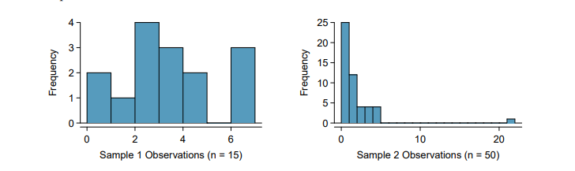
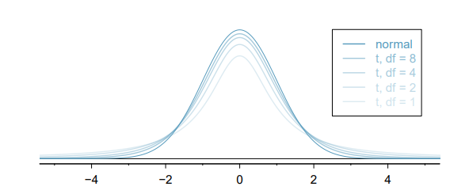
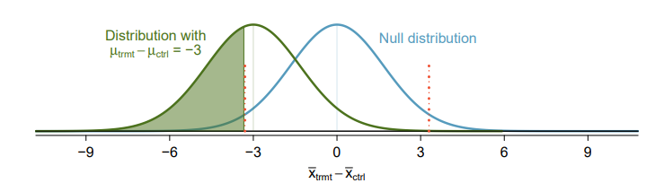
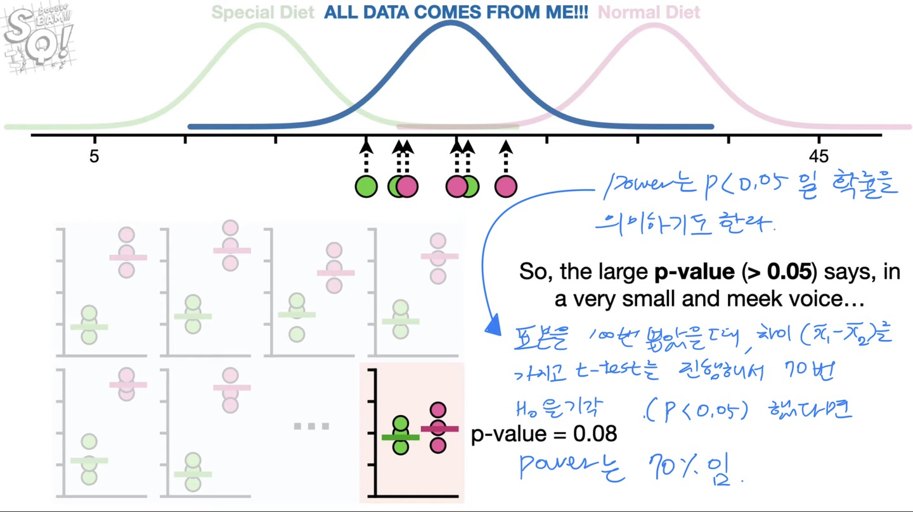
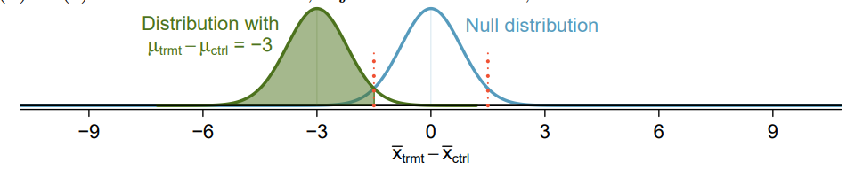
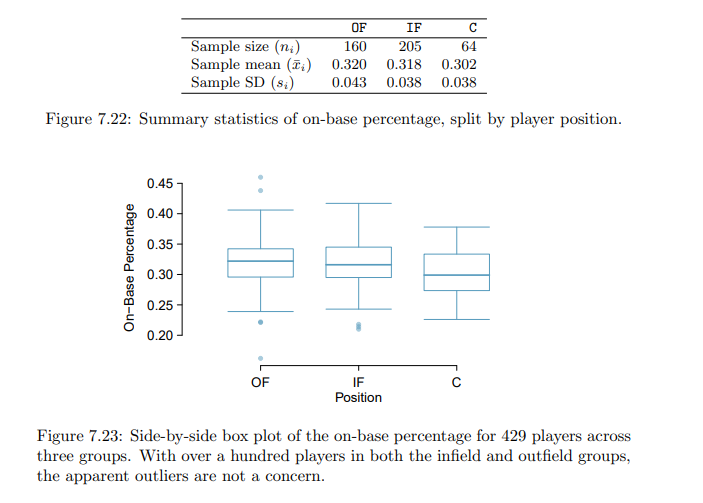

# Inference for numerical data

## 7.1 One-sample means with the t-distribution

---

### Normal distribution 충족 조건

- Independence : 사건은 독립
- success-failure condition : np > 10, n(1-p) > 1

### t-distribution

책에서는 t-distribution을 sample mean에 한해서는 normal distribution보다 효과적이라고 설명하고 있다. 어째서일까.?? 이유가 어찌됐건 t-distribution으로도 confidence interval과 hypothesis testing을 수행할 수 있다.

### 7.1.1 The sampling distribution of $\bar{x}$

Independence와 normality 조건을 충족한다면 해당 sample은 Normal distribution을 따른다

$Mean = \mu \:\:|\:\: SE = \frac{\sigma}{\sqrt{n}}$

- Standard Error는 평균의 오차를 말하는거라 생각하고 있는데 맞나?
  맞다. 처음에는 SE가 모집단의 std를 추론하는 용도로 사용되는가 싶었는데, SE 공식에서 모집단의 $\sigma$를 사용하는걸 보니 표본으로 평균을 추론하는 데 사용하는게 맞다.

### 7.1.2 Evaluating the two conditions required for modeling $\bar{x}$

Proportion에 success-failure condition 조건이 필요하다면 mean에는 Normality가 필요하다.

- Independence
  Random Process가 맞다면 ok
- Normality
  Success-failure condition처럼 정규 분포를 따르기 위해서 필요한 N 개수를 찾는다.
  $N < 30$ : N이 30개보다 작고 clear한 outliers가 없다면 Independence와 Normality를 따르는 distribution에서 확보한 data라고 가정한다. 음.. 정확히 뭔말인지 모르겠다.
  $N \ge 30$ : N이 최소 30개 이상이고 particularly extreme outliers가 없다면 sampling distribution을 normal distribution이라 가정한다.
  - outlier 찾기
    N이 15인 표본의 histogram은 Outlier가 보이지 않는다. Normality가 충족된다.
    N이 50인 표본의 histrogram은 명백한 Outlier가 보인다. Normality가 충족되지 않는다.
    _Outlier는 2.58$\sigma$(99%) 밖에 있는 값이라 생각하자_
    

### 7.1.3 Introducing the t-distribution

**t-distribution 사용 목적**

Sample을 가지고 평균을 추론할 때엔 SE에 들어갈 모집단의 $\sigma$가 필요하다. 우리가 모집단의 $\sigma$를 알기는 어렵다. 그래서 sample proportion에서 사용한 방식과 마찬가지로 표본의 표준편차인 $s$를 모집단의 $\sigma$ 대신 사용한다.

                                                           $SE = \frac{\sigma}{\sqrt{n}} \approx \frac{s}{\sqrt{n}}$

다만 이 방법은 N이 무수히 많아 표준편차의 차이가 그다지 영향이 없을 때 $\sigma$와 $s$의 크기가 유사하다고 판단될때만 효과가 있다. 그렇지 않은 경우 이러한 방법은 큰 오류를 발생시킨다.

이러한 오류를 보완하고자 t-distribution을 활용한다. normal distribution처럼 bell 모양이지만 양쪽 끝의 모양이 더 두껍다. 양쪽이 두꺼운 모양을 띔으로서 $s$를 $\sigma$로 대체함에 따라 발생할 수 있는 오류를 줄일 수 있게 된다.

Normal distribution은 평균과 표준편차를 활용한다면 t-distribution은 degree of freedom(df)를 가지고 distribution을 구분한다 df = n-1이고 n이 커질수록 normal distribution에 가까워진다. n이 30 근처거나 이보다 많을 경우 사실상 normal distribution과 차이가 없다.

t- distribution은 $\sigma$와 $s$의 오류를 보완해주기에 numerical data를 분석할 때 큰 도움이 된다.

### 7.1.4 One sample t-confidence intervals

분포를 t-distribution으로 사용한다는 것 외에는 confidence interval을 구하는 방법에는 차이가 없다.

$\bar{x} \;\pm \; t\times \frac{s}{\sqrt{n}}$

### 7.1.5 One sample t-tests

Hypothesis test도 다를 것 없다. $H_0$과 $H_A$를 세우고 이를 검증하면 된다. p-value를 찾기 위해 z-score 대신 t-score을 사용한다.

## Exercise

---

N이 30이상이면 그냥 Normal distribution을 사용하자.

## 7.2. Paired data - 연관성 있는 대상 비교에 사용

---

### 7.2.1 Paired observations

표에 있는 bookstore과 amazon column과 같이 두 개의 column이 연관성이 있을 때 paired data라고 한다. paired data를 분석할 때에는 두 값의 차이를 가지고 분석을 진행한다.

**Condtion check**

- Independence

임의 추출이라 가정

- Normality

outlier 처럼 보이는 value가 존재한다. 평균의 99% 밖에 있는지 확인해보니 그렇지 않았다.

**Hypothesis test**

연관성 있는 column의 차이를 계산하는 이유는 대상간 차이가 오차로 허용되는 범위인지 아니면 어떤 추세성을 띄고 있는지 확인하기 위함이다.

### Exercise

7.15 Air Quality of 25 capital in 2013 and again in 2014 : paired data

7.17.

a) 학기 시작 테스트와 학기 종료 테스트 점수 비교 : not paired → 흠....

답 : 학생 개인별로 성적 차이를 비교하는 것이므로 paired data가 맞음.

b) 랜덤 추출된 남녀의 연봉 비교 : paired → 남녀의 연봉차이가 허용 가능한 범위 인지 확인

답 : 랜덤 추출 됐기 때문에 남자와 여자간 관련성이 없음 따라서 not paired data임

c) 비타민 복용 전과 2년간 복용 후 동맥 두께 비교 : paired → 동맥 두께의 차이가 허용 가능한 범위인지 확인

같은 실험 대상군의 동맥 두께를 비교하므로 paired data임.

d) 식이요법 사용 전과 후의 몸무게 변화 : paired → 몸무게 변화의 차이가 허용 가능한 범위인지 확인

같은 실험 대상군의 몸무게 변화를 비교하므로 paired data임

7.19 헷갈리면 7.19 풀고 다시 개념을 잡자.

## 7.3 Difference of two means - 연관성 없는 대상 비교에 사용

---

데이터가 pair이 아닐때 개별 attribute의 평균을 가지고 비교한다. $\bar{x_1}$과 $\bar{x_2}$가 서로 independence여야지만 사용할 수 있음.

**평균을 가지고 attribute를 비교하는 경우**

- 줄기 세포가 심장의 기능을 강화시켜주는지 검증하기
- 담배가 임산부에게 미치는 영향 검증하기
- 학급별로 같은 시험에 대한 점수 편차가 통계적으로 의미가 있는지 검증하기

### 7.3.1 Confidence interval for a difference means

**t-distribution 사용 조건**

- Independence : 개별 attribute가 independence를 유지하는지, 두 대상이 independence를 유지하는지 체크 해야함.
- Normality : 개별 attribute를 살펴보고 outlier가 없는지 확인해야한다.

$Mean \;=\; \bar{x_1} - \bar{x_2} \;\;\; | \;\;\; SE \;=\;\sqrt{\frac{s^2_1}{n1} + \frac{s^2_2}{n2} }$

- df 계산은 복잡하니 R이나 python을 사용하자.

### 7.3.2 Hypothesis tests for the difference of two means

**Hypothesis testing 기본 가정**

$H_0 :$ $\bar{x_1} - \bar{x_2}  = 0$ 두 대상의 차이는 없다.

### 7.3.3 Case Study : two versions of a course exam

Hypothesis testing 방법은 다르지 않다.

### 7.3.4 Pooled standard deviation estimate

proportion sampling에서 두 대상을 비교할 때 pooled std($p_1 = p_2$)을 사용했다. 다만 mean sampling에서는 pooled std를 주의해서 사용해야한다. 결론적으로 말하면 굳이 쓸필요 없다.

## 7.4 Power calculations for a difference of means

---

power calculation은 $H_0$를 reject 하기 위해 필요한 sample 수를 구하는 방법이다. 우리가 effect size, $\alpha$, power을 설정하고 과거의 자료나 실패한 실험 등에서 표본 평균과 표준편차를 알고 있다면 해당 조건에 맞는 sample 수를 얻을 수 있다.

복잡해 보이지만 $\alpha = 0.05$, $power = 0.8$로 주로 쓰인다. 원하는 effect size는 planning 단계에서 설정하는데 이는 최소 $\bar{x}_{trmt} - \bar{x}_{ctrl}$ 크기로 생각하면 된다. 표본 평균과 표준편차는 statquest 강의로에서 설명하길 이전 데이터 확보, 자료 검색, 합리적 추론 등으로 구한다고 한다.

### 7.4.1 Going through the motions of a test

심장 수축이 140~180사이인 환자들을 치료하는 실험이 있다고 생각해보자. 환자들의 심장수축에 대한 표준편차는 이전 데이터를 차용해 12임을 알았다. treatment group과 control group 대상이 각각 100명일때 $\bar{x}_{trmt} - \bar{x}_{ctrl}$의 SE를 계산해보자.

                                                        $SE = \sqrt{\frac{12^2}{100} + \frac{12^2}{100}} = 1.7$

**Null distribution 및 Null hypothesis 표현**

N이 30 이상이므로 Normal distribution을 따른다. $\alpha = 0.05$이므로 범위는 $\pm$3.332이다.

### 7.4.2 Computing the power for a 2-sample test

**Power 이해하기**

Power은 설정한 effective size 분포에서(초록색 그래프) $H_0$을 기각할 수 있는 확률을 의미한다. 위 예시를 보면 effect size =-3, sample size = 200이다. SE를 알기 때문에 아래와 같은 그림을 그릴 수 있다. effect size = -3인 그래프에서 초록색 영역은 모평균이 있을 수도 있는 영역을 보여준다. 영역의 크기는 0.42로 42%정도 영역이 $H_0$을 기각할 수 있게 된다.

<aside>
⛔ 부연설명 
지금 그린 그래프는 모평균을 추정하기 위해서 sample을 추출해 만든 그래프이다. 표본 평균들의 평균을 모평균으로 가정하긴 하지만 이는 엄연한 가정일뿐 모평균은 sample distribution 영역 중 어디에서나 위치할 수 있다.  n이 커지면 distribution들이 점점 표본평균의 평균에 가까워질 뿐이다. black swan이 존재하는 사실을 잊어서는 안된다.

</aside>

- 다른 관점으로 해석하기
  개별 분포에서 표본 평균을 뽑는 행위를 100번 한다고 생각해보자. 우리는 표본의 평균을 활용해 t-test를 하면 이 집단이 서로 다른지 아니면 서로 같은지를 알 수 있다. 서로 다른 두 분포에서 평균을 추출하다보면 아래와 같이 극단적인 상황도 발생 가능하다.(그래프에서 동그라미는 개별 value를 나타낸다. 우리가 t-test를 수행할때는 동그라미들의 평균인 표본 평균을 사용한다.)
  아래와 같은 분포는 실제로는 두 집단이 다른데($H_A)$ 서로 다른 집단의 표본들이 마치 유사성을 띄는 것 처럼 보일 수 있다. 이러한 경우는 흔치 않기에 100번 중 10~20번 정도 발생할 수 있다.
  결과를 해석하면 100번 중 20번은 $H_0$이 사실이라 나오고 80번은 $H_A$가 사실이라고 나온다.
  **Power는 $H_A$가 나오는 비율을 의미하기도 한다.**

**power 조절하기**

Power는 $H_A$가 사실일 확률을 의미한다고 했다. 정해진 경우에서 $H_A$가 사실일 경우가 많아지게 하려면 어떻게 되어야 할까? reject가 시작되는 위치를 조절하면 된다. effect size와 $H_0$은 0과 3으로 고정되어있으니 바꿀 수 있는건 reject 위치를 옮기는 방법이 최선이다.

                                                                   $SE = 1.96 \times \frac{s}{\sqrt{n}}$

Sample 크기가 작으면 모평균을 추론할때 그만큼 오차가 크다는 말이다. Sample 크기가 커질수록 SE는 작아지고 그에따라 표본 평균들이 모평균에 점점 가까워진다. 두 집단이 구분되었다면 개별 집단 간 공유했던 영역이 점차 축소됨에 따라 power가 올라간다. 반면 두 집단이 사실은 하나의 집단이었다면 overlap이 유지되거나 늘어남에 따라 power가 낮아지게된다. 실제로 두 집단이 존재한다는 가정하에($H_A$가 맞다는 가정)는 Sample 크기 증가는 power를 증가시킨다.

아래 그래프는 100명이었던 실험 대상을 500명으로 늘렸을 때 power가 어떻게 변했는지를 아주 잘 보여준다. sample 수를 늘리니 빨간색 실선이 0에 점점 가까워졌다. 초록색 정규 분포도 오차가 줄어들어서 많은 영역이 $H_0$을 기각하는 영역에 포함됐다.

### 7.4.3 Determining a proper sample size

**적절한 Sample 크기를 찾는 이유**

앞 section에서는 power라는 새로운 개념을 배웠다. power가 무엇인지, 어떻게 하면 증가시킬 수 있는지 살펴봤다. 하지만 우리의 관심사는 power가 아니다.

power는 일종의 설정 변수일 뿐이다. 구하고자 하는 값이 아니고 무언가 구하기 위해 초기 설정해야하는 값이라는 뜻이다. 우리가 정말로 관심 있는 주제는 적절한 Sample 크기를 찾는 방법이다. 물론 sample 수를 늘리면서 감당해야하는 사회적 비용, 금전적 비용이 감당할만 하다면 크기를 원하는 만큼 키워도 무방하다. 하지만 현실에서는 녹록치 않다. 신약 실험을 위해서는 사람에게 직접 수행해야 한다. 이는 윤리 문제와 연결된다. 비용 측면에서도 회사는 가능한 작은 크기의 sample을 유지하기를 바란다. 이런 저런 이유로 적절한 sample 크기를 아는 것은 매우 중요한 일이다.

**Sample 크기 찾기**

앞서 설명했듯 power= 0.8로 사용하는게 사회적인 통념이다. 30%는 normal distribution에서 0.84SE이다. 빨간색 실선은 $\alpha$를 0.05로 설정했으므로 1.96SE이가 된다. 따라서 Effect size = 0.84SE + 1.96SE =2.8 SE가 된다. 2.8SE는 Normal distribution에 power = 0.8, $\alpha = 0.05$ 일때만 해당한다. Normal distribution 대신 t-distribution을 사용한다거나 power나 $\alpha$ 값을 변경하면 그에맞게 SE가 변경된다.

**적절한 sample 찾기**

0.8이상의 power는 size 대비 증가가 적기 때문에 추천하지 않는다.

## 7.5 Comparing many means with ANOVA

---

지금까지는 두 집단간 차이에 관심을 가져왔다면 이제는 여러 집단 간 차이에 관심을 가져보자. 두 집단을 비교할때는 hypothesis testing을 한 번 만 하면 됐다. 하지만 3개 이상 비교할 경우 개별 집단끼리 testing을 수행해야하므로 $nC_2$ 개로 늘어난다. 개수가 늘어날수록 수행해야 하는 hypothesis testing도 늘어나므로 비용 계산이 든다.

ANOVA는 모든 집단이 독립적인 분포를 가지는지 아니면 어느 집단끼리는 같은 집단일 수 있는지 검증하는 방법이다. 만약 모든 분포가 독립적 분포를 가졌다면 개별 hypothesis testing을 수행하지 끝난다. 물론 어느 집단이 같은 집단에 속할수도 있다는 결과는 개별적으로 hypothesis testing을 수행해서 어떤 집단끼리 그러한 연관성이 있는지를 검토해야한다.

### 7.5.1 Core ideas of ANOVA

ANOVA : Analysis of variance, $F$

**Hypothesis testing**

$H_0 : \mu_1 = \mu_2 = \mu_3 = \mu_4$

$H_A :$ At least one mean is different

**Conditions Check**

- the observations are indpendent within and across groups
- the data within each group are nearly normal : nomal distribution을 말하는 듯
- the variability across the groups is about equal : 이걸 어떻게 알지?

### 7.5.2 Is batting performance related to player position in MLB ?

MLB에서 담당하고 있는 포지션 별로 타격 결과가 차이나는지 궁금했다. 포지션은 IF, OF, C 세 가지이다. Figure 7.20은 100회 이상 타석에 나선 429명 선수들의 결과이다. 우리는 OBP가 포지션별로 차이가 있는지 없는지를 알고 싶다.

포지션 별 요약이다.

**data snooping**

bias의 한 종류로서 plot만 보고 집단 간 차이를 추측할 때 발생한다. 시각적으로 판단해서 일부 대상만 선별해서 testing을 수행한다면 제대로된 결과가 나올 수 없다. 따라서 모든 대상을 비교해야한다.

### 7.5.3 Analysis of variance (ANOVA) and the $F-test$

Is the variability in the sample means so large that it seems unlikely to be from chance alone?

This question is different from earlier testing procedures since we will simultaneously consider many groups, and evaluate whether their sample means differ more than we would expect from natural variation.
