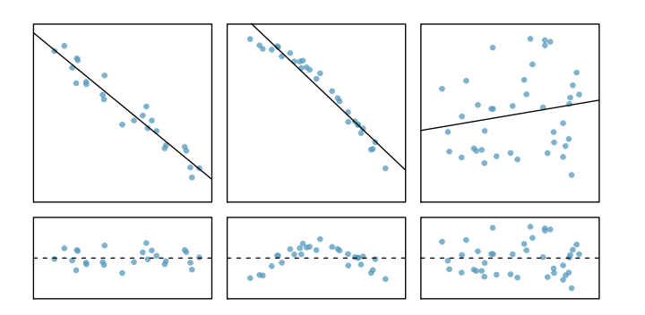
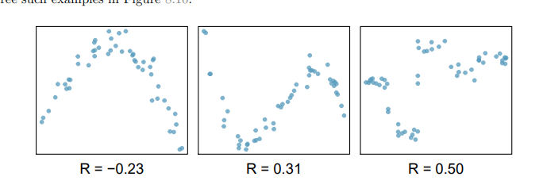
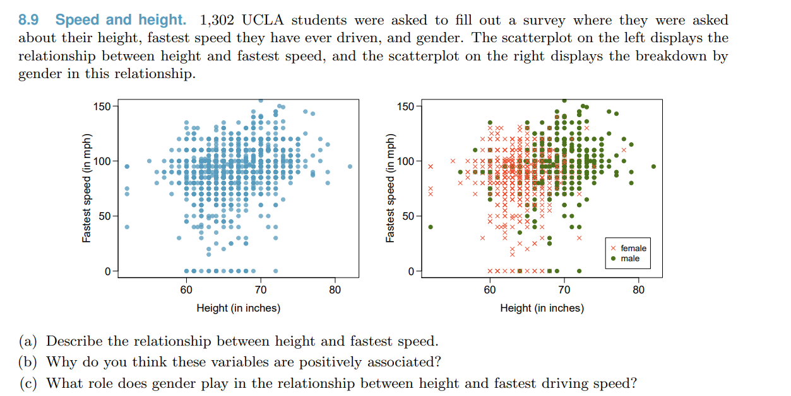
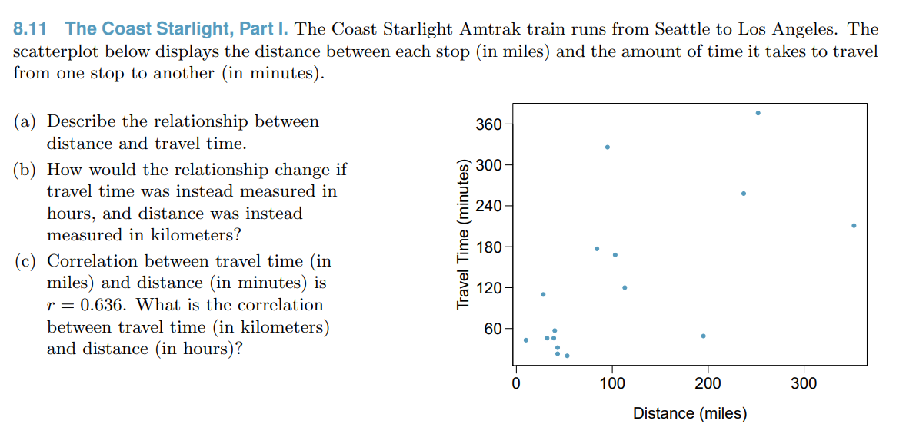
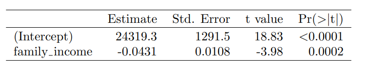
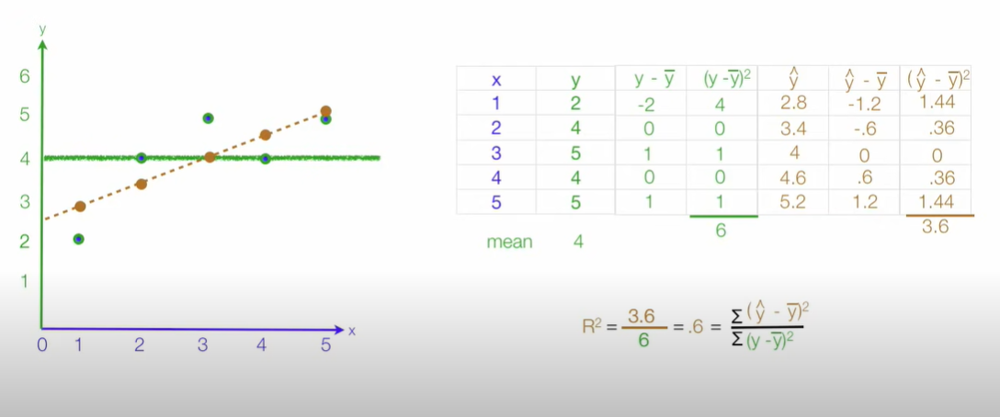
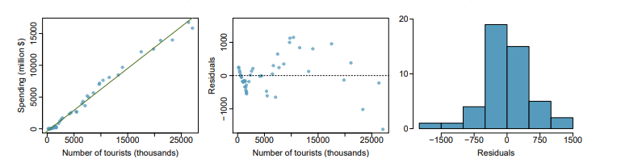
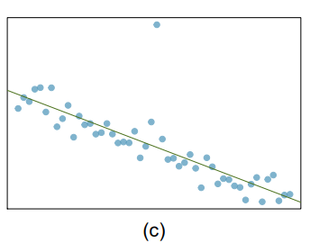
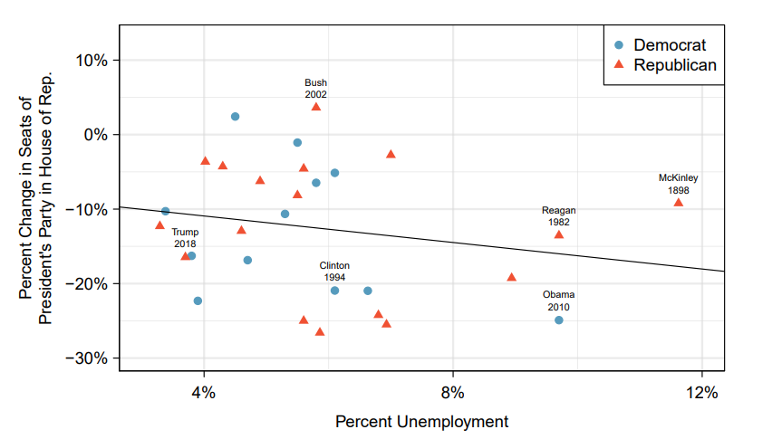
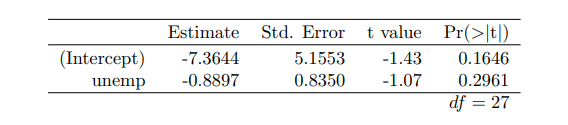

# Introduction to linear regression

## 8.1 Fottomg a line, residuals , and correlation

---

### 8.1.1 fitting a line to data

**용어정리**

$y = \beta_0 + \beta_1x +\epsilon$

$y :$ response variable

$x :$ Predictor(=explanatory) variable

$\beta_0,\beta_1 :$ model’s parameters | $b_0, b_1 :$ point estimates of model’s parameter

$\epsilon :$ error = gaussian error(?) 가우시안 분포를 따르는 경우 gaussian error라고 함.

### 8.1.2 Using linear regression to predict possum head lengths

possum 104마리의 total length와 head length를 잰 뒤 이를 scatterplot으로 그래프를 그렸음.

그래프를 보니 total length는 head length와 linear한 관계가 있음을 확인했음.

$\hat{y} = 41 + 0.59x$

$\hat{y}$ : estimate of response

### 8.1.3 Residual : Difference between observed and expected

$Data = Fit + Residual$

- Residuals are the leftover variation in the data after accounting for the model fit.
- One goal in picking the right linear model is for these residuals to be as small as possible

**Residual 공식**

$\large e_i = y_i - \hat{y_i}$

$e_i$ : residual(=error)

$y_i :$ the observed response(=value)

$\hat{y_i} :$ the response that we would predict. we typically identify $\hat{y}$ by plugging $x_i$ into the model.

**Residual plot**

Residuals are helpful in evaluating how well a linear model fits a data set. The residuals are plotted at their original horizontal locations but with the vertical coordinate as the residual.

**Residual plot 이해하기**

- 첫번째 plot
  - residual plot으로 pattern을 발견할 순 없음. line=0을 기준으로 random하게 residual이 있다는 것은 알겠다.
- 두번째 plot
  - Residual의 pattern이 보임. linear 모델보다는 더욱 complex한 모델을 사용하는게 좋다는 생각임
- 세번째 plot
  - line =0을 기준으로 residual이 크게 퍼져있음. 우리가 추측한 $\beta_1$인 $b_1$이 사실은 어떠한 추세가 있는게 아니고 사실은 추세가 없지만($b_1 = 0$) 자연 발생적인 오차값이 아닌가 하는 의심이 든다. p-value가 0.05 이상이 될 수도 있지 않을까 하는 의심이 들정도로 residual이 random하게 퍼져있음.

### 8.1.4 Describing linear relationships with correlation

그래프로 linear한 관계를 찾지 않고 계량화된 방법으로 linear한 관계를 찾는 방법임.

**Correlation($R$) : Strength of a linear relationship**

Correlation coefficient의 범위는 -1 ~ 1 사이이며 R이라는 용어로 표현됨.

**Correlation coefficient공식**

$R = \LARGE\frac{1}{n-1}\sum\frac{x_i-\bar{x}}{s_x}\frac{y_i-\bar{y}}{s_y}$ **또는**

$\bar{x},\bar{y} :$ Sample mean || $s_x,s_y :$ std

**분포별 corelation**

**correlation으로 확인되지 않는 추세**

### Exercise

**confounding variable**

**Changing unit doesn’t affect correlation. Changing the units, even if just for one of the variables, will not change the form, direction or strength of the relationship between the two variables.**

## 8.2 Least squares regression

---

8.1에서는 linear model을 시각적으로 추론해왔다면 8.2에서는 공식을 활용해 linear model을 찾아본다. (Fitting linear models by eyes is open to criticism since it is based on an individual’s preference.)

### 8.2.1 Gift aid freshman at Elmhurst college

### 8.2.2 An objective measure for finding the best line

**모델을 선정하는 기준 : least squares criterion(= least squares line) 의 최솟값**

$e^2_1 + e^2_2 +e^2_3 + \cdots + e^2_n$

**제곱을 쓰는 이유**

- 오차가 작은 것은 더 작게 큰 것은 더 크게 만듬
- 일반적으로 쓰이는 방법

### 8.2.3 Conditions for the least squares line

제곱을 쓰기 위해서는 네 가지 조건이 충족되어야 함.

**Linearity**

linear trend를 보여야함.

c

일반적으로 residuals가 normal distribution이어야 함. Outlier가 있다면 normal distribution이 안될 가능성이 높다.

**Constant variability**

It means that when you plot the individual error against the predicted value, the variance of the error predicted value should be constant. See the red arrows in the picture below, the length of the red lines (a proxy of its variance) are the same.

**Independent observations**

개별 사건간 관련이 없어야함. 만일 시계열 데이터를 다룰일이 있다면 개별 value는 independent가 아닐 가능성이 높으니 유의해야한다.

**insufficient data to apply least squares line**

1. Linearlity fail | 2. outliers | 3. variability of errors | 4. a time series

### 8.2.4 Finding the least squares line

- **The slope of the least squares line**

$b_1 = \LARGE{\frac{s_y}{s_x}}\large R$

$R :$ Correlation

$s_x, s_y :$ std of the explanatory variable and response

- **The point $(\bar{x},\bar{y})$ is on the least sqaures line**
  $\bar{x},\bar{y}  :$ x와 y의 평균값
- **Least square line formular**

$b_1 = \large \frac{y-\bar{y}}{x-\bar{x}}$ ⇒ $b_1(x-\bar{x}) = y-\bar{y}$ ⇒ $b_0 = \bar{y}-b_1\bar{x}$

**R에서 coefficient 구하기**

R에서 least squared line의 coefficient를 구하면 아래와 같은 결과가 나온다. Estimate는 $b_0$과 $b_1$을 의미한다. 이는 우리가 구한 값이 모집단의 parameter인 $\beta_0$와 $\beta_1$이 아니기 때문이다. 표본으로 측정한 값이므로 std.Error와 t value, probability가 같이 나온다.

**Q. x,y 평균, s_x, s_y 모두 상수라면 estimate도 상수로 고정되어야 할텐데 std error가 있는 이유는?**

나중에 실력이 쌓인뒤 해결해보자. 지금 역량으로는 찾아도 이해가 되지 않음.

### 8.2.5 Interpreting regression model parameter estimates

### 8.2.6 Extrapolation is treacherous

### 8.2.7 Using $R^2$ to describe the strength of a fit

R은 두 variable의 correlation 정도를 확인하는데 쓰인다. 범위는 -1 ~ 1사이이며 0에 가까워질수록 두 variable 간 correlation은 약해진다. $R$을 구하는 계산식은 $R^2$을 구하는 계산식 보다 복잡하므로 통계에서는 주로 $R^2$를 사용한다. 분포별로 TSS가 고정되어 있으므로 모델끼리 오류 차이가 몇배 나는지 알 수 있다. 즉 개별 모델들을 $R^2$를 기반으로 비교하는 것은 $\frac{RSS_1}{RSS_2}$을 비교하는 것과 같다.

**$R^2$formula**

RSS(Residual sum of squares) : 제작한 모델을 기준을 residual을 제곱하여 더한 값

TSS(Total sum of squares) : 표본의 평균을 기준으로 residual을 제곱하여 더한 값

분포별 TSS는 고정된다. 반면 RSS는 linear model의 coef에 따라 값이 달라진다. 그러므로 RSS가 작을수록 $R^2$은 커진다. TSS는 표본의 평균인 초록색 선을 바탕으로 residual을 계산한다. 수평선은 correlation이 0라는 것을 의미하므로 correlation이 0일 때의 residual을 말한다. 이는 해당 분포에서 계산 가능한 최대의 residual이다.

반면 RSS는 갈색 점선을 바탕으로 residual을 계산한다. 해당 직선을 활용해 계산한 residual이 작을수록 두 variable 간 correlation이 높다고 보면 된다. RSS의 값은 0 ~ TSS범위 안에서 결정된다. 0은 두 variable의 linearity가 최대라는 말이고 TSS는 두 variable 간 correlation이 없다는 의미이다.

**$R^2$해석하기**

$R^2$= 0.40은 40%의 value가 linear line 위에 있다는 의미이다. (추가적으로 공부해서 내용 추가해야할 듯)

### 8.2.8 Categorical predictors with two levels

### Exercise

**8.21 Conditions for the least squares line**

- Linearity
  scatterplot을 보니 linear trend를 확인할 수 있다.
- nearly normal residual
  histogram을 보니 residual은 normal distribution을 따르고 있다.
- **variability constant**
  **residual plot을 보니 variability가 constant가 아니다.**
- independent observations
  value가 선정될때 서로에게 영향을 주지 않음.
- **residual plot 가치 이해하기**
  Even though the relationship appears linear in the scatterplot, the residual plot actually shows a nonlinear relationship. This is not a contradiction: residual plots can show divergences from linearity that can be difficult to see in a scatterplot. A simple linear model is inadequate for modeling these data. It is also important to consider that these data are observed sequentially, which means there may be a hidden structure not evident in the current plots but that is important to consider.

## 8.3 Types of outliers in linear regression

---

**중요!! Least squares line은 Outlier에게 영향을 많이 받는다. 그렇다고 무작정 outlier를 지운다면 예외적인 경우를 포함하지 않게 되므로 성능이 저하될 수 있음. 예측 정확도와 예외 경우를 포함하는 건 trade off 관계이다.**

**용어정리**

- points with high leverage
  center of cloud 보다 한참 멀게 위치한 points를 칭하는 용어
- influential point
  high leverage points 중 model의 기울기에 영향을 주는 point를 의미한다. 3,4,5번이 그러하다.

### Exercise

**8.27 Point with high leverage가 아닌 경우 x축의 중심에 outlier가 있다.**

## 8.4. Inference for linear regression

---

regression line의 slope와 y-intercept에 대한 불확실성을 이야기하는 장이다.

### 8.4.1 Midterm elections and unemployment

실업률이 중간선거의 결과에 미치는 영향 조사. 그래프를 보더라도 variable간 linear trend를 읽기 어려움.

그래프와 같이 slope를 구할 수 있지만 linear trend가 있기 때문에 이렇게 그려진 것인지 실제로는 trend가 없지만 표본에 의해 linear trend가 있어 보이게 나타났는지 의구심이 들 수 있다.

$H_0$ : $\beta_1 =0$ 실제 linear model은 slope가 0일 것이다.

$H_1$ : $\beta_1 =0$ 실제 linear model은 slope가 0이 아닐 것이다.

R 소프트웨어를 활용해 coefficient를 얻은 결과 p-value는 0.05 이상임. $H_0$을 기각할 수 없다.

**Confidence intervals for coefficients**

$b_i \pm t^*_{df} \times SE_{b_i}$
