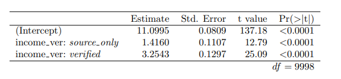
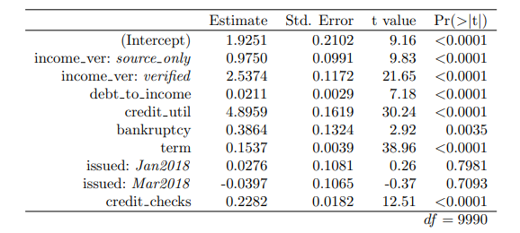
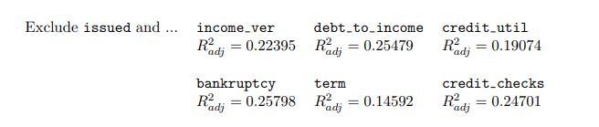
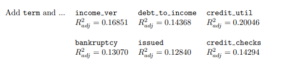

# logistic regression

## 9.1 Introduction to multiple regression

---

### 용어정리

- **Multiple regression**

  $x$를 여러 개 사용하는 regression 모델을 multiple regression이라고 한다.

  $\hat{y} = \beta_0 + \beta_1x_1 +\beta_2x_2\cdots+\beta_kx_k$

- Predictor variables : $x_1,x_2$등을 말함.

- Indicator variables : binary category를 말함.

  ex) 1이면 yes, 0이면 no

- y 기호 종류

  $\hat{y}$ : estimate of response

  $\bar{y}$ : mean of estimates

  $y$ : Response variables

- **reference level**

  income_ver에는 source_only, verified, not 이렇게 3개의 class(=level)가 있다. 아래 표는 모델의 coef를 나타내며 이를 활용하면 예측 공식을 만들 수 있다.

   

  $\hat{y}= source\;only\times x_1 \; + verified \times x_2 + intercpet$

   

  하지만 완성된 식에는 ource_only, verified는 있지만 있어야할 not은 없다. not이 생략된건 $x_1$과 $x_2$가 0일때 not에 해당하는 값을 계산할 수 있기에 생략한 것이다. 이처럼 not과 같은 level을 reference level이라 칭한다.
  

**Colinear**

ncomve_ver variables의 변수들을 비교해보자. income_ver: source_only의 coef는 1.416 ⇒ 0.9750으로, income_ver: verified의 coef는 3.2543 ⇒ 2.5374으로 내려갔다. predictor variable($x_k$)가 4개 늘어났을 뿐인데 coef가 달라졌다. 이는 predictor variable들이 response variable와의 관계 뿐 아니라 개별 predictor variable 끼리도 correlation이 존재하여 비롯된 것이다. colinear이라는 용어는 방금 에시처럼 predictor variable 끼리도 존재하는 연관성을 설명하는데 사용된다. multiple regression이 bias를 반영하는 것도 이러한 colinearity가 존재하기 때문에 가능하다. 단순히 variable 끼리 덧셈만 했을 뿐인데 그 결과는 predictor variable간 colinearity로 bias가 조정되어 더 좋은 예측을 할 수 있게 된다.

- **Sometimes there are underlying structues or relationships between predictor variables.**
- We would like to fit a model that includes all potentially important variables simultaneously. This would help us evaluate the relationship between a predictor variable and the outcome while controlling for the potential influence of other variables.
- When we use both variables, this particular underlying and unintentional bias is reduced or eliminated.

variable을 income_ver만 사용할 때

      income_ver variable 외 여러 변수를 사용할 때

### 9.1.3 Adjusted $R^2$as a better tool for multiple regression

$R^2$은 모델 성능을 비교할 때 활용된다. multiple regression에서 $R^2$ 를 활용하려면 약간의 보정을 주어야 한다. $R^2$는 predictor variable이 증가할수록 값이 커지는 경향이 있다.

$R^2_{adj} = 1-\large\frac{s^2_{residuals}}{s^2_{outcome}} \times \frac{n-1}{n-k-1}$

n: instance 개수 | k : predictor variable 개수

$s^2_{outcome} =RSS=SSE = e^2_1+e^2_2+e^2_3+\cdots+ e^2_{10000} = \sum e^2_i = \sum(y_i-\hat{y})^2$

**용어가 조금씩 다를뿐 본질적으로 다르지 않다.**

> In regression analysis, the term mean squared error is sometimes used to refer to the unbiased estimate of error variance: the residual sum of squares divided by the number of degrees of freedom.

sum of the squared residuals(SSR) = residual sum of squares(RSS)

Sum of the squared error(SSE)

Mean squared error(MSE) = 1/n\* SSE

**MSE와 Variance 차이**

> Variance is the average of squared deviation of **the observations from the mean**. The MSE in contrast is the average of squared deviations of **the predictions from the true values**.

MSE = 관찰값과 실제값의 차이를 제곱한 평균 | var = 평균과 관찰값의 차이를 제곱한 평균

$MSE = \large\frac{\sum(y_i - \hat{y}_i) ^2}{n-2} \;\;\;\;|\;\;\;\;var(x) = \frac{\sum(X - \bar{X}) ^2}{n-1}$

$e_i = y_i - \hat{y}$ | residual = data - fit deviation
= $|X-\bar{X}|$ | deviation = observations - mean

## 9.2 Model selection

---

불필요한 variables를 지우는 방법을 배운다.

**용어정리**

- parsimonious : 불필요한 variables을 지우고 완성된 모델을 부르는 용어
- full model : 모든 variable이 반영되어 있는 모델을 말함.

### 9.2.1 Identifying variables in the model that may not be helpful

Adjusted $R^2$ describes the strength of a model fit, and it is a useful tool for evaluating which predictors are adding value to the model.

- adding value
  it is likely improving the accuracy in predicting future outcomes.

### 9.2.2 Two model selection strategies

$R^2_{adj}$를 활용해 variables를 선정 또는 제거 하는 방법이 있다.

- **backward elimination**

  full model에서 variable을 하나씩 뺀 다음 $R^2$를 계산해 비교하여 가장 낮은 variable을 제거한다. 이러한 방법을 계속 반복하면서 가장 큰 $R^2$를 갖는 모델을 찾는다. 제거하는 하는 경우보다 제거하지 않은 경우의 $R^2$가 크다면 탐색을 종료한다.

  Full model의 $R^2$은 0.25843이다. 이보다 높은 값이 있다면 해당 모델을 택해야한다. 7개의 variable로 모델을 만들었기에 variable이 하나씩 배제하여 학습한 모델의 $R^2$을 계산한다. 계산 결과를 보면 issued variable이 제거된 모델의 $R^2$가 full model보다 0.0001 높다는걸 알 수 있다.

  

  아래 계산 결과는 issued variable을 제외하고 추가적으로 개별 하나씩 variable을 제거한 뒤 학습한 모델의 $R^2$값이다. 아래의 모델들은 0.25844보다 높은 $R^2$를 가지지 않았다. 따라서 탐색을 종료한다.

  

- **forward selection**
  backforward elimination 방법과는 정반대로 수행한다. 처음에는 하나의 variable을 만들어 $R^2$를 계산해 비교한다. 가장 큰 $R^2$를 갖는 variable을 찾으면, 선택된 variable + 선택되지 못한 variable 중 1개씩 $R^2$를 계산해 가장 큰 $R^2$를 갖는 variable을 선택한다. 가장 큰 $R^2$를 가지는 모델을 찾는다. 추가한 경우보다 추가하지 않은 경우의 $R^2$가 크다면 탐색을 종료한다.
  아래와 같이 점차적으로 variable을 추가하다보면 가장 큰 $R^2$을 가지는 모델을 찾게된다.
  
  
  

두 가지 방식의 결과가 항상 같은건 아니다. 따라서 두 방법을 사용하여 더 큰 $R^2$를 가진 모델을 선택하는게 일반적으로 수행하는 방법이다.

## 9.3 Checking model conditions using graphs

---

이번에는 multiple regression 사용이 적합한지를 검토하는 단계이다.

multiple regression 적용이 적절한지 판단하기 위해서는 네가지 조건에 부합해야한다.

### Check for outlier

**the residuals of the model are nearly normal (less important for larger data set)**

residuals의 분포가 normal distribution을 따르는지 검토해야한다. 히스토그램을 활용하면 residual의 분포를 쉽게 확인 가능하다. outlier가 존재하는지 검토하고 필요하다면 데이터 전처리 과정을 거쳐 outlier를 제거하자.

### Absolute values of residuals against fitted values

**the variability of the residuals is nearly constant**

full model에 대한 fitted values( $\hat{y}$ )와 residuals을 비교하자. 초록색 점선은 residual이 approximately constant한지 확인하는 라인이다. 아래 plot은 $\hat{y}$가 증가할수록 residual이 조금씩 늘어나고 있음을 확인할수 있다.

### Residuals in order of their data collection

**the residuals are independent (모르겠다. 공부해야한다.)**

데이터는 시간이 지남에 따라 축적되기 마련이다. 축적된 데이터는 시간의 흐름과 관련성이 있을수도 있다. 따라서 시간 순서에 맞게 축적된 데이터가 linearity를 따르는지 여부를 검증해야할 필요가 있다.

### Residuals against each predictor variable

**each variable is linearly related to the outcome**$(\hat{y})$

개별 variable과 outcome($\hat{y}$)을 residual을 가지고 비교하는 plot을 그린다. y축인 residuals이 0이라면 예측과 실제가 맞다는 말이다. 웬만한 크기의 data set을 분석하지 않는이상 오차 범위가 존재하게 되므로 residual값이 0% 근처에 많이 밀집될수록 $\hat{y}$를 예측하는데 중요한 variable이라고 생각할 수 있다. 일례로 맨 앞에 있는 boxplot을 보면 verified, not, source_only 세 지표별로 residual의 밀집 차이를 알 수 있다. 이는 verified가 다른 level보다 $\hat{y}$를 더 정확하게 예측할 수 있다는 말이다.

scatter plot은 초록색 점선으로 linearity를 파악할 수 있다. x값 변화에 따라 점선의 변화가 크지 않다면 x값과 $\hat{y}$이 선형관계에 있다고 볼 수 있다. x값이 변화함에 따라 y값이 변화한다. residual이 일정하다는 말은 $\hat{y}$도 x값의 증감에 따라 변한다는 의미이자 동시에 y와 $\hat{y}$이 일정하게 증감한다는 의미이기도 하다.

왼쪽 중간 credit utilization의 residual plot을 보면 x값 변화에 따라 residual이 거의 일정하다가 하락한다. x값이 1.0까지는 $\hat{y}$이 x값 변화에 따른 y의 변화를 잘 따라가고 있음을 확인할 수 있다. 하지만 그 이후로는 $\hat{y}$와 y의 차이가 발생해 점선이 하락한다. 즉 $\hat{y}$는 1.0 이후에는 변화에 따르는 예측을 제대로 수행하지 못하고 있다.

